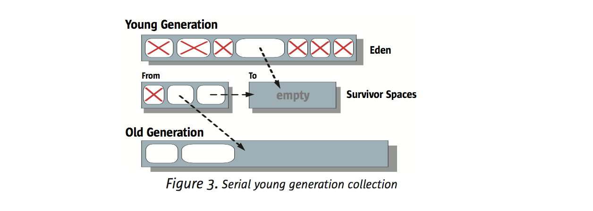
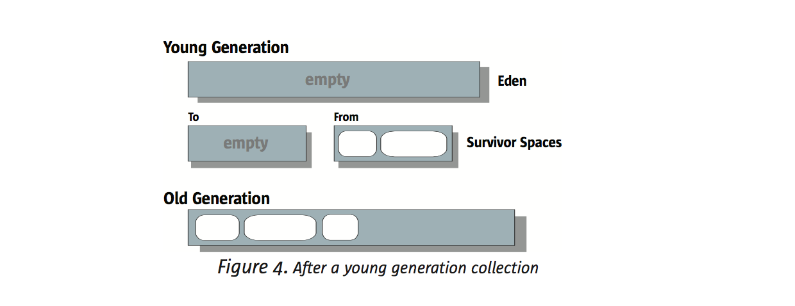
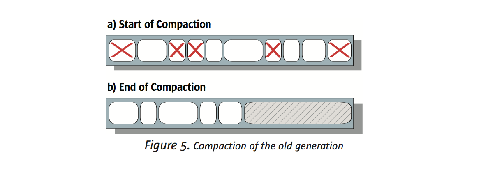
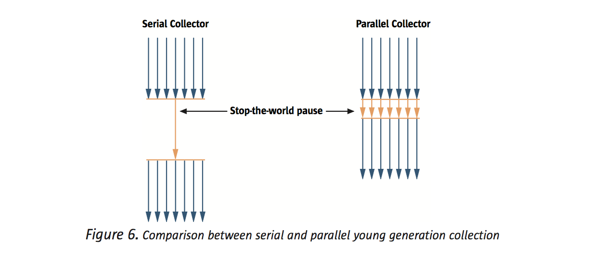
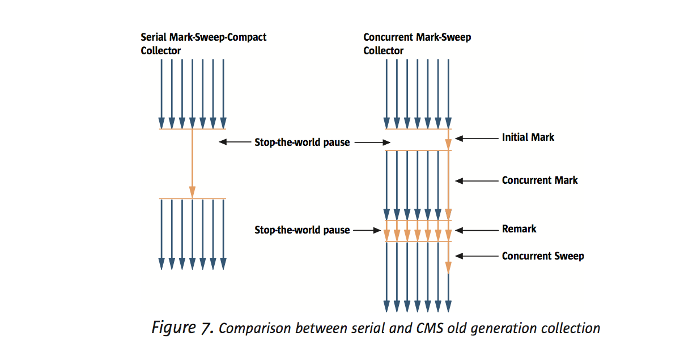
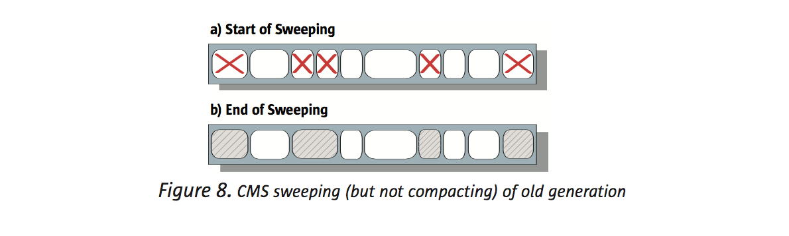
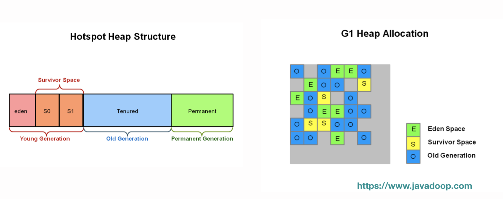
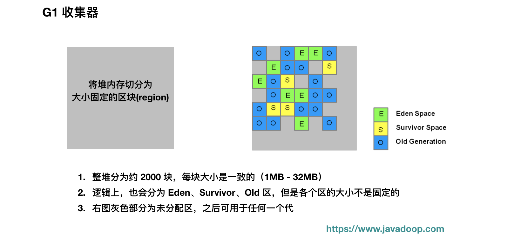
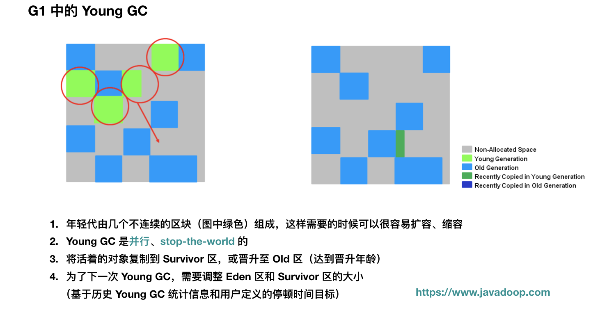

# 垃圾回收器

## 垃圾收集概念

GC 需要做 3 件事情：

- 分配内存，为每个新建的对象分配空间
- 确保还在使用的对象的内存一直还在，不能把有用的空间当垃圾回收了
- 释放不再使用的对象所占用的空间

我们把还被 **GC Roots** 引用的对象称为**活的**，把不再被引用的对象认为是**死的**，也就是我们说的垃圾，GC 的工作就是找到死的对象，回收它们占用的空间。

在这里，我们总结一下 GC Roots 有哪些：

- 当前各线程执行方法中的局部变量（包括形参）引用的对象
- 已被加载的类的 static 域引用的对象
- 方法区中常量引用的对象
- JNI 引用（java native本地方法）

我们把 GC 管理的内存称为 **堆（heap）**，垃圾收集启动的时机取决于各个垃圾收集器，通常，垃圾收集发生于整个堆或堆的部分已经被使用光了，或者使用的空间达到了某个百分比阈值。这些后面都会具体说，这里的每一句话都是对应了某些场景的。

对于内存分配请求，实现的难点在于在堆中找到一块没有被使用的确定大小的内存空间。所以，对于大部分垃圾回收算法来说**避免内存碎片化**是非常重要的，它将使得空间分配更加高效。

### 垃圾收集器的理想特征

1. 安全和全面：活的对象一定不能被清理掉，死的对象一定不能在几个回收周期结束后还在内存中。
2. 高效：不能将我们的应用程序挂起太长时间。我们需要在时间、空间、频次上作出权衡。比如，如果堆内存很小，每次垃圾收集就会很快，但是频次会增加。如果堆内存很大，很久才会被填满，但是每一次回收需要的时间很长。
3. 尽量少的内存碎片：每次将垃圾对象释放以后，这些空间可能分布在各个地方，最糟糕的情况就是，内存中到处都是碎片，在给一个大对象分配空间的时候没有内存可用，实际上内存是够的。消除碎片的方式就是**压缩**。
4. 可扩展性：在多核多线程应用中，内存分配和垃圾回收都不应该成为可扩展性的瓶颈。**原文提到的这一点，我的理解是：单线程垃圾回收在多核系统中会浪费 CPU 资源，如果我理解错误，请指正我。**

### 设计上的权衡

往下看之前，我们需要先分清楚这里的两个概念：并发和并行

- **并行**：多个垃圾回收线程同时工作，而不是只有一个垃圾回收线程在工作
- **并发**：垃圾回收线程和应用程序线程同时工作，应用程序不需要挂起

在设计或选择垃圾回收算法的时候，我们需要作出以下几个权衡：

- **串行 vs 并行**

  串行收集的情况，即使是多核 CPU，也只有一个核心参与收集。使用并行收集器的话，垃圾收集的工作将分配给多个线程在不同的 CPU 上同时进行。并行可以让收集工作更快，缺点是带来的复杂性和内存碎片问题。

- **并发 vs Stop-the-world**

  当 stop-the-world 垃圾收集器工作的时候，应用将完全被挂起。与之相对的，并发收集器在大部分工作中都是并发进行的，也许会有少量的 stop-the-world。

  stop-the-world 垃圾收集器比并发收集器简单很多，因为应用挂起后**堆空间不再发生变化**，它的缺点是在某些场景下挂起的时间我们是不能接受的（如 web 应用）。

  相应的，并发收集器能够降低挂起时间，但是也更加复杂，因为在收集的过程中，也会有新的垃圾产生，同时，需要有额外的空间用于在垃圾收集过程中应用程序的继续使用。

- **压缩 vs 不压缩 vs 复制**

  当垃圾收集器标记出内存中哪些是活的，哪些是垃圾对象后，收集器可以进行压缩，将所有活的对象移到一起，这样新的内存分配就可以在剩余的空间中进行了。经过压缩后，分配新对象的内存空间是非常简单快速的。

  相对的，不压缩的收集器只会就地释放空间，不会移动存活对象。优点就是快速完成垃圾收集，缺点就是潜在的碎片问题。通常，这种情况下，分配对象空间会比较慢比较复杂，比如为新的一个大对象找到合适的空间。

  还有一个选择就是复制收集器，将活的对象复制到另一块空间中，优点就是原空间被清空了，这样后续分配对象空间非常迅速，缺点就是需要进行复制操作和占用额外的空间。

###  

### 什么是stop the world

Java中Stop-The-World机制简称STW，是在执行垃圾收集算法时，Java应用程序的其他所有线程都被挂起（除了垃圾收集帮助器之外）。Java中一种全局暂停现象，全局停顿，所有Java代码停止，native代码可以执行，但不能与JVM交互；这些现象多半是由于gc引起。

 

GC时的Stop the World(STW)是大家最大的敌人。但可能很多人还不清楚，除了GC，JVM下还会发生停顿现象。

JVM里有一条特殊的线程－－VM Threads，专门用来执行一些特殊的VM Operation，比如分派GC，thread dump等，这些任务，都需要整个Heap，以及所有线程的状态是静止的，一致的才能进行。所以JVM引入了安全点(Safe Point)的概念，想办法在需要进行VM Operation时，通知所有的线程进入一个静止的安全点。

除了GC，其他触发安全点的VM Operation包括：

1. JIT相关，比如Code deoptimization, Flushing code cache ；

2. Class redefinition (e.g. javaagent，AOP代码植入的产生的instrumentation) ；

3. Biased lock revocation 取消偏向锁 ；

4. Various debug operation (e.g. thread dump or deadlock check)；

### 性能指标

以下几个是评估垃圾收集器性能的一些指标：

- 吞吐量：应用程序的执行时间占总时间的百分比，当然是越高越好
- 垃圾收集开销：垃圾收集时间占总时间的百分比（1 - 吞吐量）
- 停顿时间：垃圾收集过程中导致的应用程序挂起时间
- 频次：相对于应用程序来说，垃圾收集的频次
- 空间：垃圾收集占用的内存
- 及时性：一个对象从成为垃圾到该对象空间再次可用的时间

在交互式程序中，通常希望是低延时的，而对于非交互式程序，总运行时间比较重要。实时应用程序既要求每次停顿时间足够短，也要求总的花费在收集的时间足够短。在小型个人计算机和嵌入式系统中，则希望占用更小的空间。

### 分代收集介绍

当我们使用分代垃圾收集器时，内存将被分为不同的**代(generation)**，最常见的就是分为**年轻代**和**老年代**。

在不同的分代中，可以根据不同的特点使用不同的算法。分代垃圾收集基于 **weak generational hypothesis** 假设（通常国人会翻译成 **弱分代**假设）：

- 大部分对象都是短命的，它们在年轻的时候就会死去
- 极少老年对象对年轻对象的引用

年轻代中的收集是非常频繁的、高效的、快速的，因为年轻代空间中，通常都是小对象，同时有非常多的不再被引用的对象。

那些**经历过多次年轻代垃圾收集还存活的对象**会晋升到老年代中，老年代的空间更大，而且占用空间增长比较慢。这样，老年代的垃圾收集是不频繁的，但是进行一次垃圾收集需要的时间更长。

对于新生代，需要选择速度比较快的垃圾回收算法，因为新生代的垃圾回收是频繁的。

对于老年代，需要考虑的是空间，因为老年代占用了大部分堆内存，而且针对该部分的垃圾回收算法，需要考虑到这个区域的**垃圾密度比较低**。

## J2SE 5.0 HotSpot JVM 中的垃圾收集器

J2SE 5.0 HotSpot 虚拟机包含四种垃圾收集器，都是采用分代算法。包括**串行收集器**、**并行收集器**、**并行压缩收集器** 和 **CMS 垃圾收集器**。

### HotSpot 分代

在 HotSpot 虚拟机中，内存被组织成三个分代：年轻代、老年代、永久代。

大部分对象初始化的时候都是在年轻代中的。

老年代存放经过了几次年轻代垃圾收集依然还活着的对象，还有部分大对象因为比较大所以分配的时候直接在老年代分配。

> 如 -XX:PretenureSizeThreshold=1024，这样大于 1k 的对象就会直接分配在老年代

永久代，通常也叫 **方法区**，用于存储已加载类的元数据，以及存储运行时常量池等。

### 垃圾回收类型

当年轻代被填满后，会进行一次年轻代垃圾收集（也叫做 **minor GC**）。

> 下面这两段我也没有完全弄明白，弄明白会更新。至少读者要明白一点，"minor gc 收集年轻代，full gc 收集老年代" 这句话是错的。

当老年代或永久代被填满了，会触发 **full GC**（也叫做 **major GC**），full GC 会收集所有区域，先进行年轻代的收集，使用年轻代专用的垃圾回收算法，然后使用老年代的垃圾回收算法**回收老年代和永久代**。如果算法带有压缩，每个代分别独立地进行压缩。

如果先进行年轻代垃圾收集，会使得老年代不能容纳要晋升上来的对象，这种情况下，不会先进行 young gc，所有的收集器都会（除了 CMS）**直接采用老年代收集算法对整个堆进行收集**（CMS 收集器比较特殊，因为它不能收集年轻代的垃圾）。

> 基于统计，计算出每次年轻代晋升到老年代的平均大小，if (老年代剩余空间 < 平均大小) 触发 full gc。

### 快速分配

如果垃圾收集完成后，存在大片连续的内存可用于分配给新对象，这种情况下分配空间是非常简单快速的，只要一个简单的指针碰撞就可以了（**bump-the-pointer**），每次分配对象空间只要检测一下是否有足够的空间，如果有，指针往前移动 N 位就分配好空间了，然后就可以初始化这个对象了。

对于多线程应用，对象分配必须要保证线程安全性，如果使用全局锁，那么分配空间将成为瓶颈并降低程序性能。HotSpot 使用了称之为 **Thread-Local Allocation Buffers (TLABs)** 的技术，该技术能改善多线程空间分配的吞吐量。首先，给予每个线程一部分内存作为缓存区，每个线程都在自己的缓存区中进行指针碰撞，这样就不用获取全局锁了。只有当一个线程使用完了它的 TLAB，它才需要使用同步来获取一个新的缓冲区。HotSpot 使用了多项技术来降低 TLAB 对于内存的浪费。比如，TLAB 的平均大小被限制在 Eden 区大小的 1% 之内。TLABs 和使用指针碰撞的线性分配结合，使得内存分配非常简单高效，只需要大概 10 条机器指令就可以完成。

### 串行收集器

使用串行收集器，年轻代和老年代都使用单线程进行收集（使用一个 CPU），收集过程中会 stop-the-world。所以当在垃圾收集的时候，应用程序是完全停止的。

**在年轻代中使用串行收集器**

下图展示了年轻代中使用串行收集器的流程。

年轻代分为**一个 Eden 区和两个 Survivor 区（From 区和 To 区）**。年轻代垃圾收集时，将 Eden 中活着的对象复制到空的 Survivor-To 区，Survivor-From 区的对象分两类，一类是年轻的，也是复制到 Survivor-To 区，还有一类是老家伙，晋升到老年代中。

> Survivor-From 和 Survivor-To 是我瞎取的名字。。。

如果复制的过程中，发现 Survivor-To 空间满了，将剩下还没复制到 Survivor-To 的来自于 Eden 和 Survivor-From 区的对象直接晋升到老年代。

年轻代垃圾收集完成后，Eden 区和 Survivor-From 就干净了，此时，将 Survivor-From 和 Survivor-To 交换一下角色。得到下面这个样子：

**在老年代中使用串行收集器**

如果使用串行收集器，在老年代和永久代将通过使用 **标记 -> 清除 -> 压缩** 算法。标记阶段，收集器识别出哪些对象是活的；清除阶段将遍历一下老年代和永久代，识别出哪些是垃圾；然后执行压缩，将活的对象左移到老年代的起始端（永久代类似），这样就留下了右边一片连续可用的空间，后续就可以通过指针碰撞的方式快速分配对象空间。

**何时应该使用串行收集器**

串行收集器适用于运行在 client 模式下的大部分程序，它们不要求低延时。在现代硬件条件下，串行收集器可以高效管理 64M 堆内存，并且能将 full GC 控制在半秒内完成。

**使用串行收集器**

它是 J2SE 5.0 版本 HotSpot 虚拟机在非服务器级别硬件的默认选择。你也可以使用 `-XX:+UseSerialGC` 来强制使用串行收集器。

### 并行收集器

现在大多数 Java 应用都运行在大内存、多核环境中，**并行收集器**，也就是大家熟知的**吞吐量收集器**，利用多核的优势来进行垃圾收集，而不是像串行收集器一样将程序挂起后只使用单线程来收集垃圾。

**在年轻代中使用并行收集器**

并行收集器在年轻代中其实就是串行收集器收集算法的并行版本。它仍然使用 stop-the-world 和复制算法，只不过使用了多核的优势并行执行，降低垃圾收集的时间，从而提高吞吐量。下图示意了在年轻代中，串行收集器和并行收集器的区别：

**在老年代中使用并行收集器**

在老年代中，并行收集器使用的是和串行收集器一样的算法：**单线程，标记 -> 清除 -> 压缩**。

> 是的，并行收集器只能在年轻代中并行

**何时使用并行收集器**

其适用于多核、不要求低停顿的应用，因为老年代的收集虽然不频繁，但是每次老年代的**单线程垃圾收集**依然可能会需要很长时间。比如说，它可以应用在批处理、账单计算、科学计算等。

你应该不会想要这个收集器，而是要一个可以对每个代都采用并行收集的**并行压缩收集器**，下一节将介绍这个。

**使用并行收集器**

前面我们说了，J2SE 5.0 中 client 模式自动选择使用串行收集器，如果是 server 模式，那么将自动使用并行收集器。在其他版本中，显示使用 -XX:+UseParallelGC 可以指定并行收集器。

### 并行压缩收集器

并行压缩收集器于 J2SE 5.0 update 6 引入，和并行收集器的区别在于它在老年代也使用并行收集算法。注意：并行压缩收集器终将会取代并行收集器。

**在年轻代中使用并行压缩收集器**

并行压缩收集器在年轻代中使用了和并行收集器一样的算法。即使用 **并行、stop-the-world、复制** 算法。

**在老年代中使用并行压缩收集器**

在老年代和永久代中，其使用 **并行、stop-the-world、滑动压缩** 算法。

一次收集分三个阶段，首先，将老年代或永久代逻辑上分为固定大小的区块。

1. **标记阶段**，将 GC Roots 分给多个垃圾收集线程，每个线程并行地去标记存活的对象，一旦标记一个存活对象，在**该对象所在的区块**记录这个对象的大小和对象所在的位置。

2. **汇总阶段**，此阶段针对区块进行。由于之前的垃圾回收影响，老年代和永久代的左侧是 **存活对象密集区**，对这部分区域直接进行压缩的代价是不值得的，能清理出来的空间有限。所以第一件事就是，检查每个区块的密度，从左边第一个开始，直到找到一个区块满足：**对右侧的所有区块进行压缩获得的空间抵得上压缩它们的成本**。这个区块左边的区域过于密集，不会有对象移动到这个区域中。然后，计算并保存右侧区域中每个区块被压缩后的新位置首字节地址。

   右侧的区域将被压缩，对于右侧的每个区块，由于每个区块中保存了该区块的存活对象信息，所以很容易计算每个区块的新位置。注意：**汇总阶段目前被实现为串行进行**，这个阶段修改为并行也是可行的，不过没有在标记阶段和下面的压缩阶段并行那么重要。

3. **压缩阶段**，在汇总阶段已经完成了每个区块新位置的计算，所以压缩阶段每个回收线程**并行**将每个区块复制到新位置即可。压缩结束后，就清出来了右侧一大片连续可用的空间。

**何时使用并行压缩收集器**

首先是多核上的并行优势，这个就不重复了。其次，前面的并行收集器对于老年代和永久代使用串行，而并行压缩收集器在这些区域使用并行，能降低停顿时间。

并行压缩收集器不适合运行在大型共享主机上（如 SunRays），因为它在收集的时候会独占几个 CPU，在这种机器上，可以考虑减少垃圾收集的线程数（通过 –XX:ParallelGCThreads=n），或者就选择其他收集器。

**使用并行压缩收集器**

显示指定：`-XX:+UseParallelOldGC`

### Concurrent Mark-Sweep（CMS）收集器

> 重头戏 CMS 登场了，至少对于我这个 web 开发者来说，**目前** CMS 最常用（使用 JDK8 的应用一般都切换到 G1 收集器了）。前面介绍的都是并行收集，这里要介绍并发收集了，也就是垃圾回收线程和应用程序线程同时运行。

对于许多程序来说，吞吐量不如响应时间来得重要。通常年轻代的垃圾收集不会停顿多长时间，但是，老年代垃圾回收，虽然不频繁，但是可能导致长时间的停顿，尤其当堆内存比较大的时候。为了解决这个问题，HotSpot 虚拟机提供了 CMS 收集器，也叫做 **低延时收集器**。

**在年轻代中使用 CMS 收集器**

在年轻代中，CMS 和 **并行收集器** 一样，即：**并行、stop-the-world、复制**。

**在老年代中使用 CMS 收集器**

在老年代的垃圾收集过程中，大部分收集任务是和应用程序**并发**执行的。

- 初始标记(STW initial mark)
- 并发标记(Concurrent marking)
- 并发预清理(Concurrent precleaning)
- 重新标记(STW remark)
- 并发清理(Concurrent sweeping)
- 并发重置(Concurrent reset)

CMS 收集过程首先是一段小停顿 stop-the-world，叫做 **初始标记阶段（initial mark）**，用于确定 GC Roots。然后是 **并发标记阶段（concurrent mark）**，标记 GC Roots 可达的所有存活对象，由于这个阶段应用程序同时也在运行，所以并发标记阶段结束后，并不能标记出所有的存活对象。为了解决这个问题，需要再次停顿应用程序，称为 **再次标记阶段（remark）**，遍历在并发标记阶段应用程序修改的对象（标记出应用程序在这个期间的活对象），由于这次停顿比初始标记要长得多，**所以会使用多线程并行执行来增加效率**。

再次标记阶段结束后，能保证所有存活对象都被标记完成，所以接下来的 **并发清理阶段（concurrent sweep）** 将就地回收垃圾对象所占空间。下图示意了老年代中 **串行、标记 -> 清理 -> 压缩收集器**和 CMS 收集器的区别：

由于部分任务增加了收集器的工作，如遍历并发阶段应用程序修改的对象，所以增加了 CMS 收集器的负载。对于大部分试图降低停顿时间的收集器来说，这是一种权衡方案。

CMS 收集器是**唯一不进行压缩的收集器**，在它释放了垃圾对象占用的空间后，它不会移动存活对象到一边去。

这将节省垃圾回收的时间，但是由于之后空闲空间不是连续的，所以也就不能使用简单的 **指针碰撞（bump-the-pointer）** 进行对象空间分配了。它需要维护一个 **空闲列表**，将所有的空闲区域连接起来，当分配空间时，需要寻找到一个可以容纳该对象的区域。显然，它比使用简单的指针碰撞成本要高。同时它也会加大年轻代垃圾收集的负载，因为年轻代中的对象如果要晋升到老年代中，需要老年代进行空间分配。

另外一个缺点就是，CMS 收集器相比其他收集器需要使用更大的堆内存。因为在并发标记阶段，程序还需要执行，所以需要留足够的空间给应用程序。另外，虽然收集器能保证在标记阶段识别出所有的存活对象，但是由于应用程序并发运行，所以刚刚标记的存活对象很可能立马成为垃圾，而且这部分由于已经被标记为**存活对象**，所以只能到下次老年代收集才会被清理，这部分垃圾称为 **浮动垃圾**。

最后，由于缺少压缩环节，堆将会出现碎片化问题。为了解决这个问题，CMS 收集器需要追踪统计最常用的对象大小，评估将来的分配需求，可能还需要分割或合并空闲区域。

不像其他垃圾收集器，CMS 收集器不能等到老年代满了才开始收集。否则的话，CMS 收集器将退化到使用更加耗时的 **stop-the-world、标记-清除-压缩** 算法。为了避免这个，CMS 收集器需要统计之前每次垃圾收集的时间和老年代空间被消耗的速度。另外，如果老年代空间被消耗了 **预设占用率（initiating occupancy）**，也将会触发一次垃圾收集，这个占用率通过 **–XX:CMSInitiatingOccupancyFraction=n** 进行设置，n 为老年代空间的占用百分比，默认值是 **68**。

> 这个数字到 Java8 的时候已经变为默认 92 了。如果老年代空间不足以容纳从新生代垃圾回收晋升上来的对象，那么就会发生 concurrent mode failure，此时会退化到发生 Full GC，清除老年代中的所有无效对象，这个过程是单线程的，比较耗时
>
> 另外，即使在晋升的时候判断出老年代有足够的空间，但是由于老年代的碎片化问题，其实最终没法容纳晋升上来的对象，那么此时也会发生 Full GC，这次的耗时将更加严重，因为需要对整个堆进行压缩，压缩后年轻代彻底就空了。

总结下来，和并行收集器相比，CMS 收集器**降低了老年代收集时的停顿时间**（有时是显著降低），**稍微增加了一些年轻代收集的时间**、**降低了吞吐量** 以及 **需要更多的堆内存**。

**增量模式**

CMS 收集器可以使用增量模式，在并发标记阶段，周期性地将自己的 CPU 时钟周期让出来给应用程序。这个功能适用于需要 CMS 的低延时，但是 CPU 核心只有 1 个或 2 个的情况。

> 增量模式在 Java8 已经不推荐使用。
>
> 目前我了解到的是，在所有的并发或并行收集器中，都提供了控制垃圾收集线程数量的参数设置。

**何时使用 CMS 收集器**

适用于应用程序要求低停顿，同时能接受在垃圾收集阶段和垃圾收集线程一起共享 CPU 资源的场景，典型的就是 web 应用了。

> 在 web 应用中，低延时非常重要，所以 CMS 几乎就是唯一选择，直到后来 G1 的出现。

**使用 CMS 收集器**

显示指定：-XX:+UseConcMarkSweepGC

如果需要增量模式：–XX:+CMSIncrementalModeoption

> 当然，CMS 还有好些参数可以设置，这里就不展开了，想要了解更多 CMS 细节，建议读者可以参考《Java 性能权威指南》，非常不错的一本书。

### CMS缺点

- CMS回收器采用的基础算法是Mark-Sweep。所有CMS不会整理、压缩堆空间。这样就会有一个问题：经过CMS收集的堆会产生空间碎片。 CMS不对堆空间整理压缩节约了垃圾回收的停顿时间，但也带来的堆空间的浪费。为了解决堆空间浪费问题，CMS回收器不再采用简单的指针指向一块可用堆空 间来为下次对象分配使用。而是把一些未分配的空间汇总成一个列表，当JVM分配对象空间的时候，会搜索这个列表找到足够大的空间来hold住这个对象。

- 需要更多的CPU资源。从上面的图可以看到，为了让应用程序不停顿，CMS线程和应用程序线程并发执行，这样就需要有更多的CPU，单纯靠线程切 换是不靠谱的。并且，重新标记阶段，为空保证STW快速完成，也要用到更多的甚至所有的CPU资源。当然，多核多CPU也是未来的趋势！

- CMS的另一个缺点是它需要更大的堆空间。因为CMS标记阶段应用程序的线程还是在执行的，那么就会有堆空间继续分配的情况，为了保证在CMS回 收完堆之前还有空间分配给正在运行的应用程序，必须预留一部分空间。也就是说，CMS不会在老年代满的时候才开始收集。相反，它会尝试更早的开始收集，已 避免上面提到的情况：在回收完成之前，堆没有足够空间分配！默认当老年代使用68%的时候，CMS就开始行动了。 – XX:CMSInitiatingOccupancyFraction =n 来设置这个阀值。

总得来说，CMS回收器减少了回收的停顿时间，但是降低了堆空间的利用率。

## 小结

串行收集器：在年轻代和老年代都采用单线程，年轻代中使用 **stop-the-world、复制** 算法；老年代使用 **stop-the-world、标记 -> 清理 -> 压缩**算法。

并行收集器：在年轻代中使用 **并行、stop-the-world、复制** 算法；老年代使用串行收集器的 **串行、stop-the-world、标记 -> 清理 -> 压缩** 算法。

并行压缩收集器：在年轻代中使用并行收集器的 **并行、stop-the-world、复制** 算法；老年代使用 **并行、stop-the-world、标记 -> 清理 -> 压缩**算法。和并行收集器的区别是老年代使用了并行。

CMS 收集器：在年轻使用并行收集器的 **并行、stop-the-world、复制** 算法；老年代使用 **并发、标记 -> 清理** 算法，不压缩。本文介绍的唯一一个并发收集器，也是唯一一个不对老年代进行压缩的收集器。

另外，在 HotSpot 中，永久代使用的是和老年代一样的算法。到了 J2SE 8.0 的 HotSpot JVM 中，永久代被 MetaSpace 取代了，这个以后再介绍。

## G1 垃圾收集器介绍

之前根据 Sun 的内存管理白皮书介绍了在 HotSpot JVM 分代算法中的几个垃圾收集器，本文将介绍 G1 垃圾收集器。

G1 的主要关注点在于达到**可控的停顿时间**，在这个基础上尽可能提高吞吐量，这一点非常重要。

G1 被设计用来长期取代 CMS 收集器，和 CMS 相同的地方在于，它们都属于并发收集器，在大部分的收集阶段都不需要挂起应用程序。区别在于，G1 没有 CMS 的碎片化问题（或者说不那么严重），同时提供了更加可控的停顿时间。

如果你的应用使用了较大的堆（如 6GB 及以上）而且还要求有较低的垃圾收集停顿时间（如 0.5 秒），那么 G1 是你绝佳的选择，是时候放弃 CMS 了。

**阅读建议**：本文力求用简单的话介绍清楚 G1 收集器，但是并不会重复介绍每一个细节，所以希望读者了解其他几个收集器的工作过程，尤其是 CMS 收集器。

- G1 总览
- G1 工作流程
  - 年轻代收集
  - Old GC / 并发标记周期
  - 混合垃圾回收周期
  - Full GC
  - 简单小结
- G1 参数配置和最佳实践
- 小结

## G1 总览

首先是内存划分上，之前介绍的分代收集器将整个堆分为年轻代、老年代和永久代，每个代的空间是确定的。

而 G1 将整个堆划分为一个个大小相等的小块（每一块称为一个 region），每一块的内存是连续的。和分代算法一样，G1 中每个块也会充当 Eden、Survivor、Old 三种角色，但是它们不是固定的，这使得内存使用更加地灵活。

执行垃圾收集时，和 CMS 一样，G1 收集线程在标记阶段和应用程序线程**并发**执行，标记结束后，G1 也就知道哪些区块基本上是垃圾，存活对象极少，G1 会先从这些区块下手，因为从这些区块能很快释放得到很大的可用空间，**这也是为什么 G1 被取名为 Garbage-First 的原因**。

> 这里只不过是先介绍些概念，没看懂没关系，往下看

在 G1 中，目标停顿时间非常非常重要，用 -XX:MaxGCPauseMillis=200 指定期望的停顿时间。

G1 使用了**停顿预测模型**来满足用户指定的停顿时间目标，并基于目标来选择进行垃圾回收的区块数量。G1 采用增量回收的方式，每次回收一些区块，而不是整堆回收。

我们要知道 G1 不是一个实时收集器，它会尽力满足我们的停顿时间要求，但也不是绝对的，它基于之前垃圾收集的数据统计，估计出在用户指定的停顿时间内能收集多少个区块。

**注意：**G1 有和应用程序一起运行的并发阶段，也有 stop-the-world 的并行阶段。但是，**Full GC 的时候还是单线程运行的**，所以我们应该尽量避免发生 Full GC，后面我们也会介绍什么时候会触发 Full GC。

**G1 内存占用**

注：这里不那么重要。

G1 比 ParallelOld 和 CMS 会需要更多的内存消耗，那是因为有部分内存消耗于簿记（accounting）上，如以下两个数据结构：

- **Remembered Sets**：每个区块都有一个 RSet，用于记录进入该区块的对象引用（如区块 A 中的对象引用了区块 B，区块 B 的 Rset 需要记录这个信息），它用于实现收集过程的并行化以及使得区块能进行独立收集。总体上 Remembered Sets 消耗的内存小于 5%。
- **Collection Sets**：将要被回收的区块集合。GC 时，在这些区块中的对象会被复制到其他区块中，总体上 Collection Sets 消耗的内存小于 1%。

## G1 工作流程

前面啰里啰嗦说了挺多的，唯一要记住的就是，G1 的设计目标就是尽力满足我们的目标停顿时间上的要求。

本节介绍 G1 的收集过程，G1 收集器主要包括了以下 4 种操作：

- 1、年轻代收集
- 2、并发收集，和应用线程同时执行
- 3、混合式垃圾收集
- *、必要时的 Full GC

接下来，我们进行一一介绍。

### 年轻代收集

首先，我们来看下 G1 的堆结构：

年轻代中的垃圾收集流程（Young GC）：

我们可以看到，年轻代收集概念上和之前介绍的其他分代收集器大差不差的，但是它的年轻代会动态调整。

### Old GC / 并发标记周期

接下来是 Old GC 的流程（含 Young GC 阶段），其实把 Old GC 理解为**并发周期**是比较合理的，不要单纯地认为是清理老年代的区块，因为这一步和年轻代收集也是相关的。下面我们介绍主要流程：

1. 初始标记：stop-the-world，它伴随着一次普通的 Young GC 发生，然后对 Survivor 区（root region）进行标记，因为该区可能存在对老年代的引用。

   > 因为 Young GC 是需要 stop-the-world 的，所以并发周期直接重用这个阶段，虽然会增加 CPU 开销，但是停顿时间只是增加了一小部分。

2. 扫描根引用区：扫描 Survivor 到老年代的引用，该阶段必须在下一次 Young GC 发生前结束。

   > 这个阶段不能发生年轻代收集，如果中途 Eden 区真的满了，也要等待这个阶段结束才能进行 Young GC。

3. 并发标记：寻找整个堆的存活对象，该阶段可以被 Young GC 中断。

   > 这个阶段是并发执行的，中间可以发生多次 Young GC，Young GC 会中断标记过程

4. 重新标记：stop-the-world，完成最后的存活对象标记。使用了比 CMS 收集器更加高效的 snapshot-at-the-beginning (SATB) 算法。

   > Oracel 的资料显示，这个阶段会回收完全空闲的区块

5. 清理：清理阶段真正回收的内存很少。

到这里，G1 的一个并发周期就算结束了，其实就是主要完成了垃圾定位的工作，定位出了哪些分区是垃圾最多的。

### 混合垃圾回收周期

并发周期结束后是混合垃圾回收周期，不仅进行年轻代垃圾收集，而且回收之前标记出来的老年代的垃圾最多的部分区块。

混合垃圾回收周期会持续进行，直到几乎所有的被标记出来的分区（垃圾占比大的分区）都得到回收，然后恢复到常规的年轻代垃圾收集，最终再次启动并发周期。

### Full GC

到这里我们已经说了年轻代收集、并发周期、混合回收周期了，大家要熟悉这几个阶段的工作。

下面我们来介绍特殊情况，那就是会导致 **Full GC** 的情况，也是我们需要极力避免的：

1. concurrent mode failure：并发模式失败，CMS 收集器也有同样的概念。G1 并发标记期间，如果在标记结束前，老年代被填满，G1 会放弃标记。

   > 这个时候说明
   >
   > - 堆需要增加了，
   > - 或者需要调整并发周期，如增加并发标记的线程数量，让并发标记尽快结束
   > - 或者就是更早地进行并发周期，默认是整堆内存的 45% 被占用就开始进行并发周期。

2. 晋升失败：并发周期结束后，是混合垃圾回收周期，伴随着年轻代垃圾收集，进行清理老年代空间，如果这个时候清理的速度小于消耗的速度，导致老年代不够用，那么会发生晋升失败。

   > 说明混合垃圾回收需要更迅速完成垃圾收集，也就是说在混合回收阶段，每次年轻代的收集应该处理更多的老年代已标记区块。

3. 疏散失败：年轻代垃圾收集的时候，如果 Survivor 和 Old 区没有足够的空间容纳所有的存活对象。这种情况肯定是非常致命的，因为基本上已经没有多少空间可以用了，这个时候会触发 Full GC 也是很合理的。

   > 最简单的就是增加堆大小

4. 大对象分配失败，我们应该尽可能地不创建大对象，尤其是大于一个区块大小的那种对象。

### 简单小结

看完上面的 Young GC 和 Old GC 等，很多读者可能还是很懵的，这里说几句不严谨的白话文帮助读者进行理解：

首先，最好不要把上面的 Old GC 当做是一次 GC 来看，而应该当做**并发标记周期**来理解，虽然它确实会释放出一些内存。

并发标记结束后，G1 也就知道了哪些区块是最适合被回收的，那些完全空闲的区块会在这这个阶段被回收。如果这个阶段释放了足够的内存出来，其实也就可以认为结束了一次 GC。

我们假设并发标记结束了，那么下次 GC 的时候，还是会先回收年轻代，如果从年轻代中得到了足够的内存，那么结束；过了几次后，年轻代垃圾收集不能满足需要了，那么就需要利用之前并发标记的结果，选择一些活跃度最低的老年代区块进行回收。直到最后，老年代会进入下一个并发周期。

那么什么时候会启动并发标记周期呢？这个是通过参数控制的，下面马上要介绍这个参数了，此参数默认值是 45，也就是说当堆空间使用了 45% 后，G1 就会进入并发标记周期。

## G1 参数配置和最佳实践

G1 调优的目标是尽量避免出现 Full GC，其实就是给老年代足够的空间，或相对更多的空间。

有以下几点我们可以进行调整的方向：

- 增加堆大小，或调整老年代和年轻代的比例，这个很好理解
- 增加并发周期的线程数量，其实就是为了加快并发周期快点结束
- 让并发周期尽早开始，这个是通过设置堆使用占比来调整的（默认 45%）
- 在混合垃圾回收周期中回收更多的老年代区块

G1 的很重要的目标是达到可控的停顿时间，所以很多的行为都以这个目标为出发点开展的。

我们通过设置 -XX:MaxGCPauseMillis=N 来指定停顿时间（单位 ms，默认 200ms），如果没有达到这个目标，G1 会通过各种方式来补救：调整年轻代和老年代的比例，调整堆大小，调整晋升的年龄阈值，调整混合垃圾回收周期中处理的老年代的区块数量等等。

当然了，调整每个参数满足了一个条件的同时往往也会引入另一个问题，比如为了降低停顿时间，我们可以减小年轻代的大小，可是这样的话就会增加年轻代垃圾收集的频率。如果我们减少混合垃圾回收周期处理的老年代区块数量，虽然可以更容易满足停顿时间要求，可是这样就会增加 Full GC 的风险等等。

下面介绍最常用也是最基础的一些参数的设置，涉及到更高级的调优参数设置，请读者自行参阅其他资料。

**参数介绍**：

- **-XX:+UseG1GC**

  使用 G1 收集器

- **-XX:MaxGCPauseMillis=200**

  指定目标停顿时间，默认值 200 毫秒。

  > 在设置 -XX:MaxGCPauseMillis 值的时候，不要指定为平均时间，而应该指定为满足 90% 的停顿在这个时间之内。记住，停顿时间目标是我们的目标，不是每次都一定能满足的。

- **-XX:InitiatingHeapOccupancyPercent=45**

  整堆使用达到这个比例后，触发并发 GC 周期，默认 45%。

  > 如果要降低晋升失败的话，通常可以调整这个数值，使得并发周期提前进行

- **-XX:NewRatio=n**

  老年代/年轻代，默认值 2，即 1/3 的年轻代，2/3 的老年代

  > 不要设置年轻代为固定大小，否则：
  >
  > - G1 不再需要满足我们的停顿时间目标
  > - 不能再按需扩容或缩容年轻代大小

- **-XX:SurvivorRatio=n**

  Eden/Survivor，默认值 8，这个和其他分代收集器是一样的

- **-XX:MaxTenuringThreshold =n**

  从年轻代晋升到老年代的年龄阈值，也是和其他分代收集器一样的

- **-XX:ParallelGCThreads=n**

  并行收集时候的垃圾收集线程数

- **-XX:ConcGCThreads=n**

  并发标记阶段的垃圾收集线程数

  > 增加这个值可以让并发标记更快完成，如果没有指定这个值，JVM 会通过以下公式计算得到：
  >
  > ConcGCThreads=(ParallelGCThreads + 2) / 4^3

- **-XX:G1ReservePercent=n**

  堆内存的预留空间百分比，默认 10，用于降低晋升失败的风险，即默认地会将 10% 的堆内存预留下来。

- **-XX:G1HeapRegionSize=n**

  每一个 region 的大小，默认值为根据堆大小计算出来，取值 1MB~32MB，这个我们通常指定整堆大小就好了。

# GC监控工具

## Java GC监视和分析工具

下面是一些可用的工具，每个都有自己的优势和缺点。我们可以通过选择正确的工具并分析，来提升应用程序的性能。这篇教程中，我们选用Java VisualVM。

- Java VisualVM
- Naarad
- GCViewer
- IBM Pattern Modeling and Analysis Tool for Java Garbage Collector
- HPjmeter
- IBM Monitoring and Diagnostic Tools for Java-Garbage Collection and Memory
- Visualizer
- Verbose GC Analyzer

## Java VisualVM

Java VisualVM使用是免费的，其需要安装Java SE SDK。看一下Java JDK的bin文件夹中（路径：\Java\jdk1.8.0\bin），这里面有很多javac和java工具，jvisualvm就是其中之一。

Java VisualVM能够被用于：

-  生成并分析堆的内存转储；
-  在MBeans上观察并操作；
-  监视垃圾回收；
-  内存和CPU性能分析；