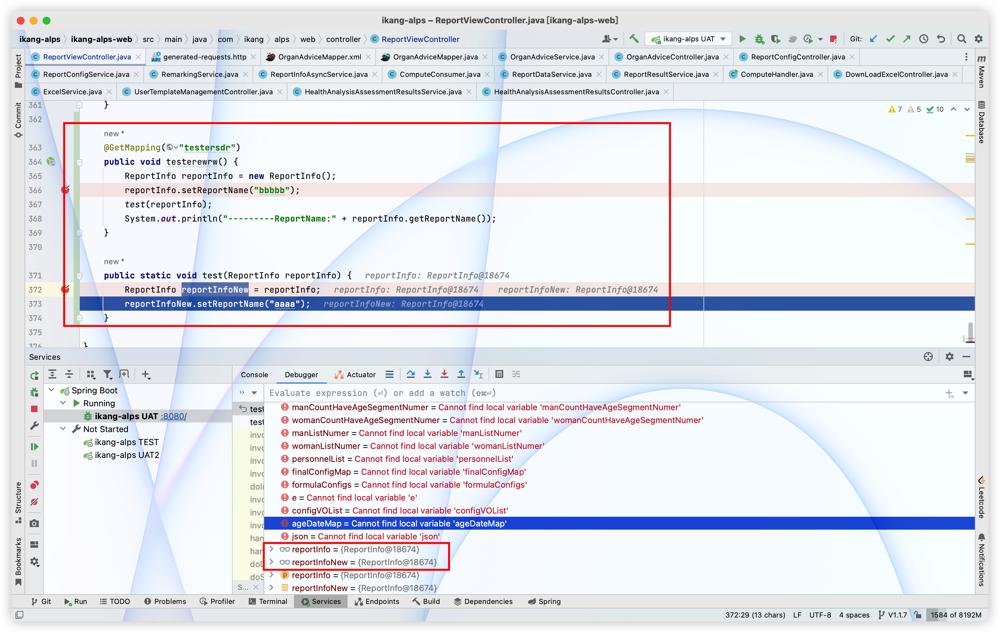

# 引用数据类型



test方法里虽然我用局部变量接收了外面的传参，但debugger发现，局部变量和外部传参实际上还是同一个东西


例子1：

```java
public static void main(String[] args) {
  /*引用数据类型*/
  StringBuffer stringBuffer = new StringBuffer("abc");
  System.out.println("执行方法前："+stringBuffer);
  changeString(stringBuffer);
  System.out.println("执行方法后："+stringBuffer);
}


public static void changeStringBuffer(StringBuffer stringBuffer){
  stringBuffer.append("def");
  System.out.println("执行方法时："+stringBuffer);
}
```

```
执行方法前：abc
执行方法时：abcdef
执行方法后：abcdef
```

例子2：

```java
public static void main(String[] args) {  
  /*引用数据类型*/
  String string = "abc";
  System.out.println("执行方法前"+string);
  changeString(string);
  System.out.println("执行方法后"+string);
}
public static void changeString(String string) {
  string = string.concat("def");
  System.out.println("执行方法时" + string);

}
```

```
执行方法前abc
执行方法时abcdef
执行方法后abc
```

形参没有影响引用类型的实参？
那么什么情况下才会有 形参影响实参呢？
这就要考虑到底是怎么改变的。
首先要知道引用数据类型，变量存储的只是一个地址值！
形参只有在执行的时候才会创建一个临时的空间存储这个形式参数，方法结束这个形式参数的生命周期就结束了。那么形式参数影响实参的时机就肯定是在这个生命周期内！
一步一步考虑，调用方法的时候需要将实参传入方法，让形参暂时有一个值，因为是引用数据类型，所以形参此时存储的是和实参一样的地址值。
此时形式参数进行一系列的操作都是对堆空间中的同一个内容进行操作的，所以如果形式参数对堆空间的值修改了，那么实参再查看堆空间里面的数据的时候就是已经被改变过了的数据。这就是为什么StringBuffer受到了形参的影响的原因。
那么为什么String就没有受到影响呢？
看changeString()方法种，执行的是String的concat方法。

```java
public String concat(String str) {
  int otherLen = str.length();
  if (otherLen == 0) {
    return this;
  }
  int len = value.length;
  char buf[] = Arrays.copyOf(value, len + otherLen);
  str.getChars(buf, len);
  return new String(buf, true);
}
```

## 基础数据类型及其包装类都不适用于引用数据类型的形参可以改变实参