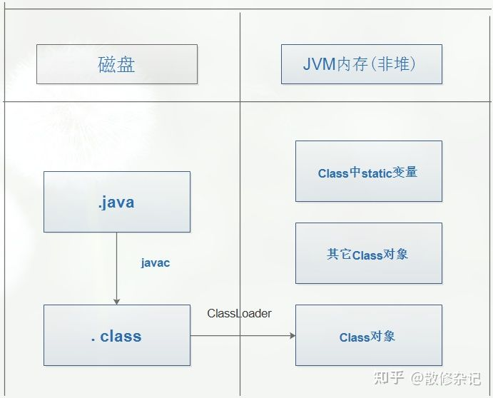
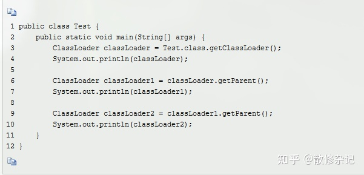
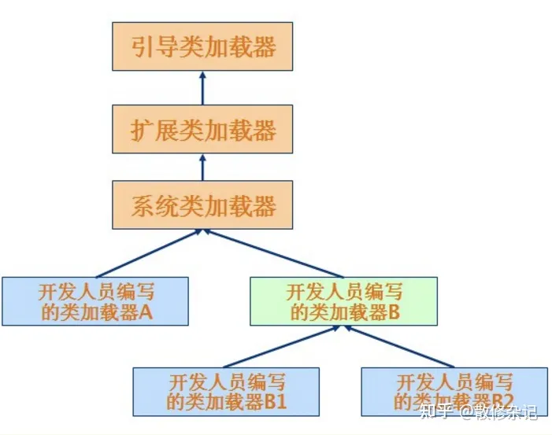
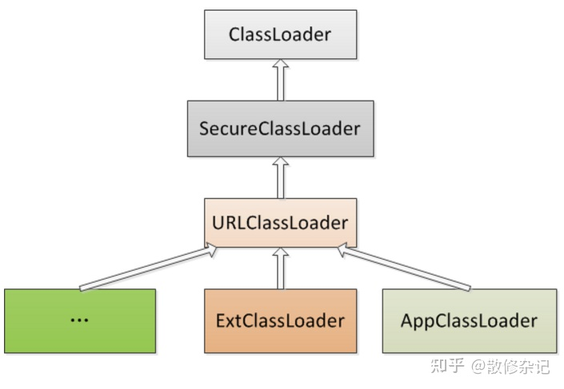
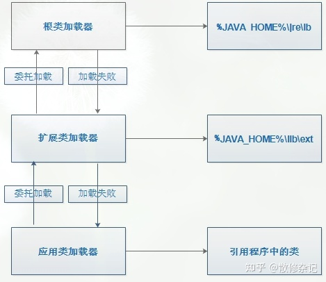
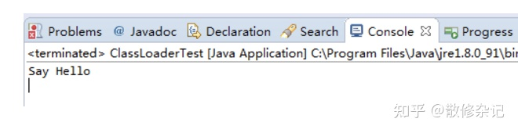

# java ClassLoader（类加载器）

## **一、问题**

请在Eclipse中新建如下类，并运行它：

```java
package java.lang;

public class Long {
   public static void main(String[] args) {
        System.out.println("Hi, i am here");
   }
}
```

你能猜到它的运行如果吗？ 不错，就是如下这个样子！

错误: 在类 java.lang.Long 中找不到 main 方法, 请将 main 方法定义为: public static void main(String[] args) 否则 JavaFX 应用程序类必须扩展javafx.application.Application

为什么呢，明明我在Long方法类中定义了main方法，为什么说main方法没有定义呢？
本文将解决以上问题出现的原因。

## **二、类加载器概述:**

我们都知道java程序写好以后是以.java（文本文件）的文件存在磁盘上，然后，我们通过(bin/javac.exe)编译命令把.java文件编译成.class文件（字节码文件），并存在磁盘上。但是程序要运行，首先一定要把.class文件加载到JVM内存中才能使用的，**我们所讲的classLoader,就是负责把磁盘上的.class文件** ，**加载到JVM内存中，并生成** **java.lang.Class类的一个实例，**如下图所示：




你可以认为每一个Class对象拥有磁盘上的那个.class字节码内容,每一个class对象都有一个getClassLoader()方法，得到是谁把我从.class文件加载到内存中变成Class对象的。

## **三、ClassLoader的作用**

基本上所有的类加载器都是 java.lang.ClassLoader类的一个实例。

- 它是用来加载 Class 的。它负责将 Class 的字节码形式转换成内存形式的 Class 对象。
- 除此之外，ClassLoader还负责加载 Java 应用所需的资源，如图像文件和配置文件等。

## **四、ClassLoader的分类**

Java 中的类加载器大致可以分成两类，
一类是系统提供的，另外一类则是由 Java 应用开发人员编写的。
系统提供的类加载器主要有下面三个：
**(1):** **引导类加载器(Bootstrap类加载器)** 
它是由本地代码(c/c++)实现的，你根本拿不到他的引用，但是他实际存在，并且加载一些重要的类，它加载(%JAVA_HOME%\jre\lib),如rt.jar(runtime)、i18n.jar等，这些是Java的核心类。 他是用原生代码来实现的，并不继承自 java.lang.ClassLoader。
**(2): 扩展类加载器(Extension类加载器)**
虽说能拿到，但是我们在实践中很少用到它，它主要加载扩展目录下的jar包， %JAVA_HOME%\lib\ext
**(3):** **系统类加载器(System类加载器)** 
它主要加载我们应用程序中的类，如Test,或者用到的第三方包,如jdbc驱动包等。
这里的父类加载器与类中继承概念要区分，它们在class定义上是没有父子关系的。


除了系统提供的类加载器以外，开发人员可以通过继承 java.lang.ClassLoader类的方式实现自己的类加载器，以满足一些特殊的需求。

## **五、ClassLoader层次结构**

对于系统提供的类加载器来说，系统类加载器的父类加载器是扩展类加载器，而扩展类加载器的父类加载器是引导类加载器；
除了引导类加载器之外，所有的类加载器都有一个父类加载器。 通过 getParent()方法可以得到。 
代码示例：




**运行结果：**

> sun.misc.Launcher$AppClassLoader@2a139a55 # System类加载器
> sun.misc.Launcher$ExtClassLoader@7852e922 # Extension类加载器
> null # Bootstrap类加载器

ExtClassLoader的父加载器为null,但是Bootstrap CLassLoader却可以当成它的父加载器这又是为何呢？
Bootstrap ClassLoader是由C/C++编写的，它本身是虚拟机的一部分，所以它并不是一个JAVA类，也就是无法在java代码中获取它的引用 ，JVM启动时通过Bootstrap类加载器加载rt.jar等核心jar包中的class文件，之前的int.class,String.class都是由它加载。
对于开发人员编写的类加载器来说，其父类加载器是加载此类加载器 Java 类的类加载器。因为类加载器 Java 类如同其它的 Java 类一样，也是要由类加载器来加载的。一般来说，开发人员编写的类加载器的父类加载器是系统类加载器。
类加载器通过这种方式组织起来，形成树状结构。树的根节点就是引导类加载器。下图中给出了一个典型的类加载器树状组织结构示意图，其中的箭头指向的是父类加载器。




## **六、父加载器不是父类**

示例

```java
static class ExtClassLoader extends URLClassLoader {
    ...
}
static class AppClassLoader extends URLClassLoader {
    ...
}
```


可以看见ExtClassLoader和AppClassLoader同样继承自URLClassLoader
ClassLoader类的继承关系图



## **七、Class加载时调用类加载器的顺序**

当一个类要被加载时，有一个启动类加载器和实际类加载器的概念，这个概念请看如下分析
如上面的Test.class要进行加载时，它将会启动应用类加载器进行加载Test类，但是这个系统类加载器不会真正去加载他，而是会调用看是否有父加载器，结果有，是扩展类加载器，扩展类加载器也不会直接去加载，它看自己是否有父加载器没，结果它还是有的，是根类加载器。
所以这个时候根类加载器就去加载这个类，可在%JAVA_HOME%\jre\lib下，它找不到com.wangmeng.Test这个类，所以他告诉他的子类加载器，我找不到，你去加载吧，子类扩展类加载器去%JAVA_HOME%\lib\ext去找，也找不着，它告诉它的子类加载器 System类加载器，我找不到这个类，你去加载吧，结果System类加载器找到了，就加到内存中，并生成Class对象。 
这个时间时候启动类加载器（应用类加载器）和实际类加载器（应用类加载器）是同一个.
这就是Java中著名的委托加载机制，看如下图：




我们再来看一下 java.lang.Long的加载，按上面分析，应该是由根类加载器加载得到的，此时启动类加载器是应用类加载器，但实际类加载器是根类加载器。
所以回到我们最开始那个问题，没有main方法是因为执行的根本不是我们自己写的类，执行的是java核心中的那个Long类，当然没有main方法了。 这样就防止我们应用中写的类覆盖掉java核心类。

## **八、委托加载机制（代理模式）的动机** 

在介绍委托加载机制背后的动机之前，首先需要说明一下 Java 虚拟机是如何判定两个 Java 类是相同的。

Java 虚拟机不仅要看类的全名是否相同，还要看加载此类的类加载器是否一样。只有两者都相同的情况，才认为两个类是相同的。

即便是同样的字节代码，被不同的类加载器加载之后所得到的类，也是不同的。

**代码示例**

```java
public void testClassIdentity() {
    String classDataRootPath = "C:\\workspace\\Classloader\\classData";
    FileSystemClassLoader fscl1 = new FileSystemClassLoader(classDataRootPath);
    FileSystemClassLoader fscl2 = new FileSystemClassLoader(classDataRootPath);
    String className = "com.example.Sample";    
    try {
        Class<?> class1 = fscl1.loadClass(className);
        Object obj1 = class1.newInstance();
        Class<?> class2 = fscl2.loadClass(className);
        Object obj2 = class2.newInstance();
        Method setSampleMethod = class1.getMethod("setSample", java.lang.Object.class);
        setSampleMethod.invoke(obj1, obj2);
    } catch (Exception e) {
        e.printStackTrace();
    }
}
```

上例中使用了类 FileSystemClassLoader的两个不同实例来分别加载类 com.example.Sample，得到了两个不同的 java.lang.Class的实例，接着通过 newInstance()方法分别生成了两个类的对象 obj1和 obj2，最后通过 Java 的反射 API 在对象 obj1上调用方法 setSample，试图把对象 obj2赋值给 obj1内部的 instance对象。

**运行结果**

```log
java.lang.reflect.InvocationTargetException
at sun.reflect.NativeMethodAccessorImpl.invoke0(Native Method)
at sun.reflect.NativeMethodAccessorImpl.invoke(NativeMethodAccessorImpl.java:39)
at sun.reflect.DelegatingMethodAccessorImpl.invoke(DelegatingMethodAccessorImpl.java:25)
at java.lang.reflect.Method.invoke(Method.java:597)
at classloader.ClassIdentity.testClassIdentity(ClassIdentity.java:26)
at classloader.ClassIdentity.main(ClassIdentity.java:9)
Caused by: java.lang.ClassCastException: com.example.Sample
cannot be cast to com.example.Sample
at com.example.Sample.setSample(Sample.java:7)
... 6 more
```

运行结果可以看到，运行时抛出了 java.lang.ClassCastException异常。虽然两个对象 obj1和 obj2的类的名字相同，但是这两个类是由不同的类加载器实例来加载的，因此不被 Java 虚拟机认为是相同的。

了解了这一点之后，就可以理解代理模式的设计动机了。代理模式是为了保证 Java 核心库的类型安全。所有 Java 应用都至少需要引用 java.lang.Object类，也就是说在运行的时候，java.lang.Object这个类需要被加载到 Java 虚拟机中。如果这个加载过程由 Java 应用自己的类加载器来完成的话，很可能就存在多个版本的 java.lang.Object类，而且这些类之间是不兼容的。

1、代理模式是为了保证 Java 核心库的类型安全：通过代理模式，对于 Java 核心库的类的加载工作由引导类加载器来统一完成，保证了 Java 应用所使用的都是同一个版本的 Java 核心库的类，是互相兼容的。

2、相同名称的类可以并存在 Java 虚拟机中：不同的类加载器为相同名称的类创建了额外的名称空间。相同名称的类可以并存在 Java 虚拟机中，只需要用不同的类加载器来加载它们即可。不同类加载器加载的类之间是不兼容的，这就相当于在 Java 虚拟机内部创建了一个个相互隔离的 Java 类空间。

这种技术在许多框架中都被用到，比如以 Apache Tomcat 来说，容器不希望它下面的webapps之间能互相访问到，每个 Web 应用都有一个对应的类加载器实例。

## **九、ClassLoader中重要的方法**

在Java中，ClassLoader是一个抽象类，位于java.lang包中，下面对该类的一些重要接口方法进行介绍

**1、Class loadClass(String name)** ：name参数指定类装载器需要装载类的名字，必须使用全限定类名，如：com.smart.bean.Car。 调用此方法等效于调用 loadClass(name,false)。 

**①具体源码:**

```java
public Class<?> loadClass(String name) throws ClassNotFoundException {
        return loadClass(name, false);
}
```


**2、Class loadClass(String name,boolean resolve):**resolve参数告诉类装载器时候需要解析该类，在初始化之前，因考虑进行类解析的工作，但并不是所有的类都需要解析。如果JVM只需要知道该类是否存在或找出该类的超类，那么就不需要进行解析。

**①具体源码:**

```java
protected Class<?> loadClass(String name, boolean resolve) throws ClassNotFoundException {
  synchronized (getClassLoadingLock(name)) {
    //首先,检查类文件是否已经被加载过
    Class<?> c = findLoadedClass(name);
    //类文件未被加载过
    if (c == null) {
      //设定加载时间起始点
      long t0 = System.nanoTime();
      try {
        //其父加载器不为空,说明父加载器为引导加载器
        if (parent != null) {
          //通过父加载器搜索name指定的类文件
          c = parent.loadClass(name, false);
        } else {
          //父加载器为空,说明父加载器为启动加载器搜索类文件
          //启用bootstrap class loader
          c = findBootstrapClassOrNull(name);
        }
      } catch (ClassNotFoundException e) {
        //如果非空父加载器中找不到name指定的类文件
        //抛出ClassNotFoundException异常
      }
      //父加载器或者启动加载器中都未搜索到该类文件
      if (c == null) {
        //设定加载时间结点
        long t1 = System.nanoTime();
        //当前加载器内搜索name指定的类文件
        c = findClass(name);
        // this is the defining class loader; record the stats
        sun.misc.PerfCounter.getParentDelegationTime().addTime(t1 - t0);
        sun.misc.PerfCounter.getFindClassTime().addElapsedTimeFrom(t1);
        sun.misc.PerfCounter.getFindClasses().increment();
      }
    }
    //resolve为true时处理类文件
    if (resolve) {
      resolveClass(c);
    }
    return c;
  }
}
```

此方法的默认实现将按以下顺序搜索类：

- 执行findLoadedClass(String)去检测这个class是不是已经加载过了。
- 执行父加载器的loadClass方法。如果父加载器为null，则jvm内置的加载器去替代，也就是Bootstrap ClassLoader。这也解释了ExtClassLoader的parent为null,但仍然说Bootstrap ClassLoader是它的父加载器。
- 如果向上委托父加载器没有加载成功，则通过findClass(String)查找。

要注意的是如果要编写一个classLoader的子类，也就是自定义一个classloader，建议覆盖findClass()方法，而不要直接改写loadClass()方法。

**Class** **findClass(String name)**

**①具体源码:**

```java
protected Class<?> findClass(String name) throws ClassNotFoundException { 
    throw new ClassNotFoundException(name);
}
```

突然感觉被逗了，怎么默认直接就抛了异常呢？

其实是因为ClassLoader这个类是一个抽象类，实际在使用时候会写个子类，这个方法的作用就是按照需要被重写，来完成业务需要的加载过程。

**Class defineClass(String name,byte[] b,int len)**：这个方法在编写自定义classloader的时候非常重要,它能将类文件的字节数组转换成JVM内部的java.lang.Class对象。字节数组可以从本地文件系统、远程网络获取。参数name为字节数组对应的全限定类名。 

**Class findSystemClass(String name)**： 方法从本地文件系统装入文件。它在本地文件系统中寻找类文件，如果存在，就使用 defineClass 将原始字节转换成 Class 对象，以将该文件转换成类。 

**Class findLoadedClass(String name)**：调用该方法来查看ClassLoader是否已载入某个类。如果已载入，那么返回java.lang.Class对象；否则返回null。如果强行装载某个已存在的类，那么则抛出链接错误。

**ClassLoader getParent()**：获取类装载器的父装载器。除根装载器外，所有的类装载器都有且仅有一个父装载器。ExtClassLoader的父装载器是根装载器，因为根装载器非java语言编写，所以无法获取，将返回null。

## **十、自定义ClassLoader**

不知道大家有没有发现，不管是Bootstrap ClassLoader还是ExtClassLoader等，这些类加载器都只是加载指定的目录下的jar包或者资源。如果在某种情况下，我们需要动态加载一些东西呢？比如从D盘某个文件夹加载一个class文件，或者从网络上下载class主内容然后再进行加载，这样可以吗？

如果要这样做的话，需要我们自定义一个classloader。

**1、自定义ClassLoader的常见做法**

在自定义ClassLoader的子类时候，我们常见的会有两种做法，

一种是重写loadClass方法，另一种是重写findClass方法。

其实这两种方法本质上差不多，毕竟loadClass也会调用findClass，但是从逻辑上讲我们最好不要直接修改loadClass的内部逻辑。

个人认为比较好的做法其实是只在findClass里重写自定义类的加载方法。

为啥说这种比较好呢，因为前面我也说道，loadClass这个方法是实现双亲委托模型逻辑的地方，擅自修改这个方法会导致模型被破坏，容易造成问题。因此我们最好是在双亲委托模型框架内进行小范围的改动，不破坏原有的稳定结构。同时，也避免了自己重写loadClass方法的过程中必须写双亲委托的重复代码，从代码的复用性来看，不直接修改这个方法始终是比较好的选择。

当然，如果是刻意要破坏双亲委托模型就另说。

**2、自定义步骤**

- 编写一个类继承自ClassLoader抽象类。
- 复写它的findClass()方法。
- 在findClass()方法中调用defineClass()。

**3、自定义ClassLoader示例之DiskClassLoader**

假设我们需要一个自定义的classloader,默认加载路径为D:\lib下的jar包和资源。

我们写编写一个测试用的类文件，Test.java

**Test.java**

```java
public class Test {
    public void say(){
        System.out.println("Say Hello");
    }
}
```

## DiskClassLoader

### 我们编写DiskClassLoader的代码。

```java
public class DiskClassLoader extends ClassLoader {
 
    private String mLibPath;
 
    public DiskClassLoader(String path) {
        // TODO Auto-generated constructor stub
        mLibPath = path;
    }


    @Override
    protected Class<?> findClass(String name) throws ClassNotFoundException {
        // TODO Auto-generated method stub
 
        String fileName = getFileName(name);
 
        File file = new File(mLibPath,fileName);
 
        try {
            FileInputStream is = new FileInputStream(file);
 
            ByteArrayOutputStream bos = new ByteArrayOutputStream();
            int len = 0;
            try {
                while ((len = is.read()) != -1) {
                    bos.write(len);
                }
            } catch (IOException e) {
                e.printStackTrace();
            }
 
            byte[] data = bos.toByteArray();
            is.close();
            bos.close();
 
            return defineClass(name,data,0,data.length);
 
        } catch (IOException e) {
            // TODO Auto-generated catch block
            e.printStackTrace();
        }
 
        return super.findClass(name);
    }


    //获取要加载 的class文件名
    private String getFileName(String name) {
        // TODO Auto-generated method stub
        int index = name.lastIndexOf('.');
        if(index == -1){
            return name+".class";
        }else{
            return name.substring(index+1)+".class";
        }
    }
}
```


我们在findClass()方法中定义了查找class的方法，然后数据通过defineClass()生成了Class对象。

**测试**

```java
public class ClassLoaderTest {
    public static void main(String[] args) {
        // TODO Auto-generated method stub
 
        //创建自定义classloader对象。
        DiskClassLoader diskLoader = new DiskClassLoader("D:\\lib");
        try {
            //加载class文件
            Class c = diskLoader.loadClass("com.frank.test.Test");
 
            if(c != null){
                try {
                    Object obj = c.newInstance();
                    Method method = c.getDeclaredMethod("say",null);
                    //通过反射调用Test类的say方法
                    method.invoke(obj, null);
                } catch (InstantiationException | IllegalAccessException
                        | NoSuchMethodException
                        | SecurityException |
                        IllegalArgumentException |
                        InvocationTargetException e) {
                    // TODO Auto-generated catch block
                    e.printStackTrace();
                }
            }
        } catch (ClassNotFoundException e) {
            // TODO Auto-generated catch block
            e.printStackTrace();
        }
 
    }
}
```

我们点击运行按钮，结果显示。



可以看到，Test类的say方法正确执行，也就是我们写的DiskClassLoader编写成功。