# 类加载过程

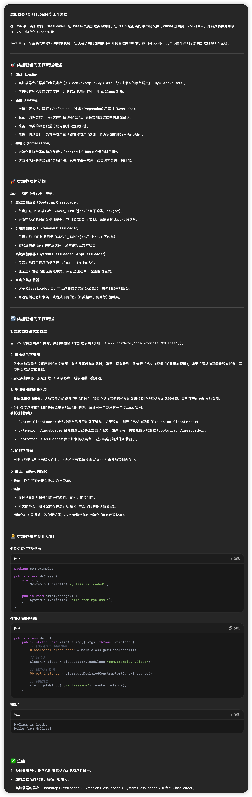

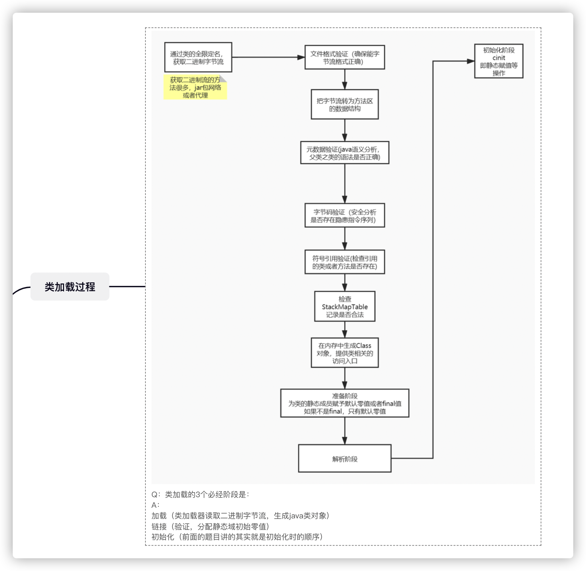

[JVM](https://so.csdn.net/so/search?q=JVM&spm=1001.2101.3001.7020)类加载机制大致分为：**加载、验证、准备、解析(其中验证、准备和解析都为链接)、初始化、使用、卸载。**

## 详细过程的拆解

### 1. **加载**

1. 通过类加载(也有叫装载)器，将`java`代码加载成`.class`文件到内存中。
2. 将读取到的`.class`数据存储到运行时内存区的方法区。

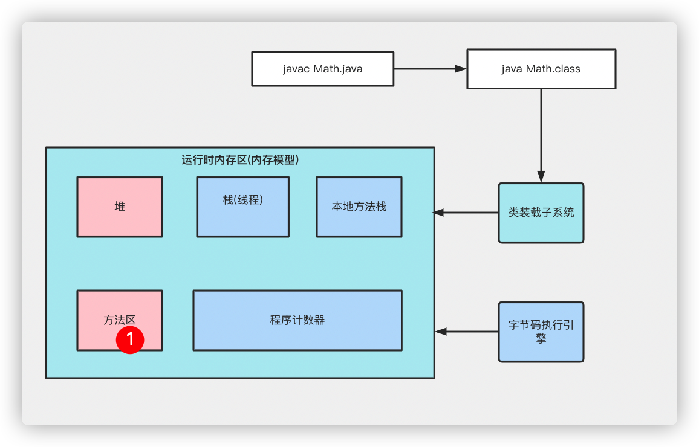

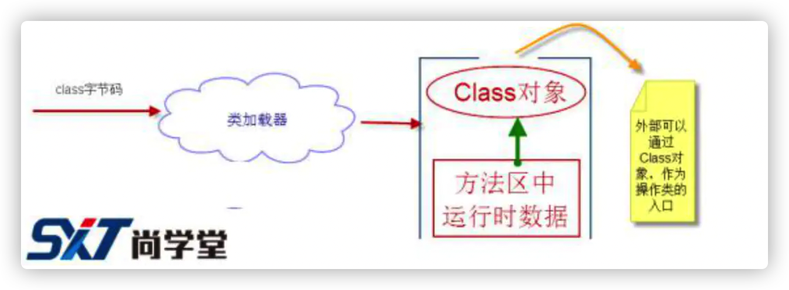

1. 然后将其转换成一个与目标类型对应的`java.lang.Class`对象的实例。这个`Class`对象在日后就会作为方法区中该类的各种数据的访问入口。

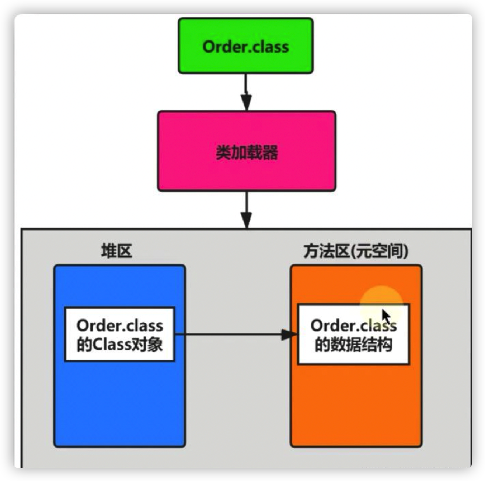

### 2. 链接

**验证**

验证是确保被加载的类(`.class`文件的字节流)，是否按照Java虚拟机的规范。确保不会造成安全问题。

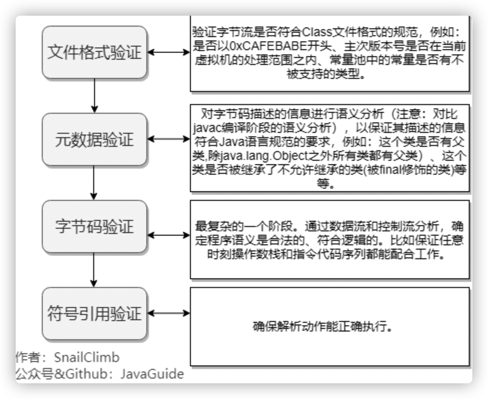

**文件格式验证**

第一阶段**要验证字节流是否符合 `Class`文件格式的规范, 井且能被当前版本的虚拟机处理**。这一阶段可能包括下面这些验证点：

- 是否以魔数 0xCAFEBABE开头

- 主、次版本号是否在当前虚拟机处理范围之内 。

- 常量池的常量中是否有不被支持的常量类型(检査常量tag 标志)。

- 指向常量的各种索引值中是否有指向不存在的常量或不符合装型的常量 。

- CONSTANT_Utf8_info型的常量中是否有不符合 UTF8编码的数据

- Class 文件中各个部分及文件本身是否有被删除的或附加的其他信息实际上第一阶段的验证点还远不止这些, 这是其中的一部分。只有通过了这个阶段的验证之后, 字节流才会进入内存的方法区中进行存储, 所以后面的三个验证阶段全部是基于方法区的存储结构进行的，不会再直接操作字节流。

**元数据验证**

第二阶段**是对字节码描述的信息进行语义分析，以保证其描述的信息符合`Java`语言规范的要求**,这个阶段可能包括的验证点如下:

- 这个类是否有父类(除了java.lang.object之外,所有的类都应当有父类)

- 这个类的父类是否继承了不允许被继承的类(被finaI修饰的类)

- 如果这个类不是抽象类, 是否实現了其父类或接口之中要求实现的所有方法类中的字段、 方法是否与父类产生了矛盾(例如覆盖了父类的final字段, 或者出現不符合规则的方法重载, 例如方法参数都一致, 但返回值类型却不同等)

- 第二阶段的验证点同样远不止这些，这一阶段的主要目的是对类的元数据信息进行语义检验, 保证不存在不符合 Java语言规范的元数据信息。

**字节码验证**

第三阶段是整个验证过程中最复杂的一个阶段, **主要目的是通过数据流和控制流的分析，确定语义是合法的**。符号逻辑的。在第二阶段对元数据信息中的数据类型做完校验后，这阶段将对类的方法体进行校验分析，保证被校验类的方法在运行时不会做出危害虚拟机安全的行为，例如：

- 保证任意时刻操作数栈的数据装型与指令代码序列都能配合工作, 例如不会出现类似这样的情况:在操作栈中放置了一个 int类型的数据, 使用时却按long类型来加载入本地变量表中。

- 保证跳转指令不会跳转到方法体以外的字节码指令上

- 保证方法体中的类型转换是有效的, 例如可以把一个子类对象赋值给父类数据装型，这是安全的,但是把父类对象意赋值给子类数据类型,甚至把对象赋值给与它毫无继承关系、 完全不相干的一个数据类型, 则是危险和不合法的。即使一个方法体通过了字节码验证, 也不能说明其一定就是安全的。

**符号引用验证**

最后一个阶段的校验发生在虚拟机将符号引用转化为直接引用的时候 , 这个转化动作将在连接的第三个阶段一一解析阶段中发生。符号引用验证可以看做是对类自身以外(常量池中的各种符号引用) 的信息进行匹配性的校验, 通常需要校验以下内容:

- 符号引用中通过字将串描述的全限定名是否能找到对应的类
- 在指定类中是否存在符合方法的字段描述符以及简单名称所描述的方法和字段 。
- 符号引用中的类、字段和方法的访问性(private、 protected、 public、 default)是否可被当前类访问
- 符号引用验证的目的是确保解析动作能正常执行, 如果无法通过符号引用验证, 将会抛出一个java.lang.IncompatibleClassChangError异常的子类, 如 java.lang.IllegalAccessError、java.lang.NoSuchFieldError、java.lang.NoSuchMethodError等。

**准备**

准备阶段**是正式为类变量分配内存并设置类变量的初始值阶段，即在方法区中分配这些变量所使用的内存空间**。注意这里所说的初始值概念，比如一个类变量定义为：

```java
public static int x = 8080;
```

实际上变量 x 在准备阶段过后的初始值为 `0` 而不是 `8080`，将 x 赋值为 `8080` 的 `put static` 指令是程序被编译后，存放于类构造器方法之中。

但是注意如果声明为：

```java
public static final int x = 8080;
```

在编译阶段会为 x 生成 `ConstantValue` 属性，在准备阶段虚拟机会根据 `ConstantValue` 属性将 x 赋值为 `8080`。

对于该阶段有以下几个要注意的点：

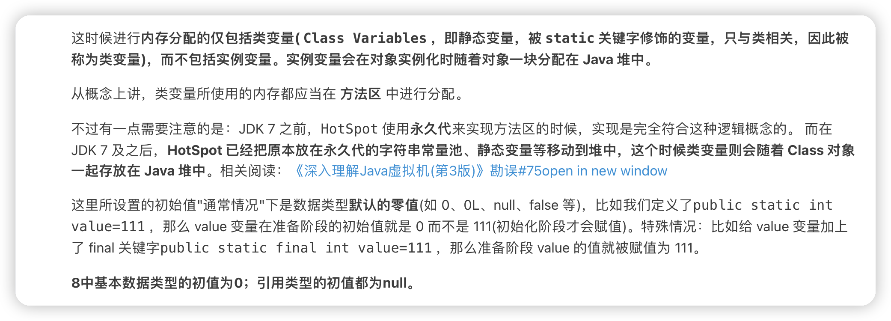

解析

解析是**将类的二进制数据中的符号引用替换成直接引用**(符号引用是用一组符号描述所引用的目标；直接引用是指向目标的**指针**。)

直接引用**可以是指向目标的指针，相对偏移量或是一个能间接定位到目标的句柄**。**如果有了直接引用，那引用的目标必定已经在内存中存在。**

**可以认为是一些静态绑定的会被解析，动态绑定则只会在运行时进行解析；静态绑定包括一些 final(不可以重写，可以被重载)。static方法(只会属于当前的类)，构造器(不会被重写)。**

在解析阶段，虚拟机会把所有的类名、方法名、字段名这些符号引用**替换为具体的内存地址或偏移量，也就是直接引用。**

### 3. 初始化

初始化阶段是类加载最后一个阶段，前面的类加载阶段之后，除了在加载阶段可以自定义类加载器以外，其它操作都由 JVM 主导。到了初始阶段，才开始真正执行类中定义的 Java 程序代码。

初始化，就是为标记为常量值的字段赋值的过程。换句话说，只对static修饰的变量或语句块进行初始化。如果初始化一个类的时候，其父类尚未初始化，则优先初始化其父类。如果同时包含多个静态变量和静态代码块，则按照自上而下的顺序依次执行。

初始化阶段是执行类构造器方法的过程。方法是由编译器自动收集类中的类变量的赋值操作和静态语句块中的语句合并而成的。虚拟机会保证子方法执行之前，父类的方法已经执行完毕，如果一个类中没有对静态变量赋值也没有静态语句块，那么编译器可以不为这个类生成()方法。

注意以下几种情况不会执行类初始化：

- 通过子类引用父类的静态字段，只会触发父类的初始化，而不会触发子类的初始化。

- 定义对象数组，不会触发该类的初始化。

- 常量在编译期间会存入调用类的常量池中，本质上并没有直接引用定义常量的类，不会触发定义常量所在的类。

- 通过类名获取 Class 对象，不会触发类的初始化。

- 通过 Class.forName 加载指定类时，如果指定参数 initialize 为 false 时，也不会触发类初始化，其实这个参数是告诉虚拟机，是否要对类进行初始化。

- 通过 ClassLoader 默认的 loadClass 方法，也不会触发初始化动作。


涉及的问题

**一个类的构造器，代码块、静态代码块、成员变量的执行顺序。**

```java
//父类
public class ParentClass {
    private int p1 = getValue() ;
    private static int p2 = getValue2();
    public ParentClass(){
        System.out.println("我是父构造器");
    }
    static {
        System.out.println("我是父静态代码块1");
    }
    static {
        System.out.println("我是父静态代码块2");
    }
    {
        System.out.println("我是父代码块1");
    }
    {
        System.out.println("我是父代码块2");
    }
 
    private int getValue(){
        System.out.println("我是父成员变量p1");
        return 1;
    }
 
    private static int getValue2(){
        System.out.println("我是父静态成员变量p2");
        return 1;
    }
}
```

```java
//子类
public class ChildClass extends ParentClass{
    private int c1 = getValue() ;
    private static int c2 = getValue2();
 
    public ChildClass(){
        System.out.println("我是子构造器");
    }
    static {
        System.out.println("我是子静态代码块1");
    }
    static {
        System.out.println("我是子静态代码块2");
    }
    {
        System.out.println("我是子代码块1");
    }
    {
        System.out.println("我是子代码块2");
    }
 
    private int getValue(){
        System.out.println("我是子成员变量c1");
        return 1;
    }
 
    private static int getValue2(){
        System.out.println("我是子静态成员变量c2");
        return 1;
    }
 
    public static void main(String[] args) {
        ChildClass childClass = new ChildClass();
    }
}
```


### 类加载器

类加载器也有人叫类装载器。

我们都知道Java程序写好就是Java代码(.Java文件)存在磁盘中。然后通过(/bin/javac.exe)编译命令把.java文件编译成.class字节码文件，并存在磁盘中。

但是要运行程序，首先就是把.class文件加载到JVM的内存中才能使用，所以我们常看见的ClassLoader，就是负责把我们磁盘中的.class字节码文件，加载到JVM的内存中，并生成Java.lang.Class类的一个实例。

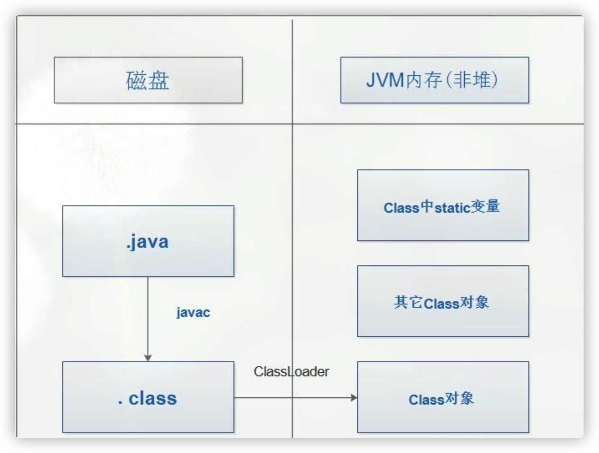

虚拟机设计团队把加载动作放到 JVM 外部实现，以便让应用程序决定如何获取所需的类，JVM 提供了 3 种类加载器：

#### **启动类加载器(Bootstrap ClassLoader)**

负责加载 `JAVA_HOME\lib` 目录中的，或通过`-Xbootclasspath` 参数指定路径中的，且被虚拟机认可(按文件名识别，如 `rt.jar`)的类。它是由原生代码所写，并不是继承自`java.lang.ClassLoader`

#### **扩展类加载器(Extension ClassLoader)**

负责加载 `JAVA_HOME\lib\ext` 目录中的，或通过 `java.ext.dirs` 系统变量指定路径中的类库。

#### **应用程序类加载器(Application ClassLoader)**

负责加载用户路径(`classpath`)上的类库。JVM 通过**双亲委派模型**进行类的加载，当然我们也可以通过继承 `java.lang.ClassLoader`实现自定义的类加载器。

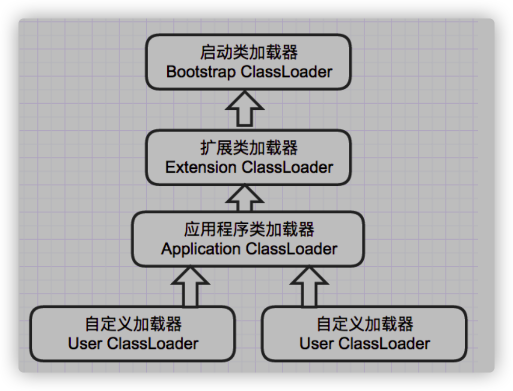

### **双亲委派机制**

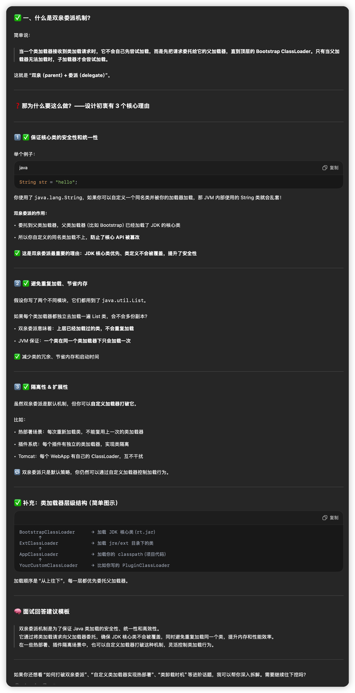

双亲委派机制是代理模式实现的。

白话文：当一个类要被加载时，它将会**启动应用类加载器**进行加载`Test`类，但是这个系统类加载器不会真正去加载他，而是会调用看是否有父加载器，结果有，是扩展类加载器，扩展类加载器也不会直接去加载，它看自己是否有父加载器没，结果它还是有的，是根类加载器。

**当一个类收到了类加载请求，他首先不会尝试自己去加载这个类，而是把这个请求委派给父类去完成，每一个层次类加载器都是如此，因此所有的加载请求都应该传送到启动类加载其中，只有当父类加载器反馈自己无法完成这个请求的时候(在它的加载路径下没有找到所需加载的Class)，子类加载器才会尝试自己去加载。**

采用双亲委派的一个好处是比如加载位于 `rt.jar` 包中的类 `java.lang.Object`，不管是哪个加载器加载这个类，最终都是委托给顶层的启动类加载器进行加载，这样就保证了使用不同的类加载器最终得到的都是同样一个 Object 对象。

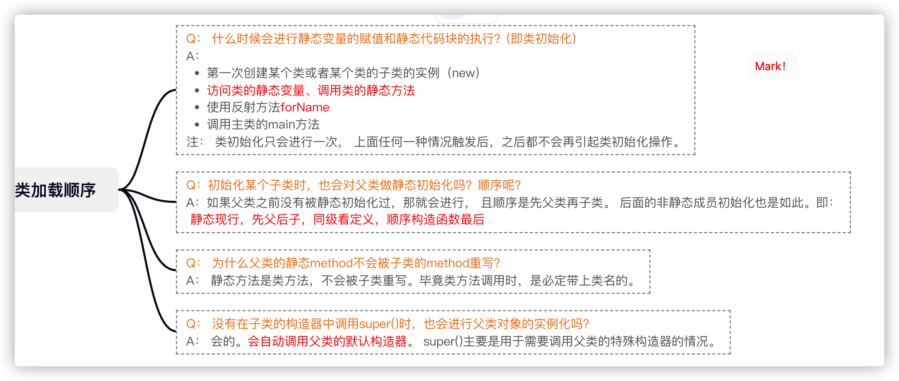

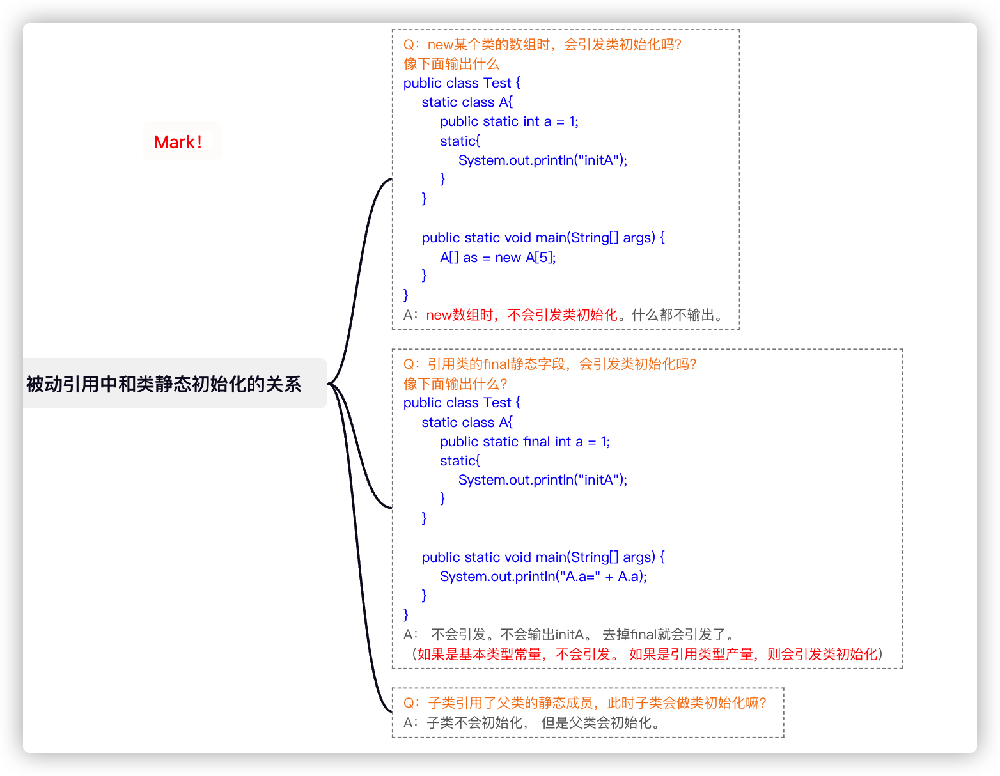


### 双亲委派（AI）

| **类名**                  | **存放位置**         | **被哪个加载器加载**         |
| ------------------------- | -------------------- | ---------------------------- |
| java.lang.*               | JDK 内部             | BootstrapClassLoader（null） |
| javax.*、sun.*            | lib/ext/（老版本）   | ExtensionClassLoader         |
| 业务代码、Spring、MyBatis | classpath、lib/*.jar | AppClassLoader               |
| WebApp 的类               | WEB-INF/classes      | WebAppClassLoader（Tomcat）  |

双亲委派流程

```
你调用 ClassLoader.loadClass("com.xxx.Foo")

↓ 先问 BootstrapClassLoader（启动类加载器）：你能加载吗？
↓ 如果不能，问 ExtensionClassLoader
↓ 如果还不行，问 AppClassLoader
↓ AppClassLoader 尝试自己加载
```

🔹 注意：**前面的只是“询问”能不能加载，而不是真让父类加载子类的类。**

你写了一个类：

```
package com.example;
public class MyService {
    // ...
}
```

加载过程是这样：

1. 你的业务类在 classpath 下（如 target/classes/）。
2. AppClassLoader（应用类加载器）调用 loadClass("com.example.MyService")
3. 它按双亲委派模型先去问 Bootstrap（找不到）
4. 然后问 ExtensionClassLoader（找不到）
5. 最后 AppClassLoader 自己 findClass() 加载

👉 **最终是 AppClassLoader 加载了 MyService 类**


🤔 那为啥 java.lang.Object是 Bootstrap 加载的？

- java.lang.* 是 JVM 启动时就加载的核心类库
- 这些类位于 JDK 的 rt.jar（或 jmods/java.base 模块）
- 只在 BootstrapClassLoader 的搜索路径中

所以：

```
System.out.println(Object.class.getClassLoader()); // null 表示 Bootstrap 加载
```

# 源码解析

## **🧠 总体流程回顾**

我们从 ClassLoader.loadClass(name) 方法作为入口，一般调用链如下：

```
loadClass(name) → findLoadedClass(name)
                → parent.loadClass(name)
                → findClass(name)
                   → defineClass(name, byte[], ...)
                      → defineClass1 (native)
```

## **1️⃣ 加载阶段（Loading）**

### **入口方法：**

### **ClassLoader.loadClass(String name)**

#### **源码摘录（简化）：**

```java
protected Class<?> loadClass(String name, boolean resolve) throws ClassNotFoundException {
    synchronized (getClassLoadingLock(name)) {
        // 1. 检查是否已加载
        Class<?> c = findLoadedClass(name);

        // 2. 双亲委派
        if (c == null) {
            try {
                if (parent != null) {
                    c = parent.loadClass(name, false);
                } else {
                    c = findBootstrapClassOrNull(name);
                }
            } catch (ClassNotFoundException e) {}

            // 3. 自己加载
            if (c == null) {
                c = findClass(name);
            }
        }

        // 4. 是否需要解析
        if (resolve) {
            resolveClass(c);
        }

        return c;
    }
}
```

## **2️⃣ 加载字节码并转换为 Class 对象：**

defineClass(...)定义：将字节数组转为 Class对象

```
protected final Class<?> defineClass(String name, byte[] b, int off, int len, ProtectionDomain pd)
```

**源码逻辑：**

```java
// JVM native 方法实现（OpenJDK）
private native Class<?> defineClass1(ClassLoader loader, String name,
                                     byte[] b, int off, int len,
                                     ProtectionDomain pd, String source);

// Java 层调用这个方法
return defineClass1(this, name, b, off, len, pd, source);
```

**native 实现（JVM 内部）：**

在 HotSpot 中 defineClass1 对应的是 native 方法：

```
JVM_DefineClass  // 位于 jvm.cpp
```

内部调用流程：

```
JVM_DefineClass → ClassFileParser → define_instance_class → InstanceKlass
```

这一步做了很多事情：

- 解析 class 文件格式
- 验证格式正确
- 构建 runtime constant pool、方法表、字段表
- 分配对象头
- 创建 Class 对象（java.lang.Class）

## **3️⃣ 链接阶段（Linking）**

### **3.1 验证（Verification）**

JVM 会对 class 字节码进行验证，主要在 ClassFileParser 中完成：

```
ClassFileParser::verify_class()
```

- 校验魔数、版本号
- 字节码控制流检查
- 符号引用检查

如果字节码异常，会抛出：

```
java.lang.VerifyError
```

### **3.2 准备（Preparation）**

这一阶段是 **为类的 static 字段分配内存并赋默认值**，由 InstanceKlass 创建时在 JVM 内部完成：

```
InstanceKlass::link_class
→ InstanceKlass::prepare_static_fields
static int a = 10; // 此时只赋值为 0
```

### **3.3 解析（Resolution）**

解析常量池中的符号引用（如类名 “java/lang/Object”）为直接引用（Class 对象指针）

JVM 中由：

```
LinkResolver::resolve_class
```

在方法调用时才可能触发，例如：

```
Foo foo = new Foo(); // 如果 Foo 之前没初始化，会触发符号引用解析
```

## **4️⃣ 初始化阶段（Initialization）**

执行 <clinit>() 方法（即类的静态初始化器）


由 JVM 通过 InterpreterRuntime::_new、Interpreter::initialize_class 调用：

```
InstanceKlass::initialize → call_class_initializer
```

静态代码块与静态字段赋值最终都会被编译为 <clinit> 方法体。

```
static final int a = 10;调用a的时候是不会触发初始化的，因为a是常量，在编译阶段会放进常量池，解析阶段会把常量引用转换成符号引用，所以根本无需初始化就可以获取到a
```

你这个问题非常关键，是 JVM 类加载理解中的核心细节之一。我们逐步拆解你的问题，验证你说的是否准确。

- static final 修饰 **编译期常量**，前提是值在编译期就能确定（比如 String 字面量、整数、浮点数等）。
- 编译器（javac）在编译使用方（比如 Main 类）的时候，会将常量的值直接写入字节码，而不是生成对 Test.VALUE 的字段访问指令。

例如这段代码：

```
System.out.println(Test.VALUE);
```

反编译后会变成：

```
System.out.println("hello");
```

**所以 Test 类根本不会被初始化，甚至不会被主动加载。**

**🧠 那“编译期”具体指的是？**

这里的“编译期”是指 **Java 源码编译为字节码（.class 文件）的过程**，由 **javac 编译器** 完成。

也就是：

```
.java → .class
```

编译器在处理 Test.VALUE 时，发现它是个编译期常量，就将其值 "hello" 写入调用类（Main.class）的常量池中。


## **5️⃣ 解析与解析完成：**

### **resolveClass(Class c)**

```
protected final void resolveClass(Class<?> c) {
    resolveClass0(c);
}

// native 方法
private native void resolveClass0(Class<?> c);
```

此时 JVM 会确认该类所有的父类、接口、字段、方法等是否全部加载解析完成。

## **🔚 小结：源码中 JVM 的每个类加载阶段**

| **阶段** | **Java 层方法**           | **JVM 层 / native 层实现**                   |
| -------- | ------------------------- | -------------------------------------------- |
| 加载     | loadClass → findClass     | defineClass1 → JVM_DefineClass               |
| 验证     | 自动执行                  | ClassFileParser::verify_class                |
| 准备     | 自动执行                  | InstanceKlass::link_class → 分配静态字段内存 |
| 解析     | resolveClass() 或触发调用 | LinkResolver::resolve_class                  |
| 初始化   | <clinit>() 被执行         | InstanceKlass::initialize                    |

## **✅ 面试建议 & 延伸阅读**

- defineClass 允许你自己写类加载器，从字节数组或网络中动态加载类（热更新、插件机制）。
- resolveClass 通常用于确保依赖类都准备好，在 resolve=true 时自动调用。
- 可以借助 JVMTI、Agent 等查看类加载器行为。