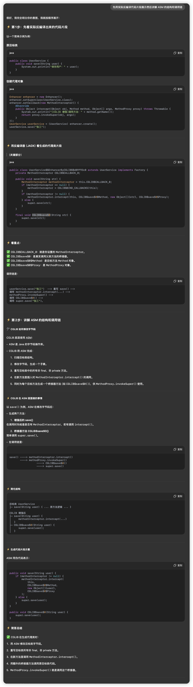
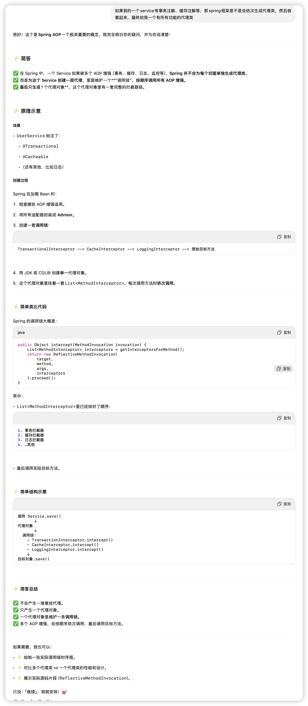
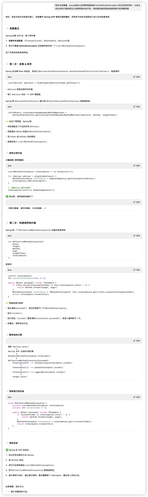

## JDK动态代理

### 方式1 Lambda

```java
import java.lang.reflect.*;

public class Demo {
    public static void main(String[] args) {
        Calculator target = new CalculatorImpl();

        // 创建调用处理器
        InvocationHandler handler = (proxy, method, methodArgs) -> {
            System.out.println("[日志] 调用方法: " + method.getName());
            return method.invoke(target, methodArgs);
        };
        // 创建代理对象
        Calculator proxy = (Calculator) Proxy.newProxyInstance(
            target.getClass().getClassLoader(),
            new Class[]{Calculator.class},
            handler
        );

        // 测试
        int result = proxy.add(3, 5);
        System.out.println(result);
    }
}
```

### 方式2 匿名内部类

```java
InvocationHandler handler = new InvocationHandler() {
    public Object invoke(Object proxy, Method method, Object[] args) throws Throwable {
        System.out.println("[日志]调用：" + method.getName());
        return method.invoke(target, args);
    }
};
```

### 方式3 独立类

```java
public class LoggingHandler implements InvocationHandler {
    private final Object target;

    public LoggingHandler(Object target) {
        this.target = target;
    }

    public Object invoke(Object proxy, Method method, Object[] args) throws Throwable {
        System.out.println("[日志]调用：" + method.getName());
        return method.invoke(target, args);
    }
}

// 用法
Calculator proxy = (Calculator) Proxy.newProxyInstance(loader, interfaces, new LoggingHandler(target));
```

## CGLIB（Code Generation Library）

```java
public class MyMethodInterceptor implements MethodInterceptor {
    @Override
    public Object intercept(Object obj, Method method, Object[] args, MethodProxy proxy) throws Throwable {
        System.out.println("[CGLIB 增强]调用方法：" + method.getName());
        //调用父类原方法
        return proxy.invokeSuper(obj, args);
    }
}
```

MethodProxy 持有对原始方法引用，调用它时不会再进入拦截器，避免堆栈溢出。

### CGLIB原理

原始类

```java
public class UserService {
    public void save(String user) {
        System.out.println("保存用户：" + user);
    }
}
```

最终代理类

```java
public class UserService$$EnhancerByCGLIB extends UserService {
    // CGLIB 增加的字段
    private MethodInterceptor methodInterceptor;

    // 重写 save 方法
    public void save(String user) {
        methodInterceptor.intercept(
            this,
            UserService.class.getMethod("save", String.class),
            new Object[]{user},
            methodProxy_for_save
        );
    }
}
```

CGLIB 在 Enhancer.create() 时：

1. 扫描目标类。
2. 找到所有非 final、非 private 的方法。
3. 用 ASM 生成相同签名的**子类方法**。
4. 在这个子类方法里，调用：
   - methodInterceptor.intercept(...)。
5. 同时为每个目标方法生成一个 MethodProxy 对象。
   - MethodProxy 持有对目标类原始方法的快速调用能力。





## 重点在这里

