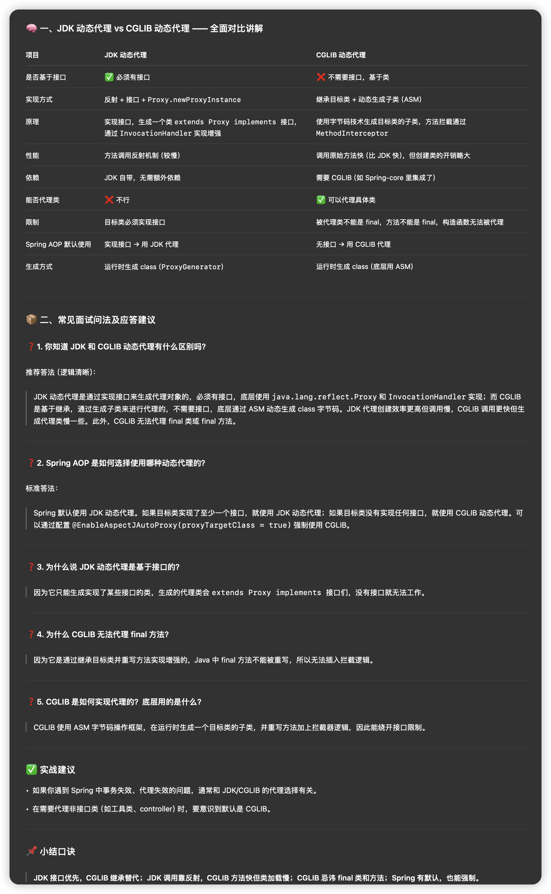
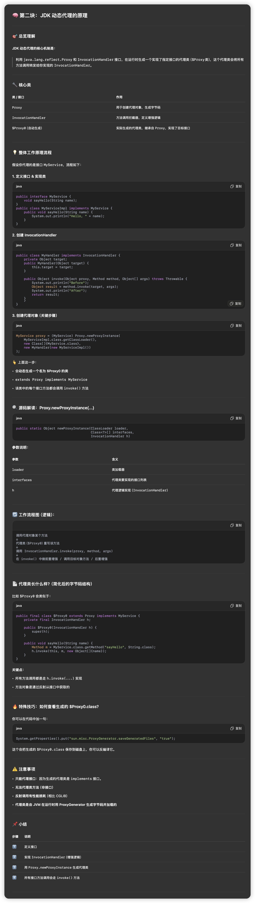
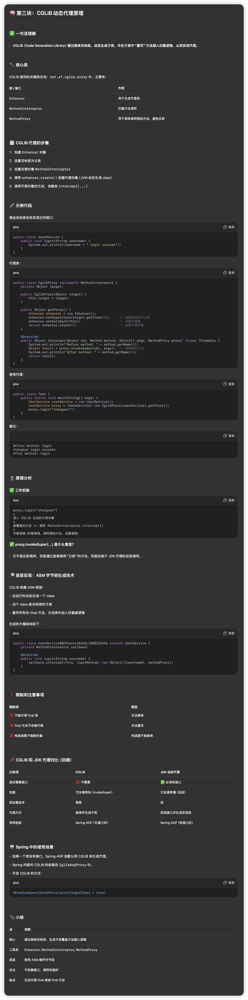
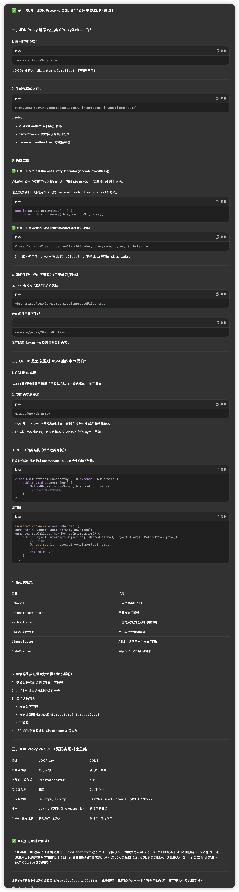

## **🎯 一、动态代理常见面试考点汇总**

### **1. JDK 动态代理 和 CGLIB 的区别（必考！）**

面试官常问：

- 两者的原理分别是什么？
- 各自的优缺点？
- Spring 是怎么选择用哪个代理方式的？




### **2. JDK 动态代理的原理**

- Proxy 类是怎么生成代理对象的？
- InvocationHandler 是干嘛的？
- Proxy.newProxyInstance() 参数含义？
- 生成的代理类长什么样？（字节码内容）




### **3. CGLIB 的原理**

- Enhancer 是什么？
- MethodInterceptor 和 MethodProxy 的区别？
- 为什么不能代理 final 类/final 方法？
- 是如何动态生成 class 的？（底层使用 ASM 字节码框架）



#### cglib动态代理不能代理final方法面试点

> “我们项目里曾经遇到一个异步/事务注解不生效的坑，是因为业务中有个公共的 BaseService 类，里面定义了一些通用方法，比如保存、更新、处理数据等。由于这个基类需要强制子类遵循模板逻辑，很多方法都加了 final 修饰，避免子类覆盖。但后来有个方法上加了 @Transactional，我们以为它能生效，其实根本没生效。后来才意识到——Spring 的 AOP 基于代理机制，CGLIB 是通过子类重写方法来增强的，而 final 方法无法被重写，自然事务和异步都无法生效。”

```java
public class BaseOrderService {

    @Transactional
    public final void saveAndAudit(Order order) {
        // 保存订单并自动审核
        ...
    }
}
```


### **4. Spring AOP 的代理选择机制（Spring 实战场景）**

- Spring 是如何决定使用 JDK 代理还是 CGLIB？
  - 答案：如果目标类实现了接口 → 默认使用 JDK 代理；否则使用 CGLIB。
- 如何强制使用 CGLIB？
  - @EnableAspectJAutoProxy(proxyTargetClass = true)


### **5. 动态代理在实际开发中的应用场景**

- AOP 的事务、日志、权限拦截等
- MyBatis Mapper 接口的实现
- RPC 框架（如 Dubbo、gRPC）自动生成 Stub
- Retrofit / FeignClient 的接口代理


### **6. 动态代理的缺陷与限制**

- JDK 动态代理的性能问题（调用频繁会慢）
- CGLIB 对 final 限制
- 动态代理不支持构造函数拦截
- 出现代理嵌套、多层增强怎么处理


### **7. 源码分析类考点（进阶）**

- JDK Proxy 是怎么通过 ProxyGenerator 生成类的？
  - 动态生成 .class 字节码
  - 保存为 $Proxy0 类
- CGLIB 是怎么通过 ASM 操作字节码的？




### **8. 动态代理与静态代理的对比**

- 什么是静态代理？
- 动态代理相比静态代理的优势在哪里？


## **✅ 补充拓展（高级面试可能问）**

- 动态代理与 AOP 的关系
- 为什么说动态代理体现了开闭原则？
- Java 代理机制和其它语言（如 Python 装饰器）相比有什么差异？
- 动态代理在框架中的应用链路（比如 Spring Boot 启动时什么时候生成代理对象）