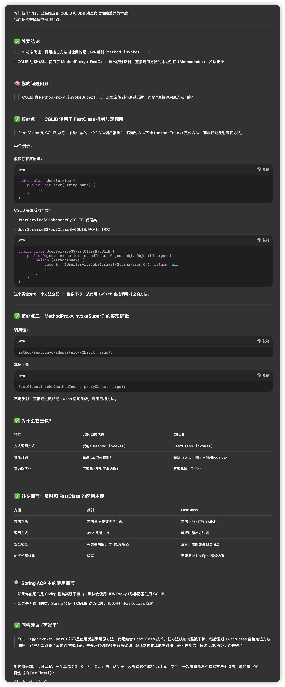
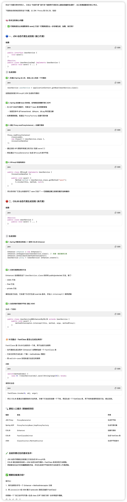
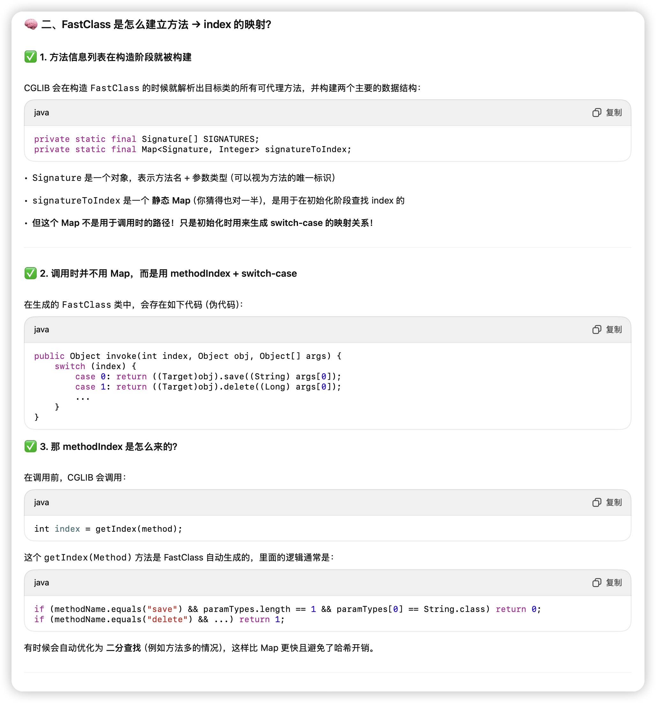

## **🎯 一、动态代理常见面试考点汇总**

### **1. JDK 动态代理 和 CGLIB 的区别（必考！）**

面试官常问：

- 两者的原理分别是什么？
- 各自的优缺点？
- Spring 是怎么选择用哪个代理方式的？


### 为什么Spring优先使用JDK动态代理

> Spring 默认优先使用 JDK 动态代理，**主要是为了遵循面向接口编程原则、结构更清晰、兼容性更好**，而不是为了性能。

### **2. JDK 动态代理的原理**

- Proxy 类是怎么生成代理对象的？
- InvocationHandler 是干嘛的？
- Proxy.newProxyInstance() 参数含义？
- 生成的代理类长什么样？（字节码内容）


### **3. CGLIB 的原理**

- Enhancer 是什么？
- MethodInterceptor 和 MethodProxy 的区别？
- 为什么不能代理 final 类/final 方法？
- 是如何动态生成 class 的？（底层使用 ASM 字节码框架）


#### cglib动态代理不能代理final方法面试点

> “我们项目里曾经遇到一个异步/事务注解不生效的坑，是因为业务中有个公共的 BaseService 类，里面定义了一些通用方法，比如保存、更新、处理数据等。由于这个基类需要强制子类遵循模板逻辑，很多方法都加了 final 修饰，避免子类覆盖。但后来有个方法上加了 @Transactional，我们以为它能生效，其实根本没生效。后来才意识到——Spring 的 AOP 基于代理机制，CGLIB 是通过子类重写方法来增强的，而 final 方法无法被重写，自然事务和异步都无法生效。”

```java
public class BaseOrderService {

    @Transactional
    public final void saveAndAudit(Order order) {
        // 保存订单并自动审核
        ...
    }
}
```


### **4. Spring AOP 的代理选择机制（Spring 实战场景）**

- Spring 是如何决定使用 JDK 代理还是 CGLIB？
  - 答案：如果目标类实现了接口 → 默认使用 JDK 代理；否则使用 CGLIB。
- 如何强制使用 CGLIB？
  - @EnableAspectJAutoProxy(proxyTargetClass = true)


### **5. 动态代理在实际开发中的应用场景**

- AOP 的事务、日志、权限拦截等
- MyBatis Mapper 接口的实现
- RPC 框架（如 Dubbo、gRPC）自动生成 Stub
- Retrofit / FeignClient 的接口代理


### **6. 动态代理的缺陷与限制**

- JDK 动态代理的性能问题（调用频繁会慢）
- CGLIB 对 final 限制
- 动态代理不支持构造函数拦截
- 出现代理嵌套、多层增强怎么处理


### **7. 源码分析类考点（进阶）**

- JDK Proxy 是怎么通过 ProxyGenerator 生成类的？
  - 动态生成 .class 字节码
  - 保存为 $Proxy0 类
- CGLIB 是怎么通过 ASM 操作字节码的？


### **8. 动态代理与静态代理的对比**

- 什么是静态代理？
- 动态代理相比静态代理的优势在哪里？


## **✅ 补充拓展（高级面试可能问）**

- 动态代理与 AOP 的关系
- 为什么说动态代理体现了开闭原则？
- Java 代理机制和其它语言（如 Python 装饰器）相比有什么差异？
- 动态代理在框架中的应用链路（比如 Spring Boot 启动时什么时候生成代理对象）

## cglib调用为什么比jdk快



## MethodHandle、LambdaMetafactory

**🧠 JDK8+ 引入的核心优化组件：**

**1.MethodHandle**

- 是一种**更底层、更高性能的反射机制**
- JVM 可以将它**内联成真实的方法调用**，几乎等同直接调用

```
MethodHandle mh = MethodHandles.lookup().findVirtual(...);
mh.invoke(...);
```

**2.LambdaMetafactory**

- 是 java.lang.invoke 包下的一个类
- 用于在运行时**生成函数式接口（如 Function、Runnable）的字节码实现**
- 可让你像写 Lambda 一样调用方法，**JVM 会将调用路径高度内联优化**

✅ 它底层使用了 invokedynamic 指令，**只在第一次调用时解析一次，后续直接调用**

**✅ 二、JDK Proxy + LambdaMetafactory 是怎么结合的？**

举个例子：

假设你用 JDK Proxy 代理了这样一个接口方法：

```java
interface UserService {
    void save();
}
```

在传统的 Proxy 中，调用流程如下：

```java
$Proxy0.save() {
    handler.invoke(this, saveMethod, null); // Method 是反射对象
}
```

但 JDK11+ 中，**JVM 优化了这一层**，通过 LambdaMetafactory.metafactory() 为每个方法创建如下形式：

```java
UserService proxy = (UserService) LambdaMetafactory.metafactory(
    lookup,
    "save",
    MethodType.methodType(UserService.class),
    ... // 其他参数
).getTarget().invokeExact();
```

这样生成的 save() 方法调用过程变成了：

- 不再走反射
- JVM 直接将 Lambda 编译为字节码中 invokedynamic 指令
- **首次调用绑定真实目标方法**
- 后续调用是直接跳转（inlining），**性能极高**

**✅ 三、对我们开发者来说，能不能直接用这些优化？**

可以，但没必要 —— 因为：

- JDK Proxy 内部**已经默认使用这些机制了**（尤其是 JDK15+ 后）
- Spring AOP/JDK Proxy 接口对我们是透明的
- 我们不需要手动写 MethodHandle 或 LambdaMetafactory

**✅ 四、是不是所有 Proxy 都会自动优化？**

不是完全所有场景。

- 如果你用的是传统的 InvocationHandler 且没有参数或参数类型简单 → JVM 能优化
- 如果你使用了复杂参数、异常捕捉、递归等 → 可能无法完全内联，但仍比 Method.invoke() 快很多
- 如果你主动使用 LambdaMetafactory，性能会更高（但复杂）

**✅ 五、总结（面试话术）**

> JDK8 之后，JVM 为了提升 JDK Proxy 的性能，引入了 MethodHandle 和 LambdaMetafactory 机制，通过字节码级别的动态 lambda 和内联调用，绕过传统反射调用开销。

> 

> 我们在代码层面并不需要手动修改，JDK Proxy 和 JVM 已经帮我们自动完成了这些优化，所以在 JDK11+ 后，JDK Proxy 的性能已不再是短板。


## invokedynamic

invokedynamic 是 Java 7 引入的一条全新字节码指令，是为了让 **方法调用在运行时动态决定调用目标**。

不像以前那种：

- invokevirtual：必须在编译期绑定类和方法名
- invokestatic：必须知道目标类和静态方法
- invokeinterface：必须实现接口
- invokespecial：调用私有方法、构造器

➡️ 上面这些都属于 **“早绑定”**：方法必须在编译时就确定。

🔁 而 invokedynamic 是 **“晚绑定”**：方法可以在**运行时动态决定**，非常灵活！

你写了这么一个 lambda：

```
Runnable r = () -> System.out.println("hello");
```

它看起来像创建了一个匿名内部类，其实 Java 8 编译器做的是：

- 生成了一条 invokedynamic 指令
- 在运行时，这条指令通过 LambdaMetafactory 动态生成一个实现了 Runnable 的类，并绑定 System.out.println("hello") 方法

好处是：

- ✅ **没有生成额外类文件**（不像匿名类会产生 Outer$1.class）
- ✅ **JVM 可以内联优化**：因为它知道 lambda 的目标是哪个具体方法
- ✅ **性能高、内存占用少**

**🔬 三、举个字节码例子（真实）**

```java
Runnable r = () -> System.out.println("Hello");
```

反编译字节码后你会看到：

```java
INVOKEDYNAMIC run()Ljava/lang/Runnable; [
  BootstrapMethods:
    0: #50 invokestatic java/lang/invoke/LambdaMetafactory.metafactory(...)
]
```

说明：lambda 被编译成了 invokedynamic 指令，由 LambdaMetafactory 处理，在运行时生成了实际逻辑。

**🔧 四、除了 Lambda，还有什么用？**

invokedynamic 是为 **任何动态调用机制设计的通用支持**，不只是 lambda：

| **应用场景**                        | **使用** invokedynamic **的意义**     |
| ----------------------------------- | ------------------------------------- |
| Lambda 表达式                       | 动态生成函数式接口实现（如 Runnable） |
| JDK Proxy 优化                      | 动态绑定目标方法 → 提升性能           |
| 动态语言支持（Groovy, JRuby, etc.） | 动态解析方法（调用名都可变）          |
| 自定义 DSL、表达式计算              | 在运行时按需绑定解释器逻辑            |

**✅ 五、总结一句话（适合面试）**

> invokedynamic 最初是为了支持 Java 8 Lambda 表达式引入的，用于在运行时动态生成目标方法的调用路径。但它的作用远不止于此，任何需要动态绑定、动态代码生成、运行时优化的场景，JVM 都可以利用 invokedynamic 提供极高性能和灵活性。


## 具体代码编织逻辑



