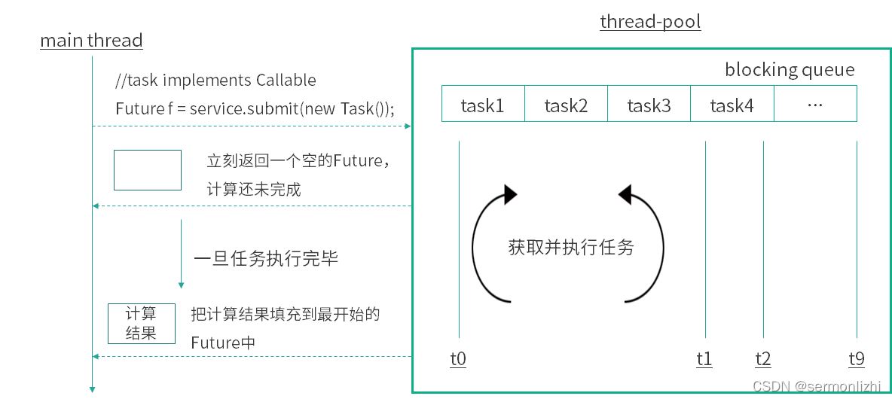
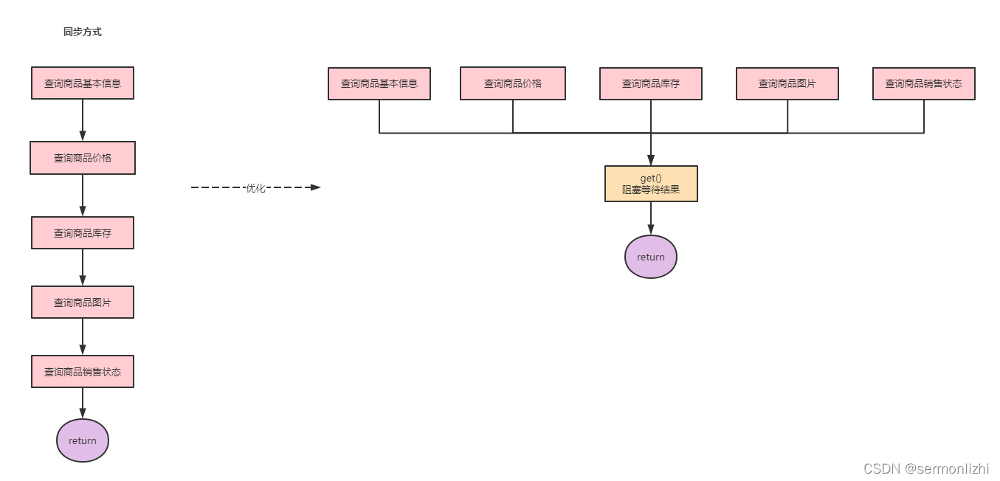
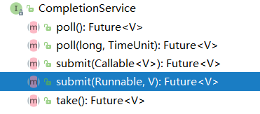
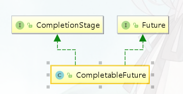
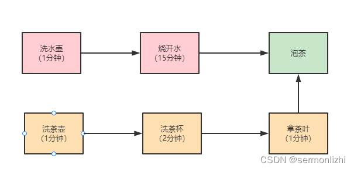

# CompletableFuture

在《Java线程详解》这篇文章中，介绍了创建一个Java线程的三种方式，其中继承`Thread`类或实现`Runnable`接口都可以创建线程，但这两种方法都有一个问题就是：没有返回值，不能获取执行完的结果。因此后面在JDK1.5才新增了一个`Callable`接口来解决上面的问题，而`Future`和`FutureTask`就可以与`Callable`配合起来使用。

而`Callable`只能在[线程池](https://so.csdn.net/so/search?q=线程池&spm=1001.2101.3001.7020)中提交任务使用，且只能在`submit()`和`invokeAnay()`以及`invokeAll()`这三个任务提交的方法中使用，如果需要直接使用`Thread`的方式启动线程，则需要使用`FutureTask`对象作为`Thread`的构造参数，而`FutureTask`的构造参数又是`Callable`的对象

下面展示线程中的使用，以`submit()`为例，其[源码](https://so.csdn.net/so/search?q=源码&spm=1001.2101.3001.7020)如下：

在该方法中，只是把`Callable`封装成了`FutureTask`而已，任务执行依然是`execute()`方法

```java
public <T> Future<T> submit(Callable<T> task) {
    if (task == null) throw new NullPointerException();
    RunnableFuture<T> ftask = newTaskFor(task);
    execute(ftask);
    return ftask;
}

protected <T> RunnableFuture<T> newTaskFor(Callable<T> callable) {
    return new FutureTask<T>(callable);
}
```

### 1.1 Callable和Runnable的区别

```java
@FunctionalInterface
public interface Runnable {
    public abstract void run();
}

@FunctionalInterface
public interface Callable<V> {
    V call() throws Exception;
}
```

**Callable的call方法可以有返回值，可以声明抛出异常**。和 `Callable`配合的有一个`Future`类，通过`Future`可以了解任务执行情况，或者取消任务的执行，还可获取任务执行的结果，这些功能都是`Runnable`做不到的，`Callable` 的功能要比`Runnable`强大。

```java
new Thread(new Runnable() {
    @Override
    public void run() {
        System.out.println("通过Runnable方式执行任务");
    }
}).start();

// 需要借助FutureTask
FutureTask task = new FutureTask(new Callable() {
    @Override
    public Object call() throws Exception {
        System.out.println("通过Callable方式执行任务");
        Thread.sleep(3000);
        return "返回任务结果";
    }
});
new Thread(task).start();
```

### 1.2 从Future到FutureTask

先看一下Future的源码及其定义：

源码中接口上面的注释已经解释地很清楚了，**Future就是对于具体的Runnable或者Callable任务的执行结果进行取消、查询是否完成、获取结果。必要时可以通过get方法获取执行结果，该方法会阻塞直到任务返回结果**。

```java
/**
 * A {@code Future} represents the result of an asynchronous
 * computation.  Methods are provided to check if the computation is
 * complete, to wait for its completion, and to retrieve the result of
 * the computation.  The result can only be retrieved using method
 * {@code get} when the computation has completed, blocking if
 * necessary until it is ready.  Cancellation is performed by the
 * {@code cancel} method.  Additional methods are provided to
 * determine if the task completed normally or was cancelled. Once a
 * computation has completed, the computation cannot be cancelled.
 * If you would like to use a {@code Future} for the sake
 * of cancellability but not provide a usable result, you can
 * declare types of the form {@code Future<?>} and
 * return {@code null} as a result of the underlying task.
 */
public interface Future<V> {
	// 取消任务的执行,参数表示是否立即中断任务执行,或者等任务结束
    boolean cancel(boolean mayInterruptIfRunning);
	// 任务是否已经取消,任务完成前将其取消,则返回true
    boolean isCancelled();
	// 任务是否已经完成
    boolean isDone();
    // 等待任务执行结束,返回泛型结果.中断或任务执行异常都会抛出异常
    V get() throws InterruptedException, ExecutionException;
	// 同上面的get功能一样，多了设置超时时间。参数timeout指定超时时间，uint指定时间的单位，在枚举类TimeUnit中有相关的定义。如果计算超时，将抛出TimeoutException
    V get(long timeout, TimeUnit unit)
        throws InterruptedException, ExecutionException, TimeoutException;
}
```

其工作过程大概如下：



`Future`归根结底只是一个接口，而`FutureTask`实现了这个接口，同时还实现了`Runnalbe`接口，这样`FutureTask`就相当于是消费者和生产者的桥梁了，消费者可以通过`FutureTask`存储任务的执行结果，更新任务的状态：未开始、处理中、已完成、已取消等等。而任务的生产者可以拿到`FutureTask`被转型为`Future`接口，可以阻塞式的获取处理结果，非阻塞式获取任务处理状态

总结：**FutureTask既可以被当做Runnable来执行，也可以被当做Future来获取Callable的返回结果**。

```java
public class FutureTask<V> implements RunnableFuture<V> {
    private volatile int state;
    private static final int NEW          = 0;
    private static final int COMPLETING   = 1;
    private static final int NORMAL       = 2;
    private static final int EXCEPTIONAL  = 3;
    private static final int CANCELLED    = 4;
    private static final int INTERRUPTING = 5;
    private static final int INTERRUPTED  = 6;

    /** The underlying callable; nulled out after running */
    // 任务
    private Callable<V> callable;
    /** The result to return or exception to throw from get() */
    // 执行结果或异常
    private Object outcome; // non-volatile, protected by state reads/writes
    /** The thread running the callable; CASed during run() */
    // 执行任务的线程
    private volatile Thread runner;
    /** Treiber stack of waiting threads */
    private volatile WaitNode waiters;
}

public interface RunnableFuture<V> extends Runnable, Future<V> {
    /**
     * Sets this Future to the result of its computation
     * unless it has been cancelled.
     */
    void run();
}
```

### 1.3 FutureTask使用

使用方式在上面已经介绍过了，构建一个`FutureTask`对象，其构造方法的入参为`Callable`的实例对象，然后将`FutureTask`对象作为`Thread`构造方法的入参。

这里展示一个实际的应用场景，平常在使用购物软件抢购促销产品的时候，需要查看商品信息(包括商品基本信息、商品价格、商品库存、商品图片)。而这些信息一般都分布在不同的业务中心，由不同的系统提供服务。如果采用同步方式，假设一个接口需要50ms，那么一个商品查询下来就需要200ms-300ms，这对于我们来说是不满意的。如果使用`Future`改造则需要的就是最长耗时服务的接口，也就是50ms左右。

如果采用同步方式，假设一个接口需要50ms，那么一个商品查询下来就需要200ms-300ms，这对于我们来说是不满意的。如果使用Future改造则需要的就是最长耗时服务的接口，也就是50ms左右。



**Future的注意事项**：

- 当 for 循环批量获取Future的结果时容易 block，**get 方法调用时应使用 timeout 限制**
- Future 的生命周期不能后退。一旦完成了任务，它就永久停在了“已完成”的状态，不能从头再来

**Future的局限性**：

从本质上说，Future表示一个异步计算的结果。它提供了isDone()来检测计算是否已经完成，并且在计算结束后，可以通过get()方法来获取计算结果。在异步计算中，Future确实是个非常优秀的接口。但是，它的本身也确实存在着许多限制：

- **并发执行多任务**：Future只提供了get()方法来获取结果，并且是阻塞的。所以，除了等待你别无他法；

- **无法对多个任务进行链式调用**：如果你希望在计算任务完成后执行特定动作，比如发邮件，但Future却没有提供这样的能力；
- **无法组合多个任务**：如果你运行了10个任务，并期望在它们全部执行结束后执行特定动作，那么在Future中这是无能为力的；

- **没有异常处理**：Future接口中没有关于异常处理的方法；

而这些局限性`CompletionService`和`CompletableFuture`都解决了，这边文章重点介绍`CompletionService`，后面会出一篇文章介绍`CompletableFuture`的使用

## 二、CompletionService使用

`Callable+Future`虽然可以实现多个task并行执行，但是如果遇到前面的task执行较慢时需要阻塞等待前面的task执行完后面task才能取得结果。而`CompletionService`的主要功能就是一边生成任务,一边获取任务的返回值。让两件事分开执行,任务之间不会互相阻塞，可以实现先执行完的先取结果，不再依赖任务顺序了。



`CompletionService`内部通过阻塞队列+`FutureTask`，实现了任务先完成可优先获取到，即结果按照完成先后顺序排序，内部有一个先进先出的阻塞队列，用于保存已经执行完成的Future，通过调用它的`take()`或`poll()`可以获取到一个已经执行完成的`Future`，进而通过调用`Future`接口实现类的get方法获取最终的结果

### 2.1 使用案例分析

#### 2.1.1 电商询价

**直接`Future`方式**

向不同电商平台询价，并保存价格，采用`ThreadPoolExecutor+Future`的方案：异步执行询价然后再保存

```java
//    创建线程池 
ExecutorService    executor = Executors.newFixedThreadPool(2); 
//    异步向电商S1询价 
Future<Integer>    f1 = executor.submit(()->getPriceByS1()); 
//    异步向电商S2询价 
Future<Integer>    f2=    executor.submit(()->getPriceByS2());             
//    获取电商S1报价并异步保存 
executor.execute(()->save(f1.get()));        
//    获取电商S2报价并异步保存 
executor.execute(()->save(f2.get())   
```

如果获取电商S1报价的耗时很长，那么即便获取电商S2报价的耗时很短，也无法让保存S2报价的操作先执行，因为这个主线程都阻塞 在了`f1.get()`操作上。

**`CompletionService`方式**

使用`CompletionService`实现先获取的报价先保存到数据库

```java
//创建线程池
ExecutorService executor = Executors.newFixedThreadPool(10);
//创建CompletionService
CompletionService<Integer> cs = new ExecutorCompletionService<>(executor);
//异步向电商S1询价
cs.submit(() -> getPriceByS1());
//异步向电商S2询价
cs.submit(() -> getPriceByS2());
//将询价结果异步保存到数据库
for (int i = 0; i < 2; i++) {
    Integer r = cs.take().get();
    executor.execute(() -> save(r));
}
```

#### 2.1.2 Dobbo的Forking Cluter场景

`Dubbo`中有一种叫做`Forking`的集群模式，这种集群模式下，**支持并行地调用多个服务实例，只要有一个成功就返回结果**。

```java
geocoder(addr) {
    //并行执行以下3个查询服务， 
    r1=geocoderByS1(addr);
    r2=geocoderByS2(addr);
    r3=geocoderByS3(addr);
    //只要r1,r2,r3有一个返回
    //则返回
    return r1|r2|r3;
}
```

通过`CompletionService`来实现这种`Forking`集群模式

```java
// 创建线程池
ExecutorService executor = Executors.newFixedThreadPool(3);
// 创建CompletionService
CompletionService<Integer> cs = new ExecutorCompletionService<>(executor);
// 用于保存Future对象
List<Future<Integer>> futures = new ArrayList<>(3);
//提交异步任务，并保存future到futures 
futures.add(cs.submit(()->geocoderByS1()));
futures.add(cs.submit(()->geocoderByS2()));
futures.add(cs.submit(()->geocoderByS3()));
// 获取最快返回的任务执行结果
Integer r = 0;
try {
  // 只要有一个成功返回，则break
  for (int i = 0; i < 3; ++i) {
    r = cs.take().get();
    //简单地通过判空来检查是否成功返回
    if (r != null) {
      break;
    }
  }
} finally {
  //取消所有任务
  for(Future<Integer> f : futures)
    f.cancel(true);
}
// 返回结果
return r;
```

**应用场景总结**

- 当需要批量提交异步任务的时候建议使用`CompletionService`。`CompletionService`将线程池`Executor`和阻塞队列`BlockingQueue`的功能融合在了一起，能够让批量异步任务的管理更简单。

- `CompletionService`能够让异步任务的执行结果有序化。先执行完的先进入阻塞队列，利用这个特性，你可以轻松实现后续处理的有序性，避免无谓的等待，同时还可以快速实现诸如`Forking Cluster`这样的需求。

- 线程池隔离。`CompletionService`支持自己创建线程池，这种隔离性能避免几个特别耗时的任务拖垮整个应用的风险。

## 三、源码分析

### 3.1 构造方法

`CompletionService`只是一个接口，它定义了一套提交任务和获取结果的方法，而它唯一的实现类`ExecutorCompletionService`来实现了这些方法，该类构造如下：

```java
public class ExecutorCompletionService<V> implements CompletionService<V> {
    // 执行任务的线程池
    private final Executor executor;
    private final AbstractExecutorService aes;
    // 任务完成会记录在该队列中
    private final BlockingQueue<Future<V>> completionQueue;
}
```

`ExecutorCompletionService`提供了两个构造方法，其中线程池是一定要有的参数，任务完成的记录队列默认使用的是`LinkedBlockingQueue

```java
public ExecutorCompletionService(Executor executor) {
    if (executor == null)
        throw new NullPointerException();
    this.executor = executor;
    this.aes = (executor instanceof AbstractExecutorService) ?
        (AbstractExecutorService) executor : null;
    this.completionQueue = new LinkedBlockingQueue<Future<V>>();
}

public ExecutorCompletionService(Executor executor,
                                 BlockingQueue<Future<V>> completionQueue) {
    if (executor == null || completionQueue == null)
        throw new NullPointerException();
    this.executor = executor;
    this.aes = (executor instanceof AbstractExecutorService) ?
        (AbstractExecutorService) executor : null;
    this.completionQueue = completionQueue;
}
```

### 3.2 任务执行与结果记录

提供了两个任务提交的方法，可以传`Callable`和`Runnable`类型的参数，这内部都会将其转换为`RunnableFutuer`实例，然后再封装成`QueueingFuture`实例作为任务来执行

```java
public Future<V> submit(Callable<V> task) {
    if (task == null) throw new NullPointerException();
    RunnableFuture<V> f = newTaskFor(task);
    executor.execute(new QueueingFuture(f));
    return f;
}

public Future<V> submit(Runnable task, V result) {
    if (task == null) throw new NullPointerException();
    RunnableFuture<V> f = newTaskFor(task, result);
    executor.execute(new QueueingFuture(f));
    return f;
}
```

#### 3.2.1 封装RunnableFuture

不论`aes`是否为null，它们最终调用的都是`FutureTask`的构造方法

```java
private RunnableFuture<V> newTaskFor(Callable<V> task) {
    if (aes == null)
        return new FutureTask<V>(task);
    else
        return aes.newTaskFor(task);
}

private RunnableFuture<V> newTaskFor(Runnable task, V result) {
    if (aes == null)
        return new FutureTask<V>(task, result);
    else
        return aes.newTaskFor(task, result);
}

protected <T> RunnableFuture<T> newTaskFor(Callable<T> callable) {
    return new FutureTask<T>(callable);
}

protected <T> RunnableFuture<T> newTaskFor(Runnable runnable, T value) {
    return new FutureTask<T>(runnable, value);
}
```

在前面的已经看过`FutureTask`的结构，它的任务是使用`Callable`实例表示的，所以对于`Runnable`类型的任务，会将其封装成一个`Callable`类型任务

```java
public FutureTask(Callable<V> callable) {
    if (callable == null)
        throw new NullPointerException();
    this.callable = callable;
    this.state = NEW;       // ensure visibility of callable
}

public FutureTask(Runnable runnable, V result) {
    // 线程池静态方法,将runnable封装成一个callable
    this.callable = Executors.callable(runnable, result);
    this.state = NEW;       // ensure visibility of callable
}

public static <T> Callable<T> callable(Runnable task, T result) {
    if (task == null)
        throw new NullPointerException();
    // 构造一个适配对象
    return new RunnableAdapter<T>(task, result);
}

// 继承了Callble,内部存储Runnablle,调用call方法时,内部调用runnable的run方法
static final class RunnableAdapter<T> implements Callable<T> {
    final Runnable task;
    final T result;
    RunnableAdapter(Runnable task, T result) {
        this.task = task;
        this.result = result;
    }
    public T call() {
        task.run();
        return result;
    }
}
```

#### 3.2.2 任务提交

`QueueingFuture`是`ExecutorCompletionService`的内部类，其实现了`FutureTask`接口，当任务执行时，会去调用`FutureTask`的`run()

```java
private class QueueingFuture extends FutureTask<Void> {
    QueueingFuture(RunnableFuture<V> task) {
        super(task, null);
        this.task = task;
    }
    protected void done() { completionQueue.add(task); }
    private final Future<V> task;
}
```

下面是`FutureTask`的`run()`

```java
public void run() {
    // 任务已经被执行,直接退出
    if (state != NEW ||
        !UNSAFE.compareAndSwapObject(this, runnerOffset,
                                     null, Thread.currentThread()))
        return;
    try {
        Callable<V> c = callable;
        if (c != null && state == NEW) {
            V result;
            boolean ran;
            try {
                // 执行任务
                result = c.call();
                ran = true;
            } catch (Throwable ex) {
                result = null;
                ran = false;
                // 记录异常
                setException(ex);
            }
            // 任务执行成功,则记录返回结果
            if (ran)
                set(result);
        }
    } finally {
        // runner must be non-null until state is settled to
        // prevent concurrent calls to run()
        runner = null;
        // state must be re-read after nulling runner to prevent
        // leaked interrupts
        int s = state;
        if (s >= INTERRUPTING)
            handlePossibleCancellationInterrupt(s);
    }
}
```

在任务执行成功，记录返回记录结果的时候，会调用`finishCompletion()`去唤醒所有阻塞的线程并调用`done()`方法

```java
protected void set(V v) {
    if (UNSAFE.compareAndSwapInt(this, stateOffset, NEW, COMPLETING)) {
        outcome = v;
        UNSAFE.putOrderedInt(this, stateOffset, NORMAL); // final state
        finishCompletion();
    }
}

private void finishCompletion() {
    // assert state > COMPLETING;
    for (WaitNode q; (q = waiters) != null;) {
        if (UNSAFE.compareAndSwapObject(this, waitersOffset, q, null)) {
            // 唤醒后面所有等待的线程
            for (;;) {
                Thread t = q.thread;
                if (t != null) {
                    q.thread = null;
                    LockSupport.unpark(t);
                }
                WaitNode next = q.next;
                if (next == null)
                    break;
                q.next = null; // unlink to help gc
                q = next;
            }
            break;
        }
    }

    done();
	// 任务执行完了,将其置为null
    callable = null;        // to reduce footprint
}
```

而`QueueingFuture`内部类就实现了`done()`方法，它将执行完的`FutureTask`放入到阻塞队列中，当调用`take()`方法时就可以取到任务的执行结果，如果任务都还没有执行完，就阻塞。

## CompletableFuture

### 1.1 概述

而`CompletableFuture`是对`Future`的扩展和增强。`CompletableFuture`实现了`Future`接口，并在此基础上进行了丰富的扩展，完美弥补了`Future`的局限性，**同时`CompletableFuture`实现了对任务编排的能力**。借助这项能力，可以轻松地组织不同任务的运行顺序、规则以及方式。从某种程度上说，这项能力是它的核心能力。而在以往，虽然通过`CountDownLatch`等工具类也可以实现任务的编排，但需要复杂的逻辑处理，不仅耗费精力且难以维护。

`CompletableFuture`的继承结构如下：


`CompletionStage`接口定义了任务编排的方法，执行某一阶段，可以向下执行后续阶段。**异步执行的，默认线程池是`ForkJoinPool.commonPool()`，但为了业务之间互不影响，且便于定位问题，强烈推荐使用自定义线程池**。

`CompletableFuture`中默认[线程池](https://so.csdn.net/so/search?q=线程池&spm=1001.2101.3001.7020)如下：

```java
// 根据commonPool的并行度来选择,而并行度的计算是在ForkJoinPool的静态代码段完成的
private static final boolean useCommonPool =
    (ForkJoinPool.getCommonPoolParallelism() > 1);

private static final Executor asyncPool = useCommonPool ?
    ForkJoinPool.commonPool() : new ThreadPerTaskExecutor();
```

`ForkJoinPool`中初始化`commonPool`的参数

```java
static {
    // initialize field offsets for CAS etc
    try {
        U = sun.misc.Unsafe.getUnsafe();
        Class<?> k = ForkJoinPool.class;
        CTL = U.objectFieldOffset
            (k.getDeclaredField("ctl"));
        RUNSTATE = U.objectFieldOffset
            (k.getDeclaredField("runState"));
        STEALCOUNTER = U.objectFieldOffset
            (k.getDeclaredField("stealCounter"));
        Class<?> tk = Thread.class;
        ……
    } catch (Exception e) {
        throw new Error(e);
    }

    commonMaxSpares = DEFAULT_COMMON_MAX_SPARES;
    defaultForkJoinWorkerThreadFactory =
        new DefaultForkJoinWorkerThreadFactory();
    modifyThreadPermission = new RuntimePermission("modifyThread");

    // 调用makeCommonPool方法创建commonPool,其中并行度为逻辑核数-1
    common = java.security.AccessController.doPrivileged
        (new java.security.PrivilegedAction<ForkJoinPool>() {
            public ForkJoinPool run() { return makeCommonPool(); }});
    int par = common.config & SMASK; // report 1 even if threads disabled
    commonParallelism = par > 0 ? par : 1;
}
```

### 1.2 功能

#### 1.2.1 常用方法

##### 依赖关系

- `thenApply()`：把前面任务的执行结果，交给后面的`Function`
- `thenCompose()`：用来连接两个有依赖关系的任务，结果由第二个任务返回

##### and集合关系

- `thenCombine()`：合并任务，有返回值
- `thenAccepetBoth()`：两个任务执行完成后，将结果交给`thenAccepetBoth`处理，无返回值
- `runAfterBoth()`：两个任务都执行完成后，执行下一步操作(`Runnable`类型任务)

##### or聚合关系

- `applyToEither()`：两个任务哪个执行的快，就使用哪一个结果，有返回值
- `acceptEither()`：两个任务哪个执行的快，就消费哪一个结果，无返回值
- `runAfterEither()`：任意一个任务执行完成，进行下一步操作(`Runnable`类型任务)

##### 并行执行

- `allOf()`：当所有给定的 CompletableFuture 完成时，返回一个新的 CompletableFuture
- `anyOf()`：当任何一个给定的`CompletablFuture`完成时，返回一个新的CompletableFuture

##### 结果处理

- `whenComplete`：当任务完成时，将使用结果(或 null)和此阶段的异常(或 null如果没有)执行给定操作

- `exceptionally`：返回一个新的`CompletableFuture`，当前面的`CompletableFuture`完成时，它也完成，当它异常完成时，给定函数的异常触发这个`CompletableFuture`的完成

### 1.2.2 异步操作

`CompletableFuture`提供了四个静态方法来创建一个异步操作：

```java
public static CompletableFuture<Void> runAsync(Runnable runnable)
public static CompletableFuture<Void> runAsync(Runnable runnable, Executor executor)
public static <U> CompletableFuture<U> supplyAsync(Supplier<U> supplier)
public static <U> CompletableFuture<U> supplyAsync(Supplier<U> supplier, Executor executor)
```

这四个方法的区别：

- `runAsync()` 以`Runnable`函数式接口类型为参数，没有返回结果，`supplyAsync()` 以`Supplier`函数式接口类型为参数，返回结果类型为U；Supplier接口的 `get()`是有返回值的(会阻塞)

- 使用没有指定`Executor`的方法时，内部使用`ForkJoinPool.commonPool()` 作为它的线程池执行异步代码。如果指定线程池，则使用指定的线程池运行。
- 默认情况下`CompletableFuture`会使用公共的`ForkJoinPool`线程池，这个线程池默认创建的线程数是 CPU 的核数（也可以通过
-  JVM option:-Djava.util.concurrent.ForkJoinPool.common.parallelism 来设置ForkJoinPool线程池的线程数）。如果所有CompletableFuture共享一个线程池，那么一旦有任务执行一些很慢的 I/O 操作，就会导致线程池中所有线程都阻塞在 I/O 操作上，从而造成线程饥饿，进而影响整个系统的性能。所以，强烈建议你要根据不同的业务类型创建不同的线程池，以避免互相干扰

#### 异步操作

```java
Runnable runnable = () -> System.out.println("无返回结果异步任务");
CompletableFuture.runAsync(runnable);

CompletableFuture<String> future = CompletableFuture.supplyAsync(() -> {
    System.out.println("有返回值的异步任务");
    try {
        Thread.sleep(5000);
    } catch (InterruptedException e) {
        e.printStackTrace();
    }
    return "Hello World";
});
String result = future.get();
```

#### 获取结果(join&get)

join()和get()方法都是用来获取CompletableFuture异步之后的返回值。join()方法抛出的是uncheck异常（即未经检查的异常),不会强制开发者抛出。get()方法抛出的是经过检查的异常，ExecutionException, InterruptedException 需要用户手动处理（抛出或者 try catch）

#### 结果处理

当CompletableFuture的计算结果完成，或者抛出异常的时候，我们可以执行特定的 Action。主要是下面的方法：

```java
public CompletableFuture<T> whenComplete(BiConsumer<? super T,? super Throwable> action)
public CompletableFuture<T> whenCompleteAsync(BiConsumer<? super T,? super Throwable> action)
public CompletableFuture<T> whenCompleteAsync(BiConsumer<? super T,? super Throwable> action, Executor executor)
```

- Action的类型是BiConsumer<? super T,? super Throwable>，它可以处理正常的计算结果，或者异常情况。
- 方法不以Async结尾，意味着Action使用相同的线程执行，而Async可能会使用其它的线程去执行(如果使用相同的线程池，也可能会被同一个线程选中执行)。
- 这几个方法都会返回CompletableFuture，当Action执行完毕后它的结果返回原始的CompletableFuture的计算结果或者返回异常

```java
CompletableFuture<String> future = CompletableFuture.supplyAsync(() -> {
    try {
        TimeUnit.SECONDS.sleep(1);
    } catch (InterruptedException e) {
    }
    if (new Random().nextInt(10) % 2 == 0) {
        int i = 12 / 0;
    }
    System.out.println("执行结束！");
    return "test";
});
// 任务完成或异常方法完成时执行该方法
// 如果出现了异常,任务结果为null
future.whenComplete(new BiConsumer<String, Throwable>() {
    @Override
    public void accept(String t, Throwable action) {
        System.out.println(t+" 执行完成！");
    }
});
// 出现异常时先执行该方法
future.exceptionally(new Function<Throwable, String>() {
    @Override
    public String apply(Throwable t) {
        System.out.println("执行失败：" + t.getMessage());
        return "异常xxxx";
    }
});

future.get();
```

上面的代码当出现异常时，输出结果如下

```java
执行失败：java.lang.ArithmeticException: / by zero
null 执行完成！
```

## 二、应用场景

### 2.1 结果转换

将上一段任务的执行结果作为下一阶段任务的入参参与重新计算，产生新的结果。

#### thenApply

`thenApply`接收一个函数作为参数，使用该函数处理上一个`CompletableFuture`调用的结果，并返回一个具有处理结果的`Future`对象。

常用使用：

```java
public <U> CompletableFuture<U> thenApply(Function<? super T,? extends U> fn)
public <U> CompletableFuture<U> thenApplyAsync(Function<? super T,? extends U> fn)
```

具体使用：

```java
CompletableFuture<Integer> future = CompletableFuture.supplyAsync(() -> {
    int result = 100;
    System.out.println("第一次运算：" + result);
    return result;
}).thenApply(number -> {
    int result = number * 3;
    System.out.println("第二次运算：" + result);
    return result;
});
```

#### thenCompose

`thenCompose`的参数为一个返回`CompletableFuture`实例的函数，该函数的参数是先前计算步骤的结果。

常用方法：

```java
public <U> CompletableFuture<U> thenCompose(Function<? super T, ? extends CompletionStage<U>> fn);
public <U> CompletableFuture<U> thenComposeAsync(Function<? super T, ? extends CompletionStage<U>> fn) ;
```

具体使用：

```java
CompletableFuture<Integer> future = CompletableFuture
    .supplyAsync(new Supplier<Integer>() {
        @Override
        public Integer get() {
            int number = new Random().nextInt(30);
            System.out.println("第一次运算：" + number);
            return number;
        }
    })
    .thenCompose(new Function<Integer, CompletionStage<Integer>>() {
        @Override
        public CompletionStage<Integer> apply(Integer param) {
            return CompletableFuture.supplyAsync(new Supplier<Integer>() {
                @Override
                public Integer get() {
                    int number = param * 2;
                    System.out.println("第二次运算：" + number);
                    return number;
                }
            });
        }
    });
```

**thenApply 和 thenCompose的区别**：

- `thenApply`转换的是泛型中的类型，返回的是同一个`CompletableFuture`；

- `thenCompose`将内部的`CompletableFuture`调用展开来并使用上一个`CompletableFutre`调用的结果在下一步的`CompletableFuture`调用中进行运算，是生成一个新的`CompletableFuture`。

### 2.2 结果消费

与**结果处理**和**结果转换**系列函数返回一个新的`CompletableFuture`不同，结果消费系列函数只对结果执行`Action`，而不返回新的计算值。

根据对结果的处理方式，结果消费函数又可以分为下面三大类：

- `thenAccept()`：对单个结果进行消费
- `thenAcceptBoth()`：对两个结果进行消费
- `thenRun()`：不关心结果，只对结果执行`Action`

#### thenAccept

观察该系列函数的参数类型可知，它们是函数式接口Consumer，这个接口只有输入，没有返回值。

常用方法：

```java
public CompletionStage<Void> thenAccept(Consumer<? super T> action);
public CompletionStage<Void> thenAcceptAsync(Consumer<? super T> action);
```

具体使用：

```java
CompletableFuture<Void> future = CompletableFuture
    .supplyAsync(() -> {
        int number = new Random().nextInt(10);
        System.out.println("第一次运算：" + number);
        return number;
    }).thenAccept(number ->
                  System.out.println("第二次运算：" + number * 5));
```

#### thenAcceptBoth

`thenAcceptBoth`函数的作用是，当两个`CompletionStage`都正常完成计算的时候，就会执行提供的`action`消费两个异步的结果。

常用方法：

```java
public <U> CompletionStage<Void> thenAcceptBoth(CompletionStage<? extends U> other,BiConsumer<? super T, ? super U> action);
public <U> CompletionStage<Void> thenAcceptBothAsync(CompletionStage<? extends U> other,BiConsumer<? super T, ? super U> action);
```

具体使用：

```java
CompletableFuture<Integer> futrue1 = CompletableFuture.supplyAsync(new Supplier<Integer>() {
    @Override
    public Integer get() {
        int number = new Random().nextInt(3) + 1;
        try {
            TimeUnit.SECONDS.sleep(number);
        } catch (InterruptedException e) {
            e.printStackTrace();
        }
        System.out.println("任务1结果：" + number);
        return number;
    }
});

CompletableFuture<Integer> future2 = CompletableFuture.supplyAsync(new Supplier<Integer>() {
    @Override
    public Integer get() {
        int number = new Random().nextInt(3) + 1;
        try {
            TimeUnit.SECONDS.sleep(number);
        } catch (InterruptedException e) {
            e.printStackTrace();
        }
        System.out.println("任务2结果：" + number);
        return number;
    }
});

futrue1.thenAcceptBoth(future2, new BiConsumer<Integer, Integer>() {
    @Override
    public void accept(Integer x, Integer y) {
        System.out.println("最终结果：" + (x + y));
    }
});
```

#### thenRun

`thenRun`也是对线程任务结果的一种消费函数，与`thenAccept`不同的是，`thenRun`会在上一阶段 `CompletableFuture`计算完成的时候执行一个`Runnable`，而`Runnable`并不使用该`CompletableFuture`计算的结果。

常用方法：

```java
public CompletionStage<Void> thenRun(Runnable action);
public CompletionStage<Void> thenRunAsync(Runnable action);
```

具体使用：

```java
CompletableFuture<Void> future = CompletableFuture.supplyAsync(() -> {
    int number = new Random().nextInt(10);
    System.out.println("第一阶段：" + number);
    return number;
}).thenRun(() ->
           System.out.println("thenRun 执行"));
```

### 2.3 结果组合

##### thenCombine

合并两个线程任务的结果，并进一步处理。

常用方法：

```java
public <U,V> CompletableFuture<V> thenCombine(CompletionStage<? extends U> other,BiFunction<? super T,? super U,? extends V> fn);

public <U,V> CompletableFuture<V> thenCombineAsync(CompletionStage<? extends U> other,BiFunction<? super T,? super U,? extends V> fn);

public <U,V> CompletableFuture<V> thenCombineAsync(CompletionStage<? extends U> other,BiFunction<? super T,? super U,? extends V> fn, Executor executor);
```

具体使用：

```java
CompletableFuture<Integer> future1 = CompletableFuture
    .supplyAsync(new Supplier<Integer>() {
        @Override
        public Integer get() {
            int number = new Random().nextInt(10);
            System.out.println("任务1结果：" + number);
            return number;
        }
    });
CompletableFuture<Integer> future2 = CompletableFuture
    .supplyAsync(new Supplier<Integer>() {
        @Override
        public Integer get() {
            int number = new Random().nextInt(10);
            System.out.println("任务2结果：" + number);
            return number;
        }
    });
CompletableFuture<Integer> result = future1
    .thenCombine(future2, new BiFunction<Integer, Integer, Integer>() {
        @Override
        public Integer apply(Integer x, Integer y) {
            return x + y;
        }
    });
System.out.println("组合后结果：" + result.get());
```

### 2.4 任务交互

线程交互指**将两个线程任务获取结果的速度相比较，按一定的规则进行下一步处理**。

#### applyToEither

两个线程任务相比较，先获得执行结果的，就对该结果进行下一步的转化操作。

常用方法：

```java
public <U> CompletionStage<U> applyToEither(CompletionStage<? extends T> other,Function<? super T, U> fn);
public <U> CompletionStage<U> applyToEitherAsync(CompletionStage<? extends T> other,Function<? super T, U> fn);
```

具体使用：

```java
CompletableFuture<Integer> future1 = CompletableFuture
    .supplyAsync(new Supplier<Integer>() {
        @Override
        public Integer get() {
            int number = new Random().nextInt(10);
            try {
                TimeUnit.SECONDS.sleep(number);
            } catch (InterruptedException e) {
                e.printStackTrace();
            }
            System.out.println("任务1结果:" + number);
            return number;
        }
    });
CompletableFuture<Integer> future2 = CompletableFuture.supplyAsync(new Supplier<Integer>() {
    @Override
    public Integer get() {
        int number = new Random().nextInt(10);
        try {
            TimeUnit.SECONDS.sleep(number);
        } catch (InterruptedException e) {
            e.printStackTrace();
        }
        System.out.println("任务2结果:" + number);
        return number;
    }
});

future1.applyToEither(future2, new Function<Integer, Integer>() {
    @Override
    public Integer apply(Integer number) {
        System.out.println("最快结果：" + number);
        return number * 2;
    }
});
```

#### acceptEither

两个线程任务相比较，先获得执行结果的，就对该结果进行下一步的消费操作。

常用方法：

```java
public CompletionStage<Void> acceptEither(CompletionStage<? extends T> other,Consumer<? super T> action);
public CompletionStage<Void> acceptEitherAsync(CompletionStage<? extends T> other,Consumer<? super T> action);
```

具体使用：

```java
CompletableFuture<Integer> future1 = CompletableFuture.supplyAsync(new Supplier<Integer>() {
    @Override
    public Integer get() {
        int number = new Random().nextInt(10) + 1;
        try {
            TimeUnit.SECONDS.sleep(number);
        } catch (InterruptedException e) {
            e.printStackTrace();
        }
        System.out.println("第一阶段：" + number);
        return number;
    }
});

CompletableFuture<Integer> future2 = CompletableFuture.supplyAsync(new Supplier<Integer>() {
    @Override
    public Integer get() {
        int number = new Random().nextInt(10) + 1;
        try {
            TimeUnit.SECONDS.sleep(number);
        } catch (InterruptedException e) {
            e.printStackTrace();
        }
        System.out.println("第二阶段：" + number);
        return number;
    }
});

future1.acceptEither(future2, new Consumer<Integer>() {
    @Override
    public void accept(Integer number) {
        System.out.println("最快结果：" + number);
    }
});
```

#### runAfterEither

两个线程任务相比较，有任何一个执行完成，就进行下一步操作，不关心运行结果。

常用方法：

```java
public CompletionStage<Void> runAfterEither(CompletionStage<?> other,Runnable action);
public CompletionStage<Void> runAfterEitherAsync(CompletionStage<?> other,Runnable action);
```

具体使用：

```java
CompletableFuture<Integer> future1 = CompletableFuture.supplyAsync(new Supplier<Integer>() {
    @Override
    public Integer get() {
        int number = new Random().nextInt(5);
        try {
            TimeUnit.SECONDS.sleep(number);
        } catch (InterruptedException e) {
            e.printStackTrace();
        }
        System.out.println("任务1结果：" + number);
        return number;
    }
});

CompletableFuture<Integer> future2 = CompletableFuture.supplyAsync(new Supplier<Integer>() {
    @Override
    public Integer get() {
        int number = new Random().nextInt(5);
        try {
            TimeUnit.SECONDS.sleep(number);
        } catch (InterruptedException e) {
            e.printStackTrace();
        }
        System.out.println("任务2结果:" + number);
        return number;
    }
});

future1.runAfterEither(future2, new Runnable() {
    @Override
    public void run() {
        System.out.println("已经有一个任务完成了");
    }
}).join();
```

#### anyOf

`anyOf() `的参数是多个给定的 `CompletableFuture`，当其中的任何一个完成时，方法返回这个 `CompletableFuture`。

常用方法：

```java
public static CompletableFuture<Object> anyOf(CompletableFuture<?>... cfs)
```

具体使用：

```java
Random random = new Random();
CompletableFuture<String> future1 = CompletableFuture.supplyAsync(() -> {
    try {
        TimeUnit.SECONDS.sleep(random.nextInt(5));
    } catch (InterruptedException e) {
        e.printStackTrace();
    }
    return "hello";
});

CompletableFuture<String> future2 = CompletableFuture.supplyAsync(() -> {
    try {
        TimeUnit.SECONDS.sleep(random.nextInt(1));
    } catch (InterruptedException e) {
        e.printStackTrace();
    }
    return "world";
});
CompletableFuture<Object> result = CompletableFuture.anyOf(future1, future2);
```

#### allOf

allOf方法用来实现多 CompletableFuture 的同时返回。

常用方法：

```java
public static CompletableFuture<Void> allOf(CompletableFuture<?>... cfs)
```

具体使用：

```java
CompletableFuture<String> future1 = CompletableFuture.supplyAsync(() -> {
    try {
        TimeUnit.SECONDS.sleep(2);
    } catch (InterruptedException e) {
        e.printStackTrace();
    }
    System.out.println("future1完成！");
    return "future1完成！";
});

CompletableFuture<String> future2 = CompletableFuture.supplyAsync(() -> {
    System.out.println("future2完成！");
    return "future2完成！";
});

CompletableFuture<Void> combindFuture = CompletableFuture.allOf(future1, future2);

try {
    combindFuture.get();
} catch (InterruptedException e) {
    e.printStackTrace();
} catch (ExecutionException e) {
    e.printStackTrace();
}
```

**CompletableFuture常用方法总结**:

注：`CompletableFuture`中还有很多功能丰富的方法，这里就不一一列举。

## 三、使用案例

### **实现最优的“烧水泡茶”程序**

著名数学家华罗庚先生在《统筹方法》这篇文章里介绍了一个烧水泡茶的例子，文中提到最优的工序应该是下面这样：



对于烧水泡茶这个程序，一种最优的分工方案：用两个线程 T1 和 T2 来完成烧水泡茶程序，T1 负责洗水壶、烧开水、泡茶这三道工序，T2 负责洗茶壶、洗茶杯、拿茶叶三道工序，其中 T1 在执行泡茶这道工序时需要等待 T2 完成拿茶叶的工序。

#### 基于Future实现

```java
public class FutureTaskTest{

    public static void main(String[] args) throws ExecutionException, InterruptedException {
        // 创建任务T2的FutureTask
        FutureTask<String> ft2 = new FutureTask<>(new T2Task());
        // 创建任务T1的FutureTask
        FutureTask<String> ft1 = new FutureTask<>(new T1Task(ft2));

        // 线程T1执行任务ft1
        Thread T1 = new Thread(ft2);
        T1.start();
        // 线程T2执行任务ft2
        Thread T2 = new Thread(ft1);
        T2.start();
        // 等待线程T1执行结果
        System.out.println(ft1.get());

    }
}

// T1Task需要执行的任务：
// 洗水壶、烧开水、泡茶
class T1Task implements Callable<String> {
    FutureTask<String> ft2;
    // T1任务需要T2任务的FutureTask
    T1Task(FutureTask<String> ft2){
        this.ft2 = ft2;
    }
    @Override
    public String call() throws Exception {
        System.out.println("T1:洗水壶...");
        TimeUnit.SECONDS.sleep(1);

        System.out.println("T1:烧开水...");
        TimeUnit.SECONDS.sleep(15);
        // 获取T2线程的茶叶
        String tf = ft2.get();
        System.out.println("T1:拿到茶叶:"+tf);

        System.out.println("T1:泡茶...");
        return "上茶:" + tf;
    }
}
// T2Task需要执行的任务:
// 洗茶壶、洗茶杯、拿茶叶
class T2Task implements Callable<String> {
    @Override
    public String call() throws Exception {
        System.out.println("T2:洗茶壶...");
        TimeUnit.SECONDS.sleep(1);

        System.out.println("T2:洗茶杯...");
        TimeUnit.SECONDS.sleep(2);

        System.out.println("T2:拿茶叶...");
        TimeUnit.SECONDS.sleep(1);
        return "龙井";
    }
}
```

#### 基于CompletableFuture实现

```java
public class CompletableFutureTest {

    public static void main(String[] args) {

        //任务1：洗水壶->烧开水
        CompletableFuture<Void> f1 = CompletableFuture
            .runAsync(() -> {
                System.out.println("T1:洗水壶...");
                sleep(1, TimeUnit.SECONDS);

                System.out.println("T1:烧开水...");
                sleep(15, TimeUnit.SECONDS);
            });
        //任务2：洗茶壶->洗茶杯->拿茶叶
        CompletableFuture<String> f2 = CompletableFuture
            .supplyAsync(() -> {
                System.out.println("T2:洗茶壶...");
                sleep(1, TimeUnit.SECONDS);

                System.out.println("T2:洗茶杯...");
                sleep(2, TimeUnit.SECONDS);

                System.out.println("T2:拿茶叶...");
                sleep(1, TimeUnit.SECONDS);
                return "龙井";
            });
        //任务3：任务1和任务2完成后执行：泡茶
        CompletableFuture<String> f3 = f1.thenCombine(f2, (__, tf) -> {
            System.out.println("T1:拿到茶叶:" + tf);
            System.out.println("T1:泡茶...");
            return "上茶:" + tf;
        });
        //等待任务3执行结果
        System.out.println(f3.join());
    }

    static void sleep(int t, TimeUnit u){
        try {
            u.sleep(t);
        } catch (InterruptedException e) {
        }
    }
}
```

