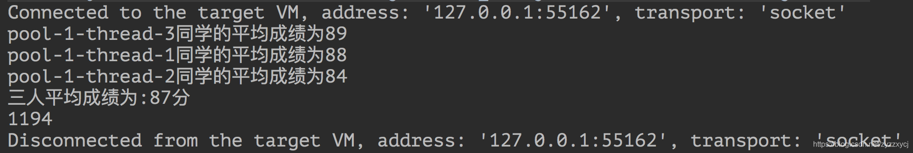

# CountDownLatch和CyclicBarrier的用法与区别

## 前言

CyclicBarrier和CountDownLatch这两个工具都是在java.util.concurrent包下，并且平时很多场景都会使用到。
本文将会对两者进行分析，记录他们的用法和区别。

## CountDownLatch

CountDownLatch是一个非常实用的**多线程**控制工具类，称之为“倒计时器”，它允许一个或多个线程一直等待，直到其他线程的操作执行完后再执行。
CountDownLatch是通过一个计数器来实现的，计数器的初始值为线程的数量。每当一个线程完成了自己的任务后，计数器的值就会减1。当计数器值到达0时，它表示所有的线程已经完成了任务，然后在闭锁上等待的线程就可以恢复执行任务。


### 特点

只能一次性使用(不能reset)；主线程阻塞；某个线程中断将永远到不了屏障点，所有线程都会一直等待。

### 例子

```java
public class CyclicBarrierTest {
 		//创建初始化3个线程的线程池
    private ExecutorService                    threadPool     = Executors.newFixedThreadPool(3);
    //保存每个学生的平均成绩
    private ConcurrentHashMap<String, Integer> map            = new ConcurrentHashMap<>();
    private CountDownLatch                     countDownLatch = new CountDownLatch(3);

    private void count() {
        for (int i = 0; i < 3; i++) {
            threadPool.execute(() -> {
                //计算每个学生的平均成绩,代码略()假设为60~100的随机数
                int score = (int) (Math.random() * 40 + 60);
                try {
                    Thread.sleep(Math.round(Math.random() * 1000));
                } catch (InterruptedException e) {
                    e.printStackTrace();
                }
                map.put(Thread.currentThread().getName(), score);
                System.out.println(Thread.currentThread().getName() + "同学的平均成绩为" + score);
                countDownLatch.countDown();
            });
        }
        this.run();
        threadPool.shutdown();
    }

    @Override
    public void run() {
        try {
            countDownLatch.await();
        } catch (InterruptedException e) {
            e.printStackTrace();
        }
        int result = 0;
        Set<String> set = map.keySet();
        for (String s : set) {
            result += map.get(s);
        }
        System.out.println("三人平均成绩为:" + (result / 3) + "分");
    }

    public static void main(String[] args) throws InterruptedException {
        long now = System.currentTimeMillis();
        CyclicBarrierTest cb = new CyclicBarrierTest();
        cb.count();
        Thread.sleep(100);
        long end = System.currentTimeMillis();
        System.out.println(end - now);
    }
}
```

最终输出结果：

其中1194ms证明了会阻塞主线程。

## CyclicBarrier

CyclicBarrier 的字面意思是可循环使用（Cyclic）的屏障（Barrier）。它要做的事情是，让一组线程到达一个屏障（也可以叫同步点）时被阻塞，直到最后一个线程到达屏障时，屏障才会开门，所有被屏障拦截的线程才会继续干活。

这个屏障之所以用循环修饰，是因为在所有的线程释放彼此之后，这个屏障是可以重新使用的（reset()方法重置屏障点），这一点与CountDownLatch不同。

CyclicBarrier是一种同步机制允许一组线程相互等待，等到所有线程都到达一个屏障点才退出await方法，它没有直接实现AQS而是借助ReentrantLock来实现的同步机制。它是可循环使用的，而CountDownLatch是一次性的，另外它体现的语义也跟CountDownLatch不同，CountDownLatch减少计数到达条件采用的是release方式，而CyclicBarrier走向屏障点（await）采用的是Acquire方式，Acquire是会阻塞的，这也实现了CyclicBarrier的另外一个特点，只要有一个线程中断那么屏障点就被打破，所有线程都将被唤醒（CyclicBarrier自己负责这部分实现，不是由AQS调度的），这样也避免了因为一个线程中断引起永远不能到达屏障点而导致其他线程一直等待。屏障点被打破的CyclicBarrier将不可再使用（会抛出BrokenBarrierException）除非执行reset操作。


构造函数

CyclicBarrier有两个构造函数:

1. CyclicBarrier(int parties)

   int类型的参数表示有几个线程来参与这个屏障拦截，(拿上面的例子,即有几个人跟团旅游)；

2. CyclicBarrier(int parties,Runnable barrierAction)

   当所有线程到达一个屏障点时，优先执行barrierAction这个线程。

最重要的一个方法:
await();每个线程调用await()，表示我已经到达屏障点,然后当前线程被阻塞。

```java
public class CyclicBarrierTest {		
		//创建初始化3个线程的线程池
    private ExecutorService                    threadPool     = Executors.newFixedThreadPool(3);
    //创建3个CyclicBarrier对象,执行完后执行当前类的run方法
    private CyclicBarrier                      cb             = new CyclicBarrier(3, this);
    //保存每个学生的平均成绩
    private ConcurrentHashMap<String, Integer> map            = new ConcurrentHashMap<>();

    private void count() {
        for (int i = 0; i < 3; i++) {
            threadPool.execute(() -> {
                //计算每个学生的平均成绩,代码略()假设为60~100的随机数
                int score = (int) (Math.random() * 40 + 60);
                try {
                    Thread.sleep(Math.round(Math.random() * 1000));
                } catch (InterruptedException e) {
                    e.printStackTrace();
                }
                map.put(Thread.currentThread().getName(), score);
                System.out.println(Thread.currentThread().getName() + "同学的平均成绩为" + score);
                try {
                    //执行完运行await(),等待所有学生平均成绩都计算完毕
                    cb.await();
                } catch (InterruptedException | BrokenBarrierException e) {
                    e.printStackTrace();
                }
            });
        }
        threadPool.shutdown();
    }

    @Override
    public void run() {
        int result = 0;
        Set<String> set = map.keySet();
        for (String s : set) {
            result += map.get(s);
        }
        System.out.println("三人平均成绩为:" + (result / 3) + "分");
    }

    public static void main(String[] args) throws InterruptedException {
        long now = System.currentTimeMillis();
        CyclicBarrierTest cb = new CyclicBarrierTest();
        cb.count();
        Thread.sleep(100);
        long end = System.currentTimeMillis();
        System.out.println(end - now);
    }
}
```

最终输出结果：

显然没有阻塞主线程。

两者区别

- CountDownLatch的计数器只能使用一次。而CyclicBarrier的计数器可以使用reset()

  方法重置。所以CyclicBarrier能处理更为复杂的业务场景，比如如果计算发生错误，可以重置计数器，并让线程们重新执行一次。

- CyclicBarrier还提供其他有用的方法，比如getNumberWaiting方法可以获得CyclicBarrier阻塞的线程数量。isBroken方法用来知道阻塞的线程是否被中断。比如以下代码执行完之后会返回true。

- CountDownLatch会阻塞主线程，CyclicBarrier不会阻塞主线程，只会阻塞子线程。

- 某线程中断CyclicBarrier会抛出异常，避免了所有线程无限等待。

我们来从jdk作者设计的目的来看，javadoc是这么描述它们的：

> CountDownLatch: 
> A synchronization aid that allows one or more threads to wait until a set of operations being performed in other threads completes.

> CyclicBarrier:
> A synchronization aid that allows a set of threads to all wait for each other to reach a common barrier point.

从javadoc的描述可以得出：

CountDownLatch：一个或者多个线程，等待其他多个线程完成某件事情之后才能执行；
CyclicBarrier：多个线程互相等待，直到到达同一个同步点，再继续一起执行。
对于CountDownLatch来说，重点是“一个线程（多个线程）等待”，而其他的N个线程在完成“某件事情”之后，可以终止，也可以等待。而对于CyclicBarrier，重点是多个线程，在任意一个线程没有完成，所有的线程都必须等待。

CountDownLatch是计数器，线程完成一个记录一个，只不过计数不是递增而是递减，而CyclicBarrier更像是一个阀门，需要所有线程都到达，阀门才能打开，然后继续执行。