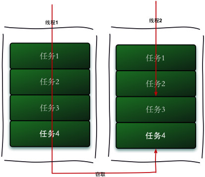
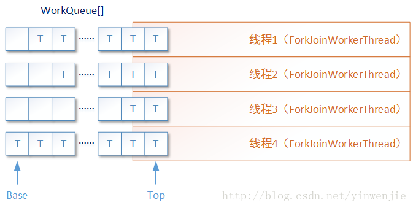

# Fork/Join框架

## 什么是Fork/Join框架

Fork/Join框架是Java7提供了的一个用于并行执行任务的框架， 是一个把大任务分割成若干个小任务，最终汇总每个小任务结果后得到大任务结果的框架。也是当前执行速度最快的并发框架。


## 工作窃取算法

工作窃取（work-stealing）算法是指某个线程从其他队列里窃取任务来执行。工作窃取的运行流程图如下：



那么为什么需要使用工作窃取算法呢？假如我们需要做一个比较大的任务，我们可以把这个任务分割为若干互不依赖的子任务，为了减少线程间的竞争，于是把这些子任务分别放到不同的队列里，并为每个队列创建一个单独的线程来执行队列里的任务，线程和队列一一对应，比如A线程负责处理A队列里的任务。但是有的线程会先把自己队列里的任务干完，而其他线程对应的队列里还有任务等待处理。干完活的线程与其等着，不如去帮其他线程干活，于是它就去其他线程的队列里窃取一个任务来执行。而在这时它们会访问同一个队列，所以为了减少窃取任务线程和被窃取任务线程之间的竞争，通常会使用双端队列，被窃取任务线程永远从双端队列的头部拿任务执行，而窃取任务的线程永远从双端队列的尾部拿任务执行。

工作窃取算法的优点是充分利用线程进行并行计算，并减少了线程间的竞争，其缺点是在某些情况下还是存在竞争，比如双端队列里只有一个任务时。并且消耗了更多的系统资源，比如创建多个线程和多个双端队列。

我们可以通过一个实例的改进来逐步剖析fork/join框架的使用，然后再来对其任务的源码进行分析其实现方式。

我们先来建立一个实验，该实验是投掷两粒骰子一亿次，并获取出现每种结果（两骰子的点数相加的和，必然在2到12之间）与其出现概率的情况，我们先采用线程调度和等待线程池中的某项任务完成来处理。

```java
public class ManualDiceRollsOne {
    //投掷两次骰子的次数
    private static final int N = 100000000;
    //一次的占比
    private final double fraction;
    //每次投2次骰子的点数之和与概率的映射
    private final Map<Integer,Double> results;
    //计算机线程数
    private final int numbersOfThreads;
    //线程池
    private final ExecutorService executor;
    //每个线程的工作次数
    private final int workPerThread;


    public ManualDiceRollsOne() {
        fraction = 1.0 / N;
        results = new ConcurrentHashMap<>();
        numbersOfThreads = Runtime.getRuntime().availableProcessors() * 2;
        executor = Executors.newFixedThreadPool(numbersOfThreads);
        workPerThread = N / numbersOfThreads;
    }

    public void simulateDiceRoles() {
        //计算所有投掷2次骰子的结果概率
        List<Future<?>> futures = submitJobs();
        //等待结果，拿取结果
        awaitCompletion(futures);
        //打印结果
        printResults();
    }

    private void printResults() {
        //等同于results.entrySet().forEach(entry -> System.out.println(entry));
        results.entrySet().forEach(System.out::println);
    }

    private List<Future<?>> submitJobs() {
        List<Future<?>> futures = new ArrayList<>();
        for (int i = 0;i < numbersOfThreads;i++) {
            //我把我的所有计算任务全部交给Future集合，彼此间不影响
            futures.add(executor.submit(makeJob()));
        }

        return futures;
    }

    private Runnable makeJob() {
        return () -> {
            //ThreadLocalRandom对应于不同线程都有一个线程的随机种子值
            //在多线程下当使用ThreadLocalRandom来生成随机数
            ThreadLocalRandom random = ThreadLocalRandom.current();
            for (int i = 0;i < workPerThread;i++) {
                int entry = twoDiceThrows(random);
                //获取每次投掷2个骰子的点数之和，增加每次的概率(亿分之一)，存入
                //线程安全集合ConcurrentHashMap中
                accumuLateResult(entry);
            }
        };
    }

    private void accumuLateResult(int entry) {
        //Map的compute方法第二参数为BiFunction的函数式接口，给定两种不同的参数对象，返回另一个结果对象，这三种对象
        //可以相同，可以不同
        //如果results的entry键的值为null(该键不存在)，则把该值设为fraction(单次概率亿分之一)
        //否则将该键的值设为原值加上fraction(单次概率亿分之一)
        results.compute(entry,(key,previous) -> previous == null ? fraction : previous + fraction);
    }

    private int twoDiceThrows(ThreadLocalRandom random) {
        int firstThrow = random.nextInt(1,7);
        int secondThrow = random.nextInt(1,7);
        return firstThrow + secondThrow;
    }

    private void awaitCompletion(List<Future<?>> futures) {
        //等待所有的计算任务完成后，拿取计算结果，关闭线程池
        futures.forEach(future -> {
            try {
                future.get();
            }catch (Exception e) {
                e.printStackTrace();
            }
        });
        executor.shutdown();
    }

    public static void main(String[] args) {
        ManualDiceRollsOne rolls = new ManualDiceRollsOne();
        long start = System.currentTimeMillis();
        rolls.simulateDiceRoles();
        System.out.println(System.currentTimeMillis() - start);
    }
}
```

运行结果

2=0.027757480001947783

3=0.05559653000661176

4=0.08333084999680387

5=0.11108438998219564

6=0.13888012996756519

7=0.16669714995292353

8=0.13887485996756796

9=0.11109162998219183

10=0.0833178699968107

11=0.05558395000660965

12=0.02778516000195242

5638

这是一个传统多线程的调度计算，由于有ConcurrentHashMap的存在，在多线程中运行速度较慢，运行完时间为5秒6，此时甚至比不过单线程的速度。

```java
public class ManualDiceRollsThree {
    //投掷两次骰子的次数
    private static final int N = 100000000;
    //一次的占比
    private double fraction = 1.0 / N;
    //每次投2次骰子的点数之和与概率的映射
    private Map<Integer,Double> results = new HashMap<>();

    private void printResults() {
        //等同于results.entrySet().forEach(entry -> System.out.println(entry));
        results.entrySet().forEach(System.out::println);
    }

    public void simulateDiceRoles() throws InterruptedException {
        for (int i = 0;i < N;i++) {
            int entry = twoDiceThrows();
            results.compute(entry,(k,v) -> v == null ? fraction : v + fraction);
        }
        printResults();
    }

    private int twoDiceThrows() {
        ThreadLocalRandom random = ThreadLocalRandom.current();
        int firstThrow = random.nextInt(1,7);
        int secondThrow = random.nextInt(1,7);
        return firstThrow + secondThrow;
    }

    public static void main(String[] args) throws InterruptedException {
        ManualDiceRollsThree manualDiceRollsThree = new ManualDiceRollsThree();
        long start = System.currentTimeMillis();
        manualDiceRollsThree.simulateDiceRoles();
        System.out.println(System.currentTimeMillis() - start);
    }
}
```

运行结果

2=0.027763110001948726
3=0.05556761000660691
4=0.08331852999681036
5=0.11113696998216796
6=0.13886518996757305
7=0.16663615995295564
8=0.13883302996758998
9=0.11116849998215136
10=0.08339849999676827
11=0.055518730006598724
12=0.027793670001953846
1600

此时我们对多线程的例子进行一次fork/join框架的改造

```java
public class ManualDiceRollsFour {
    //投掷两次骰子的次数
    private static final int N = 100000000;
    //一次的占比
    private double fraction = 1.0 / N;
    //每次投2次骰子的点数之和与概率的映射
    private Map<Integer,Double> results = new ConcurrentHashMap<>();
    private final ForkJoinPool forkJoinPool = new ForkJoinPool(Runtime.getRuntime().availableProcessors() * 2);

    private AtomicInteger count = new AtomicInteger(0);

    private void printResults() {
        //等同于results.entrySet().forEach(entry -> System.out.println(entry));
        results.entrySet().forEach(System.out::println);
    }

    public void simulateDiceRoles() throws InterruptedException {
        ForkJoinTask<Void> task = forkJoinPool.submit(makeJob());
        task.join();
        //打印结果
        printResults();
//        System.out.println(count.get());
    }

    private CountTask makeJob() {
        CountTask countTask = new CountTask(0,N);
        return countTask;
    }

    private void accumuLateResult(int entry) {
        //Map的compute方法第二参数为BiFunction的函数式接口，给定两种不同的参数对象，返回另一个结果对象，这三种对象
        //可以相同，可以不同
        //如果results的entry键的值为null(该键不存在)，则把该值设为fraction(单次概率亿分之一)
        //否则将该键的值设为原值加上fraction(单次概率亿分之一)
        results.compute(entry,(key,previous) -> previous == null ? fraction : previous + fraction);
    }

    private int twoDiceThrows() {
        ThreadLocalRandom random = ThreadLocalRandom.current();
        int firstThrow = random.nextInt(1,7);
        int secondThrow = random.nextInt(1,7);
        return firstThrow + secondThrow;
    }

    private class CountTask extends RecursiveAction {
        private static final int THRESHOLD = 2000000;
        private int start;
        private int end;

        public CountTask(int start,int end) {
            this.start = start;
            this.end = end;
        }
        @Override
        protected void compute() {
            boolean canCompute = (end - start) <= THRESHOLD;
            //最终计算,所有的最终拆分都是在这里计算
            if (canCompute) {
                for (int i = start;i < end;i++) {
                    int entry = twoDiceThrows();
                    accumuLateResult(entry);
//                    count.incrementAndGet();
                }
            }else {
                //并行计算的规模,拆分成50个并行计算
                int step = (start + end) / 50;
                //创建子任务线程集合
                List<CountTask> subTasks = new ArrayList<>();
                //每个并行子任务的开始值
                int pos = start;
                //并行执行50个分叉线程
                for (int i = 0; i < 50; i++) {
                    //每个并行子任务的结束值
                    int lastOne = pos + step;
                    if (lastOne > end) {
                        lastOne = end;
                    }
                    //建立一个子任务的线程
                    CountTask subTask = new CountTask(pos, lastOne);
                    //创建下一个并行子任务的开始值
                    pos += step + 1;
                    //将当前子任务线程添加到线程集合
                    subTasks.add(subTask);
                    //执行该线程,其实是一个递归,判断lastOne-pos是否小于THRESHOLD,小于则真正执行,否则继续分叉50个子线程
                    subTask.fork();
                }
                for (CountTask task : subTasks) {
                    task.join();
                }
            }
        }
    }
  	//我的理解：
    //代码运行的过程是会有唯一的一个专门生产子线程的父线程，生产出来的子线程去执行真正的任务
    //所以父线程生成子线程与生成出来的子线程内部进行真正的计算是同步完成的

    public static void main(String[] args) throws InterruptedException {
        ManualDiceRollsFour manualDiceRollsFour = new ManualDiceRollsFour();
        long start = System.currentTimeMillis();
        manualDiceRollsFour.simulateDiceRoles();
        System.out.println(System.currentTimeMillis() - start);
    }
}
```

运行结果

2=0.027765680001949157
3=0.055569410006607214
4=0.08334217999679791
5=0.11114915998216154
6=0.13889079996755957
7=0.16668756995292858
8=0.13887695996756685
9=0.11111537998217932
10=0.08329060999682505
11=0.055536280006601664
12=0.0277754800019508
6185

现在我们将ConcurrentHashMap替换成ConcurrentSkipListMap，因为ConcurrentSkipListMap在高并发写中效率要比ConcurrentHashMap高。

```java
public class ManualDiceRollsFour {
    //投掷两次骰子的次数
    private static final int N = 100000000;
    //一次的占比
    private double fraction = 1.0 / N;
    //每次投2次骰子的点数之和与概率的映射
    private Map<Integer,Double> results = new ConcurrentSkipListMap<>();
    private final ForkJoinPool forkJoinPool = new ForkJoinPool(Runtime.getRuntime().availableProcessors() * 2);

    private AtomicInteger count = new AtomicInteger(0);

    private void printResults() {
        //等同于results.entrySet().forEach(entry -> System.out.println(entry));
        results.entrySet().forEach(System.out::println);
    }

    public void simulateDiceRoles() throws InterruptedException {
        ForkJoinTask<Void> task = forkJoinPool.submit(makeJob());
        task.join();
        //打印结果
        printResults();
//        System.out.println(count.get());
    }

    private CountTask makeJob() {
        CountTask countTask = new CountTask(0,N);
        return countTask;
    }

    private void accumuLateResult(int entry) {
        //Map的compute方法第二参数为BiFunction的函数式接口，给定两种不同的参数对象，返回另一个结果对象，这三种对象
        //可以相同，可以不同
        //如果results的entry键的值为null(该键不存在)，则把该值设为fraction(单次概率亿分之一)
        //否则将该键的值设为原值加上fraction(单次概率亿分之一)
        results.compute(entry,(key,previous) -> previous == null ? fraction : previous + fraction);
    }

    private int twoDiceThrows() {
        ThreadLocalRandom random = ThreadLocalRandom.current();
        int firstThrow = random.nextInt(1,7);
        int secondThrow = random.nextInt(1,7);
        return firstThrow + secondThrow;
    }

    private class CountTask extends RecursiveAction {
        private static final int THRESHOLD = 2000000;
        private int start;
        private int end;

        public CountTask(int start,int end) {
            this.start = start;
            this.end = end;
        }
        @Override
        protected void compute() {
            boolean canCompute = (end - start) <= THRESHOLD;
            //最终计算,所有的最终拆分都是在这里计算
            if (canCompute) {
                for (int i = start;i < end;i++) {
                    int entry = twoDiceThrows();
                    accumuLateResult(entry);
//                    count.incrementAndGet();
                }
            }else {
                //并行计算的规模,拆分成50个并行计算
                int step = (start + end) / 50;
                //创建子任务线程集合
                List<CountTask> subTasks = new ArrayList<>();
                //每个并行子任务的开始值
                int pos = start;
                //并行执行50个分叉线程
                for (int i = 0; i < 50; i++) {
                    //每个并行子任务的结束值
                    int lastOne = pos + step;
                    if (lastOne > end) {
                        lastOne = end;
                    }
                    //建立一个子任务的线程
                    CountTask subTask = new CountTask(pos, lastOne);
                    //创建下一个并行子任务的开始值
                    pos += step + 1;
                    //将当前子任务线程添加到线程集合
                    subTasks.add(subTask);
                    //执行该线程,其实是一个递归,判断lastOne-pos是否小于THRESHOLD,小于则真正执行,否则继续分叉50个子线程
                    subTask.fork();
                }
                for (CountTask task : subTasks) {
                    task.join();
                }
            }
        }
    }

    public static void main(String[] args) throws InterruptedException {
        ManualDiceRollsFour manualDiceRollsFour = new ManualDiceRollsFour();
        long start = System.currentTimeMillis();
        manualDiceRollsFour.simulateDiceRoles();
        System.out.println(System.currentTimeMillis() - start);
    }
}
```

运行结果

2=0.027777370001951115
3=0.05558981000661063
4=0.08329047999682512
5=0.11111558998217921
6=0.13892566996754122
7=0.16662507995296147
8=0.1388884599675608
9=0.11109362998219077
10=0.0833484799967946
11=0.05555653000660506
12=0.027788410001952965
3880

运行时间为3秒8，快过ConcurrentHashMap大概两秒，但依然比单线程慢。

按照常理来说，多线程在如此大数据量的情况下理应快过单线程，造成这种情况的结果，只能说明是ConcurrentHashMap在亿级运算的并行下阻碍了运行的速度，现在我们要将ConcurrentHashMap去掉，完全在没有ConcurrentHashMap的情况下使用fork/join框架。

```java
public class ManualDiceRollsFive {
    //投掷两次骰子的次数
    private static final int N = 100000000;
    //一次的占比
    private double fraction = 1.0 / N;
    //每次投2次骰子的点数之和与概率的映射
    private Map<Integer,Double> results;
    private final ForkJoinPool forkJoinPool = new ForkJoinPool(Runtime.getRuntime().availableProcessors() * 2);

    private void printResults() {
        //等同于results.entrySet().forEach(entry -> System.out.println(entry));
        results.entrySet().forEach(System.out::println);
    }

    public void simulateDiceRoles() throws InterruptedException {
        ForkJoinTask<Map<Integer, Double>> result = forkJoinPool.submit(makeJob());
        try {
            this.results = result.get();
        } catch (ExecutionException e) {
            e.printStackTrace();
        }
        //打印结果
        printResults();
        forkJoinPool.shutdown();
//        System.out.println(count.get());
    }

    private CountTask makeJob() {
        CountTask countTask = new CountTask(0,N);
        return countTask;
    }

    private int twoDiceThrows(ThreadLocalRandom random) {
        int firstThrow = random.nextInt(1,7);
        int secondThrow = random.nextInt(1,7);
        return firstThrow + secondThrow;
    }

    private class CountTask extends RecursiveTask<Map<Integer,Double>> {
        private static final int THRESHOLD = 2000000;
        private int start;
        private int end;

        public CountTask(int start,int end) {
            this.start = start;
            this.end = end;
        }
        @Override
        protected Map<Integer,Double> compute() {
            Map<Integer,Double> result = new HashMap<>();
            IntStream.range(2,13).sequential().forEach(i -> result.put(i,0.0));
            ThreadLocalRandom random = ThreadLocalRandom.current();
            boolean canCompute = (end - start) <= THRESHOLD;
            //最终计算,所有的最终拆分都是在这里计算
            if (canCompute) {
                for (int i = start;i < end;i++) {
                    int entry = twoDiceThrows(random);
                    result.compute(entry,(k,v) -> v == 0.0 ? fraction : v + fraction);
//                    accumuLateResult(entry);
//                    count.incrementAndGet();
                }
            }else {
                //并行计算的规模,拆分成50个并行计算
                int step = (start + end) / 50;
                //创建子任务线程集合
                List<CountTask> subTasks = new ArrayList<>();
                //每个并行子任务的开始值
                int pos = start;
                //并行执行50个分叉线程
                for (int i = 0; i < 50; i++) {
                    //每个并行子任务的结束值
                    int lastOne = pos + step;
                    if (lastOne > end) {
                        lastOne = end;
                    }
                    //建立一个子任务的线程
                    CountTask subTask = new CountTask(pos, lastOne);
                    //创建下一个并行子任务的开始值
                    pos += step + 1;
                    //将当前子任务线程添加到线程集合
                    subTasks.add(subTask);
                    //执行该线程,其实是一个递归,判断lastOne-pos是否小于THRESHOLD,小于则真正执行,否则继续分叉50个子线程
                    subTask.fork();
                }
                for (CountTask task : subTasks) {
                    Map<Integer,Double> taskMap = task.join();
                    result.entrySet().stream().forEach(entry -> result.compute(entry.getKey(),
                            (k,v) -> v == 0.0 ? taskMap.get(k) : v + taskMap.get(k)));
                }
            }
            return result;
        }
    }

    public static void main(String[] args) throws InterruptedException {
        ManualDiceRollsFive manualDiceRollsFive = new ManualDiceRollsFive();
        long start = System.currentTimeMillis();
        manualDiceRollsFive.simulateDiceRoles();
        System.out.println(System.currentTimeMillis() - start);
    }
}
```

运行结果

2=0.02779156000000586
3=0.055543890000069124
4=0.0833797699999038
5=0.11111334999973911
6=0.13887251999957423
7=0.16666815999940918
8=0.13892032999957402
9=0.11105938999973942
10=0.08332794999990413
11=0.05555078000006909
12=0.02777181000000576
546

这个才是多线程应有的速度，完全不存在锁的限制。通过这样一个例子的改造，我们可以看到CountTask任务类继承过两种父类RecursiveTask和RecursiveAction，而这两种类其实又都继承于同一个父类ForkJoinTask。

a.RecursiveAction：用于没有返回结果的任务

b.RecursiveTask:用于有返回结果的任务

而所有这些任务对象需要提交到ForkJoinPool线程池来执行

```java
private final ForkJoinPool forkJoinPool = new ForkJoinPool(Runtime.getRuntime().availableProcessors() * 2);
```

跟进源码我们可以看到

```java
public ForkJoinPool(int parallelism,
                    ForkJoinWorkerThreadFactory factory,
                    UncaughtExceptionHandler handler,
                    boolean asyncMode) {
    this(checkParallelism(parallelism),
         checkFactory(factory),
         handler,
         asyncMode ? FIFO_QUEUE : LIFO_QUEUE,
         "ForkJoinPool-" + nextPoolId() + "-worker-");
    checkPermission();
}
```

```java
private ForkJoinPool(int parallelism,
                     ForkJoinWorkerThreadFactory factory,
                     UncaughtExceptionHandler handler,
                     int mode,
                     String workerNamePrefix) {
    this.workerNamePrefix = workerNamePrefix; //工作线程名前缀
    this.factory = factory;  //工作线程创建工厂
    this.ueh = handler; //异常处理handler
    this.config = (parallelism & SMASK) | mode; //并行度,当前机器的cpu核数 mode 任务队列出队模式 异步：先进先出，同步：后进先出
    long np = (long)(-parallelism); // offset ctl counts
    this.ctl = ((np << AC_SHIFT) & AC_MASK) | ((np << TC_SHIFT) & TC_MASK);
}
```

**看完初始化的代码我们可以知道原来创建ForkJoinPool创建workerThread的工作都是统一由一个叫ForkJoinWorkerThreadFactory的工厂去创建，创建出来的线程都有一个统一的前辍名称"ForkJoinPool-" + nextPoolId() + "-worker-".**队列出队模式是LIFO(后进先出)，那这样后面的入队的任务是会被先处理的。所以上面代码到50个分岔，越后面的任务会越先处理，这其实是对代码的一种优化！

Fork/Join框架中提供的fork方法和join方法，可以说是该框架中提供的最重要的两个方法，它们和parallelism“可并行任务数量”配合工作，可以导致拆分的子任务T1.1、T1.2甚至TX在Fork/Join框架中不同的运行效果。例如TX子任务或等待其它已存在的线程运行关联的子任务，或在运行TX的线程中“递归”执行其它任务，又或者启动一个新的线程运行子任务……

fork方法用于将新创建的子任务放入当前线程的work queue队列中，Fork/Join框架将根据当前正在并发执行ForkJoinTask任务的ForkJoinWorkerThread线程状态，决定是让这个任务在队列中等待，还是创建一个新的ForkJoinWorkerThread线程运行它，又或者是唤起其它正在等待任务的ForkJoinWorkerThread线程运行它。

这里面有几个元素概念需要注意，ForkJoinTask任务是一种能在Fork/Join框架中运行的特定任务，也只有这种类型的任务可以在Fork/Join框架中被拆分运行和合并运行。ForkJoinWorkerThread线程是一种在Fork/Join框架中运行的特性线程，它除了具有普通线程的特性外，最主要的特点是每一个ForkJoinWorkerThread线程都具有一个独立的任务等待队列（work queue），这个任务队列用于存储在本线程中被拆分的若干子任务。



提交我们用的是submit()方法，我们来看一下该方法的源代码

```java
public <T> ForkJoinTask<T> submit(ForkJoinTask<T> task) {
    if (task == null)
        throw new NullPointerException();
    externalPush(task);
    return task;
}
```

```java
final void externalPush(ForkJoinTask<?> task) {
    WorkQueue[] ws; WorkQueue q; int m;
    int r = ThreadLocalRandom.getProbe();
    int rs = runState;
    if ((ws = workQueues) != null && (m = (ws.length - 1)) >= 0 &&
        (q = ws[m & r & SQMASK]) != null && r != 0 && rs > 0 &&
        U.compareAndSwapInt(q, QLOCK, 0, 1)) {
        ForkJoinTask<?>[] a; int am, n, s;
        if ((a = q.array) != null &&
            (am = a.length - 1) > (n = (s = q.top) - q.base)) {
            int j = ((am & s) << ASHIFT) + ABASE;
            U.putOrderedObject(a, j, task);
            U.putOrderedInt(q, QTOP, s + 1);
            U.putIntVolatile(q, QLOCK, 0);
            if (n <= 1)
                signalWork(ws, q);
            return;
        }
        U.compareAndSwapInt(q, QLOCK, 1, 0);
    }
    externalSubmit(task);
}
```

```java
private void externalSubmit(ForkJoinTask<?> task) {
    int r;                                    // initialize caller's probe
    if ((r = ThreadLocalRandom.getProbe()) == 0) {
        ThreadLocalRandom.localInit();
        r = ThreadLocalRandom.getProbe();
    }
    for (;;) {     //采用循环入队的方式
        WorkQueue[] ws; WorkQueue q; int rs, m, k;
        boolean move = false;
        if ((rs = runState) < 0) {
            tryTerminate(false, false);     // help terminate
            throw new RejectedExecutionException();
        }
        else if ((rs & STARTED) == 0 ||     // initialize
                 ((ws = workQueues) == null || (m = ws.length - 1) < 0)) {
            int ns = 0;
            rs = lockRunState();
            try {
                if ((rs & STARTED) == 0) {    // initialize 初始化操作
                    U.compareAndSwapObject(this, STEALCOUNTER, null,
                                           new AtomicLong());
                    // create workQueues array with size a power of two
                    int p = config & SMASK; // ensure at least 2 slots //config就是cpu的核数
                    int n = (p > 1) ? p - 1 : 1;
                    n |= n >>> 1; n |= n >>> 2;  n |= n >>> 4;
                    n |= n >>> 8; n |= n >>> 16; n = (n + 1) << 1; //算出workQueues的大小n,n一定是2的次方数
                    workQueues = new WorkQueue[n];  //初始化队列，然后跳到最外面的循环继续把任务入队
                    ns = STARTED;
                }
            } finally {
                unlockRunState(rs, (rs & ~RSLOCK) | ns);
            }
        }
        else if ((q = ws[k = r & m & SQMASK]) != null) {  //选中了一个一个非空队列
            if (q.qlock == 0 && U.compareAndSwapInt(q, QLOCK, 0, 1)) {  //利用cas操作加锁成功！
                ForkJoinTask<?>[] a = q.array;
                int s = q.top;
                boolean submitted = false; // initial submission or resizing
                try {                      // locked version of push
                    if ((a != null && a.length > s + 1 - q.base) ||
                        (a = q.growArray()) != null) {
                        int j = (((a.length - 1) & s) << ASHIFT) + ABASE;  //计算出任务在队列中的位置
                        U.putOrderedObject(a, j, task);   //把任务放在队列中
                        U.putOrderedInt(q, QTOP, s + 1);  //更新一次存放的位置
                        submitted = true;
                    }
                } finally {
                    U.compareAndSwapInt(q, QLOCK, 1, 0);  //利用cas操作释放锁！
                }
                if (submitted) {
                    signalWork(ws, q);
                    return;   //任务入队成功了！跳出循环！
                }
            }
            move = true;                   // move on failure
        }
        else if (((rs = runState) & RSLOCK) == 0) { // create new queue  选中的队列是空，初始化完队列，然后继续入队！
            q = new WorkQueue(this, null);
            q.hint = r;
            q.config = k | SHARED_QUEUE;
            q.scanState = INACTIVE;
            rs = lockRunState();           // publish index
            if (rs > 0 &&  (ws = workQueues) != null &&
                k < ws.length && ws[k] == null)
                ws[k] = q;                 // else terminated
            unlockRunState(rs, rs & ~RSLOCK);
        }
        else
            move = true;                   // move if busy
        if (move)
            r = ThreadLocalRandom.advanceProbe(r);
    }
}
```

我们大致说一下上面这些代码的含义：

**通过对externalSubmit方法的代码进行分析，我们知道了第一次提交任务给\**forkJoinPool\**时是在无限循环**for (;;)**中入队。第一步先检查workQueues是不是还没有创建，如果没有，则进行创建。之后跳到外层for循环并随机选取\**workQueues里面一个队列，并判断队列是否已创建。没有创建，则进行创建！后又跳到外层for循环直到选到一个非空队列并且加锁成功！这样最后才把任务入队~。\****

   ***\*所以我们知道fork/join的任务队列workQueues并不是初始化的时候就创建好了，而是在有任务提交的时候才创建！并且每次入队时都需要利用cas操作来进行加锁和释放锁！\****

然后我们来看一下任务的分岔fork()方法，此处又被称为二次提交

```java
public final ForkJoinTask<V> fork() {
    Thread t;
    if ((t = Thread.currentThread()) instanceof ForkJoinWorkerThread)
        ((ForkJoinWorkerThread)t).workQueue.push(this);  //workerThread直接入自己的workQueue
    else
        ForkJoinPool.common.externalPush(this);
    return this;
}
```

```java
final void externalPush(ForkJoinTask<?> task) {
    WorkQueue[] ws; WorkQueue q; int m;
    int r = ThreadLocalRandom.getProbe();
    int rs = runState;
    if ((ws = workQueues) != null && (m = (ws.length - 1)) >= 0 &&
        (q = ws[m & r & SQMASK]) != null && r != 0 && rs > 0 &&
        U.compareAndSwapInt(q, QLOCK, 0, 1)) {  //随机选取了一个非空队列，并且加锁成功！下面是普通的入队过程~
        ForkJoinTask<?>[] a; int am, n, s;
        if ((a = q.array) != null &&
            (am = a.length - 1) > (n = (s = q.top) - q.base)) {
            int j = ((am & s) << ASHIFT) + ABASE;
            U.putOrderedObject(a, j, task);
            U.putOrderedInt(q, QTOP, s + 1);
            U.putIntVolatile(q, QLOCK, 0);
            if (n <= 1)
                signalWork(ws, q);
            return;  //结束方法
        }
        U.compareAndSwapInt(q, QLOCK, 1, 0);  //一定要释放锁！
    }
    externalSubmit(task);  //这个就是上面的externalSubmit方法，逻辑是一样的~
}
```

**从代码中我们知道了提交一个fork任务的过程和第一次提交到forkJoinPool的过程是大同小异的。主要区分了提交任务的线程是不是workerThread，如果是，任务直接入workerThread当前的workQueue，不是则尝试选中一个workQueue q。如果q非空并且加锁成功则进行入队，否则执行与\**第一次任务提交到forkJoinPool差不多的逻辑~。\****

我们再来看一下join()方法

```java
public final V join() {
    int s;
    if ((s = doJoin() & DONE_MASK) != NORMAL)
        reportException(s);
    return getRawResult();
}
```

执行处理前先判断staus是不是已完成，如果完成了就直接返回
因为这个任务可能被其它线程窃取过去处理完了

```java
private int doJoin() {
    int s; Thread t; ForkJoinWorkerThread wt; ForkJoinPool.WorkQueue w;
    return (s = status) < 0 ? s :
        ((t = Thread.currentThread()) instanceof ForkJoinWorkerThread) ?
        (w = (wt = (ForkJoinWorkerThread)t).workQueue).
        tryUnpush(this) && (s = doExec()) < 0 ? s :
        wt.pool.awaitJoin(w, this, 0L) :
        externalAwaitDone();
}
```

**代码的调用链是从上到下。整体处理逻辑如下：**

   **线程是workerThread：**

   **先判断任务是否已经处理完成，任务完成直接返回，没有则直接尝试出队tryUnpush(this) 然后执行任务处理doExec()。如果没有出队成功或者处理成功，则执行wt.pool.awaitJoin(w, this, 0L)。wt.pool.awaitJoin(w, this, 0L)的处理逻辑简单来说也是在一个for(;;）中不断的轮询任务的状态是不是已完成，完成就直接退出方法。否就继续尝试出队处理。直到任务完成或者超时为止。**

  **线程不是workerThread:**

  **直接进行入externalAwaitDone()**

```java
private int externalAwaitDone() {
    int s = ((this instanceof CountedCompleter) ? // try helping
             ForkJoinPool.common.externalHelpComplete(
                 (CountedCompleter<?>)this, 0) :
             ForkJoinPool.common.tryExternalUnpush(this) ? doExec() : 0);
    if (s >= 0 && (s = status) >= 0) {
        boolean interrupted = false;
        do {
            if (U.compareAndSwapInt(this, STATUS, s, s | SIGNAL)) {
                synchronized (this) {
                    if (status >= 0) {
                        try {
                            wait(0L);
                        } catch (InterruptedException ie) {
                            interrupted = true;
                        }
                    }
                    else
                        notifyAll();
                }
            }
        } while ((s = status) >= 0);
        if (interrupted)
            Thread.currentThread().interrupt();
    }
    return s;
}
```

**externalAwaitDone的处理逻辑其实也比较简单，当前线程自己先尝试把任务出队ForkJoinPool.common.tryExternalUnpush(this) ? doExec()然后处理掉，如果不成功就交给workerThread去处理，然后利用object/wait的经典方法去监听任务status的状态变更。**

最后说一下工作窃取，需要看一下ForkJoinWorkerThread

```java
public void run() {
    if (workQueue.array == null) { // only run once
        Throwable exception = null;
        try {
            onStart();
            pool.runWorker(workQueue);  //在这里处理任务队列！
        } catch (Throwable ex) {
            exception = ex;
        } finally {
            try {
                onTermination(exception);
            } catch (Throwable ex) {
                if (exception == null)
                    exception = ex;
            } finally {
                pool.deregisterWorker(this, exception);
            }
        }
    }
}

```

```java
final void runWorker(WorkQueue w) {
    w.growArray();                   // allocate queue  进行队列的初始化
    int seed = w.hint;               // initially holds randomization hint
    int r = (seed == 0) ? 1 : seed;  // avoid 0 for xorShift
    for (ForkJoinTask<?> t;;) {  //又是无限循环处理任务！
        if ((t = scan(w, r)) != null) //在这里获取任务！
            w.runTask(t);
        else if (!awaitWork(w, r))
            break;
        r ^= r << 13; r ^= r >>> 17; r ^= r << 5; // xorshift
    }
}
```


```java
private ForkJoinTask<?> scan(WorkQueue w, int r) {
    WorkQueue[] ws; int m;
    if ((ws = workQueues) != null && (m = ws.length - 1) > 0 && w != null) {
        int ss = w.scanState;                     // initially non-negative
        for (int origin = r & m, k = origin, oldSum = 0, checkSum = 0;;) {
            WorkQueue q; ForkJoinTask<?>[] a; ForkJoinTask<?> t;
            int b, n; long c;
            if ((q = ws[k]) != null) {   //随机选中了非空队列 q
                if ((n = (b = q.base) - q.top) < 0 &&
                    (a = q.array) != null) {      // non-empty
                    long i = (((a.length - 1) & b) << ASHIFT) + ABASE;  //从尾部出队,b是尾部下标
                    if ((t = ((ForkJoinTask<?>)
                              U.getObjectVolatile(a, i))) != null &&
                        q.base == b) {
                        if (ss >= 0) {
                            if (U.compareAndSwapObject(a, i, t, null)) {  //利用cas出队
                                q.base = b + 1;
                                if (n < -1)       // signal others
                                    signalWork(ws, q);
                                return t;   //出队成功，成功窃取一个任务！
                            }
                        }
                        else if (oldSum == 0 &&   // try to activate  队列没有激活，尝试激活
                                 w.scanState < 0)
                            tryRelease(c = ctl, ws[m & (int)c], AC_UNIT);
                    }
                    if (ss < 0)                   // refresh
                        ss = w.scanState;
                    r ^= r << 1; r ^= r >>> 3; r ^= r << 10;
                    origin = k = r & m;           // move and rescan
                    oldSum = checkSum = 0;
                    continue;
                }
                checkSum += b;
            }
            if ((k = (k + 1) & m) == origin) {    // continue until stable k = k + 1表示取下一个队列 如果（k + 1） & m == origin表示 已经遍历完所
                                                                           //有队列了
                if ((ss >= 0 || (ss == (ss = w.scanState))) &&
                    oldSum == (oldSum = checkSum)) {
                    if (ss < 0 || w.qlock < 0)    // already inactive
                        break;
                    int ns = ss | INACTIVE;       // try to inactivate
                    long nc = ((SP_MASK & ns) |
                               (UC_MASK & ((c = ctl) - AC_UNIT)));
                    w.stackPred = (int)c;         // hold prev stack top
                    U.putInt(w, QSCANSTATE, ns);
                    if (U.compareAndSwapLong(this, CTL, c, nc))
                        ss = ns;
                    else
                        w.scanState = ss;         // back out
                }
                checkSum = 0;
            }
        }
    }
    return null;
}
```

**所以我们知道任务的窃取从workerThread运行的那一刻就已经开始了！先随机选中一条队列看能不能窃取到任务，取不到则窃取下一条队列，直接遍历完一遍所有的队列，如果都窃取不到就返回null。**
