# JUC并发核心原理

这个图看看就好了，不用太纠结


## Java JUC简介

在 Java 5.0 提供了 java.util.concurrent （简称JUC ）包，在此包中增加了在并发编程中很常用的实用工具类，用于定义类似于线程的自定义子系统，包括线程池、异步 IO 和轻量级任务框架。提供可调的、灵活的线程池。还提供了设计用于多线程上下文中的 Collection 实现等。

## 内存可见性 、volatile关键字

### 内存可见性

内存可见性（Memory Visibility）是指当某个线程正在使用对象状态而另一个线程在同时修改该状态，需要确保当一个线程修改了对象状态后，其他线程能够看到发生的状态变化。
可见性错误是指当读操作与写操作在不同的线程中执行时，我们无法确保执行读操作的线程能适时地看到其他线程写入的值，有时甚至是根本不可能的事情。
我们可以通过同步来保证对象被安全地发布。除此之外我们也可以使用一种更加轻量级的 volatile变量。

### volatile 关键字

Java 提供了一种稍弱的同步机制，即 volatile 变量，用来确保将变量的更新操作通知到其他线程。可以将 volatile 看做一个轻量级的锁，但是又与锁有些不同：

对于多线程，不是一种互斥关系
不能保证变量状态的“原子性操作”
- 原子性操作解释
例如 i++; 这个操作，它不是一个原子性操作，在实际执行时需要三步操作“读-改-写”：

```java
int temp = i;
temp = temp + 1;
i = temp; 
```

**示例代码**

```java
public class TestVolatile {
	
	public static void main(String[] args) {
		ThreadDemo td = new ThreadDemo();
		new Thread(td).start();
		
		while(true){
			if(td.isFlag()){
				System.out.println("------------------");
				break;
			}
		}
    }
}

class ThreadDemo implements Runnable {

	private volatile boolean flag = false;

	@Override
	public void run() {
		
		try {
			Thread.sleep(200);
		} catch (InterruptedException e) {
            
		}
		flag = true;
		System.out.println("flag=" + isFlag());
	}

	public boolean isFlag() {
		return flag;
	}
}
```

## CAS算法、原子变量

### CAS算法

- CAS (Compare-And-Swap) 是一种硬件对并发的支持，针对多处理器操作而设计的处理器中的一种特殊指令，用于管理对共享数据的并发访问。
- CAS 是一种无锁的非阻塞算法的实现。
- CAS 包含了 3 个操作数：需要读写的内存值 V、进行比较的值 A、拟写入的新值 B
- 当且仅当 V 的值等于 A 时，CAS 通过原子方式用新值 B 来更新 V 的值，否则不会执行任何操作。

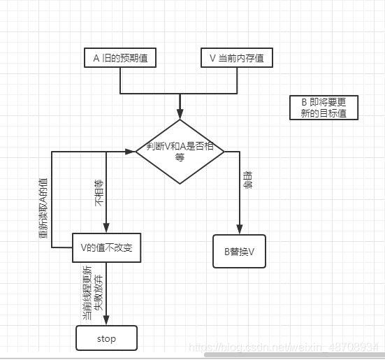

#### CAS的缺点

（1）循环时间长，开销大。比如：当某一方法执行失败时，不会立即结束，而是会继续尝试，但一直尝试失败的话，就会给CPU带来极大的开销。
（2）只能保证一个共享变量的原子操作。
（3）存在ABA问题。

#### ABA问题

CAS中的一个漏洞。CAS 算法实现一个重要前提需要取出内存中某时刻的数据，而在下时刻比较并替换，那么在这个时间差类会导致数据的变化。

比如说一个线程 1从内存中取出 A，同时另一个线程 2 也从内存中取出 A，并且线程2 进行了一些操作将A变成了 B，然后 线程2又将 V 位置的数据变成 A，这时候线程 1进行 CAS 操作发现内存中仍然是 A，然后 线程1操作成功。尽管线程 1的 CAS 操作成功，但是不代表这个过程就是没有问题的。
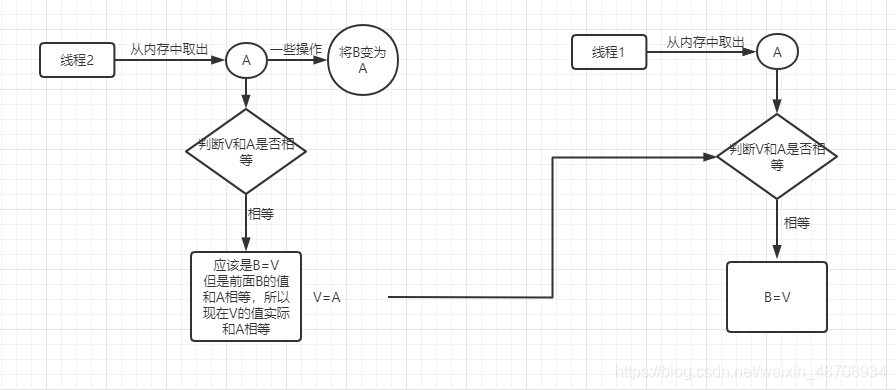

解决方法：部分乐观锁的实现是通过版本号(version)的方式来解决 ABA 问题，乐观锁每次在执行数据的修改操作时，都会带上一个版本号，一旦版本号和数据的版本号一致就可以执行修改操作并对版本号执行+1 操作，否则就执行失败。因为每次操作的版本号都会随之增加，所以不会出现 ABA 问题，因为版本号只会增加不会减少。

**人话：**

如果变量V初次读取的时候是A，并且在准备赋值的时候检查到它仍然是A，那能说明它的值没有被其他线程修改过了吗？
如果在这段期间曾经被改成B，然后又改回A，那CAS操作就会误认为它从来没有被修改过。针对这种情况，java并发包中提供了一个带有标记的原子引用类AtomicStampedReference，它可以通过控制变量值的版本来保证CAS的正确性。AtomicStampedReference通过包装[E,Integer]的元组来对对象标记版本戳stamp，从而避免ABA问题。

**模拟CAS算法**

```java
public class TestCompareAndSwap {

	public static void main(String[] args) {
		final CompareAndSwap cas = new CompareAndSwap();
		
		for (int i = 0; i < 10; i++) {
			new Thread(new Runnable() {
				@Override
				public void run() {
					int expectedValue = cas.get();
					boolean b = cas.compareAndSet(expectedValue, (int)(Math.random() * 101));
					System.out.println(b);
				}
			}).start();
		}
	}
}

class CompareAndSwap{
	private int value;
	
	//获取内存值
	public synchronized int get(){
		return value;
	}
	
	//比较
	public synchronized int compareAndSwap(int expectedValue, int newValue){
		int oldValue = value;
		
		if(oldValue == expectedValue){
			this.value = newValue;
		}
		
		return oldValue;
	}
	
	//设置
	public synchronized boolean compareAndSet(int expectedValue, int newValue){
		return expectedValue == compareAndSwap(expectedValue, newValue);
	}
}
```

### 原子变量

当一个线程在对原子变量操作时，如果其他线程也试图对同一原子变量执行操作，原子变量的实现类提供了一套机制来检查操作是否在一步内完成。一般来说，这个操作先获取变量值，然后在本地改变变量的值，然后试图用这个改变的值去替换之前的值。如果之前的值没有被其他线程改变，就可以执行这个替换操作，否则方法将在执行这个操作。这种操作称为cas原子操作。

原子变量不使用锁或其他同步机制来保护对其值的并发访问。所有操作都是基于cas原子操作的。他保证了多线程在同一时间操作一个原子变量而不会产生数据不一致的错误，并且他的性能优于使用同步机制保护的普通变量。

- 类的小工具包，支持在单个变量上解除锁的线程安全编程。事实上，此包中的类可将 volatile 值、字段和数组元素的概念扩展到那些也提供原子条件更新操作的。

- 类 AtomicBoolean、AtomicInteger、AtomicLong 和 AtomicReference 的实例各自提供对相应类型单个变量的访问和更新。每个类也为该类型提供适当的实用工具方法。

- AtomicIntegerArray、AtomicLongArray 和 AtomicReferenceArray 类进一步扩展了原子操作，对这些类型的数组提供了支持。这些类在为其数组元素提供 volatile 访问语义方面也引人注目，这对于普通数组来说是不受支持的。

- 核心方法：boolean compareAndSet(expectedValue, updateValue)

- java.util.concurrent.atomic 包下提供了一些原子操作的常用类

  AtomicBoolean 、AtomicInteger 、AtomicLong 、 AtomicReference

  AtomicIntegerArray 、AtomicLongArray

  AtomicMarkableReference

  AtomicReferenceArray

  AtomicStampedReference

**示例代码**

```java
import java.util.concurrent.atomic.AtomicInteger;

public class TestAtomicDemo {

	public static void main(String[] args) {
		AtomicDemo ad = new AtomicDemo();
		for (int i = 0; i < 10; i++) {
			new Thread(ad).start();
		}
	}
}

class AtomicDemo implements Runnable {
	
//	private volatile int serialNumber = 0;
	private AtomicInteger serialNumber = new AtomicInteger(0);

	@Override
	public void run() {
		try {
			Thread.sleep(200);
		} catch (InterruptedException e) {
            
		}
		System.out.println(getSerialNumber());
	}
	
	public int getSerialNumber() {
		return serialNumber.getAndIncrement(); // 原子执行自增1操作
	}
}

//人话：
public class SAtomic {
 
    public static void main(String[] args) {
 
        AtomicLong al = new AtomicLong(0);
        ThreadGroup rg = new ThreadGroup("tg");
        for (int i = 0; i < 10; i++) {
            new Thread(rg, new Runnable() {
                @Override
                public void run() {
                    for (int i = 0; i < 10000; i++) {
                        al.incrementAndGet();
                    }
                }
            }).start();
        }
        while (rg.activeCount() != 0 ) {
			//ThreadGroup类的activeCount()方法用于返回当前线程的线程组中活动线程的数量。 
            //返回的值只是一个估计值，因为当此方法遍历内部数据结构时，线程数可能会动态更改。
        }
        System.out.println(al.get());
        //输出结果：
		//100000
    }
}
```

## 并发容器

 java.util包中的大部分容器都是非线程安全的，若要在多线程中使用容器，你可以使用Collections提供的包装函数：synchronizedXXX，将普通容器变成线程安全的容器。但该方法仅仅是简单地给容器使用同步，效率很低。因此并发大师Doug Lea提供了java.util.concurrent包，提供高效的并发容器。并且为了保持与普通的容器的接口一致性，仍然使用util包的接口，从而易于使用、易于理解。

### List和Set

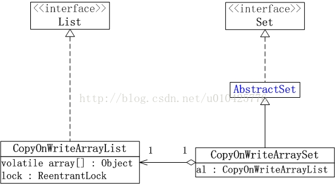

JUC包中List接口的实现类：CopyOnWriteArrayList

- CopyOnWriteArrayList是线程安全的ArrayList

JUC包中Set接口的实现类：CopyOnWriteArraySet、ConcurrentSkipListSet

- CopyOnWriteArraySet是线程安全的Set，它内部包含了一个CopyOnWriteArrayList，因此本质上是由CopyOnWriteArrayList实现的。
- ConcurrentSkipListSet相当于线程安全的TreeSet。它是有序的Set。它由ConcurrentSkipListMap实现。

#### CopyOnWrite容器（写时复制容器）

CopyOnWrite容器包括：CopyOnWriteArrayList和CopyOnWriteArraySet。

- PS：CopyOnWriteArraySet有CopyOnWriteArrayList实现。

**特性**

- 适用于读操作远远多于写操作，并且数据量较小的情况。
- 修改容器的代价是昂贵的，因此建议批量增加addAll、批量删除removeAll。

CopyOnWrite容器是如何实现线程安全的？

1. 使用volatile修饰数组引用：确保数组引用的内存可见性。
2. 对容器修改操作进行同步：从而确保同一时刻只能有一条线程修改容器（因为修改容器都会产生一个新的容器，增加同步可避免同一时刻复制生成多个容器，从而保证数组数据的一致性）
3. 修改时复制容器：确保所有修改操作都作用在新数组上，原本的数组在创建过后就用不变化，从而其他线程可以放心地读。

**新增方法**

CopyOnWriteArrayList：

```java
// 添加集合中不存在的元素
int addAllAbsent(Collection<? extends E> c)
// 该元素若不存在则添加
boolean addIfAbsent(E e)
```

CopyOnWriteArraySet：木有新增！

迭代

> CopyOnWriteArrayList拥有内部类：COWIterator，它是ListIterator的子类。
> 当调用iterator函数时返回的是COWIterator对象。
> COWIterator不允许修改容器，你若调用则会抛出UnsupportedOperationException。

优点

> 读操作无需加锁，从而高效。

缺点

> 数据一致性问题
> 由于迭代的是容器当前的快照，因此在迭代过程中容器发生的修改并不能实时被当前正在迭代的线程感知。
> 内存占用问题
> 由于修改容器都会复制数组，从而当数组超大时修改容器效率很低。
> PS：因此写时复制容器适合存储小容量数据。

#### ConcurrentSkipListSet

- 它是一个有序的、线程安全的Set，相当于线程安全的TreeSet。
- 它内部拥有ConcurrentSkipListMap实例，本质上就是一个ConcurrentSkipListMap，只不过仅使用了Map中的key。

跳表具体内容详见下文**ConcurrentSkipListMap**章节

### Map

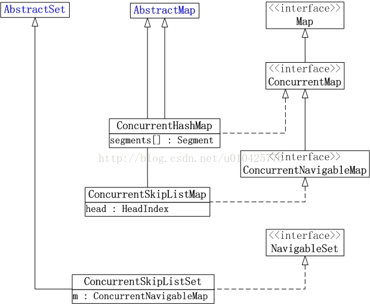

- ConcurrentHashMap：线程安全的HashMap。采用分段锁实现高效并发。
- ConcurrentSkipListMap：线程安全的有序Map。使用跳表实现高效并发。

#### ConcurrentHashMap（分段锁）

java.util包中提供了线程安全的HashTable，但这家伙只是通过简单的同步来实现线程安全，因此效率低。只要有一条线程获取了容器的锁之后，其他所有的线程访问同步函数都会被阻塞。因此同一时刻只能有一条线程访问同步函数。而ConcurrentHashMap采用了分段锁机制实现高效的并发访问。

ConcurrentHashMap 同步容器类是Java 5 增加的一个线程安全的哈希表。对与多线程的操作，介于 HashMap 与 Hashtable 之间。内部采用“锁分段”机制替代 Hashtable 的独占锁。进而提高性能。

此包还提供了设计用于多线程上下文中的 Collection 实现：ConcurrentHashMap、ConcurrentSkipListMap、ConcurrentSkipListSet、CopyOnWriteArrayList 和CopyOnWriteArraySet。当期望许多线程访问一个给定 collection 时，ConcurrentHashMap 通常优于同步的 HashMap，ConcurrentSkipListMap 通常优于同步的 TreeMap。当期望的读数和遍历远远大于列表的更新数时，CopyOnWriteArrayList 优于同步的 ArrayList。

**分段锁原理**
ConcurrentHashMap由多个Segment构成，每个Segment都包含一张哈希表。每次操作只将操作数据所属的Segment锁起来，从而避免将整个锁住。
**数据结构**

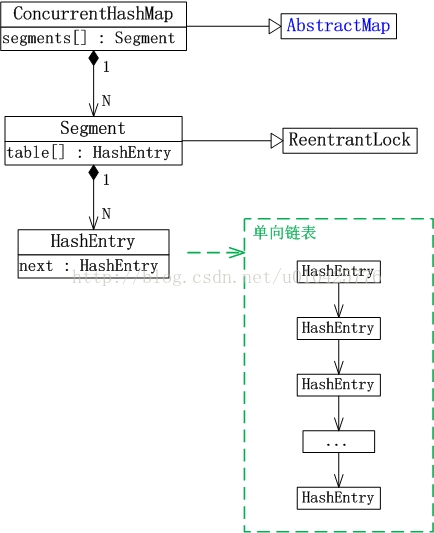

> ConcurrentHashMap内部包含了Segment数组，而每个Segment又继承自ReentrantLock，因此它是一把可重入的锁。
> Segment内部拥有一个HashEntry数组，它就是一张哈希表。HashEntry是单链表的一个节点，HashEntry数组存储单链表的表头节点。

**示例代码**

```java
import java.util.Iterator;
import java.util.concurrent.CopyOnWriteArrayList;

/*
 * CopyOnWriteArrayList/CopyOnWriteArraySet : “写入并复制”
 * 注意：添加操作多时，效率低，因为每次添加时都会进行复制，开销非常的大。并发迭代操作多时可以选择。
 */
public class TestCopyOnWriteArrayList {

	public static void main(String[] args) {
		HelloThread ht = new HelloThread();
		
		for (int i = 0; i < 10; i++) {
			new Thread(ht).start();
		}
	}
}

class HelloThread implements Runnable{
	
//	private static List<String> list = Collections.synchronizedList(new ArrayList<String>());
	
	private static CopyOnWriteArrayList<String> list = new CopyOnWriteArrayList<>();
	
	static{
		list.add("AA");
		list.add("BB");
		list.add("CC");
	}

	@Override
	public void run() {
		Iterator<String> it = list.iterator();
		
		while(it.hasNext()){
			System.out.println(it.next());
			
			list.add("AA");
		}
	}
}
```

#### ConcurrentSkipListMap

- 它是一个有序的Map，相当于TreeMap。
- TreeMap采用红黑树实现排序，而ConcurrentSkipListMap采用跳表实现有序。

**跳表的由来**
作用：存储有序序列，并且实现高效的查找与插入删除。
存储有序序列最简单的办法就是使用数组，从而查找可以采用二分搜索，但插入删除需要移动元素较为低效。
因此出现了二叉搜索树，用来解决插入删除移动元素的问题。但二叉搜索树在最坏情况下会退化成一条单链表，搜索的效率降为O(n)。
为了避免二叉搜索树的退化，出现了二叉平衡树，它在每次插入删除节点后都会重新调整树形，使得它仍然保持平衡，从而保证了搜索效率，也保证了插入删除的效率。
此外，根据平衡算法的不同，二叉平衡树又分为：B+树、B-树、红黑树。
但平衡算法过于复杂，因此出现跳表。

**跳表介绍**
跳表是条有序的单链表，它的每个节点都有多个指向后继节点的引用。
它有多个层次，上层都是下层的子集，从而能跳过不必要的节点，提升搜索速度。
它通过空间来换取时间。
如查找19的过程：

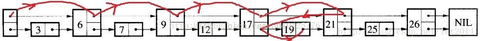

### Queue

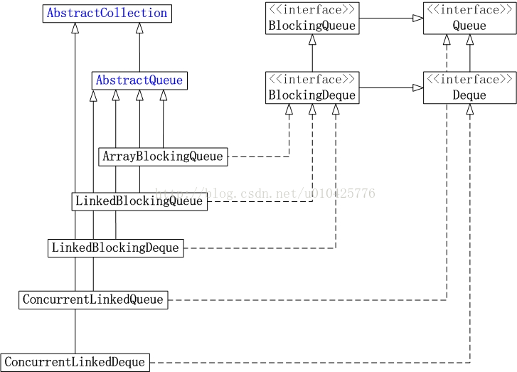

- ConcurrentLinkedQueue：线程安全的无界队列。底层采用单链表。支持FIFO。
- ConcurrentLinkedDeque：线程安全的无界双端队列。底层采用双向链表。支持FIFO和FILO。
- ArrayBlockingQueue：数组实现的阻塞队列。
- LinkedBlockingQueue：链表实现的阻塞队列。
- LinkedBlockingDeque：双向链表实现的双端阻塞队列。

#### ArrayBlockingQueue

**概要**

- ArrayBlockingQueue是一个 数组实现的 线程安全的 有限 阻塞队列。

**数据结构**

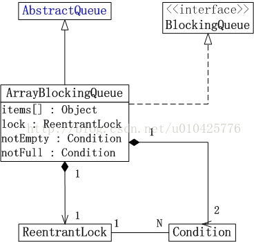

> - ArrayBlockingQueue继承自AbstractQueue，并实现了BlockingQueue接口。
> - ArrayBlockingQueue内部由Object数组存储元素，构造时必须要指定队列容量。
> - ArrayBlockingQueue由ReentrantLock实现队列的互斥访问，并由notEmpty、notFull这两个Condition分别实现队空、队满的阻塞。
> - ReentrantLock分为公平锁和非公平锁，可以在构造ArrayBlockingQueue时指定。默认为非公平锁。

**新增API**

```java
// 在队尾添加指定元素，若队已满则等待指定时间
boolean offer(E e, long timeout, TimeUnit unit)
// 获取并删除队首元素，若队为空则阻塞等待
E take()
// 添加指定元素，若队已满则一直等待
void put(E e)
// 获取队首元素，若队为空，则等待指定时间
E poll(long timeout, TimeUnit unit)
```

队满、队空阻塞唤醒的原理

- 队满阻塞：当添加元素时，若队满，则调用notFull.await()阻塞当前线程；当移除一个元素时调用notFull.signal()唤醒在notFull上等待的线程。
- 队空阻塞：当删除元素时，若队为空，则调用notEmpty.await()阻塞当前线程；当队首添加元素时，调用notEmpty.signal()唤醒在notEmpty上等待的线程。

#### LinkedBlockingQueue

**概要**

- LinkedBlockingQueue是一个 单链表实现的、线程安全的、无限 阻塞队列。

- LinkedBlockingQueue继承自AbstractQueue，实现了BlockingQueue接口。
- LinkedBlockingQueue由单链表实现，因此是个无限队列。但为了方式无限膨胀，构造时可以加上容量加以限制。
- LinkedBlockingQueue分别采用读取锁和插入锁控制读取/删除 和 插入过程的并发访问，并采用notEmpty和notFull两个Condition实现队满队空的阻塞与唤醒。

**队满队空阻塞唤醒的原理**

- 队满阻塞：若要插入元素，首先需要获取putLock；在此基础上，若此时队满，则调用notFull.await()，阻塞当前线程；当移除一个元素后调用notFull.signal()唤醒在notFull上等待的线程；最后，当插入操作完成后释放putLock。
- 队空阻塞：若要删除/获取元素，首先要获取takeLock；在此基础上，若队为空，则调用notEmpty.await()，阻塞当前线程；当插入一个元素后调用notEmpty.signal()唤醒在notEmpty上等待的线程；最后，当删除操作完成后释放takeLock。

PS：API和ArrayBlockingQueue一样。

#### LinkedBlockingDeque

**概要**

- 它是一个 由双向链表实现的、线程安全的、 双端 无限 阻塞队列。

**数据结构**

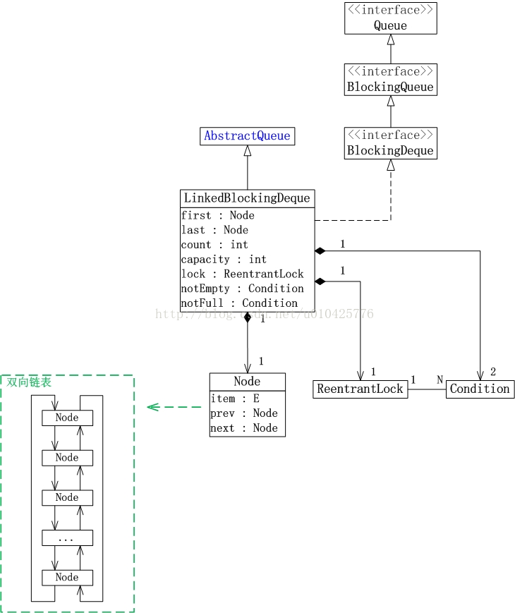

#### ConcurrentLinkedQueue

**概述**

- 它是一个由单链表实现的、线程安全的、无限 队列。

**数据结构**

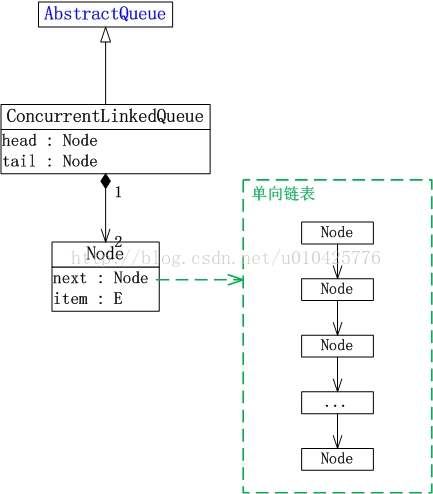

- 它仅仅继承了AbstractQueue，并未实现BlockingQueue接口，因此它不是阻塞队列，仅仅是个线程安全的普通队列。


**特性**

- head、tail、next、item均使用volatile修饰，保证其内存可见性，并未使用锁，从而提高并发效率。
- PS：它究竟是怎样在不使用锁的情况下实现线程安全的？

## CountDownLatch 闭锁

- Java 5.0 在 java.util.concurrent 包中提供了多种并发容器类来改进同步容器的性能。
- CountDownLatch 是一个同步辅助类，在完成一组正在其他线程中执行的操作之前，它允许一个或多个线程一直等待。
- 闭锁可以延迟线程的进度直到其到达终止状态，闭锁可以用来确保某些活动直到其他活动都完成才继续执行：

1. 确保某个计算在其需要的所有资源都被初始化之后才继续执行;
2. 确保某个服务在其依赖的所有其他服务都已经启动之后才启动;
3. 等待直到某个操作所有参与者都准备就绪再继续执行。

**示例程序**

```java
import java.util.concurrent.CountDownLatch;

/**
 * CountDownLatch：闭锁，在完成某些运算时，只有其他所有线程的运算全部完成，当前运算才继续执行
 */
public class TestCountDownLatch {

    public static void main(String[] agrs) {
        CountDownLatch latch = new CountDownLatch(5); // 5表示有5个线程
        LatchDemo ld = new LatchDemo(latch);

        long start = System.currentTimeMillis();

        for (int i = 0; i < 5; i++) {
            new Thread(ld).start();
        }

        try {
            latch.await(); // 等待
        } catch (InterruptedException e) {
            e.printStackTrace();
        }

        long end = System.currentTimeMillis();

        System.out.println("耗费时间为：" + (end - start) + "ms");
    }

}

class LatchDemo implements Runnable {
    private CountDownLatch latch;

    public LatchDemo(CountDownLatch latch) {
        this.latch = latch;
    }

    @Override
    public void run() {
        try {
            for (int i = 0; i < 50000; i++) {
                if (i % 2 == 0) {
                    System.out.println(i);
                }
            }
        } finally { // 必须执行的操作
            latch.countDown();
        }
    }
}
```

## Lock 同步锁、Condition 控制线程通信、线程按序交替

### 显示锁 Lock

- 在 Java 5.0 之前，协调共享对象的访问时可以使用的机制只有 synchronized 和 volatile 。Java 5.0 后增加了一些新的机制，但并不是一种替代内置锁的方法，而是当内置锁不适用时，作为一种可选择的高级功能。
- ReentrantLock 实现了 Lock 接口，并提供了与synchronized 相同的互斥性和内存可见性。但相较于synchronized 提供了更高的处理锁的灵活性。

**示例代码**

```java
import java.util.concurrent.locks.Lock;
import java.util.concurrent.locks.ReentrantLock;

/*
 * 一、用于解决多线程安全问题的方式：
 * 
 * synchronized:隐式锁
 * 1. 同步代码块
 * 2. 同步方法
 * 
 * jdk 1.5 后：
 * 3. 同步锁 Lock
 * 注意：是一个显示锁，需要通过 lock() 方法上锁，必须通过 unlock() 方法进行释放锁
 */
public class TestLock {
	
	public static void main(String[] args) {
		Ticket ticket = new Ticket();
		
		new Thread(ticket, "1号窗口").start();
		new Thread(ticket, "2号窗口").start();
		new Thread(ticket, "3号窗口").start();
	}
}

class Ticket implements Runnable{	
	private int tick = 100;
	
	private Lock lock = new ReentrantLock();

	@Override
	public void run() {
		while(true){
			
			lock.lock(); //上锁
			
			try{
				if(tick > 0){
					try {
						Thread.sleep(200);
					} catch (InterruptedException e) {
					}
					
					System.out.println(Thread.currentThread().getName() + " 完成售票，余票为：" + --tick);
				}
			}finally{
				lock.unlock(); //释放锁
			}
		}
	}
}
```

### Condition 控制线程通信

- Condition 接口描述了可能会与锁有关联的条件变量。这些变量在用法上与使用 Object.wait 访问的隐式监视器类似，但提供了更强大的功能。需要特别指出的是，单个 Lock 可能与多个 Condition 对象关联。为了避免兼容性问题，Condition 方法的名称与对应的 Object 版本中的不同。
- 在 Condition 对象中，与 wait、notify 和 notifyAll 方法对应的分别是await、signal 和 signalAll。
- Condition 实例实质上被绑定到一个锁上。要为特定 Lock 实例获得Condition 实例，请使用其 newCondition() 方法。

### 线程按序交替

Lock和Condition结合应用以实现线程按序交替。

**案例：**

假设我们尝试实现一个简单的生产者-消费者模型，其中有两个条件变量，一个用于表示缓冲区为空（消费者等待生产者生产），另一个表示缓冲区已满（生产者等待消费者消费）。

```java
import java.util.concurrent.locks.Condition;
import java.util.concurrent.locks.Lock;
import java.util.concurrent.locks.ReentrantLock;

public class ProducerConsumerExample {
    private final Lock lock = new ReentrantLock();
    private final Condition notEmpty = lock.newCondition();
    private final Condition notFull = lock.newCondition();
    private final int[] buffer = new int[10];
    private int count, putIndex, takeIndex;

    public void produce(int value) throws InterruptedException {
        lock.lock();
        try {
            while (count == buffer.length) {
                notFull.await();  // 缓冲区已满，等待消费者消费
            }
            buffer[putIndex] = value;
            putIndex = (putIndex + 1) % buffer.length;
            count++;
            notEmpty.signal();  // 通知消费者有数据可消费
        } finally {
            lock.unlock();
        }
    }

    public int consume() throws InterruptedException {
        lock.lock();
        try {
            while (count == 0) {
                notEmpty.await();  // 缓冲区为空，等待生产者生产
            }
            int value = buffer[takeIndex];
            takeIndex = (takeIndex + 1) % buffer.length;
            count--;
            notFull.signal();  // 通知生产者缓冲区有空位
            return value;
        } finally {
            lock.unlock();
        }
    }

    public static void main(String[] args) {
        ProducerConsumerExample example = new ProducerConsumerExample();
        
        // 生产者线程
        Thread producer = new Thread(() -> {
            try {
                for (int i = 0; i < 20; i++) {
                    example.produce(i);
                    System.out.println("Produced: " + i);
                }
            } catch (InterruptedException e) {
                Thread.currentThread().interrupt();
            }
        });

        // 消费者线程
        Thread consumer = new Thread(() -> {
            try {
                for (int i = 0; i < 20; i++) {
                    int value = example.consume();
                    System.out.println("Consumed: " + value);
                }
            } catch (InterruptedException e) {
                Thread.currentThread().interrupt();
            }
        });

        producer.start();
        consumer.start();

        try {
            producer.join();
            consumer.join();
        } catch (InterruptedException e) {
            Thread.currentThread().interrupt();
        }
    }
}
```


编写一个程序，开启 3 个线程，这三个线程的 ID 分别为A、B、C，每个线程将自己的 ID 在屏幕上打印 10 遍，要求输出的结果必须按顺序显示。如：ABCABCABC…… 依次递归。

```java
import java.util.concurrent.locks.Condition;
import java.util.concurrent.locks.Lock;
import java.util.concurrent.locks.ReentrantLock;

public class TestABCAlternate {

    public static void main(String[] agrs) {
        AlternateDemo ad = new AlternateDemo();
        new Thread(new Runnable() {
            @Override
            public void run() {
                for (int i = 0; i < 10; i++) {
                    ad.loopA();
                }
            }
        }, "A").start();
        new Thread(new Runnable() {
            @Override
            public void run() {
                for (int i = 0; i < 10; i++) {
                    ad.loopB();
                }
            }
        }, "B").start();
        new Thread(new Runnable() {
            @Override
            public void run() {
                for (int i = 0; i < 10; i++) {
                    ad.loopC();
                }
            }
        }, "C").start();
    }

}

class AlternateDemo {
    private int number = 1; // 当前正在执行的线程标记
    private Lock lock = new ReentrantLock();
    private Condition condition1 = lock.newCondition();
    private Condition condition2 = lock.newCondition();
    private Condition condition3 = lock.newCondition();

    public void loopA() {
        lock.lock();
        try {
            // 1.判断
            if (number != 1) {
                condition1.await();
            }
            // 2.打印
            System.out.print(Thread.currentThread().getName());
            // 3.唤醒
            number = 2;
            condition2.signal();
        } catch (Exception e) {
            e.printStackTrace();
        } finally {
            lock.unlock();
        }
    }

    public void loopB() {
        lock.lock();
        try {
            if (number != 2) {
                try {
                    condition2.await();
                } catch (InterruptedException e) {
                    e.printStackTrace();
                }
            }
            System.out.print(Thread.currentThread().getName());
            number = 3;
            condition3.signal();
        } finally {
            lock.unlock();
        }
    }

    public void loopC() {
        lock.lock();
        try {
            if (number != 3) {
                try {
                    condition3.await();
                } catch (InterruptedException e) {
                    e.printStackTrace();
                }
            }
            System.out.print(Thread.currentThread().getName());
            number = 1;
            condition1.signal();
        } finally {
            lock.unlock();
        }
    }
}
```

## ReadWriteLock 读写锁

- ReadWriteLock 维护了一对相关的锁，一个用于只读操作，另一个用于写入操作。只要没有 writer，读取锁可以由多个 reader 线程同时保持。写入锁是独占的。
- ReadWriteLock 读取操作通常不会改变共享资源，但执行写入操作时，必须独占方式来获取锁。对于读取操作占多数的数据结构。 ReadWriteLock 能提供比独占锁更高的并发性。而对于只读的数据结构，其中包含的不变性可以完全不需要考虑加锁操作。

**示例代码**

```java
import java.util.concurrent.locks.ReadWriteLock;
import java.util.concurrent.locks.ReentrantReadWriteLock;

/*
 * 1. ReadWriteLock : 读写锁
 * 
 * 写写/读写 需要“互斥”
 * 读读 不需要互斥
 * 
 */
public class TestReadWriteLock {

	public static void main(String[] args) {
		ReadWriteLockDemo rw = new ReadWriteLockDemo();
		
		new Thread(new Runnable() {
			@Override
			public void run() {
				rw.set((int)(Math.random() * 101));
			}
		}, "Write:").start();
		
		for (int i = 0; i < 100; i++) {
			new Thread(new Runnable() {
				
				@Override
				public void run() {
					rw.get();
				}
			}).start();
		}
	}
}

class ReadWriteLockDemo{
	private int number = 0;
	
	private ReadWriteLock lock = new ReentrantReadWriteLock();
	
	//读
	public void get(){
		lock.readLock().lock(); //上锁
		try{
			System.out.println(Thread.currentThread().getName() + " : " + number);
		}finally{
			lock.readLock().unlock(); //释放锁
		}
	}
	
	//写
	public void set(int number){
		lock.writeLock().lock();
		try{
			System.out.println(Thread.currentThread().getName());
			this.number = number;
		}finally{
			lock.writeLock().unlock();
		}
	}
}
```

## 锁与对象的关系

- 一个对象里面如果有多个synchronized方法，某一个时刻内，只要一个线程去调用其中的一个synchronized方法了，其它的线程都只能等待，换句话说，某一个时刻内，只能有唯一一个线程去访问这些synchronized方法。
- 锁的是当前对象this，被锁定后，其它的线程都不能进入到当前对象的其它的synchronized方法。
- 加个普通方法后发现和同步锁无关。
- 换成两个对象后，不是同一把锁了，情况立刻变化。
- 都换成静态同步方法后，情况又变化。

**总结：**

- 所有的非静态同步方法用的都是同一把锁——实例对象本身，也就是说如果一个实例对象的非静态同步方法获取锁后，该实例对象的其他非静态同步方法必须等待获取锁的方法释放锁后才能获取锁，可是别的实例对象的非静态同步方法因为跟该实例对象的非静态同步方法用的是不同的锁，所以毋须等待该实例对象已获取锁的非静态同步方法释放锁就可以获取他们自己的锁。
- 所有的静态同步方法用的也是同一把锁——类对象本身，这两把锁是两个不同的对象，所以静态同步方法与非静态同步方法之间是不会有竞态条件的。但是一旦一个静态同步方法获取锁后，其他的静态同步方法都必须等待该方法释放锁后才能获取锁，而不管是同一个实例对象的静态同步方法之间，还是不同的实例对象的静态同步方法之间，只要它们同一个类的实例对象！

## 线程池

- 第四种获取线程的方法：线程池，一个 ExecutorService，它使用可能的几个池线程之一执行每个提交的任务，通常使用 Executors 工厂方法配置。
- 线程池可以解决两个不同问题：由于减少了每个任务调用的开销，它们通常可以在执行大量异步任务时提供增强的性能，并且还可以提供绑定和管理资源（包括执行任务集时使用的线程）的方法。每个 ThreadPoolExecutor 还维护着一些基本的统计数据，如完成的任务数。
- 为了便于跨大量上下文使用，此类提供了很多可调整的参数和扩展钩子 (hook)。但是，强烈建议程序员使用较为方便的 Executors 工厂方法 

1. Executors.newCachedThreadPool()（无界线程池，可以进行自动线程回收）
2. Executors.newFixedThreadPool(int)（固定大小线程池）
3. Executors.newSingleThreadExecutor()（单个后台线程）

它们均为大多数使用场景预定义了设置。

**示例代码**

```java
import java.util.ArrayList;
import java.util.List;
import java.util.concurrent.Callable;
import java.util.concurrent.ExecutorService;
import java.util.concurrent.Executors;
import java.util.concurrent.Future;

/*
 * 一、线程池：提供了一个线程队列，队列中保存着所有等待状态的线程。避免了创建与销毁额外开销，提高了响应的速度。
 * 
 * 二、线程池的体系结构：
 * 	java.util.concurrent.Executor : 负责线程的使用与调度的根接口
 * 		|--**ExecutorService 子接口: 线程池的主要接口
 * 			|--ThreadPoolExecutor 线程池的实现类
 * 			|--ScheduledExecutorService 子接口：负责线程的调度
 * 				|--ScheduledThreadPoolExecutor ：继承 ThreadPoolExecutor， 实现 ScheduledExecutorService
 * 
 * 三、工具类 : Executors 
 * ExecutorService newFixedThreadPool() : 创建固定大小的线程池
 * ExecutorService newCachedThreadPool() : 缓存线程池，线程池的数量不固定，可以根据需求自动的更改数量。
 * ExecutorService newSingleThreadExecutor() : 创建单个线程池。线程池中只有一个线程
 * 
 * ScheduledExecutorService newScheduledThreadPool() : 创建固定大小的线程，可以延迟或定时的执行任务。
 */
public class TestThreadPool {
	
	public static void main(String[] args) throws Exception {
		//1. 创建线程池
		ExecutorService pool = Executors.newFixedThreadPool(5);
		List<Future<Integer>> list = new ArrayList<>();
		for (int i = 0; i < 10; i++) {
			Future<Integer> future = pool.submit(new Callable<Integer>(){
				@Override
				public Integer call() throws Exception {
					int sum = 0;
					for (int i = 0; i <= 100; i++) {
						sum += i;
					}
					return sum;
				}
			});
			list.add(future);
		}
		pool.shutdown();
		for (Future<Integer> future : list) {
			System.out.println(future.get());
		}
		/*ThreadPoolDemo tpd = new ThreadPoolDemo();
		
		//2. 为线程池中的线程分配任务
		for (int i = 0; i < 10; i++) {
			pool.submit(tpd);
		}
		
		//3. 关闭线程池
		pool.shutdown();*/
	}
	
//	new Thread(tpd).start();
//	new Thread(tpd).start();

}

class ThreadPoolDemo implements Runnable{

	private int i = 0;
	
	@Override
	public void run() {
		while(i <= 100){
			System.out.println(Thread.currentThread().getName() + " : " + i++);
		}
	}
	
}
```

## 线程调度

### ScheduledExecutorService

一个 ExecutorService，可安排在给定的延迟后运行或定期执行的命令。

**示例代码**

```java
public class TestScheduledThreadPool {

	public static void main(String[] args) throws Exception {
		ScheduledExecutorService pool = Executors.newScheduledThreadPool(5);
		
		for (int i = 0; i < 5; i++) {
			Future<Integer> result = pool.schedule(new Callable<Integer>(){
				@Override
				public Integer call() throws Exception {
					int num = new Random().nextInt(100);//生成随机数
					System.out.println(Thread.currentThread().getName() + " : " + num);
					return num;
				}
			}, 1, TimeUnit.SECONDS);		
			System.out.println(result.get());
		}
		pool.shutdown();
	}
    
}
```

## ForkJoinPool 分支/合并框架 工作窃取

### Fork/Join 框架

Fork/Join 框架：就是在必要的情况下，将一个大任务，进行拆分(fork)成若干个小任务（拆到不可再拆时），再将一个个的小任务运算的结果进行 join 汇总。

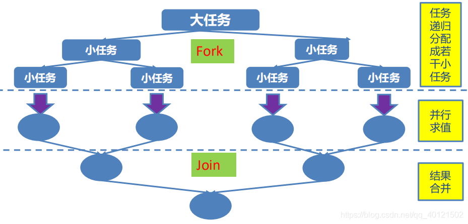

### Fork/Join 框架与线程池的区别

- 采用 “工作窃取”模式（work-stealing）：
  当执行新的任务时它可以将其拆分分成更小的任务执行，并将小任务加到线程队列中，然后再从一个随机线程的队列中偷一个并把它放在自己的队列中。
- 相对于一般的线程池实现，fork/join框架的优势体现在对其中包含的任务的处理方式上.在一般的线程池中，如果一个线程正在执行的任务由于某些原因无法继续运行，那么该线程会处于等待状态。而在fork/join框架实现中，如果某个子问题由于等待另外一个子问题的完成而无法继续运行。那么处理该子问题的线程会主动寻找其他尚未运行的子问题来执行.这种方式减少了线程的等待时间，提高了性能。

**示例代码**

```java
public class TestForkJoinPool {
	
	public static void main(String[] args) {
		Instant start = Instant.now();
		
		ForkJoinPool pool = new ForkJoinPool();
		
		ForkJoinTask<Long> task = new ForkJoinSumCalculate(0L, 50000000000L);
		
		Long sum = pool.invoke(task);
		
		System.out.println(sum);
		
		Instant end = Instant.now();
		
		System.out.println("耗费时间为：" + Duration.between(start, end).toMillis());//166-1996-10590
	}
	
	//普通串行计算
	@Test
	public void test1(){
		Instant start = Instant.now();
		
		long sum = 0L;
		
		for (long i = 0L; i <= 50000000000L; i++) {
			sum += i;
		}
		
		System.out.println(sum);
		
		Instant end = Instant.now();
		
		System.out.println("耗费时间为：" + Duration.between(start, end).toMillis());//35-3142-15704
	}
	
	//java8 新特性
	@Test
	public void test2(){
		Instant start = Instant.now();
		
		Long sum = LongStream.rangeClosed(0L, 50000000000L)
							 .parallel()
							 .reduce(0L, Long::sum);
		
		System.out.println(sum);
		
		Instant end = Instant.now();
		
		System.out.println("耗费时间为：" + Duration.between(start, end).toMillis());//1536-8118
	}

}

class ForkJoinSumCalculate extends RecursiveTask<Long>{

	/**
	 * 
	 */
	private static final long serialVersionUID = -259195479995561737L;
	
	private long start;
	private long end;
	
	private static final long THURSHOLD = 10000L;  //临界值
	
	public ForkJoinSumCalculate(long start, long end) {
		this.start = start;
		this.end = end;
	}

	@Override
	protected Long compute() {
		long length = end - start;
		
		if(length <= THURSHOLD){
			long sum = 0L;
			
			for (long i = start; i <= end; i++) {
				sum += i;
			}
			
			return sum;
		}else{
			long middle = (start + end) / 2;
			
			ForkJoinSumCalculate left = new ForkJoinSumCalculate(start, middle); 
			left.fork(); //进行拆分，同时压入线程队列
			
			ForkJoinSumCalculate right = new ForkJoinSumCalculate(middle+1, end);
			right.fork(); //
			
			return left.join() + right.join();
		}
	}
}
```

