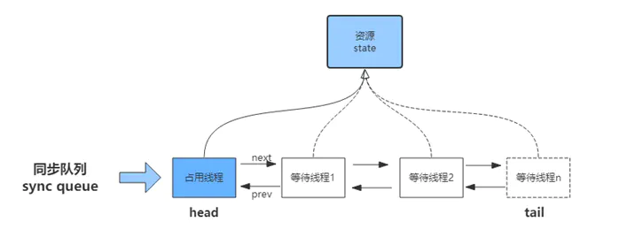
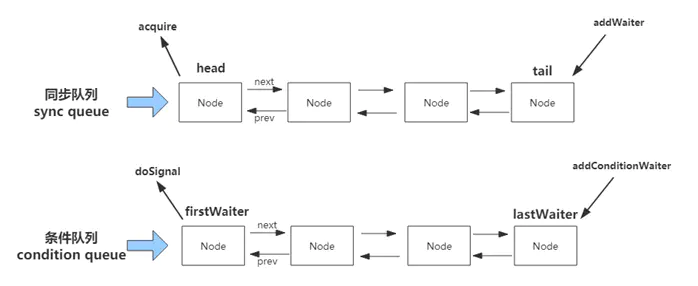
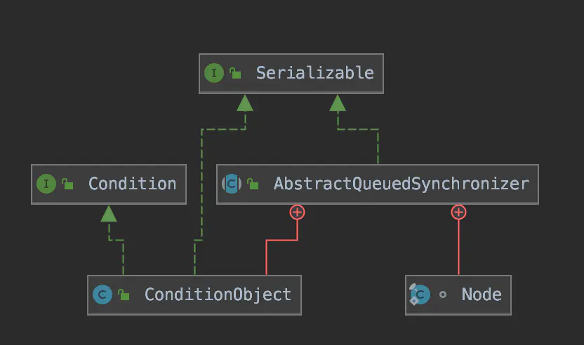
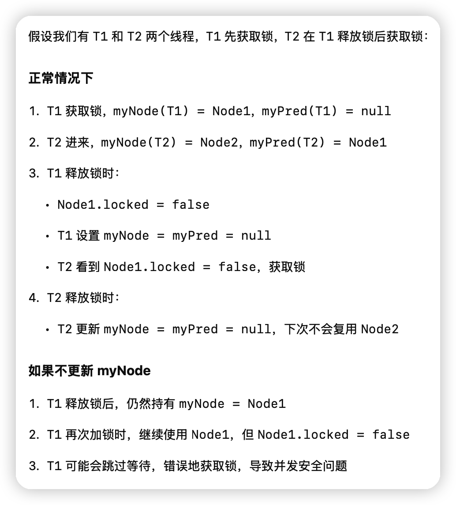
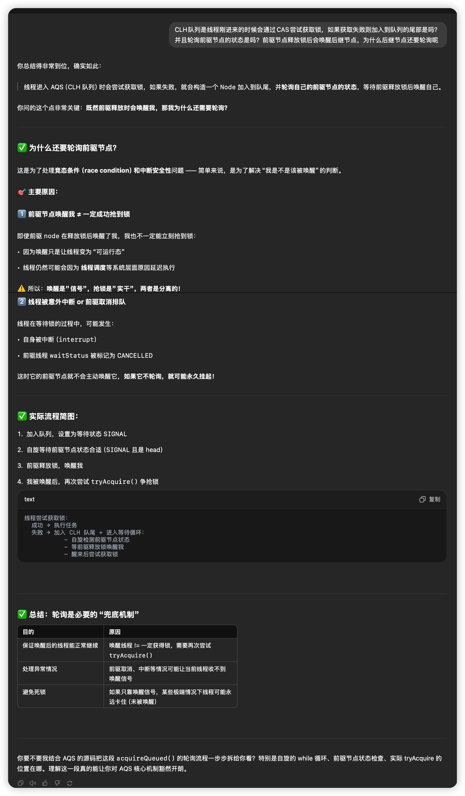
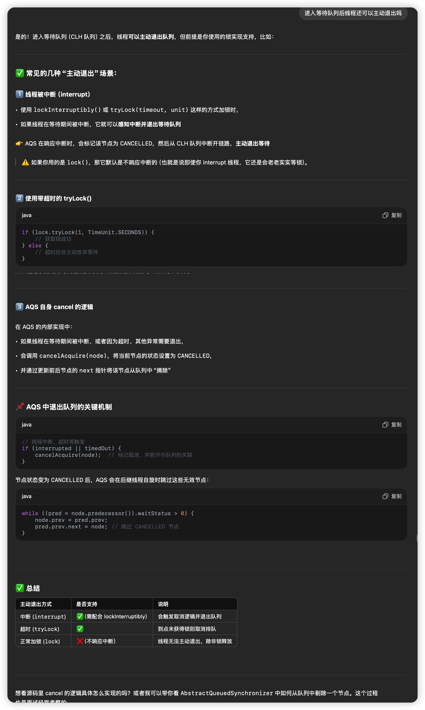

# AQS

## 概述

> AbstractQueuedSynchronizer，简称AQS。是一个用于构建锁和同步器的框架，许多同步器都可以通过AQS很容易并且高效地构造出来，如常用的`ReentrantLock`、`Semaphore`、`CountDownLatch`等。基于AQS来构建同步器能带来许多好处。它不仅能极大地减少实现工作，而且也不必处理在多个位置上发生的竞争问题。在基于AQS构建的同步器中，只可能在一个时刻发生阻塞，从而降低上下文切换的开销，并提高吞吐量。Doug Lea 大神在设计AQS时也充分考虑了可伸缩性，因此java.util.concurrent中所有基于AQS构建的同步器都能获得这个优势。大多数开发者都不会直接使用AQS，JUC中标准同步器类都能够满足绝大多数情况的需求。但如果能了解标准同步器类的实现方式，那么对理解它们的工作原理是非常有帮助的。

Tip: AQS的等待/唤醒是通过LockSupport的park和unpark来实现的。

AQS支持**独占锁（Exclusive）和共享锁（Share）**两种模式：

- 独占锁：也叫互斥锁、排它锁，只能被一个线程获取到(如`ReentrantLock`、`ReadWriteLock`的写锁)；
- 共享锁：可以被多个线程同时获取(如`CountDownLatch`、`ReadWriteLock`的读锁)。

不管是独占锁还是共享锁，本质上都是对AQS内部的一个变量`state`的获取，`state`是一个原子性的int变量，可用来表示锁状态、资源数等，如下图。



## 数据结构和核心参数



AQS的内部实现了两个队列：**同步队列和条件队列**。

- **同步队列**：在线程尝试获取资源失败后，会进入同步队列队尾，给前继节点设置一个唤醒信号后，自身进入等待状态（通过`LockSupport.park(this)`），直到被前继节点唤醒。
- **条件队列**：是为`Condition`实现的一个同步器，一个线程可能会有多个条件队列，只有在使用了`Condition`才会存在条件队列。需要注意的是，如果一个线程被唤醒（`condition.signal()`）后，它会从条件队列转移到同步队列来等待获取锁，后面对条件队列进行源码分析时会再详细讲解。

### 同步队列

不管是同步队列还是条件队列，其内部都是一个双向链表结构，首先来看一下这个双向链表`Node`的实现：

```java
static final class Node {
    /**
     * Marker to indicate a node is waiting in shared mode
     */
    static final Node SHARED = new Node();
    /**
     * Marker to indicate a node is waiting in exclusive mode
     */
    static final Node EXCLUSIVE = null;
    //取消
    static final int CANCELLED = 1;
    //等待触发
    static final int SIGNAL = -1;
    //等待条件
    static final int CONDITION = -2;
    //状态需要向后传播，针对共享锁
    static final int PROPAGATE = -3;
    //等待状态,上面列出的几个常量状态
    volatile int waitStatus;
    volatile Node prev;
    volatile Node next;
    //跟随节点入队的线程
    volatile Thread thread;
    //链接下一个等待condition的节点，或者在共享模式下作为一个特殊节点保存,用来判断是否为共享模式
    Node nextWaiter;
}
```

**说明：**双向链表这里就不再解释了，主要看一下内部的几个等待状态：

- `CANCELLED`：值为1，当前节点由于超时或中断被取消。
- `SIGNAL`：值为-1，唤醒信号，表示当前节点的后继节点正在等待获取锁，当前节点在release或cancel时需要执行`unpark`来唤醒后继节点。
- `CONDITION`：值为-2，当前节点为条件队列节点，这个状态在同步队列里不会被用到。
- `PROPAGATE`：值为-3，针对共享锁，`releaseShared`（释放共享锁）操作需要被传递到下一个节点。这个状态在`doReleaseShared`方法中被设置在`head`节点，用来保证后续节点可以获取共享资源。这个定义可能比较抽象，后面第三节我们对`doAcquireShared`方法分析的时候再详细讲解这个状态。
- `0`：初始状态，当前节点在同步队列中，等待获取锁。

### 基础同步器

介绍完同步队列，下面来看一下AQS基础同步器：

```java
//队列头,注意如果head存在,那么它的waitStatus一定不是CANCELLED
private transient volatile Node head;
//队列尾
private transient volatile Node tail;
//同步器state(资源)
private volatile int state;
```

说明：其实AQS同步器的实现方式并不复杂，主要就是围绕这三个成员变量来实现锁/资源的获取和释放。

注：AQS本身已经为我们提供了一个同步器的所需的基础操作，如果要自定义一个同步器，必须要实现以下几个方法：

- `tryAcquire(int)`：独占方式。尝试获取资源，成功则返回true，失败则返回false。
- `tryRelease(int)`：独占方式。尝试释放资源，成功则返回true，失败则返回false。
- `tryAcquireShared(int)`：共享方式。尝试获取资源。负数表示失败；0表示成功，但没有剩余可用资源；正数表示成功，且有剩余资源。
- `tryReleaseShared(int)`：共享方式。尝试释放资源，成功则返回true，失败则返回false。
- `isHeldExclusively()`：该线程是否正在独占资源（是否获取到锁）。只有用到Condition才需要去实现它。

### 条件同步器



​																									ConditionObject类结构

除了基础同步器，AQS还实现了一个条件同步器（为`Condition`类提供的实现-`ConditionObject`），首先来看一下这个条件同步器内部的几个重要元素：

```java
//条件队列的首个节点
private transient Node firstWaiter;
//条件队列的尾节点
private transient Node lastWaiter;
//节点等待时如果被中断，则重新补上中断状态
private static final int REINTERRUPT =  1;
//节点等待时如果被中断，则抛出InterruptedException异常
private static final int THROW_IE    = -1;
```

说明：条件同步器和AQS本身的基础同步器实现方式大同小异，`firstWaiter`相当于`head`，`lastWaiter`相当于`tail`。我们知道，在使用`condition`的方法之前需要先获取锁，那么这是为什么呢？同学们可以先思考一下这个问题，后面对条件同步器进行源码解析时会再详细分析。

## 源码解析

本节开始将会从源码层面分析AQS的具体实现，分两个部分：第一部分是对基础同步器的讲解；第二部再分析AQS对`Condition`的实现。

### 基础同步器

如果你使用过`Lock`，那么对`lock.lock()`和`lock.unlock()`肯定不会陌生，这两个方法本质上都是使用AQS的下面四个方法来实现的，后面我们会依次对这些方法做详细讲解：

- `acquire(int)`：独占模式下获取锁/资源（写锁`lock.lock()`内部实现）
- `release(int)`：独占模式下释放锁/资源（写锁`lock.unlock()`内部实现）
- `acquireShared(int)`：共享模式下获取锁/资源（读锁`lock.lock()`内部实现）
- `releaseShared(int)`：共享模式下释放锁/资源（读锁`lock.unlock()`内部实现）

*注：由于部分方法在AQS中未实现，文中会引入`ReentrantLock`中部分方法实现，建议同学们结合[JUC源码分析-JUC锁（一）：ReetrantLock](https://www.jianshu.com/p/38fe92bcca7e)学习以下内容。*

#### acquire(int)

```java
//独占模式获取资源
public final void acquire(int arg) {
    if (!tryAcquire(arg) &&
        acquireQueued(addWaiter(Node.EXCLUSIVE), arg))
        selfInterrupt();
}
```

**说明：** 独占模式下获取资源/锁，忽略中断的影响。内部主要调用了三个方法，其中`tryAcquire`需要自定义实现。后面会对各个方法进行详细分析。`acquire`方法流程如下：

1. `tryAcquire()` 尝试直接获取资源/锁，如果成功则直接返回，失败进入第二步；
2. `addWaiter()` 获取资源/锁失败后，将当前线程加入同步队列的尾部，并标记为独占模式，返回新的同步队列；
3. `acquireQueued()` 使线程在同步队列等待获取资源，一直获取到后才返回，如果在等待过程中被中断过，则返回true，否则返回false。
4. 如果线程在等待过程中被中断(interrupt)过，在获取资源成功之后会调用`selfInterrupt()`方法把中断状态补上。

#### tryAcquire(int)

```java
protected boolean tryAcquire(int arg) {
    throw new UnsupportedOperationException();
}
```

**说明：**尝试获取资源，成功返回true。具体资源获取/释放方式交由自定义同步器实现。`ReentrantLock`中公平锁和非公平锁的具体实现如下（请同学们结合着[ReetrantLock源码分析](https://www.jianshu.com/p/38fe92bcca7e)一章来看）:

```java
//公平锁
protected final boolean tryAcquire(int acquires) {
    final Thread current = Thread.currentThread();
    int c = getState();
    if (c == 0) {
        if (!hasQueuedPredecessors() &&
                compareAndSetState(0, acquires)) {
            setExclusiveOwnerThread(current);
            return true;
        }
    }
    else if (current == getExclusiveOwnerThread()) {
        int nextc = c + acquires;
        if (nextc < 0)
            throw new Error("Maximum lock count exceeded");
        setState(nextc);
        return true;
    }
    return false;
}
//非公平锁
final boolean nonfairTryAcquire(int acquires) {
    final Thread current = Thread.currentThread();
    int c = getState();
    if (c == 0) {
        if (compareAndSetState(0, acquires)) {
            setExclusiveOwnerThread(current);
            return true;
        }
    }
    else if (current == getExclusiveOwnerThread()) {
        int nextc = c + acquires;
        if (nextc < 0) // overflow
            throw new Error("Maximum lock count exceeded");
        setState(nextc);
        return true;
    }
    return false;
}
```

#### addWaiter(Node)

```java
//插入给定节点到队尾，并返回新的队列(节点)
private Node addWaiter(Node mode) {
    Node node = new Node(mode);

    for (;;) {//自旋重试
        Node oldTail = tail;
        if (oldTail != null) {
            //设置当前节点的前继节点为tail
            node.setPrevRelaxed(oldTail);
            //cas替换tail为当前节点
            if (compareAndSetTail(oldTail, node)) {
                oldTail.next = node;
                return node;
            }
        } else {//队尾为空,初始化同步队列
            initializeSyncQueue();
        }
    }
}
```

**说明：**获取资源/锁失败后，将当前线程加入同步队列的尾部，并标记为独占模式。返回插入的等待节点。

#### acquireQueued(Node,int)

```java
//等待获取资源
final boolean acquireQueued(final Node node, int arg) {
    boolean interrupted = false;
    try {
        for (;;) {
            final Node p = node.predecessor();//获取前继节点
            //前继节点为head，说明可以尝试获取资源
            if (p == head && tryAcquire(arg)) {
                setHead(node);//获取成功，更新head节点
                p.next = null; // help GC
                return interrupted;
            }
            if (shouldParkAfterFailedAcquire(p, node))//检查是否可以park
                interrupted |= parkAndCheckInterrupt();//阻塞当前线程,清除并返回中断状态
        }
    } catch (Throwable t) {
        cancelAcquire(node);//取消正在等待的节点操作
        if (interrupted)//如果期间线程被中断过，补上中断
            selfInterrupt();
        throw t;
    }
}
```

**说明：**  线程进入同步队列后，调用`acquireQueued`方法在队列中等待获取资源。如果等待期间被中断过则返回`true`，否则返回`false`。`acquireQueued`具体流程如下：

1. 获取当前等待节点的前继节点，如果前继节点为`head`，说明可以尝试获取锁/资源；
2. 调用`tryAcquire`获取资源，成功后更新`head`为当前节点，返回等待期间的中断状态；
3. 如果前继节点不是`head`，或者`tryAcquire`获取资源失败，继续调用`shouldParkAfterFailedAcquire`方法检查并更新前继节点的等待状态。把前继等待状态设为`SIGNAL`之后，不会直接阻塞，而是会再去尝试一次获取资源（自旋回来再次执行1、2步），来确保调用者确实获取不到资源，然后才会调用`parkAndCheckInterrupt`进入阻塞状态（详见下面`shouldParkAfterFailedAcquire`方法的注释）。
4. 线程被唤醒后，继续自旋重复上述步骤，`shouldParkAfterFailedAcquire`和`parkAndCheckInterrupt`源码如下：

```java
//获取资源失败后，检查并更新等待状态,如果线程需要阻塞返回true
private static boolean shouldParkAfterFailedAcquire(Node pred, Node node) {
    int ws = pred.waitStatus;
    if (ws == Node.SIGNAL)
        /*
         * This node has already set status asking a release
         * to signal it, so it can safely park.
         */
        //前继节点已设置唤醒信号,当前节点可以被阻塞
        return true;
    if (ws > 0) {
        //如果前节点为CANCELLED状态，那就一直往前找到一个等待状态的节点，并排在它的后边
        do {
            node.prev = pred = pred.prev;
        } while (pred.waitStatus > 0);
        pred.next = node;
    } else {
        // 此时前继节点状态为0或PROPAGATE，说明正在等待获取锁/资源,
        // 此时需要给前继节点设置一个唤醒信号SIGNAL，但不直接阻塞,
        // 因为在阻塞前调用者需要重试来确认它确实不能获取资源。
        pred.compareAndSetWaitStatus(ws, Node.SIGNAL);
    }
    return false;
}
//阻塞当前线程，清除并返回中断状态
private final boolean parkAndCheckInterrupt() {
    LockSupport.park(this);
    return Thread.interrupted();
}
```

**说明：**当前线程通过`parkAndCheckInterrupt()`阻塞之后，此状态下可以通过下面两种途径唤醒线程：

- 前继节点释放资源后，通过`unparkSuccessor()`方法unpark当前线程；
- 当前线程被中断。

1. 回到`acquireQueued()`方法，如果在上述四步中遭遇异常，则需要通过`cancelAcquire`方法取消当前节点的获取操作，源码如下：

```java
private void cancelAcquire(Node node) {
    // Ignore if node doesn't exist
    if (node == null)
        return;

    node.thread = null;

    // Skip cancelled predecessors
    Node pred = node.prev;
    //为当前节点找出一个有效的前继节点(非cancel的前继节点)
    while (pred.waitStatus > 0)
        node.prev = pred = pred.prev;

    Node predNext = pred.next;

    //当前节点的状态设为CANCELLED
    node.waitStatus = Node.CANCELLED;

    // If we are the tail, remove ourselves.
    if (node == tail && compareAndSetTail(node, pred)) {
        pred.compareAndSetNext(predNext, null);
    } else {
        int ws;
        if (pred != head &&
            ((ws = pred.waitStatus) == Node.SIGNAL ||
             (ws <= 0 && pred.compareAndSetWaitStatus(ws, Node.SIGNAL))) &&
            pred.thread != null) {//前继节点不是head,并且状态为SIGNAL,并且未取消,说明该前继节点是非head的有效SIGNAL节点
            Node next = node.next;
            //把前继节点的next设置为当前节点的next节点
            if (next != null && next.waitStatus <= 0)
                pred.compareAndSetNext(predNext, next);
        } else {//前继节点为head节点,帮忙唤醒当前节点的后继节点
            unparkSuccessor(node);
        }
        //指向自己,等待被回收
        node.next = node; // help GC
    }
}

//唤醒给定节点的后继节点
private void unparkSuccessor(Node node) {
    int ws = node.waitStatus;
    if (ws < 0)
        node.compareAndSetWaitStatus(ws, 0);
    Node s = node.next;
    if (s == null || s.waitStatus > 0) {
        s = null;
        //后继节点为空或已取消,从tail开始向前查找有效节点
        for (Node p = tail; p != node && p != null; p = p.prev)
            if (p.waitStatus <= 0)
                s = p;
    }
    if (s != null)
        LockSupport.unpark(s.thread);
}
```

**说明：** `cancelAcquire`方法用于取消正在等待的节点，在获取资源遭遇异常、或者在响应中断的方法中遭遇线程中断(`interrupt`)时被调用，逻辑也不太复杂：主要操作就是把自己从同步队列中剔除，同学们可以参考上述源码中的注释阅读。这里需要注意一点，如果需要取消的节点的前继节点是`head`节点的话，需要帮助唤醒下一个同步队列中的节点(调用了`unparkSuccessor`方法，下节会讲到)。

#### release(int)

```java
/**独占模式释放锁/资源*/
public final boolean release(int arg) {
    if (tryRelease(arg)) {//尝试释放资源
        Node h = head;//头结点
        if (h != null && h.waitStatus != 0)
            unparkSuccessor(h);//唤醒head的下一个节点
        return true;
    }
    return false;
}
```

**说明：**独占模式下释放指定量的资源，成功释放后调用`unparkSuccessor`唤醒head的下一个节点。

#### tryRelease(int)

```java
protected boolean tryRelease(int arg) {
    throw new UnsupportedOperationException();
}
```

**说明：**和`tryAcquire()`一样，这个方法也需要自定义同步器去实现。一般来说，释放资源直接拿`state`减去给定的参数`arg`，释放后`state==0`说明释放成功。在`ReentrantLock`中实现如下：

```java
protected final boolean tryRelease(int releases) {
    int c = getState() - releases;
    if (Thread.currentThread() != getExclusiveOwnerThread())
        throw new IllegalMonitorStateException();
    boolean free = false;
    if (c == 0) {
        free = true;//锁全部释放，可以唤醒下一个等待线程
        setExclusiveOwnerThread(null);//设置独占锁持有线程为null
    }
    setState(c);
    return free;
}
```

#### unparkSuccessor(Node)

```csharp
//唤醒给定节点的后继节点
private void unparkSuccessor(Node node) {
    int ws = node.waitStatus;
    if (ws < 0)
        node.compareAndSetWaitStatus(ws, 0);
    Node s = node.next;
    if (s == null || s.waitStatus > 0) {
        s = null;
        //后继节点为空或已取消,向前查找有效节点
        for (Node p = tail; p != node && p != null; p = p.prev)
            if (p.waitStatus <= 0)
                s = p;
    }
    if (s != null)
        LockSupport.unpark(s.thread);
}
```

**说明：**成功释放资源后，调用此方法唤醒下一个节点。因为当前节点已经释放掉资源，下一个等待的线程可以被唤醒继续获取资源。此方法在上一小节中的`cancelAcquire`中也有使用到。

#### acquireShared(int)

```java
//共享模式下获取锁/资源
public final void acquireShared(int arg) {
    if (tryAcquireShared(arg) < 0)
        doAcquireShared(arg);
}
```

**说明：**共享模式下获取资源/锁。流程比较简单：使用`tryAcquireShared(arg)` 尝试获取共享资源，成功则直接返回，如果尝试获取资源失败，则调用`doAcquireShared`方法进入同步队列，成功获取资源后返回。

#### tryAcquireShared(int arg)

```cpp
protected int tryAcquireShared(int arg) {
    throw new UnsupportedOperationException();
}
```

**说明：**尝试获取共享资源，需同步器自定义实现。有三个类型的返回值：

- 正数：成功获取资源，并且还有剩余可用资源，可以唤醒下一个等待线程；
- 负数：获取资源失败，准备进入同步队列；
- 0：获取资源成功，但没有剩余可用资源。

#### doAcquireShared(int)

```java
//获取共享锁
private void doAcquireShared(int arg) {
    final Node node = addWaiter(Node.SHARED);//添加一个共享模式Node到队列尾
    boolean interrupted = false;
    try {
        for (;;) {
            final Node p = node.predecessor();//获取前节点
            if (p == head) {
                int r = tryAcquireShared(arg);//前继节点为head,尝试直接获取资源
                if (r >= 0) {
                    //获取资源成功,设置head为自己,如果有剩余资源继续唤醒之后的线程
                    setHeadAndPropagate(node, r);
                    p.next = null; // help GC
                    return;
                }
            }
            if (shouldParkAfterFailedAcquire(p, node))//检查获取失败后是否可以阻塞
                interrupted |= parkAndCheckInterrupt();//阻塞当前线程,清除并返回中断状态
        }
    } catch (Throwable t) {
        cancelAcquire(node);//取消正在等待的节点操作
        throw t;
    } finally {
        if (interrupted)//如果期间线程被中断过，补上中断
            selfInterrupt();
    }
}
```

**说明：** 看到这里，同学们是不是觉得这个方法很熟悉，没错，跟独占模式时的`acquireQueued`方法基本一致。具体流程就不重复讲了，这里只需要注意一点：当前节点成功获取到资源后，如果还有剩余资源（`tryAcquireShared`返回值大于0），还需要调用`setHeadAndPropagate`方法继续唤醒之后的线程（这是与独占模式不同的一点），`setHeadAndPropagate`源码如下：

```java
//设置head，如果有剩余资源可以再唤醒之后的线程
private void setHeadAndPropagate(Node node, int propagate) {
    Node h = head; // Record old head for check below
    setHead(node);
    /*
     * 如果满足下列条件可以尝试唤醒下一个节点：
     *  有剩余资源(propagate>0)，并且当前节点有唤醒信号
     */
    if (propagate > 0 || h == null || h.waitStatus < 0 ||
        (h = head) == null || h.waitStatus < 0) {
        Node s = node.next;
        if (s == null || s.isShared())
            doReleaseShared();
    }
}
```

**说明：** `setHeadAndPropagate`所做的事情跟它的名字一样，首先是更新`head`；如果还有剩余资源，或者前节点已经被记录（`waitStatus`为`SIGNAL`或`PROPAGATE`），则继续调用`doReleaseShared`方法帮助唤醒后续节点。

**注：为了便于理解`PROPAGATE`这个状态， `doReleaseShared`方法放到本节来讲解，源码如下：**

```java
//释放共享资源
private void doReleaseShared() {
    //自旋,防止操作时有新的节点加入导致CAS失败
    for (;;) {
        Node h = head;
        if (h != null && h != tail) {
            int ws = h.waitStatus;
            if (ws == Node.SIGNAL) {
                if (!compareAndSetWaitStatus(h, Node.SIGNAL, 0))
                    continue;            // loop to recheck cases
                unparkSuccessor(h);//唤醒后继节点
            }
            else if (ws == 0 && !compareAndSetWaitStatus(h, 0, Node.PROPAGATE))  
                //waitStatus为0，说明是从doAcquireShared过来的操作，CAS修改为PROPAGATE
                continue; // loop on failed CAS
        }
        if (h == head) // loop if head changed
            break;
    }
}
```

**说明：** 成功释放资源后，调用此方法继续唤醒后继节点。
 这里主要说明一下`PROPAGATE`状态的设置：
 新节点尝试获取资源失败后，会调用`doAcquireShared`方法进入队列等待。在进入等待前，如果前继节点是`head`节点，会尝试着再去获取一次资源，如果当前节点再次尝试获取资源成功，则会调用`setHeadAndPropagate`方法更新`head`为当前节点，并且如果此时还有剩余资源，则继续调用`doReleaseShared`方法释放节点。此时，就会把节点状态由`0`修改为`PROPAGATE`，保证下一次`doAcquireShared`操作可以在`setHeadAndPropagate`时继续向后传播。

#### releaseShared(int)

```java
/**共享模式下释放给定资源数*/
public final boolean releaseShared(int arg) {
    if (tryReleaseShared(arg)) {
        doReleaseShared();//释放资源，并唤醒后继节点
        return true;
    }
    return false;
}
```

**说明：**`releaseShared`用于共享模式下释放给定量的资源，如果成功释放，唤醒同步队列的后继节点。方法执行流程：`tryReleaseShared(int)`尝试释放给定量的资源（需要自定义同步器去实现），成功释放后调用`doReleaseShared()`唤醒后继线程。

#### tryReleaseShared(int)

```java
/**共享模式释放资源*/
protected boolean tryReleaseShared(int arg) {
    throw new UnsupportedOperationException();
}
```

**说明：**释放给定量的资源，需自定义同步器实现。释放后如果允许后继等待线程获取资源返回`true`。

#### doReleaseShared(int)

#### 小结

自此，AQS的几个主要方法就分析完了，剩余一些如`tryAcquireNanos`、`tryAcquireSharedNanos`，是带等待时间的资源获取方法，还有`acquireInterruptibly` `acquireSharedInterruptibly`，响应中断式资源获取方法。与本章节所讲的方法大同小异，就不再详细分析了。

### 条件同步器

本节开始分析AQS内部对`Condition`的实现—`ConditionObject`，在进行下面的内容之前，确保你已经真正理解AQS基础同步器。同样地，我们会针对`Condition`中最常用的两个方法进行解析：`await()`和`signal()`。

#### await()

```java
public final void await() throws InterruptedException {
    if (Thread.interrupted())
        throw new InterruptedException();
    //添加新节点(当前线程)到条件队列
    Node node = addConditionWaiter();
    int savedState = fullyRelease(node);//释放锁并返回释放前锁状态
    int interruptMode = 0;
    while (!isOnSyncQueue(node)) {//当前节点是否在同步队列中
        LockSupport.park(this);
        //检查等待期间是否被中断过
        if ((interruptMode = checkInterruptWhileWaiting(node)) != 0)
            break;
    }
    //获取锁
    if (acquireQueued(node, savedState) && interruptMode != THROW_IE)
        interruptMode = REINTERRUPT;
    if (node.nextWaiter != null) // clean up if cancelled
        unlinkCancelledWaiters();//清除取消等待的节点
    if (interruptMode != 0)
        reportInterruptAfterWait(interruptMode);//报告中断状态,抛异常或补中断状态
}
```

说明：`await()`方法会使当前线程进入等待状态，直到被其他线程唤醒(`signal`)或被中断。先来看一下方法的主逻辑，后面在详细分析内部几个比较重要的子方法：

1. 首先调用`addConditionWaiter`方法把当前节点（线程）添加到条件队列；
2. 调用`fullyRelease`方法释放已经持有的锁（就是在调用`condition.await()`之前持有的`lock.lock()`锁），并返回释放前的锁状态；
3. 调用`isOnSyncQueue`方法检查当前节点是否在**同步**队列中，这里注意不要混淆**条件队列**和**同步队列**，被`condition.signal()`唤醒后的线程会从**条件队列**转移到**同步队列**，后面讲解`signal()`方法的时候再详细分析。
4. 如果当前节点不在**同步**队列，说明还在条件队列中等待，此时直接调用`LockSupport.park(this)`阻塞当前线程，等待被唤醒；
5. 线程被唤醒(`signal()`)后，当前节点会从条件队列转移到同步队列，此时首先检查等待期间是否被中断过，并记录中断状态，然后跳出while循环；
6. 调用`acquireQueued`方法在同步队列中等待获取锁，并返回等待期间的中断状态，`acquireQueued`方法在前面已经分析过，不再赘述；
7. 如果当前节点的`nextWaiter`不为空，说明节点在获取锁时由于遭遇异常或者被中断而被取消，此时需要清除取消等待的节点；
8. 最后判断整个操作期间是否有中断，如果有，调用`reportInterruptAfterWait`处理中断，根据`interruptMode`的值来决定抛异常还是补上中断状态。

`await()`内部的子方法很多，这里我们只讲一个`addConditionWaiter()`方法，因为这个方法里面有一个比较重要的概念。剩下的方法都比较简单，就留给同学们自己摸索吧。

#### addConditionWaiter()

```java
//添加节点到条件队列
private Node addConditionWaiter() {
    if (!isHeldExclusively())//检查是否持有锁
        throw new IllegalMonitorStateException();
    Node t = lastWaiter;
    // If lastWaiter is cancelled, clean out.
    if (t != null && t.waitStatus != Node.CONDITION) {
        unlinkCancelledWaiters();//清除已经取消的等待节点
        t = lastWaiter;
    }

    Node node = new Node(Node.CONDITION);

    if (t == null)
        firstWaiter = node;
    else
        t.nextWaiter = node;
    lastWaiter = node;
    return node;
}
```

说明：`addConditionWaiter`用于将当前线程放入条件队列，方法本身比较简单，这里主要介绍一下`isHeldExclusively()`方法。
 在第二章节介绍基础同步器的时候我们提到过，要想自定义一个同步器，必须要实现的方法其中之一就包括`isHeldExclusively()`，它的功能就是判断当前线程是否已经持有锁，如果为答案为否，那么就会直接抛出`IllegalMonitorStateException`异常（相信这个异常是在多线程编程中最常遇到的其中之一了）。记得第二章节介绍条件同步器时的那个问题吗，为什么在使用`Condition`之前要先获取锁(`lock.lock()`)，这就是原因了。（同学们可以试着在使用`Condition`之前不调用`lock.lock()`，看看会发生什么）。

#### signal()

```java
//移除等待时间最长的节点(firstWaiter)
public final void signal() {
    if (!isHeldExclusively())//检查是否持有锁
        throw new IllegalMonitorStateException();
    Node first = firstWaiter;//获取条件队列的首个节点
    if (first != null)
        doSignal(first);
}
```

说明：`signal()`方法用于唤醒在当前条件队列等待时间最长的那个线程（也就是`firstWaiter`节点的线程）。跟`await()`一样，在方法开始之前会调用`isHeldExclusively()`检查当前线程是否已经持有锁。本身逻辑很简单，取到条件队列的首个节点-`firstWaiter`，然后调用`doSignal`方法唤醒节点线程，`doSignal`源码如下：

```java
//从条件队列唤醒节点线程
private void doSignal(Node first) {
    do {
        if ( (firstWaiter = first.nextWaiter) == null)//先更新firstWaiter
            lastWaiter = null; //已经没有等待节点了
        first.nextWaiter = null;//解除当前节点的链接
    } while (!transferForSignal(first) && //把当前节点转移到等待队列等待获取锁
             (first = firstWaiter) != null);
}
```

说明：`doSignal`主要对条件队列进行了三步操作：

1. 更新`firstWaiter`为条件队列的下一个等待节点；
2. 解除当前节点的链接；
3. 调用`transferForSignal`方法把当前节点转移到等待队列，等待获取锁。`transferForSignal`源码如下：

```java
//把条件队列的节点转移到等待队列
final boolean transferForSignal(Node node) {
    /*
     * If cannot change waitStatus, the node has been cancelled.
     */
    if (!node.compareAndSetWaitStatus(Node.CONDITION, 0))
        return false;

    Node p = enq(node);//进入同步队列,并返回节点的前继节点
    int ws = p.waitStatus;
    //前继节点如果已取消或者设置waitStatus失败,直接唤醒当前节点尝试获取锁
    if (ws > 0 || !p.compareAndSetWaitStatus(ws, Node.SIGNAL))
        LockSupport.unpark(node.thread);
    return true;
}
```

`transferForSignal`做的事情也比较简单：把条件节点转为同步节点（设置`waitStatus`状态为0），并进入同步队列，设置前继节点的`waitStatus`为`SIGNAL`等待被前继节点唤醒；如果前继节点被取消或者设置前继节点的状态失败，则直接唤醒当前节点线程尝试获取锁。最后返回节点转移的状态（成功转移返回`true`，否则返回`false`）

#### 小结

条件同步器是基于AQS的基础同步器实现的，两者之间也有一定的层级关系，条件同步器可以说是基础同步器的上层实现。要搞清楚两者之间的关联，关键在于理解节点在同步队列和条件队列之间转移策略。

### CLH队列

```java
import java.util.concurrent.atomic.AtomicReference;

// 精准还原CLH锁的工业级实现（非AQS简化版）
public class CLHLock {
    // 节点结构：每个线程持有前驱节点的引用
    private static class Node {
        // 使用volatile保证状态可见性（非JVM隐式保证）
        volatile boolean locked = true;
    }

    // 尾部指针（CAS操作核心）
    private final AtomicReference<Node> tail = new AtomicReference<>();
    // 当前线程持有的节点（ThreadLocal保证隔离性）
    private final ThreadLocal<Node> myNode = ThreadLocal.withInitial(Node::new);
    // 前驱节点缓存（优化自旋性能）
    private final ThreadLocal<Node> myPred = new ThreadLocal<>();

    public void lock() {
        final Node node = myNode.get();
        node.locked = true; // 标记当前节点需要获取锁
        
        // CAS入队（关键并发控制点）
        Node pred = tail.getAndSet(node);
        myPred.set(pred);  // 记录前驱
        
        // 自旋前驱节点的locked状态（优化点：避免总线风暴）
        while (pred != null && pred.locked) {
            // 现代CPU架构优化：加入内存屏障提示
            Thread.onSpinWait(); // JDK9+特性，提升自旋效率
        }
    }

    public void unlock() {
        final Node node = myNode.get();
        node.locked = false; // 释放锁信号
        
        // 重置节点供下次使用（防御性编程）
        myNode.set(myPred.get()); // 重要！将前驱设为新节点，防止状态污染
    }
}

```



### 后继节点为什么需要轮询前驱节点的状态






```java
// 线程中断、超时等触发
if (interrupted || timedOut) {
    cancelAcquire(node);  // 标记取消，并断开与队列的关联
}
```

```java
while ((pred = node.predecessor()).waitStatus > 0) {
    node.prev = pred.prev;
    pred.prev.next = node; // 跳过 CANCELLED 节点
}
```


## 总结

AQS是整个JUC包的基础，理解了AQS，对JUC里面其他类的学习都很有帮助。虽然还有部分方法笔者没有在文中详细讲解，但这些方法实现方式与咱们所讲到的方法大同小异，希望大家可以见微知著，对AQS整体有一个很好的理解。