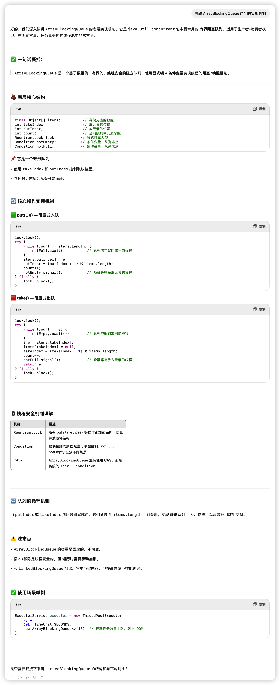
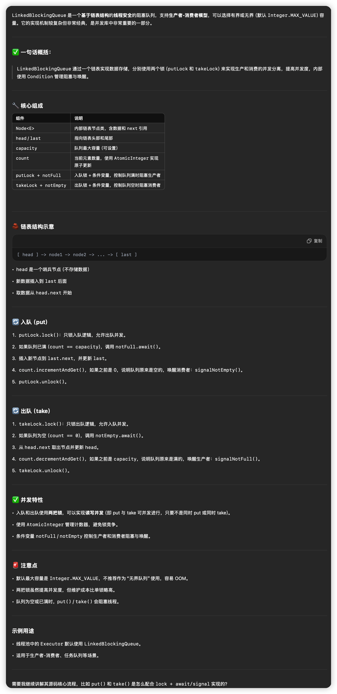
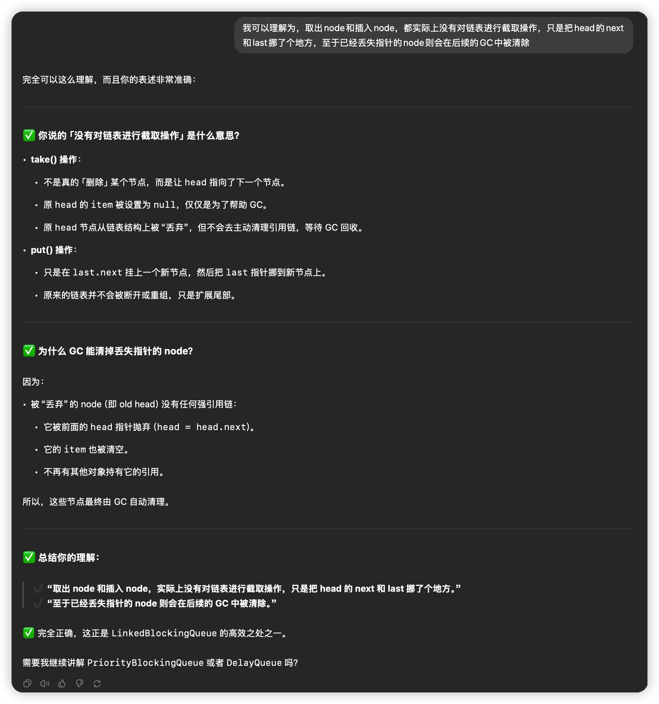
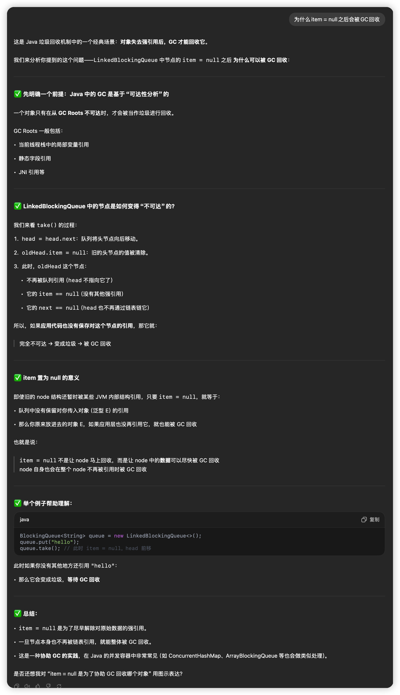
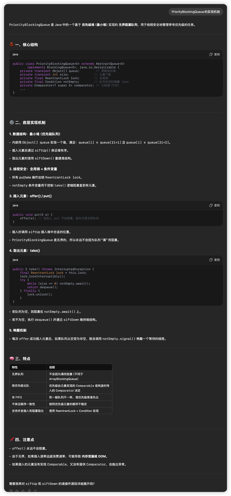
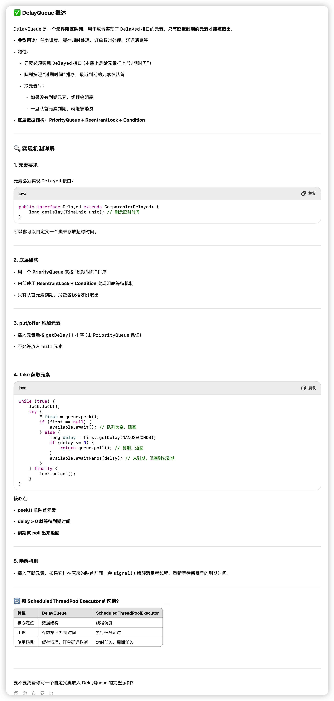
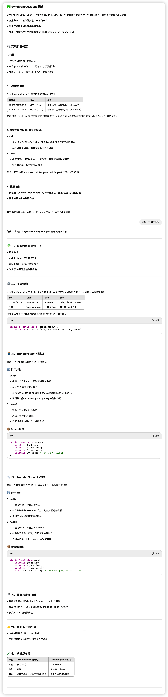

## BlockingQueue

BlockingQueue<E> 接口定义了 4 类核心方法

```java
public interface BlockingQueue<E> extends Queue<E> {

    // 1. 添加元素（可能阻塞）
    void put(E e) throws InterruptedException;
    boolean offer(E e, long timeout, TimeUnit unit) throws InterruptedException;

    // 2. 获取并移除元素（可能阻塞）
    E take() throws InterruptedException;
    E poll(long timeout, TimeUnit unit) throws InterruptedException;

    // 3. 查询容量信息
    int remainingCapacity(); // 剩余空间

    // 4. 批量操作
    int drainTo(Collection<? super E> c);
}
```

| **方法**                                | **特点** | **是否阻塞**                     | **是否支持超时** | **使用场景**             |
| --------------------------------------- | -------- | -------------------------------- | ---------------- | ------------------------ |
| put(E e)                                | 插入元素 | **阻塞**（队满时）               | ❌                | 任务必须提交，不怕阻塞   |
| offer(E e)                              | 插入元素 | **不阻塞**（直接返回 false）     | ❌                | 不允许阻塞，比如异步任务 |
| offer(E e, long timeout, TimeUnit unit) | 插入元素 | **限时阻塞**（队满等待一段时间） | ✅                | 任务重要但不能无限等     |

```java
queue.put("A"); // 会卡住线程，直到有空间
queue.offer("A"); // 会立即返回 false，不插入
queue.offer("A", 2, TimeUnit.SECONDS); // 最多等 2 秒，没空间就 false
```

| **方法**            | **特点** | **是否阻塞**                | **是否支持超时** | **使用场景**               |
| ------------------- | -------- | --------------------------- | ---------------- | -------------------------- |
| take()              | 取出元素 | **阻塞**（队空时）          | ❌                | 消费者必须取到任务         |
| poll()              | 取出元素 | **不阻塞**（直接返回 null） | ❌                | 不允许阻塞，灵活处理空队列 |
| poll(timeout, unit) | 取出元素 | **限时阻塞**                | ✅                | 需要等一会儿但不能无限等   |

```java
queue.take(); // 会阻塞，直到有数据可以取
queue.poll(); // 立即返回 null，不阻塞
queue.poll(3, TimeUnit.SECONDS); // 最多等待 3 秒，有就取，没有就返回 null
```

BlockingQueue 是一个接口，常见实现有：

- ArrayBlockingQueue（数组、有界）
- LinkedBlockingQueue（链表、有界）
- PriorityBlockingQueue（优先队列、无界）
- SynchronousQueue（零容量，直接交接）
- DelayQueue（延迟执行队列）
- LinkedTransferQueue（增强版 SynchronousQueue）

## **ArrayBlockingQueue的单锁结构**



```java
ReentrantLock lock = new ReentrantLock();
Condition notFull = lock.newCondition();
Condition notEmpty = lock.newCondition();

put(E e) {
    lock.lock();
    try {
        while (count == capacity) {
            notFull.await(); // 队满，阻塞
        }
        // 插入元素
        ...
        notEmpty.signal(); // 通知读线程
    } finally {
        lock.unlock();
    }
}

take() {
    lock.lock();
    try {
        while (count == 0) {
            notEmpty.await(); // 队空，阻塞
        }
        // 取出元素
        ...
        notFull.signal(); // 通知写线程
    } finally {
        lock.unlock();
    }
}
```


## **LinkedBlockingQueue 的双锁结构**



```java
final ReentrantLock putLock = new ReentrantLock();
final Condition notFull = putLock.newCondition();

final ReentrantLock takeLock = new ReentrantLock();
final Condition notEmpty = takeLock.newCondition();

AtomicInteger count = new AtomicInteger(0);
```

put

```java
public void put(E e) throws InterruptedException {
    if (e == null) throw new NullPointerException();
    int c = -1;
    Node<E> node = new Node<E>(e);
    final ReentrantLock putLock = this.putLock;

    putLock.lockInterruptibly();
    try {
        while (count.get() == capacity) {
            notFull.await();
        }
        enqueue(node); // 插入到链表尾部
        c = count.getAndIncrement();
        if (c + 1 < capacity) // 证明即便本次放了一个node进去之后依然达不到最大容量则直接唤醒下一个等待put的线程
            notFull.signal();
    } finally {
        putLock.unlock();
    }

    if (c == 0)
        signalNotEmpty(); // 通知 take
}

private void enqueue(Node<E> node) {
    last = last.next = node;
}
```

```java
public E take() throws InterruptedException {
    E x;
    int c = -1;
    final ReentrantLock takeLock = this.takeLock;

    takeLock.lockInterruptibly();
    try {
        while (count.get() == 0) {
            notEmpty.await();
        }
        x = dequeue(); // 从链表头部取出
        c = count.getAndDecrement();
        if (c > 1) // 证明即便本地已经取出了一个node之后依然还有剩余的node可被取出则唤醒下一个等待take的线程
            notEmpty.signal();
    } finally {
        takeLock.unlock();
    }

    if (c == capacity)
        signalNotFull(); // 通知 put
    return x;
}

private E dequeue() {
    Node<E> h = head;
    Node<E> first = h.next;
    h.next = h; // help GC
    head = first;
    E x = first.item;
    first.item = null;
    return x;
}
```

### 为什么双锁不会有线程安全问题

take取node的时候实际上进行的操作时head = head.next，没有对链表进行任何截取操作，首先要消除这方面的错误认知。失效的node因为没有用任何强引用所以最后会被GC回收。





## PriorityBlockingQueue



## DelayQueue



## SynchronousQueue



## 实现类

| **队列实现类**        | **有界/无界**            | **特点说明**                                                 |
| --------------------- | ------------------------ | ------------------------------------------------------------ |
| ArrayBlockingQueue    | ✅ **有界**               | 数组结构，必须指定容量。适合**固定资源限制**的场景。         |
| LinkedBlockingQueue   | ✅ **默认无界**（可设限） | 链表结构，可以指定最大长度；如果不指定，理论上可无限增长（风险：OOM）。 |
| PriorityBlockingQueue | ❌ **无界**               | 元素可按优先级自动排序。用于**按优先级调度任务**，无元素阻塞限制。 |
| DelayQueue            | ❌ **无界**               | 元素带有延迟时间。仅当元素“过期”后才能被取出，适合**定时任务调度**。 |
| SynchronousQueue      | ❌ **容量为0**            | **不会缓存任何元素**，每个 put 操作都必须等待一个 take。是**直接交付**机制。 |

## **🎯 关键区别&使用场景**

### **1.** ArrayBlockingQueue

- 有界，数组结构。
- 先进先出（FIFO）。
- **固定大小线程池中使用最常见**。
- 线程安全，锁分为 put 和 take 两端。

### **2.** LinkedBlockingQueue

- 链表结构，可以无限扩展（除非设置容量）。
- 默认容量为 Integer.MAX_VALUE，很容易 OOM。
- 适合任务量不可预估但风险可控的场景。
- 多数使用在 ExecutorService 的默认队列中。

### **3.** PriorityBlockingQueue

- 元素需实现 Comparable 或传入 Comparator。
- 无界，不阻塞，仅在队列为空时 take 阻塞。
- **适合调度系统/优先级任务系统**。

### **4.** DelayQueue

- 存放实现 Delayed 接口的元素。
- 只有元素的 delay 到期后才能出队。
- 非常适合**缓存超时回收、延迟任务**等场景。

### **5.** SynchronousQueue

- 没有容量，**每个 put 都必须有一个 take 来接收**。
- 通常用于**直接移交任务给线程执行**，**不会缓存任务**。
- 应用于 newCachedThreadPool。
- 如果没有线程接手，它就创建新线程（很激进）。
