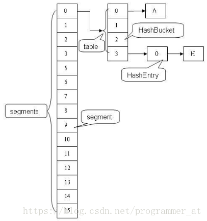

# ConcurrentHashMap


## 初始化

```java
private final Node<K,V>[] initTable() {
    Node<K,V>[] tab;
    int sc;
    while ((tab = table) == null || tab.length == 0) {
        if ((sc = sizeCtl) < 0)
            Thread.yield(); // 有其他线程在初始化，当前线程让步
        else if (U.compareAndSetInt(this, SIZECTL, sc, -1)) {
            // ✅ 当前线程 CAS 抢到了初始化权限（-1 表示正在初始化）
            try {
                if ((tab = table) == null || tab.length == 0) {
                    @SuppressWarnings("unchecked")
                    Node<K,V>[] nt = (Node<K,V>[])new Node<?,?>[sc];
                    table = tab = nt;
                    sc = nt.length - (nt.length >>> 2); // 即 0.75 * length
                }
            } finally {
                sizeCtl = sc; // 释放初始化锁
            }
            break;
        }
    }
    return tab;
}
```

## 扩容


### ForwardingNode


##### ForwardingNode的工作原理


### 扩容期间不影响读


### 一句话概括为什么扩容期间还可读

扩容时会有旧table和新table，旧table中某个桶所有数据均迁移完毕后，旧table中的这个桶就会被替换成ForwardingNode，ForwardingNode是一个指向新table的引用，对于数据的查询会被转发到新table中完成。例如原本的key zlb存放在旧桶中table[5]的位置，如果table[5]未完成迁移，那么直接在这个桶中查询即可，如果这个桶已经迁移完毕，则相当于get zlb这个命令会被转发到新table中去，重新计算这个key落到哪个桶里。

## 树化

```java
private final void treeifyBin(Node<K,V>[] tab, int hash) {
    int n, index; Node<K,V> e;
    if (tab == null || (n = tab.length) < MIN_TREEIFY_CAPACITY)
        tryPresize(n << 1); // 容量小于64，扩容
    else if ((e = tabAt(tab, index = (n - 1) & hash)) != null && e.hash >= 0) {
        synchronized (e) {
            if (tabAt(tab, index) == e) { // 确保未被其他线程替换
                TreeNode<K,V> hd = null, tl = null;
                for (Node<K,V> p = e; p != null; p = p.next) {
                    TreeNode<K,V> q = new TreeNode<>(p.hash, p.key, p.val, null, null);
                    if (tl == null)
                        hd = q;
                    else {
                        q.prev = tl;
                        tl.next = q;
                    }
                    tl = q;
                }
                setTabAt(tab, index, new TreeBin<K,V>(hd)); // 放入 TreeBin 管理树节点
            }
        }
    }
}
```


## 原理解析

利用 ==CAS + synchronized== 来保证并发更新的安全
底层使用==数组+链表+红黑树==来实现


### 重要成员变量

- table：默认为null，初始化发生在第一次插入操作，默认大小为16的数组，用来存储Node节点数据，扩容时大小总是2的幂次方。
- nextTable：默认为null，扩容时新生成的数组，其大小为原数组的两倍。
- sizeCtl ：默认为0，用来控制table的初始化和扩容操作，具体应用在后续会体现出来。
  -1 代表table正在初始化
  -N 表示有N-1个线程正在进行扩容操作
  其余情况：
  1、如果table未初始化，表示table需要初始化的大小。
  2、如果table初始化完成，表示table的容量，默认是table大小的0.75倍，居然用这个公式算0.75（n - (n >>> 2)）。
- Node：保存key，value及key的hash值的数据结构。
  其中value和next都用volatile修饰，保证并发的可见性。

```java
class Node<K,V> implements Map.Entry<K,V> {
    final int hash;
    final K key;
    volatile V val;
    volatile Node<K,V> next;
    //... 省略部分代码
}
```

- ForwardingNode：一个特殊的Node节点，hash值为-1，其中存储nextTable的引用。
  只有table发生扩容的时候，ForwardingNode才会发挥作用，作为一个占位符放在table中表示当前节点为null或则已经被移动。

```java
final class ForwardingNode<K,V> extends Node<K,V> {
    final Node<K,V>[] nextTable;
    ForwardingNode(Node<K,V>[] tab) {
        super(MOVED, null, null, null);
        this.nextTable = tab;
    }
}
```

### 实例初始化

实例化ConcurrentHashMap时倘若声明了table的容量，在初始化时会根据参数调整table大小，==确保table的大小总是2的幂次方==。默认的table大小为16.

table的初始化操作回延缓到第一put操作再进行，并且初始化只会执行一次。

```java
private final Node<K,V>[] initTable() {
    Node<K,V>[] tab; int sc;
    while ((tab = table) == null || tab.length == 0) {
//如果一个线程发现sizeCtl<0，意味着另外的线程执行CAS操作成功，当前线程只需要让出cpu时间片
        if ((sc = sizeCtl) < 0) 
            Thread.yield(); // lost initialization race; just spin
        else if (U.compareAndSwapInt(this, SIZECTL, sc, -1)) {
            try {
                if ((tab = table) == null || tab.length == 0) {
                    int n = (sc > 0) ? sc : DEFAULT_CAPACITY;
                    @SuppressWarnings("unchecked")
                    Node<K,V>[] nt = (Node<K,V>[])new Node<?,?>[n];
                    table = tab = nt;
                    sc = n - (n >>> 2);  //0.75*capacity
                }
            } finally {
                sizeCtl = sc;
            }
            break;
        }
    }
    return tab;
}
```

> Lazy table initialization minimizes footprint until first use, and also avoids resizings when the first operation is from a putAll, constructor with map argument, or deserialization. These cases attempt to override the initial capacity settings, but harmlessly fail to take effect in cases of races.

### 懒加载机制

大白话：只有第一次使用才初始化，为了防止初始化后的首次操作就需要扩容（比如putAll），从而影响效率。

HashMap也使用了懒加载机制**，**只有你第一次向HashMap中添加元素时，才进行第一次的容量设置

### put操作

#### put过程描述

假设table已经初始化完成，put操作采用==CAS+synchronized==实现并发插入或更新操作：
- 当前bucket为空时，使用CAS操作，将Node放入对应的bucket中。
- 出现hash冲突，则采用synchronized关键字。倘若当前hash对应的节点是链表的头节点，遍历链表，若找到对应的node节点，则修改node节点的val，否则在链表末尾添加node节点；倘若当前节点是红黑树的根节点，在树结构上遍历元素，更新或增加节点。
- 倘若当前map正在扩容f.hash == MOVED， 则跟其他线程一起进行扩容

```java
final V putVal(K key, V value, boolean onlyIfAbsent) {
    if (key == null || value == null) throw new NullPointerException();
    int hash = spread(key.hashCode());
    int binCount = 0;
    for (Node<K,V>[] tab = table;;) {
        Node<K,V> f; int n, i, fh;
        if (tab == null || (n = tab.length) == 0)
            tab = initTable();  // lazy Initialization
        else if ((f = tabAt(tab, i = (n - 1) & hash)) == null) {  // 当前bucket为空
            if (casTabAt(tab, i, null,
                         new Node<K,V>(hash, key, value, null)))
                break;                   // no lock when adding to empty bin
        }
        else if ((fh = f.hash) == MOVED)  // 当前Map在扩容，先协助扩容，在更新值。
            tab = helpTransfer(tab, f); 
        else {  // hash冲突
            V oldVal = null;
            synchronized (f) {//拿node节点作为锁
                if (tabAt(tab, i) == f) {  // 链表头节点
                    if (fh >= 0) {
                        binCount = 1;
                        for (Node<K,V> e = f;; ++binCount) {
                            K ek;
                            if (e.hash == hash &&   // 节点已经存在，修改链表节点的值
                                ((ek = e.key) == key ||
                                 (ek != null && key.equals(ek)))) {
                                oldVal = e.val;
                                if (!onlyIfAbsent)
                                    e.val = value;
                                break;
                            }
                            Node<K,V> pred = e;
                            if ((e = e.next) == null) { // 节点不存在，添加到链表末尾
                                pred.next = new Node<K,V>(hash, key,
                                                          value, null);
                                break;
                            }
                        }
                    } else if (f instanceof TreeBin) { // 红黑树根节点
                        Node<K,V> p;
                        binCount = 2;
                        if ((p = ((TreeBin<K,V>)f).putTreeVal(hash, key,
                                                              value)) != null) {
                            oldVal = p.val;
                            if (!onlyIfAbsent)
                                p.val = value;
                        }
                    }
                }
            }
            if (binCount != 0) {
                if (binCount >= TREEIFY_THRESHOLD)  //链表节点超过了8，链表转为红黑树
                    treeifyBin(tab, i);
                if (oldVal != null)
                    return oldVal;
                break;
            }
        }
    }
    addCount(1L, binCount);  // 统计节点个数，检查是否需要resize
    return null;
} 
```

#### hash算法

与HashMap类似

```java
static final int HASH_BITS = 0x7fffffff; // usable bits of normal node hash
static final int spread(int h) {return (h ^ (h >>> 16)) & HASH_BITS;}
```

#### 索引定位

```java
int index = (n - 1) & hash  // n为bucket的个数
```

#### 获取table对应的索引元素f

```java
static final <K,V> Node<K,V> tabAt(Node<K,V>[] tab, int i) {
    return (Node<K,V>)U.getObjectVolatile(tab, ((long)i << ASHIFT) + ABASE);
}
```

采用Unsafe.getObjectVolatie()来获取，而不是直接用table[index]的原因跟ConcurrentHashMap的弱一致性有关。在java内存模型中，我们已经知道每个线程都有一个工作内存，里面存储着table的副本，虽然table是volatile修饰的，但不能保证线程每次都拿到table中的最新元素，Unsafe.getObjectVolatile可以直接获取指定内存的数据，保证了每次拿到数据都是最新的。

### get操作

```java
public V get(Object key) {
    Node<K,V>[] tab; Node<K,V> e, p; int n, eh; K ek;
    int h = spread(key.hashCode());
    if ((tab = table) != null && (n = tab.length) > 0 &&
        (e = tabAt(tab, (n - 1) & h)) != null) {
        if ((eh = e.hash) == h) {
            if ((ek = e.key) == key || (ek != null && key.equals(ek)))
                return e.val;
        }
        else if (eh < 0)
            return (p = e.find(h, key)) != null ? p.val : null;
        while ((e = e.next) != null) {
            if (e.hash == h &&
                ((ek = e.key) == key || (ek != null && key.equals(ek))))
                return e.val;
        }
    }
    return null;
}
```

读取的时候，我们没有看见锁到存在，说明读不受多线程影响。

对比ConcurrentHashMap和HashTable,我们可以明显的看到，ConcurrentHashMap在写的时候，并没有锁住整个节点数组，在新节点上使用的是无锁竞争，在老节点上锁住的仅仅是一个节点，读的时候如果不是恰好读到写线程写入相同Hash值的位置，不受影响(可以认为我们的操作一般是读多写少，这种几率也比较低)。而HashTable是对整个节点数组进行锁定，读到时候不能写，写的时候不能读，这么一对比就可以明显感觉到性能差距是巨大的。

### table 扩容

什么时候会触发扩容？
- 如果新增节点之后，所在的链表的元素个数大于等于8，则会调用treeifyBin把链表转换为红黑树。在转换结构时，若tab的长度小于MIN_TREEIFY_CAPACITY，默认值为64，则会将数组长度扩大到原来的两倍，并触发transfer，重新调整节点位置。（只有当tab.length >= 64, ConcurrentHashMap才会使用红黑树。）
- 新增节点后，addCount统计tab中的节点个数大于阈值（sizeCtl），会触发transfer，重新调整节点位置。

#### addCount

```java
private final void addCount(long x, int check) {
    CounterCell[] as; long b, s;
    // 利用CAS更新baseCount  
    if ((as = counterCells) != null ||
        !U.compareAndSwapLong(this, BASECOUNT, b = baseCount, s = b + x)) {
        CounterCell a; long v; int m;
        boolean uncontended = true;
        if (as == null || (m = as.length - 1) < 0 ||
            (a = as[ThreadLocalRandom.getProbe() & m]) == null ||
            !(uncontended =
              U.compareAndSwapLong(a, CELLVALUE, v = a.value, v + x))) {
            fullAddCount(x, uncontended); // 多线程修改baseCount时，竞争失败的线程会执行fullAddCount(x, uncontended),把x的值插入到counterCell类中
            return;
        }
        if (check <= 1)
            return;
        s = sumCount();
    }
    if (check >= 0) {
        Node<K,V>[] tab, nt; int n, sc;
        while (s >= (long)(sc = sizeCtl) && (tab = table) != null &&
               (n = tab.length) < MAXIMUM_CAPACITY) {
            int rs = resizeStamp(n);
            if (sc < 0) {  
                if ((sc >>> RESIZE_STAMP_SHIFT) != rs || sc == rs + 1 ||
                    sc == rs + MAX_RESIZERS || (nt = nextTable) == null ||
                    transferIndex <= 0)  // 其他线程在初始化，break；
                    break;
                if (U.compareAndSwapInt(this, SIZECTL, sc, sc + 1))  // 其他线程正在扩容，协助扩容
                    transfer(tab, nt);
            }
            else if (U.compareAndSwapInt(this, SIZECTL, sc,    
                                         (rs << RESIZE_STAMP_SHIFT) + 2))
                transfer(tab, null);  // 仅当前线程在扩容
            s = sumCount();
        }
    }
}
```

#### treeify

```java
private final void treeifyBin(Node<K,V>[] tab, int index) {  
    Node<K,V> b; int n, sc;  
    if (tab != null) {  
        if ((n = tab.length) < MIN_TREEIFY_CAPACITY)//如果table.length<64 就扩大一倍 返回  
            tryPresize(n << 1);  
        else if ((b = tabAt(tab, index)) != null && b.hash >= 0) {  
            synchronized (b) {  
                if (tabAt(tab, index) == b) {  
                    TreeNode<K,V> hd = null, tl = null;  
                    //构造了一个TreeBin对象 把所有Node节点包装成TreeNode放进去  
                    for (Node<K,V> e = b; e != null; e = e.next) {  
                        TreeNode<K,V> p =  
                            new TreeNode<K,V>(e.hash, e.key, e.val,  
                                              null, null);//这里只是利用了TreeNode封装 而没有利用TreeNode的next域和parent域  
                        if ((p.prev = tl) == null)  
                            hd = p;  
                        else  
                            tl.next = p;  
                        tl = p;  
                    }  
                    //在原来index的位置 用TreeBin替换掉原来的Node对象  
                    setTabAt(tab, index, new TreeBin<K,V>(hd));  
                }  
            }  
        }  
    }  
}  
```

#### transfer

当table的元素数量达到容量阈值sizeCtl，需要对table进行扩容：
\- 构建一个nextTable，大小为table两倍
\- 把table的数据复制到nextTable中。
在扩容过程中，依然支持并发更新操作；也支持并发插入。


```java
private final void transfer(Node<K,V>[] tab, Node<K,V>[] nextTab) {
    int n = tab.length, stride;
    if ((stride = (NCPU > 1) ? (n >>> 3) / NCPU : n) < MIN_TRANSFER_STRIDE)
        stride = MIN_TRANSFER_STRIDE; // subdivide range
    if (nextTab == null) {            // initiating
        try {
            @SuppressWarnings("unchecked")
            Node<K,V>[] nt = (Node<K,V>[])new Node<?,?>[n << 1];  // 构建一个nextTable，大小为table两倍
            nextTab = nt;
        } catch (Throwable ex) {      // try to cope with OOME
            sizeCtl = Integer.MAX_VALUE;
            return;
        }
        nextTable = nextTab;
        transferIndex = n;
    }
    int nextn = nextTab.length;
    ForwardingNode<K,V> fwd = new ForwardingNode<K,V>(nextTab);
    boolean advance = true;
    boolean finishing = false; // to ensure sweep before committing nextTab
    //通过for自循环处理每个槽位中的链表元素，默认advace为真，通过CAS设置transferIndex属性值，并初始化i和bound值，i指当前处理的槽位序号，bound指需要处理的槽位边界，先处理槽位15的节点；
    for (int i = 0, bound = 0;;) {
        Node<K,V> f; int fh;
        while (advance) { // 遍历table中的每一个节点 
            int nextIndex, nextBound;
            if (--i >= bound || finishing)
                advance = false;
            else if ((nextIndex = transferIndex) <= 0) {
                i = -1;
                advance = false;
            }
            else if (U.compareAndSwapInt
                     (this, TRANSFERINDEX, nextIndex,
                      nextBound = (nextIndex > stride ?
                                   nextIndex - stride : 0))) {
                bound = nextBound;
                i = nextIndex - 1;
                advance = false;
            }
        }
        if (i < 0 || i >= n || i + n >= nextn) {
            int sc;
            if (finishing) {  // //如果所有的节点都已经完成复制工作  就把nextTable赋值给table 清空临时对象nextTable  
                nextTable = null;
                table = nextTab;
                sizeCtl = (n << 1) - (n >>> 1);  //扩容阈值设置为原来容量的1.5倍  依然相当于现在容量的0.75倍
                return;
            }
            // 利用CAS方法更新这个扩容阈值，在这里面sizectl值减一，说明新加入一个线程参与到扩容操作
            if (U.compareAndSwapInt(this, SIZECTL, sc = sizeCtl, sc - 1)) {
                if ((sc - 2) != resizeStamp(n) << RESIZE_STAMP_SHIFT)
                    return;
                finishing = advance = true;
                i = n; // recheck before commit
            }
        }
        //如果遍历到的节点为空 则放入ForwardingNode指针 
        else if ((f = tabAt(tab, i)) == null)
            advance = casTabAt(tab, i, null, fwd);
        //如果遍历到ForwardingNode节点  说明这个点已经被处理过了 直接跳过  这里是控制并发扩容的核心  
        else if ((fh = f.hash) == MOVED)
            advance = true; // already processed
        else {
            synchronized (f) {
                if (tabAt(tab, i) == f) {  
                    Node<K,V> ln, hn;
                    if (fh >= 0) {  // 链表节点
                        int runBit = fh & n;  // resize后的元素要么在原地，要么移动n位（n为原capacity），详解见：https://huanglei.rocks/coding/194.html#4%20resize()%E7%9A%84%E5%AE%9E%E7%8E%B0
                        Node<K,V> lastRun = f;
                        //以下的部分在完成的工作是构造两个链表  一个是原链表  另一个是原链表的反序排列
                        for (Node<K,V> p = f.next; p != null; p = p.next) {
                            int b = p.hash & n;
                            if (b != runBit) {
                                runBit = b;
                                lastRun = p;
                            }
                        }
                        if (runBit == 0) {
                            ln = lastRun;
                            hn = null;
                        }
                        else {
                            hn = lastRun;
                            ln = null;
                        }
                        for (Node<K,V> p = f; p != lastRun; p = p.next) {
                            int ph = p.hash; K pk = p.key; V pv = p.val;
                            if ((ph & n) == 0)
                                ln = new Node<K,V>(ph, pk, pv, ln);
                            else
                                hn = new Node<K,V>(ph, pk, pv, hn);
                        }
                        //在nextTable的i位置上插入一个链表 
                        setTabAt(nextTab, i, ln);
                        //在nextTable的i+n的位置上插入另一个链表
                        setTabAt(nextTab, i + n, hn);
                        setTabAt(tab, i, fwd);
                        //设置advance为true 返回到上面的while循环中 就可以执行i--操作

                        advance = true;
                    }
                    //对TreeBin对象进行处理  与上面的过程类似 
                    else if (f instanceof TreeBin) {
                        TreeBin<K,V> t = (TreeBin<K,V>)f;
                        TreeNode<K,V> lo = null, loTail = null;
                        TreeNode<K,V> hi = null, hiTail = null;
                        int lc = 0, hc = 0;
                        //构造正序和反序两个链表 
                        for (Node<K,V> e = t.first; e != null; e = e.next) {
                            int h = e.hash;
                            TreeNode<K,V> p = new TreeNode<K,V>
                                (h, e.key, e.val, null, null);
                            if ((h & n) == 0) {
                                if ((p.prev = loTail) == null)
                                    lo = p;
                                else
                                    loTail.next = p;
                                loTail = p;
                                ++lc;
                            }
                            else {
                                if ((p.prev = hiTail) == null)
                                    hi = p;
                                else
                                    hiTail.next = p;
                                hiTail = p;
                                ++hc;
                            }
                        }
                        // （1）如果lo链表的元素个数小于等于UNTREEIFY_THRESHOLD，默认为6，则通过untreeify方法把树节点链表转化成普通节点链表；（2）否则判断hi链表中的元素个数是否等于0：如果等于0，表示lo链表中包含了所有原始节点，则设置原始红黑树给ln，否则根据lo链表重新构造红黑树。
                        ln = (lc <= UNTREEIFY_THRESHOLD) ? untreeify(lo) :
                        (hc != 0) ? new TreeBin<K,V>(lo) : t;
                        hn = (hc <= UNTREEIFY_THRESHOLD) ? untreeify(hi) :
                        (lc != 0) ? new TreeBin<K,V>(hi) : t;
                        setTabAt(nextTab, i, ln);
                        setTabAt(nextTab, i + n, hn);
                        setTabAt(tab, i, fwd); // tab[i]已经处理完了
                        advance = true;
                    }
                }
            }
        }
    }
}
```

如何在扩容时，并发地复制与插入？
1. 遍历整个table，当前节点为空，则采用CAS的方式在当前位置放入fwd
2. 当前节点已经为fwd(with hash field “MOVED”)，则已经有有线程处理完了了，直接跳过 ，这里是控制并发扩容的核心
3. 当前节点为链表节点或红黑树，重新计算链表节点的hash值，移动到nextTable相应的位置（构建了一个反序链表和顺序链表，分别放置在i和i+n的位置上）。移动完成后，用Unsafe.putObjectVolatile在tab的原位置赋为为fwd, 表示当前节点已经完成扩容。

==此处遗留一个问题：红黑树在扩容时是如何分别构建正序与反序链表的？==

### 删除元素

#### 清空map：clear

清空tab的过程：
遍历tab中每一个bucket，

1. 当前bucket正在扩容，先协助扩容
   2. 给当前bucket上锁，删除元素
      3. 更新map的size

```java
public void clear() { // 移除所有元素  
    long delta = 0L; // negative number of deletions  
    inti = 0;  
    Node<K,V>[] tab = table;  
    while (tab != null && i < tab.length) {  
       intfh;  
       Node<K,V> f = tabAt(tab, i);  
       if (f == null) // 为空，直接跳过  
           ++i;  
       else if ((fh = f.hash) == MOVED) { //检测到其他线程正对其扩容  
//则协助其扩容，然后重置计数器，重新挨个删除元素，避免删除了元素，其他线程又新增元素。  
           tab = helpTransfer(tab, f);  
           i = 0; // restart  
       }  
       else{  
           synchronized (f) { // 上锁  
               if (tabAt(tab, i) == f) { // 其他线程没有在此期间操作f  
                  Node<K,V> p = (fh >= 0 ? f :  
                               (finstanceof TreeBin) ?  
                               ((TreeBin<K,V>)f).first : null);  
                   while (p != null) { // 首先删除链、树的末尾元素，避免产生大量垃圾  
                       --delta;  
                       p = p.next;  
                   }  
                   setTabAt(tab, i++, null); // 利用CAS无锁置null  
               }  
           }  
       }  
    }  
    if (delta != 0L)  
       addCount(delta, -1); // 无实际意义，参数check<=1，直接return。  
}  
```

#### 删除元素

```java
/**
 * Removes the key (and its corresponding value) from this map.
 * This method does nothing if the key is not in the map.
 *
 * @param  key the key that needs to be removed
 * @return the previous value associated with {@code key}, or
 *         {@code null} if there was no mapping for {@code key}
 * @throws NullPointerException if the specified key is null
 */
public V remove(Object key) {
    return replaceNode(key, null, null);
}

/**
 * Implementation for the four public remove/replace methods:
 * Replaces node value with v, conditional upon match of cv if
 * non-null.  If resulting value is null, delete.
 */
final V replaceNode(Object key, V value, Object cv) {
    int hash = spread(key.hashCode());
    for (Node<K,V>[] tab = table;;) {
        Node<K,V> f; int n, i, fh;
        if (tab == null || (n = tab.length) == 0 ||
            (f = tabAt(tab, i = (n - 1) & hash)) == null)
            break;  // 桶位为空，跳过
        else if ((fh = f.hash) == MOVED)
            tab = helpTransfer(tab, f);  // 协助扩容 
        else {
            V oldVal = null;
            boolean validated = false;
            synchronized (f) {
                if (tabAt(tab, i) == f) {
                    if (fh >= 0) {
                        validated = true;
                        for (Node<K,V> e = f, pred = null;;) {
                            K ek;
                            if (e.hash == hash &&
                                ((ek = e.key) == key ||
                                 (ek != null && key.equals(ek)))) {
                                V ev = e.val;
                                if (cv == null || cv == ev ||
                                    (ev != null && cv.equals(ev))) {
                                    oldVal = ev;
                                    if (value != null)
                                        e.val = value;
                                    else if (pred != null)  // 非链表头节点，直接删除该节点
                                        pred.next = e.next;
                                    else  // 更新链表头节点
                                        setTabAt(tab, i, e.next);
                                }
                                break;
                            }
                            pred = e;
                            if ((e = e.next) == null)
                                break;
                        }
                    }
                    else if (f instanceof TreeBin) {
                        validated = true;
                        TreeBin<K,V> t = (TreeBin<K,V>)f;
                        TreeNode<K,V> r, p;
                        if ((r = t.root) != null &&
                            (p = r.findTreeNode(hash, key, null)) != null) {
                            V pv = p.val;
                            if (cv == null || cv == pv ||
                                (pv != null && cv.equals(pv))) {
                                oldVal = pv;
                                if (value != null)
                                    p.val = value;
                                else if (t.removeTreeNode(p))  // 当红黑树太小，会返回true
                                    setTabAt(tab, i, untreeify(t.first));
                            }
                        }
                    }
                }
            }
            if (validated) {
                if (oldVal != null) {
                    if (value == null)
                        addCount(-1L, -1);
                    return oldVal;
                }
                break;
            }
        }
    }
    return null;
}
```

## ConcurrentHashMap 在1.7与1.8中的不同

| 项目     | JDK1.7                                                       | JDK1.8                                                       |
| -------- | ------------------------------------------------------------ | ------------------------------------------------------------ |
| 概览     |  |                    |
| 同步机制 | 分段锁，每个segment继承ReentrantLock                         | CAS + synchronized保证并发更新                               |
| 存储结构 | 数组+链表                                                    | 数组+链表+红黑树                                             |
| 键值对   | HashEntry                                                    | Node                                                         |
| put操作  | 多个线程同时竞争获取同一个segment锁，获取成功的线程更新map；失败的线程尝试多次获取锁仍未成功，则挂起线程，等待释放锁 | 访问相应的bucket时，使用sychronizeded关键字，防止多个线程同时操作同一个bucket，如果该节点的hash不小于0，则遍历链表更新节点或插入新节点；如果该节点是TreeBin类型的节点，说明是红黑树结构，则通过putTreeVal方法往红黑树中插入节点；更新了节点数量，还要考虑扩容和链表转红黑树 |
| size实现 | 统计每个Segment对象中的元素个数，然后进行累加，但是这种方式计算出来的结果并不一样的准确的。先采用不加锁的方式，连续计算元素的个数，最多计算3次：如果前后两次计算结果相同，则说明计算出来的元素个数是准确的；如果前后两次计算结果都不同，则给每个Segment进行加锁，再计算一次元素的个数； | 通过累加baseCount和CounterCell数组中的数量，即可得到元素的总个数； |

## ConcurrentHashMap能完全替代HashTable吗？

hash table虽然性能上不如ConcurrentHashMap，但并不能完全被取代，两者的迭代器的一致性不同的，hash table的迭代器是强一致性的，而concurrenthashmap是弱一致的。 ConcurrentHashMap的get，clear，iterator 都是弱一致性的。
下面是大白话的解释：
- Hashtable的任何操作都会把整个表锁住，是阻塞的。好处是总能获取最实时的更新，比如说线程A调用putAll写入大量数据，期间线程B调用get，线程B就会被阻塞，直到线程A完成putAll，因此线程B肯定能获取到线程A写入的完整数据。坏处是所有调用都要排队，效率较低。
- ConcurrentHashMap 是设计为非阻塞的。在更新时会局部锁住某部分数据，但不会把整个表都锁住。同步读取操作则是完全非阻塞的。好处是在保证合理的同步前提下，效率很高。坏处 是严格来说读取操作不能保证反映最近的更新。例如线程A调用putAll写入大量数据，期间线程B调用get，则只能get到目前为止已经顺利插入的部分 数据。

选择哪一个，是在性能与数据一致性之间权衡。ConcurrentHashMap适用于追求性能的场景，大多数线程都只做insert/delete操作，对读取数据的一致性要求较低。