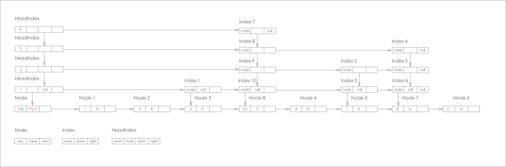
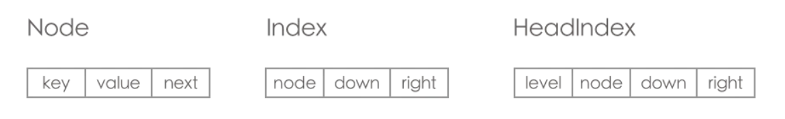
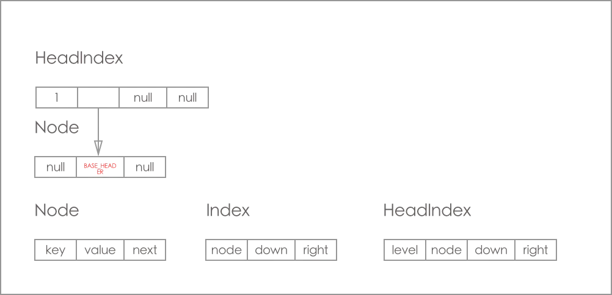
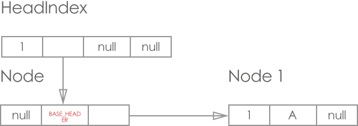
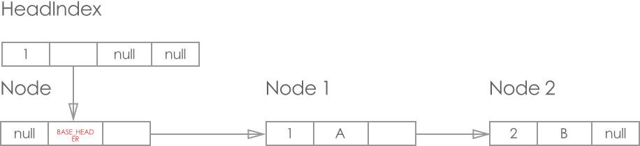
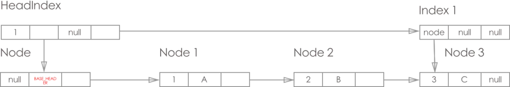

# ConcurrentSkipListMap


## 跳表详细讲解请看Redis的存储原理文章

这里只讲解根据跳表实现的ConcurrentSkipListMap


## ConcurrentSkipListMap 的结构

ConcurrentSkipListMap 的节点主要由 Node, Index, HeadIndex 构成;下面是一个典型的ConcurrentSkipListMap 的实例的结构图：


ConcurrentSkipListMap 的节点主要由 Node, Index, HeadIndex 构成，


下面是Node, Index, HeadIndex 的介绍

**普通结点Node**

```java
/**
* 最上层链表的头指针head
*/
private transient volatile HeadIndex<K, V> head;
/* ---------------- 普通结点Node定义 -------------- */
static final class Node<K, V> {
  final K key;
  volatile Object value;
  volatile Node<K, V> next;
  // ...
}
```

**索引结点Index**

```java
/* ---------------- 索引结点Index定义 -------------- */
static class Index<K, V> {
  final Node<K, V> node;      // node指向最底层链表的Node结点
  final Index<K, V> down;     // down指向下层Index结点
  volatile Index<K, V> right; // right指向右边的Index结点
  // ...
}
```

**头索引结点HeadIndex**

```java
/* ---------------- 头索引结点HeadIndex -------------- */
static final class HeadIndex<K, V> extends Index<K, V> {
  final int level;    // 层级
  // ...
}
```

**特点**

- ConcurrentSkipListMap 的节点主要由 Node, Index, HeadIndex 构成;

- ConcurrentSkipListMap 的数据结构横向纵向都是链表

- 最下面那层是Node层(数据节点)层, 上面几层都是Index(索引)层

- 从纵向链表来看, 最左边的是 HeadIndex 层, 右边的都是Index 层, 且每层的最底端都是对应Node, 纵向上的索引都是指向最底端的Node

## 新建时的初始状态

ConcurrentSkipListMap在初始时, 只存在 HeadIndex 和 Base_Header 节点，初始状态如下：



下面来看看 ConcurrentSkipListMap 的主要方法 doPut, doGet, doRemove方法的原理。

## doPut 流程

put方法主要经历了2个步骤：

1. 在底层查找合适的位置，插入该节点的Node实例。
2. 插入该节点的一个或者多个IndexNode节点（数量和层数有关）。

**第一步：查找合适的位置，插入该Node节点。具体如下：**

step1)查找前驱跳跃点b,并且获取b.next节点为 n。

step2)遍历查找合适的插入点，n 为null就创建节点，添加在前驱b的next节点，添加成功跳出第一步，失败重新进行step1

step3)n不为null，则n为其应该插入的节点。明确了位置之后，先要判断n是否还是b的next节点，防止被抢先在中间插入了，再判断n节点是否是有效节点，如n被逻辑删除了就回到step1后再重来。最后判断b节点是否被删除了。接下来，判断node的key的是否大小n节点的key，如果等于就替换掉该节点的value值（表示更新value），跳出第一步。如果大于意味着还要往n后找，最后找到了合适的插入点就尝试插入，如果失败重来step1，成功结束第一步。

完成第一步大部，仅仅是将节点插入了链表中，还需要完成跳表的IndexNode构成。


**第二步：构建跳跃表的结点，调整跳表。**

step1) 随机级别，偶数且大于0。

说明：node级别就意味着跳表的间隔，node级别越大，层次越高，高级别层次的结点越少，key间隔越大。级别越大，在查找的时候可以提升查找速度，从最大的级别开始，逐级定位结点。一个新加结点，首先要确定其属于几级，1级就不需要构建IndexNode，一系列判断出其所属级别后，就先构建down方向的一系列结点，再通过各层的头结点，将整个层的IndexNode的right方向结点联通。

step2)如果该级别的 level 是0(要知道获得0的概率是很大的)，不需要插入Index索引结点。插入的工作结束。

step2) 如果该级别的 level<= max（head的级别，当前的最大level），生成一系列的Index索引节点，并且通过down成员进行串接，所有级别Index索引结点（node为插入节点）构成down链，生成的Index索引节点从级别1开始。

step3)如果该级别的 level> max（head的级别，当前的最大level） (这个函数返回的最大值也就31, 也就是说, 最多有31层的索引)，则加大一个跳表级别，生成从1开始的所有级别Index索引结点（node为插入节点）构成down链。

step4)再次判断头结点级别，如果head级别比该级别高，证明head被其他线程抢先调整了，重来。没有抢先，重新构建head头结点的索引headIndex，node是头结点的node，补充缺失的级别就可以了。替换头结点HeadIndex成功跳出循环，失败重来。

上面都是构建down方向的结点，确保head的down方向包含了所有索引级别。后面的方法就是构建right方法的连接了。这里要注意，h变成了新的头结点，level却是旧的级别。

step5)h结点或h的right结点r为null，没必要进行，结束该环节

step6)r不为null，比较key和r的结点n的key，n结点被逻辑删除，就帮助其移除，移除后找下一个r结点。当前r结点要小于key，则key还在右边，继续找r。直到找到key应该在的位置，即r结点>=key，key的right就是r。

step7)不断降级，直到找到当前的插入级别，直到到指定级别，构建连接，连接失败重来，成功如果构建的结点被逻辑删除了，通过findNode方法，删除它。

## put 流程

**添加第1个节点**

添加 key=1, value = A 节点, 结果如图:



步骤如下：

1 doPut（）寻找前驱节点, 这时返回的 b = BaseHeader, n = null

2 doPut直接 CAS操作设置b 的next节点

3 这里假设获取的 level 是0(要知道获得0的概率是很大的, 这个函数返回的最大值也就31, 也就是说, 最多有31层的索引)

4 所以这时 index索引节点= null, 操作结束

**添加第2个节点**

再次添加 key=2, value = B 节点, 最终效果图如下:



**添加第3个节点**

这里为了理解上的便利, 我们再添加一个节点, 最终效果图如下:



步骤如下：

1 doPut（）寻找前驱节点, 这时返回的 b = node2, n = null

2 doPut直接 CAS操作设置b 的next节点为新的node3

3 这里假设获取的 level 是1, 则 level <= max(max = 1)成立, 初始化一个 index索引节点

4 最终找到要插入index位置, 然后进行down链接操作, 所以这时 index索引节点的down= null, 操作结束

这次增加了索引层 index 1

**put的源码**

```java
/**
 * Main insetion method. Adds element if not present, or
 * replaces value if present and onlyIfAbsent is false.
 *
 * @param key the key
 * @param value the values that must be associated with key
 * @param onlyIfAbstsent if should not insert if already present
 * @return the old value, or null if newly inserted
 */
private V doPut(K key, V value, boolean onlyIfAbstsent){
    Node<K, V> z; // adde node
    if(key == null){
        throw new NullPointerException();
    }
    Comparator<? super K> cmp = comparator;
    outer:
    for(;;){
        // 0.
        for(Node<K, V> b = findPredecessor(key, cmp), n = b.next;;){ // 1. 将 key 对应的前继节点找到, b 为前继节点, n是前继节点的next, 若没发生 条件竞争, 最终 key在 b 与 n 之间 (找到的b在 base_level 上)
            if(n != null){ // 2. n = null时 b 是链表的最后一个节点, key 直接插到 b 之后 (调用 b.casNext(n, z))
                Object v; int c;
                Node<K, V> f = n.next; // 3 获取 n 的右节点
                if(n != b.next){ // 4. 条件竞争(另外一个线程在b之后插入节点, 或直接删除节点n), 则 break 到位置 0, 重新
                    break ;
                }
                if((v = n.value) == null){ // 4. 若 节点n已经删除, 则 调用 helpDelete 进行帮助删除 (详情见 helpDelete), 则 break 到位置 0, 重新来
                    n.helpDelete(b, f);
                    break ;
                }

                if(b.value == null || v == n){ // 5. 节点b被删除中 ,则 break 到位置 0, 调用 findPredecessor 帮助删除 index 层的数据, 至于 node 层的数据 会通过 helpDelete 方法进行删除
                    break ;
                }
                if((c = cpr(cmp, key, n.key)) > 0){ // 6. 若 key 真的 > n.key (在调用 findPredecessor 时是成立的), 则进行 向后走
                    b = n;
                    n = f;
                    continue ;
                }
                if(c == 0){ // 7. 直接进行赋值
                    if(onlyIfAbstsent || n.casValue(v, value)){
                        V vv = (V) v;
                        return vv;
                    }
                    break ; // 8. cas 竞争条件失败 重来
                }
                // else c < 0; fall through
            }
            // 9. 到这边时 n.key > key > b.key
            z = new Node<K, V> (key, value, n);
            if(!b.casNext(n, z)){
                break ; // 10. cas竞争条件失败 重来
            }
            break outer; // 11. 注意 这里 break outer 后, 上面的 for循环不会再执行, 而后执行下面的代码, 这里是break 不是 continue outer, 这两者的效果是不一样的
        }
    }

    int rnd = KThreadLocalRandom.nextSecondarySeed();
    if((rnd & 0x80000001) == 0){ // 12. 判断是否需要添加level
        int level = 1, max;
        while(((rnd >>>= 1) & 1) != 0){
            ++level;
        }
        // 13. 上面这段代码是获取 level 的, 我们这里只需要知道获取 level 就可以 (50%的几率返回0，25%的几率返回1，12.5%的几率返回2...最大返回31。)
        Index<K, V> idx = null;
        HeadIndex<K, V> h = head;
        if(level <= (max = h.level)){ // 14. 初始化 max 的值, 若 level 小于 max , 则进入这段代码 (level 是 1-31 之间的随机数)
            for(int i = 1; i <= level; ++i){
                idx = new Index<K, V>(z, idx, null); // 15 添加 z 对应的 index 数据, 并将它们组成一个上下的链表(index层是上下左右都是链表)
            }
        }
        else{ // 16. 若 level > max 则只增加一层 index 索引层
            level = max + 1; // 17. 跳表新的 level 产生
            Index<K, V>[] idxs = (Index<K, V>[])new Index<?, ?>[level + 1];
            for(int i = 1; i <= level; ++i){
                idxs[i] = idx = new Index<K, V>(z, idx, null);
            }
            for(;;){
                h = head;
                int oldLevel = h.level; // 18. 获取老的 level 层
                if(level <= oldLevel){ // 19. 另外的线程进行了index 层增加操作, 所以 不需要增加 HeadIndex 层数
                    break;
                }
                HeadIndex<K, V> newh = h;
                Node<K, V> oldbase = h.node; // 20. 这里的 oldbase 就是BASE_HEADER
                for(int j = oldLevel+1; j <= level; ++j){ // 21. 这里其实就是增加一层的 HeadIndex (level = max + 1)
                    newh = new HeadIndex<K, V>(oldbase, newh, idxs[j], j); // 22. idxs[j] 就是上面的 idxs中的最高层的索引
                }
                if(casHead(h, newh)){ // 23. 这只新的 headIndex
                    h = newh;  // 24. 这里的 h 变成了 new HeadIndex
                    idx = idxs[level = oldLevel];  // 25. 这里的 idx 上从上往下第二层的 index 节点 level 也变成的 第二
                    break;
                }
            }
        }

        // find insertion points and splice in
        splice:
        for(int insertionLevel = level;;){ // 26. 这时的 level 已经是 第二高的 level(若上面 步骤19 条件竞争失败, 则多出的 index 层其实是无用的, 因为 那是 调用 Index.right 是找不到它的)
            int j = h.level;
            for(Index<K, V> q = h, r = q.right, t = idx;;){ // 27. 初始化对应的数据
                if(q == null || t == null){ // 28. 节点都被删除 直接 break出去
                    break splice;
                }
                if(r != null){
                    Node<K, V> n = r.node;
                    // compare before deletion check avoids needing recheck
                    int c = cpr(cmp, key, n.key);
                    if(n.value == null){ // 29. 老步骤, 帮助index 的删除
                        if(!q.unlink(r)){
                            break ;
                        }
                        r = q.right; // 30. 向右进行遍历
                        continue ;
                    }

                    if(c > 0){ // 31. 向右进行遍历
                        q = r;
                        r = r.right;
                        continue ;
                    }
                }

                // 32.
                // 代码运行到这里, 说明 key < n.key
                // 第一次运行到这边时, j 是最新的 HeadIndex 的level j > insertionLevel 非常用可能, 而下面又有 --j, 所以终会到 j == insertionLevel
                if(j == insertionLevel){
                    if(!q.link(r, t)){ // 33. 将 index t 加到 q 与 r 中间, 若条件竞争失败的话就重试
                        break ; // restrt
                    }
                    if(t.node.value == null){ // 34. 若这时 node 被删除, 则开始通过 findPredecessor 清理 index 层, findNode 清理 node 层, 之后直接 break 出去, doPut调用结束
                        findNode(key);
                        break splice;
                    }
                    if(--insertionLevel == 0){ // 35. index 层添加OK， --1 为下层插入 index 做准备
                        break splice;
                    }
                }

                /**
                 * 下面这行代码其实是最重要的, 理解这行代码, 那 doPut 就差不多了
                 * 1). --j 要知道 j 是 newhead 的level， 一开始一定 > insertionLevel的, 通过 --1 来为下层操作做准备 (j 是 headIndex 的level)
                 * 2). 通过 19. 21, 22 步骤, 个人认为 --j >= insertionLevel 是横成立, 而 --j 是必须要做的
                 * 3) j 经过几次--1， 当出现 j < level 时说明 (j+1) 层的 index已经添加成功, 所以处理下层的 index
                 */
                if(--j >= insertionLevel && j < level){
                    t = t.down;
                }
                /** 到这里时, 其实有两种情况
                 *  1) 还没有一次index 层的数据插入
                 *  2) 已经进行 index 层的数据插入, 现在为下一层的插入做准备
                 */
                q = q.down; // 从 index 层向下进行查找
                r = q.right;

            }
        }
    }
    return null;
}
```

1. 找到key的前继节点b，n指向b的后继节点
2. 重新获取b的后继节点，如果不是n，则证明其他线程修改了，需要重新找前继节点和后继节点
3. 如果b的后继节点就是n，那么获取n节点的value，如果value是null，说明这个节点已经被删除了，再次重新找前继节点和后继节点。
4. 如果b被删除了，则重新找前继节点和后继节点。
5. 如果都没有上面的问题，则新建节点，将新节点插入跳表中，过程中用到了casNext函数，函数的解释是：compareAndSet next field，内部使用了sun.misc.Unsafe的compareAndSwapObject方法，是进行原子操作的，具体的解释请看这里
6. 插入节点（insertIndex）的过程，首先要用随机算法产生一个最高level，如果这个最高level小于等于现在已有的最高level，那么就对从1到最高level都增加addIndex，否则，要先创建level，然后再执行addIndex。
7. addIndex是指插入节点，首先会从头节点开始，一层一层往下遍历，如果当前层等于要插入节点的最高层，则需要执行link操作，link也是原子操作，将该节点插入本层合适的位置。在这个过程中，我们都解决的是每一层的right指针指到哪个节点的问题，那么down指针呢？是不是太迷茫了，down指针其实在创建之初就指向了下一个节点。

## findPredecessor() 寻找前继节点

总体思路是: 从矩形链表的左上角的 HeadIndex 索引开始, 先向右, 遇到 null, 或 > key 时向下, 重复向右向下找, 一直找到 对应的前继节点(前继节点就是小于 key 的最大节点)

```java
/**
 * Returns a base-level node with key strictly less than given key,
 * or the base-level header if there is no such node. Also
 * unlinks indexes to deleted nodes found along the way. Callers
 * rely on this side-effect of clearing indices to deleted nodes
 * @param key the key
 * @return a predecessor of the key
 */
private Node<K, V> findPredecessor(Object key, Comparator<? super K> cmp){
    if(key == null)
        throw new NullPointerException(); // don't postpone errors
    for(;;){
        for(Index<K, V> q = head, r = q.right, d;;){ // 1. 初始化数据 q 是head， r 是 最顶层 h 的右Index节点
            if(r != null){ // 2. 对应的 r =  null, 则进行向下查找
                Node<K, V> n = r.node;
                K k = n.key;
                if(n.value == null){ // 3. n.value = null 说明 节点n 正在删除的过程中
                    if(!q.unlink(r)){ // 4. 在 index 层直接删除 r 节点, 若条件竞争发生直接进行break 到步骤1 , 重新从 head 节点开始查找
                        break; // restart
                    }
                    r = q.right; //reread r // 5. 删除 节点r 成功, 获取新的 r 节点, 回到步骤 2 (还是从这层索引开始向右遍历, 直到 r == null)
                    continue;
                }

                if(cpr(cmp, key, k) > 0){ // 6. 若 r.node.key < 参数key, 则继续向右遍历, continue 到 步骤 2处, 若 r.node.key >  参数key 直接跳到 步骤 7
                    q = r;
                    r = r.right;
                    continue;
                }
            }

            if((d = q.down) == null){ // 7. 到这边时, 已经到跳表的数据层, q.node < key < r的 或q.node < key 且 r == null; 所以直接返回 q.node
                return q.node;
            }

            q = d; // 8 未到数据层, 进行重新赋值向下走 (为什么向下走呢? 回过头看看 跳表, 原来 上层的index 一般都是比下层的 index 个数少的)
            r = d.right;
        }
    }
}
```

## doGet() 获取节点对应的值

整个过程：

1. 寻找 key 的前继节点 b (这时b.next = null || b.next > key, 则说明不存key对应的 Node)
2. 接着就判断 b, b.next 与 key之间的关系(其中有些 helpDelete操作)

```java
/**
 * Gets value for key. Almost the same as findNode, but returns
 * the found value (to avoid retires during ret-reads)
 *
 *  这个 doGet 方法比较简单
 * @param key the key
 * @return the value, or null if absent
 */
private V doGet(Object key){
    if(key == null){
        throw new NullPointerException();
    }
    Comparator<? super K> cmp = comparator;
    outer:
    for(;;){
        for(Node<K, V> b = findPredecessor(key, cmp), n = b.next;;){ // 1. 获取 key 的前继节点 b, 其实这时 n.key >= key
            Object v; int c;
            if(n == null){ // 2. n == null 说明 key 对应的 node 不存在 所以直接 return null
                break outer;
            }
            Node<K, V> f = n.next;
            if(n != b.next){ // 3. 有另外的线程修改数据, 重新来
                break ;
            }
            if((v = n.value) == null){ // 4. n 是被删除了的节点, 进行helpDelete 后重新再来
                n.helpDelete(b, f);
                break ;
            }
            if(b.value == null || v == n){ // 5. b已经是删除了的节点, 则 break 后再来
                break ;
            }
            if((c = cpr(cmp, key, n.key)) == 0){ // 6. 若 n.key = key 直接返回结果, 这里返回的结果有可能是 null
                V vv = (V) v;
                return vv;
            }
            if(c < 0){ // 7. c < 0说明不存在 key 的node 节点
                break outer;
            }
            // 8. 运行到这一步时, 其实是 在调用 findPredecessor 后又有节点添加到 节点b的后面所致
            b = n;
            n = f;
        }
    }

    return null;
}
```

## doRemove() 删除节点

整个删除个 ConcurrentSkipListMap 里面 nonBlockingLinkedList 实现的一大亮点, 为什么呢? 因为这个 nonBlockingLinkedList 同时支持并发安全的从链表中间添加/删除操作, 而 ConcurrentLinkedQueue 只支持并发安全的从链表中间删除;
删除操作:

1. 寻找对应的节点
2. 给节点的 value 至 null, node.value = null
3. 将 node 有增加一个标记节点 (this.value = this 还记得哇, 不记得的直接看 node 类)
4. 通过 CAS 直接将 K对应的Node和标记节点一同删除

```java
/**
 * Main deletion method. Locates node, nulls value, appends a
 * deletion marker, unlinks predecessor, removes associated index
 * nodes, and possibly reduces head index level
 *
 * Index nodes are cleared out simply by calling findPredecessor.
 * which unlinks indexes to deleted nodes found along path to key,
 * which will include the indexes to this node. This is node
 * unconditionally. We can't check beforehand whether there are
 * indexes hadn't been inserted yet for this node during initial
 * search for it, and we'd like to ensure lack of garbage
 * retention, so must call to be sure
 *
 * @param key the key
 * @param value if non-null, the value that must be
 *              associated with key
 * @return the node, or null if not found
 */
final V doRemove(Object key, Object value){
    if(key == null){
        throw new NullPointerException();
    }
    Comparator<? super K> cmp = comparator;
    outer:
    for(;;){
        for(Node<K, V> b = findPredecessor(key, cmp), n = b.next;;){ // 1. 获取对应的前继节点 b
            Object v; int c;
            if(n == null){ // 2. 节点 n 被删除 直接 return null 返回 , 因为理论上 b.key < key < n.key
                break outer;
            }
            Node<K, V> f = n.next;
            if(n != b.next){ // 3. 有其他线程在 节点b 后增加数据, 重来
                break ;
            }
            if((v = n.value) == null){ // 4. 节点 n 被删除, 调用 helpDelete 后重来
                n.helpDelete(b, f);
                break ;
            }

            if(b.value == null || v == n){ // 5. 节点 b 删除, 重来 调用findPredecessor时会对 b节点对应的index进行清除, 而b借点吧本身会通过 helpDelete 来删除
                break ;
            }
            if((c = cpr(cmp, key, n.key)) < 0){ // 6. 若n.key < key 则说明 key 对应的节点就不存在, 所以直接 return
                break outer;
            }

            if(c > 0){ // 7. c>0 出现在 有其他线程在本方法调用findPredecessor后又在b 后增加节点, 所以向后遍历
                b = n;
                n = f;
                continue ;
            }

            if(value != null && !value.equals(v)){ // 8. 若 前面的条件为真, 则不进行删除 (调用 doRemove 时指定一定要满足 key value 都相同, 具体看 remove 方法)
                break outer;
            }
            if(!n.casValue(v, null)){ // 9. 进行数据的删除
                break ;
            }
            if(!n.appendMarker(f) || !b.casNext(n, f)){ // 10. 进行 marker 节点的追加, 这里的第二个 cas 不一定会成功, 但没关系的 (第二个 cas 是删除 n节点, 不成功会有  helpDelete 进行删除)
                findNode(key);  // 11. 对 key 对应的index 进行删除
            }
            else{
                findPredecessor(key, cmp); //12. 对 key 对应的index 进行删除 10进行操作失败后通过 findPredecessor 进行index 的删除
                if(head.right == null){
                    tryReduceLevel(); // 13. 进行headIndex 对应的index 层的删除
                }
            }
            V vv = (V) v;
            return vv;
        }
    }
    return null;
}
```

## 无锁编程（lock free）

常见的无锁编程（lock free）一般是基于CAS(Compare And Swap)+volatile 结合实现：（1）CAS保障操作的原子性，volatile 保障内存的可见性和代码执行的有序性。

**优点：**
1、开销较小：不需要进入内核，不需要切换线程；

2、没有死锁：总线锁最长持续为一次read+write的时间；

3、只有写操作需要使用CAS，读操作与串行代码完全相同，可实现读写不互斥。

**缺点：**
1、编程非常复杂，两行代码之间可能发生任何事，很多常识性的假设都不成立。

2、CAS模型覆盖的情况非常少，无法用CAS实现原子的复数操作。

## 无锁编程Key-Value结构的对比

目前常用的key-value数据结构有三种：Hash表、红黑树、SkipList，它们各自有着不同的优缺点（不考虑删除操作）：

- Hash表：插入、查找最快，为O(1)；如使用链表实现则可实现无锁；数据有序化需要显式的排序操作。

- 红黑树：插入、查找为O(logn)，但常数项较小；无锁实现的复杂性很高，一般需要加锁；数据天然有序。

- SkipList：插入、查找为O(logn)，但常数项比红黑树要大；底层结构为链表，可无锁实现；数据天然有序。


如果要实现一个key-value结构，需求的功能有插入、查找、迭代、修改，那么首先Hash表就不是很适合了，因为迭代的时间复杂度比较高；而红黑树的插入很可能会涉及多个结点的旋转、变色操作，因此需要在外层加锁，这无形中降低了它可能的并发度。而SkipList底层是用链表实现的，可以实现为lock free，同时它还有着不错的性能（单线程下只比红黑树略慢），非常适合用来实现我们需求的那种key-value结构。

所以，LevelDB、Redis的底层存储结构就是用的SkipList。

## ConcurrentSkipListMap与ConcurrentHashMap对比

在4线程1.6万数据的条件下，[ConcurrentHashMap](https://so.csdn.net/so/search?q=ConcurrentHashMap&spm=1001.2101.3001.7020) 存取速度是ConcurrentSkipListMap 的4倍左右。

但ConcurrentSkipListMap有几个ConcurrentHashMap 不能比拟的优点：

1、ConcurrentSkipListMap 的key是有序的。

2、ConcurrentSkipListMap 支持更高的并发。

ConcurrentSkipListMap 的存取时间是log（N），和线程数几乎无关。也就是说在数据量一定的情况下，并发的线程越多，ConcurrentSkipListMap越能体现出他的优势