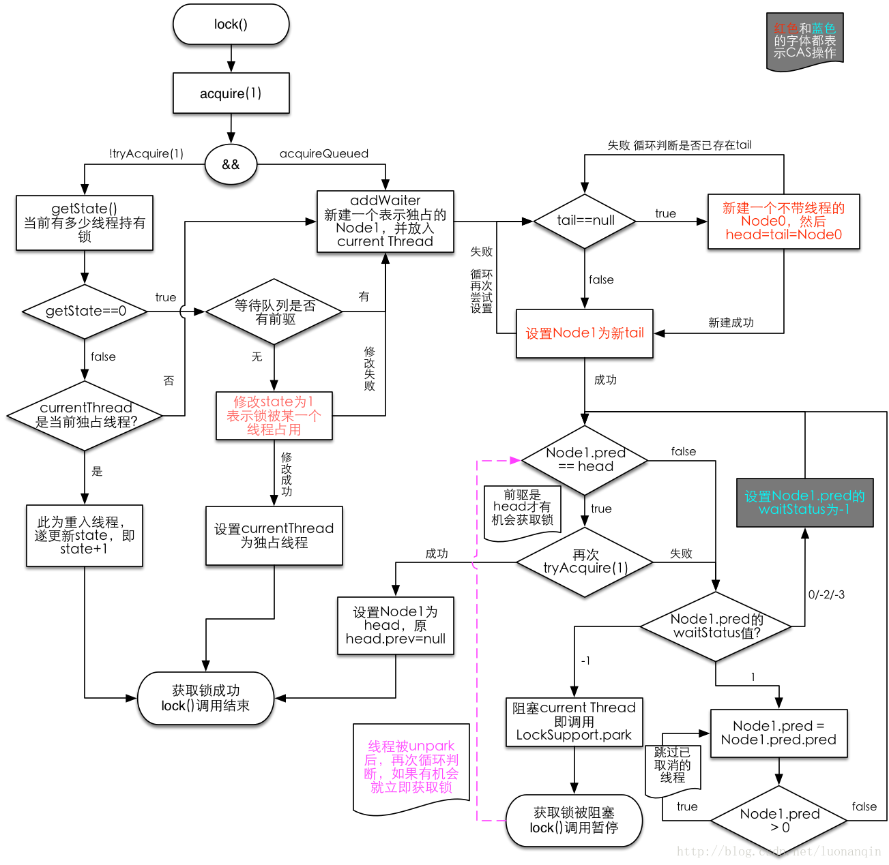
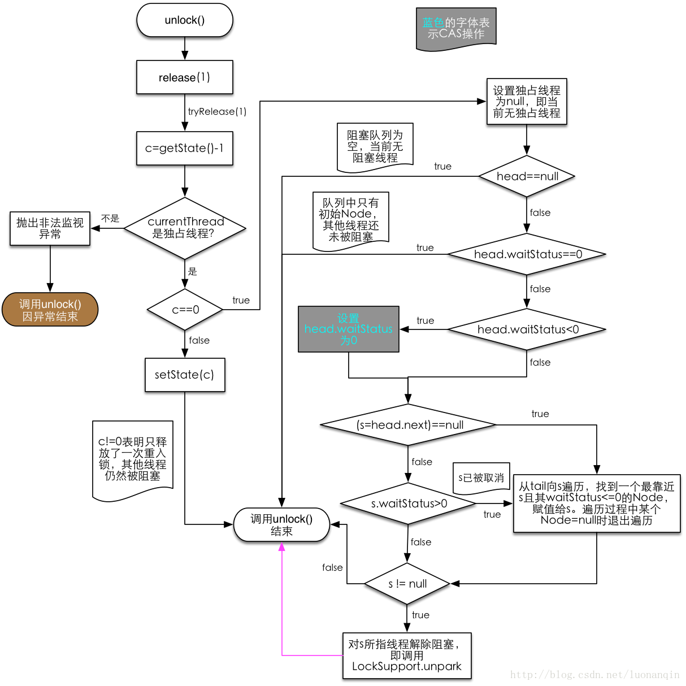
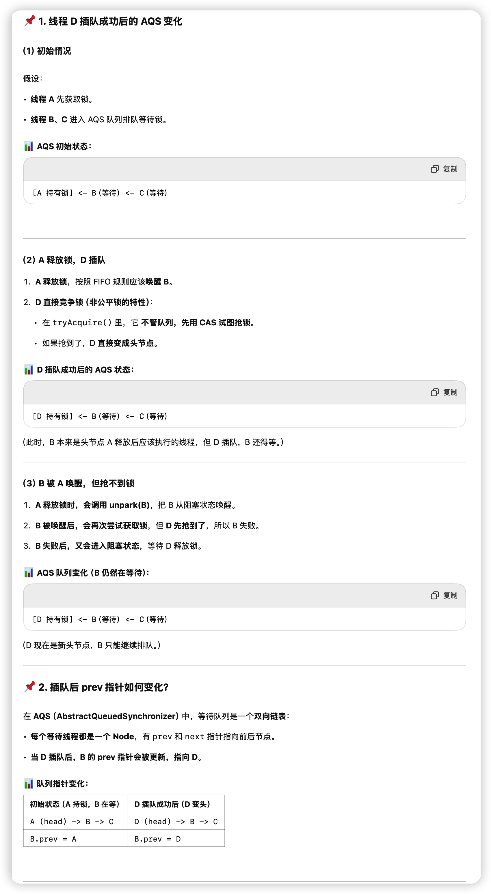

# ReentrantLock

| **特性**       | **synchronized**            | **ReentrantLock**                      |
| -------------- | --------------------------- | -------------------------------------- |
| 加锁方式       | 隐式（进入同步块）          | 显式（调用 lock()）                    |
| 解锁方式       | 隐式（退出同步块）          | 显式（调用 unlock()）必须在 finally 中 |
| 可中断         | ❌ 不可中断                  | ✅ lockInterruptibly() 可响应中断       |
| 是否可尝试获取 | ❌ 不可尝试                  | ✅ tryLock()                            |
| 公平性         | ❌ 非公平                    | ✅ 支持公平锁                           |
| 条件变量       | ❌ 只有一个 wait/notify 集合 | ✅ 支持多个 Condition                   |
| 可重入性       | ✅                           | ✅                                      |
| 性能           | JDK1.6后性能差距小          | 可微调特性，适用于复杂场景             |

## 和synchronized的区别


## 概述

> **ReentrantLock**是一个**可重入的互斥锁**，也被称为**“独占锁”**。在上一篇讲解AQS的时候已经提到，“独占锁”在同一个时间点只能被一个线程持有；而可重入的意思是，ReentrantLock可以被单个线程多次获取。
>  ReentrantLock又分为**“公平锁(fair lock)”和“非公平锁(non-fair lock)”**。它们的区别体现在获取锁的机制上：在“公平锁”的机制下，线程依次排队获取锁；而“非公平锁”机制下，如果锁是可获取状态，不管自己是不是在队列的head节点都会去尝试获取锁。

## 数据结构和核心参数


​																								ReetrantLock继承关系

可以看到ReetrantLock继承自AQS，并实现了Lock接口。`Lock`源码如下：

```java
public interface Lock {
    //获取锁，如果锁不可用则线程一直等待
    void lock();
    //获取锁，响应中断，如果锁不可用则线程一直等待
    void lockInterruptibly() throws InterruptedException;
    //获取锁，获取失败直接返回
    boolean tryLock();
    //获取锁，等待给定时间后如果获取失败直接返回
    boolean tryLock(long time, TimeUnit unit) throws InterruptedException;
    //释放锁
    void unlock();
    //创建一个新的等待条件
    Condition newCondition();
}
```

在`Lock`提供的获取锁方法中，有`lock()`、`lockInterruptibly()`、`tryLock()`和`tryLock(long time, TimeUnit unit)`四种方式，他们的区别如下：

- `lock()` 获取失败后，线程进入等待队列自旋或休眠，直到锁可用，并且忽略中断的影响
- `lockInterruptibly()`  线程进入等待队列park后，如果线程被中断，则直接响应中断（抛出`InterruptedException`）
- `tryLock()` 获取锁失败后直接返回，不进入等待队列
- `tryLock(long time, TimeUnit unit)` 获取锁失败等待给定的时间后返回获取结果

ReetrantLock通过AQS实现了自己的同步器`Sync`，分为公平锁`FairSync`和非公平锁`NonfairSync`。在构造时，通过所传参数`boolean fair`来确定使用那种类型的锁。

本篇会以对比的方式分析两种锁的源码实现方式。

## 源码解析

### lock()

`lock()`方法用于获取锁，两种类型的锁源码实现如下：

```java
//获取锁，一直等待锁可用
public void lock() {
    sync.lock();
}

//公平锁尝试获取锁
final void lock() {
    //直接去排队
    acquire(1);//通过cas算法尝试将自己加入队列尾部
}

//非公平锁尝试获取锁
final void lock() {
    if (compareAndSetState(0, 1))//通过cas算法尝试获取锁
        //获取成功，将持有锁的线程修改为本线程
        setExclusiveOwnerThread(Thread.currentThread());
    else
        //去排队
        acquire(1);
}
```

**说明：**公平锁的`lock`方法调用了AQS的`acquire(1)`；而非公平锁则直接通过CAS修改`state`值来获取锁，当获取失败时才会调用`acquire(1)`来获取锁。
 关于`acquire()`方法，在上篇介绍AQS的时候已经讲过，印象不深的同学可以翻回去看一下，这里主要来看一下`tryAcquire`在ReetrantLock中的实现。

**公平锁tryAcquire：**

```java
//自旋尝试获取锁
protected final boolean tryAcquire(int acquires) {
    final Thread current = Thread.currentThread();
    int c = getState();//获取锁状态state
    if (c == 0) {
        if (!hasQueuedPredecessors() && //判断当前线程是否还有前节点
            compareAndSetState(0, acquires)) {//CAS修改state
            //获取锁成功，设置锁的持有线程为当前线程
            setExclusiveOwnerThread(current);
            return true;
        }
    }
    else if (current == getExclusiveOwnerThread()) {//当前线程已经持有锁
        int nextc = c + acquires;//重入
        if (nextc < 0)
            throw new Error("Maximum lock count exceeded");
        setState(nextc);//更新state状态
        return true;
    }
    return false;
}
```

**说明：**公平锁模式下的`tryAcquire`，执行流程如下：

1. 如果当前锁状态`state`为0，说明锁处于闲置状态可以被获取，首先调用`hasQueuedPredecessors`方法判断当前线程是否还有前节点(prev node)在等待获取锁。如果有，则直接返回false；如果没有，通过调用`compareAndSetState`（CAS）修改state值来标记自己已经拿到锁，CAS执行成功后调用`setExclusiveOwnerThread`设置锁的持有者为当前线程。程序执行到现在说明锁获取成功，返回true；
2. 如果当前锁状态`state`不为0，但当前线程已经持有锁（`current == getExclusiveOwnerThread()`），由于锁是可重入（多次获取）的，则更新重入后的锁状态`state += acquires` 。锁获取成功返回true。

**非公平锁tryAcquire**

```java
//自旋尝试获取锁
protected final boolean tryAcquire(int acquires) {
    return nonfairTryAcquire(acquires);
}
final boolean nonfairTryAcquire(int acquires) {
    final Thread current = Thread.currentThread();
    int c = getState();
    if (c == 0) {
        if (compareAndSetState(0, acquires)) {//CAS修改state
            setExclusiveOwnerThread(current);
            return true;
        }
    }
    else if (current == getExclusiveOwnerThread()) {
        int nextc = c + acquires;//计算重入后的state
        if (nextc < 0) // overflow
            throw new Error("Maximum lock count exceeded");
        setState(nextc);
        return true;
    }
    return false;
}
```

**说明：**通过对比公平锁和非公平锁`tryAcquire`的代码可以看到，非公平锁的获取略去了`!hasQueuedPredecessors()`这一操作，也就是说它不会判断当前线程是否还有前节点(prev node)在等待获取锁，而是直接去进行锁获取操作。

### unlock()

```java
//释放锁
public void unlock() {
    sync.release(1);
}
```

**说明：**关于`release()`方法，在上篇介绍AQS的时候已经讲过，印象不深的同学可以翻回去看一下，这里主要来看一下`tryRelease`在ReetrantLock中的实现：

```java
protected final boolean tryRelease(int releases) {
    int c = getState() - releases;//计算释放后的state值
    if (Thread.currentThread() != getExclusiveOwnerThread())
        throw new IllegalMonitorStateException();
    boolean free = false;
    if (c == 0) {
        free = true;//锁全部释放，可以唤醒下一个等待线程
        setExclusiveOwnerThread(null);//设置锁持有线程为null
    }
    setState(c);
    return free;
}
```

**说明：**`tryRelease`用于释放给定量的资源。在ReetrantLock中每次释放量为1，也就是说，**在可重入锁中，获取锁的次数必须要等于释放锁的次数，这样才算是真正释放了锁。**在锁全部释放后（`state==0`）才可以唤醒下一个等待线程。

### 等待条件Condition

> 在上篇介绍AQS中提到过，在AQS中不光有等待队列，还有一个条件队列，这个条件队列就是我们接下来要讲的Condition。
>  Condition的作用是对锁进行更精确的控制。Condition中的`await()、signal()、signalAll()`方法相当于Object的`wait()、notify()、notifyAll()`方法。不同的是，Object中的`wait()、notify()、notifyAll()`方法是和"同步锁"(`synchronized`关键字)捆绑使用的；而Condition是需要与`Lock`捆绑使用的。

**Condition函数列表**

```java
//使当前线程在被唤醒或被中断之前一直处于等待状态。
void await()

//使当前线程在被唤醒、被中断或到达指定等待时间之前一直处于等待状态。
boolean await(long time, TimeUnit unit)

//使当前线程在被唤醒、被中断或到达指定等待时间之前一直处于等待状态。
long awaitNanos(long nanosTimeout)

//使当前线程在被唤醒之前一直处于等待状态。
void awaitUninterruptibly()

//使当前线程在被唤醒、被中断或到达指定最后期限之前一直处于等待状态。
boolean awaitUntil(Date deadline)

//唤醒一个等待线程。
void signal()

//唤醒所有等待线程。
void signalAll()
```

**下面我们来看一下Condition在AQS中的实现**

#### await()

```java
//使当前线程在被唤醒或被中断之前一直处于等待状态。
public final void await() throws InterruptedException {
    if (Thread.interrupted())
        throw new InterruptedException();
    Node node = addConditionWaiter();//添加并返回一个新的条件节点
    int savedState = fullyRelease(node);//释放全部资源
    int interruptMode = 0;
    while (!isOnSyncQueue(node)) {
        //当前线程不在等待队列，park阻塞
        LockSupport.park(this);
        if ((interruptMode = checkInterruptWhileWaiting(node)) != 0)
            //线程被中断，跳出循环
            break;
    }
    if (acquireQueued(node, savedState) && interruptMode != THROW_IE)
        interruptMode = REINTERRUPT;
    if (node.nextWaiter != null) // clean up if cancelled
        unlinkCancelledWaiters();//解除条件队列中已经取消的等待节点的链接
    if (interruptMode != 0)
        reportInterruptAfterWait(interruptMode);//等待结束后处理中断
}
```

**说明：** `await()`方法相当于Object的`wait()`。把当前线程添加到条件队列中调用`LockSupport.park()`阻塞，直到被唤醒或中断。函数流程如下：

1. 首先判断线程是否被中断，如果是，直接抛出`InterruptedException`，否则进入下一步；
2. 添加当前线程到条件队列中，然后释放全部资源/锁;
3. 如果当前节点不在等待队列中，调用`LockSupport.park()`阻塞当前线程，直到被`unpark`或被中断。这里先简单说一下`signal`方法，在线程接收到signal信号后，unpark当前线程，并把当前线程转移到等待队列中（sync queue）。所以，在当前方法中，如果线程被解除阻塞（unpark），也就是说当前线程被转移到等待队列中，就会跳出`while`循环，进入下一步；
4. 线程进入等待队列后，调用`acquireQueued`方法获取锁；
5. 调用`unlinkCancelledWaiters`方法检查条件队列中已经取消的节点，并解除它们的链接（这些取消的节点在随后的垃圾收集中被回收掉）；
6. 逻辑处理结束，最后处理中断（抛出`InterruptedException`或把忽略的中断补上）。

### signal()

```java
//唤醒线程
public final void signal() {
    if (!isHeldExclusively())
        throw new IllegalMonitorStateException();
    Node first = firstWaiter;
    if (first != null)
        doSignal(first);//唤醒条件队列的首节点线程
}

//从条件队列中移除给定节点，并把它转移到等待队列
private void doSignal(Node first) {
    do {
        if ( (firstWaiter = first.nextWaiter) == null)
            lastWaiter = null;
        first.nextWaiter = null; //解除首节点链接
    } while (!transferForSignal(first) && //接收到signal信号后，把节点转入等待队列
             (first = firstWaiter) != null);
}

//接收到signal信号后，把节点转入等待队列
final boolean transferForSignal(Node node) {
    /*
     * If cannot change waitStatus, the node has been cancelled.
     */
    if (!compareAndSetWaitStatus(node, Node.CONDITION, 0))
        //CAS修改状态失败，说明节点被取消，直接返回false
        return false;

    Node p = enq(node);//添加节点到等待队列，并返回节点的前继节点(prev)
    int ws = p.waitStatus;
    if (ws > 0 || !compareAndSetWaitStatus(p, ws, Node.SIGNAL))
        //如果前节点被取消，说明当前为最后一个等待线程，unpark唤醒当前线程
        LockSupport.unpark(node.thread);
    return true;
}
```

**说明：**`signal`方法用于发送唤醒信号。在不考虑线程争用的情况下，执行流程如下：

1. 获取条件队列的首节点，解除首节点的链接（`first.nextWaiter = null;`）；
2. 调用`transferForSignal`把条件队列的首节点转移到等待队列的尾部。在`transferForSignal`中，转移节点后，转移的节点没有前继节点，说明当前最后一个等待线程，直接调用`unpark()`唤醒当前线程。

Condition的其他例如`awaitNanos(long nanosTimeout)、signalAll()`等方法这里这里就不多赘述了，执行流程都差不多，同学们可以参考上述分析阅读。

## 实际使用

```Java
public class ReentrantLockCondition implements Runnable {

	public static ReentrantLock lock = new ReentrantLock();
	public static Condition condition = lock.newCondition();
 
    @Override
    public void run() {
        try {
            lock.lock();
            System.out.println("Thread is waiting! : " + System.currentTimeMillis());
            condition.await();
            System.out.println("Thread is going on! : " + System.currentTimeMillis());
        } catch (InterruptedException e) {
            e.printStackTrace();
        } finally {
            lock.unlock();
        }
    }
    
		//测试
		public static void main(String[] args) throws InterruptedException {
        ReentrantLockCondition reen = new ReentrantLockCondition();
        Thread thread = new Thread(reen);
        thread.start();
        Thread.sleep(3000);
        //通知线程reen继续执行
        lock.lock();
        condition.signal();
        lock.unlock();
    }
}

//结果
//Thread is waiting! : 1537841252752
//Thread is going on! : 1537841255753
```

在代码的第4行，通过lock生成一个与之绑定的Confition对象，并在代码的第11行，要求线程在Condition对象上进行等待。代码的第27行，由main线程发出通知，告知等待Condition上的线程可以继续执行了；由输出结果来看，线程等待了3S后，继续执行了，符合我们预期。

和Object.wait()和notify()方法一样，当线程使用Condition.await()时，要求线程持有相关的重入锁，在Condition.await()调用后，这个线程会释放这把锁；同理，在Condition.signal()方法调用时，也要求线程获得相应的锁。在signal()方法调用后，系统会从当前Condition对象的等待队列中，唤醒一个线程。一旦线程被唤醒，它会重新尝试获得与之绑定的重入锁，一旦获取成功，就可以继续执行了。因此在signal()方法调用后，一般需要释放相关的锁，如果省略掉代码的第28行，那么虽然唤醒了线程reen，但是由于线程无法重新获得锁，因而也就无法继续执行。

Condition具有比wait()/notify()更好的灵活性，具体体现在：

- 一个锁实例，可以绑定多个Condition实例，实现多路通知；
- notify()方法进行通知时，是随机进行选择的，但重入锁结合Condition对象，可以实现有选择性的通知，这是非常重要的。

## synchronized和ReentrantLock有什么区别


## synchronized和ReentrantLock的选择

> ReentrantLock在加锁和内存上提供的语义与内置锁synchronized相同，此外它还提供了一些其他功能，包括**定时的锁等待、可中断的锁等待、公平性，以及实现非块结构的加锁**。**从性能方面来说，在JDK5的早期版本中，ReentrantLock的性能远远好于synchronized，但是从JDK6开始，JDK在synchronized上做了大量优化，使得两者的性能差距不大。**synchronized的优点就是简洁。 所以说，两者之间的选择还是要看具体的需求，ReentrantLock可以作为一种高级工具，当需要一些高级功能时可以使用它。



如图所示，彩色的字都是一个CAS操作，其中三个红色CAS都对成功和失败有相应地处理，为什么另外一个蓝色CAS不关心设置是否成功呢？下面这段代码里我给出了解释：

```sql
// AbstractQueuedSynchronizer.class
 
private static boolean shouldParkAfterFailedAcquire(Node pred, Node node) {
    int ws = pred.waitStatus;
    if (ws == Node.SIGNAL)
        /*
         * This node has already set status asking a release
         * to signal it, so it can safely park.
         */
        return true;
    if (ws > 0) {
        /*
         * Predecessor was cancelled. Skip over predecessors and
         * indicate retry.
         */
        do {
            node.prev = pred = pred.prev;
        } while (pred.waitStatus > 0);
        pred.next = node;
    } else {
        /*
         * waitStatus must be 0 or PROPAGATE.  Indicate that we
         * need a signal, but don't park yet.  Caller will need to
         * retry to make sure it cannot acquire before parking.
         */
        /*
         * 为什么不关心是否成功却还要设置呢？
         *
         * 如果设置失败，表示前驱已经被signal了。如果前驱是head，说明有机会获取锁，所以返回false后还可以再次tryAcquire
         *
         * 如果设置成功，表示前驱等待signal。如果再次确认pred.waitStatus仍然是Node.SIGNAL，则表明前驱等待释放锁的情况下必须阻塞当前线程
         * 所以返回true后即被park
         */
        compareAndSetWaitStatus(pred, ws, Node.SIGNAL);
    }
    return false;
}
```



如图所示，这里的粉红色折线与lock流程图里的粉红色虚折线对应，即线程A调用lock阻塞与线程B调用unlock解除线程A的阻塞。同时可以看到unlock只有一个CAS操作，但是也不用关心设置是否成功。我给这段代码做了下面解释：

```java
// AbstractQueuedSynchronizer.class
 
private void unparkSuccessor(Node node) {
    /*
     * If status is negative (i.e., possibly needing signal) try
     * to clear in anticipation of signalling.  It is OK if this
     * fails or if status is changed by waiting thread.
     */
    int ws = node.waitStatus;
	/*
	 * 为什么不关心是否成功却还要设置呢？
	 *
	 * 注意这里的Node实际就是head
	 * 
	 * 如果设置成功，即head.waitStatus=0，则可以让这时即将被阻塞的线程有机会再次调用tryAcquire获取锁。
	 * 也就是让shouldParkAfterFailedAcquire方法里的compareAndSetWaitStatus(pred, ws, Node.SIGNAL)执行失败返回false，这样就能再有机会再tryAcquire了
	 *
	 * 如果设置失败，新跟随在head后面的线程被阻塞，但是没关系，下面的代码会立即将这个阻塞线程释放掉
	 */
    if (ws < 0)
        compareAndSetWaitStatus(node, ws, 0);
 
    /*
     * Thread to unpark is held in successor, which is normally
     * just the next node.  But if cancelled or apparently null,
     * traverse backwards from tail to find the actual
     * non-cancelled successor.
     */
    Node s = node.next;
    if (s == null || s.waitStatus > 0) {
        s = null;
        for (Node t = tail; t != null && t != node; t = t.prev)
            if (t.waitStatus <= 0)
                s = t;
    }
    if (s != null)
        LockSupport.unpark(s.thread);
}
```

## 非公平锁线程插队



## 三个线程轮流执行

```java
import java.util.concurrent.locks.Condition;
import java.util.concurrent.locks.Lock;
import java.util.concurrent.locks.ReentrantLock;

public class ThreeThreadsSequence {

    private final Lock lock = new ReentrantLock();
    private final Condition c1 = lock.newCondition();
    private final Condition c2 = lock.newCondition();
    private final Condition c3 = lock.newCondition();

    private int state = 1; // 1表示线程1，2表示线程2，3表示线程3

    public void print(int threadId, Condition current, Condition next, String value, int loop) {
        for (int i = 0; i < loop; i++) {
            lock.lock();
            try {
                // 等待轮到自己
                while (state != threadId) {
                    current.await();
                }
                System.out.print(value);
                // 修改状态为下一个线程的 id
                state = threadId % 3 + 1;
                next.signal(); // 唤醒下一个线程
            } catch (InterruptedException e) {
                Thread.currentThread().interrupt();
            } finally {
                lock.unlock();
            }
        }
    }

    public static void main(String[] args) {
        ThreeThreadsSequence sequence = new ThreeThreadsSequence();
        int loop = 5; // 每个线程打印5次

        new Thread(() -> sequence.print(1, sequence.c1, sequence.c2, "A", loop)).start();
        new Thread(() -> sequence.print(2, sequence.c2, sequence.c3, "B", loop)).start();
        new Thread(() -> sequence.print(3, sequence.c3, sequence.c1, "C", loop)).start();
    }
}
```

```java
import java.util.concurrent.locks.Condition;
import java.util.concurrent.locks.Lock;
import java.util.concurrent.locks.ReentrantLock;

public class ThreeThreadsSequence {

    private final Lock lock = new ReentrantLock();
    private final Condition c1 = lock.newCondition();
    private final Condition c2 = lock.newCondition();
    private final Condition c3 = lock.newCondition();

    private int state = 1; // 1表示线程1，2表示线程2，3表示线程3

    public void print(int threadId, Condition current, Condition next, String value, int loop) {
        for (int i = 0; i < loop; i++) {
            lock.lock();
            try {
                // 等待轮到自己
                while (state != threadId) {
                    current.await();
                }
                System.out.print(value);
                // 修改状态为下一个线程的 id
                state = threadId % 3 + 1;
                next.signal(); // 唤醒下一个线程
            } catch (InterruptedException e) {
                Thread.currentThread().interrupt();
            } finally {
                lock.unlock();
            }
        }
    }

    public static void main(String[] args) {
        ThreeThreadsSequence sequence = new ThreeThreadsSequence();
        int loop = 5; // 每个线程打印5次

        new Thread(() -> sequence.print(1, sequence.c1, sequence.c2, "A", loop)).start();
        new Thread(() -> sequence.print(2, sequence.c2, sequence.c3, "B", loop)).start();
        new Thread(() -> sequence.print(3, sequence.c3, sequence.c1, "C", loop)).start();
    }
}
```

- notifyAll() 为什么不是 notify()？（因为我们不确定哪个线程会被唤醒）

- 和 Lock + Condition 的区别？

  - synchronized 是隐式锁，**粒度粗**，不支持可中断、公平等；
  - Condition 支持更细粒度的唤醒控制。

  

## 共享锁的实现

