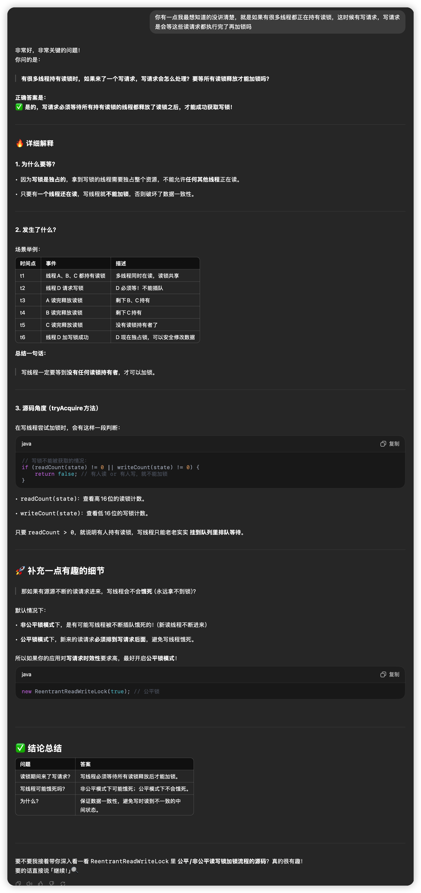

# ReentrantReadWriteLock

## 概述


## 答疑



## 写锁饥饿


## 边界条件


先说结论，读写锁中读锁是共享锁，写锁是独占锁，当发生写操作时其他的读写都会停止

实际使用例子

```java
@Service
@Slf4j
public class DimensionStatisticalReadWriteLock {

    public static final HashMap<String, DimensionStatisticalData> REPORT_DIMENSION_STATISTICAL_AS_OF_YESTERDAY_CACHE = new HashMap<>();

    private final ReadWriteLock readWriteLock = new ReentrantReadWriteLock();

    @Autowired
    private StatisticalReportsService statisticalReportsService;

    //读
    public DimensionStatisticalData get(String searchKey) {
        //上读锁
        readWriteLock.readLock().lock();
        try {
            return REPORT_DIMENSION_STATISTICAL_AS_OF_YESTERDAY_CACHE.get(searchKey);
        } finally {
            //释放读锁
            readWriteLock.readLock().unlock();
        }
    }

    //写
    public DimensionStatisticalData getStatisticalDataAndPutCache(LocalDateTime localDateTimeEnd) throws IllegalArgumentException {
        readWriteLock.writeLock().lock();
        try {
            String searchKey = localDateTimeEnd.format(ShareConstant.DTF_DATE_FORMAT_DATETIME_YEAR_MONTH_DAY);
            DimensionStatisticalData dimensionStatisticalDataBySearchKey = REPORT_DIMENSION_STATISTICAL_AS_OF_YESTERDAY_CACHE.get(searchKey);
            if (dimensionStatisticalDataBySearchKey != null) {
                return dimensionStatisticalDataBySearchKey;
            } else {
                DimensionStatisticalData dimensionStatisticalData = statisticalReportsService.reportDimensionStatistical(null, localDateTimeEnd);
                REPORT_DIMENSION_STATISTICAL_AS_OF_YESTERDAY_CACHE.put(searchKey, dimensionStatisticalData);
                return dimensionStatisticalData;
            }
        } catch (Exception e) {
            log.info("查询历史至今维度数据异常：{}", e);
            log.error("查询历史至今维度数据异常：{}", e);
            throw new RuntimeException();
        } finally {
            readWriteLock.writeLock().unlock();
        }
    }

    public void clearReportDimensionStatisticalAsOfYesterdayCache() {
        REPORT_DIMENSION_STATISTICAL_AS_OF_YESTERDAY_CACHE.clear();
    }

}
```


## 概述

> 在AQS一篇中我们对“独占锁”和“共享锁”做了简单说明。在J.U.C中，共享锁包括CountDownLatch、CyclicBarrier、Semaphore、ReentrantReadWriteLock、JDK1.8新增的StampedLock等，本篇我们将对ReentrantReadWriteLock做详细分析。

ReentrantReadWriteLock维护了一对相关的锁：**共享锁`readLock`和独占锁`writeLock`。**共享锁`readLock`用于读操作，能同时被多个线程获取；独占锁`writeLock`用于写入操作，只能被一个线程持有。独占锁的实现和我们上篇所讨论的ReentrantLock相似，共享锁我们接下来会详细分析。ReentrantReadWriteLock具有以下几种特性：

**1. 公平性：**

- **非公平模式：**默认模式。一个持续争用的非公平锁，可能会使其他读线程或写线程无限延期，但它比公平锁有更高的吞吐量。
- **公平模式：**当构造一个公平锁时，线程争用使用一个近似顺序到达的策略。当目前持有的锁被释放，要么是等待时间最长的单个写入线程被分配写入锁，或者如果有一组读线程比所有等待写线程等待更长的时间，该组将被分配读取锁。

如果已经持有写锁，或者有一个正在等待写的线程，尝试获取公平读锁的线程（非重入）将会阻塞。在等待时间最长的写线程获取并释放写锁之前，当前线程将不能获取读锁。如果一个等待写入的线程放弃等待，并且在队列中等待时间最长的一个或多个读线程正在等待写锁空闲，那么这些读线程将被分配读取锁。

当读锁和写锁都是空闲时（这意味着已经没有等待线程）， 一个尝试获取公平写锁（非重入）的线程才会获取成功。注意非阻塞方法`tryLock()`会立即尝试获取锁，它并不会按照公平原则那样去等待前继节点。

**2. 重入性：**
 `ReentrantReadWriteLock`允许读线程和写线程重复获取读锁或写锁。当所有写锁都被释放，不可重入读线程才允许获取锁。此外，**一个写入线程可以获取读锁，但是一个读线程不能获取写锁。**

**3. 锁降级：**
 重入性允许从写锁降级到读锁：首先获取写锁，然后获取读锁，然后释放写锁。不过，从一个读锁升级到写锁是不允许的。读锁和写锁在获取过程中都支持中断。

**4. Condition支持：**
 **`Condition`只有在写锁中用到，读锁是不支持`Condition`的。**

## 共享锁传播


## 数据结构和核心参数


`ReentrantReadWriteLock`实现了`ReadWriteLock`接口。`ReadWriteLock`是一个读写锁的接口，提供了"获取读锁的`readLock()`函数" 和 "获取写锁的`writeLock()`函数"。

`ReentrantReadWriteLock`有三个内部类：自定义同步器`Sync`，读锁`ReadLock`和写锁`WriteLock`。和ReentrantLock一样，`Sync`继承自AQS，也包括了两个内部实现公平锁`FairSync`和非公平锁`NonfairSync`。`ReadLock`和`WriteLock`都实现了Lock接口，内部也都分别持有`Sync`对象。所有的同步功能都是通过`Sync`来实现的。

Sync源码如下：

```java
abstract static class Sync extends AbstractQueuedSynchronizer {
    private static final long serialVersionUID = 6317671515068378041L;
    // 最多支持65535(1<<16 -1)个写锁和65535个读锁；低16位表示写锁计数，高16位表示持有读锁的线程数
    static final int SHARED_SHIFT   = 16;
    // 读锁高16位，读锁个数加1，其实是状态值加 2^16
    static final int SHARED_UNIT    = (1 << SHARED_SHIFT);
    // 锁最大数量
    static final int MAX_COUNT      = (1 << SHARED_SHIFT) - 1;
    // 写锁掩码，用于标记低16位
    static final int EXCLUSIVE_MASK = (1 << SHARED_SHIFT) - 1;
    //读锁计数，当前持有读锁的线程数，c的高16位
    static int sharedCount(int c)    { return c >>> SHARED_SHIFT; }
    //写锁的计数，也就是它的重入次数,c的低16位
    static int exclusiveCount(int c) { return c & EXCLUSIVE_MASK; }

    //读锁线程数
    static int sharedCount(int c)    { return c >>> SHARED_SHIFT; }
    //写锁线程数
    static int exclusiveCount(int c) { return c & EXCLUSIVE_MASK; }
    //当前线程持有的读锁重入数量
    private transient ThreadLocalHoldCounter readHolds;
    //最近一个获取读锁成功的线程计数器
    private transient HoldCounter cachedHoldCounter;
    // 第一个获取读锁的线程
    private transient Thread firstReader = null;
    //firstReader的持有数
    private transient int firstReaderHoldCount;

    // 构造函数
    Sync() {
        readHolds = new ThreadLocalHoldCounter();
        setState(getState()); // ensures visibility of readHolds
    }

    // 持有读锁的线程计数器
    static final class HoldCounter {
        int count = 0; //持有数
        // Use id, not reference, to avoid garbage retention
        final long tid = getThreadId(Thread.currentThread());
    }

    // 本地线程计数器
    static final class ThreadLocalHoldCounter
            extends ThreadLocal<HoldCounter> {
        // 重写初始化方法，在没有进行set的情况下，获取的都是该HoldCounter值
        public HoldCounter initialValue() {
            return new HoldCounter();
        }
    }
}
```

`Sync`类内部存在两个内部类，分别为`HoldCounter`和`ThreadLocalHoldCounter`，用来记录每个线程持有的读锁数量。

## 源码解析

### ReadLock

```java
public static class ReadLock implements Lock, java.io.Serializable {
    private static final long serialVersionUID = -5992448646407690164L;
    //持有的AQS对象
    private final Sync sync;

    protected ReadLock(ReentrantReadWriteLock lock) {
        sync = lock.sync;
    }

    //获取共享锁
    public void lock() {
        sync.acquireShared(1);
    }

    //获取共享锁(响应中断)
    public void lockInterruptibly() throws InterruptedException {
        sync.acquireSharedInterruptibly(1);
    }

    //尝试获取共享锁
    public boolean tryLock(long timeout, TimeUnit unit)
            throws InterruptedException {
        return sync.tryAcquireSharedNanos(1, unit.toNanos(timeout));
    }

    //释放锁
    public void unlock() {
        sync.releaseShared(1);
    }

    //新建条件
    public Condition newCondition() {
        throw new UnsupportedOperationException();
    }

    public String toString() {
        int r = sync.getReadLockCount();
        return super.toString() +
                "[Read locks = " + r + "]";
    }
}
```

#### lock()

```cpp
public void lock() {
    sync.acquireShared(1);
}
```

说明：`lock`方法调用了同步器`sync`的`acquireShared`，`acquireShared`在《AQS》篇已经分析过。这里主要介绍一下`tryAcquireShared`在ReentrantReadWriteLock中的实现。

**tryAcquireShared源码如下：**

```java
protected final int tryAcquireShared(int unused) {
    //获取当前线程
    Thread current = Thread.currentThread();
    int c = getState();
    //持有写锁的线程可以获取读锁，如果获取锁的线程不是current线程；则返回-1。
    if (exclusiveCount(c) != 0 &&
        getExclusiveOwnerThread() != current)
        return -1;
    int r = sharedCount(c);//获取读锁数量
    if (!readerShouldBlock() &&
        r < MAX_COUNT &&
        compareAndSetState(c, c + SHARED_UNIT)) {
        if (r == 0) {//首次获取读锁,初始化firstReader和firstReaderHoldCount
            firstReader = current;
            firstReaderHoldCount = 1;
        } else if (firstReader == current) {//当前线程是首个获取读锁的线程
            firstReaderHoldCount++;
        } else {
            //更新cachedHoldCounter
            HoldCounter rh = cachedHoldCounter;
            if (rh == null || rh.tid != getThreadId(current))
                cachedHoldCounter = rh = readHolds.get();
            else if (rh.count == 0)
                readHolds.set(rh);
            rh.count++;//更新获取的读锁数量
        }
        return 1;
    }
    return fullTryAcquireShared(current);
}
```

说明：`tryAcquireShared()`的作用是尝试获取“读锁/共享锁”。函数流程如下：

1. 如果“写锁”已经被持有，这时候可以继续获取读锁，但如果持有写锁的线程不是当前线程，直接返回-1（表示获取失败）；
2. 如果在尝试获取锁时不需要阻塞等待（由公平性决定），并且读锁的共享计数小于最大数量`MAX_COUNT`，则直接通过CAS函数更新读取锁的共享计数，最后将当前线程获取读锁的次数+1。
3. 如果第二步执行失败，则调用`fullTryAcquireShared`尝试获取读锁，源码如下：

```java
final int fullTryAcquireShared(Thread current) {
    HoldCounter rh = null;
    for (;;) {//自旋
        int c = getState();
        //持有写锁的线程可以获取读锁，如果获取锁的线程不是current线程；则返回-1。
        if (exclusiveCount(c) != 0) {
            if (getExclusiveOwnerThread() != current)
                return -1;
            // else we hold the exclusive lock; blocking here
            // would cause deadlock.
        } else if (readerShouldBlock()) {//需要阻塞
            // Make sure we're not acquiring read lock reentrantly
            //当前线程如果是首个获取读锁的线程，则继续往下执行。
            if (firstReader == current) {
                // assert firstReaderHoldCount > 0;
            } else {
                //更新锁计数器
                if (rh == null) {
                    rh = cachedHoldCounter;
                    if (rh == null || rh.tid != getThreadId(current)) {
                        rh = readHolds.get();
                        if (rh.count == 0)
                            readHolds.remove();//当前线程持有读锁数为0，移除计数器
                    }
                }
                if (rh.count == 0)
                    return -1;
            }
        }
        if (sharedCount(c) == MAX_COUNT)//超出最大读锁数量
            throw new Error("Maximum lock count exceeded");
        if (compareAndSetState(c, c + SHARED_UNIT)) {//CAS更新读锁数量
            if (sharedCount(c) == 0) {//首次获取读锁
                firstReader = current;
                firstReaderHoldCount = 1;
            } else if (firstReader == current) {//当前线程是首个获取读锁的线程，更新持有数
                firstReaderHoldCount++;
            } else {
                //更新锁计数器
                if (rh == null)
                    rh = cachedHoldCounter;
                if (rh == null || rh.tid != getThreadId(current))
                    rh = readHolds.get();//更新为当前线程的计数器
                else if (rh.count == 0)
                    readHolds.set(rh);
                rh.count++;
                cachedHoldCounter = rh; // cache for release
            }
            return 1;
        }
    }
}
```

`fullTryAcquireShared`是获取读锁的完整版本，用于处理CAS失败、阻塞等待和重入读问题。相对于`tryAcquireShared`来说，执行流程上都差不多，不同的是，它增加了重试机制和对“持有读锁数的延迟读取”的处理。

如果`tryAcquireShared`获取读锁失败返回-1，则调用`doAcquireShared`将当前线程加入等待队列尾部等待唤醒，成功获取资源后返回。`doAcquireShared`方法在《AQS》篇已经分析过，不在赘述。

#### unlock()

```java
public void unlock() {
    sync.releaseShared(1);
}
```

说明：`unlock`方法调用了同步器`sync`的`releaseShared`，`releaseShared`在《AQS》篇已经分析过。这里主要介绍一下`tryReleaseShared`在ReentrantReadWriteLock中的实现。

**tryReleaseShared源码如下：**

```java
protected final boolean tryReleaseShared(int unused) {
    Thread current = Thread.currentThread();
    if (firstReader == current) {//当前为第一个获取读锁的线程
        // assert firstReaderHoldCount > 0;
        //更新线程持有数
        if (firstReaderHoldCount == 1)
            firstReader = null;
        else
            firstReaderHoldCount--;
    } else {
        HoldCounter rh = cachedHoldCounter;
        if (rh == null || rh.tid != getThreadId(current))
            rh = readHolds.get();//获取当前线程的计数器
        int count = rh.count;
        if (count <= 1) {
            readHolds.remove();
            if (count <= 0)
                throw unmatchedUnlockException();
        }
        --rh.count;
    }
    for (;;) {//自旋
        int c = getState();
        int nextc = c - SHARED_UNIT;//获取剩余资源/锁
        if (compareAndSetState(c, nextc))
            // Releasing the read lock has no effect on readers,
            // but it may allow waiting writers to proceed if
            // both read and write locks are now free.
            return nextc == 0;
    }
}
```

**说明：**在`releaseShared`中，首先调用`tryReleaseShared`尝试释放锁，方法流程很简单，主要包括两步：

1. 更新当前线程计数器的锁计数；
2. CAS更新释放锁之后的state，这里使用了自旋，在state争用的时候保证了CAS的成功执行。

**注：WriteLock相关的方法可以参考《ReentrantLock》篇的源码分析，实现方式都差不多，这里就不在赘述了。**