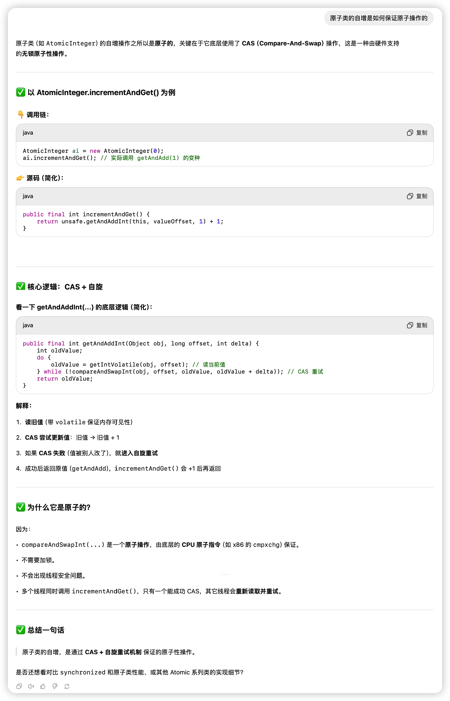

我们常用的原子类例如**AtomicInteger, AtomicLong**是没有版本号控制机制的。

| **类名**                   | **说明**                                    |
| -------------------------- | ------------------------------------------- |
| AtomicStampedReference<V>  | 携带一个整数版本戳 stamp，用于解决 ABA 问题 |
| AtomicMarkableReference<V> | 携带一个布尔值 mark，常用于标记是否逻辑删除 |

**ABA问题的严重性**


📌 真实影响的场景有哪些？

1. **栈结构：Treiber Stack**

```
// 简化结构
class Node {
    int value;
    Node next;
}

AtomicReference<Node> top;
```

- 线程 A 读到 top 为 Node1
- 线程 B 把 Node1 出栈（弹出），再 push 一个新节点 Node2，把 Node1 复用又放回栈顶
- 线程 A CAS 成功，把 Node1 弹出（但它不知道这是个“新” Node1）

💥 问题：**线程 A 操作了已经被逻辑删除、复用过的节点，栈结构被破坏**

这就是典型的 ABA。


2. **锁/状态标志控制**

比如 AQS 中的 state 字段：

```
while (!compareAndSet(state, expect, newState)) {
    // retry
}
```

如果中间 state 改成其他值后又被改回来，**线程可能错误地进入或退出临界区**，破坏线程安全。


✅ 所以什么时候需要处理 ABA 问题？

| **场景**              | **是否需要考虑 ABA**                |
| --------------------- | ----------------------------------- |
| AtomicInteger, 计数器 | ❌ 不需要，ABA 不影响逻辑            |
| 栈/队列等链表结构     | ✅ 需要，涉及指针引用                |
| 状态控制（如 AQS）    | ✅ 通常已做防护，但你写 AQS 时要注意 |
| 简单标志位            | ❌ 一般不会产生问题                  |


