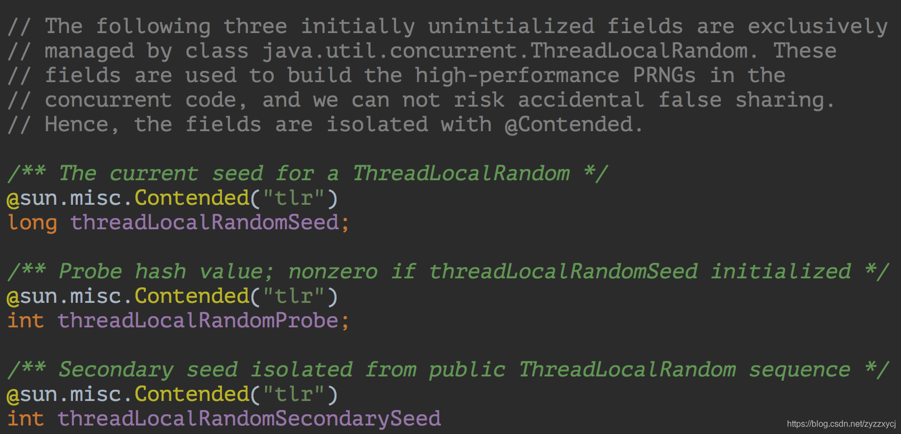

# LockSupport详解

## 前言

LockSupport是concurrent包中一个工具类，不支持构造，提供了一堆[static](https://so.csdn.net/so/search?q=static&spm=1001.2101.3001.7020)方法，比如park(),unpark()等。
LockSupport中的主要成员及其加载时的初始化：


不难发现，他们在初始化的时候都是通过[Unsafe](https://so.csdn.net/so/search?q=Unsafe&spm=1001.2101.3001.7020)去获得他们的内存地址，这里也可以理解为C中的指针。

## Unsafe

Unsafe类可以参考我之前写的文章：[深入理解sun.misc.Unsafe原理](https://blog.csdn.net/zyzzxycj/article/details/89877863)

## parkBlockerOffset


提供给setBlocker和getBlocker使用。


由于Unsafe.putObject是无视java访问限制，直接修改目标[内存](https://so.csdn.net/so/search?q=内存&spm=1001.2101.3001.7020)地址的值。即使对象被volatile修饰，也是不需要写屏障的。关于屏障概念，可以参考 [CyclicBarrier和CountDownLatch的用法与区别](https://blog.csdn.net/zyzzxycj/article/details/90241892)


这边的偏移量就算Thread这个类里面变量parkBlocker在内存中的偏移量:
JVM的实现可以自由选择如何实现Java对象的“布局“,也就是在内存里Java对象的各个部分放在哪里,包括对象的实例字段和一些元数据之类。 sun.misc.Unsafe里关于对象字段访问的方法把对象布局抽象出来,它提供了objectFieldOffset()方法用于获取某个字段相对 Java对象的“起始地址”的偏移量,也提供了getInt、getLong、getObject之类的方法可以使用前面获取的偏移量来访问某个Java 对象的某个字段。

**为什么要用偏移量来获取对象？干吗不要直接写个get,set方法?**
parkBlocker就是在线程处于阻塞的情况下才被赋值。线程都已经被阻塞了,如果不通过这种内存的方法,而是直接调用线程内的方法,线程是不会回应调用的。

## SEED, PROBE, SECONDARY

都是Thread类中的内存偏移地址,主要用于ThreadLocalRandom类进行随机数生成,它要比Random性能好很多,可以看jdk源码ThreadLocalRandom.java了解详情，这儿就不贴了。

## wait和notify/notifyAll

在看park()和unpark()之前，不妨来看下在没有LockSupport之前，是怎么实现让线程等待/唤醒的。

在没有LockSupport之前，线程的挂起和唤醒咱们都是通过Object的wait和notify/notifyAll方法实现。
写一段例子代码，线程A执行一段业务逻辑后调用wait阻塞住自己。主线程调用notify方法唤醒线程A，线程A然后打印自己执行的结果。

```java
public static void main(String[] args) throws Exception {
  final Object obj = new Object();
  Thread A = new Thread(() -> {
    int sum = 0;
    for (int i = 0; i < 10; i++) {
      sum += i;
    }
    try {
      obj.wait();
    } catch (Exception e) {
      e.printStackTrace();
    }
    System.out.println(sum);
  });
  A.start();
  //睡眠一秒钟，保证线程A已经计算完成，阻塞在wait方法
  Thread.sleep(1000);
  obj.notify();
}
```

执行这段代码，不难发现这个错误：

原因很简单，**wait和notify/notifyAll方法只能在同步代码块里用**(这个有的面试官也会考察)。所以将代码修改为如下就可正常运行了：

```java
public static void main(String[] args) throws Exception {
  final Object obj = new Object();
  Thread A = new Thread(() -> {
    int sum = 0;
    for (int i = 0; i < 10; i++) {
      sum += i;
    }
    try {
      synchronized (obj) {
        obj.wait();
      }
    } catch (Exception e) {
      e.printStackTrace();
    }
    System.out.println(sum);
  });
  A.start();
  //睡眠一秒钟，保证线程A已经计算完成，阻塞在wait方法
  Thread.sleep(1000);
  synchronized (obj) {
    obj.notify();
  }
}
```

那如果咱们换成LockSupport呢？简单得很，看代码：

```java
public static void main(String[] args) throws Exception {
  Thread A = new Thread(() -> {
    int sum = 0;
    for (int i = 0; i < 10; i++) {
      sum += i;
    }
    LockSupport.park();
    System.out.println(sum);
  });
  A.start();
  //睡眠一秒钟，保证线程A已经计算完成，阻塞在wait方法
  Thread.sleep(1000);
  LockSupport.unpark(A);
}
```

## LockSupport灵活性

如果只是LockSupport在使用起来比Object的wait/notify简单，那还真没必要专门讲解下LockSupport。最主要的是灵活性。
上边的例子代码中，主线程调用了Thread.sleep(1000)方法来等待线程A计算完成进入wait状态。如果去掉Thread.sleep()调用：

```java
public static void main(String[] args) throws Exception {
  final Object obj = new Object();
  Thread A = new Thread(() -> {
    int sum = 0;
    for (int i = 0; i < 10; i++) {
      sum += i;
    }
    try {
      synchronized (obj) {
        obj.wait();
      }
    } catch (Exception e) {
      e.printStackTrace();
    }
    System.out.println(sum);
  });
  A.start();
  //睡眠一秒钟，保证线程A已经计算完成，阻塞在wait方法
  //        Thread.sleep(1000);
  synchronized (obj) {
    obj.notify();
  }
}
```

多次执行后，我们会发现：有的时候能够正常打印结果并退出程序，但有的时候线程无法打印结果阻塞住了。原因就在于主线程调用完notify后，线程A才进入wait方法，导致线程A一直阻塞住。由于线程A不是后台线程，所以整个程序无法退出。

那如果换做LockSupport呢？LockSupport就支持主线程先调用unpark后，线程A再调用park而不被阻塞吗？是的，没错。代码如下：

```java
public static void main(String[] args) throws Exception {
  Thread A = new Thread(() -> {
    int sum = 0;
    for (int i = 0; i < 10; i++) {
      sum += i;
    }
    LockSupport.park();
    System.out.println(sum);
  });
  A.start();
  //睡眠一秒钟，保证线程A已经计算完成，阻塞在wait方法
  //        Thread.sleep(1000);
  LockSupport.unpark(A);
}
```

不管你执行多少次，这段代码都能正常打印结果并退出。这就是LockSupport最大的灵活所在。

**小结一下，LockSupport比Object的wait/notify有两大优势：**

- LockSupport不需要在同步代码块里 。所以线程间也不需要维护一个共享的同步对象了，实现了线程间的解耦。
- unpark函数可以先于park调用，所以不需要担心线程间的执行的先后顺序。

## LockSupport原理

看源码，park和unpark都是直接调用了Unsafe的方法：深入理解sun.misc.Unsafe原理


Unsafe源码也相对简单，看下就行了：

```c++
void
sun::misc::Unsafe::unpark (::java::lang::Thread *thread)
{
  natThread *nt = (natThread *) thread->data;
  nt->park_helper.unpark ();
}
 
void
sun::misc::Unsafe::park (jboolean isAbsolute, jlong time)
{
  using namespace ::java::lang;
  Thread *thread = Thread::currentThread();
  natThread *nt = (natThread *) thread->data;
  nt->park_helper.park (isAbsolute, time);
}
```

## LockSupport应用广泛

### Future的get方法

LockSupport在Java的工具类用应用很广泛，咱们这里找几个例子感受感受。以Java里最常用的类ThreadPoolExecutor（线程池可参考ThreadPoolExecutor详解及线程池优化）。先看如下代码：


代码中我们向线程池中扔了一个任务，然后调用Future的get方法，同步阻塞等待线程池的执行结果。

这里就要问了：**get方法是如何组塞住当前线程？线程池执行完任务后又是如何唤醒线程的呢？**

咱们跟着源码一步步分析，先看线程池的submit方法的实现：


在submit方法里，线程池将我们提交的基于Callable实现的任务，封装为基于RunnableFuture实现的任务，然后将任务提交到线程池执行，并向当前线程返回RunnableFutrue。

进入newTaskFor方法，就一句话：return new FutureTask(callable);

所以，咱们主线程调用future的get方法就是FutureTask的get方法，线程池执行的任务对象也是FutureTask的实例。

### FutureTask的get方法


比较简单，就是判断下当前任务是否执行完毕，如果执行完毕直接返回任务结果，否则进入awaitDone方法阻塞等待。


awaitDone方法里，首先会用到之前说的CAS操作（参考深入理解sun.misc.Unsafe原理），将线程封装为WaitNode，保持下来，以供后续唤醒线程时用。再就是调用了LockSupport的park/parkNanos组塞住当前线程。

上边已经说完了阻塞等待任务结果的逻辑，接下来再看看线程池执行完任务，唤醒等待线程的逻辑实现。
前边说了，咱们提交的基于Callable实现的任务，已经被封装为FutureTask任务提交给了线程池执行，任务的执行就是FutureTask的run方法执行。如下是FutureTask的run方法：


c.call()就是执行我们提交的任务，任务执行完后调用了set方法，进入set方法发现set方法调用了finishCompletion方法，想必唤醒线程的工作就在这里边了，看看代码实现吧：


这边通过CAS操作将所有等待的线程拿出来，感觉越来越接近了，再看下最后完成方法finishCompletion：


果然，这边使用LockSupport的unpark唤醒每个线程。
ps. 这边对无用变量的回收细节也是十分惊人，可以看上方的代码注释。

### 阻塞队列中的应用

在使用线程池的过程中，不知道你有没有这么一个疑问：线程池里没有任务时，线程池里的线程在干嘛呢？
看过我的这篇文章ThreadPoolExecutor详解及线程池优化的一定知道，线程会调用队列的take方法阻塞等待新任务。那队列的take方法是不是也跟Future的get方法实现一样呢？咱们来看看源码实现。

与想象的有点出入，他是使用了Lock的Condition的await方法实现线程阻塞。但当我们继续追下去进入await方法，发现是通过AQS的await方法实现的，还是使用了LockSupport：


## 小结

多次调用unpark方法和调用一次unpark方法效果一样，因为都是直接将_counter赋值为1，而不是加1。简单说就是：线程A连续调用两次LockSupport.unpark(B)方法唤醒线程B，然后线程B调用两次LockSupport.park()方法， 线程B依旧会被阻塞。因为两次unpark调用效果跟一次调用一样，只能让线程B的第一次调用park方法不被阻塞，第二次调用依旧会阻塞。

## 在系统中的展现

讲解LockSupport.park会让线程进入什么状态,以及如何解除.

无代码不发言

```java
public static void main(String[] args) throws Exception {
    Thread parkThread = new Thread(new Runnable() {
        @Override
        public void run() {

            System.out.println(Thread.currentThread().getName() + "进入park");
            LockSupport.park(this);
            System.out.println(Thread.currentThread().getName() + "解除park");
        }
    }, "parkThread");
    parkThread.start();
}
```

当线程执行到LockSupport.park(this)这句之后,线程会进入到什么状态呢?

编译执行之后,通过jstack查看


可以看到,线程进入到**WAITING**,这里的状态是线程在JVM中的线程状态,那么这个线程在操作系统中的状态又是什么呢?

根据上面的堆栈信息,可以看到操作系统的线程ID=0xde9

先将这个十六进制的0xde9转成十进制3561


通过ps命令查看本进程中的操作系统线程状态


从图中看到,线程的状态是**Sleep**

说完了线程的状态,那么再来说下,如何解除线程的WAITING/Sleep,让线程继续运行呢?

主要有两种方式

**第一种方式通过LockSupport.unpark(thread)**

```java
Thread unParkThread = new Thread(new Runnable() {
   @Override
   public void run() {
       System.out.println(Thread.currentThread().getName() + "进入unPark");
       LockSupport.unpark(parkThread);
       System.out.println(Thread.currentThread().getName() + "退出unPark");
   }
}, "unParkThread");

unParkThread.start();
```


**第二种方式通过thread.interrupt()**

```java
Thread unParkThread = new Thread(new Runnable() {
     @Override
     public void run() {
         System.out.println(Thread.currentThread().getName() + "进入中断");
         parkThread.interrupt();
         System.out.println(Thread.currentThread().getName() + "退出中断");
     }
 }, "unParkThread");

 unParkThread.start();
```


学习过AQS的同学应该都看过下面这张图


没有获取到锁的线程,进入到同步队列中,通过park进入等待状态.

红色的箭头会让线程从等待状态唤醒,继续尝试获取锁.红色箭头的体现就是调用unpark()或者interrupt(),也就是上面我们所说的两种方式.