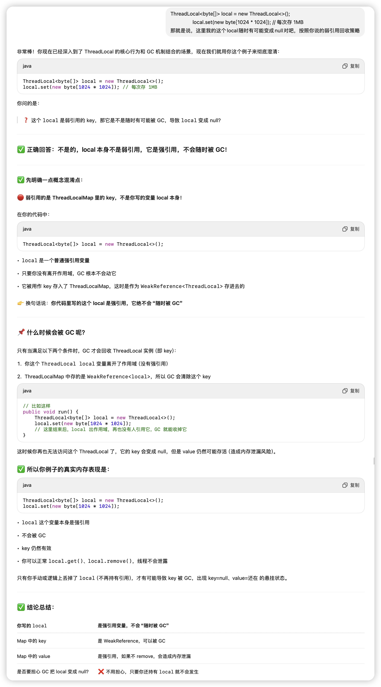

### ✅ 1. 什么是 ThreadLocal？

ThreadLocal<T> 是 Java 提供的一个线程本地变量工具类。

- 它用于为每个线程维护**独立的变量副本**。
- 不同线程对同一个 ThreadLocal 实例调用 .set() 和 .get() 时，访问的是**各自线程内部的独立副本**。

👉 常用于解决多线程下 **变量共享引发的并发安全问题**（例如数据库连接、SimpleDateFormat 等）。


### ✅ 2. 什么是 ThreadLocalMap？

每个线程对象（java.lang.Thread）内部都维护了一个 ThreadLocalMap，它就是一个定制的 map：

```
// Thread.java
ThreadLocal.ThreadLocalMap threadLocals;
```

这个 map 用于存储该线程自己的 ThreadLocal 变量副本。

| **key**                 | **value**              |
| ----------------------- | ---------------------- |
| 弱引用(ThreadLocal对象) | 线程私有的业务数据对象 |
| 弱引用(ThreadLocal对象) | 线程私有的业务数据对象 |

> ⚠️ 注意：这个 Map 并不是全局共享的！**每个线程一个自己的 Map！**


### ✅ 3. Thread和操作系统线程是如何绑定的？

Java 层的 Thread 对象，其实并不等于操作系统线程。

- JVM 在你调用 thread.start() 时，会调用 native 方法 start0()。
- JVM 底层（如 HotSpot）使用 os::create_thread() 创建真正的 OS 线程（Linux 下是 pthread_create()）。
- JVM 内部还维护了一个 JavaThread（C++ 对象）来跟踪 Java 和 OS 层之间的绑定。

所以是一个 1:1 映射关系：

| **Java Thread** | **JVM JavaThread（native）** | **OS Thread**           |
| --------------- | ---------------------------- | ----------------------- |
| Thread 对象     | JavaThread 指针              | pthread / kernel thread |

> 因此：**ThreadLocalMap 是绑定在线程对象上的，只在这个线程自己可见。**


### ✅ 4. 为什么 ThreadLocalMap的 key 要用弱引用？

这是为了 **避免内存泄漏**：

- 如果 key 是强引用，那么只要 ThreadLocalMap 持有了它，它就永远不会被 GC。
- 但如果是弱引用（WeakReference<ThreadLocal<?>>），
  - 当你代码中不再持有这个 ThreadLocal 实例时，
  - GC 就可以及时回收这个对象，**避免 ThreadLocal 永久残留在 Map 中**

> 🚨 **但是！value 是强引用，所以如果不调用 remove()，value 仍然泄露！**（这就是经典的 ThreadLocal 内存泄漏风险）


### **✅ 5. key 是弱引用对象，弱引用里面包着 ThreadLocal 吗？**

**✅ 完全正确。**

这是源码中的定义（ThreadLocalMap.java）：

```
static class Entry extends WeakReference<ThreadLocal<?>> {
    Object value;
    Entry(ThreadLocal<?> k, Object v) {
        super(k);
        value = v;
    }
}
```

也就是说：

- Entry 是 WeakReference<ThreadLocal> 的子类
- 它的 .get() 方法返回的是你传进来的 ThreadLocal 对象
- 一旦外部不再强引用这个 ThreadLocal，GC 就能把它回收
- 然后这个 entry 就变成了：key=null, value=还在 的悬挂结构

> 🔥 所以最终你说的非常正确：**key 是弱引用对象，包着的才是原始 ThreadLocal 实例本体。**


### **🧱 总结成一个一图理解（结构关系）：**

```
Thread (线程对象)
│
├─ ThreadLocalMap (每个线程一个)
│   ├─ Entry 1: [WeakReference<ThreadLocalA>] -> valueA
│   ├─ Entry 2: [WeakReference<ThreadLocalB>] -> valueB
│   └─ Entry N: [WeakReference<ThreadLocalX>] -> valueX
│
└─ 操作系统线程 (通过 native 绑定)
```


### **✅ 最终记忆锚点（面试秒答）**


| **概念**              | **记住这句话**                                |
| --------------------- | --------------------------------------------- |
| ThreadLocal           | 为每个线程提供变量副本，解决线程共享问题      |
| ThreadLocalMap        | 每个线程持有的私有 map，保存 ThreadLocal 的值 |
| key 为啥用弱引用      | 防止 ThreadLocal 对象永远无法被 GC，避免泄漏  |
| key 是什么结构        | 是 WeakReference<ThreadLocal>，包着原始对象   |
| Thread 和 OS 线程关系 | JVM 在 start0() 时 native 绑定，1:1 映射关系  |




### 为什么 ThreadLocalMap 的 key 是弱引用？

原因：

- key 是 ThreadLocal 实例，弱引用设计是为了 **避免内存泄漏**
- 一旦业务代码中不再持有 ThreadLocal 的强引用（即局部变量弹栈），
  - key（即弱引用）就能被 GC 回收，
  - JVM 后续可以在 ThreadLocalMap 中清理掉这组 entry（key=null 的 entry）
- 🔥 这是为了避免线程长期持有无用的数据，造成 **线程级内存泄漏**


### 为什么 value 不能是弱引用？

原因：

- 如果 value 是弱引用，而你业务代码没有强引用它（比如没赋值给变量），它就会被 GC 立刻回收
- 下次你调用 threadLocal.get()，就会拿到 **null**
- ❗这会导致严重的业务异常，比如 NullPointerException、上下文丢失、连接失效等


🎯 所以核心逻辑是：

```
✔ 你能调用 threadLocal.get()，说明你还持有 ThreadLocal 的强引用 → key 安全
❌ 但 value 如果是弱引用，而你没自己强引用它，它就可能被 GC → get() 拿到 null
```


✅ 总结一句话：

> **ThreadLocalMap 的 key 用弱引用是为了自动清理无用的 ThreadLocal 实例，防止内存泄漏；value 不用弱引用是为了确保你业务调用 get() 时，数据还在，逻辑稳定。**

