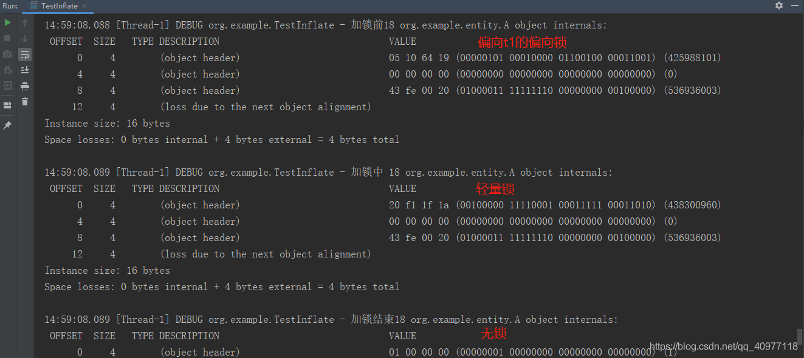

# synchronized锁升级过程

## 简要

在Java的并发编程领域中，我们进行会使用到锁这个东西，例如在[多线程](https://so.csdn.net/so/search?q=多线程&spm=1001.2101.3001.7020)环境下为了预防某些线程安全问题，这里面可能会产生一些预想不到的问题，所以下边我整理了一系列关于JDK中锁的问题，帮助大家更加深入地了解它们。

### synchronized真的是重量级锁嘛？

这个问题相信大部分人在面试的时候都有遇到过，答案是否定的。这个要看JDK的版本来进行判断。如果JDK的版本在1.5之前使用`synchronized`锁的原理大概如下：

- 给需要加锁的资源前后分别加入一条“monitorenter”和“monitorexit”指令。

- 当线程需要进入这个代码临界区的时候，先去参与“抢锁”（本质是获取monitor的权限）

- 抢锁如果失败，就会被阻塞，此时控制权只能交给操作系统，也就会从 user mode 切换到 kernel mode, 由操作系统来负责线程间的调度和线程的状态变更, 需要频繁的在这两个模式下切换（上下文转换）。

可以看出，老模式的条件下去获取锁的开销是比较大的，所以后来JDK的作者才会在JDK中设计了Lock接口，采用CAS的方式来实现锁，从而提升性能。

但是当竞争非常激烈的时候，采用CAS的方式有可能会一直获取不到锁的话，不管进行再多的CAS也是在浪费CPU，这种状态下的性能损耗会比synchronized还要高。所以这类情况下，不如直接升级加锁的方式，让操作系统介入。

正因为这样，所以后边才会有了锁升级的说法。

### synchronized的锁升级

#### 偏向锁

在`synchronized`进行升级的过程中，第一步会升级为偏向锁。所谓偏向锁，它的本质就是让锁来记住请求的线程。

在大多数场景下，其实都是单线程访问锁的情况偏多，JDK的作者在重构`synchronized`的时候，给对象头设计了一个bit位，专门用于记录锁的信息，具体我们可以通过下边这个实际案例来认识下：

```java
public static void main(String[] args) throws InterruptedException {
    Object o = new Object();
    System.out.println("还没有进入到同步块");
    System.out.println("markword:" + ClassLayout.parseInstance(o).toPrintable());
    //默认JVM启动会有一个预热阶段，所以默认不会开启偏向锁
    Thread.sleep(5000);
    Object b = new Object();
    System.out.println("还没有进入到同步块");
    System.out.println("markword:" + ClassLayout.parseInstance(b).toPrintable());
    synchronized (o){
        System.out.println("进入到了同步块");
        System.out.println("markword:" + ClassLayout.parseInstance(o).toPrintable());
    }
}
```

注意要引入一些第三方的依赖，辅助我们查看对象头的信息：

```xml
<dependency>
    <groupId>org.openjdk.jol</groupId>
    <artifactId>jol-core</artifactId>
    //这个版本号的不同，查看的内容格式也不同
    <version>0.16</version>
</dependency>
```

控制台输出的结果如下：

```java
还没有进入到同步块
# WARNING: Unable to attach Serviceability Agent. You can try again with escalated privileges. Two options: a) use -Djol.tryWithSudo=true to try with sudo; b) echo 0 | sudo tee /proc/sys/kernel/yama/ptrace_scope
markword:java.lang.Object object internals:
OFF  SZ   TYPE DESCRIPTION               VALUE
  0   8        (object header: mark)     0x0000000000000001 (non-biasable; age: 0)
  8   4        (object header: class)    0xf80001e5
 12   4        (object alignment gap)    
Instance size: 16 bytes
Space losses: 0 bytes internal + 4 bytes external = 4 bytes total
 
 
还没有进入到同步块
markword:java.lang.Object object internals:
OFF  SZ   TYPE DESCRIPTION               VALUE
  0   8        (object header: mark)     0x0000000000000005 (biasable; age: 0)
  8   4        (object header: class)    0xf80001e5
 12   4        (object alignment gap)    
Instance size: 16 bytes
Space losses: 0 bytes internal + 4 bytes external = 4 bytes total
 
 
进入到了同步块
markword:java.lang.Object object internals:
OFF  SZ   TYPE DESCRIPTION               VALUE
  0   8        (object header: mark)     0x00007000050ee988 (thin lock: 0x00007000050ee988)
  8   4        (object header: class)    0xf80001e5
 12   4        (object alignment gap)    
Instance size: 16 bytes
Space losses: 0 bytes internal + 4 bytes external = 4 bytes total
```

这个案例中，如果你仔细观察控制台的内容，可以发现，当JVM刚启动的时候，对象头部的锁标志位是无锁状态。但是过了一整子（大概4秒之后），就会变成一个biasable的状态。如果需要调整这个延迟的时间，可以通过参数 -XX:BiasedLockingStartupDelay=0 来控制。

这里我解释下biasable的含义：

> biasable是JVM帮我们设置的状态，在这种状态下，一旦有线程访问锁，就会直接CAS修改对象头中的线程id。如果成功，则直接升级为偏向锁。否则就会进入到锁的下一个状态--轻量级锁。

ps：JVM因为在启动预热的阶段中，会有很多步骤使用到`synchronized`，所以在刚启动的前4秒中，不会直接将`synchronized`锁的标记升级为`biasable`状态。这是为了较少一些无必要的性能损耗。

#### 轻量级锁

当锁被一个线程访问的时候，它会变成偏向锁的状态，那么当新的线程再次访问该锁的时候，锁会有什么变化吗？

这里我整理了一张锁的变化流程图，如下所示：


为了验证这个过程，我们可以通过下边这个案例来实践下：

```java
public static void main(String[] args) throws InterruptedException {
    // 睡眠 5s
    Thread.sleep(5000);
    Object o = new Object();
    System.out.println("未进入同步块，MarkWord 为：");
    System.out.println(ClassLayout.parseInstance(o).toPrintable());
    synchronized (o){
        System.out.println(("进入同步块，MarkWord 为："));
        System.out.println(ClassLayout.parseInstance(o).toPrintable());
    }
    Thread t2 = new Thread(() -> {
        synchronized (o) {
            System.out.println("新线程获取锁，MarkWord为：");
            System.out.println(ClassLayout.parseInstance(o).toPrintable());
        }
    });
    t2.start();
    t2.join();
    System.out.println("主线程再次查看锁对象，MarkWord为：");
    System.out.println(ClassLayout.parseInstance(o).toPrintable());
    synchronized (o){
        System.out.println(("主线程再次进入同步块，MarkWord 为："));
        System.out.println(ClassLayout.parseInstance(o).toPrintable());
    }
    
    synchronized (b) {
        System.out.println(("主线程再次进入同步块，并且调用hashcode方法，MarkWord 为："));
        b.hashCode();
        System.out.println(ClassLayout.parseInstance(b).toPrintable());
    }
}
```

然后我们来观察下执行的结果：

```java
Connected to the target VM, address: '127.0.0.1:63267', transport: 'socket'
# WARNING: Unable to attach Serviceability Agent. You can try again with escalated privileges. Two options: a) use -Djol.tryWithSudo=true to try with sudo; b) echo 0 | sudo tee /proc/sys/kernel/yama/ptrace_scope
未进入同步块，MarkWord 为：java.lang.Object object internals:
OFF  SZ   TYPE DESCRIPTION               VALUE
  0   8        (object header: mark)     0x0000000000000001 (non-biasable; age: 0)
  8   4        (object header: class)    0xf80001e5
 12   4        (object alignment gap)    
Instance size: 16 bytes
Space losses: 0 bytes internal + 4 bytes external = 4 bytes total
未进入同步块，MarkWord 为：java.lang.Object object internals:
OFF  SZ   TYPE DESCRIPTION               VALUE
  0   8        (object header: mark)     0x0000000000000005 (biasable; age: 0)
  8   4        (object header: class)    0xf80001e5
 12   4        (object alignment gap)    
Instance size: 16 bytes
Space losses: 0 bytes internal + 4 bytes external = 4 bytes total
进入同步块，MarkWord 为：java.lang.Object object internals:
OFF  SZ   TYPE DESCRIPTION               VALUE
  0   8        (object header: mark)     0x00007fe8a5009805 (biased: 0x0000001ffa294026; epoch: 0; age: 0)
  8   4        (object header: class)    0xf80001e5
 12   4        (object alignment gap)    
Instance size: 16 bytes
Space losses: 0 bytes internal + 4 bytes external = 4 bytes total
新线程获取锁，MarkWord为：
java.lang.Object object internals:
OFF  SZ   TYPE DESCRIPTION               VALUE
  0   8        (object header: mark)     0x000070000ba03908 (thin lock: 0x000070000ba03908)
  8   4        (object header: class)    0xf80001e5
 12   4        (object alignment gap)    
Instance size: 16 bytes
Space losses: 0 bytes internal + 4 bytes external = 4 bytes total
主线程再次查看锁对象，MarkWord为：
java.lang.Object object internals:
OFF  SZ   TYPE DESCRIPTION               VALUE
  0   8        (object header: mark)     0x0000000000000001 (non-biasable; age: 0)
  8   4        (object header: class)    0xf80001e5
 12   4        (object alignment gap)    
Instance size: 16 bytes
Space losses: 0 bytes internal + 4 bytes external = 4 bytes total
主线程再次进入同步块，MarkWord 为：
java.lang.Object object internals:
OFF  SZ   TYPE DESCRIPTION               VALUE
  0   8        (object header: mark)     0x0000700009f87980 (thin lock: 0x0000700009f87980)
  8   4        (object header: class)    0xf80001e5
 12   4        (object alignment gap)    
Instance size: 16 bytes
Space losses: 0 bytes internal + 4 bytes external = 4 bytes total
主线程再次进入同步块，并且调用hashcode方法，MarkWord 为：
java.lang.Object object internals:
OFF  SZ   TYPE DESCRIPTION               VALUE
  0   8        (object header: mark)     0x00007fe8a51391ea (fat lock: 0x00007fe8a51391ea)
  8   4        (object header: class)    0xf80001e5
 12   4        (object alignment gap)    
Instance size: 16 bytes
Space losses: 0 bytes internal + 4 bytes external = 4 bytes total
Disconnected from the target VM, address: '127.0.0.1:63267', transport: 'socket'
Process finished with exit code 0
```

通过在控制台中的打印内容我们可以发现，锁的状态一共经历了以下几个变化步骤：

**biasable状态**

在这个状态下，锁是一个待偏向的状态，此时如果有线程请求的话。不过如果是刚启动JVM的状态的话，对象头部会是non-biasable状态，只有等jvm预热了一段时间（大约是4秒），才会留转变为biasable状态。

**biased状态**

当第一个请求获取到锁的时候，锁的状态会变成偏向锁状态，也就是biased。如果在处于偏向锁状态的时候，还有新的线程参与锁的抢夺，那么就会发生锁的升级，进入到轻量级锁状态阶段。

**thin lock状态**

可以看到，当一个锁已经经历过偏向锁状态之后，后去如果再有其他线程访问它，它就会升级为轻量级锁的状态，也就是thin lock状态。

**fat lock状态**

当我们在同步代码块中调用hashcode方法的时候，会发现，锁的对象头部会多出一个叫做fat lock的状态，这就意味着，此时该锁已经升级为了重量级锁的状态了。

#### 重量级锁

当一把锁已经处于轻量级锁的状态时，如果此时又有多的线程来尝试获取锁，那么锁就会被多个线程已自旋的方式来请求访问，当访问的次数达到一定上限之后，synchronized就会自动升级为重量级锁的状态了。

当升级为重量级锁的情况下，锁对象的mark word中的指针不再指向线程栈中的lock record，而是指向堆中与锁对象关联的monitor对象。当多个线程同时访问同步代码时，这些线程会先尝试获取当前锁对象对应的monitor的所有权：

- 获取成功，判断当前线程是不是重入，如果是重入那么recursions+1

- 获取失败，当前线程会被阻塞，等待其他线程解锁后被唤醒，再次竞争锁对象


在重量级锁的情况下，加解锁的过程涉及到操作系统的Mutex Lock进行互斥操作，线程间的调度和线程的状态变更过程需要在用户态和核心态之间进行切换，会导致消耗大量的cpu资源，导致性能降低。

**有哪几种方式可以使一把锁升级为重量级状态？**

- 调用wait方法
- 在同步代码块中调用对象的hashcode方法

最后我绘制了一张锁升级的流程图和大家分享下：


## 下面是另一篇文章

对于java锁升级，很多人都停留在比较浅层的表面理解，一定程度下也许够用，但如果学习其中的细节，**我们更好地理解多线程并发时各种疑难问题的应对方式！**

因此我将锁升级过程中可能涉及的大部分细节或者疑问都整合成了一篇文章，希望你能直接在这篇文章中，搞懂你当年学习这块时遗留的所有疑问。

## 为什么说线程切换会很慢？

所谓的用户态和内核态之间的切换仅仅是一方面， 并非全部， 更关键的在于， 多CPU的机器中，**当你切换了线程，意味着线程在原先CPU上的缓存也许不再有用**， 因为当线程重新触发时，可能在另一个CPU上执行了。

正因如此，不建议没事就挂起线程， 让线程自旋会比挂起后切换CPU好很多。

正与基于这一点，才有了后面的sync锁升级机制，理解了为什么要锁升级，才能逐步理解锁升级过程，

## 对象头中的mark-word

java每个对象的对象头中， 都有32或者64位的mark-word。

mark-word是理解锁升级过程的重要部分，且后面的锁升级过程都会涉及，因此这里会进行一个非常详细的解释。这部分只对一个对象必有的属性做解释（即一般不会随着锁状态变化而消失的属性）。对于各锁状态独有的属性，会在锁升级过程中做详细的解释。


### 锁状态标志位 +偏向锁标记位（2bit + 1bit）

除了markword中的2位锁状态标志位， 其他62位都会随着锁状态标志位的变化而变化。

这里先列出各锁状态标志位代表的当前对象所用锁的情况。后面会详细解释各种锁的含义和运行原理。

- 锁状态标志位为01： 属于无锁或者偏向锁状态。**因此还需要额外的偏向锁标记位1bit来确认是无锁还是偏向锁**
- 锁状态标志位为00： 轻量级锁
- 锁状态标志位为10： 重量级锁
- 锁状态标志位为11： 已经被gc标记，即将释放

### 为什么无锁/偏向锁的标志位是01，而轻量级锁的标志位是00？

即按理说，无锁是锁状态的初始情况，为什么标志位不是从00开始？

个人查询到的一个解释，是因为 轻量级锁除了锁标志位外，另外62位都是一个指针地址。

如果将轻量级锁标志位设置为00， 那么在判断标志位为00后， **m无需再额外做一次markWord>>2的操作，而是直接将markWord拿来当作地址使用即可！**

可以从这里看到jvm的设计者还是非常细节的，并没有随意地定义各状态的标志位

### hashcode（31bit）

哈希code很容易理解，将对象存储到一些map或者set里时，都需要hashcode来确认插入位置。

但markword里的hashcode，和我们平时经常覆写的hashCode()还是有区别的。

### markword中的hashcode是哪个方法生成的？

很多人误以为，markword中的hashcode是由我们经常覆写的hashcode（）方法生成的。

实际上， markword中的hashcode只由底层 JDK C++ 源码计算得到（java侧调用方法为 System.identityHashCode() ）， 生成后固化到markword中，如果你覆写了hashcode()方法， 那么每次都会重新调用hashCode()方法重新计算哈希值。

根本原因是因为你覆写hashcode()之后，该方法中很可能会利用被修改的成员来计算哈希值，所以jvm不敢将其存储到markword中。

**因此，如果覆写了hashcode（）方法，对象头中就不会生成hashcode，而是每次通过hashcode()方法调用**

### markword中的hashcode是什么时候生成？

很容易误以为会是对象一创建就生成了。

实际上，是采用了**延迟加载技术**，只有在用到的时候才生成。毕竟有可能对象创建出来使用时，并不需要做哈希的操作。

### hashcode在其他锁状态中去哪了？

这个问题会在后面锁升级的3个阶段中，解释hashcode的去向。其他的例如分代年龄同理。

### gc分代年龄（4bit）

在jvm垃圾收集机制中， 决定年轻代什么时候进入老年代的根据之一， 就是确认他的分代年龄是否达到阈值，如下图所示。


分代年龄只有4bit可以看出，最大值只能是15。因此我们设置的进入老年代年龄阈值 -XX:MaxTenuringThreshold 最大只能设置15。

### cms_free

在无锁和偏向锁中，还可以看到有1bit的cms_free。

实际上就是只有CMS收集器用到的。但最新java11中更多用的是G1收集器了，这一位相当于不怎么常用，因此提到的也非常少。

从上述可以看出， 只有锁状态标记位、 hashcode、 分代年龄、cms_free是必有的， 但是从markword最初的示意图来看， hashcode、 分代年龄、cms_free似乎并非一直存在，那么他们去哪了呢？会在后面的锁升级过程进行详细解释。

## 锁升级四个阶段超级详解

### 无锁

无锁状态的markword如下所示，可以看到上文提到的信息都存在


### 处于无锁状态的条件或者时机是什么？

无锁状态用于对象刚创建，**且还未进入过同步代码块的时候**

这一点很重要， 意味着如果你没有同步代码块或者同步方法， 那么将是无锁状态。

### 对象从没进入同步块，为什么偏向锁标志位却是1？

上面这个问题说过，没进入同步块， 不会上偏向锁。

但是我们如果用java的jol工具测试打印新对象，会看到低3位是101


这其实是jvm后面加入的一种优化， 对每个新对象，预置了一个**“可偏向状态”**，也叫做**匿名偏向状态**，是对象初始化中，JVM 帮我们做的。

注意此时 markword中高位是不存在ThreadID的， 都是0， 说明此时并没有线程偏向发生，因此也可以理解成是无锁。

好处在于后续做偏向锁加锁时，无需再去改动偏向锁标记位，只需要对线程id做cas即可。

### 偏向锁

一旦代码第一次进入sync同步方法块，就**可能**从无锁状态进入偏向锁状态。

另外很多人应该都知道， 偏向锁只存储了当前偏向的线程id， 只有线程id不同的才会触发升级。

但这是非常简化的说法， 实际上中间的细节和优化非常之多！这里将为你详细讲述。

### 为什么要有偏向锁？

理解这个才能理解偏向锁中的各种设计。 假设我们new出来的对象带有同步代码块方法，但在整个生命周期中只被一个线程访问，那么是否有必要做消耗消耗的竞争动作，甚至引入额外的内存开销？没有必要。

因此针对的是 **对象有同步方法调用，但是实际不存在竞争的场景**

### 偏向锁的markword详解


这个markword和无锁对比， 偏向标志位变成了1， hashcode没了，多了个epoch和线程id。

### markword中的当前线程id

这个id就是在进入了对象同步代码块的线程id。

### java的线程id是一个long类型， 按理说是64位，但为什么之类的线程id只有54位？

具体没有找到解释，可能是jvm团队认为54位线程id足够用了，不至于会创建2^54那么多的线程，真的有需要创建这么频繁的程序，也会优先采用线程池池才对

### 线程id如何写入？

线程id是直接写入markword吗？ 不对， 一定要注意到这时候是存在同时写的可能的。

因此会**采用CAS的方式进行线程id的写入**。 简而言之， 就是先取原线程id后，再更新线程id，更新后检查一下是否和预期一致，不一致则说明被人改动过，则线程id写入失败，说明存在竞争，升级为轻量级锁。

### 哈希code去哪了

我们注意到无锁时的hashcode不见了。

对于偏向锁而言， **一旦在对象头中设置过hashcode， 那么进入同步块时就不会进入偏向锁状态**，会直接跳到轻量级锁，毕竟偏向锁里没有存放hashcode的地方（下文的轻量级锁和重量级锁则有存储的地方）

因此凡是做过类似hashmap.put(k,v)操作且没覆写hashcode的k对象， 以后加锁时，都会直接略过偏向锁。

### epoch是什么？

这个属性很多人叫它“偏向时间戳”， 却鲜有人进行详细解释。

主要是因为它涉及到了偏向锁中非常重要的2个优化（批量重偏向和批量撤销）

对于这个epoch，放到下文的偏向锁解锁过程进行解释。

你可以先简单理解为，**通过epoch，jvm可以知道这个对象的偏向锁是否过期了，过期的情况下允许直接试图抢占，而不进行撤销偏向锁的操作。**

### 偏向锁运作详解

### 偏向锁上锁时，如何避免冲突和竞争？

我们知道偏向锁其实就是将线程id设置了进去，但是如果存在冲突怎么办？

因此，jmv会**通过CAS**来设置偏向线程id，一旦设置成功那么这个偏向锁就算挂上了。

后面每次访问时，检查线程id一致，就直接进入同步代码块执行了。

CAS概念补充：

CAS是一个原子性操作， 调用者需要给定修改变量的期望值 和 最终值

当内存中该变量的值和期望值相等时，才更新为最终值， 这个相等的比较和更新的操作是原子操作

对于到偏向锁加锁过程， 其实就是先取出线程id部分， 如果为空， 则进行（期望值：空 ， 最终值：当前线程id）的CAS操作， 如果发现期望值不匹配，就说明被抢先了 。

### 离开同步代码块时， markword中的线程id会重新变为0吗？

并不会，这个偏向锁线程id会一直挂着， 后面只要识别到id一致，就不用做特殊处理。

### 偏向锁发生竞争时的切锁或者升级操作。

但当有其他线程来访问时，之前设置的偏向锁就有问题了，说明存在多线程访问同一个对象的情况。

**注意！！！这里并非像很多资料里说的那样， 一旦发生多线程调用， 偏向锁就升级成轻量级锁**，而是做了很多的细节处理，来尽可能避免轻量级锁这种耗费CPU的操作。

首先，jvm考虑到了这种场景：

最开始1h内，都是线程A在调用大量的对象obj， 于是偏向锁一直都是线程A。

后来线程A不跑了， 对象obj的调用交给了线程B，即未来都是线程B来调用。

那么这时候，有必要马上升级轻量级锁吗？

没必要！因为未来仍然是单线程调用，仅仅是线程不同而已，也许可以尝试仍旧用偏向锁？

于是就有了如下的撤销偏向锁的动作：

1. 当线程B发现是偏向锁，且线程id不为自己时，开始撤销操作
2. 首先，线程B会一直等待 对象obj 到达jvm**安全点**。
3. 到达安全点后， 线程B检查线程A是否正处在obj的同步代码块内。
4. 如果线程A正在同步代码块中， 则没得商量了，直接升级为轻量级锁。
5. 如果线程A不在同步代码块中， 那么线程B还有机会， 它先把偏向锁改成无锁状态，然后再用CAS的方式尝试重新竞争，如果能竞争到，那么就会偏向自己。

完整过程如下图所示：


### 为什么要等待安全点，才能做撤销操作？

这是为了保证撤销操作的安全性。否则可能出现jvm正在撤销的时候， 另一个线程又开始对该对象做操作，引发错误。

### 为什么要先退化成无锁状态，再试图竞争成偏向锁？不能直接偏向吗？

因为你无法预测A是否会卷土重来，置成无锁后， A和B可以公平竞争。

### 为什么原偏向线程在同步代码块中时，就必须升级为轻量级锁？能否同样撤销无锁来竞争？

不可以，因为同步代码块还在执行的话，那B线程此时是注定无法立刻得到锁的，注定了它必须升级为轻量级锁，通过轻量级锁中的循环能力来做获取锁的操作。

### 批量重偏向，以及epoch的应用

上文提到， 线程B重新抢偏向锁时，会试图等待安全点，撤销成无锁，再做公平抢占。 这个动作还是比较费时的。

假设有一个场景， 我们new 了30个obj对象， 最初都是由A线程使用，后面通过for循环都由B线程使用，那么会发现在很短的时间内，连续发生了偏向锁撤销为无锁，且未因同步块竞争而发生轻量升级的情况。

那么，jvm猜测此时后面都是类似的情况，于是B线程调用obj对象时，不再撤销了，直接CAS竞争threadId，因为jvm预测A不会来抢了，具体步骤如下所示：

1. jvm会在obj对象的**类class对象**中， 定义了一个偏向撤销计数器以及epoch偏向版本。
2. 每当有一个对象被撤销偏向锁， 都会让偏向撤销计数器+1。
3. 一旦加到20， 则认为出现大规模的锁撤销动作。 于是class类对象中的epoch值+1（但是epoch一般只有2位即0~3）。
4. 接着， jvm会找到所有正处在同步代码块中的obj对象， 让他的epoch等于class类对象的epoch。
5. 其他不在同步代码块中的obj对象，则不修改epoch。
6. 当B线程来访问时，发现obj对象的epoch和class对象的epoch不相等，则不再做撤销动作，直接CAS抢占。 **因为当epoch不等时，这说明该obj对象之前一直没被原主人使用， 但它的兄弟们之前纷纷投降倒戈了， 那我应该直接尝试占用就好，没必要那么谨慎了！**

详细过程如下图所示：


### 批量撤销

但如果短时间内该类的撤销动作超过40个， jvm会认为这个数量太多了， 不保险，数量一多，预测就不准了。

jvm此时会将 obj对象的类class对象中的偏向标记**（注意是类中的偏向锁开启标记，而不是对象头中的偏向锁标记）**设置为禁用偏向锁。 后续该对象的new操作将直接走轻量级锁的逻辑。


#### 批量重偏向（详解）

如果对象虽然被多个线程访问，但没有竞争，这时偏向了线程 T1 的对象仍有机会重新偏向 T2，重偏向会重置对象的 Thread ID；当撤销偏向锁达到阈值 20 次后，jvm 会这样觉得，我是不是偏向错了呢，于是会在给这些对象加锁时重新偏向至t2。因为前19次是轻量，释放之后为无锁不可偏向，但是20次后面的是偏向t2，释放之后依然是偏向t2。

```java
package org.example;

import lombok.extern.slf4j.Slf4j;
import org.example.entity.A;
import org.openjdk.jol.info.ClassLayout;

import java.util.ArrayList;
import java.util.List;
import java.util.concurrent.locks.LockSupport;

@Slf4j
public class TestInflate {

    static Thread t1;
    static Thread t2;
    static int loopFlag = 20;

    public static void main(String[] args) {
        final List<A> list = new ArrayList<>();
        t1 = new Thread() {
            @Override
            public void run() {
                for (int i = 0; i < loopFlag; i++) {
                    A a = new A();
                    list.add(a);
                    log.debug("加锁前" + i + " " + ClassLayout.parseInstance(a).toPrintable());
                    synchronized (a) {
                        log.debug("加锁中" + i + " " + ClassLayout.parseInstance(a).toPrintable());
                    }
                    log.debug("加锁结束" + i + " " + ClassLayout.parseInstance(a).toPrintable());
                }
                log.debug("============t1 都是偏向锁=============");
                //防止竞争 执行完后叫醒  t2
                LockSupport.unpark(t2);
            }
        };
        t2 = new Thread() {
            @Override
            public void run() {
                //防止竞争 先睡眠t2
                LockSupport.park();
                for (int i = 0; i < loopFlag; i++) {
                    A a = list.get(i);
                    //因为从list当中拿出都是偏向t1
                    log.debug("加锁前" + i + " " + ClassLayout.parseInstance(a).toPrintable());
                    synchronized (a) {
                        //前20撤销偏向t1；然后升级轻量指向t2线程栈当中的锁记录
                        //后面的发送批量偏向t2
                        log.debug("加锁中 " + i + " " + ClassLayout.parseInstance(a).toPrintable());
                    }
                    //因为前20是轻量，释放之后为无锁不可偏向
                    //但是后面的是偏向t2 释放之后依然是偏向t2
                    log.debug("加锁结束" + i + " " + ClassLayout.parseInstance(a).toPrintable());
                }
                log.debug("新产生的对象" + ClassLayout.parseInstance(new  A()).toPrintable());
            }
        };
        t1.start();
        t2.start();
    }
}
```

- 关闭偏向延迟，-XX:BiasedLockingStartupDelay=0，查看第19次对象头打印



- 查看第20次对象头打印


#### 批量撤销（详解）

- 当一个偏向锁如果撤销次数到达40的时候就认为这个对象设计的有问题；那么JVM会把这个对象所对应的类所有的对象都撤销偏向锁；并且新实例化的对象也是不可偏向的
- t1线程创建40个a对象，t2撤销偏向锁40次，t3开始加锁

```java
package org.example;

import lombok.extern.slf4j.Slf4j;
import org.example.entity.A;
import org.openjdk.jol.info.ClassLayout;

import java.util.ArrayList;
import java.util.List;
import java.util.concurrent.locks.LockSupport;

@Slf4j
public class TestInflate {

    static Thread t1;
    static Thread t2;
    static Thread t3;
    static int loopFlag = 40;

    public static void main(String[] args) {
        final List<A> list = new ArrayList<>();
        t1 = new Thread() {
            @Override
            public void run() {
                for (int i = 0; i < loopFlag; i++) {
                    A a = new A();
                    list.add(a);
                    log.debug("加锁前" + i + " " + ClassLayout.parseInstance(a).toPrintable());
                    synchronized (a) {
                        log.debug("加锁中" + i + " " + ClassLayout.parseInstance(a).toPrintable());
                    }
                    log.debug("加锁结束" + i + " " + ClassLayout.parseInstance(a).toPrintable());
                }
                log.debug("============t1 都是偏向锁=============");
                //防止竞争 执行完后叫醒  t2
                LockSupport.unpark(t2);
            }
        };
        t2 = new Thread() {
            @Override
            public void run() {
                //防止竞争 先睡眠t2
                LockSupport.park();
                for (int i = 0; i < loopFlag; i++) {
                    A a = list.get(i);
                    //因为从list当中拿出都是偏向t1
                    log.debug("加锁前" + i + " " + ClassLayout.parseInstance(a).toPrintable());
                    synchronized (a) {
                        //前20撤销偏向t1；然后升级轻量指向t2线程栈当中的锁记录
                        //后面的发送批量偏向t2
                        log.debug("加锁中 " + i + " " + ClassLayout.parseInstance(a).toPrintable());
                    }
                    //因为前20是轻量，释放之后为无锁不可偏向
                    //但是后面的是偏向t2 释放之后依然是偏向t2
                    log.debug("加锁结束" + i + " " + ClassLayout.parseInstance(a).toPrintable());
                }
                log.debug("新产生的对象" + ClassLayout.parseInstance(new  A()).toPrintable());
                LockSupport.unpark(t3);
            }
        };
        t3 = new Thread() {
            @Override
            public void run() {
                //防止竞争 先睡眠t2
                LockSupport.park();
                for (int i = 0; i < loopFlag; i++) {
                    A a = list.get(i);
                    log.debug("加锁前" + i + " " + ClassLayout.parseInstance(a).toPrintable());
                    synchronized (a) {
                        log.debug("加锁中 " + i + " " + ClassLayout.parseInstance(a).toPrintable());
                    }
                    log.debug("加锁结束" + i + " " + ClassLayout.parseInstance(a).toPrintable());
                }
                log.debug("新产生的对象" + ClassLayout.parseInstance(new  A()).toPrintable());
            }
        };
        t1.start();
        t2.start();
        t3.start();
    }
}
```

- 查看t3线程打印


- 新创建的a对象也是无锁不可偏向的


总结一句话：t2 0~18 轻量级，19~39 偏向 t2. t3 全部轻量级，38 开始批量重撤销

因为这种情况的出现再加上CPU等硬件的提升使得CAS的代价降低所以JDK15就将偏向锁默认为关闭状态。

### 偏向锁在进程一开始就启用了吗

即使你开启了偏向锁，但是这个偏向锁的启用是有延迟，大概 4s左右。

**即java进程启动的4s内，都会直接跳过偏向锁**，有同步代码块时直接使用轻量级锁。

原因是 JVM 初始化的代码有很多地方用到了synchronized，如果直接开启偏向，产生竞争就要有锁升级，会带来额外的性能损耗，jvm团队经过测试和评估， 选择了启动速度最快的方案， 即强制4s内禁用偏向锁，所以就有了这个延迟策略 （当然这个延迟时间也可以通过参数自己调整）

### 偏向锁的重要演变历史和思考

偏向锁在JDK6引入, 且默认开启偏向锁优化, 可通过JVM参数-XX:-UseBiasedLocking来禁用偏向锁。

jdk的演变过程中， 为偏向锁做了如上所述的批量升级、撤销等诸多动作。

但随着时代发展，发现偏向锁带来的维护、撤销成本， 远大于轻量级锁的少许CAS动作。

官方说明中有这么一段话: since the introduction of biased locking into HotSpot also change the amount of uncontended operations needed for that relation to remain true。

即**随着硬件发展，原子指令成本变化，导致轻量级自旋锁需要的原子指令次数变少(或者cas操作变少 个人理解)，所以自旋锁成本下降，故偏向锁的带来的优势就更小了**。

于是jdk团队**在Jdk15之后， 再次默认关闭了偏向锁**。

也许你会问，那前面学习了那么一堆还有啥意义，都不推荐使用了。

但大部分java应用还是基于jdk8开发的， 并且偏向锁里的思想还是值得借鉴的。

还有就是奥卡姆剃刀原理， 如果增加的内容带来很大的成本，不如大胆的废除掉，接受一点落差，将精力放在提升度更大的地方。

### 轻量级锁

轻量级锁的markword如下所示，可以看到除了锁状态标记位，其他的都变成了一个栈帧中lockRecord记的地址。


### 原先markword中的信息都去哪里了？

之前提到markword中有分代年龄、cms_free、hashcode等固有属性。

这些信息会被存储到对应线程栈帧中的**lockRecord**中。

lockRecord格式以及存储/交换过程如下：


**另外注意， 当轻量级锁未上锁时， 对象头中的markword存储的还是markword内容，并没有变成指针，只有当上锁过程中，才会变成指针。**

**因此轻量级锁是存在反复的加锁解锁操作的（偏向锁只有在更换偏向线程时才会有类似动作）**

解锁过程同理，通过CAS，将对象头替换回去。

### 轻量级锁如何处理线程重入问题？

对于同一个线程，如果反复进入同步块，在sync语义上来说是支持重入的（即持有锁的线程可以多次进入锁区域）， 对轻量级锁而言，必须实现这个功能。

因此线程的lockRecord并非单一成员，**他其实是一个lockRecord集合，可以存储多个lockRecord**。

每当线程离开同步块，lockRecord减少1个， 直到这个lockReocrd中包含指针，才会做解锁动作。


### 轻量级锁加锁过程

根据上述CAS和重入相关，可以得到进入同步代码块时的加锁过程：

1. 进入同步块前，检查是否已经储存了lockRecord地址，且地址和自己当前线程一致 。如果已经存了且一致，说明正处于重入操作，走重入逻辑，新增lockRecord
2. 如果未重入，检查lockRecord是否被其他线程占用，如果被其他线程占用，则自旋等待，自旋超限后升级重量级锁
3. 如果未重入，且也没被其他线程占用，则取出lockRecord中存的指针地址，然后再用自己的markword做CAS替换
4. 替换失败，则尝试自旋重新CAS，失败次数达到上限，也一样升级


### 轻量级锁的解锁流程

根据上面重入的问题，可以得到轻量级锁的退出流程如下：


### 自旋次数的上限一定是10次吗？

在JDK 6中对自旋锁的优化，引入了自适应的自旋。

自适应意味着自旋的时间不再是固定的了，而是由前一次在同一个锁上的自旋时间及锁的拥有者的状态来决定的。如果在同一个锁对象上，自旋等待刚刚成功获得过锁，并且持有锁的线程正在运行中，那么虚拟机就会认为这次自旋也很有可能再次成功，进而允许自旋等待持续相对更长的时间，比如持续100次忙循环。

另一方面，如果对于某个锁，自旋很少成功获得过锁，那在以后要获取这个锁时将有可能直接省略掉自旋过程，以避免浪费处理器资源。有了自适应自旋，随着程序运行时间的增长及性能监控信息的不断完善，虚拟机对程序锁的状况预测就会越来越精准，虚拟机就会变得越来越“聪明”了

### 重量级锁

重量级锁如下：

每个对象会有一个objectMonitor的C++对象生成， 通过地址指向对方，后面的逻辑都是通过C++来实现。


### 升级为重量级锁的条件

1. 从轻量级锁升级为重量级锁的条件： 自旋超过10次 或者达到自适应自旋上限次数
2. 从无锁/偏向锁直接升级为重量级锁的条件：**调用了object.wait()方法，则会直接升级为重量级锁！**

第二个条件容易被忽略的

### markword去哪了

对象头中的markwod，和轻量级锁中的处理类似， 被存入了objectMonitor对象的header字段中了。

### 重量级锁同步的原理图解

每个对象的重量级锁指向一个独有的objectMonitor

这个对象是C++实现的

里面的东西比较多，内容非常复杂，里面关于cxq、entryList、qmod之间的关系非常复杂，这里只会简单解释部分过程，不一定全部正确或者包含所有细节。

因此特地拿出一句我认为说的很好的话：

**“与其费劲心机研究C++实现的objectMonitor，不如去研究使用java实现的AQS原理，二者的核心思想大部分一致，AQS源码在语言上对java人而言更为友好 ，能让你更好理解线程排队、等待、唤醒的各种过程”**

但这篇文章毕竟说的是sync关键字，所以还是简要说一下monitor的过程：

1、当线程第一次调用monitorEntry执行且是重量级锁的情况下，会先进入cxq队列


2、当涉及锁的频繁竞争且需要阻塞时，需要进入entryList队列中。


3、如果线程能CAS竞争到onwer指针，就说明占有同步代码块成功， 如果CAS竞争不到，则block阻塞。


4、monitorExit退出时，会让entryList中block阻塞的线程唤醒重新竞争


5、如果调用了object.wait()方法， onwer线程会进入等待队列（注意，因为竞争失败的线程，不会进入waitSet，waitSet只服务于那些wait()方法引发的线程）


6、当调用的object.notify()或者notifyAll， 等待队列中的线程会根据qmod模式的不同，进入cxq或者进入entryList。


简要版流程如下：


### Monitor实现原理

Monitor是在JVM层对Java并发控制synchronized的重量级锁的实现。通过ObjectMonitor来实现并发的锁控制。同时也是Java基础对象Object的wait,nofity方法的底层支持实现。

在HotSpot虚拟机中，Monitor是基于C++的ObjectMonitor类实现的，其主要成员包括：

- _owner：指向持有ObjectMonitor对象的线程
- _WaitSet：存放处于wait状态的线程队列，即调用wait()方法的线程
- _EntryList：存放处于等待锁block状态的线程队列
- _count：约为_WaitSet 和 _EntryList 的节点数之和
- _cxq: 多个线程争抢锁，会先存入这个单向链表
- _recursions: 记录重入次数


上图简略展示了ObjectMonitor的基本工作机制：

（1）当多个线程同时访问一段同步代码时，首先会进入 _EntryList 队列中。

（2）当某个线程获取到对象的Monitor后进入临界区域，并把Monitor中的 _owner 变量设置为当前线程，同时Monitor中的计数器 _count 加1。即获得对象锁。

（3）若持有Monitor的线程调用 wait() 方法，将释放当前持有的Monitor，_owner变量恢复为null，_count自减1，同时该线程进入 _WaitSet 集合中等待被唤醒。

（4）在_WaitSet 集合中的线程会被再次放到_EntryList 队列中，重新竞争获取锁。

（5）若当前线程执行完毕也将释放Monitor并复位变量的值，以便其他线程进入获取锁。

线程争抢锁的过程要比上面展示得更加复杂。除了_EntryList 这个双向链表用来保存竞争的线程，ObjectMonitor中还有另外一个单向链表 _cxq，由两个队列来共同管理并发的线程。


ObjectMonitor::enter() 和 ObjectMonitor::exit() 分别是ObjectMonitor获取锁和释放锁的方法。线程解锁后还会唤醒之前等待的线程，根据策略选择直接唤醒_cxq队列中的头部线程去竞争，或者将_cxq队列中的线程加入_EntryList，然后再唤醒_EntryList队列中的线程去竞争。

ObjectMonitor::enter()

下面我们看一下ObjectMonitor::enter()方法竞争锁的流程：

首先尝试通过 CAS 把 ObjectMonitor 中的 _owner 设置为当前线程，设置成功就表示获取锁成功。通过 _recursions 的自增来表示重入。

如果没有CAS成功，那么就开始启动自适应自旋，自旋还不行的话，就包装成 ObjectWaiter 对象加入到 _cxq 单向链表之中。关于自旋锁和自适应自旋，可以参考前文《Java面试必考问题：什么是自旋锁 》](https://www.toutiao.com/i6934327407897854475/?group_id=6934327407897854475)。

加入_cxq链表后，再次尝试是否可以CAS拿到锁，再次失败就要阻塞(block)，底层调用了pthread_mutex_lock。

ObjectMonitor::exit()方法

线程执行 Object.wait()方法时，会将当前线程加入到 _waitSet 这个双向链表中，然后再运行ObjectMonitor::exit() 方法来释放锁。

可重入锁就是根据 _recursions 来判断的，重入一次就执行 _recursions++，解锁一次就执行 _recursions–，如果 _recursions 减到 0 ，就说明需要释放锁了。

线程解锁后还会唤醒之前等待的线程。当线程执行 Object.notify()方法时，从 _waitSet 头部拿线程节点，然后根据策略（QMode指定）决定将线程节点放在哪里，包括_cxq 或 _EntryList 的头部或者尾部，然后唤醒队列中的线程。


### Policy与QMode

#### QMode

当Owner释放锁时，根据不同的QMode策略判断是从cxq还是EntryList中获取头节点来拿锁或者移动节点到头部

#### Policy

当执行notify方法时取出**_WaitSet**列表中的第一个根据不同的Policy策略判断是将这个线程放入**_EntryList**还是**_cxq**队列中的起始或末尾位置

JDK8默认设置下(Policy为2，QMode为0)竞争重量级锁的线程的流转过程。 


notify():当执行notify方法时，取出**_WaitSet**列表中的第一个，根据Policy的不同，将这个线程放入**_EntryList**或者**_cxq**队列中的起始或末尾位置。JDK8默认Policy为2.即默认：如果_EntryList为空就放入_EntryList，否则放入cxq头部。而notifyAll()则相当于的将_WaitSet列表中的所有对象取出来调用notify().

- Policy == 0：放入_EntryList队列的排头位置； 
- Policy == 1：放入_EntryList队列的末尾位置； 
- Policy == 2：_EntryList队列为空就放入_EntryList，否则放入_cxq队列的排头位置；
- Policy == 3：放入_cxq队列中末尾位置；

锁释放：当Owner释放锁时，根据不同的策略从cxq或EntryList中获取头节点（由QMode指定），通过unpark唤醒其代表的线程，线程唤醒之后，继续通过CAS指令去竞争锁。竞争失败的继续保留在原来的列表中的原位置。JDK8默认QMode为0，即：取_EntryList的首元素，如果_EntryList为空就将cxq的首元素取出来放入_EntryList，然后再从_EntryList中取出来。

- QMode = 2，并且_cxq非空：取_cxq队列排头位置的ObjectWaiter对象并立即唤醒其中的线程并返回。
- QMode = 3，并且_cxq非空：把_cxq队列首元素放入_EntryList的尾部；
- QMode = 4，并且_cxq非空：把_cxq队列首元素放入_EntryList的头部； 
- QMode = 0，不做什么，继续往下执行。
- 根据QMode不同策略操作完成(除开QMode==2立即返回)之后的后续操作为：取_EntryList的首元素，如果_EntryList为空就将cxq的首元素取出来放入_EntryList，然后再从_EntryList中取出来。

## 关于synchronized关键字的思考

终于写完了，说点其他的。

众所周知，随着jdk的不断升级， 官方提供的JUC以及衍生同步组件越来越强大， sync与其相比，功能相当少，背后逻辑却异常复杂，甚至因为过于复杂，还在中间对偏向锁的功能进行了默认关闭的操作。

那么这个关键字是否还有存在的必要呢？

首先，很多历史代码以及内部某些jdk代码实现，都还是会依赖这个关键字进行同步处理，没法全部替换成AQS。

另外，不考虑背后升级的复杂逻辑， sync使用起来绝对是比JUC简单很多的， 当你的场景很简单，但确实有同步的问题， 用sync会提升不少开发的效率。