# 多线程编程

## Thread内部方法

### start()

```java
public synchronized void start() {
    //这里private volatile int threadStatus = 0;初始化的时候就是0
    //如果这里不为0的话就抛异常
    if (threadStatus != 0)
        throw new IllegalThreadStateException();

    //把当前线程加入到线程组中
    //private ThreadGroup group;就是这么个东西
    group.add(this);

    //初始化标记位未启动
    boolean started = false;
    try {
        start0();
        //标识为启动状态
        started = true;
    } finally {
        try {
            //如果没开启，标识为启动失败
            if (!started) {
                group.threadStartFailed(this);
            }
        } catch (Throwable ignore) {

        }
    }
}
private native void start0();

@Override
public void run() {
    if (target != null) {
        target.run();
    }
}
```

### sleep()

1. sleep()是帮助其他线程获得运行机会的最好方法，但是如果当前线程获取到的有锁，sleep不会让出锁。 （持锁睡眠，睡醒后抢锁）
2. 线程睡眠到期自动苏醒，并返回到可运行状态（就绪），不是运行状态。 
3. 优先线程的调用，现在苏醒之后，并不会里面执行，所以sleep()中指定的时间是线程不会运行的最短时间，sleep方法不能作为精确的时间控制。 
4. sleep()是静态方法，只能控制当前正在运行的线程（示例就是这样调用的，因为类对象可以调用类的静态方法）。

### join()

让主线程等待子线程运行结束后再接着执行主线程

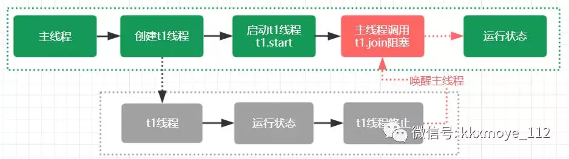

```java
public class Thread implements Runnable {
		//......
    public final void join() throws InterruptedException {
        join(0);
    }
		//......
    public final synchronized void join(long millis) throws InterruptedException {
        long base = System.currentTimeMillis();
        long now = 0;
        if (millis < 0) {
            throw new IllegalArgumentException("timeout value is negative");
        }
        if (millis == 0) { //判断是否携带阻塞的超时时间，等于0表示没有设置超时时间
            while (isAlive()) {//isAlive获取线程状态，无线等待直到previousThread线程结束
                wait(0); //调用Object中的wait方法实现线程的阻塞
            }
        } else { //阻塞直到超时
            while (isAlive()) { 
                long delay = millis - now;
                if (delay <= 0) {
                    break;
                }
                wait(delay);
                now = System.currentTimeMillis() - base;
            }
        }
    }
  	//......
}
```

Thread.join其实底层是通过wait/notifyall来实现线程的通信达到线程阻塞的目的；当线程执行结束以后，会触发两个事情，第一个是设置native线程对象为null、第二个是通过notifyall方法，让等待在previousThread对象锁上的wait方法被唤醒。

### yield()

```java
public class YieldTest extends Thread {
 
	public YieldTest(String name) {
		super(name);
	}
 
	@Override
	public void run() {
		for (int i = 1; i <= 50; i++) {
			System.out.println("" + this.getName() + "-----" + i);
			// 当i为30时，该线程就会把CPU时间让掉，让其他或者自己的线程执行（也就是谁先抢到谁执行）
			if (i == 30) {
				this.yield();
			}
		}
	}
 
	public static void main(String[] args) {
		YieldTest yt1 = new YieldTest("张三");
		YieldTest yt2 = new YieldTest("李四");
		yt1.start();
		yt2.start();
	}
}
//目前电脑都是多核cpu，main方法中多new一些线程才能看出来效果
```

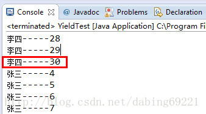

## java栅栏

两个工具类都在java.util.concurrent包下

### CyclicBarrier

线程到达栅栏的位置时调用await方法，该线程会被阻塞，直到所有线程都到达栅栏位置。
当所有线程都到达栅栏位置，那么栅栏将打开，此时所有线程都被释放，栅栏将被重置以便下次使用。

举例说明：

一家人去吃肯德基，当大家都到齐了进行点名，一起进入。

```java
package test;

import java.util.concurrent.BrokenBarrierException;
import java.util.concurrent.CyclicBarrier;

class Solver {

    CyclicBarrier barrier;

    class Worker implements Runnable {

        private String name;

        public Worker(String name) {
            this.name = name;
        }

        public void run() {
            try {
                int await = barrier.await();
                System.out.println("" + name + "第" + await + "个到达门口");
            } catch (InterruptedException ex) {
                return;
            } catch (BrokenBarrierException ex) {
                return;
            }
        }
    }

    public void eatKFC(int numbers) throws InterruptedException {

        Runnable barrierAction = new Runnable() {
            public void run() {
                System.out.println("都到齐了，看看谁先到的");
            }
        };
        barrier = new CyclicBarrier(numbers, barrierAction);
        new Thread(new Worker("你二叔")).start();
        new Thread(new Worker("你大舅")).start();
        new Thread(new Worker("你七大爷")).start();
        new Thread(new Worker("你五叔")).start();
    }

    public static void main(String[] args) {
        Solver solver = new Solver();
        try {
            solver.eatKFC(4);
        } catch (InterruptedException e) {
            e.printStackTrace();
        }
    }
}
```

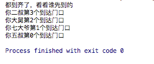

### Exchanger

栅栏的第二种形式
用于交换数据，A线程中的a数据，想和B线程中的b数据交换，当调用exchange时，会实现数据交换

举例说明：

一个班级的小A想和同一班级的小B换座位

```java
package test;

import java.util.concurrent.Exchanger;

class FillAndEmpty {
    Exchanger<Student> exchanger = new Exchanger<Student>();
    Student student1 = new Student("xieyaoyan", 1);
    Student student2 = new Student("yingyinglei", 2);

    class FillingLoop implements Runnable {

        public void run() {
            try {
                System.out.println(student1.getName() + " 收拾书包，走向另一个座位");
                student1 = exchanger.exchange(student1);
                System.out.println("换完座位了，当前座位是： " + student1);
            } catch (InterruptedException ex) {
                System.out.println("FillingLoop.run");
            }
        }
    }

    class EmptyingLoop implements Runnable {

        public void run() {
            try {
                System.out.println(student2.getName() + " 收拾书包，走向另一个座位");
                student2 = exchanger.exchange(student2);
                System.out.println("换完座位了，当前座位是： = " + student2);
            } catch (InterruptedException ex) {
                System.out.println("EmptyingLoop.run");
            }
        }
    }

    void start() {
        new Thread(new FillingLoop()).start();
        new Thread(new EmptyingLoop()).start();
    }

    public static void main(String[] args) {
        FillAndEmpty fillAndEmpty = new FillAndEmpty();
        fillAndEmpty.start();
    }
}

class Student {
    private String name;
    private int id;

    public Student() {
    }

    public Student(String name, int id) {
        this.name = name;
        this.id = id;
    }

    public String getName() {
        return name;
    }

    public void setName(String name) {
        this.name = name;
    }

    public int getId() {
        return id;
    }

    public void setId(int id) {
        this.id = id;
    }

    @Override
    public String toString() {
        return "Student{" + "name='" + name + '\'' + ", id=" + id + '}';
    }
}
```

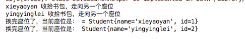

## 多线程编程

### 创建新线程的四种方式

#### 1）继承Thread类创建线程

```java
public class MyThread extends Thread{
   //继承Thread类
   @Override
　　public void run(){
　　	//重写run方法
　　}
}
public class Main {undefined
　　public static void main(String[] args){
　　　　new MyThread().start();//创建并启动线程
　　}
}
```

#### 2）实现Runnable接口创建线程

```java
public class MyThread2 implements Runnable {
   //实现Runnable接口
   @Override
　　public void run(){
　　	//重写run方法
　　}
}
public class Main {undefined
　　public static void main(String[] args){
　　　　//创建并启动线程
　　　　MyThread2 myThread = new MyThread2();
　　　　Thread thread = new Thread(myThread);
　　　　thread().start();
　　　　//或者    new Thread(new MyThread2()).start();
　　}
}
```

#### 3）使用Callable和Future创建线程

call()方法可以有返回值

call()方法可以声明抛出异常

```java
public static class MyThread3 implements Callable{
    @Override
    public Object call() throws Exception {
        return 5;
    }
}

public class Main {
　　public static void main(String[] args){
　　　	MyThread3 th=new MyThread3();
　　　	//也可以直接使用Lambda表达式创建Callable对象
　　   //使用FutureTask类来包装Callable对象
　　　	FutureTask<Integer> future = new FutureTask<Integer>(
        (Callable<Integer>)() -> {
          return 5;
        }
　　  );
　　　new Thread(future,"有返回值的线程").start();//实质上还是以Callable对象来创建并启动线程
　　  try{
      	System.out.println("子线程的返回值："+future.get());//get()方法会阻塞，直到子线程执行结束才返回
 　　 } catch (Exception ex) { 
　　　　	ex.printStackTrace();
　　　}
　	}
}
```


#### 4）使用线程池例如用Executor框架

```java
//创建线程池
//可以往线程池放n个任务，但每次执行只执行3个任务，别的任务在排队
ExecutorService threadPool = Executors.newFixedThreadPool(3);
//缓存的线程池，有几个任务几个线程，动态变化(和fix线程池底层一样，只不过传参不一样，一个线程数固定，一个不固定)
ExecutorService threadPool = Executors.newCachedThreadPool();
//调度型线程池,这个池子里的线程可以按schedule依次delay执行，或周期执行
ExecutorService threadPool = Executors.newScheduledThreadPool(3)
//单线程，线程池只有一个线程
ExecutorService threadPool = Executors.newSingleThreadExecutor();
```

#### 本质

**创建线程本质只有1种，即创建Thread类，以上的所谓创建方式其实是实现run方法的方式**

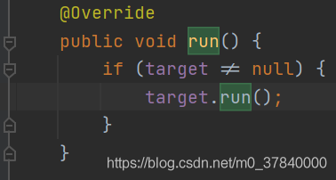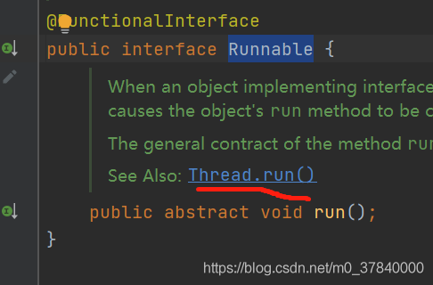

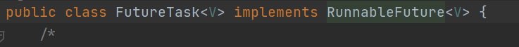

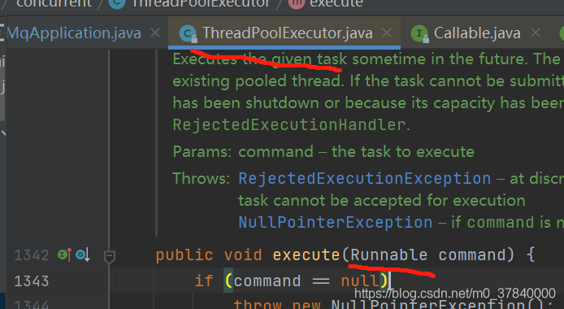

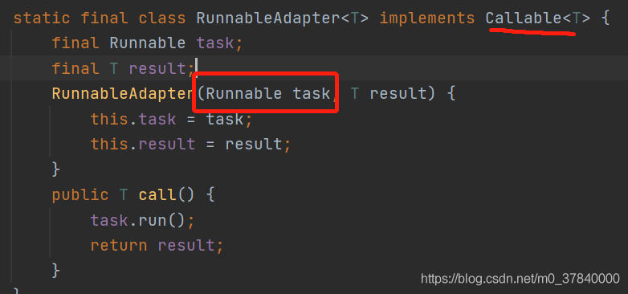

**实现run方法的方式分为两类，你所看到的其他的都是对这两类的封装：**

1、实现runnable接口并重写run方法,并把runnable实例作为target对象，传给thread类，最终调用target.run（不知道target是啥看run()）

2、继承Thread类，重写Thread的run方法,Thread.start会执行run方法

#### 四种创建线程方法对比

实现Runnable和实现Callable接口的方式基本相同，不过是后者执行call()方法有返回值，后者线程执行体run()方法无返回值，因此可以把这两种方式归为一种这种方式与继承Thread类的方法之间的差别如下：

1、线程只是实现Runnable或实现Callable接口，还可以继承其他类。

2、这种方式下，多个线程可以共享一个target对象，非常适合多线程处理同一份资源的情况。

3、但是编程稍微复杂，如果需要访问当前线程，必须调用Thread.currentThread()方法。

4、继承Thread类的线程类不能再继承其他父类（Java单继承）。

5、前三种的线程如果创建关闭频繁会消耗系统资源影响性能，而使用线程池可以不用线程的时候放回线程池，用的时候再从线程池取，项目开发中主要使用线程池

注：在前三种中一般推荐采用实现接口的方式来创建多线程

#### FutureTask详解

一个可取消的异步计算。FutureTask提供了对Future的基本实现，可以调用方法去开始和取消一个计算，可以查询计算是否完成并且获取计算结果。只有当计算完成时才能获取到计算结果，一旦计算完成，计算将不能被重启或者被取消，除非调用runAndReset方法。
除了实现了Future接口以外，FutureTask还实现了Runnable接口，因此FutureTask交由Executor执行，也可以直接用线程调用执行(futureTask.run())。根据FutureTask的run方法执行的时机，FutureTask可以处于以下三种执行状态：
1、未启动：在FutureTask.run()还没执行之前，FutureTask处于未启动状态。当创建一个FutureTask对象，并且run()方法未执行之前，FutureTask处于未启动状态。
2、已启动：FutureTask对象的run方法启动并执行的过程中，FutureTask处于已启动状态。
3、已完成：FutureTask正常执行结束，或者FutureTask执行被取消(FutureTask对象cancel方法)，或者FutureTask对象run方法执行抛出异常而导致中断而结束，FutureTask都处于已完成状态。
FutureTask状态迁移图
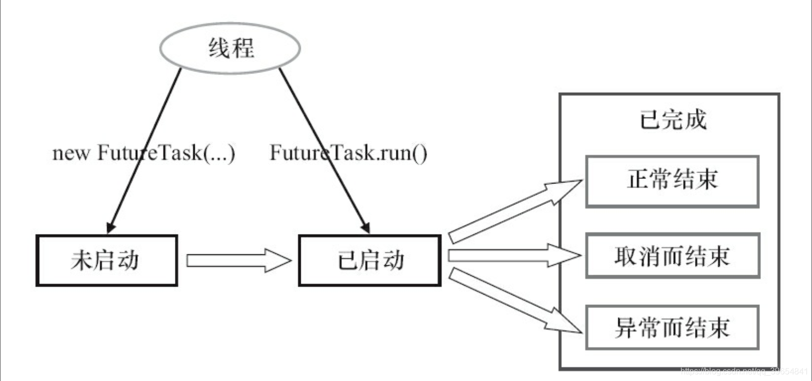

当FutureTask处于未启动或者已启动的状态时，调用FutureTask对象的get方法会将导致调用线程阻塞。当FutureTask处于已完成的状态时，调用FutureTask的get方法会立即放回调用结果或者抛出异常。
当FutureTask处于未启动状态时，调用FutureTask对象的cancel方法将导致线程永远不会被执行；当FutureTask处于已启动状态时，调用FutureTask对象cancel(true)方法将以中断执行此任务的线程的方式来试图停止此任务;当FutureTask处于已启动状态时，调用FutureTask对象cancel(false)方法将不会对正在进行的任务产生任何影响；当FutureTask处于已完成状态时，调用FutureTask对象cancel方法将返回false；
FutureTask的get和cancel的执行示意图
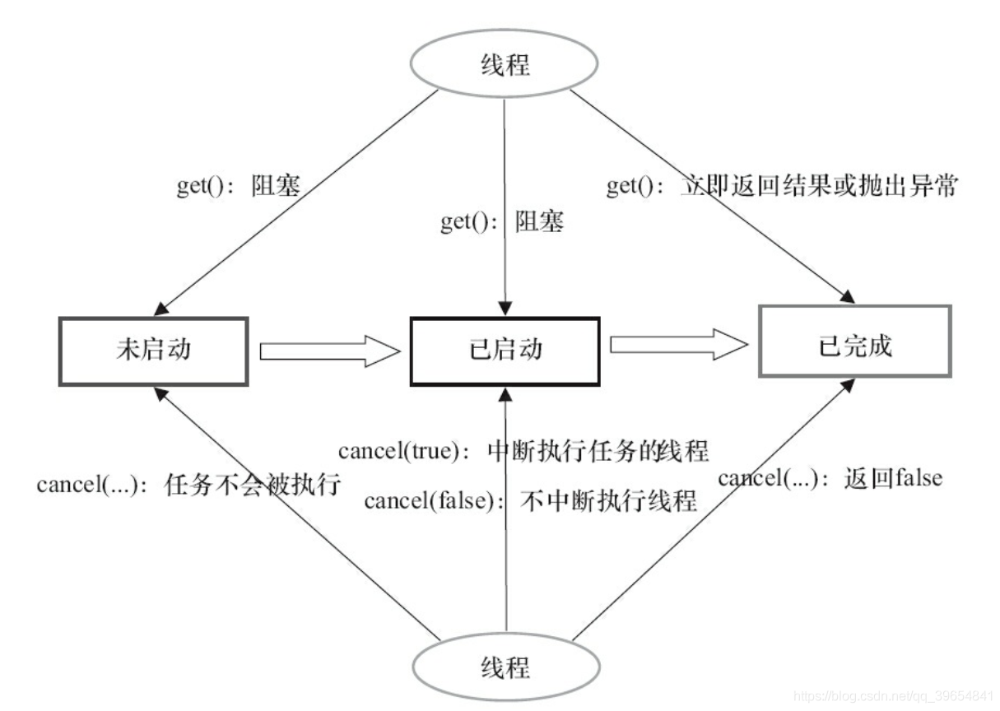

### callable与FutureTask示例

```Java
public class ThreadTest {

    static class WaiMai{}

    static class DianWaiMai implements Callable<Boolean>{
        private WaiMai waimai;

        DianWaiMai(WaiMai waimai){
            this.waimai = waimai;
        }

        @Override
        public Boolean call() throws Exception {
            long waitTime = waimai.hashCode() % 5000;
            Thread.sleep(waitTime);
            return (System.currentTimeMillis() & 1) == 1;
        }
    }
    public static void main(String[] args) throws ExecutionException, InterruptedException {
        ExecutorService threadPool = Executors.newFixedThreadPool(2);
        DianWaiMai dianWaiMai = new DianWaiMai(new WaiMai());
        FutureTask<Boolean> futureTask = new FutureTask((Callable) dianWaiMai);

        System.out.println(System.currentTimeMillis() + " 下单外卖，并且去运动");
        threadPool.execute(futureTask);

        Thread.sleep(2000);
        System.out.println(System.currentTimeMillis() + " 运动结束,看看外卖到了没");

        if (!futureTask.isDone()) {
            System.out.println(System.currentTimeMillis() + " 外卖还没到,在等等吧");
            Thread.sleep(1000);
            if (!futureTask.isDone()) {
                System.out.println(System.currentTimeMillis() + " 妈的外卖还没到,取消，吃食堂去");
                futureTask.cancel(false);
            }
        }
        if (!futureTask.isCancelled()) {
            Boolean res = futureTask.get();
            System.out.println(System.currentTimeMillis() + " 外卖到了");
            if (res) {
                System.out.println("太多了吃撑了");
            } else {
                System.out.println("太少了，不够吃，再去食堂吃一点");
            }
        }
        threadPool.shutdown();
    }
}
```

拿去一跑，一切明了，skr skr~

想看懂上面代码的细节，还需知道以下知识

```java
//FutureTask实现了Callbale和Runnable接口
//dianWaiMai是实现了Callable类的自定义线程类
FutureTask<String> futureTask = new FutureTask<>((Callable) dianWaiMai);

//直接启动线程
Thread thread = new Thread(futureTask);
thread.start();

//或者使用线程池启动线程
threadPool.execute(futureTask);

//是否已完成
boolean done = futureTask.isDone();
//是否已取消
boolean cancelled = futureTask.isCancelled();

//取消运行
futureTask.cancel(true);
//停止线程池的运行
threadPool.shutdown();
```


### 线程与JVM的关系

每个线程都会消耗虚拟机栈中的容量，因为jvm中最大堆容量和栈容量的最大值是相对固定的，所以线程的个数与每个线程所占用的容量之间呈反比。因为JVM的内存大小不能是无限大的所以所以线程并不是可以无限多的。

在多线程环境中，通过不断建立线程的方式可以产生内存溢出异常，代码如下所示。但是这样产生的 OOM 与栈空间是否足够大不存在任何联系，在这种情况下，为每个线程的栈分配的内存足够大，反而越容易产生OOM 异常。这点不难理解，每个线程分配到的栈容量越大，可以建立的线程数就变少，建立多线程时就越容易把剩下的内存耗尽。这点在开发多线程的应用时要特别注意。

**如果建立过多线程导致内存溢出，在不能减少线程数或更换64位虚拟机的情况下，只能通过减少最大堆和减少栈容量来换取更多的线程。**

#### 堆内存大小

##### client模式

初始堆大小：
物理内存的1/64，但最小是8MB。

 

最大堆大小：
在物理内存达到192MB之前，JVM最大堆大小为物理内存的一半；

在物理内存大于192MB，在到达1GB之前，JVM最大堆大小为物理内存的1/4；

大于1GB的物理内存，最大堆大小为256M。


##### server模式：

总体与Client相同，但是最大堆大小可以更大；

最大堆大小：

如果实际内存大于1G，最大堆大小为内存的1/4；在32位JVM下，如果物理内存在4G或更高，最大堆大小可以提升至1GB，如果是在64位JVM下，如果物理内存在128GB或更高，最大堆大小可以提升至32GB。

 

比如：64位机器4G内存，server模式下默认启动JVM，初始堆为64M，最大堆为1G；

**结果如下：初始堆大小为系统内存64/1，堆内存最大为系统内存4/1。**

## linux 32位-64位

通称说 x86也是指 IA32构架CPU，也就是说cpu是32位的，只能安装32位的os了；而x86-64或者IA-64是说cpu支持64位，可以安装64位的os，跑64位的应用

不懂可以看如下总结

CPU 构架      别名         位数

IA32          x86          32位

IA-64         x86-64       64位

在linux中如何区分32位还是64位系统? 

64位 : x86_64  结尾


32位: i386 i486 i586 i686 结尾


 

32位的linux和64位的linux有何不同?

- 1 定位不同

32位是为普通用户设计的

64位是为高科技人员设计的系统  具有高性能和科学计算的能力

- 2 安装要求配置不同

64位的操作系统只能安装在64位(cpu)的电脑上                  程序亦如此（就是不能向下兼容）

32位都可以

- 3 运算速度不同

64位是32位运算速度的2(大约)倍

- 4寻址能力不同 (识别内存的能力不同)

32位系统最多支持4GB内存(实际上也就是3.2GB左右)内存

