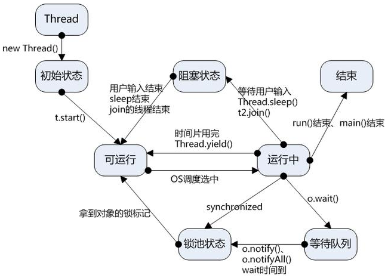
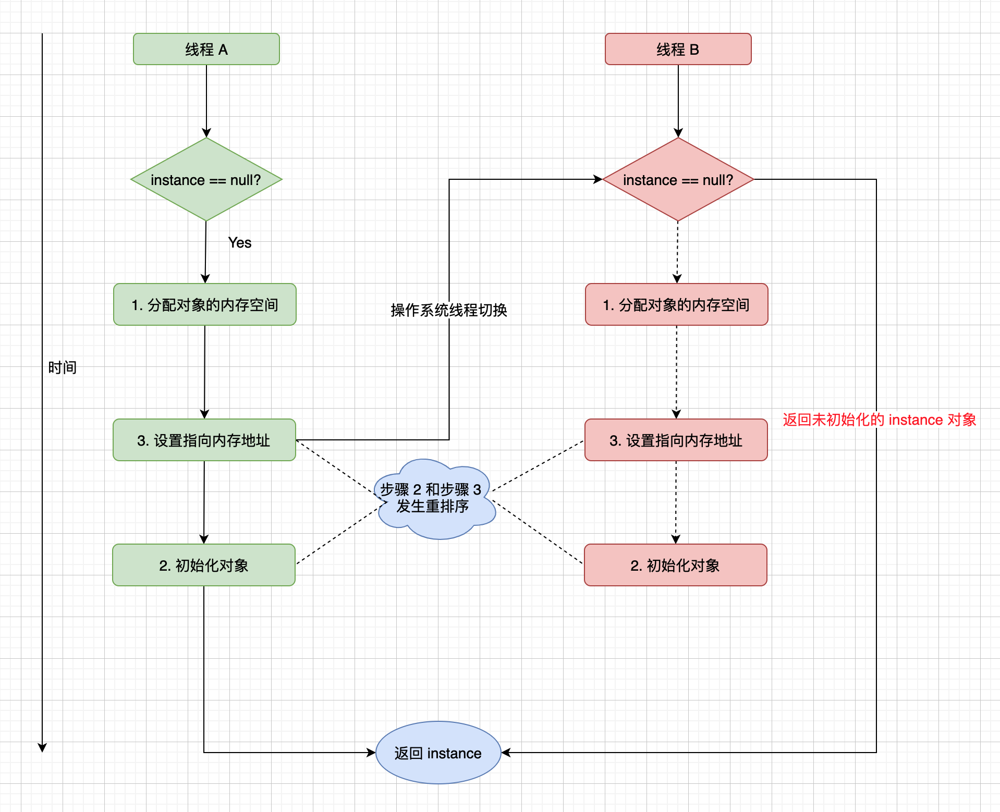
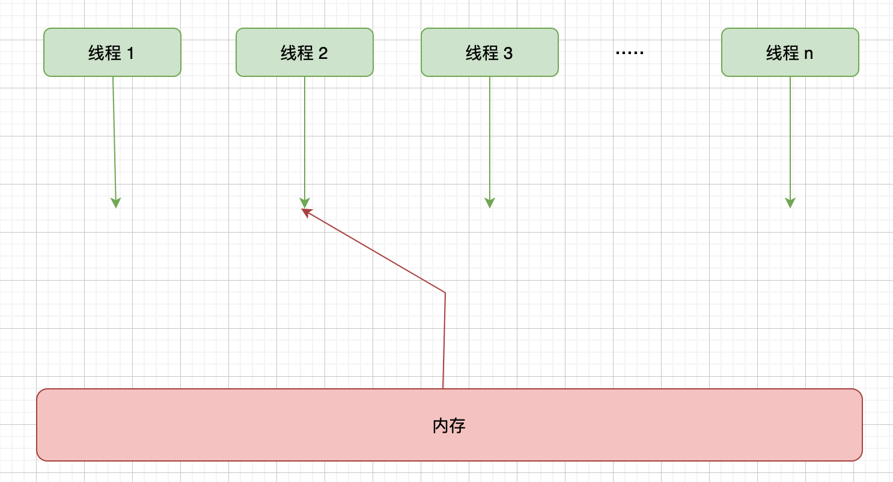
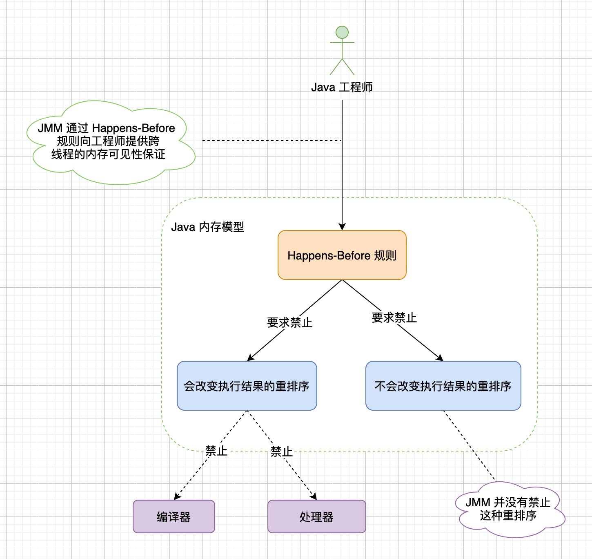
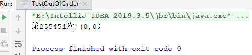
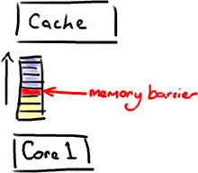
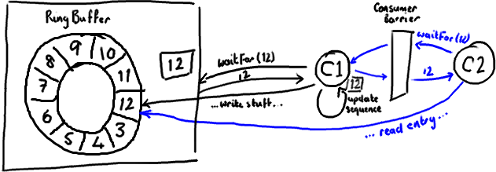
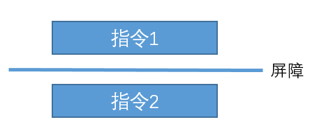
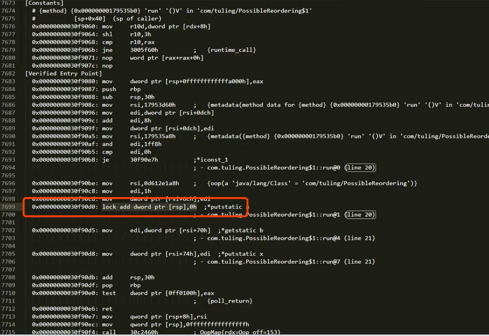

# 线程

****

1、新建状态（New）：新创建了一个线程对象。

2、就绪状态（Runnable）：线程对象创建后，其他线程调用了该对象的start()方法。该状态的线程位于可运行线程池中，变得可运行，等待获取CPU的使用权。

3、运行状态（Running）：就绪状态的线程获取了CPU，执行程序代码。

4、阻塞状态（Blocked）：阻塞状态是线程因为某种原因放弃CPU使用权，暂时停止运行。直到线程进入就绪状态，才有机会转到运行状态。阻塞的情况分三种：

　　（一）、等待阻塞：运行的线程执行wait()方法，JVM会把该线程放入等待池中。

　　（二）、同步阻塞：运行的线程在获取对象的同步锁时，若该同步锁被别的线程占用，则JVM会把该线程放入锁池中。

　　（三）、其他阻塞：运行的线程执行sleep()或join()方法，或者发出了I/O请求时，JVM会把该线程置为阻塞状态。当sleep()状态超时、join()等待线程终止或者超时、或者I/O处理完毕时，线程重新转入就绪状态。

5、死亡状态（Dead）：线程执行完了或者因异常退出了run()方法，该线程结束生命周期。

# 并发之原子性、可见性、有序性

volatile这个关键字可能很多朋友都听说过，或许也都用过。在Java 5之前，它是一个备受争议的关键字，因为在程序中使用它往往会导致出人意料的结果。在Java 5之后，volatile关键字才得以重获生机。

　　volatile关键字虽然从字面上理解起来比较简单，但是要用好不是一件容易的事情。由于volatile关键字是与Java的内存模型有关的，因此在讲述volatile关键之前，我们先来了解一下与内存模型相关的概念和知识，然后分析了volatile关键字的实现原理，最后给出了几个使用volatile关键字的场景。

　　以下是本文的目录大纲：

　　一.内存模型的相关概念

　　二.并发编程中的三个概念

　　三.Java内存模型

　　四..深入剖析volatile关键字

　　五.使用volatile关键字的场景

## 一.内存模型的相关概念

　　大家都知道，计算机在执行程序时，每条指令都是在CPU中执行的，而执行指令过程中，势必涉及到数据的读取和写入。由于程序运行过程中的临时数据是存放在主存（物理内存）当中的，这时就存在一个问题，由于CPU执行速度很快，而从内存读取数据和向内存写入数据的过程跟CPU执行指令的速度比起来要慢的多，因此如果任何时候对数据的操作都要通过和内存的交互来进行，会大大降低指令执行的速度。因此在CPU里面就有了高速缓存。

　　也就是，当程序在运行过程中，会将运算需要的数据从主存复制一份到CPU的高速缓存当中，那么CPU进行计算时就可以直接从它的高速缓存读取数据和向其中写入数据，当运算结束之后，再将高速缓存中的数据刷新到主存当中。举个简单的例子，比如下面的这段代码：

```java
i = i + 1;
```

 　当线程执行这个语句时，会先从主存当中读取的值，然后复制一份到高速缓存当中，然后CPU执行指令对进行加1操作，然后将数据写入高速缓存，最后将高速缓存中最新的值刷新到主存当中。

这个代码在单线程中运行是没有任何问题的，但是在多线程中运行就会有问题了。在多核CPU中，每条线程可能运行于不同的CPU中，因此每个线程运行时有自己的高速缓存（对单核CPU来说，其实也会出现这种问题，只不过是以线程调度的形式来分别执行的）。本文我们以多核CPU为例。

　　比如同时有2个线程执行这段代码，假如初始时i的值为0，那么我们希望两个线程执行完之后i的值变为2。但是事实会是这样吗？

　　可能存在下面一种情况：初始时，两个线程分别读取i的值存入各自所在的CPU的高速缓存当中，然后线程1进行加1操作，然后把i的最新值1写入到内存。此时线程2的高速缓存当中i的值还是0，进行加1操作之后，i的值为1，然后线程2把i的值写入内存。

　　最终结果i的值是1，而不是2。这就是著名的缓存一致性问题。通常称这种被多个线程访问的变量为共享变量。

　　也就是说，如果一个变量在多个CPU中都存在缓存（一般在多线程编程时才会出现），那么就可能存在缓存不一致的问题。

　　为了解决缓存不一致性问题，通常来说有以下2种解决方法：

　　1）通过在总线加LOCK#锁的方式

　　2）通过缓存一致性协议

　　这2种方式都是硬件层面上提供的方式。

　　在早期的CPU当中，是通过在总线上加LOCK#锁的形式来解决缓存不一致的问题。因为CPU和其他部件进行通信都是通过总线来进行的，如果对总线加LOCK#锁的话，也就是说阻塞了其他CPU对其他部件访问（如内存），从而使得只能有一个CPU能使用这个变量的内存。比如上面例子中 如果一个线程在执行 i = i +1，如果在执行这段代码的过程中，在总线上发出了LCOK#锁的信号，那么只有等待这段代码完全执行完毕之后，其他CPU才能从变量i所在的内存读取变量，然后进行相应的操作。这样就解决了缓存不一致的问题。

　　但是上面的方式会有一个问题，由于在锁住总线期间，其他CPU无法访问内存，导致效率低下。

　　所以就出现了缓存一致性协议。最出名的就是Intel 的MESI协议，MESI协议保证了每个缓存中使用的共享变量的副本是一致的。它核心的思想是：当CPU写数据时，如果发现操作的变量是共享变量，即在其他CPU中也存在该变量的副本，会发出信号通知其他CPU将该变量的缓存行置为无效状态，因此当其他CPU需要读取这个变量时，发现自己缓存中缓存该变量的缓存行是无效的，那么它就会从内存重新读取。


## 二.并发编程中的三个概念

　　在并发编程中，我们通常会遇到以下三个问题：原子性问题，可见性问题，有序性问题。我们先看具体看一下这三个概念：

**1.原子性**

　　原子性：即一个操作或者多个操作 要么全部执行并且执行的过程不会被任何因素打断，要么就都不执行。

　　一个很经典的例子就是银行账户转账问题：

　　比如从账户A向账户B转1000元，那么必然包括2个操作：从账户A减去1000元，往账户B加上1000元。

　　试想一下，如果这2个操作不具备原子性，会造成什么样的后果。假如从账户A减去1000元之后，操作突然中止。然后又从B取出了500元，取出500元之后，再执行 往账户B加上1000元 的操作。这样就会导致账户A虽然减去了1000元，但是账户B没有收到这个转过来的1000元。

　　所以这2个操作必须要具备原子性才能保证不出现一些意外的问题。

　　同样地反映到并发编程中会出现什么结果呢？

　　举个最简单的例子，大家想一下假如为一个32位的变量赋值过程不具备原子性的话，会发生什么后果？

```java
i = 9;
```

 　假若一个线程执行到这个语句时，我暂且假设为一个32位的变量赋值包括两个过程：为低16位赋值，为高16位赋值。

　　那么就可能发生一种情况：当将低16位数值写入之后，突然被中断，而此时又有一个线程去读取i的值，那么读取到的就是错误的数据。

**2.可见性**

　　可见性是指当多个线程访问同一个变量时，一个线程修改了这个变量的值，其他线程能够立即看得到修改的值。

　　举个简单的例子，看下面这段代码：

```java
//线程1执行的代码
int i = 0;
i = 10;
//线程2执行的代码
j = i;
```

 　假若执行线程1的是CPU1，执行线程2的是CPU2。由上面的分析可知，当线程1执行 i =10这句时，会先把i的初始值加载到CPU1的高速缓存中，然后赋值为10，那么在CPU1的高速缓存当中i的值变为10了，却没有立即写入到主存当中。

　　此时线程2执行 j = i，它会先去主存读取i的值并加载到CPU2的缓存当中，注意此时内存当中i的值还是0，那么就会使得j的值为0，而不是10.

　　这就是可见性问题，线程1对变量i修改了之后，线程2没有立即看到线程1修改的值。

**3.有序性**

　　有序性：即程序执行的顺序按照代码的先后顺序执行。举个简单的例子，看下面这段代码：

```java
int i = 0;
boolean flag = false;
//语句1 
i = 1;        
//语句2
flag = true;
```

 　上面代码定义了一个int型变量，定义了一个boolean类型变量，然后分别对两个变量进行赋值操作。从代码顺序上看，语句1是在语句2前面的，那么JVM在真正执行这段代码的时候会保证语句1一定会在语句2前面执行吗？不一定，为什么呢？这里可能会发生指令重排序（Instruction Reorder）。

　　下面解释一下什么是指令重排序，一般来说，处理器为了提高程序运行效率，可能会对输入代码进行优化，它不保证程序中各个语句的执行先后顺序同代码中的顺序一致，但是它会保证程序最终执行结果和代码顺序执行的结果是一致的。

　　比如上面的代码中，语句1和语句2谁先执行对最终的程序结果并没有影响，那么就有可能在执行过程中，语句2先执行而语句1后执行。

　　但是要注意，虽然处理器会对指令进行重排序，但是它会保证程序最终结果会和代码顺序执行结果相同，那么它靠什么保证的呢？再看下面一个例子：

```java
//语句1
int a = 10;
//语句2
int r = 2;
//语句3
a = a + 3;
//语句4
r = a * a;
```

 　这段代码有4个语句，那么可能的一个执行顺序是：

　　

 

　　

　　那么可不可能是这个执行顺序呢： 语句2  语句1  语句4  语句3

　　不可能，因为处理器在进行重排序时是会考虑指令之间的数据依赖性，如果一个指令Instruction 2必须用到Instruction 1的结果，那么处理器会保证Instruction 1会在Instruction 2之前执行。

　　虽然重排序不会影响单个线程内程序执行的结果，但是多线程呢？下面看一个例子：

```java
//线程1:
//语句1
context = loadContext();
//语句2
inited = true;
//线程2:
while (!inited ) {
	sleep()
}
doSomethingwithconfig(context);
```

 　上面代码中，由于语句1和语句2没有数据依赖性，因此可能会被重排序。假如发生了重排序，在线程1执行过程中先执行语句2，而此是线程2会以为初始化工作已经完成，那么就会跳出while循环，去执行doSomethingwithconfig(context)方法，而此时context并没有被初始化，就会导致程序出错。

 　从上面可以看出，指令重排序不会影响单个线程的执行，但是会影响到线程并发执行的正确性。

**cup指令重排**（详见下一章）

决办法就是内存屏障，也叫内存栅栏。是一种屏障指令，cpu指令。Java中的实现方式就是使用volatile关键字，既可以解决可见性，又可以禁止指令重排。

硬件层的内存屏障有

Load Barrier
 和 
Store Barrier

volatile做了什么？
在一个变量被volatile修饰后，JVM会为我们做两件事：
1.在每个volatile写操作前插入StoreStore屏障，在写操作后插入StoreLoad屏障。

2.在每个volatile读操作前插入LoadLoad屏障，在读操作后插入LoadStore屏障

　　也就是说，要想并发程序正确地执行，必须要保证原子性、可见性以及有序性。只要有一个没有被保证，就有可能会导致程序运行不正确。

## 三.Java内存模型

　　在前面谈到了一些关于内存模型以及并发编程中可能会出现的一些问题。下面我们来看一下Java内存模型，研究一下Java内存模型为我们提供了哪些保证以及在java中提供了哪些方法和机制来让我们在进行多线程编程时能够保证程序执行的正确性。

　　在Java虚拟机规范中试图定义一种Java内存模型（Java Memory Model，JMM）来屏蔽各个硬件平台和操作系统的内存访问差异，以实现让Java程序在各种平台下都能达到一致的内存访问效果。那么Java内存模型规定了哪些东西呢，它定义了程序中变量的访问规则，往大一点说是定义了程序执行的次序。注意，为了获得较好的执行性能，Java内存模型并没有限制执行引擎使用处理器的寄存器或者高速缓存来提升指令执行速度，也没有限制编译器对指令进行重排序。也就是说，在java内存模型中，也会存在缓存一致性问题和指令重排序的问题。

　　Java内存模型规定所有的变量都是存在主存当中（类似于前面说的物理内存），每个线程都有自己的工作内存（类似于前面的高速缓存）。线程对变量的所有操作都必须在工作内存中进行，而不能直接对主存进行操作。并且每个线程不能访问其他线程的工作内存。

　　举个简单的例子：在java中，执行下面这个语句：

```
i = 10;
```

 　执行线程必须先在自己的工作线程中对变量i所在的缓存行进行赋值操作，然后再写入主存当中。而不是直接将数值10写入主存当中。

通常，在线程之间的通讯方式有共享内存和消息传递两种，很明显，Java 采用的是第一种即**共享的内存模型**，在共享的内存模型里，多线程之间共享程序的公共状态，通过读-写内存的方式来进行隐式通讯。

从抽象的角度来看，JMM 其实是`定义了线程和主内存之间的关系`，首先，多个线程之间的共享变量存储在主内存之中，同时每个线程都有一个自己私有的本地内存，本地内存中存储着该线程读或写共享变量的副本（注意：本地内存是 JMM 定义的抽象概念，实际上并不存在）。抽象模型如下图所示：


在这个抽象的内存模型中，在两个线程之间的通信（共享变量状态变更）时，会进行如下两个步骤：

1. 线程 A 把在本地内存更新后的共享变量副本的值，刷新到主内存中。
2. 线程 B 在使用到该共享变量时，到主内存中去读取线程 A 更新后的共享变量的值，并更新线程 B 本地内存的值。

JMM 本质上是在硬件（处理器）内存模型之上又做了一层抽象，使得应用开发人员只需要了解 JMM 就可以编写出正确的并发代码，而无需过多了解硬件层面的内存模型。

### 为什么需要 Java 内存模型

在日常的程序开发中，为一些共享变量赋值的场景会经常碰到，假设一个线程为整型共享变量 `count` 做赋值操作（`count = 9527;`），此时就会有一个问题，其它读取该共享变量的线程在什么情况下获取到的变量值为 `9527` 呢？如果缺少同步的话，会有很多因素导致其它读取该变量的线程无法立即甚至是永远都无法看到该变量的最新值。

比如缓存就可能会改变写入共享变量副本提交到主内存的次序，保存在本地缓存的值，对于其它线程是不可见的；编译器为了优化性能，有时候会改变程序中语句执行的先后顺序，这些因素都有可能会导致其它线程无法看到共享变量的最新值。

在文章开头，提到了 `JMM` 主要是为了解决`可见性`和`有序性`问题，那么首先就要先搞清楚，导致`可见性`和`有序性`问题发生的本质原因是什么？现在的服务绝大部分都是运行在多核 CPU 的服务器上，每颗 CPU 都有自己的缓存，这时 CPU 缓存与内存的数据就会有一致性问题了，当一个线程对共享变量的修改，另外一个线程无法立刻看到。导致可见性问题的本质原因是**缓存**。


有序性是指代码实际的执行顺序和代码定义的顺序一致，编译器为了优化性能，虽然会遵守 `as-if-serial` 语义（不管怎么重排序，在单线程下的执行结果不能改变），不过有时候编译器及解释器的优化也可能引发一些问题。比如：双重检查来创建单实例对象。下面是使用双重检查来实现延迟创建单例对象的代码：

```java
/**
 * @author mghio
 * @since 2021-08-22
 */
public class DoubleCheckedInstance {

  private static DoubleCheckedInstance instance;

  public static DoubleCheckedInstance getInstance() {
    if (instance == null) {
      synchronized (DoubleCheckedInstance.class) {
        if (instance == null) {
          instance = new DoubleCheckedInstance();
        }
      }
    }
    return instance;
  } 
}
```

这里的 `instance = new DoubleCheckedInstance();`，看起来 `Java` 代码只有一行，应该是无法就行重排序的，实际上其编译后的实际指令是如下三步：

1. 分配对象的内存空间
2. 初始化对象
3. 设置 instance 指向刚刚已经分配的内存地址

上面的第 2 步和第 3 步如果改变执行顺序也不会改变单线程的执行结果，也就是说可能会发生重排序，下图是一种多线程并发执行的场景：



此时线程 B 获取到的 `instance` 是没有初始化过的，如果此来访问 `instance` 的成员变量就可能触发空指针异常。导致`有序性`问题的本质原因是编译器优化。那你可能会想既然缓存和编译器优化是导致可见性问题和有序性问题的原因，那直接禁用掉不就可以彻底解决这些问题了吗，但是如果这么做了的话，程序的性能可能就会受到比较大的影响了。

其实可以换一种思路，能不能把这些禁用缓存和编译器优化的权利交给编码的工程师来处理，他们肯定最清楚什么时候需要禁用，这样就只需要提供按需禁用缓存和编译优化的方法即可，使用比较灵活。因此`Java 内存模型`就诞生了，它规范了 JVM 如何提供按需禁用缓存和编译优化的方法，规定了 JVM 必须遵守一组最小的保证，这个最小保证规定了线程对共享变量的写入操作何时对其它线程可见。

### 顺序一致性内存模型

顺序一致性模型是一个理想化后的理论参考模型，处理器和编程语言的内存模型的设计都是参考的顺序一致性模型理论。其有如下两大特性：

1. 一个线程中的所有操作必须按照程序的顺序来执行
2. 所有的线程都只能看到一个单一的执行操作顺序，不管程序是否同步

在工程师视角下的顺序一致性模型如下：



顺序一致性模型有一个单一的全局内存，这个全局内存可以通过左右摇摆的开关可以连接到任意一个线程，每个线程都必须按照程序的顺序来执行内存的读和写操作。该理想模型下，任务时刻都只能有一个线程可以连接到内存，当多个线程并发执行时，就可以通过开关就可以把多个线程的读和写操作**串行化**。

顺序一致性模型中，所有操操作完全按照顺序串行执行，但是在 JMM 中就没有这个保证了，`未同步的程序`在 JMM 中不仅程序的执行顺序是无序的，而且由于本地内存的存在，所有线程看到的操作顺序也可能会不一致，比如一个线程把写共享变量保存在本地内存中，在还没有刷新到主内存前，其它线程是不可见的，只有更新到主内存后，其它线程才有可能看到。

JMM 对在`正确同步的程序`做了顺序一致性的保证，也就是程序的执行结果和该程序在顺序一致性内存模型中的执行结果相同。

### Happens-Before 规则

`Happens-Before` 规则是 JMM 中的核心概念，`Happens-Before` 概念最开始在 [这篇论文](https://lamport.azurewebsites.net/pubs/time-clocks.pdf) 提出，其在论文中使用 `Happens-Before` 来定义分布式系统之间的偏序关系。在 [JSR-133](https://download.oracle.com/otndocs/jcp/memory_model-1.0-pfd-spec-oth-JSpec) 中使用 `Happens-Before` 来指定两个操作之间的执行顺序。

JMM 正是通过这个规则来保证跨线程的内存可见性，`Happens-Before` 的含义是`前面一个对共享变量的操作结果对该变量的后续操作是可见的`，约束了编译器的优化行为，虽然允许编译器优化，但是优化后的代码必须要满足 `Happens-Before` 规则，这个规则给工程师做了这个保证：同步的多线程程序是按照 `Happens-Before` 指定的顺序来执行的。目的就是`为了在不改变程序（单线程或者正确同步的多线程程序）执行结果的前提下，尽最大可能的提高程序执行的效率`。



`JSR-133` 规范中定了如下 6 项 `Happens-Before` 规则：

1. **程序顺序规则：**一个线程中的每个操作，`Happens-Before` 该线程中的任意后续操作
2. **监视器锁规则：**对一个锁的解锁操作，`Happens-Before` 于后面对这个锁的加锁操作
3. **volatile 规则**对一个 `volatile` 类型的变量的写操作，`Happens-Before` 与任意后面对这个 `volatile` 变量的读操作
4. **传递性规则：**如果操作 A `Happens-Before` 于操作 B，并且操作 B `Happens-Before` 于操作 C，则操作 A `Happens-Before` 于操作 C
5. **start() 规则：**如果一个线程 A 执行操作 `threadB.start()` 启动线程 B，那么线程 A 的 `start()` 操作 `Happens-Before` 于线程 B 的任意操作
6. **join() 规则：**如果线程 A 执行操作 `threadB.join()` 并成功返回，那么线程 B 中的任意操作 `Happens-Before` 于线程 A 从 `threadB.join()` 操作成功返回

JMM 的一个基本原则是：只要不改变单线程和正确同步的多线程的执行结果，编译器和处理器随便怎么优化都可以，实际上对于应用开发人员对于两个操作是否真的被重排序并不关心，真正关心的是执行结果不能被修改。因此 `Happens-Before` 本质上和 `sa-if-serial` 的语义是一致的，只是 `sa-if-serial` 只是保证在单线程下的执行结果不被改变。

### 总结

本文主要介绍了内存模型的相关基础知识和相关概念，JMM 屏蔽了不同处理器内存模型之间的差异，在不同的处理器平台上给应用开发人员抽象出了统一的 `Java 内存模型（JMM）`。常见的处理器内存模型比 JMM 的要弱，因此 JVM 会在生成字节码指令时在适当的位置插入内存屏障（内存屏障的类型会因处理器平台而有所不同）来限制部分重排序。

那么Java语言 本身对 原子性、可见性以及有序性提供了哪些保证呢？

**1.原子性**

　　在Java中，对基本数据类型的变量的读取和赋值操作是原子性操作，即这些操作是不可被中断的，要么执行，要么不执行。

　　上面一句话虽然看起来简单，但是理解起来并不是那么容易。看下面一个例子：

　　请分析以下哪些操作是原子性操作：

```
//语句1
x = 10;
//语句2
y = x;
//语句3
x++;
//语句4
x = x + 1;
```

 　咋一看，有些朋友可能会说上面的4个语句中的操作都是原子性操作。其实只有语句1是原子性操作，其他三个语句都不是原子性操作。

　　语句1是直接将数值10赋值给x，也就是说线程执行这个语句的会直接将数值10写入到工作内存中。

　　语句2实际上包含2个操作，它先要去读取x的值，再将x的值写入工作内存，虽然读取x的值以及 将x的值写入工作内存 这2个操作都是原子性操作，但是合起来就不是原子性操作了。

　　同样的，x++和 x = x+1包括3个操作：读取x的值，进行加1操作，写入新的值。

 　所以上面4个语句只有语句1的操作具备原子性。

　　也就是说，只有简单的读取、赋值（而且必须是将数字赋值给某个变量，变量之间的相互赋值不是原子操作）才是原子操作。

　　不过这里有一点需要注意：在32位平台下，对64位数据的读取和赋值是需要通过两个操作来完成的，不能保证其原子性。但是好像在最新的JDK中，JVM已经保证对64位数据的读取和赋值也是原子性操作了。

　　从上面可以看出，Java内存模型只保证了基本读取和赋值是原子性操作，如果要实现更大范围操作的原子性，可以通过synchronized和Lock来实现。由于synchronized和Lock能够保证任一时刻只有一个线程执行该代码块，那么自然就不存在原子性问题了，从而保证了原子性。

**2.可见性**

　　对于可见性，Java提供了volatile关键字来保证可见性。

　　当一个共享变量被volatile修饰时，它会保证修改的值会立即被更新到主存，当有其他线程需要读取时，它会去内存中读取新值。

　　而普通的共享变量不能保证可见性，因为普通共享变量被修改之后，什么时候被写入主存是不确定的，当其他线程去读取时，此时内存中可能还是原来的旧值，因此无法保证可见性。

　　另外，通过synchronized和Lock也能够保证可见性，synchronized和Lock能保证同一时刻只有一个线程获取锁然后执行同步代码，并且在释放锁之前会将对变量的修改刷新到主存当中。因此可以保证可见性。

**3.有序性**

　　在Java内存模型中，允许编译器和处理器对指令进行重排序，但是重排序过程不会影响到单线程程序的执行，却会影响到多线程并发执行的正确性。

　　在Java里面，可以通过volatile关键字来保证一定的“有序性”（具体原理在下一节讲述）。另外可以通过synchronized和Lock来保证有序性，很显然，synchronized和Lock保证每个时刻是有一个线程执行同步代码，相当于是让线程顺序执行同步代码，自然就保证了有序性。

　　另外，Java内存模型具备一些先天的“有序性”，即不需要通过任何手段就能够得到保证的有序性，这个通常也称为 happens-before 原则。如果两个操作的执行次序无法从happens-before原则推导出来，那么它们就不能保证它们的有序性，虚拟机可以随意地对它们进行重排序。

　　下面就来具体介绍下happens-before原则（先行发生原则）：

- 程序次序规则：一个线程内，按照代码顺序，书写在前面的操作先行发生于书写在后面的操作
- 锁定规则：一个unLock操作先行发生于后面对同一个锁额lock操作
- volatile变量规则：对一个变量的写操作先行发生于后面对这个变量的读操作
- 传递规则：如果操作A先行发生于操作B，而操作B又先行发生于操作C，则可以得出操作A先行发生于操作C
- 线程启动规则：Thread对象的start()方法先行发生于此线程的每个一个动作
- 线程中断规则：对线程interrupt()方法的调用先行发生于被中断线程的代码检测到中断事件的发生
- 线程终结规则：线程中所有的操作都先行发生于线程的终止检测，我们可以通过Thread.join()方法结束、Thread.isAlive()的返回值手段检测到线程已经终止执行
- 对象终结规则：一个对象的初始化完成先行发生于他的finalize()方法的开始

　　这8条原则摘自《深入理解Java虚拟机》。

　　这8条规则中，前4条规则是比较重要的，后4条规则都是显而易见的。

　　下面我们来解释一下前4条规则：

　　对于程序次序规则来说，我的理解就是一段程序代码的执行在单个线程中看起来是有序的。注意，虽然这条规则中提到“书写在前面的操作先行发生于书写在后面的操作”，这个应该是程序看起来执行的顺序是按照代码顺序执行的，因为虚拟机可能会对程序代码进行指令重排序。虽然进行重排序，但是最终执行的结果是与程序顺序执行的结果一致的，它只会对不存在数据依赖性的指令进行重排序。因此，在单个线程中，程序执行看起来是有序执行的，这一点要注意理解。事实上，这个规则是用来保证程序在单线程中执行结果的正确性，但无法保证程序在多线程中执行的正确性。

　　第二条规则也比较容易理解，也就是说无论在单线程中还是多线程中，同一个锁如果出于被锁定的状态，那么必须先对锁进行了释放操作，后面才能继续进行lock操作。

　　第三条规则是一条比较重要的规则，也是后文将要重点讲述的内容。直观地解释就是，如果一个线程先去写一个变量，然后一个线程去进行读取，那么写入操作肯定会先行发生于读操作。

　　第四条规则实际上就是体现happens-before原则具备传递性。

## CPU指令重排与缓存一致性

### 什么是cpu指令重排（有序性）

```java
private int x = 0, y = 0;
private int a = 0, b =0;

@Test
public void test() throws InterruptedException {
  int i = 0;
  for(;;) {
    i++;
    x = 0; y = 0;
    a = 0; b = 0;
    Thread one = new Thread(() -> {
      a = 1;
      x = b;
    });

    Thread other = new Thread(() -> {
      b = 1;
      y = a;
    });
    one.start();
    other.start();
    one.join();
    other.join();
    System.out.println("第" + i + "次尝试");
    String result = "第" + i + "次 (" + x + "," + y + "）";
    if(x == 0 && y == 0) {
      System.err.println(result);
      break;
    } else {
      //System.out.println(result);
    }
  }
}
//结果 mac os下执行到一百多万次依旧没有同时触发指令重排，公司的老windows电脑下执行不到一千次就成功触发了指令重排
```



因为存在指令重排，导致在多线程情况下，代码的执行结果并非我们所预期的那样（单线程下根本无需考虑并发问题）

JVM在执行Java代码时，会对代码进行编译优化，也会出现指令重排序的问题。
不同的是，CPU乱序执行是硬件级别的，而JVM的指令重排是虚拟机级别的。

### 内存屏障

#### 什么是内存屏障？

它是一个CPU指令。没错，又一次，我们在讨论CPU级别的东西，以便获得我们想要的性能（Martin著名的 Mechanical Sympathy理论）。基本上，它是这样一条指令： a)确保一些特定操作执行的顺序； b)影响一些数据的可见性(可能是某些指令执行后的结果)。

编译器和CPU可以在保证输出结果一样的情况下对指令重排序，使性能得到优化。插入一个内存屏障，相当于告诉CPU和编译器先于这个命令的必须先执行，后于这个命令的必须后执行。正如去拉斯维加斯旅途中各个站点的先后顺序在你心中都一清二楚。

、

内存屏障另一个作用是强制更新一次不同CPU的缓存。例如，一个写屏障会把这个屏障前写入的数据刷新到缓存，这样任何试图读取该数据的线程将得到最新值，而不用考虑到底是被哪个cpu核心或者哪颗CPU执行的。

**和Java有什么关系？**

现在我知道你在想什么——这不是汇编程序。它是Java。

这里有个神奇咒语叫volatile(我觉得这个词在Java规范中从未被解释清楚)。如果你的字段是volatile，Java内存模型将在写操作后插入一个写屏障指令，在读操作前插入一个读屏障指令。


这意味着如果你对一个volatile字段进行写操作，你必须知道：

1、一旦你完成写入，任何访问这个字段的线程将会得到最新的值。

2、在你写入前，会保证所有之前发生的事已经发生，并且任何更新过的数据值也是可见的，因为内存屏障会把之前的写入值都刷新到缓存。

**举个例子呗！**

[RingBuffer](http://code.google.com/p/disruptor/source/browse/trunk/code/src/main/com/lmax/disruptor/RingBuffer.java)的指针(cursor)（译注：指向队尾元素）属于一个神奇的volatile变量，同时也是我们能够不用锁操作就能实现Disruptor的原因之一。


生产者将会取得下一个[Entry](http://code.google.com/p/disruptor/source/browse/trunk/code/src/main/com/lmax/disruptor/AbstractEntry.java?spec=svn109&r=201)（或者是一批）,并可对它（们）作任意改动， 把它（们）更新为任何想要的值。[如你所知](http://ifeve.com/dissecting-the-disruptor-writing-to-the-ring-buffer/)， 在所有改动都完成后，生产者对ring buffer调用commit方法来更新序列号（译注:把cursor更新为该Entry的序列号）。对volatile字段(cursor)的写操作创 建了一个内存屏障，这个屏障将刷新所有缓存里的值（或者至少相应地使得缓存失效）。

这时候，消费者们能获得最新的序列号码(8)，并且因为内存屏障保证了它之前执行的指令的顺序，消费者们可以确信生产者对7号Entry所作的改动已经可用。

**那么消费者那边会发生什么？**

消费者中的序列号是volatile类型的，会被若干个外部对象读取——其他的[下游消费者](http://mechanitis.blogspot.com/2011/07/dissecting-disruptor-wiring-up.html)可能在跟踪这个消费者。[ProducerBarrier](http://code.google.com/p/disruptor/source/browse/trunk/code/src/main/com/lmax/disruptor/ProducerBarrier.java?spec=svn109&r=201)/[RingBuffer](http://code.google.com/p/disruptor/source/browse/trunk/code/src/main/com/lmax/disruptor/RingBuffer.java?spec=svn109&r=242)(取决于你看的是旧的还是新的代码)跟踪它以确保环没有出现重叠（wrap）的情况（译注：为了防止下游的消费者和上游的消费者对同一个Entry竞争消费，导致在环形队列中互相覆盖数据，下游消费者要对上游消费者的消费情况进行跟踪）。



所以，如果你的下游消费者(C2)看见前一个消费者(C1)在消费号码为12的Entry，当C2的读取也到了12，它在更新序列号前将可以获得C1对该Entry的所作的更新。

基本来说就是，C1更新序列号前对ring buffer的所有操作（如上图黑色所示），必须先发生，待C2拿到C1更新过的序列号之后，C2才可以为所欲为（如上图蓝色所示）。

**对性能的影响**

内存屏障作为另一个CPU级的指令，没有[锁那样大的开销](http://ifeve.com/locks-are-bad/)。内核并没有在多个线程间干涉和调度。但凡事都是有代价的。内存屏障的确是有开销的——编译器/cpu不能重排序指令，导致不可以尽可能地高效利用CPU，另外刷新缓存亦会有开销。所以不要以为用volatile代替锁操作就一点事都没。

**总结**

内存屏障是CPU指令，它允许你对数据什么时候对其他进程可见作出假设。在Java里，你使用volatile关键字来实现内存屏障。使用volatile意味着你不用被迫选择加锁，并且还能让你获得性能的提升。

但是，你需要对你的设计进行一些更细致的思考，特别是你对volatile字段的使用有多频繁，以及对它们的读写有多频繁。


如果不想让CPU在执行某些指令时乱序执行，就到用到内存屏障。
在CPU对内存做操作时添加一个屏障，这个屏障前后的指令不能被打乱。
如下图，在指令1和指令2之间添加了屏障，则指令1 和指令2 的执行顺序不可颠倒。


> lfence：读屏障，在lfence指令前的写操作必须在lfence指令后的写操作之前完成
> mfence：读写屏障， 在mfence指令前的读写操作必须在mfence指令后的读写操作之前完成
> sfence：写屏障，在sfence指令前的写操作必须在sfence指令后的写操作之前完成

除此之外，总线锁的方式(Lock指令)也可以禁止乱序执行。但是效率相对较低。因为Lock指令会在执行时锁住内存子系统来确保执行顺徐和缓存数据一致性。

#### JSR内存屏障

JSR (JavaSpecification Requests) 译为Java 规范提案。是java开发者以及授权者指定的标准。现已称为Java界的一个重要标准。

JSR规范了4种JVM层级的内存屏障：

> LoadLoadBarrier： LoadLoad屏障，  屏障后的 读操作 要在屏障前的 读操作 完成之后执行。 
> LoadStoreBarrier： LoadStore屏障， 屏障后的 写操作 要在屏障前的 读操作 完成之后执行。
> StoreStoreBarrier： StoreStore屏障，屏障后的 写操作 要在屏障前的 写操作 完成之后执行。
> StoreLoadBarrier： StoreLoad屏障， 屏障后的 读操作 要在屏障前的 写操作 完成之后执行。

这4种内存屏障是JVM的规范，具体的实现方式还是依据不同CPU各自的实现为准。

#### happens-before原则（JVM规定的指令重排序必须遵守的规则）

在Java内存模型中，happens-before的意思是前一个操作的结果可以被后续操作获取。为了避免编译优化导致的指令重排序对并发编程安全性的影响，需要happens-before规则定义一些禁止编译优化的场景。

> 程序次序规则：在一个线程内一段代码的执行结果是有序的。就是还会指令重排，但是随便它怎么排，结果是按照我们代码的顺序生成的不会变。
>
> 管程锁定规则：就是无论是在单线程环境还是多线程环境，对于同一个锁来说，一个线程对这个锁解锁之后，另一个线程获取了这个锁都能看到前一个线程的操作结果！(管程是一种通用的同步原语，synchronized就是管程的实现）
>
> volatile变量规则：就是如果一个线程先去写一个volatile变量，然后一个线程去读这个变量，那么这个写操作的结果一定对读的这个线程可见。
>
> 线程启动规则：在主线程A执行过程中，启动子线程B，那么线程A在启动子线程B之前对共享变量的修改结果对线程B可见。
>
> 线程终止规则：在主线程A执行过程中，子线程B终止，那么线程B在终止之前对共享变量的修改结果在线程A中可见。也称线程join()规则。
>
> 线程中断规则：对线程interrupt()方法的调用先行发生于被中断线程代码检测到中断事件的发生，可以通过Thread.interrupted()检测到是否发生中断。
>
> 传递性规则：这个简单的，就是happens-before原则具有传递性，即hb(A, B) ， hb(B, C)，那么hb(A, C)。
>
> 对象终结规则：这个也简单的，就是一个对象的初始化的完成，也就是构造函数执行的结束一定 happens-before它的finalize()方法。

CPU原语lock指令

lock指令是CPU级别的汇编指令，在Java中volatile和synchronized关键字的底层实现都用到了这个指令。
在执行lock后面指令时，会设置处理器的LOCK#信号。这个信号会锁定总线，阻止其它CPU通过总线访问内存，直到这些指令执行结束。这些指令的执行是原子性的。

lock指令主要有两大作用：

> 保持CPU缓存的数据一致性
> 起到内存屏障的作用，LOCK指令前后的指令无法乱序执行

#### volatile的底层实现

**JVM层级：**

被volatile修饰的变量,JVM编译器会做如下处理：

> 在涉及到该变量的读操作之前，加LoadLoad屏障， 写操作之后， 加LoadStore屏障
> 在涉及到该变量的写操作之前，加StoreStore屏障， 写操作之后， 加StoreLoad屏障

**CPU层级：**

> 使用cpu原语lock指令（lock addl$0x0，(%esp)）, 把CPU中ESP寄存器的值加0
> 其实lock后面部分命令并没有什么作用，主要起作用的是这个LOCK指令。这个指令上面已经说过

总结：volatile其实就是在底层使用 lock 指令来实现 「防止指令重排」和「内存可见」的特性。

### 三级缓存与MESI协议（可见行的实现）

程序中CPU计算+与内存交互（读取，赋值），CPU计算速度远远高于与内存交互的速度（好比内存与查数据库）引入缓存提高速度，缓存一致性是保证数据准确性的硬件协议。指令重排无法逾越内存屏障。
缓存一致性的实现，先看看x86的cpu缓存结构。


1、各种寄存器，用来存储本地变量和函数参数，访问一次需要1cycle，耗时小于1ns；
2、L1 Cache，一级缓存，本地core的缓存，分成32K的数据缓存L1d和32k指令缓存L1i，访问L1需要3cycles，耗时大约1ns；
3、L2 Cache，二级缓存，本地core的缓存，被设计为L1缓存与共享的L3缓存之间的缓冲，大小为256K，访问L2需要12cycles，耗时大约3ns；
4、L3 Cache，三级缓存，在同插槽的所有core共享L3缓存，分为多个2M的段，访问L3需要38cycles，耗时大约12ns；

当然了，还有平时熟知的DRAM，访问内存一般需要65ns，所以CPU访问一次内存和缓存比较起来显得很慢。

对于不同插槽的CPU，L1和L2的数据并不共享，一般通过MESI协议保证Cache的一致性，但需要付出代价。

在MESI协议中，每个Cache line有4种状态，分别是：

1、M(Modified)
这行数据有效，但是被修改了，和内存中的数据不一致，数据只存在于本Cache中

2、E(Exclusive)
这行数据有效，和内存中的数据一致，数据只存在于本Cache中

3、S(Shared)
这行数据有效，和内存中的数据一致，数据分布在很多Cache中

4、I(Invalid)
这行数据无效

每个Core的Cache控制器不仅知道自己的读写操作，也监听其它Cache的读写操作，假如有4个Core：
1、Core1从内存中加载了变量X，值为10，这时Core1中缓存变量X的cache line的状态是E；
2、Core2也从内存中加载了变量X，这时Core1和Core2缓存变量X的cache line状态转化成S；
3、Core3也从内存中加载了变量X，然后把X设置成了20，这时Core3中缓存变量X的cache line状态转化成M，其它Core对应的cache line变成I（无效）

当然了，不同的处理器内部细节也是不一样的，比如Intel的core i7处理器使用从MESI中演化出的MESIF协议，F(Forward)从Share中演化而来，一个cache line如果是F状态，可以把数据直接传给其它内核，这里就不纠结了。

CPU在cache line状态的转化期间是阻塞的，经过长时间的优化，在寄存器和L1缓存之间添加了LoadBuffer、StoreBuffer来降低阻塞时间，LoadBuffer、StoreBuffer，合称排序缓冲(Memoryordering Buffers (MOB))，Load缓冲64长度，store缓冲36长度，Buffer与L1进行数据传输时，CPU无须等待。

1、CPU执行load读数据时，把读请求放到LoadBuffer，这样就不用等待其它CPU响应，先进行下面操作，稍后再处理这个读请求的结果。
2、CPU执行store写数据时，把数据写到StoreBuffer中，待到某个适合的时间点，把StoreBuffer的数据刷到主存中。

因为StoreBuffer的存在，CPU在写数据时，真实数据并不会立即表现到内存中，所以对于其它CPU是不可见的；同样的道理，LoadBuffer中的请求也无法拿到其它CPU设置的最新数据；

由于StoreBuffer和LoadBuffer是异步执行的，所以在外面看来，先写后读，还是先读后写，没有严格的固定顺序。

### volatile底层实现

#### volatile如何禁止指令重排

在具体探究之前，我们先看另一个原则happens-before，happen-before原则保证了程序的“有序性”，它规定如果两个操作的执行顺序无法从happens-before原则中推到出来，那么他们就不能保证有序性，可以随意进行重排序。其定义如下：

> 1、同一个线程中的，前面的操作 happen-before 后续的操作。（即单线程内按代码顺序执行。但是，在不影响在单线程环境执行结果的前提下，编译器和处理器可以进行重排序，这是合法的。换句话说，这一是规则无法保证编译重排和指令重排）。
> 2、监视器上的解锁操作 happen-before 其后续的加锁操作。（Synchronized 规则）
> 3、对volatile变量的写操作 happen-before 后续的读操作。（volatile 规则）
> 4、线程的start() 方法 happen-before 该线程所有的后续操作。（线程启动规则）
> 5、线程所有的操作 happen-before 其他线程在该线程上调用 join 返回成功后的操作。
> 6、如果 a happen-before b，b happen-before c，则a happen-before c（传递性）。

在JVM中，将Happens-Before的程序顺序规则与其他某个顺序规则（通常是监视器锁规则、volatile变量规则）结合起来，从而对某个未被锁保护的变量的访问操作进行排序。

我们着重看第三点volatile规则：对volatile变量的写操作 happen-before 后续的读操作。为了实现volatile内存语义，JMM会重排序，其规则如下：

|            | 普通读/写 | volatile读 | volatile写 |
| ---------- | --------- | ---------- | ---------- |
| 普通读/写  |           |            |            |
| volatile读 | NO        | NO         | NO         |
| volatile写 |           | NO         | NO         |

为了探究volatile底层的实现原理，进行了如下探究。

通过javap 命令，将字节码文件反编译。观察反编译的结果，对于volatile修饰的变量，发现反编译得到的代码并没有什么帮助，和不加volatile修饰的变量没有任何区别。也就是说，字节码层面volatile变量并没有什么不同。

下面通过查看Java的汇编指令，查看Java代码最真实的运行细节。

如何查看Java的汇编指令，可以阅读：https://www.jianshu.com/p/93821b08e774



通过使用`-XX:+UnlockDiagnosticVMOptions -XX:+PrintAssembly`

IDEA打印出了源代码的汇编指令。我们看到红色线框里面的那行指令：putstatic a ，将静态变量a入栈，注意观察add指令前面有一个lock前缀指令。

加入volatile关键字和没有加入volatile关键字时所生成的汇编代码发现，加入volatile关键字时，会多出一个lock前缀指令。我们发现，volatile变量在字节码级别没有任何区别，在汇编级别使用了lock指令前缀。

> lock是一个指令前缀，Intel的手册上对其的解释是：
>
> Causes the processor's LOCK# signal to be asserted during execution of the accompanying instruction (turns the instruction into an atomic instruction). In a multiprocessor environment, the LOCK# signal insures that the processor has exclusive use of any shared memory while the signal is asserted.

简单理解也就是说，lock后就是一个原子操作。原子操作是指不会被线程调度机制打断的操作；这种操作一旦开始，就一直运行到结束，中间不会有任何 context switch （切换到另一个线程）。

当使用 LOCK 指令前缀时，它会使 CPU 宣告一个 LOCK# 信号，这样就能确保在多处理器系统或多线程竞争的环境下互斥地使用这个内存地址。当指令执行完毕，这个锁定动作也就会消失。

是不是感觉有点像Java的synchronized锁。但volatile底层使用多核处理器实现的lock指令，更底层，消耗代价更小。

因此有人将Java的synchronized看作重量级的锁，而volatile看作轻量级的锁 并不是全无道理。

lock前缀指令其实就相当于一个内存屏障。内存屏障是一组CPU处理指令，用来实现对内存操作的顺序限制。volatile的底层就是通过内存屏障来实现的。

编译器和执行器 可以在保证输出结果一样的情况下对指令重排序，使性能得到优化。插入一个内存屏障，相当于告诉CPU和编译器先于这个命令的必须先执行，后于这个命令的必须后执行。正如去拉斯维加斯途中各个站点的先后顺序在你心中都一清二楚。

内存屏障另一个作用是强制更新一次不同CPU的缓存。例如，一个写屏障会把这个屏障前写入的数据刷新到缓存，这样任何试图读取该数据的线程将得到最新值，而不用考虑到底是被哪个cpu核心或者哪个CPU执行的。这正是volatile实现内存可见性的基础。

内存屏障细说来有写屏障、读屏障、读写屏障，而且内存屏障的实现依赖于编译器和机器两部分。

编译器在编译过程中可能会对指令重排序，这样开发者通过显式地标注告知编译器，避免编译器最终生成的代码行为违背预期，对于 Java 而言，不光生成的 bytecode 需要保存 volatile 的语义，连运行时的 JIT 代码的行为也要遵守相应的约束；即插入内存屏障后，告诉CPU和编译器先于这个命令的必须先执行，后于这个命令的必须后执行，从而实现了禁止重排序。

关于内存屏障的一些具体细节，大佬Martin写了一篇文章《going into memory barriers》介绍，外网可以看看。

**小结：**

1、Java重排序的前提：在不影响 单线程运行结果的前提下进行重排序。也就是在单线程环境运行，重排序后的结果和重排序之前按代码顺序运行的结果相同。
2、指令重排序对单线程没有什么影响，它不会影响程序的运行结果，反而会优化执行性能，但会影响多线程的正确性。
3、Java因为指令重排序，优化我们的代码，让程序运行更快，也随之带来了多线程下，指令执行顺序的不可控。
4、volatile的底层是通过lock前缀指令、内存屏障来实现的。