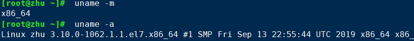
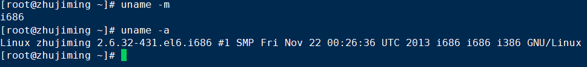

# 并发/多线程

## 多线程编程

### 创建新线程的四种方式


### callable与FutureTask配合使用

```Java
public class ThreadTest {

    static class WaiMai{}

    static class DianWaiMai implements Callable<Boolean>{
        private WaiMai waimai;

        DianWaiMai(WaiMai waimai){
            this.waimai = waimai;
        }

        @Override
        public Boolean call() throws Exception {
            long waitTime = waimai.hashCode() % 5000;
            Thread.sleep(waitTime);
            return (System.currentTimeMillis() & 1) == 1;
        }
    }
    public static void main(String[] args) throws ExecutionException, InterruptedException {
        ExecutorService threadPool = Executors.newFixedThreadPool(2);
        DianWaiMai dianWaiMai = new DianWaiMai(new WaiMai());
        FutureTask<Boolean> futureTask = new FutureTask((Callable) dianWaiMai);

        System.out.println(System.currentTimeMillis() + " 下单外卖，并且去运动");
        threadPool.execute(futureTask);

        Thread.sleep(2000);
        System.out.println(System.currentTimeMillis() + " 运动结束,看看外卖到了没");

        if (!futureTask.isDone()) {
            System.out.println(System.currentTimeMillis() + " 外卖还没到,在等等吧");
            Thread.sleep(1000);
            if (!futureTask.isDone()) {
                System.out.println(System.currentTimeMillis() + " 妈的外卖还没到,取消，吃食堂去");
                futureTask.cancel(false);
            }
        }
        if (!futureTask.isCancelled()) {
            Boolean res = futureTask.get();
            System.out.println(System.currentTimeMillis() + " 外卖到了");
            if (res) {
                System.out.println("太多了吃撑了");
            } else {
                System.out.println("太少了，不够吃，再去食堂吃一点");
            }
        }
        threadPool.shutdown();
    }
}
```

拿去一跑，一切明了，skr skr~

如果想看懂上面代码的全部细节你还需要了解

```Java
//创建线程池
//可以往线程池放n个任务，但每次执行只执行3个任务，别的任务在排队
ExecutorService threadPool = Executors.newFixedThreadPool(3);
//缓存的线程池，有几个任务几个线程，动态变化
ExecutorService threadPool = Executors.newCachedThreadPool();
//单线程，线程池只有一个线程
ExecutorService threadPool = Executors.newSingleThreadExecutor();


//FutureTask实现了Callbale和Runnable接口
//dianWaiMai是实现了Callable类的自定义线程类
FutureTask<String> futureTask = new FutureTask<>((Callable) dianWaiMai);

//直接启动线程
Thread thread = new Thread(futureTask);
thread.start();

//或者使用线程池启动线程
threadPool.execute(futureTask);

//获取运行状况
boolean done = futureTask.isDone();
boolean cancelled = futureTask.isCancelled();

//取消运行
futureTask.cancel(true);
//或者停止线程池的运行
threadPool.shutdown();
```

### 线程与JVM的关系

每个线程都会消耗虚拟机栈中的容量，因为jvm中最大堆容量和栈容量的最大值是相对固定的，所以线程的个数与每个线程所占用的容量之间呈反比。因为JVM的内存大小不能是无限大的所以所以线程并不是可以无限多的。

在多线程环境中，通过不断建立线程的方式可以产生内存溢出异常，代码如下所示。但是这样产生的 OOM 与栈空间是否足够大不存在任何联系，在这种情况下，为每个线程的栈分配的内存足够大，反而越容易产生OOM 异常。这点不难理解，每个线程分配到的栈容量越大，可以建立的线程数就变少，建立多线程时就越容易把剩下的内存耗尽。这点在开发多线程的应用时要特别注意。

**如果建立过多线程导致内存溢出，在不能减少线程数或更换64位虚拟机的情况下，只能通过减少最大堆和减少栈容量来换取更多的线程。**

#### 堆内存大小

##### client模式

初始堆大小：
物理内存的1/64，但最小是8MB。

 

最大堆大小：
在物理内存达到192MB之前，JVM最大堆大小为物理内存的一半；

在物理内存大于192MB，在到达1GB之前，JVM最大堆大小为物理内存的1/4；

大于1GB的物理内存，最大堆大小为256M。


##### server模式：

总体与Client相同，但是最大堆大小可以更大；

最大堆大小：

如果实际内存大于1G，最大堆大小为内存的1/4；在32位JVM下，如果物理内存在4G或更高，最大堆大小可以提升至1GB，如果是在64位JVM下，如果物理内存在128GB或更高，最大堆大小可以提升至32GB。

 

比如：64位机器4G内存，server模式下默认启动JVM，初始堆为64M，最大堆为1G；

**结果如下：初始堆大小为系统内存64/1，堆内存最大为系统内存4/1。**

## linux 32位-64位

通称说 x86也是指 IA32构架CPU，也就是说cpu是32位的，只能安装32位的os了；而x86-64或者IA-64是说cpu支持64位，可以安装64位的os，跑64位的应用

不懂可以看如下总结

CPU 构架      别名         位数

IA32          x86          32位

IA-64         x86-64       64位

在linux中如何区分32位还是64位系统? 

64位 : x86_64  结尾



32位: i386 i486 i586 i686 结尾



 

32位的linux和64位的linux有何不同?

- 1 定位不同

32位是为普通用户设计的

64位是为高科技人员设计的系统  具有高性能和科学计算的能力

- 2 安装要求配置不同

64位的操作系统只能安装在64位(cpu)的电脑上                  程序亦如此（就是不能向下兼容）

32位都可以

- 3 运算速度不同

64位是32位运算速度的2(大约)倍

- 4寻址能力不同 (识别内存的能力不同)

32位系统最多支持4GB内存(实际上也就是3.2GB左右)内存

