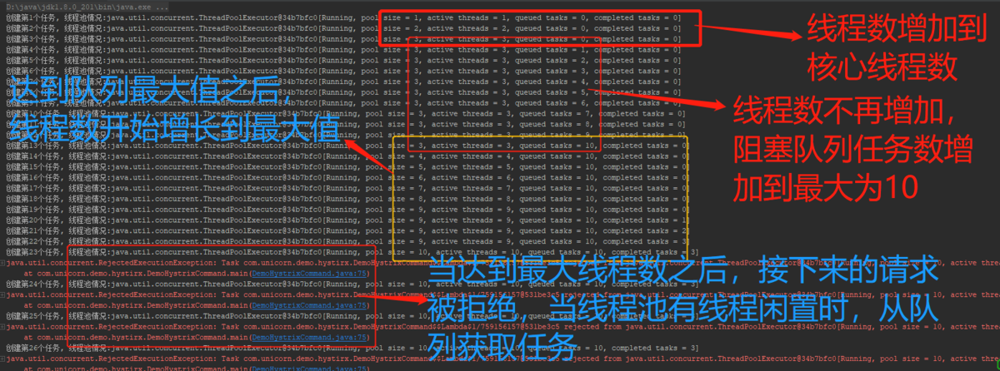
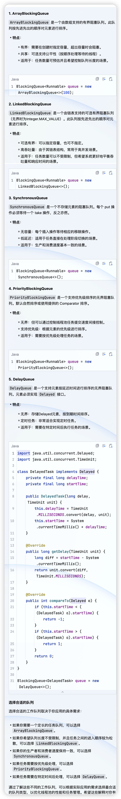
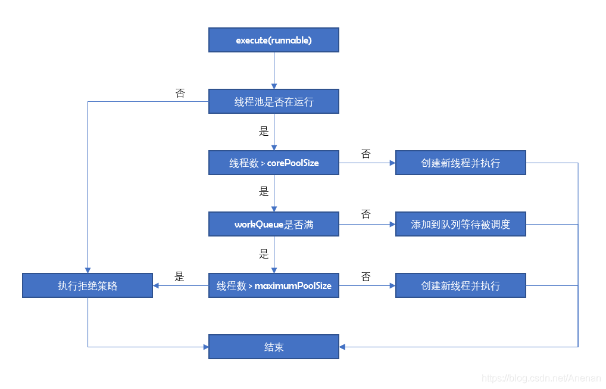
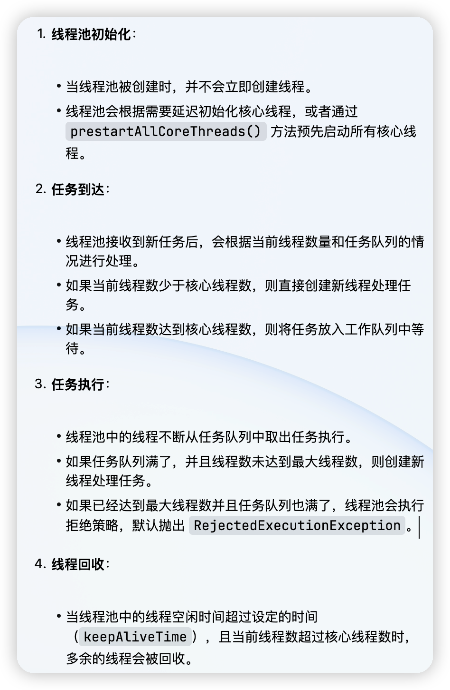
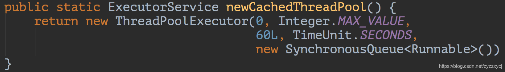
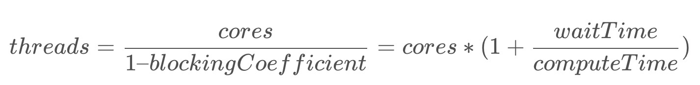

# 线程池

ThreadPoolExecutor是JDK中的线程池实现，这个类实现了一个线程池需要的各个方法，它提供了任务提交、线程管理、监控等方法。

## 7个核心参数

下面是ThreadPoolExecutor类的构造方法源码，其他创建线程池的方法最终都会导向这个构造方法，共有7个参数：corePoolSize、maximumPoolSize、keepAliveTime、unit、workQueue、threadFactory、handler。

```java
public ThreadPoolExecutor(int corePoolSize,
                          int maximumPoolSize,
                          long keepAliveTime,
                          TimeUnit unit,
                          BlockingQueue<Runnable> workQueue,
                          ThreadFactory threadFactory,
                          RejectedExecutionHandler handler) {
  if (corePoolSize < 0 ||
      maximumPoolSize <= 0 ||
      maximumPoolSize < corePoolSize ||
      keepAliveTime < 0) {
    throw new IllegalArgumentException();
  }
  if (workQueue == null || threadFactory == null || handler == null) {
    throw new NullPointerException();
  }
  this.acc = System.getSecurityManager() == null ? null : AccessController.getContext();
  this.corePoolSize = corePoolSize;
  this.maximumPoolSize = maximumPoolSize;
  this.workQueue = workQueue;
  this.keepAliveTime = unit.toNanos(keepAliveTime);
  this.threadFactory = threadFactory;
  this.handler = handler;
}
```

这些参数都通过volatile修饰：

```java
public class ThreadPoolExecutor extends AbstractExecutorService {
    private final BlockingQueue<Runnable> workQueue;
    private volatile ThreadFactory threadFactory;
    private volatile RejectedExecutionHandler handler;
    private volatile long keepAliveTime;
    // 是否允许核心线程被回收
    private volatile boolean allowCoreThreadTimeOut;
    private volatile int corePoolSize;
    private volatile int maximumPoolSize;
}
```

### corePoolSize：核心线程数

线程池维护的最小线程数量，核心线程创建后不会被回收（注意：设置allowCoreThreadTimeout=true后，空闲的核心线程超过存活时间也会被回收）。

大于核心线程数的线程，在空闲时间超过keepAliveTime后会被回收。

线程池刚创建时，里面没有一个线程，当调用 execute() 方法添加一个任务时，如果正在运行的线程数量小于corePoolSize，则马上创建新线程并运行这个任务。

### maximumPoolSize：最大线程数

线程池允许创建的最大线程数量。

当添加一个任务时，核心线程数已满，线程池还没达到最大线程数，并且没有空闲线程，工作队列已满的情况下，创建一个新线程并执行。

### keepAliveTime：空闲线程存活时间

当一个可被回收的线程的空闲时间大于keepAliveTime，就会被回收。

可被回收的线程：

- 设置allowCoreThreadTimeout=true的核心线程。
- 大于核心线程数的线程（非核心线程）。

### unit：时间单位

keepAliveTime的时间单位：

```java
TimeUnit.NANOSECONDS
TimeUnit.MICROSECONDS
TimeUnit.MILLISECONDS // 毫秒
TimeUnit.SECONDS
TimeUnit.MINUTES
TimeUnit.HOURS
TimeUnit.DAYS
```

### workQueue：工作队列

存放待执行任务的队列：当提交的任务数超过核心线程数大小后，再提交的任务就存放在工作队列，任务调度时再从队列中取出任务。它仅仅用来存放被execute()方法提交的Runnable任务。工作队列实现了BlockingQueue接口。



JDK默认的工作队列有五种：

- ArrayBlockingQueue 数组型阻塞队列：数组结构，初始化时传入大小，有界，FIFO，使用一个重入锁，默认使用非公平锁，入队和出队共用一个锁，互斥。
- LinkedBlockingQueue 链表型阻塞队列：链表结构，默认初始化大小为Integer.MAX_VALUE，有界（近似无解），FIFO，使用两个重入锁分别控制元素的入队和出队，用Condition进行线程间的唤醒和等待。
- SynchronousQueue 同步队列：容量为0，添加任务必须等待取出任务，这个队列相当于通道，不存储元素。
- PriorityBlockingQueue 优先阻塞队列：无界，默认采用元素自然顺序升序排列。
- DelayQueue 延时队列：无界，元素有过期时间，过期的元素才能被取出。



### threadFactory：线程工厂

创建线程的工厂，可以设定线程名、线程编号等。

默认线程工厂：

```java
/**
* The default thread factory
*/
static class DefaultThreadFactory implements ThreadFactory {
  private static final AtomicInteger poolNumber = new AtomicInteger(1);
  private final ThreadGroup group;
  private final AtomicInteger threadNumber = new AtomicInteger(1);
  private final String namePrefix;

  DefaultThreadFactory() {
    SecurityManager s = System.getSecurityManager();
    group = (s != null) ? s.getThreadGroup() : Thread.currentThread().getThreadGroup();
    namePrefix = "pool-" + poolNumber.getAndIncrement() + "-thread-";
  }

  public Thread newThread(Runnable r) {
    Thread t = new Thread(group, r, namePrefix + threadNumber.getAndIncrement(), 0);
    if (t.isDaemon()) {
      t.setDaemon(false);
    }
    if (t.getPriority() != Thread.NORM_PRIORITY) {
      t.setPriority(Thread.NORM_PRIORITY);
    }
    return t;
  }
}
```

### handler：拒绝策略

当线程池线程数已满，并且工作队列达到限制，新提交的任务使用拒绝策略处理。可以自定义拒绝策略，拒绝策略需要实现RejectedExecutionHandler接口。

JDK默认的拒绝策略有四种：

- AbortPolicy：丢弃任务并抛出RejectedExecutionException异常。
- DiscardPolicy：丢弃任务，但是不抛出异常。可能导致无法发现系统的异常状态。
- DiscardOldestPolicy：丢弃队列最前面的任务，然后重新提交被拒绝的任务。
- CallerRunsPolicy：由调用线程处理该任务。

默认拒绝策略：

```java
/**
* The default rejected execution handler
*/
private static final RejectedExecutionHandler defaultHandler = new AbortPolicy();

public static class AbortPolicy implements RejectedExecutionHandler {
  
  /**
  * Creates an {@code AbortPolicy}.
  */
  public AbortPolicy() { 
    
  }

  /**
  * Always throws RejectedExecutionException.
  *
  * @param r the runnable task requested to be executed
  * @param e the executor attempting to execute this task
  * @throws RejectedExecutionException always
  */
  public void rejectedExecution(Runnable r, ThreadPoolExecutor e) {
    throw new RejectedExecutionException("Task " + r.toString() + " rejected from " + e.toString());
  }
  
}
```

## 线程池的执行流程





### 自定义线程池工具

```java
import java.util.concurrent.*;
import java.util.concurrent.atomic.AtomicInteger;
 
/**
 * 线程池工厂工具
 *
 * @author 张卢斌
 * @date 2022/03/11 10:24
 */
public class ThreadPoolFactory {
 
    /**
     * 生成固定大小的线程池
     *
     * @param threadName 线程名称
     * @return 线程池
     */
    public static ExecutorService createFixedThreadPool(String threadName) {
        AtomicInteger threadNumber = new AtomicInteger(0);
        return new ThreadPoolExecutor(
                // 核心线程数
                desiredThreadNum(),
                // 最大线程数
                desiredThreadNum(),
                // 空闲线程存活时间
                60L,
                // 空闲线程存活时间单位
                TimeUnit.SECONDS,
                // 工作队列
                new ArrayBlockingQueue<>(1024),
                // 线程工厂
                new ThreadFactory() {
                    @Override
                    public Thread newThread(Runnable r) {
                        return new Thread(r, threadName + "-" + threadNumber.getAndIncrement());
                    }
                },
                // 拒绝策略
                new RejectedExecutionHandler() {
                    @Override
                    public void rejectedExecution(Runnable r, ThreadPoolExecutor executor) {
                        if (!executor.isShutdown()) {
                            try {
                                //尝试阻塞式加入任务队列
                                executor.getQueue().put(r);
                            } catch (Exception e) {
                                //保持线程的中断状态
                                Thread.currentThread().interrupt();
                            }
                        }
                    }
                });
    }
 
    /**
     * 理想的线程数，使用 2倍cpu核心数
     */
    public static int desiredThreadNum() {
        return Runtime.getRuntime().availableProcessors() * 2;
    }
}
```

## 线程池优化策略

### CPU密集型

说到优化，肯定离不开业务。比如我们的任务是计算密集型(以CPU计算为主)、多内存计算的，那么可能4c的机器开了4-8个线程，负载就打满了。那么我们在设置最大线程数maximumPoolSize的时候，最好使用Runtime.availableProcessors方法获取可用处理器的个数N，并设置maximumPoolSize=N+1。(额外+1的原因是当计算密集型线程偶尔由于页缺失故障或其他原因而暂停时，这个“额外的”线程也能确保这段时间内的CPU始终周期不会被浪费)

### IO密集型

像读写磁盘文件、读写数据库、网络请求等阻塞操作，执行IO操作时，CPU处于等待状态，等待过程中操作系统会把CPU时间片分给其他线程。我们可以使用newCachedThreadPool。



newCachedThreadPool默认最大线程数为Integer.MAX_VALUE，keepAliveTime只有60s，队列也是无界队列。
这种就适合用于一些生命周期较短，密集而又频繁的操作。
也可以参考newCachedThreadPool，根据实际情况（内存上线的控制很关键），适当缩小maximumPoolSize的大小，增加或减小keepAliveTime。

### CPU/IO混合型任务

大多数任务并不是单一的计算型或IO型，而是IO伴随计算两者混合执行的任务——即使简单的Http请求也会有请求的构造过程。

混合型任务要根据任务等待阻塞时间与CPU计算时间的比重来决定线程数量：



比如一个任务包含一次数据库读写(0.1ms)，并在内存中对读取的数据进行分组过滤等操作(5μs)，那么线程数应该为80左右(假设为4c的机器)。

阻塞的时间(waitTime)对计算的时间(computeTime)占比越大，则开放的线程数也应该越多。

## 小结

线程池的大小取决于任务的类型以及系统的特性，避免“过大”和“过小”两种极端。线程池过大，大量的线程将在相对更少的CPU和有限的内存资源上竞争，这不仅影响并发性能，还会因过高的内存消耗导致OOM；线程池过小，将导致处理器得不到充分利用，降低吞吐率。

要想正确的设置线程池大小，需要了解部署的系统中有多少个CPU，多大的内存，提交的任务是计算密集型、IO密集型还是两者兼有。

虽然线程池和JDBC连接池的目的都是对稀缺资源的重复利用，但通常一个应用只需要一个JDBC连接池，而线程池通常不止一个。如果一个系统要执行不同类型的任务，并且它们的行为差异较大，那么应该考虑使用多个线程池，使每个线程池可以根据各自的任务类型以及工作负载来调整。