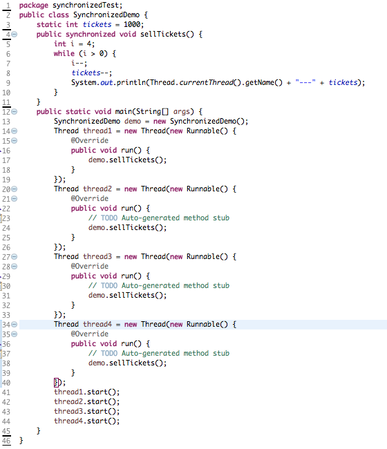
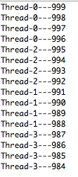
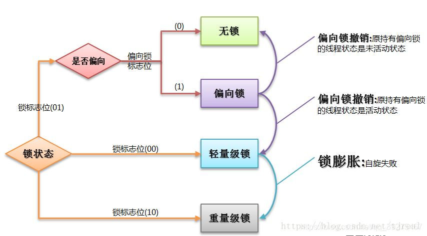
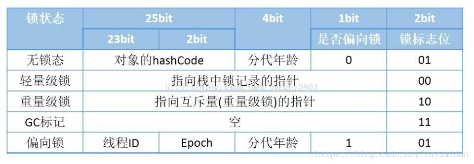
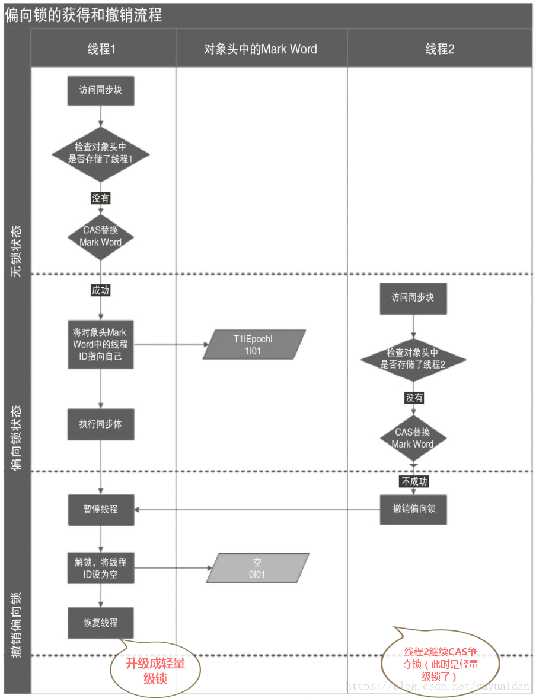
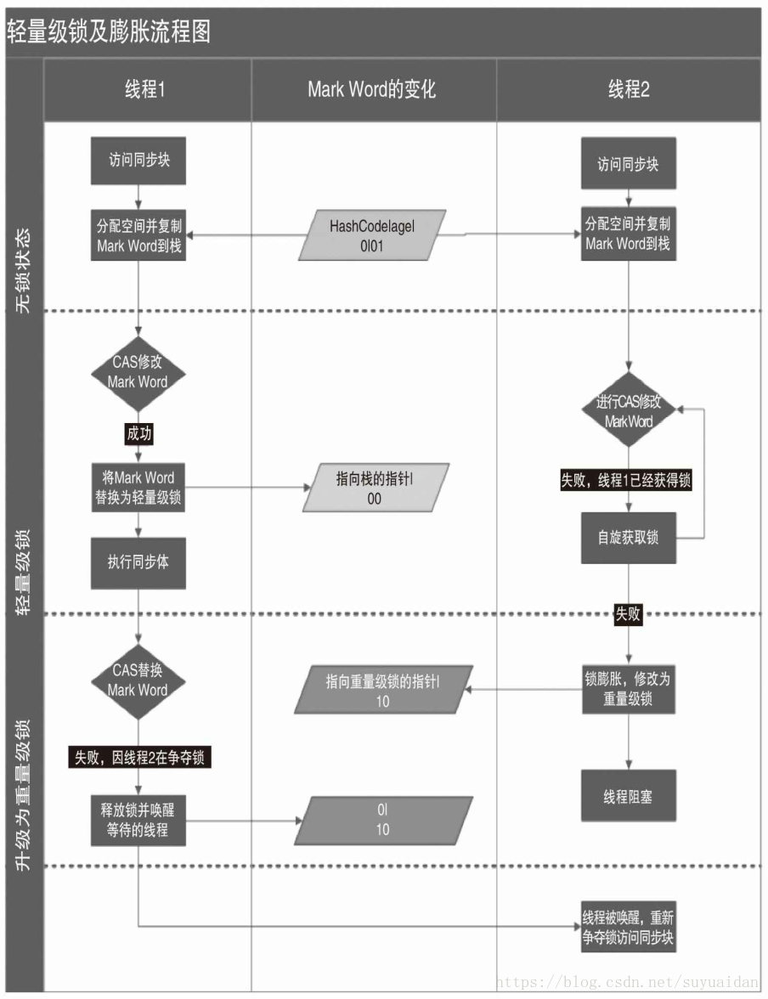

# 锁

## 锁的介绍

其实如果按照名称来说，锁大概有以下名词： 
**自旋锁 ，自旋锁的其他种类**，阻塞锁，可重入锁 ，**读写锁** ，**互斥锁** ，**悲观锁** ，**乐观锁** ，**公平锁** ，**偏向锁**， 对象锁，线程锁，**锁粗化**， **锁消除**，**轻量级锁**，**重量级锁**， 信号量，**独享锁**，**共享锁**，**分段锁** 
**我们所说的锁的分类其实应该按照锁的特性和设计来划分**

## 概述

其实从并发的角度来讲，按照线程安全的三种策略看，主要内容都集中在互斥同步里，我们所讨论的锁也集中在这个部分。**这个部分的锁都是悲观锁**，第二个部分是非阻塞同步，这个部分也就一种通过CAS进行原子类操作，**这个部分可以看成乐观锁**，其实也就是不加锁。第三个部分是无同步方案，包括可重入代码和线程本地存储。

我们这里主要讨论的就是**互斥同步**这一部分。

## 常见的锁

### Synchronized和各种Lock

其实我们真正用到的锁也就那么两三种，只不过依据设计方案和性质对其进行了大量的划分。

> 以下一个锁是原生语义上的实现

- Synchronized，它就是一个：非公平，悲观，独享，互斥，可重入的重量级锁

> 以下两个锁都在JUC包下，是API层面上的实现

- ReentrantLock，它是一个：默认非公平但可实现公平的，悲观，独享，互斥，可重入，重量级锁。
- ReentrantReadWriteLocK，它是一个，默认非公平但可实现公平的，悲观，写独享，读共享，读写，可重入，重量级锁。

#### ReentrantLock与synchronized 的区别

#### ReentrantLock的高级操作

中断等待

ReentrantLock 拥有Synchronized相同的并发性和内存语义，此外还多了 锁投票，定时锁等候和中断锁等候。

线程A和B都要获取对象O的锁定，假设A获取了对象O锁，B将等待A释放对O的锁定

- 如果使用 synchronized ，如果A不释放，B将一直等下去，不能被中断
- 如果 使用ReentrantLock，如果A不释放，可以使B在等待了足够长的时间以后，中断等待，而干别的事情

**ReentrantLock获取锁定有三种方式**：

- lock(), 如果获取了锁立即返回，如果别的线程持有锁，当前线程则一直处于休眠状态，直到获取锁
- tryLock(), 如果获取了锁立即返回true，如果别的线程正持有锁，立即返回false
- tryLock(long timeout,TimeUnit unit)， 如果获取了锁定立即返回true，如果别的线程正持有锁，会等待参数给定的时间，在等待的过程中，如果获取了锁定，就返回true，如果等待超时，返回false；
- lockInterruptibly:如果获取了锁定立即返回，如果没有获取锁定，当前线程处于休眠状态，直到获取锁定，或者当前线程被别的线程中断

可实现公平锁

对于Java ReentrantLock而言，**通过构造函数指定该锁是否是公平锁，默认是非公平锁。**非公平锁的优点在于吞吐量比公平锁大。

锁绑定多个条件

锁绑定多个条件是指一个ReentrantLock对象可以同时绑定多个Condition对象，而在synchronized中，锁对象的wait（）和notify（）或notifyAll（）方法可以实现一个隐含的条件，如果要和多于一个的条件关联的时候，就不得不额外地添加一个锁，而ReentrantLock则无须这样做，只需要多次调用newCondition（）方法即可。

#### synchronized的优势

synchronized是在JVM层面上实现的，**不但可以通过一些监控工具监控synchronized的锁定，而且在代码执行时出现异常，JVM会自动释放锁定，但是使用Lock则不行**，lock是通过代码实现的，要保证锁定一定会被释放，就必须将unLock()放到finally{}中

#### 应用场景

在资源竞争不是很激烈的情况下，Synchronized的性能要优于ReetrantLock，但是在资源竞争很激烈的情况下，Synchronized的性能会下降几十倍，但是ReetrantLock的性能能维持常态；

#### Synchronized方法锁、对象锁、类锁区别

synchronized，这个东西我们一般称之为”同步锁“，他在修饰代码块的时候需要传入一个引用对象作为“锁”的对象。**在修饰方法的时候，默认是当前对象作为锁的对象****在修饰类时，默认是当前类的Class对象作为所的对象故存在着方法锁、对象锁、类锁 这样的概念**那么我们来大致看一下这三种锁**方法锁（synchronized修饰方法时）**通过在方法声明中加入synchronized关键字来声明synchronized方法。
synchronized 方法锁控制对类成员变量的访问：
每个类实例对应一把锁
每个synchronized方法都必须获得调用该方法的类实例的”锁“方能执行，否则所属线程阻塞。方法一旦执行，就会独占该锁，一直到从该方法返回时才将锁释放，此后被阻塞的线程方能获得该锁，从而重新进入可执行状态。这种机制确保了同一时刻对于每一个类的实例，其所有声明为synchronized的成员函数中之多只有一个处于可执行状态，从而有效避免了类成员变量的访问冲突。ok,下方介绍一个火车站卖票的例子，一共1000张票，有4个窗口卖票，卖票的方法被我定义为同步的，即每个卖票过程会卖出4张票，卖完之后才允许其他窗口卖票大家看看代码，体会一下运行结果**

**运行结果多运行几次会发现虽然线程的先后顺序会变化，但是每一个线程必定先卖出4张票之后才会去接着卖剩余的票。下边我们来看下对象锁，其实方法锁 这个就属于对象锁**

##### 1.对象锁

（synchronized修饰方法或代码块）**当一个对象中有synchronized method 或synchronized block 的时候，调用此对象的同步方法或进入其同步区域时，就必须先获得对象锁。如果此对象的对象锁已被其他调用者占用，则需要等待此锁被释放。（方法锁也是对象锁）java的所有对象都含有一个互斥锁，这个锁由jvm自动获取和释放。**线程进入synchronized 方法的时候获取该对象的锁，当然如果已经有线程获取了这个对象的锁，那么当前线程会等待；synchronized方法正常返回或者抛异常而终止，jvm会自动释放对象锁。这里也体现了用synchronized来加锁的一个好处，即 ：方法抛异常的时候，锁仍然可以由jvm来自动释放**
对象锁的两种方式

##### 2.方法锁

2、代码块形式ok,自己体会一下哦**类锁（synchronized修饰静态的方法或者代码块）****由于一个class不论被实例化多少次，其中的静态方法和静态变量在内存中都只有一份。所以，一旦一个静态的方法被声明为synchronized。此类所有的实例对象在调用此方法，共用同一把锁，我们称之为类锁。**前方高能：重点：要考的哦
**对象锁是用来控制实例方法之间的同步，而类锁是用来控制静态方法（或者静态变量互斥体)之间的同步的。**

##### 3.类锁

**只是一个概念上的东西，并不是真实存在的，他只是用来帮助我们理解锁定实例方法和静态方法的区别的。**
**java类可能会有很多对象，但是只有一个Class(字节码)对象，也就是说类的不同实例之间共享该类的Class对象。Class对象其实也仅仅是1个java对象，只不过有点特殊而已。**
**由于每个java对象都有1个互斥锁，而类的静态方法是需要Class对象。所以所谓的类锁，只不过是Class对象的锁而已。**
**获取类的Class对象的方法有好几种，最简单的是[类名.class]的方式。(百度：获取字节码的三种方式)**来看下类锁的两种方式
方式1：方式2： 

### 锁按照其性质分类

#### 公平锁/非公平锁

**公平锁是指多个线程按照申请锁的顺序来获取锁。非公平锁是指多个线程获取锁的顺序并不是按照申请锁的顺序，有可能后申请的线程比先申请的线程优先获取锁**。有可能，会造成优先级反转或者饥饿现象。对于Java ReentrantLock而言，**通过构造函数指定该锁是否是公平锁，默认是非公平锁。**非公平锁的优点在于吞吐量比公平锁大。对于**Synchronized而言，也是一种非公平锁**。由于其并不像ReentrantLock是通过AQS的来实现线程调度，所以并没有任何办法使其变成公平锁。

#### 乐观锁/悲观锁

乐观锁与悲观锁不是指具体的什么类型的锁，而是指看待并发同步的角度。**悲观锁认为对于同一个数据的并发操作，一定是会发生修改的，哪怕没有修改，也会认为修改。因此对于同一个数据的并发操作，悲观锁采取加锁的形式**。悲观的认为，不加锁的并发操作一定会出问题。**乐观锁则认为对于同一个数据的并发操作，是不会发生修改的。在更新数据的时候，会采用尝试更新，不断重新的方式更新数据。乐观的认为，不加锁的并发操作是没有事情的。**从上面的描述我们可以看出，**悲观锁适合写操作非常多的场景，乐观锁适合读操作非常多的场景**，不加锁会带来大量的性能提升。**悲观锁在Java中的使用，就是利用各种锁**。**乐观锁在Java中的使用，是无锁编程，常常采用的是CAS算法，典型的例子就是原子类，通过CAS自旋实现原子操作的更新。**

#### 独享锁/共享锁

**独享锁是指该锁一次只能被一个线程所持有。共享锁是指该锁可被多个线程所持有**。**对于Java ReentrantLock而言，其是独享锁。但是对于Lock的另一个实现类ReentrantReadWriteLock，其读锁是共享锁，其写锁是独享锁**。读锁的共享锁可保证并发读是非常高效的，读写，写读 ，写写的过程是互斥的。独享锁与共享锁也是通过AQS来实现的，通过实现不同的方法，来实现独享或者共享。**对于Synchronized而言，当然是独享锁。**

#### 互斥锁/读写锁

上面讲的独享锁/共享锁就是一种广义的说法，互斥锁/读写锁就是具体的实现。互斥锁在Java中的具体实现就是**ReentrantLock**，**读写锁在Java中的具体实现就是ReentrantReadWriteLock**

#### 可重入锁

可重入锁又名递归锁，是指在同一个线程在外层方法获取锁的时候，在进入内层方法会自动获取锁。说的有点抽象，下面会有一个代码的示例。对于Java ReentrantLock而言, 他的名字就可以看出是一个可重入锁，**其名字是Reentrant Lock重新进入锁。对于Synchronized而言,也是一个可重入锁。**可重入锁的一个好处是可一定程度避免死锁。

```java
public sychrnozied void test() {
    xxxxxx;
    test2();
}
 
public sychronized void test2() {
    yyyyy;

```

在上面代码段中，执行 test 方法需要获得当前对象作为监视器的对象锁，但方法中又调用了 test2 的同步方法。

- **如果锁是具有可重入性的话，那么该线程在调用 test2 时并不需要再次获得当前对象的锁，可以直接进入 test2 方法进行操作。**
- **如果锁是不具有可重入性的话，那么该线程在调用 test2 前会等待当前对象锁的释放，实际上该对象锁已被当前线程所持有，不可能再次获得。**

如果锁是不具有可重入性特点的话，**那么线程在调用同步方法、含有锁的方法时就会产生死锁。**

### 按照设计方案来分类

大概有以下这么几种



#### 自旋锁/自适应自旋锁

在Java中，**自旋锁是指尝试获取锁的线程不会立即阻塞，而是采用循环的方式去尝试获取锁**，这样的好处是减少线程上下文切换的消耗，缺点是循环会消耗CPU。更多具体的细节见上一篇博客里对自旋锁的描述


#### 锁粗化/锁消除

**锁消除**是指虚拟机即时编译器在运行时，**对一些代码上要求同步，但是被检测到不可能存在共享数据竞争的锁进行消除**。锁消除的主要判定依据来源于逃逸分析的数据支持，如果判断在一段代码中，堆上的所有数据都不会逃逸出去从而被其他线程访问到，那就可以把它们当做栈上数据对待，认为它们是线程私有的，同步加锁自然就无须进行。

如果一系列的连续操作都对同一个对象反复加锁和解锁，甚至加锁操作是出现在循环体中的，那即使没有线程竞争，频繁地进行互斥同步操作也会导致不必要的性能损耗。**如果虚拟机探测到有这样一串零碎的操作都对同一个对象加锁，将会把加锁同步的范围扩展（粗化）到整个操作序列的外部**

**锁粗化和消除其实设计原理都差不多，都是为了减少没必要的加锁**


#### 偏向锁/轻量级锁/重量级锁

**这三种锁是指锁的状态**，并且是针对Synchronized。在Java 5通过引入锁升级的机制来实现高效Synchronized。**这三种锁的状态是通过对象监视器在对象头中的字段来表明的**。

**偏向锁是指一段同步代码一直被一个线程所访问，那么该线程会自动获取锁。降低获取锁的代价**。

**轻量级锁是指当锁是偏向锁的时候，被另一个线程所访问，偏向锁就会升级为轻量级锁，其他线程会通过自旋的形式尝试获取锁**，不会阻塞，提高性能。

**重量级锁是指当锁为轻量级锁的时候，另一个线程虽然是自旋，但自旋不会一直持续下去，当自旋一定次数的时候，还没有获取到锁，就会进入阻塞，该锁膨胀为重量级锁。**重量级锁会让其他申请的线程进入阻塞，性能降低。


#### 分段锁

分段锁其实是一种锁的设计，并不是具体的一种锁，**对于ConcurrentHashMap而言，其并发的实现就是通过分段锁的形式来实现高效的并发操作**。我们以ConcurrentHashMap来说一下分段锁的含义以及设计思想，**ConcurrentHashMap中的分段锁称为Segment**，它即类似于HashMap（JDK7与JDK8中HashMap的实现）的结构，即**内部拥有一个Entry数组，数组中的每个元素又是一个链表；同时又是一个ReentrantLock（Segment继承了ReentrantLock)**。

当需要put元素的时候，并不是对整个hashmap进行加锁，而是**先通过hashcode来知道他要放在那一个分段中，然后对这个分段进行加锁**，所以当多线程put的时候，只要不是放在一个分段中，就实现了真正的并行的插入。

但是，在统计size的时候，可就是获取hashmap全局信息的时候，就需要获取所有的分段锁才能统计。**分段锁的设计目的是细化锁的粒度，当操作不需要更新整个数组的时候，就仅仅针对数组中的一项进行加锁操作。**

## 锁的升级与对比

Java SE 1.6为了减少获得锁和释放锁带来的性能消耗，引入了“偏向锁”和“轻量级锁”，在Java SE 1.6中，锁一共有4种状态，级别从低到高依次是：无锁状态、偏向锁状态、轻量级锁状态和重量级锁状态，这几个状态会随着竞争情况逐渐升级。锁可以升级但不能降级，意味着偏向锁升级成轻量级锁后不能降级成偏向锁。这种锁升级却不能降级的策略，目的是为了提高获得锁和释放锁的效率，下文会详细分析。

### markword

因为偏向锁，锁住对象时，会写入对象头相应的标识，我们先把对象头(官方叫法为:Mark Word)的图示如下(借用了网友的图片):



### 偏向锁

HotSpot [1] 的作者经过研究发现，大多数情况下，锁不仅不存在多线程竞争，而且总是由同一线程多次获得，为了让线程获得锁的代价更低而引入了偏向锁。当一个线程访问同步块并获取锁时，会在对象头和栈帧中的锁记录里存储锁偏向的线程ID，以后该线程在进入和退出同步块时不需要进行CAS操作来加锁和解锁，只需简单地测试一下对象头的Mark Word里是否存储着指向当前线程的偏向锁。如果测试成功，表示线程已经获得了锁。**如果测试失败，则需要再测试一下Mark Word中偏向锁的标识是否设置成1（表示当前是偏向锁）：如果没有设置，则使用CAS竞争锁；如果设置了，则尝试使用CAS将对象头的偏向锁指向当前线程**。

上文中黑体字部分，写得太简略，以致于很多初学者，对这个过程有点不明白，这个过程是怎么实现锁的升级、释放的？下面一一分析

1. 线程2来竞争锁对象;
2. 判断当前对象头是否是偏向锁;
3. 判断拥有偏向锁的线程1是否还存在;
4. 线程1不存在,直接设置偏向锁标识为0(线程1执行完毕后,不会主动去释放偏向锁);
5. 使用cas替换偏向锁线程ID为线程2,锁不升级，仍为偏向锁;
6. 线程1仍然存在,暂停线程1；
7. 设置锁标志位为00(变为轻量级锁),偏向锁为0;
8. 从线程1的空闲monitor record中读取一条,放至线程1的当前monitor record中;
9. 更新mark word，将mark word指向线程1中monitor record的指针;
10. 继续执行线程1的代码;
11. 锁升级为轻量级锁;
12. 线程2自旋来获取锁对象;



### 轻量级锁

（1）轻量级锁加锁
线程在执行同步块之前，JVM会先在当前线程的栈桢中创建用于存储锁记录的空间，并将对象头中的Mark Word复制到锁记录中，官方称为Displaced Mark Word。然后线程尝试使用CAS将对象头中的Mark Word替换为指向锁记录的指针。如果成功，当前线程获得锁，如果失败，表示其他线程竞争锁，当前线程便尝试使用自旋来获取锁。
（2）轻量级锁解锁
轻量级解锁时，会使用原子的CAS操作将Displaced Mark Word替换回到对象头，如果成功，则表示没有竞争发生。如果失败，表示当前锁存在竞争，锁就会膨胀成重量级锁。下图是两个线程同时争夺锁，导致锁膨胀的流程图。



因为自旋会消耗CPU，为了避免无用的自旋（比如获得锁的线程被阻塞住了），一旦锁升级成重量级锁，就不会再恢复到轻量级锁状态。当锁处于这个状态下，其他线程试图获取锁时，都会被阻塞住，当持有锁的线程释放锁之后会唤醒这些线程，被唤醒的线程就会进行新一轮的夺锁之争。

### 自旋锁

自旋锁原理非常简单，如果持有锁的线程能在很短时间内释放锁资源，那么那些等待竞争锁的线程就不需要做内核态和用户态之间的切换进入阻塞挂起状态，它们只需要等一等（自旋），等持有锁的线程释放锁后即可立即获取锁，这样就避免用户线程和内核的切换的消耗。

### 重量级锁

指的是原始的Synchronized的实现，重量级锁的特点：其他线程试图获取锁时，都会被阻塞，只有持有锁的线程释放锁之后才会唤醒这些线程。

### 锁升级场景

场景1： 程序不会有锁的竞争。
那么这种情况我们不需要加锁，所以这种情况下对象锁状态为无锁。

场景2： 经常只有某一个线程来加锁。
加锁过程：也许获取锁的经常为同一个线程，这种情况下为了避免加锁造成的性能开销，所以并不会加实际意义上的锁，偏向锁的执行流程如下：
1、线程首先检查该对象头的线程ID是否为当前线程；
2、A：如果对象头的线程ID和当前线程ID一致，则直接执行代码；B：如果不是当前线程ID则使用CAS方式替换对象头中的线程ID，如果使用CAS替换不成功则说明有线程正在执行，存在锁的竞争，这时需要撤销偏向锁，升级为轻量级锁。
3、如果CAS替换成功，则把对象头的线程ID改为自己的线程ID，然后执行代码。
4、执行代码完成之后释放锁，把对象头的线程ID修改为空。

场景3： 有线程来参与锁的竞争，但是获取锁的冲突时间很短。
当开始有锁的冲突了，那么偏向锁就会升级到轻量级锁；线程获取锁出现冲突时，线程必须做出决定是继续在这里等，还是回家等别人打电话通知，而轻量级锁的路基就是采用继续在这里等的方式，当发现有锁冲突，线程首先会使用自旋的方式循环在这里获取锁，因为使用自旋的方式非常消耗CPU，当一定时间内通过自旋的方式无法获取到锁的话，那么锁就开始升级为重量级锁了。

场景4： 有大量的线程参与锁的竞争，冲突性很高。
我们知道当获取锁冲突多，时间越长的时候，我们的线程肯定无法继续在这里死等了，所以只好先休息，然后等前面获取锁的线程释放了锁之后再开启下一轮的锁竞争，而这种形式就是我们的重量级锁。
