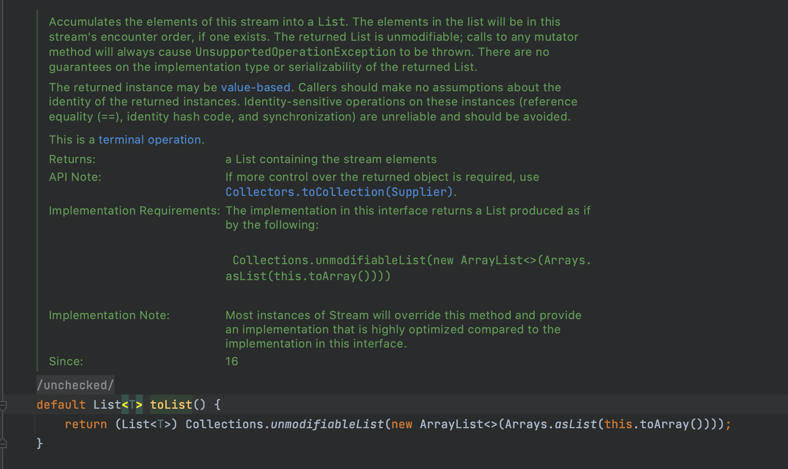

#### Stream 新增 toList 方法

之前我们都这样写，如刚刚第一条 record 时：

```java
List<SelectVO> selectVOList = list.stream().map(e-> new SelectVO(String.valueOf(e.getId()),e.getName())).collect(Collectors.toList());
```

现在直接这样：

```java
List<SelectVO> selectVOList = list.stream().map(e-> new SelectVO(String.valueOf(e.getId()),e.getName())).toList();
```

源码：

