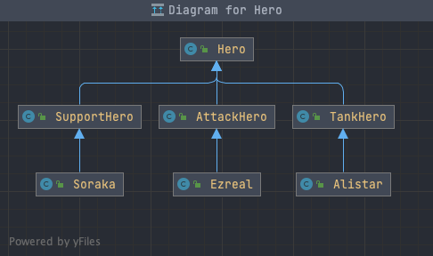

# 密封类

Java 17推出的新特性Sealed Classes经历了2个Preview版本（JDK 15中的JEP 360、JDK 16中的JEP 397），最终定稿于JDK 17中的JEP 409。Sealed Classes有两种主流翻译：密封类、封闭类。个人喜欢前者多一些，所以在本文中都称为密封类。其实Sealed Classes的其他许多语言中并不是什么新鲜事物，C#、Scala等高级语言中都有类似的名称，但意义和作用各不相同。下面就来一起认识一下Java 17中的Sealed Classes。

## 密封类的作用

在面向对象语言中，我们可以通过继承（extend）来实现类的能力复用、扩展与增强。但有的时候，有些能力我们不希望被继承了去做一些不可预知的扩展。所以，我们需要对继承关系有一些限制的控制手段。而密封类的作用就是**限制类的继承**。

## 已有的限制手段

对于继承能力的控制，Java很早就已经有一些了，主要是这两种方式：

1. `final`修饰类，这样类就无法被继承了
2. `package-private`类（非public类），可以控制只能被同一个包下的类继承

但很显然，这两种限制方式的粒度都非常粗，如果有更精细化的限制需求的话，是很难实现的。

## 新特性：密封类

为了进一步增强限制能力，Java 17中的密封类增加了几个重要关键词：

- `sealed`：修饰类/接口，用来描述这个类/接口为密封类/接口
- `non-sealed`：修饰类/接口，用来描述这个类/接口为非密封类/接口
- `permits`：用在`extends`和`implements`之后，指定可以继承或实现的类

下面我们通过一个例子来理解这几个关键词的用法。

假设我们要设计一个游戏，这个游戏给用户选择的英雄种类分为三大类：

- 坦克
- 输出
- 辅助

每个种类下又有各种不同的具体英雄。所以，从我们传统的面向设计思路，会这样来创建：

```java
// 英雄基类
public class Hero {

}

// 坦克英雄的抽象
public class TankHero extends Hero {

}

// 输出英雄的抽象
public class AttackHero extends Hero {

}

// 辅助英雄的抽象
public class SupportHero extends Hero {

}

// 坦克英雄：阿利斯塔
public class Alistar extends TankHero {

}

// 输出英雄：伊泽瑞尔
public class Ezreal extends AttackHero {

}

// 辅助英雄：索拉卡
public class Soraka extends SupportHero {

}
```

整体结构有三层，具体如下图所示：

[](https://www.didispace.com/images/202205/java17/jep409-1.png)

- 第一层：Hero是所有英雄的基类，定义英雄的基础属性
- 第二层：按英雄的分类的三个不同抽象，定义同类英雄的公共属性
- 第三层：具体英雄的定义

这个时候，为了避免开发人员在创建新英雄的时候，搞乱这样的三层结构。就可以通过引入密封类的特性来做限制。

假设我们希望第一、第二层是稳定的，对于第二层英雄种类的抽象不允许再增加，此时我们就可以这样写：

```java
public sealed class Hero permits TankHero, AttackHero, SupportHero {

}
```

通过`sealed`关键词和`permitspermits`关键来定义Hero是一个需要密封的类，并且它的子类只允许为`TankHero`, `AttackHero`, `SupportHero`这三个。

完成这个改造之后，我们会发现`TankHero`, `AttackHero`, `SupportHero`这三个类开始报错了，具体错误如下：

```java
sealed, non-sealed or final modifiers expected
```

这是因为父类Hero被`sealed`修饰之后，`sealed`的密封要求被传递过来，此时子类就必须在`sealed`、`non-sealed`、`final`之间选择一个定义，它们分别代表：

- `sealed`：继续延续密封类特性，可以继续指定继承的类，并传递密封定义给子类
- `non-sealed`：声明这个类为非密封类，可以被任意继承
- `final`：不允许继承

根据上面的假设需求，第一、第二层稳定，允许第三层具体英雄角色可以后期不断增加新英雄，所以三类抽象英雄的定义可以这样编写：

```java
public non-sealed class TankHero extends Hero {

}
```

而对于第三层的英雄角色，已经是最后的具体实现，则可以使用final定义来阻断后续的继承关系，比如这样：

```java
public final class Ezreal extends AttackHero {

}
```

通过这样的设置，这三层英雄的结构中第一第二层就得到了比较好的保护。