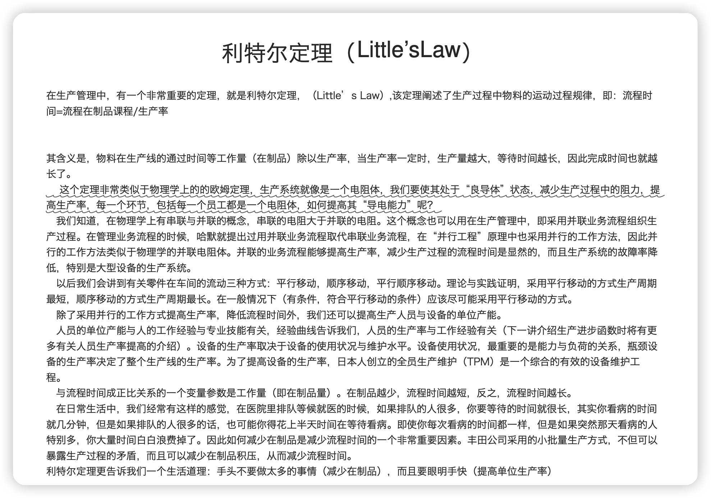

# 了解虚拟线程

[高并发](https://so.csdn.net/so/search?q=高并发&spm=1001.2101.3001.7020)、多线程一直是**Java**编程中的难点，也是面试题中的要点。**Java**开发者也一直在尝试使用[多线程](https://so.csdn.net/so/search?q=多线程&spm=1001.2101.3001.7020)来解决应用服务器的并发问题。但是多线程并不容易，为此一个新的技术出现了，这就是虚拟线程。

## 传统多线程的痛点

但是编写多线程代码是非常不容易的，难以控制的执行顺序，共享变量的线程安全性，异常可观察性等等都是多线程编程的难点。

如果每个请求在请求的持续时间内都在一个线程中处理，那么为了提高应用程序的吞吐量，线程的数量必须随着吞吐量的增长而增长。不幸的是线程是稀缺资源，创建一个线程的代价是昂贵的，即使引入了池化技术也无法降低新线程的创建成本，而且 JDK 当前的线程实现将应用程序的吞吐量限制在远低于硬件可以支持的水平。

为此很多开发人员转向了异步编程，例如CompletableFuture或者现在正热的反应式框架。但是这些技术要么摆脱不了“回调地狱”，要么缺乏可观测性。

解决这些痛点、增强Java平台的和谐，实现每个请求使用独立线程（thread-per-request style）这种风格成为必要之举。能否实现一种“成本低廉”的虚拟线程来映射到系统线程以减少对系统线程的直接操作呢？思路应该是没问题的！于是Java社区发起了关于虚拟线程的JEP 425[1]提案。

## 虚拟线程

虚拟线程（virtual threads）应该非常廉价而且可以无需担心系统硬件资源被大量创建，并且不应该被池化。应该为每个应用程序任务创建一个新的虚拟线程。因此，大多数虚拟线程将是短暂的并且具有浅层调用堆栈，只执行单个 HTTP 客户端调用或单个 JDBC 查询。与之对应的平台线程（  Platform Threads，也就是现在传统的JVM线程 ）是重量级且昂贵的，因此通常必须被池化。它们往往寿命长，有很深的调用堆栈，并且在许多任务之间共享。

总而言之，虚拟线程保留了与 Java 平台的设计相协调的、可靠的每请求线程样式，同时优化了硬件的利用。使用虚拟线程不需要学习新概念，甚至需要改掉现在操作多线程的习惯，使用更加容易上手的API、兼容以前的多线程设计、并且丝毫不会影响代码的拓展性。

### 平台线程和虚拟线程的不同

为了更好理解这一个设计，草案对这两种线程进行了比较。

### 现在的线程

现在每个`java.lang.Thread`都是一个平台线程，平台线程在底层操作系统线程上运行 Java 代码，并在代码的整个生命周期内捕获操作系统线程。平台线程数受限于 OS 线程数。

> 平台线程并不会因为加入虚拟线程而退出历史舞台。

## 未来的虚拟线程

虚拟线程是由 JDK 而不是操作系统提供的线程的轻量级实现。它们是用户模式线程的一种形式，在其他多线程语言中已经成功（比如Golang中的协程和Erlang中的进程）。虚拟线程采用 M:N 调度，其中大量 (M) 虚拟线程被调度为在较少数量 (N) 的 OS 线程上运行。JDK 的虚拟线程调度程序是一种ForkJoinPool工作窃取的机制，以 FIFO 模式运行。

我们可以很随意地创建10000个虚拟线程：

```java
// 预览代码
try (var executor = Executors.newVirtualThreadPerTaskExecutor()) {
    IntStream.range(0, 10_000).forEach(i -> {
        executor.submit(() -> {
            Thread.sleep(Duration.ofSeconds(1));
            return i;
        });
    });
}
```

无需担心硬件资源是否扛得住，反过来如果你使用Executors.newCachedThreadPool()创建10000个平台线程，在大多数操作系统上很容易因资源不足而崩溃。

**为吞吐量而设计**

但是这里依然要说明一点，**虚拟线程并非为了提升执行速度而设计**。它并不比平台线程速度快，它们的存在是为了提供规模（更高的吞吐量），而不是速度（更低的延迟）。它们的数量可能比平台线程多得多，因此根据利特尔定律，它们可以实现更高吞吐量所需的更高并发性。

换句话说，虚拟线程可以显著提高应用程序吞吐量

- 并发任务的数量很高（超过几千个），并且
- 工作负载不受 CPU 限制，因为在这种情况下，拥有比处理器内核多得多的线程并不能提高吞吐量。

虚拟线程有助于提高传统服务器应用程序的吞吐量，正是因为此类应用程序包含大量并发任务，这些任务花费大量的时间等待。

**增强可观测性**

编写清晰的代码并不是全部。对正在运行的程序状态的清晰表示对于故障排除、维护和优化也很重要，JDK 长期以来一直提供调试、分析和监视线程的机制。在虚拟线程中也会增强代码的可观测性，让开发人员更好地调试代码。

## 新的线程API

**目前还处于预览阶段，API设计可能发生改变**

为此增加了新的线程API设计，目前放出的部分如下：

Thread.Builder  线程构建器。

ThreadFactory  能批量构建相同特性的线程工厂。

Thread.ofVirtual()  创建一个虚拟线程。

Thread.ofPlatform() 创建一个平台线程。

Thread.startVirtualThread(Runnable) 一种创建然后启动虚拟线程的便捷方式。

Thread.isVirtual() 测试线程是否是虚拟线程。

> 还有很多就不一一演示了，有兴趣的自行去看**JEP425**。

## 总结

协程在Java社区已经呼唤了很久了，现在终于有了实质性的动作，这是一个非常重要的特性。不过这个功能涉及的东西还是很多的，包括平台线程的兼容性、对ThreadLocal的一些影响、对JUC的影响。可能需要多次预览才能最终落地，不过这已经是很大的进步了，起码距离实装已经不远了，胖哥可能赶不上那个时候了，不过很多年轻的同学应该能够赶上。

## 参考资料

[1]

JEP 425: https://openjdk.java.net/jeps/425

