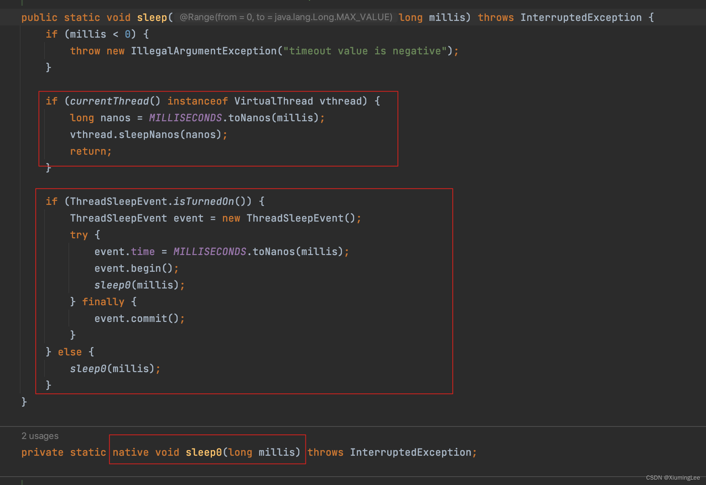

# 虚拟线程工作原理

JDK19马上就要发布了，今天我们来谈一谈JDK 19的新特性虚线程，它属于JEP 425 Project Loom(425: Virtual Threads (Preview))。这可能是JDK 19中最值得期待的预览特性之一。

我们知道Java阻塞平台线程的代价很高，这就是为什么要不惜一切代价避免这种情况，以及为什么要基于回调编写响应式代码。响应式代码做得很好，但它使代码难以阅读和测试，这显然不是理想的情况。使用DK9和虚拟线程，阻塞线程变得如此廉价，以至于我们不再需要编写响应式代码，我们 的老式阻塞同步代码也可以很好地工作！下面让我们来看一下这一切是如何工作的？以及为什么我们不应该再担心阻塞一个虚拟线程？

## 创建虚拟线程

```java
public static void main(String[] args) throws Exception {

  var platformThread = Thread.ofPlatform().unstarted(() -> System.out.println(Thread.currentThread()));

  platformThread.start();
  platformThread.join();

  var virtualThread = Thread.ofVirtual().unstarted(() -> System.out.println(Thread.currentThread()));

  virtualThread.start();
  virtualThread.join();

  System.out.println("Class = " + virtualThread.getClass());
}
```

```
### 输出
Thread[#22,Thread-0,5,main]
VirtualThread[#23]/runnable@ForkJoinPool-1-worker-1
Class = class java.lang.VirtualThread
```

Thread类中添加了两个工厂方法：`ofPlatform()`和`ofVirtual()`。首先调用了`ofPlatform()`,从这我们可以直接创建一个已启动的线程，或者一个未启动的线程， 这里我们调用`unstarted()`，然后打印当前线程信息，看看它输出什么。运行这个线程，我们需要调用`start()`,因为这是一个未启动的线程。如果我们想在控制台看到结果，最好调用`.join()`，确保主线程不会在此任务运行结束之前退出，应用程序也不会随之退出。`.ofVirtual()`的使用和`ofPlatform()`一样，最后打印了`.ofVirtual()`产生线程的类名。

通过打印消息，我们可以得知：通过`ofPlatform()`创建的是普通的平台线程，通过`.ofVirtual()`创建的是虚线程，而且虚线程具体的类为`VirtualThread`。

## VirtualThread

```java
package java.lang;

final class VirtualThread extends BaseVirtualThread {
  // ...
}

package java.lang;
sealed abstract class BaseVirtualThread extends Thread
        permits VirtualThread, ThreadBuilders.BoundVirtualThread {
  // ... 
}
```

这个虚拟线程类是`BaseVirtualThread`的子类，`BaseVirtualThread`本身是—个密封类，子类只包括`VirtualThread`和`BoundVirtualThread`。这个`VirtualThread`类是final的，它不是公共的，所以我们不能直接在自己的代码中与它交互。

## 虚拟线程的ForkJoinPool

从上面的输出我们可以知道，虚线程不是应用程序中的第一个线程，我们的JVM使用很多现成，有用于垃圾收集器的，有用于JIT编译器的，这是意料之中的。其次我们可以看到这个虚线程运行在另一个名为`ForkJoinPool-1-worker-1`的线程上。大家可能已经听说过`ForkJoinPool`,它是2011年加入到JDK 7中的`fork/join`框架的一部分，JDK 8的`Parallel Stream`也是在这个框架上工作的。`ForkJoinPool`基本上是一个线程池，在JDK中早已经有了线程池，叫`Executor` 或 `ExecutorService`。那么为什么还需要另一个呢？

事实上，`ForkJoinPool`和`ExecutorService`的工作方式不同，`ExecutorService`有一个等待列表来存储它的任务，其中线程将接收并处理这些任务。但是`ForkJoinPool`得每一个线程都有一个等待列表，当一个由线程运行的任务生成另一个任务时，该任务被添加到该线程的等待列表中，当我们运行par`Parallel Stream`时，一个大任务划分成两个小任务时就会发生这种情况。为了防止所谓的“**线程饥饿**”问题，当一个线程的等待列表中没有更多的任务时，`ForkJoinPool`还实现了另一种模式，称为“**窃取工作**”， 也就是说：饥饿线程可以从另一个线程的等待列表中窃取一些任务。

但是，这里虚拟线程的`ForkJoinPool`与用于运行并行流的`ForkJoinPool`不同，用于运行并行流的`ForkJoinPool`是`commonForkJoinPool`,

```java
ForkJoinTask<?> task = ForkJoinPool.commonPool().submit(() -> System.out.println(Thread.currentThread()));
task.join();
/*
Thread[#26,ForkJoinPool.commonPool-worker-1,5,main]
*/
```

我们可以看到，`commonForkJoinPool`的这个线程与运行我们的虚拟线程的线程名称不同，所以这不是同一个`ForkJoinPool`。

这就是虚拟线程的工作方式：他们运行在平台线程之上。到这里你可能会认为没有任何性能提升，只是带来额外的开销，这是怎么回事呢？请继续向下看。

## Continuation

先来看一段代码。

```java
public static void main(String[] args) throws Exception {
  var threads = IntStream.range(0, 10).mapToObj(
    index -> Thread.ofVirtual().unstarted(() -> {
      if (index == 0){
        System.out.println(Thread.currentThread());
      }

      try {
        Thread.sleep(10);
      } catch (InterruptedException e) {
        throw new RuntimeException(e);
      }

      if (index == 0) {
        System.out.println(Thread.currentThread());
      }
    })
  ).toList();

  threads.forEach(Thread::start);
  for (Thread thread : threads) {
    thread.join();
  }
}
/*
VirtualThread[#22]/runnable@ForkJoinPool-1-worker-1
VirtualThread[#22]/runnable@ForkJoinPool-1-worker-5
*/
```

我们通过流模式创建了10个未启动的虚拟线程，这些线程的任务是：打印当前线程，然后让他们休眠10毫秒，然后再次打印线程的名称。最后，我们只是启动这些未启动的线程，并调用`jion()`以确保控制台可以看到所有内容。

查看控制台输出，我们发现了一些意想不到的事情，*与之前同一虚拟线程首先运行在ForkJoinPool的线程1上，然后，当它从睡眠中返回时，它在线程5上运行。(不同的机器标号可能不一样)*。为什么会出现这种现象呢？虚拟线程如何从一个线程跳转到另一个线程的？

其实这一切的核心是`Continuation`对象

让我们来看看`sleep()`方法中发生了什么，我们可以看到，`sleep()`方法中对虚拟线程和非虚拟线程做了判断，并做了不同的处理。

非虚拟线程会调用本地的`sleep0()`方法，但如果丧气那县城实际上是一个虚拟线程，那么这个`sleepNanos();`方法就会被调用，我们来看看它，

```java
/// VirtualThread.java
void sleepNanos(long nanos) throws InterruptedException {
  assert Thread.currentThread() == this;
  if (nanos >= 0) {
    if (ThreadSleepEvent.isTurnedOn()) {
      ThreadSleepEvent event = new ThreadSleepEvent();
      try {
        event.time = nanos;
        event.begin();
        doSleepNanos(nanos);
      } finally {
        event.commit();
      }
    } else {
      doSleepNanos(nanos);
    }
  }
}
```

这里又调用了`doSleepNanos();`方法，让我们点进去看一下：

```java
/// VirtualThread.java
private void doSleepNanos(long nanos) throws InterruptedException {
  assert nanos >= 0;
  if (getAndClearInterrupt())
    throw new InterruptedException();
  if (nanos == 0) {
    tryYield();
  } else {
    // park for the sleep time
    try {
      long remainingNanos = nanos;
      long startNanos = System.nanoTime();
      while (remainingNanos > 0) {
        parkNanos(remainingNanos);
        if (getAndClearInterrupt()) {
          throw new InterruptedException();
        }
        remainingNanos = nanos - (System.nanoTime() - startNanos);
      }
    } finally {
      // may have been unparked while sleeping
      setParkPermit(true);
    }
  }
}
```

这里的关键是对`tryYield();`的调用。我们再来看看`tryYield();`方法

```java
/// VirtualThread.java
void tryYield() {
  assert Thread.currentThread() == this;
  setState(YIELDING);
  try {
    yieldContinuation();
  } finally {
    assert Thread.currentThread() == this;
    if (state() != RUNNING) {
      assert state() == YIELDING;
      setState(RUNNING);
    }
  }
}
```

然后又调用了`yieldContinuation()`。我们在点进去看一下。

```java
/// VirtualThread.java
@ChangesCurrentThread
private boolean yieldContinuation() {
  boolean notifyJvmti = notifyJvmtiEvents;
  // unmount
  if (notifyJvmti) notifyJvmtiUnmountBegin(false);
  unmount();
  try {
    return Continuation.yield(VTHREAD_SCOPE);
  } finally {
    // re-mount
    mount();
    if (notifyJvmti) notifyJvmtiMountEnd(false);
  }
}
```

现在我们真正调用的是`Continuation.yield(VTHREAD_SCOPE)`。这就是奇迹发生的地方。这个`Continuation`对象是它的核心，下面让我们来看一下`Continuation`对象是如何工作的：

```java
import jdk.internal.vm.*;

public static void main(String[] args) throws Exception {

  ContinuationScope scope = new ContinuationScope("scope");
  Continuation continuation = new Continuation(scope, () -> {
    System.out.println("Running");
  });
  System.out.println("Start");
  continuation.run();
  System.out.println("Done");
}
/*
Start
Running
Done
*/
```

> **注意：**在JDK 9后的进行了模块化，`jdk.internal`没有对外暴露，这里需要添加JVM参数才能使用：
>
> ```
> --add-opens java.base/jdk.internal.vm=ALL-UNNAMED
> ```

我们可以看到，实际上在这个`Continuation`对象上调用`run()`方法，只会直接执行`Continuation`的`Runnabe`，这并不是我们想要的。我们对代码稍作修改：

```java
import jdk.internal.vm.*;

public static void main(String[] args) throws Exception {

  ContinuationScope scope = new ContinuationScope("scope");
  Continuation continuation = new Continuation(scope, () -> {
    System.out.println("Running");
    Continuation.yield(scope);
    System.out.println("Still running");
  });

  System.out.println("Start");
  continuation.run();
  System.out.println("Done");
}

/*
Start
Running
Done
*/ 
```

我们发现输出没有变化，所以，`yield`会暂停`Continuation`的执行。让我们再做一下修改：

```java
import jdk.internal.vm.*;

public static void main(String[] args) throws Exception {

  ContinuationScope scope = new ContinuationScope("scope");
  Continuation continuation = new Continuation(scope, () -> {
    System.out.println("Running");
    Continuation.yield(scope);
    System.out.println("Still running");
  });


  System.out.println("Start");
  continuation.run();
  System.out.println("Back");
  continuation.run();
  System.out.println("Done");
}

/*
Start
Running
Back
Still running
Done
*/ 
```

调用第二次`run()`之后，`yield`之后的代码继续执行了。

也就是说，这个`yield()`可以暂停任务的执行，如果再调用`run()`可以继续执行。这在Java中是新的。

> #### **那么这在底层是如何工作的呢？**
>
> **当Continuation yield它的任务时，相应的线程栈将从运行它的平台线程移动到堆内存中，所以现在这个平台线程就可以自由的运行另一个虚拟线程了，当这个任务获得可以继续运行的信号时，它的线程栈将从堆移回平台线程，但不一定是与之前相同的平台线程。**
>
> 这就是阻塞一个虚拟线程的代价：将这个虚拟线程的线程栈移动到主内存中，然后返回。阻塞一个细腻线程不是免费，但是它比阻塞一个平台线程要便宜的多。
>
> 好的方面是：JDK的所有阻塞操作都被重构以利用这一机制。这包括I/O操作，synchroniztion和`Thread.sleep()`。

## 运行虚拟线程需要多少平台线程

让我们来测试一下。

```java
static Pattern POOL_PATTERN = Pattern.compile("ForkJoinPool-[\\d?]");
static Pattern WORKER_PATTERN = Pattern.compile("worker-[\\d?]");

public static void main(String[] args) throws Exception {
  Set<String> poolNames = ConcurrentHashMap.newKeySet();
  Set<String> pThreadNames = ConcurrentHashMap.newKeySet();

  List<Thread> threads = IntStream.range(0, 5)
    .mapToObj(i -> Thread.ofVirtual().unstarted(() -> {
      String poolName = readPoolName();
      poolNames.add(poolName);

      String workerName = readWorkerName();
      pThreadNames.add(workerName);

    }))
    .toList();

  Instant begin = Instant.now();
  threads.forEach(Thread::start);
  for (Thread thread : threads) {
    thread.join();
  }
  Instant end = Instant.now();

  System.out.println("Time = " + Duration.between(begin,end).toMillis() + " ms");
  System.out.println("# CPU：" + Runtime.getRuntime().availableProcessors());
  System.out.println("# Pools：" + poolNames.size());
  System.out.println("# Platform threads：" + pThreadNames.size());

}

private static String readWorkerName() {
  String name = Thread.currentThread().toString();
  Matcher matcher = WORKER_PATTERN.matcher(name);
  if (matcher.find()){
    return matcher.group();
  }
  return "not found";
}

private static String readPoolName() {
  String name = Thread.currentThread().toString();
  Matcher matcher = POOL_PATTERN.matcher(name);
  if (matcher.find()){
    return matcher.group();
  }
  return "pool not found";
}
/*
Time = 4 ms
# CPU = 8
# Pools：1
# Platform threads：5
*/
```

让我们创建虚拟线程，并收集所有相应的平台线程名称。最后打印出不同的统计数据，运行这段代码所需的时间、CPU核心数、线程池数和平台线程数。

这里5个虚拟线程使用了5个平台线程。(不同的机器测出来的数量可能不一样)，下面我们修改一下虚拟线程数量做测试试试。

```java
List<Thread> threads = IntStream.range(0, 10)
/*
Time = 6 ms
# CPU：8
# Pools：1
# Platform threads：6
*/
          

List<Thread> threads = IntStream.range(0, 100)
/*
Time = 6 ms
# CPU：8
# Pools：1
# Platform threads：7
*/
          

List<Thread> threads = IntStream.range(0, 1_000)
/*
Time = 21 ms
# CPU：8
# Pools：1
# Platform threads：8
*/
  
List<Thread> threads = IntStream.range(0, 10_000)
/*
Time = 78 ms
# CPU：8
# Pools：1
# Platform threads：8
*/
  
List<Thread> threads = IntStream.range(0, 1_000_000)
/*
Time = 1280 ms
# CPU：8
# Pools：1
# Platform threads：8
*/
  

List<Thread> threads = IntStream.range(0, 10_000_000)
/*
Time = 17676 ms
# CPU：8
# Pools：1
# Platform threads：8
*/
```

最后我们启动了1000万个虚拟线程，还是只使用了8个平台线程。我们之前肯定没有启动过1000万个平台线程。

## 防止将虚拟线程栈移动到堆内存中

有一种方法可以将虚拟线程栈移动到堆内存中，我们知道，在C语言中，我们可以通过在变量前带上这个`&`字符来获得线程栈上的地址。这里有个问题：如果我们把这个线程栈移到别的地方， 并尝试将其放回另一个平台线程上，这个地址仍然有效的可能性非常小。所以如果我们在自己的虚拟线程栈中有一些C代码，或者至少在这个栈上有一个地址，这个栈会被固定到某个平台线程上，它可能会阻塞它。如果我们的代码没有阻塞，或者阻塞的时间很短，那么就没有问题，性能的影响将是很小的。但是如果这段代码阻塞了数百毫秒，那么我们可能需要对这种情况做一些处理。JDK中有几个地方的C代码调用已经被Java代码取代，Method类实例就是这种情况，它被重构为使用MethodHandler实现(JEP 416)。下面看一下`synchronized`和`ReentrantLock`的例子

### synchronized

```java
static Pattern POOL_PATTERN = Pattern.compile("ForkJoinPool-[\\d?]");
static Pattern WORKER_PATTERN = Pattern.compile("worker-[\\d?]");

private final static Object lock = new Object();
private static int counter = 0;


public static void main(String[] args) throws Exception {
  Set<String> poolNames = ConcurrentHashMap.newKeySet();
  Set<String> pThreadNames = ConcurrentHashMap.newKeySet();
  ChronoUnit delay = ChronoUnit.MICROS;

  List<Thread> threads = IntStream.range(0, 100)
    .mapToObj(index -> Thread.ofVirtual().unstarted(() -> {
      try {
        if (index == 0) {
          System.out.println(Thread.currentThread());
        }
        pThreadNames.add(readWorkerName());
        synchronized (lock) {
          Thread.sleep(Duration.of(1,delay));
          counter++;
        }

        if (index == 0) {
          System.out.println(Thread.currentThread());
        }
        pThreadNames.add(readWorkerName());
        synchronized (lock) {
          Thread.sleep(Duration.of(1,delay));
          counter++;
        }

        if (index == 0) {
          System.out.println(Thread.currentThread());
        }
        synchronized (lock) {
          Thread.sleep(Duration.of(1,delay));
          counter++;
        }
        pThreadNames.add(readWorkerName());


      } catch (Exception e) {
        throw new RuntimeException(e);
      }

    }))
    .toList();

  threads.forEach(Thread::start);
  for (Thread thread : threads) {
    thread.join();
  }

  synchronized (lock) {
    System.out.println("# counter = " + counter);
  }
  System.out.println("# Platform threads：" + pThreadNames.size());

}

private static String readWorkerName() {
  String name = Thread.currentThread().toString();
  Matcher matcher = WORKER_PATTERN.matcher(name);
  if (matcher.find()){
    return matcher.group();
  }
  return "not found";
}

private static String readPoolName() {
  String name = Thread.currentThread().toString();
  Matcher matcher = POOL_PATTERN.matcher(name);
  if (matcher.find()){
    return matcher.group();
  }
  return "pool not found";
}
/*
VirtualThread[#22]/runnable@ForkJoinPool-1-worker-1
VirtualThread[#22]/runnable@ForkJoinPool-1-worker-1
VirtualThread[#22]/runnable@ForkJoinPool-1-worker-1
# counter = 300
# Platform threads：8
*/
```

这里我们使用100个虚拟线程，显示这个虚拟线程的当前名称，以获得平台线程名称。然后我们在这个同步块中以1微妙的延迟增加计数器，然后再次打印线程的名称。然后重复同样的动作两次，总共三次。

> **通过打印结果我们可以看到，我们的虚拟线程不能行一个平台线程跳转到另一个。因为这个同步的东西实际上是使用栈上地址，Loom知道这一点，它把这个虚拟线程固定到一个平台线程上了。**

### ReentrantLock

让我们用`ReentrantLock`来运行完全相同的代码。

```java
static Pattern POOL_PATTERN = Pattern.compile("ForkJoinPool-[\\d?]");
static Pattern WORKER_PATTERN = Pattern.compile("worker-[\\d?]");

private final static Lock lock = new ReentrantLock();
private static int counter = 0;


public static void main(String[] args) throws Exception {
  Set<String> poolNames = ConcurrentHashMap.newKeySet();
  Set<String> pThreadNames = ConcurrentHashMap.newKeySet();
  ChronoUnit delay = ChronoUnit.MICROS;

  List<Thread> threads = IntStream.range(0, 100)
    .mapToObj(index -> Thread.ofVirtual().unstarted(() -> {
      try {
        if (index == 0) {
          System.out.println(Thread.currentThread());
        }
        pThreadNames.add(readWorkerName());
        lock.lock();
        try {
          Thread.sleep(Duration.of(1,delay));
          counter++;
        }finally {
          lock.unlock();
        }

        if (index == 0) {
          System.out.println(Thread.currentThread());
        }
        pThreadNames.add(readWorkerName());
        lock.lock();
        try {
          Thread.sleep(Duration.of(1,delay));
          counter++;
        }finally {
          lock.unlock();
        }

        if (index == 0) {
          System.out.println(Thread.currentThread());
        }
        lock.lock();
        try {
          Thread.sleep(Duration.of(1,delay));
          counter++;
        }finally {
          lock.unlock();
        }
        pThreadNames.add(readWorkerName());


      } catch (Exception e) {
        throw new RuntimeException(e);
      }

    }))
    .toList();

  threads.forEach(Thread::start);
  for (Thread thread : threads) {
    thread.join();
  }

  synchronized (lock) {
    System.out.println("# counter = " + counter);
  }
  System.out.println("# Platform threads：" + pThreadNames.size());

}

private static String readWorkerName() {
  String name = Thread.currentThread().toString();
  Matcher matcher = WORKER_PATTERN.matcher(name);
  if (matcher.find()){
    return matcher.group();
  }
  return "not found";
}

private static String readPoolName() {
  String name = Thread.currentThread().toString();
  Matcher matcher = POOL_PATTERN.matcher(name);
  if (matcher.find()){
    return matcher.group();
  }
  return "pool not found";
}
/*
VirtualThread[#22]/runnable@ForkJoinPool-1-worker-1
VirtualThread[#22]/runnable@ForkJoinPool-1-worker-8
VirtualThread[#22]/runnable@ForkJoinPool-1-worker-8
# counter = 300
# Platform threads：8
*/
```

> **现在我们可以看到这个虚拟线程可以从一个平台线程跳转到另一了。**

同步代码块本身并没有调用任何C代码，但是它需要栈上的地址才能工作，所以问题是类似的，如果同步代码没有阻塞，那么就没有问题，但是如果有阻塞，并且遇到了性能问题，那么我们可以尝试使用`ReentrantLock`,看看它是否能改善我们的情况。

如果太多的平台线程被阻塞，会发生什么？`ForkJoinPool`可以检测到这一点，并创建更多的平台线程，至少Loom暂时是这种实现机制，当然相应的性能也会收到影响。