# 语言基础

## 基础语法

### 关键字

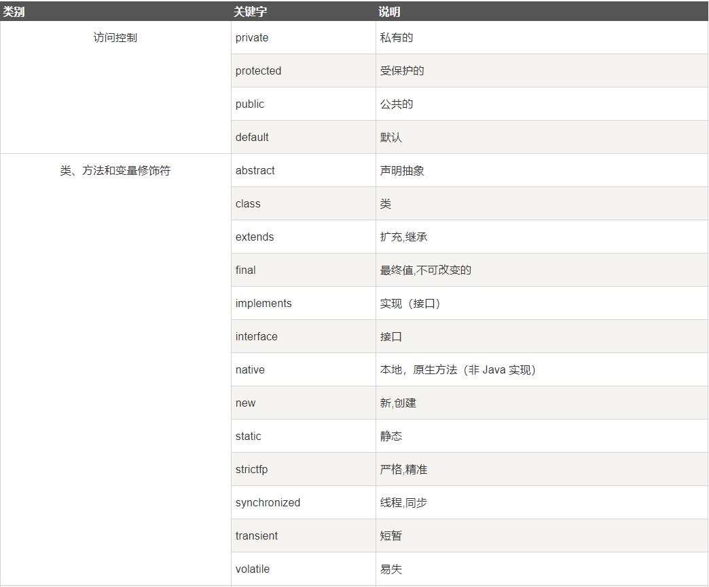

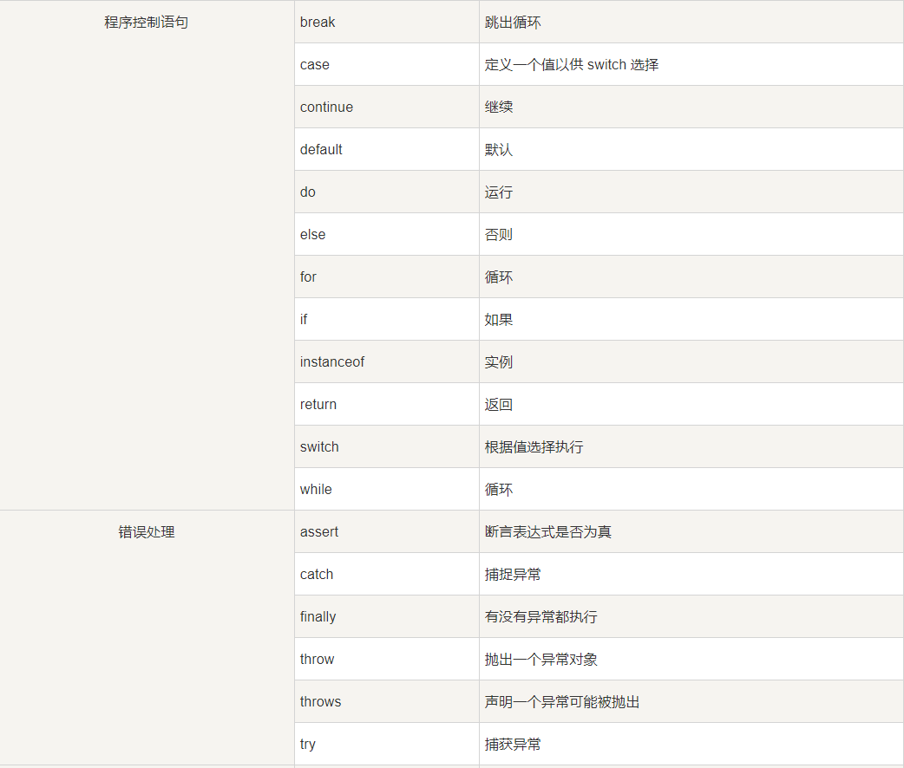

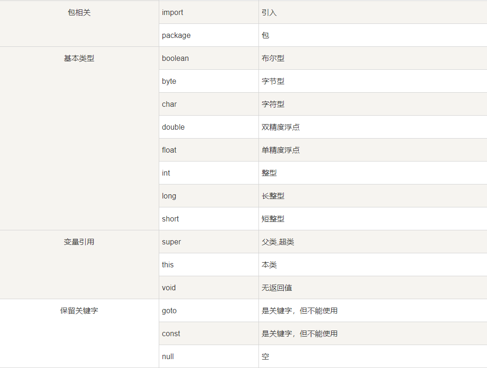

#### 访问控制修饰符

Java中，可以使用访问控制符来保护对类、变量、方法和构造方法的访问。Java 支持 4 种不同的访问权限。

- **default** (即默认，什么也不写）: 在同一包内可见，不使用任何修饰符。使用对象：类、接口、变量、方法。
- **private** : 在同一类内可见。使用对象：变量、方法。 **注意：不能修饰类（外部类）**
- **public** : 对所有类可见。使用对象：类、接口、变量、方法
- **protected** : 对同一包内的类和所有子类可见。使用对象：变量、方法。 **注意：不能修饰类（外部类）**。

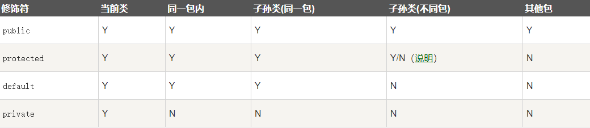

#### 访问控制和继承

请注意以下方法继承的规则：

- 父类中声明为 public 的方法在子类中也必须为 public。
- 父类中声明为 protected 的方法在子类中要么声明为 protected，要么声明为 public，不能声明为 private。
- 父类中声明为 private 的方法，不能够被继承。

#### 非访问修饰符

为了实现一些其他的功能，Java 也提供了许多非访问修饰符。

static 修饰符，用来修饰类方法和类变量。

final 修饰符，用来修饰类、方法和变量，final 修饰的类不能够被继承，修饰的方法不能被继承类重新定义，修饰的变量为常量，是不可修改的。

abstract 修饰符，用来创建抽象类和抽象方法。

synchronized 和 volatile 修饰符，主要用于线程的编程。

##### static 修饰符

- **静态变量：**

  static 关键字用来声明独立于对象的静态变量，无论一个类实例化多少对象，它的静态变量只有一份拷贝。 静态变量也被称为类变量。局部变量不能被声明为 static 变量。

- **静态方法：**

  static 关键字用来声明独立于对象的静态方法。静态方法不能使用类的非静态变量。静态方法从参数列表得到数据，然后计算这些数据。

##### final 修饰符

**final 变量：**

final 表示"最后的、最终的"含义，变量一旦赋值后，不能被重新赋值。被 final 修饰的实例变量必须显式指定初始值。

final 修饰符通常和 static 修饰符一起使用来创建类常量。

**final 方法**

父类中的 final 方法可以被子类继承，但是不能被子类重写。

声明 final 方法的主要目的是防止该方法的内容被修改。

**final 类**

final 类不能被继承，没有类能够继承 final 类的任何特性。

##### abstract 修饰符

**抽象类：**

抽象类不能用来实例化对象，声明抽象类的唯一目的是为了将来对该类进行扩充。

一个类不能同时被 abstract 和 final 修饰。如果一个类包含抽象方法，那么该类一定要声明为抽象类，否则将出现编译错误。

抽象类可以包含抽象方法和非抽象方法。

**抽象方法**

抽象方法是一种没有任何实现的方法，该方法的的具体实现由子类提供。

抽象方法不能被声明成 final 和 static。

任何继承抽象类的子类必须实现父类的所有抽象方法，除非该子类也是抽象类。

如果一个类包含若干个抽象方法，那么该类必须声明为抽象类。抽象类可以不包含抽象方法。

抽象方法的声明以分号结尾，例如：**public abstract sample();**

##### transient 修饰符

序列化的对象包含被 transient 修饰的实例变量时，java 虚拟机(JVM)跳过该特定的变量。

该修饰符包含在定义变量的语句中，用来预处理类和变量的数据类型。

```java
public transient int limit = 55;   // 不会持久化
public int b; // 持久化
```

##### volatile 修饰符

volatile 修饰的成员变量在每次被线程访问时，都强制从共享内存中重新读取该成员变量的值。而且，当成员变量发生变化时，会强制线程将变化值回写到共享内存。这样在任何时刻，两个不同的线程总是看到某个成员变量的同一个值。
一个 volatile 对象引用可能是 null。

```java
public class MyRunnable implements Runnable
{
    private volatile boolean active;
    public void run()
    {
        active = true;
        while (active) // 第一行
        {
            // 代码
        }
    }
    public void stop()
    {
        active = false; // 第二行
    }
}
```

通常情况下，在一个线程调用 run() 方法（在 Runnable 开启的线程），在另一个线程调用 stop() 方法。 如果 ***第一行\*** 中缓冲区的 active 值被使用，那么在 ***第二行\*** 的 active 值为 false 时循环不会停止。
但是以上代码中我们使用了 volatile 修饰 active，所以该循环会停止。

### java的数据类型

ava 的两大数据类型:

- 基本数据类型（存储的是数值）
- 引用数据类型（存储的是地址值）

#### 基础数据类型

Java语言提供了八种基本类型。六种数字类型（四个整数型，两个浮点型），一种字符类型，还有一种布尔型。

**基础数据类型中的数组类型都有默认值**！！！！

> **byte：**
>
> - byte 数据类型是8位（1字节）、有符号的，以二进制补码表示的整数；
> - 最小值是 **-128（-2^7）**；
> - 最大值是 **127（2^7-1）**；
> - 默认值是 **0**；
> - byte 类型用在大型数组中节约空间，主要代替整数，因为 byte 变量占用的空间只有 int 类型的四分之一；
> - 例子：byte a = 100，byte b = -50。
>
> **short：**
>
> - short 数据类型是 16 位（2字节）、有符号的以二进制补码表示的整数
> - 最小值是 **-32768（-2^15）**；
> - 最大值是 **32767（2^15 - 1）**；
> - Short 数据类型也可以像 byte 那样节省空间。一个short变量是int型变量所占空间的二分之一；
> - 默认值是 **0**；
> - 例子：short s = 1000，short r = -20000。
>
> **int：**
>
> - int 数据类型是32位（4字节）、有符号的以二进制补码表示的整数；
> - 最小值是 **-2,147,483,648（-2^31）**；
> - 最大值是 **2,147,483,647（2^31 - 1）**；
> - 一般地整型变量默认为 int 类型；
> - 默认值是 **0** ；
> - 例子：int a = 100000, int b = -200000。
>
> **long：**
>
> - long 数据类型是 64 位（8字节）、有符号的以二进制补码表示的整数；
> - 最小值是 **-9,223,372,036,854,775,808（-2^63）**；
> - 最大值是 **9,223,372,036,854,775,807（2^63 -1）**；
> - 这种类型主要使用在需要比较大整数的系统上；
> - 默认值是 **0L**；
> - 例子： long a = 100000L，Long b = -200000L。
>   "L"理论上不分大小写，但是若写成"l"容易与数字"1"混淆，不容易分辩。所以最好大写。
>
> **float：**
>
> - float 数据类型是单精度、32位（4字节）、符合IEEE 754标准的浮点数；
> - float 在储存大型浮点数组的时候可节省内存空间；
> - 默认值是 **0.0f**；
> - 浮点数不能用来表示精确的值，如货币；
> - 例子：float f1 = 234.5f。
>
> **double：**
>
> - double 数据类型是双精度、64 位（八个字节）、符合 IEEE 754 标准的浮点数；
>
> - 浮点数的默认类型为 double 类型；
>
> - double类型同样不能表示精确的值，如货币；
>
> - 默认值是 **0.0d**；
>
> - 例子：
>
>   ```
>   double   d1  = 7D ;
>   double   d2  = 7.; 
>   double   d3  =  8.0; 
>   double   d4  =  8.D; 
>   double   d5  =  12.9867; 
>   ```
>
>   7 是一个 int 字面量，而 7D，7. 和 8.0 是 double 字面量。
>
> **boolean：**
>
> - boolean数据类型表示一位的信息；
> - 只有两个取值：true 和 false；
> - 这种类型只作为一种标志来记录 true/false 情况；
> - 默认值是 **false**；
> - 例子：boolean one = true。
>
> **char：**
>
> - char 类型是一个单一的 16 位（2字节） Unicode 字符；
> - 最小值是 **\u0000**（十进制等效值为 0）；
> - 最大值是 **\uffff**（即为 65535）；
> - char 数据类型可以储存任何字符；
> - 例子：char letter = 'A';。

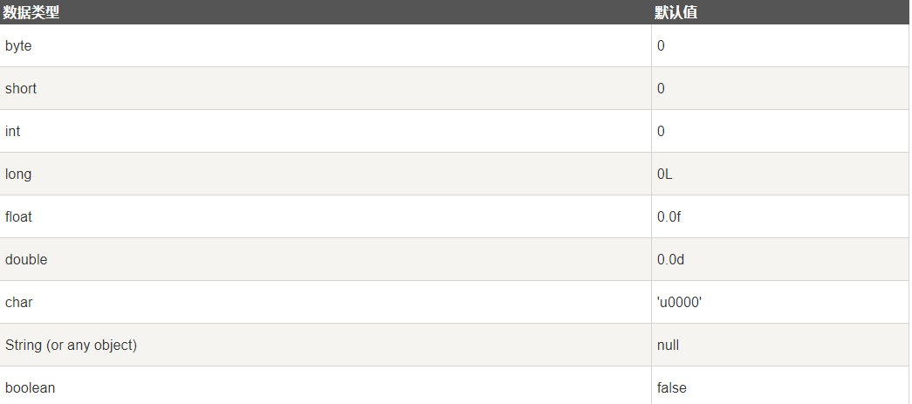

#### 引用类型

- 在Java中，引用类型的变量非常类似于C/C++的指针。引用类型指向一个对象，指向对象的变量是引用变量。这些变量在声明时被指定为一个特定的类型，比如 Employee、Puppy 等。变量一旦声明后，类型就不能被改变了。
- 对象、数组都是引用数据类型。
- 所有引用类型的默认值都是null。
- 一个引用变量可以用来引用任何与之兼容的类型。

#### 自动类型转换

**整型、实型（常量）、字符型数据可以混合运算。运算中，不同类型的数据先转化为同一类型，然后进行运算。**

转换从低级到高级。

```
低  ------------------------------------>  高

byte,short,char—> int —> long—> float —> double 
```

数据类型转换必须满足如下规则：

- 不能对boolean类型进行类型转换。

- 不能把对象类型转换成不相关类的对象。

- 在把容量大的类型转换为容量小的类型时必须使用强制类型转换。

- 转换过程中可能导致溢出或损失精度，例如：

  ```
  int i =128;   
  byte b = (byte)i;
  ```

  因为 byte 类型是 8 位，最大值为127，所以当 int 强制转换为 byte 类型时，值 128 时候就会导致溢出。

- 浮点数到整数的转换是通过舍弃小数得到，而不是四舍五入，例如：

  ```
  (int)23.7 == 23;        
  (int)-45.89f == -45
  ```

自动类型转换、强制类型转换、隐含强制类型转换

#### 运算符

##### 算术运算符

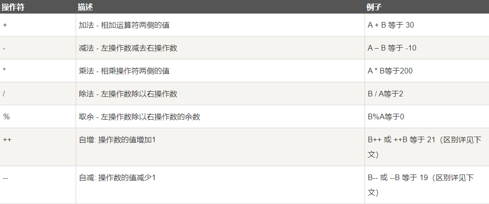

##### 关系运算符

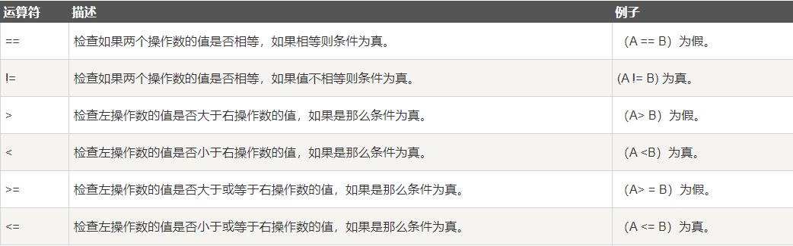

##### 位运算符

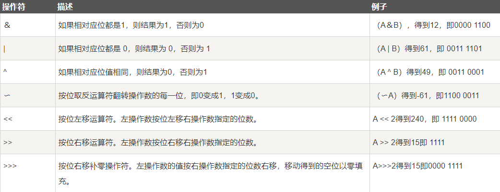

##### 逻辑运算符

##### 短路逻辑运算符

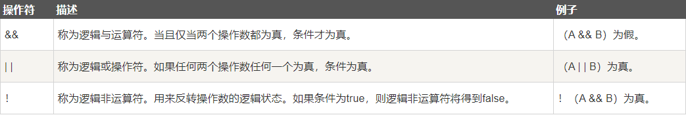

##### 赋值运算符

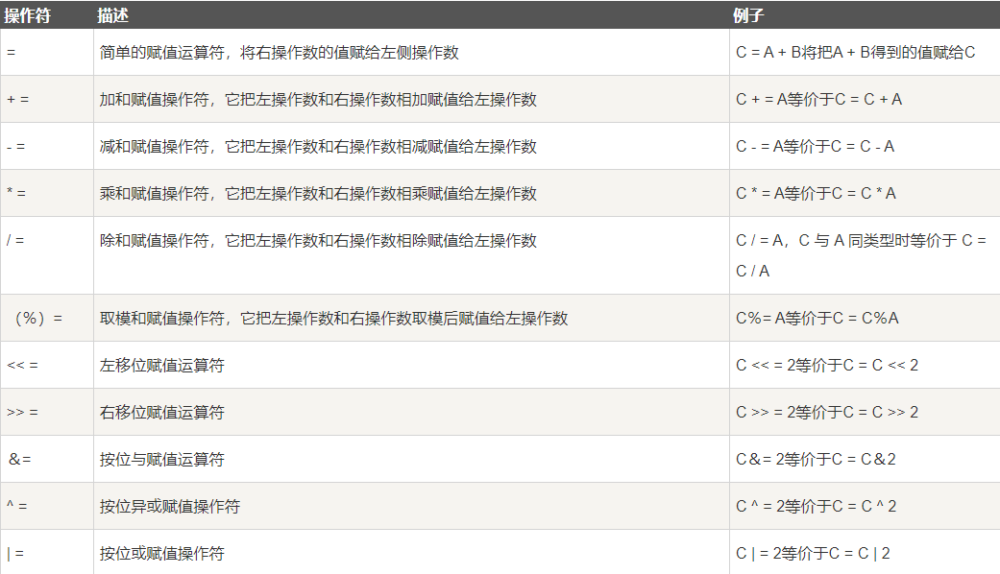

##### 条件运算符（?:）

```java
variable x = (expression) ? value if true : value if false
```

##### instanceof 运算符

```java
class Vehicle {}
 
public class Car extends Vehicle {
   public static void main(String[] args){
      Vehicle a = new Car();
      boolean result =  a instanceof Car;
      System.out.println( result);
   }
}

//true
```

##### Java运算符优先级

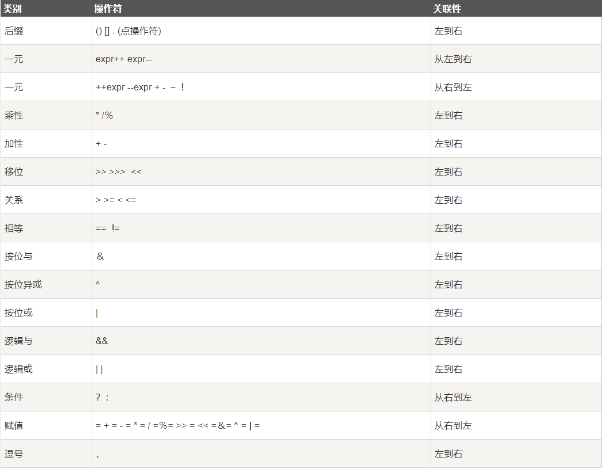

## 面向对象

### 特性

封装、继承、抽象、多态

方法的重写、重载（一个方法名，多种参数列表）

### 枚举的使用

```java
public enum MessageEnum {

    SYSTEM("1","系统消息"),
    WEILAN_FOR_HUOZHU("2","围栏给货主发消息"),
    WEILAN_FOR_CHEZHU("3","围栏给车主发消息"),
    ORDER_STATE("4","运单状态消息"),
    USER_FLEET("5","用户车队推送信息"),
    VOICE_NOTICE("6","语音播报通知"),
    ACCOUNT_DISABLE("7","账户禁用通知");

    private String type;    //类型
    private String desc;    //描述

    private MessageEnum(String type,String desc){
        this.type=type;
        this.desc=desc;
    }

    public String getType() {
        return type;
    }
    //各种get set
}

class MyTestTwo{
    public static void main(String[] args){
        //每个枚举成员实际上是一个枚举实例
        MessageEnum message=MessageEnum.SYSTEM; 
        
        System.out.println(message.getType());
        
        System.out.println(message.getDesc());
    }
}
```

### 接口

#### 接口与类相似点：

- 一个接口可以有多个方法。
- 接口文件保存在 .java 结尾的文件中，文件名使用接口名。
- 接口的字节码文件保存在 .class 结尾的文件中。
- 接口相应的字节码文件必须在与包名称相匹配的目录结构中。

#### 接口与类的区别：

- 接口不能用于实例化对象。
- 接口没有构造方法。
- 接口中所有的方法必须是抽象方法。
- 接口不能包含成员变量，除了 static 和 final 变量。
- 接口不是被类继承了，而是要被类实现。
- 接口支持多继承。

#### 接口特性

- 接口中每一个方法也是隐式抽象的,接口中的方法会被隐式的指定为 **public abstract**（只能是 public abstract，其他修饰符都会报错）。
- 接口中可以含有变量，但是接口中的变量会被隐式的指定为 **public static final** 变量（并且只能是 public，用 private 修饰会报编译错误）。
- 接口中的方法是不能在接口中实现的，只能由实现接口的类来实现接口中的方法。

#### 抽象类和接口的区别

- 抽象类中的方法可以有方法体，就是能实现方法的具体功能，但是接口中的方法不行。
- 抽象类中的成员变量可以是各种类型的，而接口中的成员变量只能是 **public static final** 类型的。
- 接口中不能含有静态代码块以及静态方法(用 static 修饰的方法)，而抽象类是可以有静态代码块和静态方法。
- 一个类只能继承一个抽象类，而一个类却可以实现多个接口。

> **注**：JDK 1.8 以后，接口里可以有静态方法和方法体了。
>
> **注**：JDK 1.8 以后，接口允许包含具体实现的方法，该方法称为"默认方法"，默认方法使用 default 关键字修饰。更多内容可参考 [Java 8 默认方法](https://www.runoob.com/java/java8-default-methods.html)。
>
> **注**：JDK 1.9 以后，允许将方法定义为 private，使得某些复用的代码不会把方法暴露出去。更多内容可参考 [Java 9 私有接口方法](https://www.runoob.com/java/java9-private-interface-methods.html)。

#### 接口的默认方法

Java 8 新增了接口的默认方法。

简单说，默认方法就是接口可以有实现方法，而且不需要实现类去实现其方法。

我们只需在方法名前面加个 default 关键字即可实现默认方法。

> **为什么要有这个特性？**
>
> 首先，之前的接口是个双刃剑，好处是面向抽象而不是面向具体编程，缺陷是，当需要修改接口时候，需要修改全部实现该接口的类，目前的 java 8 之前的集合框架没有 foreach 方法，通常能想到的解决办法是在JDK里给相关的接口添加新的方法及实现。然而，对于已经发布的版本，是没法在给接口添加新方法的同时不影响已有的实现。所以引进的默认方法。他们的目的是为了解决接口的修改与现有的实现不兼容的问题。

默认方法语法格式如下：

```java
public interface Vehicle {
   default void print(){
      System.out.println("我是一辆车!");
   }
}
```

#### 多个默认方法的解决办法

第一种解决方案是创建自己的默认方法，来覆盖重写接口的默认方法：

第二种解决方案可以使用 super 来调用指定接口的默认方法：

```java
public class Car implements Vehicle, FourWheeler {
   public void print(){
      Vehicle.super.print();
   }
}
```

### 容器

### 异常

### 泛型

#### 泛型方法

你可以写一个泛型方法，该方法在调用时可以接收不同类型的参数。根据传递给泛型方法的参数类型，编译器适当地处理每一个方法调用。

下面是定义泛型方法的规则：

- 所有泛型方法声明都有一个类型参数声明部分（由尖括号分隔），该类型参数声明部分在方法返回类型之前（在下面例子中的<E>）。
- 每一个类型参数声明部分包含一个或多个类型参数，参数间用逗号隔开。一个泛型参数，也被称为一个类型变量，是用于指定一个泛型类型名称的标识符。
- 类型参数能被用来声明返回值类型，并且能作为泛型方法得到的实际参数类型的占位符。
- 泛型方法体的声明和其他方法一样。注意类型参数只能代表引用型类型，不能是原始类型（像int,double,char的等）。

```java
public class GenericMethodTest
{
   // 泛型方法 printArray                         
   public static < E > void printArray( E[] inputArray )
   {
      // 输出数组元素            
         for ( E element : inputArray ){        
            System.out.printf( "%s ", element );
         }
         System.out.println();
    }
 
    public static void main( String args[] )
    {
        // 创建不同类型数组： Integer, Double 和 Character
        Integer[] intArray = { 1, 2, 3, 4, 5 };
        Double[] doubleArray = { 1.1, 2.2, 3.3, 4.4 };
        Character[] charArray = { 'H', 'E', 'L', 'L', 'O' };
 
        System.out.println( "整型数组元素为:" );
        printArray( intArray  ); // 传递一个整型数组
 
        System.out.println( "\n双精度型数组元素为:" );
        printArray( doubleArray ); // 传递一个双精度型数组
 
        System.out.println( "\n字符型数组元素为:" );
        printArray( charArray ); // 传递一个字符型数组
    } 
}
```


### 反射

### 注解

### I/O

### 图形化（了解）
