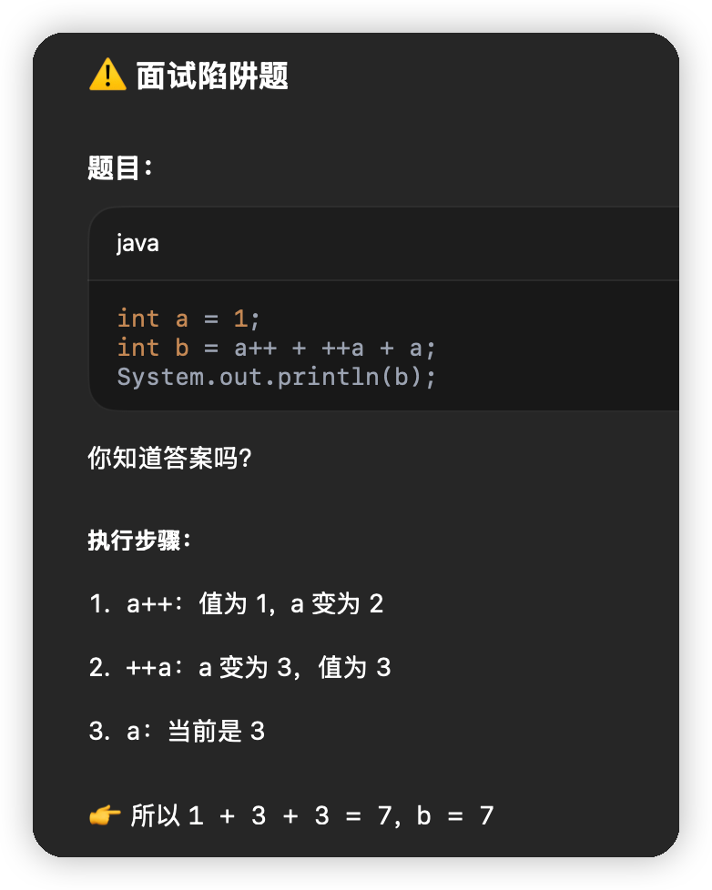

# 语言基础

## 基础语法

### 关键字


#### 访问控制修饰符

Java中，可以使用访问控制符来保护对类、变量、方法和构造方法的访问。Java 支持 4 种不同的访问权限。

- **default** (即默认，什么也不写）: 在同一包内可见，不使用任何修饰符。使用对象：类、接口、变量、方法。
- **private** : 在同一类内可见。使用对象：变量、方法。 **注意：不能修饰类（外部类）**
- **public** : 对所有类可见。使用对象：类、接口、变量、方法
- **protected** : 对同一包内的类和所有子类可见。使用对象：变量、方法。 **注意：不能修饰类（外部类）**。


#### 访问控制和继承

请注意以下方法继承的规则：

- 父类中声明为 public 的方法在子类中也必须为 public。
- 父类中声明为 protected 的方法在子类中要么声明为 protected，要么声明为 public，不能声明为 private。
- 父类中声明为 private 的方法，不能够被继承。

#### 非访问修饰符

为了实现一些其他的功能，Java 也提供了许多非访问修饰符。

static 修饰符，用来修饰类方法和类变量。

final 修饰符，用来修饰类、方法和变量，final 修饰的类不能够被继承，修饰的方法不能被继承类重新定义，修饰的变量为常量，是不可修改的。

abstract 修饰符，用来创建抽象类和抽象方法。

synchronized 和 volatile 修饰符，主要用于线程的编程。

##### static 修饰符

- **静态变量：**

  static 关键字用来声明独立于对象的静态变量，无论一个类实例化多少对象，它的静态变量只有一份拷贝。 静态变量也被称为类变量。局部变量不能被声明为 static 变量。

- **静态方法：**

  static 关键字用来声明独立于对象的静态方法。静态方法不能使用类的非静态变量。静态方法从参数列表得到数据，然后计算这些数据。

##### final 修饰符

**final 变量：**

final 表示"最后的、最终的"含义，变量一旦赋值后，不能被重新赋值。被 final 修饰的实例变量必须显式指定初始值。

final 修饰符通常和 static 修饰符一起使用来创建类常量。

**final 方法**

父类中的 final 方法可以被子类继承，但是不能被子类重写。

声明 final 方法的主要目的是防止该方法的内容被修改。

**final 类**

final 类不能被继承，没有类能够继承 final 类的任何特性。

##### abstract 修饰符

**抽象类：**

抽象类不能用来实例化对象，声明抽象类的唯一目的是为了将来对该类进行扩充。

一个类不能同时被 abstract 和 final 修饰。如果一个类包含抽象方法，那么该类一定要声明为抽象类，否则将出现编译错误。

抽象类可以包含抽象方法和非抽象方法。

**抽象方法**

抽象方法是一种没有任何实现的方法，该方法的的具体实现由子类提供。

抽象方法不能被声明成 final 和 static。

任何继承抽象类的子类必须实现父类的所有抽象方法，除非该子类也是抽象类。

如果一个类包含若干个抽象方法，那么该类必须声明为抽象类。抽象类可以不包含抽象方法。

抽象方法的声明以分号结尾，例如：**public abstract sample();**

##### transient 修饰符

序列化的对象包含被 transient 修饰的实例变量时，java 虚拟机(JVM)跳过该特定的变量。

该修饰符包含在定义变量的语句中，用来预处理类和变量的数据类型。

```java
public transient int limit = 55;   // 不会持久化
public int b; // 持久化
```

##### volatile 修饰符

volatile 修饰的成员变量在每次被线程访问时，都强制从共享内存中重新读取该成员变量的值。而且，当成员变量发生变化时，会强制线程将变化值回写到共享内存。这样在任何时刻，两个不同的线程总是看到某个成员变量的同一个值。
一个 volatile 对象引用可能是 null。

```java
public class MyRunnable implements Runnable
{
    private volatile boolean active;
    public void run()
    {
        active = true;
        while (active) // 第一行
        {
            // 代码
        }
    }
    public void stop()
    {
        active = false; // 第二行
    }
}
```

通常情况下，在一个线程调用 run() 方法（在 Runnable 开启的线程），在另一个线程调用 stop() 方法。 如果 ***第一行\*** 中缓冲区的 active 值被使用，那么在 ***第二行\*** 的 active 值为 false 时循环不会停止。
但是以上代码中我们使用了 volatile 修饰 active，所以该循环会停止。

### java的数据类型

ava 的两大数据类型:

- 基本数据类型（存储的是数值）
- 引用数据类型（存储的是地址值）

#### 基础数据类型

Java语言提供了八种基本类型。六种数字类型（四个整数型，两个浮点型），一种字符类型，还有一种布尔型。

**基础数据类型中的数组类型都有默认值**！！！！

> **byte：**
>
> - byte 数据类型是8位（1字节）、有符号的，以二进制补码表示的整数；
> - 最小值是 **-128（-2^7）**；
> - 最大值是  **127（2^7-1）**；
> - 默认值是 **0**；
> - byte 类型用在大型数组中节约空间，主要代替整数，因为 byte 变量占用的空间只有 int 类型的四分之一；
> - 例子：byte a = 100，byte b = -50。
>
> **short：**
>
> - short 数据类型是 16 位（2字节）、有符号的以二进制补码表示的整数
> - 最小值是 **-32768（-2^15）**；
> - 最大值是  **32767（2^15 - 1）**；
> - Short 数据类型也可以像 byte 那样节省空间。一个short变量是int型变量所占空间的二分之一；
> - 默认值是 **0**；
> - 例子：short s = 1000，short r = -20000。
>
> **int：**
>
> - int 数据类型是32位（4字节）、有符号的以二进制补码表示的整数；
> - 最小值是 **-2,147,483,648（-2^31）**；
> - 最大值是  **2,147,483,647（2^31 - 1）**；
> - 一般地整型变量默认为 int 类型；
> - 默认值是 **0** ；
> - 例子：int a = 100000, int b = -200000。
>
> **long：**
>
> - long 数据类型是 64 位（8字节）、有符号的以二进制补码表示的整数；
> - 最小值是 **-9,223,372,036,854,775,808（-2^63）**；
> - 最大值是  **9,223,372,036,854,775,807（2^63 -1）**；
> - 这种类型主要使用在需要比较大整数的系统上；
> - 默认值是 **0L**；
> - 例子： long a = 100000L，Long b = -200000L。
>   "L"理论上不分大小写，但是若写成"l"容易与数字"1"混淆，不容易分辩。所以最好大写。
>
> **float：**
>
> - float 数据类型是单精度、32位（4字节）、符合IEEE 754标准的浮点数；
> - float 在储存大型浮点数组的时候可节省内存空间；
> - 默认值是 **0.0f**；
> - 浮点数不能用来表示精确的值，如货币；
> - 例子：float f1 = 234.5f。
>
> **double：**
>
> - double 数据类型是双精度、64 位（八个字节）、符合 IEEE 754 标准的浮点数；
>
> - 浮点数的默认类型为 double 类型；
>
> - double类型同样不能表示精确的值，如货币；
>
> - 默认值是 **0.0d**；
>
> - 例子：
>
>   ```
>   double   d1  = 7D ;
>   double   d2  = 7.; 
>   double   d3  =  8.0; 
>   double   d4  =  8.D; 
>   double   d5  =  12.9867; 
>   ```
>
>   7 是一个 int 字面量，而 7D，7. 和 8.0 是 double 字面量。
>
> **boolean：**
>
> - boolean数据类型表示一位的信息；
> - 只有两个取值：true 和 false；
> - 这种类型只作为一种标志来记录 true/false 情况；
> - 默认值是 **false**；
> - 例子：boolean one = true。
>
> **char：**
>
> - char 类型是一个单一的 16 位（2字节） Unicode 字符；
> - 最小值是 **\u0000**（十进制等效值为 0）；
> - 最大值是 **\uffff**（即为 65535）；
> - char 数据类型可以储存任何字符；
> - 例子：char letter = 'A';。


#### 引用类型

- 在Java中，引用类型的变量非常类似于C/C++的指针。引用类型指向一个对象，指向对象的变量是引用变量。这些变量在声明时被指定为一个特定的类型，比如 Employee、Puppy 等。变量一旦声明后，类型就不能被改变了。
- 对象、数组都是引用数据类型。
- 所有引用类型的默认值都是null。
- 一个引用变量可以用来引用任何与之兼容的类型。

#### 自动类型转换

**整型、实型（常量）、字符型数据可以混合运算。运算中，不同类型的数据先转化为同一类型，然后进行运算。**

转换从低级到高级。

```
低  ------------------------------------>  高

byte,short,char—> int —> long—> float —> double 
```

数据类型转换必须满足如下规则：

- 不能对boolean类型进行类型转换。

- 不能把对象类型转换成不相关类的对象。

- 在把容量大的类型转换为容量小的类型时必须使用强制类型转换。

- 转换过程中可能导致溢出或损失精度，例如：

  ```
  int i =128;   
  byte b = (byte)i;
  ```

  因为 byte 类型是 8 位，最大值为127，所以当 int 强制转换为 byte 类型时，值 128 时候就会导致溢出。

- 浮点数到整数的转换是通过舍弃小数得到，而不是四舍五入，例如：

  ```
  (int)23.7 == 23;        
  (int)-45.89f == -45
  ```

自动类型转换、强制类型转换、隐含强制类型转换

#### 自动拆箱可能会引发NPE

```java
public class AutoboxingUnboxingIssue {
    public static void main(String[] args) {
        Integer num = null;  // 包装类对象为 null
        int value = num;     // 自动拆箱：尝试将 null 转换为 int，抛出 NullPointerException
        System.out.println(value);
    }
}
```

#### 自动装箱与Integer缓存池

```java
public class IntegerCacheDemo {
    public static void main(String[] args) {
        Integer a = 127;
        Integer b = 127;
        System.out.println(a == b);  // true

        Integer c = 128;
        Integer d = 128;
        System.out.println(c == d);  // false
    }
}
```

IntegerCache 是 Integer 的一个静态内部类：

```java
private static class IntegerCache {
    static final int low = -128;
    static final int high;
    static final Integer cache[];

    static {
        int h = 127;
        String integerCacheHighPropValue =
            sun.misc.VM.getSavedProperty("java.lang.Integer.IntegerCache.high");
        if (integerCacheHighPropValue != null) {
            int i = parseInt(integerCacheHighPropValue);
            h = Math.max(i, 127);
            h = Math.min(i, Integer.MAX_VALUE - (-low));
        }
        high = h;

        cache = new Integer[(high - low) + 1];
        for (int i = 0; i < cache.length; i++)
            cache[i] = new Integer(low + i);
    }
}
```

也就是说，Java 在初始化时就缓存了 [-128, 127] 范围的 Integer 对象。

#### 运算符

##### 算术运算符


##### 关系运算符


##### 位运算符


##### 逻辑运算符

##### 短路逻辑运算符


##### 赋值运算符


##### 条件运算符（?:）

```java
variable x = (expression) ? value if true : value if false
```

##### instanceof 运算符

```java
class Vehicle {}
 
public class Car extends Vehicle {
   public static void main(String[] args){
      Vehicle a = new Car();
      boolean result =  a instanceof Car;
      System.out.println( result);
   }
}

//true
```

##### Java运算符优先级


##### ++运算符



### return


### 循环

```java
outer: for (int i = 0; i < 3; i++) {
    for (int j = 0; j < 3; j++) {
        if (i == 1 && j == 1) break outer;
        System.out.println("i=" + i + ", j=" + j);
    }
}
```

```
i=0, j=0
i=0, j=1
i=0, j=2
i=1, j=0
```


```java
for (int i = 0; i < 3; i++) {
    for (int j = 0; j < 3; j++) {
        if (i == 1 && j == 1) break;
        System.out.println("i=" + i + ", j=" + j);
    }
}
```

```
i=0, j=0
i=0, j=1
i=0, j=2
i=1, j=0
i=2, j=0
i=2, j=1
i=2, j=2
```

```java
for (int i = 0; i < 3; i++) {
    for (int j = 0; j < 3; j++) {
        if (i == 1 && j == 1) break;
        System.out.println("i=" + i + ", j=" + j);
    }
}
//这两个等效
for (int i = 0; i < 3; i++) {
    outer: for (int j = 0; j < 3; j++) {
        if (i == 1 && j == 1) break outer;
        System.out.println("i=" + i + ", j=" + j);
    }
}
```

### case的穿透性

```java
int x = 2;
switch (x) {
    case 1:
    case 2:
    case 3:
        System.out.println("Hello");
    default:
        System.out.println("Default");
}
```

```
Hello
Default
```


### String、StringBuilder、StringBuffer


```java
String s1 = new String("abc");
String s2 = s1.intern();
String s3 = "abc";

System.out.println(s1 == s2); // false
System.out.println(s2 == s3); // true
```

intern() 将字符串加入常量池并返回常量池中唯一引用

JDK7+版本常量池是放在heap里

## 面向对象

### 特性

封装、继承、抽象、多态

方法的重写、重载（一个方法名，多种参数列表）

### 枚举的使用

```java
public enum MessageEnum {

    SYSTEM("1","系统消息"),
    WEILAN_FOR_HUOZHU("2","围栏给货主发消息"),
    WEILAN_FOR_CHEZHU("3","围栏给车主发消息"),
    ORDER_STATE("4","运单状态消息"),
    USER_FLEET("5","用户车队推送信息"),
    VOICE_NOTICE("6","语音播报通知"),
    ACCOUNT_DISABLE("7","账户禁用通知");

    private String type;    //类型
    private String desc;    //描述

    private MessageEnum(String type,String desc){
        this.type=type;
        this.desc=desc;
    }

    public String getType() {
        return type;
    }
    //各种get set
}

class MyTestTwo{
    public static void main(String[] args){
        //每个枚举成员实际上是一个枚举实例
        MessageEnum message=MessageEnum.SYSTEM; 
        
        System.out.println(message.getType());
        
        System.out.println(message.getDesc());
    }
}
```

### 接口

#### 接口与类相似点：

- 一个接口可以有多个方法。
- 接口文件保存在 .java 结尾的文件中，文件名使用接口名。
- 接口的字节码文件保存在 .class 结尾的文件中。
- 接口相应的字节码文件必须在与包名称相匹配的目录结构中。

#### 接口与类的区别：

- 接口不能用于实例化对象。
- 接口没有构造方法。
- 接口中所有的方法必须是抽象方法。
- 接口不能包含成员变量，除了 static 和 final 变量。
- 接口不是被类继承了，而是要被类实现。
- 接口支持多继承。

#### 接口特性

- 接口中每一个方法也是隐式抽象的,接口中的方法会被隐式的指定为 **public abstract**（只能是 public abstract，其他修饰符都会报错）。
- 接口中可以含有变量，但是接口中的变量会被隐式的指定为 **public static final** 变量（并且只能是 public，用 private 修饰会报编译错误）。
- 接口中的方法是不能在接口中实现的，只能由实现接口的类来实现接口中的方法。

#### 抽象类和接口的区别

- 抽象类中的方法可以有方法体，就是能实现方法的具体功能，但是接口中的方法不行。
- 抽象类中的成员变量可以是各种类型的，而接口中的成员变量只能是 **public static final** 类型的。
- 接口中不能含有静态代码块以及静态方法(用 static 修饰的方法)，而抽象类是可以有静态代码块和静态方法。
- 一个类只能继承一个抽象类，而一个类却可以实现多个接口。

> **注**：JDK 1.8 以后，接口里可以有静态方法和方法体了。
>
> **注**：JDK 1.8 以后，接口允许包含具体实现的方法，该方法称为"默认方法"，默认方法使用 default 关键字修饰。更多内容可参考 [Java 8 默认方法](https://www.runoob.com/java/java8-default-methods.html)。
>
> **注**：JDK 1.9 以后，允许将方法定义为 private，使得某些复用的代码不会把方法暴露出去。更多内容可参考 [Java 9 私有接口方法](https://www.runoob.com/java/java9-private-interface-methods.html)。

#### 接口的默认方法

Java 8 新增了接口的默认方法。

简单说，默认方法就是接口可以有实现方法，而且不需要实现类去实现其方法。

我们只需在方法名前面加个 default 关键字即可实现默认方法。

> **为什么要有这个特性？**
>
> 首先，之前的接口是个双刃剑，好处是面向抽象而不是面向具体编程，缺陷是，当需要修改接口时候，需要修改全部实现该接口的类，目前的 java 8 之前的集合框架没有 foreach 方法，通常能想到的解决办法是在JDK里给相关的接口添加新的方法及实现。然而，对于已经发布的版本，是没法在给接口添加新方法的同时不影响已有的实现。所以引进的默认方法。他们的目的是为了解决接口的修改与现有的实现不兼容的问题。

默认方法语法格式如下：

```java
public interface Vehicle {
   default void print(){
      System.out.println("我是一辆车!");
   }
}
```

#### 多个默认方法的解决办法

第一种解决方案是创建自己的默认方法，来覆盖重写接口的默认方法：

第二种解决方案可以使用 super 来调用指定接口的默认方法：

```java
public class Car implements Vehicle, FourWheeler {
   public void print(){
      Vehicle.super.print();
   }
}
```

#### 接口的default方法


### 异常

#### 异常的分类

**错误**：Error类以及他的子类的实例，代表了JVM本身的错误。错误不能被程序员通过代码处理，Error很少出现。因此，程序员应该关注Exception为父类的分支下的各种异常类。

**异常**：Exception以及他的子类，代表程序运行时发送的各种不期望发生的事件。可以被Java异常处理机制使用，是异常处理的核心。


总体上我们根据Javac对异常的处理要求，将异常类分为2类。

**非检查异常**（unckecked exception）：Error 和 RuntimeException 以及他们的子类。javac在编译时，不会提示和发现这样的异常，不要求在程序处理这些异常。所以如果愿意，我们可以编写代码处理（使用try...catch...finally）这样的异常，也可以不处理。对于这些异常，我们应该修正代码，而不是去通过异常处理器处理 。这样的异常发生的原因多半是代码写的有问题。如除0错误ArithmeticException，错误的强制类型转换错误ClassCastException，数组索引越界ArrayIndexOutOfBoundsException，使用了空对象NullPointerException等等。

**检查异常**（checked exception）：除了Error 和 RuntimeException的其它异常。javac强制要求程序员为这样的异常做预备处理工作（使用try...catch...finally或者throws）。在方法中要么用try-catch语句捕获它并处理，要么用throws子句声明抛出它，否则编译不会通过。这样的异常一般是由程序的运行环境导致的。因为程序可能被运行在各种未知的环境下，而程序员无法干预用户如何使用他编写的程序，于是程序员就应该为这样的异常时刻准备着。如SQLException , IOException,ClassNotFoundException 等。

需要明确的是：检查和非检查是对于javac来说的，这样就很好理解和区分了

#### 异常信息

异常是在执行某个函数时引发的，而函数又是层级调用，形成调用栈的，因为，只要一个函数发生了异常，那么他的所有的caller都会被异常影响。当这些被影响的函数以异常信息输出时，就形成的了**异常追踪栈**。

异常最先发生的地方，叫做**异常抛出点**。

 


从上面的例子可以看出，当devide函数发生除0异常时，devide函数将抛出ArithmeticException异常，因此调用他的CMDCalculate函数也无法正常完成，因此也发送异常，而CMDCalculate的caller——main 因为CMDCalculate抛出异常，也发生了异常，这样一直向调用栈的栈底回溯。这种行为叫做异常的冒泡，异常的冒泡是为了在当前发生异常的函数或者这个函数的caller中找到最近的异常处理程序。由于这个例子中没有使用任何异常处理机制，因此异常最终由main函数抛给JRE，导致程序终止。

上面的代码不使用异常处理机制，也可以顺利编译，因为2个异常都是非检查异常。但是下面的例子就必须使用异常处理机制，因为异常是检查异常。

代码中我选择使用throws声明异常，让函数的调用者去处理可能发生的异常。但是为什么只throws了IOException呢？因为FileNotFoundException是IOException的子类，在处理范围内。

```java
@Test
public void testException() throws IOException
{
    //FileInputStream的构造函数会抛出FileNotFoundException
    FileInputStream fileIn = new FileInputStream("E:\\a.txt");
    
    int word;
    //read方法会抛出IOException
    while((word =  fileIn.read())!=-1) 
    {
        System.out.print((char)word);
    }
    //close方法会抛出IOException
    fileIn.close;
}
```

#### 异常处理的基本语法

##### 终结式异常处理模式

```java
try{
	//try块中放可能发生异常的代码。     
    //如果执行完try且不发生异常，则接着去执行finally块和finally后面的代码（如果有的话）。     
    //如果发生异常，则尝试去匹配catch块。

}catch(SQLException SQLexception){
    //每一个catch块用于捕获并处理一个特定的异常，或者这异常类型的子类。Java7中可以将多个异常声明在一个catch中。
    //catch后面的括号定义了异常类型和异常参数。如果异常与之匹配且是最先匹配到的，则虚拟机将使用这个catch块来处理异常。
    //在catch块中可以使用这个块的异常参数来获取异常的相关信息。异常参数是这个catch块中的局部变量，其它块不能访问。
    //如果当前try块中发生的异常在后续的所有catch中都没捕获到，则先去执行finally，然后到这个函数的外部caller中去匹配异常处理器。    
    //如果try中没有发生异常，则所有的catch块将被忽略。
}catch(Exception exception){
    //...
}finally{
	//finally块通常是可选的。   //无论异常是否发生，异常是否匹配被处理，finally都会执行。
	//一个try至少要有一个catch块，否则， 至少要有1个finally块。但是finally不是用来处理异常的，finally不会捕获异常。
	//finally主要做一些清理工作，如流的关闭，数据库连接的关闭等。 
}
```

**需要注意的地方**

1、try块中的局部变量和catch块中的局部变量（包括异常变量），以及finally中的局部变量，他们之间不可共享使用。

2、每一个catch块用于处理一个异常。异常匹配是按照catch块的顺序从上往下寻找的，只有第一个匹配的catch会得到执行。匹配时，不仅运行精确匹配，也支持父类匹配，因此，如果同一个try块下的多个catch异常类型有父子关系，应该将子类异常放在前面，父类异常放在后面，这样保证每个catch块都有存在的意义。

3、java中，异常处理的任务就是将执行控制流从异常发生的地方转移到能够处理这种异常的地方去。也就是说：当一个函数的某条语句发生异常时，这条语句的后面的语句不会再执行，它失去了焦点。执行流跳转到最近的匹配的异常处理catch代码块去执行，异常被处理完后，执行流会接着在“处理了这个异常的catch代码块”后面接着执行。

有的编程语言当异常被处理后，控制流会恢复到异常抛出点接着执行，这种策略叫做：**resumption model of exception handling**（恢复式异常处理模式 ）

而Java则是让执行流恢复到处理了异常的catch块后接着执行，这种策略叫做：**termination model of exception handling**（终结式异常处理模式）

##### 抛出式

###### 被动抛出

```java
public void foo() throws ExceptionType1 , ExceptionType2 ,ExceptionTypeN { 
     //foo内部可以抛出 ExceptionType1 , ExceptionType2 ,ExceptionTypeN 类的异常，或者他们的子类的异常对象。
}
```

###### 主动抛出

```java
public void save(User user) {
      if(user  == null) {
          throw new IllegalArgumentException("User对象为空");
      } else {
          //正常处理流程
      }
        
}
```

##### 异常的链化

在一些大型的，模块化的软件开发中，一旦一个地方发生异常，则如骨牌效应一样，将导致一连串的异常。假设B模块完成自己的逻辑需要调用A模块的方法，如果A模块发生异常，则B也将不能完成而发生异常，但是B在抛出异常时，会将A的异常信息掩盖掉，这将使得异常的根源信息丢失。异常的链化可以将多个模块的异常串联起来，使得异常信息不会丢失。

异常链化:以一个异常对象为参数构造新的异常对象。新的异对象将包含先前异常的信息。这项技术主要是异常类的一个带Throwable参数的函数来实现的。这个当做参数的异常，我们叫他根源异常（cause）。

查看Throwable类源码，可以发现里面有一个Throwable字段cause，就是它保存了构造时传递的根源异常参数。这种设计和链表的结点类设计如出一辙，因此形成链也是自然的了。

```java
public class Throwable implements Serializable {
    private Throwable cause = this;
   
    public Throwable(String message, Throwable cause) {
        fillInStackTrace();
        detailMessage = message;
        this.cause = cause;
    }
    public Throwable(Throwable cause) {
    	fillInStackTrace();
        detailMessage = (cause==null ? null : cause.toString());
        this.cause = cause;
    }
    //........
}
```

下面是一个例子，演示了异常的链化：从命令行输入2个int，将他们相加，输出。输入的数不是int，则导致getInputNumbers异常，从而导致add函数异常，则可以在add函数中抛出

一个链化的异常：

```java
public static void main(String[] args) {
    
    System.out.println("请输入2个加数");
    int result;
    try {
        result = add();
        System.out.println("结果:"+result);
    } catch (Exception e) {
        e.printStackTrace();
    }
}
//获取输入的2个整数返回
private static List<Integer> getInputNumbers() {
    List<Integer> nums = new ArrayList<>();
    Scanner scan = new Scanner(System.in);
    try {
        int num1 = scan.nextInt();
        int num2 = scan.nextInt();
        nums.add(new Integer(num1));
        nums.add(new Integer(num2));
    } catch(InputMismatchException immExp) {
        throw immExp;
    } finally {
        scan.close();
    }
    return nums;
}

//执行加法计算
private static int add() throws Exception {
    int result;
    try {
        List<Integer> nums = getInputNumbers();
        result = nums.get(0)  + nums.get(1);
    } catch(InputMismatchException immExp) {
        throw new Exception("计算失败",immExp);  //链化:以一个异常对象为参数构造新的异常对象。
    }
    return  result;
}
/*请输入2个加数
r 1
java.lang.Exception: 计算失败    
	at practise.ExceptionTest.add(ExceptionTest.java:53)    
	at practise.ExceptionTest.main(ExceptionTest.java:18)
Caused by: java.util.InputMismatchException    
	at java.util.Scanner.throwFor(Scanner.java:864)    
	at java.util.Scanner.next(Scanner.java:1485)    
	at java.util.Scanner.nextInt(Scanner.java:2117)    
	at java.util.Scanner.nextInt(Scanner.java:2076)    
	at practise.ExceptionTest.getInputNumbers(ExceptionTest.java:30)    
	at practise.ExceptionTest.add(ExceptionTest.java:48)    
	... 1 more
*/
```

##### finally块和return

首先一个不容易理解的事实：在 try块中即便有return，break，continue等改变执行流的语句，finally也会执行。

```java
public static void main(String[] args) {
    int re = bar();
    System.out.println(re);
}
private static int bar() {
    try {
        return 5;
    } finally {
        System.out.println("finally");
    }
}
/*输出：
finally
5
*/
```

很多人面对这个问题时，总是在归纳执行的顺序和规律，不过我觉得还是很难理解。我自己总结了一个方法。用如下GIF图说明。


也就是说：try...catch...finally中的return 只要能执行，就都执行了，他们共同向同一个内存地址（假设地址是0x80）写入返回值，后执行的将覆盖先执行的数据，而真正被调用者取的返回值就是最后一次写入的。那么，按照这个思想，下面的这个例子也就不难理解了。

###### finally中的return 会覆盖 try 或者catch中的返回值

```java
public static void main(String[] args) {
    int result;

    result = foo();
    System.out.println(result);	//2

    result = bar();
    System.out.println(result);	//2
}

@SuppressWarnings("finally")
public static int foo() {
    try {
        int a = 5 / 0;
    } catch (Exception e) {
        return 1;
    } finally {
        return 2;
    }

}

@SuppressWarnings("finally")
public static int bar() {
    try {
        return 1;
    } finally {
        return 2;
    }
}
```

###### finally中的return会抑制（消灭）前面try或者catch块中的异常

```java
class TestException {
    public static void main(String[] args) {
        int result;
        try {
            result = foo();
            System.out.println(result);            //输出100
        } catch (Exception e) {
            System.out.println(e.getMessage());    //没有捕获到异常
        }
        
        try {
            result  = bar();
            System.out.println(result);            //输出100
        } catch (Exception e) {
            System.out.println(e.getMessage());    //没有捕获到异常
        }
    }
    
    //catch中的异常被抑制
    @SuppressWarnings("finally")
    public static int foo() throws Exception {
        try {
            int a = 5/0;
            return 1;
        } catch (ArithmeticException amExp) {
            throw new Exception("我将被忽略，因为下面的finally中使用了return");
        } finally {
            return 100;
        }
    }
    
    //try中的异常被抑制
    @SuppressWarnings("finally")
    public static int bar() throws Exception {
        try {
            int a = 5/0;
            return 1;
        } finally {
            return 100;
        }
    }
}
```

###### finally中的异常会覆盖（消灭）前面try或者catch中的异常

```java
class TestException {
    public static void main(String[] args) {
        int result;
        try {
            result = foo();
        } catch (Exception e) {
            System.out.println(e.getMessage());    //输出：我是finaly中的Exception
        }
        
        try {
            result = bar();
        } catch (Exception e) {
            System.out.println(e.getMessage());    //输出：我是finaly中的Exception
        }
    }
    
    //catch中的异常被抑制
    @SuppressWarnings("finally")
    public static int foo() throws Exception {
        try {
            int a = 5/0;
            return 1;
        } catch(ArithmeticException amExp) {
            throw new Exception("我将被忽略，因为下面的finally中抛出了新的异常");
        } finally {
            throw new Exception("我是finaly中的Exception");
        }
    }
    
    //try中的异常被抑制
    @SuppressWarnings("finally")
    public static int bar() throws Exception {
        try {
            int a = 5/0;
            return 1;
        } finally {
            throw new Exception("我是finaly中的Exception");
        }
    }
}
```

上面的3个例子都异于常人的编码思维，因此我建议：

- 不要在fianlly中使用return。
- 不要在finally中抛出异常。
- 减轻finally的任务，不要在finally中做一些其它的事情，finally块仅仅用来释放资源是最合适的。
- 尽量将所有的return写在函数的最后面，而不是try ... catch ... finally中。

### 泛型

#### 泛型类

```java
//此处T可以随便写为任意标识，常见的如T、E、K、V等形式的参数常用于表示泛型
//在实例化泛型类时，必须指定T的具体类型
public class Generic<T>{ 
    //key这个成员变量的类型为T,T的类型由外部指定  
    private T key;

    //泛型构造方法形参key的类型也为T，T的类型由外部指定
    public Generic(T key) { 
        this.key = key;
    }

    //泛型方法getKey的返回值类型为T，T的类型由外部指定
    public T getKey(){ 
        return key;
    }
}
```

```java
//泛型的类型参数只能是类类型（包括自定义类），不能是简单类型
//传入的实参类型需与泛型的类型参数类型相同，即为Integer.
Generic<Integer> genericInteger = new Generic<Integer>(123456);

//传入的实参类型需与泛型的类型参数类型相同，即为String.
Generic<String> genericString = new Generic<String>("key_vlaue");
Log.d("泛型测试","key is " + genericInteger.getKey());
Log.d("泛型测试","key is " + genericString.getKey());
```

```
12-27 09:20:04.432 13063-13063/? D/泛型测试: key is 123456
12-27 09:20:04.432 13063-13063/? D/泛型测试: key is key_vlaue
```

定义的泛型类，就一定要传入泛型类型实参么？并不是这样，在使用泛型的时候如果传入泛型实参，则会根据传入的泛型实参做相应的限制，此时泛型才会起到本应起到的限制作用。如果不传入泛型类型实参的话，在泛型类中使用泛型的方法或成员变量定义的类型可以为任何的类型。

```java
Generic generic = new Generic("111111");
Generic generic1 = new Generic(4444);
Generic generic2 = new Generic(55.55);
Generic generic3 = new Generic(false);

Log.d("泛型测试","key is " + generic.getKey());
Log.d("泛型测试","key is " + generic1.getKey());
Log.d("泛型测试","key is " + generic2.getKey());
Log.d("泛型测试","key is " + generic3.getKey());
```

```java
D/泛型测试: key is 111111
D/泛型测试: key is 4444
D/泛型测试: key is 55.55
D/泛型测试: key is false
```

#### 泛型接口

```java
//定义一个泛型接口
public interface Generator<T> {
    public T next();
}
```

```java
/**
 * 未传入泛型实参时，与泛型类的定义相同，在声明类的时候，需将泛型的声明也一起加到类中
 * 即：class FruitGenerator<T> implements Generator<T>{
 * 如果不声明泛型，如：class FruitGenerator implements Generator<T>，编译器会报错："Unknown class"
 */
class FruitGenerator<T> implements Generator<T>{
    @Override
    public T next() {
        return null;
    }
}
```

```java
/**
 * 传入泛型实参时：
 * 定义一个生产器实现这个接口,虽然我们只创建了一个泛型接口Generator<T>
 * 但是我们可以为T传入无数个实参，形成无数种类型的Generator接口。
 * 在实现类实现泛型接口时，如已将泛型类型传入实参类型，则所有使用泛型的地方都要替换成传入的实参类型
 * 即：Generator<T>，public T next();中的的T都要替换成传入的String类型。
 */
public class FruitGenerator implements Generator<String> {

    private String[] fruits = new String[]{"Apple", "Banana", "Pear"};

    @Override
    public String next() {
        Random rand = new Random();
        return fruits[rand.nextInt(3)];
    }
}
```

#### 泛型通配符

我们知道`Ingeter`是`Number`的一个子类，同时在特性章节中我们也验证过`Generic<Ingeter>`与`Generic<Number>`实际上是相同的一种基本类型。那么问题来了，在使用`Generic<Number>`作为形参的方法中，能否使用`Generic<Ingeter>`的实例传入呢？在逻辑上类似于`Generic<Number>`和`Generic<Ingeter>`是否可以看成具有父子关系的泛型类型呢？

为了弄清楚这个问题，我们使用`Generic<T>`这个泛型类继续看下面的例子：

```java
public void showKeyValue1(Generic<Number> obj){
    Log.d("泛型测试","key value is " + obj.getKey());
}
```

```java
Generic<Integer> gInteger = new Generic<Integer>(123);
Generic<Number> gNumber = new Generic<Number>(456);

showKeyValue(gNumber);

// showKeyValue这个方法编译器会为我们报错：Generic<java.lang.Integer> 
// cannot be applied to Generic<java.lang.Number>
// showKeyValue(gInteger);
```

通过提示信息我们可以看到`Generic<Integer>`不能被看作为``Generic<Number>`的子类。由此可以看出:同一种泛型可以对应多个版本（因为参数类型是不确定的），不同版本的泛型类实例是不兼容的。

回到上面的例子，如何解决上面的问题？总不能为了定义一个新的方法来处理`Generic<Integer>`类型的类，这显然与java中的多台理念相违背。因此我们需要一个在逻辑上可以表示同时是`Generic<Integer>`和`Generic<Number>`父类的引用类型。由此类型通配符应运而生。

我们可以将上面的方法改一下：

```java
public void showKeyValue1(Generic<?> obj){
    Log.d("泛型测试","key value is " + obj.getKey());
}
```

类型通配符一般是使用？代替具体的类型实参，注意了，此处’？’是类型实参，而不是类型形参 。重要说三遍！此处’？’是类型实参，而不是类型形参 ！ 此处’？’是类型实参，而不是类型形参 ！再直白点的意思就是，此处的？和Number、String、Integer一样都是一种实际的类型，可以把？看成所有类型的父类。是一种真实的类型。

可以解决当具体类型不确定的时候，这个通配符就是 ? ；当操作类型时，不需要使用类型的具体功能时，只使用Object类中的功能。那么可以用 ? 通配符来表未知类型。

#### 泛型方法

你可以写一个泛型方法，该方法在调用时可以接收不同类型的参数。根据传递给泛型方法的参数类型，编译器适当地处理每一个方法调用。

下面是定义泛型方法的规则：

- 所有泛型方法声明都有一个类型参数声明部分（由尖括号分隔），该类型参数声明部分在方法返回类型之前（在下面例子中的<E>）。
- 每一个类型参数声明部分包含一个或多个类型参数，参数间用逗号隔开。一个泛型参数，也被称为一个类型变量，是用于指定一个泛型类型名称的标识符。
- 类型参数能被用来声明返回值类型，并且能作为泛型方法得到的实际参数类型的占位符。
- 泛型方法体的声明和其他方法一样。注意类型参数只能代表引用型类型，不能是原始类型（像int,double,char的等）。

```java
public class GenericMethodTest
{
   // 泛型方法 printArray                         
   public static < E > void printArray( E[] inputArray )
   {
      // 输出数组元素            
         for ( E element : inputArray ){        
            System.out.printf( "%s ", element );
         }
         System.out.println();
    }
 
    public static void main( String args[] )
    {
        // 创建不同类型数组： Integer, Double 和 Character
        Integer[] intArray = { 1, 2, 3, 4, 5 };
        Double[] doubleArray = { 1.1, 2.2, 3.3, 4.4 };
        Character[] charArray = { 'H', 'E', 'L', 'L', 'O' };
 
        System.out.println( "整型数组元素为:" );
        printArray( intArray  ); // 传递一个整型数组
 
        System.out.println( "\n双精度型数组元素为:" );
        printArray( doubleArray ); // 传递一个双精度型数组
 
        System.out.println( "\n字符型数组元素为:" );
        printArray( charArray ); // 传递一个字符型数组
    } 
}
```

在编译之后程序会采取去泛型化的措施。也就是说Java中的泛型，只在编译阶段有效。在编译过程中，正确检验泛型结果后，会将泛型的相关信息擦出，并且在对象进入和离开方法的边界处添加类型检查和类型转换的方法。也就是说，泛型信息不会进入到运行时阶段。

对此总结成一句话：泛型类型在逻辑上看以看成是多个不同的类型，实际上都是相同的基本类型。

#### 泛型上下边界

```java
public void showKeyValue1(Generic<? extends Number> obj){
    Log.d("泛型测试","key value is " + obj.getKey());
}
```

```java
Generic<String> generic1 = new Generic<String>("11111");
Generic<Integer> generic2 = new Generic<Integer>(2222);
Generic<Float> generic3 = new Generic<Float>(2.4f);
Generic<Double> generic4 = new Generic<Double>(2.56);

//这一行代码编译器会提示错误，因为String类型并不是Number类型的子类
//showKeyValue1(generic1);

showKeyValue1(generic2);
showKeyValue1(generic3);
showKeyValue1(generic4);
```

如果我们把泛型类的定义也改一下:

```java
public class Generic<T extends Number>{
    private T key;

    public Generic(T key) {
        this.key = key;
    }

    public T getKey(){
        return key;
    }
}
```

```java
//这一行代码也会报错，因为String不是Number的子类
Generic<String> generic1 = new Generic<String>("11111");
```

### 反射

常规编程思想中我们都是使用生成好的JavaBean类，而当我们需要使用我们本身不具备的类时就需要使用非常规手段来获得，JavaBean类经过编译最终都会编程class字节码文件，我们可以通过手动获取class字节码文件来模拟jvm获取JavaBean实体类的过程。

#### 如何通过class字节码文件获取实体类

例如：我们现在已经获得了一个类的class对象

```java
Class a = Animal.class;
Animal animal = (Animal)a.getConstructor(String.class, int.class)
//最后括号内是Animal类构造方法所需参数的class字节码文件
```

至此，我们已经class字节码文件得到了我们想要的JavaBean实体类，现在我们需要考虑的就是如何获得到我们想要的类的class字节码文件

#### 如何获取我们想要的class字节码文件

```java
Animal.getClass();
Class.forName("com.zlb.pojo")//全限定名称
Class.getSuperclass();//等等等等，常用的一般第二个
```

#### 通过反射我们能获取什么

1.

```java
public class Animal<K,V> extends xxx implements xxxx
//限定符 class关键字 类名 泛型类型   父类             接口
```

都有对应方法，使用时查询API

2.

类变量  （变量类型、修饰符、注解、变量名、获取设置变量值）

类方法  （方法参数名、参数类型、方法抛出异常类型、方法修饰符、方法返回类型）

```java
//获取JavaBean的class字节码文件 a 以及通过class字节码文件反射得到的类实例 aminal 后
Method sleep = a.getDeclaredMethod("sleep", String.class);
//sleep是方法名，后面是方法参数类型的字节码文件
sleep.invoke(animal);
//方法参数不定的用数组来解决
```

类构造函数

可用于直接创建对象实例

#### 访问私有变量、方法、构造函数的解决方法

```java
//先让该类 extends AccessibleObject,然后
fieldName.setAccessible(true);//就可以取消Java语言访问权限检查
```

#### 反射的优缺点

##### 安全限制

反射本身是通过class字节码文件来实现对象的实例化，本身就有很高的安全风险。

##### 内部曝光

通过内部曝光使得之前设置私有的变量方法暴露无遗，反射代码破坏了抽象性，因而当平台发生改变时代码也随时有改变的风险

##### 性能开销

反射设计类型动态解析，jvm无法对这些代码进行优化，所以性能开销很大

### 注解

#### 注解的定义

- 日常开发中新建Java类，我们使用class、interface比较多，而注解和它们一样，也是一种类的类型，他是用的修饰符为 @interface


```java
public @interface MyTestAnnotation {

}
```

使用

```java
@MyTestAnnotation
public class test {
   @MyTestAnnotation
   public static void main(String[] args){
   }
}
```

#### 元注解

元注解顾名思义我们可以理解为注解的注解，它是作用在注解中，方便我们使用注解实现想要的功能。元注解分别有@Retention、 @Target、 @Document、 @Inherited和@Repeatable（JDK1.8加入）五种。

##### @Retention

> - Retention英文意思有保留、保持的意思，它表示注解存在阶段是保留在源码（编译期），字节码（类加载）或者运行期（JVM中运行）。在@Retention注解中使用枚举RetentionPolicy来表示注解保留时期
> - @Retention(RetentionPolicy.SOURCE)，注解仅存在于源码中，在class字节码文件中不包含
> - @Retention(RetentionPolicy.CLASS)， 默认的保留策略，注解会在class字节码文件中存在，但运行时无法获得
> - @Retention(RetentionPolicy.RUNTIME)， 注解会在class字节码文件中存在，在运行时可以通过反射获取到
> - 如果我们是自定义注解，则通过前面分析，我们自定义注解如果只存着源码中或者字节码文件中就无法发挥作用，而在运行期间能获取到注解才能实现我们目的，所以自定义注解中肯定是使用 **@Retention(RetentionPolicy.RUNTIME)**

```java
@Retention(RetentionPolicy.RUNTIME)
public @interface MyTestAnnotation {

}
```

##### @Target

> - Target的英文意思是目标，这也很容易理解，使用@Target元注解表示我们的注解作用的范围就比较具体了，可以是类，方法，方法参数变量等，同样也是通过枚举类ElementType表达作用类型
> - @Target(ElementType.TYPE) 作用接口、类、枚举、注解
> - @Target(ElementType.FIELD) 作用属性字段、枚举的常量
> - @Target(ElementType.METHOD) 作用方法
> - @Target(ElementType.PARAMETER) 作用方法参数
> - @Target(ElementType.CONSTRUCTOR) 作用构造函数
> - @Target(ElementType.LOCAL_VARIABLE)作用局部变量
> - @Target(ElementType.ANNOTATION_TYPE)作用于注解（@Retention注解中就使用该属性）
> - @Target(ElementType.PACKAGE) 作用于包
> - @Target(ElementType.TYPE_PARAMETER) 作用于类型泛型，即泛型方法、泛型类、泛型接口 （jdk1.8加入）
> - @Target(ElementType.TYPE_USE) 类型使用.可以用于标注任意类型除了 class （jdk1.8加入）
> - 一般比较常用的是ElementType.TYPE类型

```java
@Retention(RetentionPolicy.RUNTIME)
@Target(ElementType.TYPE)
public @interface MyTestAnnotation {

}
```

##### @Documented

> Document的英文意思是文档。它的作用是能够将注解中的元素包含到 Javadoc 中去。

##### @Inherited

> Inherited的英文意思是继承，但是这个继承和我们平时理解的继承大同小异，一个被@Inherited注解了的注解修饰了一个父类，如果他的子类没有被其他注解修饰，则它的子类也继承了父类的注解。

下面我们来看个@Inherited注解例子

```java
/**自定义注解*/
@Documented
@Inherited
@Retention(RetentionPolicy.RUNTIME)
@Target(ElementType.TYPE)
public @interface MyTestAnnotation {
}
/**父类标注自定义注解*/
@MyTestAnnotation
public class Father {
}
/**子类*/
public class Son extends Father {
}
/**测试子类获取父类自定义注解*/
public class test {
   public static void main(String[] args){

      //获取Son的class对象
       Class<Son> sonClass = Son.class;
      // 获取Son类上的注解MyTestAnnotation可以执行成功
      MyTestAnnotation annotation = sonClass.getAnnotation(MyTestAnnotation.class);
   }
}
```

##### @Repeatable

> Repeatable的英文意思是可重复的。顾名思义说明被这个元注解修饰的注解可以同时作用一个对象多次，但是每次作用注解又可以代表不同的含义。

下面我们看一个人玩游戏的例子

```java
/**一个人喜欢玩游戏，他喜欢玩英雄联盟，绝地求生，极品飞车，尘埃4等，则我们需要定义一个人的注解，他属性代表喜欢玩游戏集合，一个游戏注解，游戏属性代表游戏名称*/
/**玩家注解*/
@Documented
@Retention(RetentionPolicy.RUNTIME)
@Target(ElementType.TYPE)
public @interface People {
    Game[] value() ;
}
/**游戏注解*/
@Repeatable(People.class)
@Retention(RetentionPolicy.RUNTIME)
@Target(ElementType.TYPE)
public @interface Game {
    String value() default "";
}
/**玩游戏类*/
@Game(value = "LOL")
@Game(value = "PUBG")
@Game(value = "NFS")
@Game(value = "Dirt4")
public class PlayGame {
}
```

#### 注解的属性

通过上一小节@Repeatable注解的例子，我们说到注解的属性。注解的属性其实和类中定义的变量有异曲同工之处，只是注解中的变量都是成员变量（属性），并且注解中是没有方法的，只有成员变量，变量名就是使用注解括号中对应的参数名，变量返回值注解括号中对应参数类型。相信这会你应该会对上面的例子有一个更深的认识。而@Repeatable注解中的变量则类型则是对应Annotation（接口）的泛型Class。

```java
/**注解Repeatable源码*/
@Documented
@Retention(RetentionPolicy.RUNTIME)
@Target(ElementType.ANNOTATION_TYPE)
public @interface Repeatable {
    /**
     * Indicates the <em>containing annotation type</em> for the
     * repeatable annotation type.
     * @return the containing annotation type
     */
    Class<? extends Annotation> value();
}
```

#### 注解属性类型

注解属性类型可以有以下列出的类型

- 基本数据类型
- String
- 枚举类型
- 注解类型
- Class类型
- 以上类型的一维数组类型

#### 注解成员变量赋值

如果注解又多个属性，则可以在注解括号中用“，”号隔开分别给对应的属性赋值，如下例子，注解在父类中赋值属性

```java
@Documented
@Inherited
@Retention(RetentionPolicy.RUNTIME)
@Target(ElementType.TYPE)
public @interface MyTestAnnotation {
    String name() default "mao";
    int age() default 18;
}

@MyTestAnnotation(name = "father",age = 50)
public class Father {
}
```

#### 获取注解属性

前面我们说了很多注解如何定义，放在哪，现在我们可以开始学习注解属性的提取了，这才是使用注解的关键，获取属性的值才是使用注解的目的。

如果获取注解属性，当然是反射啦，主要有三个基本的方法

```java
/**是否存在对应 Annotation 对象*/
public boolean isAnnotationPresent(Class<? extends Annotation> annotationClass) {
	return GenericDeclaration.super.isAnnotationPresent(annotationClass);
}

/**获取 Annotation 对象*/
public <A extends Annotation> A getAnnotation(Class<A> annotationClass) {
	Objects.requireNonNull(annotationClass);
	return (A) annotationData().annotations.get(annotationClass);
}

 /**获取所有 Annotation 对象数组*/   
public Annotation[] getAnnotations() {
	return AnnotationParser.toArray(annotationData().annotations);
} 
```

下面结合前面的例子，我们来获取一下注解属性，在获取之前我们自定义的注解必须使用元注解@Retention(RetentionPolicy.RUNTIME)

```java
public class test {
   public static void main(String[] args) throws NoSuchMethodException {

        /**
         * 获取类注解属性
         */
        Class<Father> fatherClass = Father.class;
        boolean annotationPresent = fatherClass.isAnnotationPresent(MyTestAnnotation.class);
        if(annotationPresent){
            MyTestAnnotation annotation = fatherClass.getAnnotation(MyTestAnnotation.class);
            System.out.println(annotation.name());
            System.out.println(annotation.age());
        }

        /**
         * 获取方法注解属性
         */
        try {
            Field age = fatherClass.getDeclaredField("age");
            boolean annotationPresent1 = age.isAnnotationPresent(Age.class);
            if(annotationPresent1){
                Age annotation = age.getAnnotation(Age.class);
                System.out.println(annotation.value());
            }

            Method play = PlayGame.class.getDeclaredMethod("play");
            if (play!=null){
                People annotation2 = play.getAnnotation(People.class);
                Game[] value = annotation2.value();
                for (Game game : value) {
                    System.out.println(game.value());
                }
            }
        } catch (NoSuchFieldException e) {
            e.printStackTrace();
        }
    }
}
```

运行结果：


#### JDK 提供的注解

| 注解              | 作用                                                         | 注意事项                                                     |
| ----------------- | ------------------------------------------------------------ | ------------------------------------------------------------ |
| @Override         | 它是用来描述当前方法是一个重写的方法，在编译阶段对方法进行检查 | jdk1.5中它只能描述继承中的重写，jdk1.6中它可以描述接口实现的重写,也能描述类的继承的重写 |
| @Deprecated       | 它是用于描述当前方法是一个过时的方法                         | 无                                                           |
| @SuppressWarnings | 对程序中的警告去除。                                         | 无                                                           |

### I/O


**根据流向分为输入流和输出流：**

　　注意输入流和输出流是相对于程序而言的。

　　输出：把程序(内存)中的内容输出到磁盘、光盘等存储设备中


 

   输入：读取外部数据（磁盘、光盘等存储设备的数据）到程序（内存）中

　　　　

#### 字节流 InputStream/OutputStream

常用的字节流有文件字节输入输出流 FileInputStream/FileOutputStream

缓冲字节流BufferInputStream/BufferOutputStream

字节流一次读一个字节（8bit）,最基础的字节流并没有缓冲区和刷新功能flush()

#### 字符流 Reader/Writer

常用的字符流有文件字节输入输出流 FileReader/FileWriter

缓冲字符流BufferReader/BufferWriter

字符流一次读取一个字符，具体一个字符是几个字节要看字符流构造方法中传入的字符集

使用字符流传输文本文件可以防止文字乱码，而传输二进制文件（视频，图片，音频）就必须要使用字节流

字符流自带缓冲区和刷新功能

#### 包装流（缓冲流、转换流）

##### 缓冲流

缓冲流先将数据写入临时存储空间中，再从临时存储空间中写入内存，这样实现读写同步进行，避免之前那种读写不同步导致写入时读取停止，读取时写入停止，默认Java中缓冲数据大小为8192，新版Java中关闭缓冲流不需要手动调用flush()，系统自动调用

##### 转换流

将字节流转换为字符流（InputStreamReader/OutputStreamReader）转换流=字节流+编码表

#### 序列化与反序列化

序列化就是把堆内存中的Java对象数据通过某种方式存储到硬盘文件或者其他网络节点中，通俗来说就是把Java的数据或对象转换成二进制串。

在网络传输、硬盘存储中都必须以二进制串进行传输

ObjectOutputStream 通过writeObject()方法进行序列化，JavaBean转换为class字节码文件

ObjectInputStream 通过readObject()方法进行反序列化，class字节码文件转换为JavaBean

反序列化版本一致问题：在JavaBean中增加一个serialVersionUID字段用于固定版本，这样JavaBean不论怎么修改版本都一直，就可以进行反序列化

例：private static final long seriaVersionUID = 12345678910L;

只有实现了序列化接口的JavaBean才能进行序列化操作， implements Serializable

Serializable接口里面没有任何东西，仅仅是当作标记使用

#### 特殊需求读写文件实例

**Java RandomAccessFile**

RandomAccessFile是用来访问那些保存数据记录的文件的，你就可以用seek( )方法来访问记录，并进行读写了。这些记录的大小不必相同；但是其大小和位置必须是可知的。但是该类仅限于操作文件。

RandomAccessFile不属于InputStream和OutputStream类系的。实际上，除了实现DataInput和DataOutput接口之外(DataInputStream和DataOutputStream也实现了这两个接口)，它和这两个类系毫不相干，甚至不使用InputStream和OutputStream类中已经存在的任何功能；它是一个完全独立的类，所有方法(绝大多数都只属于它自己)都是从零开始写的。这可能是因为RandomAccessFile能在文件里面前后移动，所以它的行为与其它的I/O类有些根本性的不同。总而言之，它是一个直接继承Object的，独立的类。

基本上，RandomAccessFile的工作方式是，把DataInputStream和DataOutputStream结合起来，再加上它自己的一些方法，比如定位用的getFilePointer( )，在文件里移动用的seek( )，以及判断文件大小的length( )、skipBytes()跳过多少字节数。此外，它的构造函数还要一个表示以只读方式(“r”)，还是以读写方式(“rw”)打开文件的参数 (和C的fopen( )一模一样)。它不支持只写文件。

只有RandomAccessFile才有seek搜寻方法，而这个方法也只适用于文件。BufferedInputStream有一个mark( )方法，你可以用它来设定标记(把结果保存在一个内部变量里)，然后再调用reset( )返回这个位置，但是它的功能太弱了，而且也不怎么实用。

RandomAccessFile的绝大多数功能，但不是全部，已经被JDK 1.4的nio的”内存映射文件(memory-mapped files)”给取代了，你该考虑一下是不是用”内存映射文件”来代替RandomAccessFile了。

```java
import java.io.IOException;  
import java.io.RandomAccessFile;  
 
public class TestRandomAccessFile {  
    public static void main(String[] args) throws IOException {  
        RandomAccessFile rf = new RandomAccessFile("rtest.dat", "rw");  
        for (int i = 0; i < 10; i++) {  
            //写入基本类型double数据  
            rf.writeDouble(i * 1.414);  
        }  
        rf.close();  
        rf = new RandomAccessFile("rtest.dat", "rw");  
        //直接将文件指针移到第5个double数据后面  
        rf.seek(5 * 8);  
        //覆盖第6个double数据  
        rf.writeDouble(47.0001);  
        rf.close();  
        rf = new RandomAccessFile("rtest.dat", "r");  
        for (int i = 0; i < 10; i++) {  
            System.out.println("Value " + i + ": " + rf.readDouble());  
        }  
        rf.close();  
    }  
} 
```

**内存映射文件**

内存映射文件能让你创建和修改那些因为太大而无法放入内存的文件。有了内存映射文件，你就可以认为文件已经全部读进了内存，然后把它当成一个非常大的数组来访问。这种解决办法能大大简化修改文件的代码。 
fileChannel.map(FileChannel.MapMode mode, long position, long size)将此通道的文件区域直接映射到内存中。注意，你必须指明，它是从文件的哪个位置开始映射的，映射的范围又有多大；也就是说，它还可以映射一个大文件的某个小片断。

MappedByteBuffer是ByteBuffer的子类，因此它具备了ByteBuffer的所有方法，但新添了force()将缓冲区的内容强制刷新到存储设备中去、load()将存储设备中的数据加载到内存中、isLoaded()位置内存中的数据是否与存储设置上同步。这里只简单地演示了一下put()和get()方法，除此之外，你还可以使用asCharBuffer( )之类的方法得到相应基本类型数据的缓冲视图后，可以方便的读写基本类型数据。

```java
import java.io.RandomAccessFile;  
import java.nio.MappedByteBuffer;  
import java.nio.channels.FileChannel;  
 
public class LargeMappedFiles {  
    static int length = 0x8000000; // 128 Mb  
 
    public static void main(String[] args) throws Exception {  
        // 为了以可读可写的方式打开文件，这里使用RandomAccessFile来创建文件。  
        FileChannel fc = new RandomAccessFile("test.dat", "rw").getChannel();  
        //注意，文件通道的可读可写要建立在文件流本身可读写的基础之上  
        MappedByteBuffer out = fc.map(FileChannel.MapMode.READ_WRITE, 0, length);  
        //写128M的内容  
        for (int i = 0; i < length; i++) {  
            out.put((byte) 'x');  
        }  
        System.out.println("Finished writing");  
        //读取文件中间6个字节内容  
        for (int i = length / 2; i < length / 2 + 6; i++) {  
            System.out.print((char) out.get(i));  
        }  
        fc.close();  
    }  
}
```

**尽管映射写似乎要用到FileOutputStream，但是映射文件中的所有输出 必须使用RandomAccessFile，但如果只需要读时可以使用FileInputStream，写映射文件时一定要使用随机访问文件，可能写时要读的原因吧。**

该程序创建了一个128Mb的文件，如果一次性读到内存可能导致内存溢出，但这里访问好像只是一瞬间的事，这是因为，真正调入内存的只是其中的一小部分，其余部分则被放在交换文件上。这样你就可以很方便地修改超大型的文件了(最大可以到2 GB)。注意，Java是调用操作系统的”文件映射机制”来提升性能的。


**RandomAccessFile类的应用：**

```java
/* 
 * 程序功能：演示了RandomAccessFile类的操作，同时实现了一个文件复制操作。 
 */  
package com.lwj.demo;  
 
import java.io.*;  
 
public class RandomAccessFileDemo {  
    public static void main(String[] args) throws Exception {  
        RandomAccessFile file = new RandomAccessFile("file", "rw");  
        // 以下向file文件中写数据  
        file.writeInt(20);// 占4个字节  
        file.writeDouble(8.236598);// 占8个字节  
        file.writeUTF("这是一个UTF字符串");// 这个长度写在当前文件指针的前两个字节处，可用readShort()读取  
        file.writeBoolean(true);// 占1个字节  
        file.writeShort(395);// 占2个字节  
        file.writeLong(2325451l);// 占8个字节  
        file.writeUTF("又是一个UTF字符串");  
        file.writeFloat(35.5f);// 占4个字节  
        file.writeChar('a');// 占2个字节  

        file.seek(0);// 把文件指针位置设置到文件起始处  

        // 以下从file文件中读数据，要注意文件指针的位置  
        System.out.println("——————从file文件指定位置读数据——————");  
        System.out.println(file.readInt());  
        System.out.println(file.readDouble());  
        System.out.println(file.readUTF());  

        file.skipBytes(3);// 将文件指针跳过3个字节，本例中即跳过了一个boolean值和short值。  
        System.out.println(file.readLong());  

      	// 跳过文件中“又是一个UTF字符串”所占字节，注意readShort()方法会移动文件指针，所以不用加2。  
        file.skipBytes(file.readShort()); 
      
        System.out.println(file.readFloat());  

        //以下演示文件复制操作  
        System.out.println("——————文件复制（从file到fileCopy）——————");  
        file.seek(0);  
        RandomAccessFile fileCopy=new RandomAccessFile("fileCopy","rw");  
        int len=(int)file.length();//取得文件长度（字节数）  
        byte[] b=new byte[len];  
        file.readFully(b);  
        fileCopy.write(b);  
        System.out.println("复制完成！");  
    }  
}
```

**RandomAccessFile 插入写示例：**

```java
/** 
 *  
 * @param skip 跳过多少过字节进行插入数据 
 * @param str 要插入的字符串 
 * @param fileName 文件路径 
 */  
public static void beiju(long skip, String str, String fileName){  
    try {  
        RandomAccessFile raf = new RandomAccessFile(fileName,"rw");  
        if(skip <  0 || skip > raf.length()){  
            System.out.println("跳过字节数无效");  
            return;  
        }  
        byte[] b = str.getBytes();  
        raf.setLength(raf.length() + b.length);  
        for(long i = raf.length() - 1; i > b.length + skip - 1; i--){  
            raf.seek(i - b.length);  
            byte temp = raf.readByte();  
            raf.seek(i);  
            raf.writeByte(temp);  
        }  
        raf.seek(skip);  
        raf.write(b);  
        raf.close();  
    } catch (Exception e) {  
        e.printStackTrace();  
    }  
}
```

利用RandomAccessFile实现文件的[多线程](https://so.csdn.net/so/search?q=多线程&spm=1001.2101.3001.7020)下载，即多线程下载一个文件时，将文件分成几块，每块用不同的线程进行下载。下面是一个利用多线程在写文件时的例子，其中预先分配文件所需要的空间，然后在所分配的空间中进行分块，然后写入：

```java
import java.io.FileNotFoundException;  
import java.io.IOException;  
import java.io.RandomAccessFile;  
 
/** 
 * 测试利用多线程进行文件的写操作 
 */  
public class Test {  
    public static void main(String[] args) throws Exception {  
        // 预分配文件所占的磁盘空间，磁盘中会创建一个指定大小的文件  
        RandomAccessFile raf = new RandomAccessFile("D://abc.txt", "rw");  
        raf.setLength(1024*1024); // 预分配 1M 的文件空间  
        raf.close();  
 
        // 所要写入的文件内容  
        String s1 = "第一个字符串";  
        String s2 = "第二个字符串";  
        String s3 = "第三个字符串";  
        String s4 = "第四个字符串";  
        String s5 = "第五个字符串";  
 
        // 利用多线程同时写入一个文件  
        new FileWriteThread(1024*1,s1.getBytes()).start(); // 从文件的1024字节之后开始写入数据  
        new FileWriteThread(1024*2,s2.getBytes()).start(); // 从文件的2048字节之后开始写入数据  
        new FileWriteThread(1024*3,s3.getBytes()).start(); // 从文件的3072字节之后开始写入数据  
        new FileWriteThread(1024*4,s4.getBytes()).start(); // 从文件的4096字节之后开始写入数据  
        new FileWriteThread(1024*5,s5.getBytes()).start(); // 从文件的5120字节之后开始写入数据  
    }  
 
    // 利用线程在文件的指定位置写入指定数据  
    static class FileWriteThread extends Thread{  
        private int skip;  
        private byte[] content;  
 
        public FileWriteThread(int skip,byte[] content){  
            this.skip = skip;  
            this.content = content;  
        }  
 
        public void run(){  
            RandomAccessFile raf = null;  
            try {  
                raf = new RandomAccessFile("D://abc.txt", "rw");  
                raf.seek(skip);  
                raf.write(content);  
            } catch (FileNotFoundException e) {  
                e.printStackTrace();  
            } catch (IOException e) {  
                // TODO Auto-generated catch block  
                e.printStackTrace();  
            } finally {  
                try {  
                    raf.close();  
                } catch (Exception e) {  
                }  
            }  
        }  
    }  
}
```

