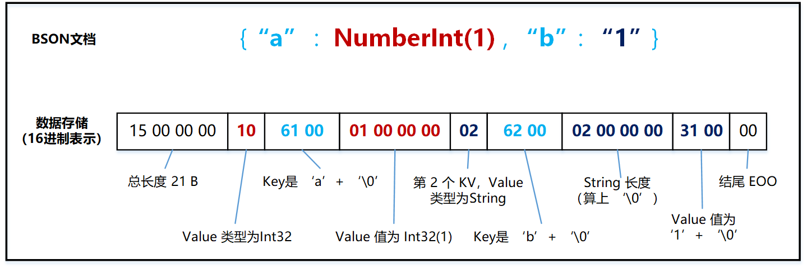

# BSON 是什么

MongoDB 作为一款流行的文档数据库，采用 BSON 格式来支持文档模型。

BSON 全称是 Binary JSON, 和 JSON 很像，但是采用二进制格式进行存储。相比 JSON 有以下优势：

- **访问速度更快。**BSON 会存储 Value 的类型，相比于明文存储，不需要进行字符串类型到其他类型的转换操作。以整型 12345678 为例，JSON 需要将字符串转成整型，而 BSON 中存储了整型类型标志，并用 4 个字节直接存储了整型值；
- **存储空间更低。**还是以整型 12345678 为例，JSON 采用明文存储的方式需要 8 个字节，但是 BSON 对于 Int32 的值统一采用 4 字节存储，Long 和 Double 采用 8 字节存储。 当然这里说存储空间更低也分具体情况，比如对于小整型，BSON 消耗的空间反而更高；
- **数据类型更丰富。**BSON 相比 JSON，增加了 BinData，TimeStamp，ObjectID，Decimal128 等类型。

[MongoDB 官方文档](https://www.mongodb.com/json-and-bson) 对此有比较权威直观的描述，总结如下：

|          | JSON                           | BSON                                                         |
| :------- | :----------------------------- | :----------------------------------------------------------- |
| 编码方式 | UTF-8 String                   | Binary                                                       |
| 数据类型 | String, Boolean, Number, Array | String, Boolean, Number (Integer, Float, Long, Decimal128...), Array, Date, Raw Binary |
| 可读性   | Human and Machine              | Machine Only                                                 |

本文将对 BSON 的存储格式进行深入分析，并从代码级别分析 BSON 的存储和解析过程，使大家对 BSON 有更深入的了解。

# BSON 存储格式

一条最简单的 BSON 文档，从前向后可以拆解成以下几个部分：

1. 文档的总长度， 占 4 个字节；
2. Value 类型，参考[代码定义](https://github.com/mongodb/mongo/blob/r4.2.21/src/mongo/bson/bsontypes.h#L59-L110)，占 1 个字节；
3. Key 的 String 表示形式（Key 只能 String 类型），长度不固定，以 '\0' 结尾，占 len(Key)+1 个字节；
4. Value 的二进制存储，比如 Int32 占 4 字节，Long 和 Double 占 8 个字节等，文章后续会对常用类型逐一举例分析；
5. 文档以 '\0' 结尾，也就是在遍历 BSON 到末尾时，常见的 EOO(End Of Object)，占 1 个字节；

下面列举常用的 Int32, Double, String, 内嵌文档，Array 类型，并分析它们的 16 进制表现形式。

**Int 类型**

 

**Double 类型**

Double 类型占用 8 个字节空间，使用  IEEE 754 标准转换成二进制存储。

 

**String 类型，以及多个 KV 对**

String 类型头部包含额外的 4 字节长度空间，并且以 '\0' 结尾。

 

**嵌套文档**

嵌套文档和普通文档一样，头部也包含了额外的 4 字节长度空间。比如下面的例子 {"b" : NumberInt(1)} 的存储长度为 12 字节。

 

**数组类型**

数组类型头部有 4 个字节存储长度，每个元素都对应有下标，从 '0' 开始递增。

比如下面的例子中，"a.0" 表示第 1 个元素，值为 Double(1)， "a.3" 表示第 4 个元素，值为 "4".

 

# BSON 的解析和封装

## 解析流程

解析 BSON文档 时，先用小端模式读取头部的 4 个字节，转换成 Int32 类型的长度信息，得到 BSON 文档的结束位置。

然后根据上一节介绍的 BSON 格式信息，不断获取 Value 类型， Key，以及 Value。通过迭代器重复上述上述流程得到 BSON 文档中的所有 KV 对。

上述流程可以参考 MongoDB 代码中对 [BSONObj](https://github.com/mongodb/mongo/blob/r4.2.21/src/mongo/bson/bsonobj.h#L57-L593) 和 [BSONObjIterator](https://github.com/mongodb/mongo/blob/r4.2.21/src/mongo/bson/bsonobj.h#L683-L760) 的定义：

部分关键代码摘抄如下：

```js
// 根据传入的二进制 BSON 数据构造迭代器
explicit BSONObjIterator(const BSONObj& jso) {
    int sz = jso.objsize();  // 小端模式读取头 4 个字节，得到 int32 类型的长度
    if (MONGO_unlikely(sz == 0)) {
        _pos = _theend = 0;
        return;
    }
    _pos = jso.objdata() + 4;  // 真正的起始位置
    _theend = jso.objdata() + sz - 1;  // 末尾
}

// 判断迭代器当前是否到了末尾
bool more() {
    return _pos < _theend;
}

// 获取迭代器当前指向的 BSONElement（可以理解为一个 KV 数据），然后迭代器 ++
BSONElement next() {
    verify(_pos <= _theend);
    BSONElement e(_pos);  // 从当前位置，封装 KV 数据
    _pos += e.size();  // 迭代器 ++
    return e;
}
```

*如果初次接触 BSON ，可能会认为访问 BSON 中的某个字段，会有 Hash 或者跳表等数据结构进行加速，达到 O(1) 或者 O(logN) 的查找效率。而从原理上来说，必须通过迭代器从前向后遍历，时间复杂度为 O(N).*

## 封装流程

BSON 文档的封装流程可以看做是解析的逆过程。首先在头部保留 4 个字节，然后不断将 Value 类型，Key， Value 的二进制形式进行追加，然后在文档末尾加上 '\0' EOO 标志，最后将计算的长度（包括存储长度的 4 个字节本身）存储在头部预留的 4 个字节中。

上述流程可以参考 MongoDB 代码中对 [BSONObjBuilder](https://github.com/mongodb/mongo/blob/r4.2.21/src/mongo/bson/bsonobjbuilder.h#L61-L803) 的定义：

部分关键代码摘抄如下：

```js
// 构造一个 BSONObjBuilder
BSONObjBuilder(int initsize = 512)
    : _b(_buf), _buf(initsize), _offset(0), _s(this), _tracker(0), _doneCalled(false) {
    // Skip over space for the object length. The length is filled in by _done.
    _b.skip(sizeof(int));  // 头部预留 4 字节，在调用 _done() 时填充长度

    // Reserve space for the EOO byte. This means _done() can't fail.
    _b.reserveBytes(1);  // 尾部预留 1 个字节的 EOO
}

// 往 BSONObjBuilder 中插入一条 Value 类型为 int32 的 KV 对
BSONObjBuilder& append(StringData fieldName, int n) {
    _b.appendNum((char)NumberInt);  // 先追加 Value 类型， 占 1 个字节
    _b.appendStr(fieldName);  // 追加字符串类型的 Key，以 '\0' 结尾
    _b.appendNum(n);  // 追加 4 字节的二进制整型 Value
    return *this;
}

// KV 数据追加完毕之后，调用 done 方法处理收尾工作
char* _done() {
    if (_doneCalled)
        return _b.buf() + _offset;

    _doneCalled = true;

    // TODO remove this or find some way to prevent it from failing. Since this is intended
    // for use with BSON() literal queries, it is less likely to result in oversized BSON.
    _s.endField();

    _b.claimReservedBytes(1);  // Prevents adding EOO from failing.
    _b.appendNum((char)EOO);

    // 确定最终数据的起始位置和大小
    // 这里的 _offset 用于嵌套 builder 共享一个 buffer 空间的场景，否则 _offset 为 0
    char* data = _b.buf() + _offset;
    int size = _b.len() - _offset;
    DataView(data).write(tagLittleEndian(size));  // 将 size 使用小端模式写入头部 4 个字节中
    if (_tracker)
        _tracker->got(size);
    return data;  // 返回最终的数据
}
```

*如果初次接触 BSON，可能会认为如果只修改 BSON 中的某一个字段，底层只会原地更新这一小块数据，不会有很大开销。但是事实并非如此，从前面的描述可以看到，每个 KV 是顺序紧凑排列的，如果增加、删除或者修改了某个字段，要生成新 BSON 文档。*

*除了通过 BSONObjBuilder 流式生成 BSON 文档外，MongoDB 代码中也提供了* [*DOM 接口*](https://github.com/mongodb/mongo/blob/r4.2.21/src/mongo/bson/mutable/document.h#L42-L519)*用于修改或者增删某个字段，但是修改完成后还是会*[*生成新的 BSON*](https://github.com/mongodb/mongo/blob/r4.2.21/src/mongo/bson/mutable/document.h#L540-L544)，除非是不改变 BSON 二进制结构的更新才支持 UpdateInPlace*.*

# 总结

BSON 作为 JSON 的一种扩展存储格式，在速度，存储空间和数据类型方面都有非常大的提升，并且在 MongoDB 的文档模型中扮演了关键角色。

本文从原理上对比了 BSON 和 JSON 的区别和优缺点，通过一些典型的例子深入分析了 BSON 的数据组织结构，并从代码入手介绍了 BSON 的读写流程和一些注意事项。

BSON 的数据结构非常清晰精简，但是个人认为在有些方面并没有做到足够完美。比如在存储空间方面，没有使用变长整型进行编码，在查找和修改效率方面，仍存在不小的读写放大开销。