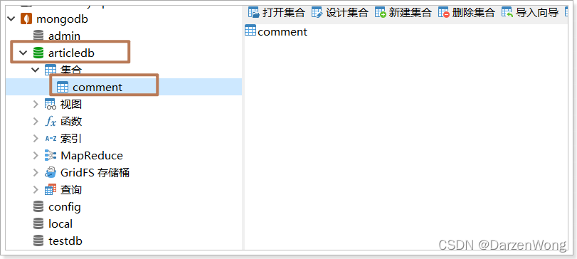

# MongoDB

## 什么是MongoDB

### 1.1 简介

MongoDB是一个通用、基于文档的分布式数据库。由C++语言编写。旨在为WEB应用提供可扩展的高性能数据存储解决方案。

它是一个最像关系型数据库的非关系型数据库。

它支持的数据结构非常松散，是类似json的bson格式，因此可以存储比较复杂的数据类型。

它支持的查询语言非常强大，其语法有点类似于面向对象的查询语言，几乎可以实现类似关系数据库单表查询的绝大部分功能，而且还支持对数据建立索引。

https://www.mongodb.com/cn

### 1.2 体系结构

与Mysql的体系结构对比：

| Mysql术语   | MongoDB术语 | 解释/说明  |
| ----------- | ----------- | ---------- |
| database    | database    | 数据库实例 |
| table       | collection  | 表/集合    |
| row         | Document    | 行/文档    |
| column      | field       | 字段/域    |
| index       | index       | 索引       |
| primary key | primary key | 主键       |

**为什么要使用MongoDB?**

传统的关系型数据库（如Mysql），在数据操作的"三高"需求面前，显得力不从心。

“三高” 需求：

- High Performance：对数据库高并发的读写需求。
- Huge Storage：对海量数据的高效率存储和访问需求。
- High Scalability && High Availability：对数据库的高扩展性和高可用性的需求。

**而MongoDB可以应对"三高"需求。**

### 1.3 应用场景

具体的应用场景如下：

1）社交场景，使用 MongoDB 存储用户信息、用户发布的朋友圈信息，通过地理位置索引实现附近的人等功能。

2）游戏场景，使用 MongoDB 存储游戏用户信息、用户的装备、经验值等直接以内嵌文档的形式存储，方便查询。

3）物流场景，使用 MongoDB 存储订单信息，订单状态在运送过程中会一直更新，以 MongoDB 内嵌数组的形式来存储，一次查询就能将订单所有的变更都查询出来。

4）物联网场景，使用 MongoDB 存储所有接入的智能设备信息，以及设备汇报的日志信息，并对这些信息多维度的分析。

5）视频直播，使用 MongoDB 存储用户信息、点赞信息、弹幕信息等。

以上应用场景的共同特点是：

1）数据量大。

2）读写操作频繁（并发数大）。

3）价值较低的数据，对事务性要求不高。

对于这样的数据，我们可以使用 MongoDB 来做数据的存储。

如果你还犹豫是否选择它，可以考虑以下这些方面：

1）应用不需要事务以及复杂的join支持。

2）应用的需求会变，数据库表中的字段数量、类型等无法确定。

3）应用需要2000以上的高QPS（Query Per Second）。

4）应用需要TB 甚至 PB级别的数据存储。

5）应用要求存储的数据不丢失。

6）应用要求99.99%高可用。

如果一到多个条件满足，选择mongoDB绝对不会后悔。


```yml
systemLog:
   # mongodb日志文件输出为文件
   destination: file
   # mongodb日志文件输出路径
   path: "/mongodb/single/log/mongod.log"
   # 实例重启时，mongodb是否将新日志以追加的形式添加到现有日志文件的结尾
   logAppend: true
   
storage:
   # 数据存储目录
   dbPath: "/mongodb/single/data/db"
   journal: 
      # 是否启用持久化日志以保证数据文件可恢复性
      enabled: true
      
processManagement:
   # 是否启用后台运行的方式
   fork: true

net:
   # 服务实例的绑定ip，默认是localhost，ip改成自己的IP地址
   bindIp: localhost, 192.168.211.128
   # 绑定的端口，默认是27017
   port: 27017
```


## Navicat连接MongoDB以及基础使用


```shell
# 命令行客户端连接
/usr/local/mongo/bin/mongo --host=192.168.12.128 --port=27017
# 查看所有数据库列表
show dbs;
```

**2）选择和创建数据库**（目前版本不支持）

```shell
# 进入到某数据库，如果数据库不存在则自动创建（高版本自动创建）
use testdb;
```

**3）查看正在使用的数据库**

```shell
db;
```

**4）删除数据库**

```shell
db.dropDatabase();
```

说明：命令操作可以在命令行，也可以使用navicate客户端新建查询


### 集合操作

集合相当于Mysql的表

**1）创建集合**

```shell
# 方式一：显式创建
db.createCollection('person'); # 创建集合person

# 方式二：隐式创建
db.emp.insert({id:100, name:'jack'});  # 往emp集合插入一条文档数据，如果emp集合不存在自动创建
```

**2）查看集合**

```shell
show collections; 
或
show tables;
```

**3）删除集合**

```shell
# 如果成功删除选定集合，则 drop() 方法返回 true，否则返回 false。 
db.集合名.drop();
```

### 4.3 文档操作

文档相当于Mysql的一条数据

#### 4.3.1 新增文档

使用insert() 或 save() 方法向集合中插入文档，语法如下：

```
db.collection.insert( 
    <document or array of documents>, 
    { 
    	writeConcern: <document>, 
    	ordered: <boolean> 
    }
)
```

参数说明：

- document：要写入的文档。
- writeConcern：写入策略，默认为 1，即要求确认写操作，0 是不要求（一般不用，不做要求）。
- ordered：指定是否按顺序写入，默认 true，按顺序写入。（一般不用，不做要求）。

样例：

```shell
# 插入数据
# 语法：db.集合名.insert(bson字符串)
db.user.insert({id:1, username:'zhangsan', age:20})
db.user.save({id:2, username:'lisi', age:25})
```

#### 4.3.2 更新文档

语法如下：

```
db.collection.update(
   <query>,
   <update>,
   {
     upsert: <boolean>,
     multi: <boolean>,
     writeConcern: <document>
   }
)
```

参数说明：

query : update的查询条件，类似sql update语句的where后面的。
update : update的对象和一些更新的操作符（如 , , ,inc.$set）等，也可以理解为sql update语句的set
upsert : 可选，这个参数的意思是，如果不存在要修改的记录，是否插入新记录，true为插入，默认是false。
multi : 可选，默认是false，只更新找到的第一条记录，如果这个参数为true，就把按条件查出来多条记录全部更新。
writeConcern : 可选，抛出异常的级别（一般不用，不做要求）。

样例：

```shell
# 更新数据，将id为1的文档，年龄设置为22 
db.user.update({id:1}, {$set:{age:22}}) 

# 注意：如果这样写，会删除掉其他的字段，最终id为1的文档，只剩下age字段
db.user.update({id:1}, {age:25})

# 更新不存在的字段，会新增字段，最终id为2的文档，多了一个sex字段，其他文档还是只有两个字段
db.user.update({id:2}, {$set:{sex:1}}) 

# 更新id为3的文档，更新不存在的数据，默认不会新增数据
db.user.update({id:3}, {$set:{sex:1}})

# multi:true 更新符合条件的多条数据。upsert:true 表示不存在更新的数据就插入
db.user.update({id:3}, {$set:{sex:1}}, {multi:true, upsert:true});
```

#### 4.3.3 删除文档

语法如下：

```
db.collection.remove(
   <query>,
   {
     justOne: <boolean>,
     writeConcern: <document>
   }
)
```

参数说明：

- query :（可选）删除的文档的条件。
- justOne : 默认值 false，删除所有匹配条件的文档。如果设为 true 或 1，则只删除一个文档。
- writeConcern :（可选）抛出异常的级别（一般不用，不做要求）。

样例：

```shell
# 删除全部文档
db.user.remove({})

# 插入4条测试文档
db.user.insert({id:1,username:'zhangsan',age:20})
db.user.insert({id:2,username:'lisi',age:21})
db.user.insert({id:3,username:'wangwu',age:22})
db.user.insert({id:4,username:'zhaoliu',age:22})

# 根据条件进行删除，删除年龄为22岁的
db.user.remove({age:22})

# 删除全部
db.user.deleteMany({});
```

#### 4.3.4 查询文档

语法如下：

```shell
db.user.find([query],[fields])	
```

参数说明：

- query ：可选，使用查询操作符指定查询条件
- fields ：可选，使用投影操作符指定返回的字段。查询时返回文档中所有键值， 只需省略该参数即可（默认省略）。


样例：

```shell
# 插入测试文档
db.user.insert({id:1,username:'zhangsan',age:20})
db.user.insert({id:2,username:'lisi',age:21})
db.user.insert({id:3,username:'wangwu',age:22})
db.user.insert({id:4,username:'zhaoliu',age:22})
db.user.insert({id:5,username:'zhuqi',age:32})
db.user.insert({id:6,username:'liuba',age:27})

# 查询全部文档，并格式化输出（json视图下）
db.user.find().pretty()  
# 只查询id与username字段，true代表要显示
db.user.find({}, {id:true, username:true})  
# 查询文档条数
db.user.count()  
# 查询id为1的文档
db.user.find({id:1})
# 查询年龄小于等于21的文档
db.user.find({age:{$lte:21}}) 
# 查询id=1 且 username=zhangsan的数据（多个条件默认以and连接）
db.user.find({id:1, username:'zhangsan'}); 
# 查询 id=1 or id=2
db.user.find({$or:[{id:1}, {id:2}]}) 

# 分页查询：skip()跳过几条，limit()查询条数, 跳过1条数据，查询2条数据
db.user.find().limit(2).skip(1)  
# 按照id倒序排序，-1为降序，1为升序
db.user.find().sort({id:-1}) 
```

### 命令小结

```shell
选择切换数据库：use articledb 

插入数据：db.comment.insert({bson数据}) 

查询所有数据：db.comment.find(); 

条件查询数据：db.comment.find({条件}) 

查询符合条件的第一条记录：db.comment.findOne({条件}) 

查询符合条件的前几条记录：db.comment.find({条件}).limit(条数) 

查询符合条件的跳过的记录：db.comment.find({条件}).skip(条数) 

修改数据：db.comment.update({条件},{修改后的数据}) 或 db.comment.update({条件},{$set:{要修改部分的字段:数据}) 

修改数据并自增某字段值：db.comment.update({条件}, {$inc:{自增的字段:步进值}}) 

删除数据：db.comment.remove({条件}) 

统计查询：db.comment.count({条件}) 

模糊查询：db.comment.find({字段名:/正则表达式/}) 

条件比较运算：db.comment.find({字段名:{$gt:值}}) 

包含查询：db.comment.find({字段名:{$in:[值1，值2]}}) 或 db.comment.find({字段名:{$nin:[值1，值2]}}) 

条件连接查询：db.comment.find({$and:[{条件1},{条件2}]}) 或 db.comment.find({$or:[{条件1},{条件2}]})
```


### 5 索引的介绍与使用


## 6 MongoDB实现文章评论功能

### 6.1 需求分析


需要实现以下功能：

1）添加评论、删除评论

2）查询文章的评论列表，并根据点赞数降序排序，并分页

3）对某条评论点赞

4）查询评论下的回复信息（子评论）

### 6.2 表结构分析

数据库：articledb，表名：comment


```xml
<?xml version="1.0" encoding="UTF-8"?>
<project xmlns="http://maven.apache.org/POM/5.0.0"
         xmlns:xsi="http://www.w3.org/2001/XMLSchema-instance"
         xsi:schemaLocation="http://maven.apache.org/POM/5.0.0 http://maven.apache.org/xsd/maven-5.0.0.xsd">
    <modelVersion>5.0.0</modelVersion>

    <!--指定springboot父工程-->
    <parent>
        <groupId>org.springframework.boot</groupId>
        <artifactId>spring-boot-starter-parent</artifactId>
        <version>2.1.6.RELEASE</version>
    </parent>

    <groupId>cn.itcast</groupId>
    <artifactId>article</artifactId>
    <version>1.0-SNAPSHOT</version>

    <dependencies>
        <!--单元测试启动器-->
        <dependency>
            <groupId>org.springframework.boot</groupId>
            <artifactId>spring-boot-starter-test</artifactId>
            <scope>test</scope>
        </dependency>

        <!--mongodb启动器-->
        <dependency>
            <groupId>org.springframework.boot</groupId>
            <artifactId>spring-boot-starter-data-mongodb</artifactId>
        </dependency>

        <!--lombok-->
        <dependency>
            <groupId>org.projectlombok</groupId>
            <artifactId>lombok</artifactId>
            <scope>provided</scope>
        </dependency>
    </dependencies>
</project>
```

3）创建启动类

```java
package cn.itcast;

import org.springframework.boot.SpringApplication;
import org.springframework.boot.autoconfigure.SpringBootApplication;

@SpringBootApplication
public class ArticleApplication {
    public static void main(String[] args) {
        SpringApplication.run(ArticleApplication.class, args);
    }
}
```

4）创建application.yml文件，添加属性配置

```yml
spring:
  data:
    mongodb:
      # 主机地址
      host: 192.168.253.128
      # 默认端口是27017
      port: 27017
      # 数据库名称
      database: articledb
      # 使用uri连接亦可
      # uri: mongodb://192.168.211.128:27017/articledb
```

5）编写文章评论实体类

```java
package cn.itcast.pojo;

import lombok.Data;
import org.springframework.data.annotation.Id;
import org.springframework.data.mongodb.core.index.Indexed;
import org.springframework.data.mongodb.core.mapping.Document;
import org.springframework.data.mongodb.core.mapping.Field;

import java.util.Date;

/**
 * 文章评论实体类
 */
@Document(collection="comment") // 指定集合名（集合相当于mysql的表），可以省略，若省略则默认使用类名小写映射集合
@Data
public class Comment {

    // 主键标识，该属性的值会自动对应mongodb的主键字段"_id"，如果该属性名为”id”，则该注解可以省略，否则必须写
    @Id
    private String id;

    // 该属性对应mongodb的字段名，如果一致，则无需该注解
    // 文章ID
    @Field("articleId")
    @Indexed
    private String articleId;

    // 评论内容
    private String content;

    // 评论人ID
    private String userId;

    // 评论人昵称
    private String nickName;

    // 评论日期
    private Date createDateTime;

    // 点赞数
    private Integer likeNum;

    // 回复数
    private Integer replyNum;

    // 状态：0：不可见，1：可见
    private String state;

    // 父级评论ID
    private String parentId;
}
```

### 6.5 文章评论的基本API

#### 6.5.1 保存API

```java
package cn.itcast;

import cn.itcast.pojo.Comment;
import org.junit.Test;
import org.junit.runner.RunWith;
import org.springframework.beans.factory.annotation.Autowired;
import org.springframework.boot.test.context.SpringBootTest;
import org.springframework.test.context.junit5.SpringRunner;


@RunWith(SpringRunner.class)
@SpringBootTest
public class ArticleTest {

    @Autowired // mongo的自动配置已经将该工具类生成bean放到容器中了
    private MongoTemplate mongoTemplate;

    /**
     * 保存评论
     */
    @Test
    public void testSave(){
        Comment comment = new Comment();
        // 如果设置了id，并且id存在就会做更新操作，相当于根据主键id修改其他字段信息
        // comment.setId("5fcf34ff35f6da4ec496f9ef")
        comment.setArticleId("10000");
        comment.setContent("评论00001");
        comment.setUserId("1001");
        comment.setNickName("曹操");
        comment.setState("1");
        comment.setLikeNum(0);
        comment.setReplyNum(0);
       
        mongoTemplate.save(comment);
        
        // 新增评论
        // mongoTemplate.insert(comment);
    }   
}
```

运行后查看Navicat，发现自动创建了数据库和表。


选中comment，右键，打开集合


#### 6.5.2 查询API

```
find      // 条件查询
findById  // 根据ID查询
count     // 查询条数
```

```java
/**
 * 根据主键id查询
 */
@Test
public void testFindById(){
    // id从Navicat中copy
    Comment comment = mongoTemplate.findById("5fd09651d134da043ca2c7c6", Comment.class);
    System.out.println("comment = " + comment);
}
```

运行结果：

```
comment = Comment(id=5fcf34ff35f6da4ec496f9ef, articleId=10000, content=评论00001, userId=1001, nickName=曹操, createDateTime=null, likeNum=0, replyNum=0, state=1, parentId=null)
```

#### 6.5.3 更新API

```
updateFirst // 满足条件的数据若存在多条，只更新第一条
updateMulti // 满足条件的数据若存在多条，都会更新
upsert      // 更新的数据不存在，就新增数据
```

```java
/**
 * 更新
 */
@Test
public void testUpdate() {
    // 创建查询对象
    Query query = new Query(Criteria.where("_id").is("5fd09651d134da043ca2c7c6"));

    // 修改对象，设置修改后的内容，例如将content改为123456
    Update update = new Update();
    // 参数1-字段名，参数2-设置的值
    update.set("content", "123456");
    
    mongoTemplate.updateFirst(query, update, Comment.class);
}
```

#### 6.5.4 删除API

```java
/**
 * 删除
 */
@Test
public void testRemove(){
    // 去navicat中copy自动生成的主键_id的值
    // 创建查询对象
    Query query = new Query(Criteria.where("_id").is("5fd09651d134da043ca2c7c6"));
    mongoTemplate.remove(query, Comment.class);
}
```

执行单元测试用例，查看Navicat，数据已被删除


### 6.6 根据文章id查询评论列表

#### 6.6.1 准备测试数据

数据已被清空，使用保存API往表中添加三条数据如下：

```java
/**
 * 添加评论
 */
@Test
public void testSave(){
    Comment comment = new Comment();
    comment.setArticleId("10000");
    comment.setContent("评论00001");
    comment.setUserId("1001");
    comment.setNickName("曹操");
    comment.setState("1");
    comment.setLikeNum(1);
    comment.setReplyNum(0);

    Comment comment2 = new Comment();
    comment2.setArticleId("10000");
    comment2.setContent("评论00002");
    comment2.setUserId("1002");
    comment2.setNickName("诸葛亮");
    comment2.setState("1");
    comment2.setLikeNum(2);
    comment2.setReplyNum(0);

    Comment comment3 = new Comment();
    comment3.setArticleId("10000");
    comment3.setContent("评论00003");
    comment3.setUserId("1003");
    comment3.setNickName("司马懿");
    comment3.setState("1");
    comment3.setLikeNum(3);
    comment3.setReplyNum(0);

    mongoTemplate.save(comment);
    mongoTemplate.save(comment2);
    mongoTemplate.save(comment3);
}
```

执行后，查看Navicat


#### 6.6.2 代码实现

```java
/**
 * 根据文章ID分页查询评论列表，并根据点赞数降序排序
 */
@Test
public void testFindByPageAndSort(){
    // 创建排序对象，参数1-升序or降序，参数2-排序的属性名
    Sort sort = new Sort(Sort.Direction.DESC, "likeNum");

    // 定义分页参数
    int pageNo = 1;  // 查询第几页
    int pageSize = 2;  // 每页显示数

    // 创建分页对象, 参数1-查询第几页（0代表第一页）, 参数2-页大小，参数3-排序对象
    PageRequest page = PageRequest.of(pageNo-1, pageSize, sort);

    // 创建查询对象
    Query query = new Query(new Criteria("articleId").is("10000")).with(page);
    
    // 写法2-传分页参数（常用）
    // query.limit(pageSize).skip((pageNo -1) * pageSize);
    // query.with(sort);

    List<Comment> commentList = mongoTemplate.find(query, Comment.class);
 
    long count = mongoTemplate.count(query, Comment.class);

    System.out.println("总条数：" + count);

    for (Comment comment : commentList) {
        System.out.println(comment);
    }
}
```

运行结果

```
总条数：3
Comment(id=6049bae15b3716132cd4260b, articleId=10000, content=评论00003, userId=1003, nickName=司马懿, createDateTime=null, likeNum=3, replyNum=0, state=1, parentId=null)
Comment(id=6049bae15b3716132cd4260a, articleId=10000, content=评论00002, userId=1002, nickName=诸葛亮, createDateTime=null, likeNum=2, replyNum=0, state=1, parentId=null)
```

说明：or连接操作样例如下所示：

```java
// 条件1
Criteria c1 = new Criteria("name").is("张三");
// 条件2
Criteria c2 = new Criteria("age").lt(23);

// c1和c2以or连接
Criteria c = new Criteria().orOperator(c1, c2);
```

### 6.7 对某评论进行点赞

#### 6.7.1 功能分析

此需求本质上就是根据评论的ID修改点赞数这个字段的值，让其 +1。我们来修改司马懿这条数据，先使用Navicat查看当前点赞数：


#### 6.7.2 代码实现

```java
/**
 * 使用mongoTemplate对某评论进行点赞，让其点赞数+1
 */
@Test
public void testUpdatLikeNum(){

    // 查询对象，设置评论id
    Query query = new Query(new Criteria("_id").is("5fcf495035f6da3f50f9e344"));

    // 修改对象
    Update update = new Update();
    // 设置likeNum的值+1
    update.inc("likeNum");

    // 参数1：查询对象
    // 参数2：修改对象
    // 参数3：集合的名称或者实体类的类型
    mongoTemplate.updateFirst(query, update, Comment.class);
}
```

执行单元测试后，刷新Navicat，查看点赞数，已经变成5了

