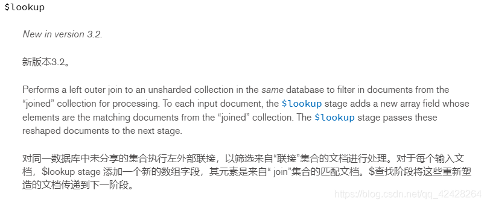
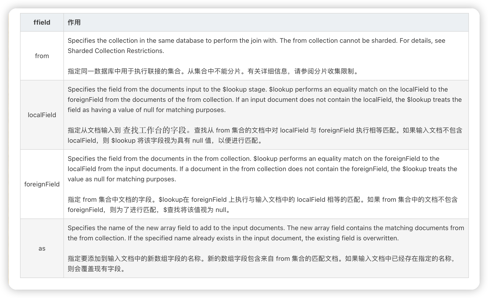

# 关联查询

使用MongoDB关联查询

在工作中，我们有时会使用MongoDB来存储一些复杂数据（有层级关系），一般情况下我们是直接单集和（表）进行CRUD，特殊情况下我们也需要进行关联查询。
下面，我们首先介绍在Mongo Shell 中进行关联查询，然后再使用Java代码利用MongoTemplate 框架进行关联查询：

1. Mongo Shell（Mongo命令行）

2. MongoTemplate（spring-data-mongodb框架）

> 注意：MongoDB虽然支持关联查询，但版本需要至少3.2及以上，且关联查询不如关系型数据库那样多表关联查询简单。

## Mongo shell 关联查询

[官网介绍$lookup](https://docs.mongodb.com/manual/reference/operator/aggregation/lookup/index.html)

### $lookup 简单教程

我们需要先简单了解下 $lookup，下图是官网给的定义：



$lookup 语法：

```mongoDB
{
   $lookup:
     {
       from: <collection to join>,
       localField: <field from the input documents>,
       foreignField: <field from the documents of the "from" collection>,
       as: <output array field>
     }
}
```



该操作将对应于以下伪 sql 语句:

```sql
SELECT *, <output array field>
FROM collection
WHERE <output array field> IN (SELECT *
                               FROM <collection to join>
                               WHERE <foreignField>= <collection.localField>);
```

### $lookup 示例

> 以下内用均出自MongoDB官方文档

#### 使用$lookup执行单个相等连接

**1.使用以下文档创建一个收集订单(orders):**

```
db.orders.insert([
   { "_id" : 1, "item" : "almonds", "price" : 12, "quantity" : 2 },
   { "_id" : 2, "item" : "pecans", "price" : 20, "quantity" : 1 },
   { "_id" : 3  }
])
```

**2.使用以下文档创建另一个库存集合(inventory):**

```
db.inventory.insert([
   { "_id" : 1, "sku" : "almonds", "description": "product 1", "instock" : 120 },
   { "_id" : 2, "sku" : "bread", "description": "product 2", "instock" : 80 },
   { "_id" : 3, "sku" : "cashews", "description": "product 3", "instock" : 60 },
   { "_id" : 4, "sku" : "pecans", "description": "product 4", "instock" : 70 },
   { "_id" : 5, "sku": null, "description": "Incomplete" },
   { "_id" : 6 }
])
```

**3.以下订单集合(orders)上的聚合操作使用来自订单集合(orders)的item字段和来自库存集合(inventory)的sku字段将来自订单集合的文档与来自库存集合的文档连接起来:**

```
db.orders.aggregate([
   {
     $lookup:
       {
         from: "inventory",
         localField: "item",
         foreignField: "sku",
         as: "inventory_docs"
       }
  }
])
```

**4.该操作返回以下文档:**

```
{
   "_id" : 1,
   "item" : "almonds",
   "price" : 12,
   "quantity" : 2,
   "inventory_docs" : [
      { "_id" : 1, "sku" : "almonds", "description" : "product 1", "instock" : 120 }
   ]
}
{
   "_id" : 2,
   "item" : "pecans",
   "price" : 20,
   "quantity" : 1,
   "inventory_docs" : [
      { "_id" : 4, "sku" : "pecans", "description" : "product 4", "instock" : 70 }
   ]
}
{
   "_id" : 3,
   "inventory_docs" : [
      { "_id" : 5, "sku" : null, "description" : "Incomplete" },
      { "_id" : 6 }
   ]
}
```

**5.该操作将对应于下面的伪sql语句**

#### 使用$lookup与一个数组

> 启动MongoDB 3.4，如果localField是一个数组，你可以匹配一个标量foreignField的数组元素，而不需要`$unwind`阶段。

1.例如，使用以下文档创建一个示例集合（classes）:

```
db.classes.insert( [
   { _id: 1, title: "Reading is ...", enrollmentlist: [ "giraffe2", "pandabear", "artie" ], days: ["M", "W", "F"] },
   { _id: 2, title: "But Writing ...", enrollmentlist: [ "giraffe1", "artie" ], days: ["T", "F"] }
])
```

2.使用以下文档创建另一个集合（members）:

```
db.members.insert( [
   { _id: 1, name: "artie", joined: new Date("2016-05-01"), status: "A" },
   { _id: 2, name: "giraffe", joined: new Date("2017-05-01"), status: "D" },
   { _id: 3, name: "giraffe1", joined: new Date("2017-10-01"), status: "A" },
   { _id: 4, name: "panda", joined: new Date("2018-10-11"), status: "A" },
   { _id: 5, name: "pandabear", joined: new Date("2018-12-01"), status: "A" },
   { _id: 6, name: "giraffe2", joined: new Date("2018-12-01"), status: "D" }
])
```

3.下面的聚合操作将classes集合中的文档与members集合连接起来，classes集和的enrollee_info字段与members的字段name之间进行匹配:

```
db.classes.aggregate([
   {
      $lookup:
         {
            from: "members",
            localField: "enrollmentlist",
            foreignField: "name",
            as: "enrollee_info"
        }
   }
])
```

4.该操作返回以下结果:

```
{
   "_id" : 1,
   "title" : "Reading is ...",
   "enrollmentlist" : [ "giraffe2", "pandabear", "artie" ],
   "days" : [ "M", "W", "F" ],
   "enrollee_info" : [
      { "_id" : 1, "name" : "artie", "joined" : ISODate("2016-05-01T00:00:00Z"), "status" : "A" },
      { "_id" : 5, "name" : "pandabear", "joined" : ISODate("2018-12-01T00:00:00Z"), "status" : "A" },
      { "_id" : 6, "name" : "giraffe2", "joined" : ISODate("2018-12-01T00:00:00Z"), "status" : "D" }
   ]
}
{
   "_id" : 2,
   "title" : "But Writing ...",
   "enrollmentlist" : [ "giraffe1", "artie" ],
   "days" : [ "T", "F" ],
   "enrollee_info" : [
      { "_id" : 1, "name" : "artie", "joined" : ISODate("2016-05-01T00:00:00Z"), "status" : "A" },
      { "_id" : 3, "name" : "giraffe1", "joined" : ISODate("2017-10-01T00:00:00Z"), "status" : "A" }
   ]
}
```

#### 使用$lookup与$mergeObjects

> 在3.6版更改:MongoDB 3.6添加了$mergeObjects操作符来将多个文档合并为一个文档

1.使用以下文档重新创建订单集和（orders）:

```
db.orders.insert([
   { "_id" : 1, "item" : "almonds", "price" : 12, "quantity" : 2 },
   { "_id" : 2, "item" : "pecans", "price" : 20, "quantity" : 1 }
])

```

2.使用以下文档创建另一个集合（items）:

```
db.items.insert([
  { "_id" : 1, "item" : "almonds", description: "almond clusters", "instock" : 120 },
  { "_id" : 2, "item" : "bread", description: "raisin and nut bread", "instock" : 80 },
  { "_id" : 3, "item" : "pecans", description: "candied pecans", "instock" : 60 }
])
```

3.下面的操作首先使用$lookup阶段通过item字段来连接两个集合，然后使用$replaceRoot中的$mergeObjects来合并item和orders中的已连接文档:

```
db.orders.aggregate([
   {
      $lookup: {
         from: "items",
         localField: "item",    // field in the orders collection
         foreignField: "item",  // field in the items collection
         as: "fromItems"
      }
   },
   {
      $replaceRoot: { newRoot: { $mergeObjects: [ { $arrayElemAt: [ "$fromItems", 0 ] }, "$$ROOT" ] } }
   },
   { $project: { fromItems: 0 } }
])
```

该操作返回以下文档:

```
{ "_id" : 1, "item" : "almonds", "description" : "almond clusters", "instock" : 120, "price" : 12, "quantity" : 2 }
{ "_id" : 2, "item" : "pecans", "description" : "candied pecans", "instock" : 60, "price" : 20, "quantity" : 1 }
```

#### 使用$lookup指定多个连接条件

> 在3.6版更改:MongoDB 3.6增加了对已连接[集合](https://so.csdn.net/so/search?q=集合&spm=1001.2101.3001.7020)执行管道的支持，这允许指定多个连接条件以及不相关的子查询。

1.使用以下文档创建一个订单集和（orders）:

```
db.orders.insert([
  { "_id" : 1, "item" : "almonds", "price" : 12, "ordered" : 2 },
  { "_id" : 2, "item" : "pecans", "price" : 20, "ordered" : 1 },
  { "_id" : 3, "item" : "cookies", "price" : 10, "ordered" : 60 }
])
```

2.使用以下文档创建另一个仓库集合（warehouses）:

```
db.warehouses.insert([
  { "_id" : 1, "stock_item" : "almonds", warehouse: "A", "instock" : 120 },
  { "_id" : 2, "stock_item" : "pecans", warehouse: "A", "instock" : 80 },
  { "_id" : 3, "stock_item" : "almonds", warehouse: "B", "instock" : 60 },
  { "_id" : 4, "stock_item" : "cookies", warehouse: "B", "instock" : 40 },
  { "_id" : 5, "stock_item" : "cookies", warehouse: "A", "instock" : 80 }
])
```

3.以下操作将订单集合与仓库集合结合起来，根据项目以及库存数量是否足以涵盖订购数量:

```
db.orders.aggregate([
   {
      $lookup:
         {
           from: "warehouses",
           let: { order_item: "$item", order_qty: "$ordered" },
           pipeline: [
              { $match:
                 { $expr:
                    { $and:
                       [
                         { $eq: [ "$stock_item",  "$$order_item" ] },
                         { $gte: [ "$instock", "$$order_qty" ] }
                       ]
                    }
                 }
              },
              { $project: { stock_item: 0, _id: 0 } }
           ],
           as: "stockdata"
         }
    }
])
```

4.该操作返回以下文档:

```
{ "_id" : 1, "item" : "almonds", "price" : 12, "ordered" : 2,
   "stockdata" : [ { "warehouse" : "A", "instock" : 120 },
   { "warehouse" : "B", "instock" : 60 } ] }
{ "_id" : 2, "item" : "pecans", "price" : 20, "ordered" : 1,
   "stockdata" : [ { "warehouse" : "A", "instock" : 80 } ] }
{ "_id" : 3, "item" : "cookies", "price" : 10, "ordered" : 60,
   "stockdata" : [ { "warehouse" : "A", "instock" : 80 } ] }
```

5.该操作对应于以下伪sql语句:

```sql
SELECT *, stockdata
FROM orders
WHERE stockdata IN ( SELECT warehouse, instock
                     FROM warehouses
                     WHERE stock_item = orders.item
                     AND instock >= orders.ordered );
```

> The $expr operator only uses indexes on the from collection for equality matches. For example, if the index { stock_item: 1, instock: 1 } exists on the warehouses collection:
> The equality match on the warehouses.stock_item field uses the index.
> The range part of the query on the warehouses.instock field does not use the indexed field in the compound index.

#### 不相关子查询

> 在3.6版更改:MongoDB 3.6增加了对已连接集合执行管道的支持，这允许指定多个连接条件以及不相关的子查询。

1.根据以下文档创建一个集合（absences）：

```
db.absences.insert([
   { "_id" : 1, "student" : "Ann Aardvark", sickdays: [ new Date ("2018-05-01"),new Date ("2018-08-23") ] },
   { "_id" : 2, "student" : "Zoe Zebra", sickdays: [ new Date ("2018-02-01"),new Date ("2018-05-23") ] },
])
```

2.使用以下文档创建另一个集合(holidays):

```
db.holidays.insert([
   { "_id" : 1, year: 2018, name: "New Years", date: new Date("2018-01-01") },
   { "_id" : 2, year: 2018, name: "Pi Day", date: new Date("2018-03-14") },
   { "_id" : 3, year: 2018, name: "Ice Cream Day", date: new Date("2018-07-15") },
   { "_id" : 4, year: 2017, name: "New Years", date: new Date("2017-01-01") },
   { "_id" : 5, year: 2017, name: "Ice Cream Day", date: new Date("2017-07-16") }
])
```

3.以下操作将 absences集和与holidays集和中的2018年假期信息加入到absences集和中:

```
db.absences.aggregate([
   {
      $lookup:
         {
           from: "holidays",
           pipeline: [
              { $match: { year: 2018 } },
              { $project: { _id: 0, date: { name: "$name", date: "$date" } } },
              { $replaceRoot: { newRoot: "$date" } }
           ],
           as: "holidays"
         }
    }
])
```

该操作返回以下结果:

```
{ "_id" : 1, "student" : "Ann Aardvark", "sickdays" : [ ISODate("2018-05-01T00:00:00Z"), ISODate("2018-08-23T00:00:00Z") ],
    "holidays" : [ { "name" : "New Years", "date" : ISODate("2018-01-01T00:00:00Z") }, { "name" : "Pi Day", "date" : ISODate("2018-03-14T00:00:00Z") }, { "name" : "Ice Cream Day", "date" : ISODate("2018-07-15T00:00:00Z") } ] }
{ "_id" : 2, "student" : "Zoe Zebra", "sickdays" : [ ISODate("2018-02-01T00:00:00Z"), ISODate("2018-05-23T00:00:00Z") ],
    "holidays" : [ { "name" : "New Years", "date" : ISODate("2018-01-01T00:00:00Z") }, { "name" : "Pi Day", "date" : ISODate("2018-03-14T00:00:00Z") }, { "name" : "Ice Cream Day", "date" : ISODate("2018-07-15T00:00:00Z") } ] }
```

## MongoTemplate 关联查询

> 需要引入 spring-boot-starter-data-mongodb

下面是Java代码

```java
LookupOperation lookupOperation = LookupOperation.newLookup()
  .from(ExamMongoCollectionConstant.TOPIC)    // 被关联的表 topic
  .localField(ExamMongoColumnConstant.ID) // 自己的字段
  .foreignField(ExamMongoColumnConstant.TOPIC_FATHER_ID)  // 被关联的表 topic 中的字段
  .as("result"); // 关联查询后的结果
Criteria criteria = Criteria.where(ExamMongoColumnConstant.RELATION_ID).is(relationId); // 条件查询

Aggregation aggregation = Aggregation.newAggregation(
  // 条件查询过滤
  Aggregation.match(criteria),
  // 关联查询
  lookupOperation
);
/*
		其中 TopicJoinTopicFather2DoTopicDTO 是定义的一个结果返回类，需要跟上面result返回的格式一样
		ExamMongoCollectionConstant.TOPIC_FATHER 表示关联查询的表，
		TopicJoinTopicFather2DoTopicDTO.class:返回的数据使用该类接收
		*/
// 执行上面的关联查询，并将结果返回成 List<TopicJoinTopicFather2DoTopicDTO> 格式
List<TopicJoinTopicFather2DoTopicDTO> list =
  this.mongoTemplate.aggregate(aggregation, ExamMongoCollectionConstant.TOPIC_FATHER, TopicJoinTopicFather2DoTopicDTO.class).getMappedResults();
```

上面代码中的 TopicJoinTopicFather2DoTopicDTO 类其样子如下：

> 注意的是字段上面要加上MongoDB的注解，标明要与哪个字段进行一一对应即可

```java
@Data
public class TopicJoinTopicFather2DoTopicDTO extends Topic {
    /**
     * 主键标识，该属性的值会自动对应mongodb的主键字段"_id"，如果该属性名就叫“id”,则该注解可以省略，否则必须写
     */
    @Id
    private String id;

    /**
     * 题干对象
     */
    @Field("question_detail")
    private TopicDetailDO questionDetail;

    /**
     * 题型样式
     */
    @Field("question_type")
    private String questionType;

    /**
     * 大题的题型名称
     */
    @Field("question_type_name")
    private String questionTypeName;

    /**
     * 课节或试卷uuid
     */
    @Field("relation_id")
    private String relationId;

    @Field("result")
    private List<DoTopicDTO> doTopicDTOS;
}
```

