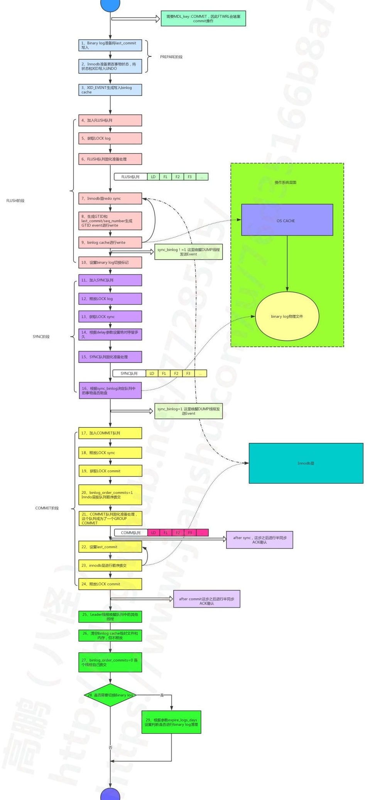

# MySQL层事务提交流程简析

本文节选自八怪专栏《深入理解MySQL主从原理32讲》第15节

---

本节将来解释一下MySQL层详细的提交流程，但是由于能力有限，这里不可能包含全部的步骤，只是包含了一些重要的并且我学习过的步骤。我们首先需要来假设参数设置，因为某些参数的设置会直接影响到提交流程，我们也会逐一解释这些参数的含义。本节介绍的大部分内容都集中在函数MYSQL\_BIN\_LOG::prepare和MYSQL\_BIN\_LOG::ordered\_commit之中。

## 一、参数设置

本部分假定参数设置为：

- binlog\_group\_commit\_sync\_delay：0

- binlog\_group\_commit\_sync\_no\_delay\_count：0

- binlog\_order\_commits：ON

- sync\_binlog：1

- binlog\_transaction\_dependency\_tracking：COMMIT\_ORDER


关于参数binlog\_transaction\_dependency\_tracking需要重点说明一下。我们知道Innodb的行锁是在语句运行期间就已经获取，因此如果多个事务同时进入了提交流程（prepare阶段），在Innodb层提交释放Innodb行锁资源之前各个事务之间肯定是没有行冲突的，因此可以在从库端并行执行。在基于COMMIT\_ORDER 的并行复制中，last commit和seq number正是基于这种思想生成的，如果last commit相同则视为可以在从库并行回放，在19节我们将解释从库判定并行回放的规则。而在基于WRITESET的并行复制中，last commit将会在WRITESET的影响下继续降低，来使从库获得更好的并行回放效果，但是它也是COMMIT\_ORDER为基础的，这个下一节将讨论。我们这节只讨论基于COMMIT\_ORDER 的并行复制中last commit和seq number的生成方式。

而sync\_binlog参数则有两个功能：

- sync\_binlog=0：binary log不sync刷盘，依赖于OS刷盘机制。同时会在flush阶段后通知DUMP线程发送Event。

- sync\_binlog=1：binary log每次sync队列形成后都进行sync刷盘，约等于每次group commit进行刷盘。同时会在sync阶段后通知DUMP线程发送Event。注意sync\_binlog非1的设置可能导致从库比主库多事务。

- sync\_binlog>1：binary log将在指定次sync队列形成后进行sync刷盘，约等于指定次group commit后刷盘。同时会在flush阶段后通知DUMP线程发送Event。


第二功能将在第17节还会进行介绍。

## 二、总体流程图

这里我们先展示整个流程，如下：



## 三、步骤解析第一阶段（图中蓝色部分）

注意：在第1步之前会有一个获取MDL\_key::COMMIT锁的操作，因此FTWRL将会堵塞‘commit’操作，堵塞状态为‘Waiting for commit lock’，这个可以参考FTWRL调用的函数make\_global\_read\_lock\_block\_commit。

（1.） binlog准备。将上一次COMMIT队列中最大的seq number写入到本次事务的last\_commit中。可参考binlog\_prepare函数。

（2.） Innodb准备。更改事务的状态为准备并且将事务的状态和XID写入到Undo中。可参考trx\_prepare函数。

（3.） XID\_EVENT生成并且写到binlog cache中。在第10节中我们说过实际上XID来自于query\_id，早就生成了，这里只是生成Event而已。可参考MYSQL\_BIN\_LOG::commit函数。


## 四、步骤解析第二阶段（图中粉色部分）

（4.） 形成FLUSH队列。这一步正在不断的有事务加入到这个FLUSH队列。第一个进入FLUSH队列的为本阶段的leader，非leader线程将会堵塞，直到COMMIT阶段后由leader线程的唤醒。

（5.） 获取LOCK log 锁。

（6.） 这一步就是将FLUSH阶段的队列取出来准备进行处理。也就是这个时候本FLUSH队列就不能再更改了。可参考stage\_manager.fetch\_queue\_for函数。

（7.） 这里事务会进行Innodb层的redo持久化，并且会帮助其他事务进行redo的持久化。可以参考MYSQL\_BIN\_LOG::process\_flush\_stage\_queue函数。下面是注释和一小段代码：

1. /\*

2. We flush prepared records of transactions to the log of storage

3. engine (for example, InnoDB redo log) in a group right before

4. flushing them to binary log.

5. \*/

6. ha\_flush\_logs(NULL, true);//做innodb redo持久化


（8.） 生成GTID和seq number，并且连同前面的last commit生成GTID\_EVENT，然后直接写入到binary log中。我们注意到这里直接写入到了binary log而没有写入到binlog cache，因此GTID\_EVENT是事务的第一个Event。参考函数binlog\_cache\_data::flush中下面一段：

1. trn\_ctx->sequence\_number= mysql\_bin\_log.m\_dependency\_tracker.step();

2. //int64 state +1

3. ...

4. if (!error)

5. if ((error= mysql\_bin\_log.write\_gtid(thd, this, &writer)))

6. //生成GTID 写入binary log文件

7. thd->commit\_error= THD::CE\_FLUSH\_ERROR;

8. if (!error)

9. error= mysql\_bin\_log.write\_cache(thd, this, &writer);

10. //将其他Event写入到binary log文件


而对于seq number和last commit的取值来讲，实际上在MySQL内部维护着一个全局的结构Transaction\_dependency\_tracker。其中包含三种可能取值方式，如下

- Commit\_order\_trx\_dependency\_tracker

- Writeset\_trx\_dependency\_tracker

- Writeset\_session\_trx\_dependency\_tracker


到底使用哪一种取值方式，由参数binlog\_transaction\_dependency\_tracking来决定的。这里我们先研究参数设置为COMMIT\_ORDER的取值方式，对于WRITESET取值的方式下一节专门讨论。

对于设置为COMMIT\_ORDER会使用Commit\_order\_trx\_dependency\_tracker的取值方式，有如下特点：

<div style="width:100%;overflow-y:auto"><table width="609"><thead><tr><th>特点</th></tr></thead><tbody><tr><td>每次事务提交seq number将会加1。</td></tr><tr><td>last commit在前面的binlog准备阶段就赋值给了每个事务。这个前面已经描述了。</td></tr><tr><td>last commit是前一个COMMIT队列的最大seq number。这个我们后面能看到。</td></tr></tbody></table></div>

其次seq number和last commit这两个值类型都为Logical\_clock，其中维护了一个叫做offsets偏移量的值，用来记录每次binary log切换时sequence\_number的相对偏移量。因此seq number和last commit在每个binary log总是重新计数，下面是offset的源码注释：

```
  /*
    Offset is subtracted from the actual "absolute time" value at
    logging a replication event. That is the event holds logical
    timestamps in the "relative" format. They are meaningful only in
    the context of the current binlog.
    The member is updated (incremented) per binary log rotation.
  */
  int64 offset;
```

下面是我们计算seq number的方式，可以参考Commit\_order\_trx\_dependency\_tracker::get\_dependency函数。

```
sequence_number = trn_ctx->sequence_number - m_max_committed_transaction.get_offset();
//这里获取seq number
```

我们清楚的看到这里有一个减去offset的操作，这也是为什么我们的seq number和last commit在每个binary log总是重新计数的原因。

（9.） 这一步就会将我们的binlog cache里面的所有Event写入到我们的binary log中了。对于一个事务来讲，我们这里应该很清楚这里包含的Event有：

- QUERY\_EVENT

- MAP\_EVENT

- DML EVENT

- XID\_EVENT


<!-- -->

注意GTID\_EVENT前面已经写入到的binary logfile。这里我说的写入是调用的Linux的write函数，正常情况下它会进入图中的OS CACHE中。实际上这个时候可能还没有真正写入到磁盘介质中。

重复 7 \~ 9步 把FLUSH队列中所有的事务做同样的处理。

注意：如果sync\_binlog != 1 这里将会唤醒DUMP线程进行Event的发送。

（10.） 这一步还会判断binary log是否需要切换，并且设置一个切换标记。依据就是整个队列每个事务写入的Event总量加上现有的binary log大小是否超过了max\_binlog\_size。可参考MYSQL\_BIN\_LOG::process\_flush\_stage\_queue函数，如下部分：

```
 if total_bytes > 0 && my_b_tell(&log_file) >= (my_off_t) max_size)
    *rotate_var= true; //标记需要切换
```

但是注意这里是先将所有的Event写入binary log，然后才进行的判断。因此对于大事务来讲其Event肯定都包含在同一个binary log中。

到这里FLUSH阶段就结束了。

---

## 五、步骤解析第三阶段（图中紫色部分）

（11.） FLUSH队列加入到SYNC队列。第一个进入的FLUSH队列的leader为本阶段的leader。其他FLUSH队列加入SYNC队列，且其他FLUSH队列的leader会被LOCK sync堵塞，直到COMMIT阶段后由leader线程的唤醒。

（12.） 释放LOCK log。

（13.） 获取LOCK sync。

（14.） 这里根据参数delay的设置来决定是否等待一段时间。我们从图中我们可以看出如果delay的时间越久那么加入SYNC队列的时间就会越长，也就可能有更多的FLUSH队列加入进来，那么这个SYNC队列的事务就越多。这不仅会提高sync效率，并且增大了GROUP COMMIT组成员的数量（因为last commit还没有更改，时间拖得越长那么一组事务中事务数量就越多），从而提高了从库MTS的并行效率。但是缺点也很明显可能导致简单的DML语句时间拖长，因此不能设置过大，下面是我简书中的一个案列就是因为delay参数设置不当引起的，如下：

https://www.jianshu.com/p/bfd4a88307f2

参数delay一共包含两个参数如下：

- binlog\_group\_commit\_sync\_delay：通过人为的设置delay时长来加大整个GROUP COMMIT组中事务数量，并且减少进行磁盘刷盘sync的次数，但是受到binlog\_group\_commit\_sync\_no\_delay\_count的限制。单位为1/1000000秒，最大值1000000也就是1秒。

- binlog\_group\_commit\_sync\_no\_delay\_count：在delay的时间内如果GROUP COMMIT中的事务数量达到了这个设置就直接跳出等待，而不需要等待binlog\_group\_commit\_sync\_delay的时长。单位是事务的数量。


（15.） 这一步就是将SYNC阶段的队列取出来准备进行处理。也就是这个时候SYNC队列就不能再更改了。这个队列和FLUSH队列并不一样，事务的顺序一样但是数量可能不一样。

（16.） 根据sync\_binlog的设置决定是否刷盘。可以参考函数MYSQL\_BIN\_LOG::sync\_binlog\_file，逻辑也很简单。

到这里SYNC阶段就结束了。

注意：如果sync\_binlog = 1 这里将会唤醒DUMP线程进行Event的发送。

---

## 六、步骤解析第四阶段（图中黄色部分）

（17.） SYNC队列加入到COMMIT队列。第一个进入的SYNC队列的leader为本阶段的leader。其他SYNC队列加入COMMIT队列，且其他SYNC队列的leader会被LOCK commit堵塞，直到COMMIT阶段后由leader线程的唤醒。

（18.） 释放LOCK sync。

（19.） 获取LOCK commit。

（20.） 根据参数binlog\_order\_commits的设置来决定是否按照队列的顺序进行Innodb层的提交，如果binlog\_order\_commits=1 则按照队列顺序提交则事务的可见顺序和提交顺序一致。如果binlog\_order\_commits=0 则下面21步到23步将不会进行，也就是这里不会进行Innodb层的提交。

（21.） 这一步就是将COMMIT阶段的队列取出来准备进行处理。也就是这个时候COMMIT队列就不能在更改了。这个队列和FLUSH队列和SYNC队列并不一样，事务的顺序一样，数量可能不一样。

注意：如果rpl\_semi\_sync\_master\_wait\_point参数设置为‘AFTER\_SYNC’，这里将会进行ACK确认，可以看到实际的Innodb层提交操作还没有进行，等待期间状态为‘Waiting for semi-sync ACK from slave’。

（22.） 在Innodb层提交之前必须要更改last\_commit了。COMMIT队列中每个事务都会去更新它，如果大于则更改，小于则不变。可参考Commit\_order\_trx\_dependency\_tracker::update\_max\_committed函数，下面是这一小段代码：

```
{
  m_max_committed_transaction.set_if_greater(sequence_number);
	//如果更大则更改
}
```

（23.） COMMIT队列中每个事务按照顺序进行Innodb层的提交。可参考innobase\_commit函数。

这一步Innodb层会做很多动作，比如：

- Readview的更新

- Undo的状态的更新

- Innodb 锁资源的释放


完成这一步，实际上在Innodb层事务就可以见了。我曾经遇到过一个由于leader线程唤醒本组其他线程出现问题而导致整个commit操作hang住，但是在数据库中这些事务的修改已经可见的案例。

循环22\~23直到COMMIT队列处理完。

（24.） 释放LOCK commit。

注意：如果rpl\_semi\_sync\_master\_wait\_point参数设置为‘AFTER\_COMMIT’，这里将会进行ACK确认，可以看到实际的Innodb层提交操作已经完成了，等待期间状态为‘Waiting for semi-sync ACK from slave’。

到这里COMMIT阶段就结束了。

---

## 七、步骤解析第五阶段（图中绿色部分）

（25.） 这里leader线程会唤醒所有的组内成员，各自进行各自的操作了。

（26.） 每个事务成员进行binlog cache的重置，清空cache释放临时文件。

（27.） 如果binlog\_order\_commits设置为0，COMMIT队列中的每个事务就各自进行Innodb层提交（不按照binary log中事务的的顺序）。

（28.） 根据前面第10步设置的切换标记，决定是否进行binary log切换。

（29.） 如果切换了binary log，则还需要根据expire\_logs\_days的设置判断是否进行binlog log的清理。

---

## 八、总结

- 整个过程我们看到生成last commit和seq number的过程并没有其它的开销，但是下一节介绍的基于WRITESET的并行复制就有一定的开销了。

- 我们需要明白的是FLUSH/SYNC/COMMIT每一个阶段都有一个相应的队列，每个队列并不一样。但是其中的事务顺序却是一样的，是否能够在从库进行并行回放完全取决于准备阶段获取的last\_commit，这个我们将在第19节详细描述。

- 对于FLUSH/SYNC/COMMIT三个队列事务的数量实际有这样关系，即COMMIT队列>=SYNC队列>=FLUSH队列。如果压力不大它们三者可能相同且都只包含一个事务。

- 从流程中可以看出基于COMMIT\_ORDER 的并行复制如果数据库压力不大的情况下可能出现每个队列都只有一个事务的情况。这种情况就不能在从库并行回放了，但是下一节我们讲的基于WRITESET的并行复制却可以改变这种情况。

- 这里我们也更加明显的看到大事务的Event会在提交时刻一次性的写入到binary log。如果COMMIT队列中包含了大事务，那么必然堵塞本队列中的其它事务提交，后续的提交操作也不能完成。我认为这也是MySQL不适合大事务的一个重要原因。
