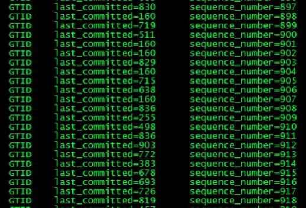
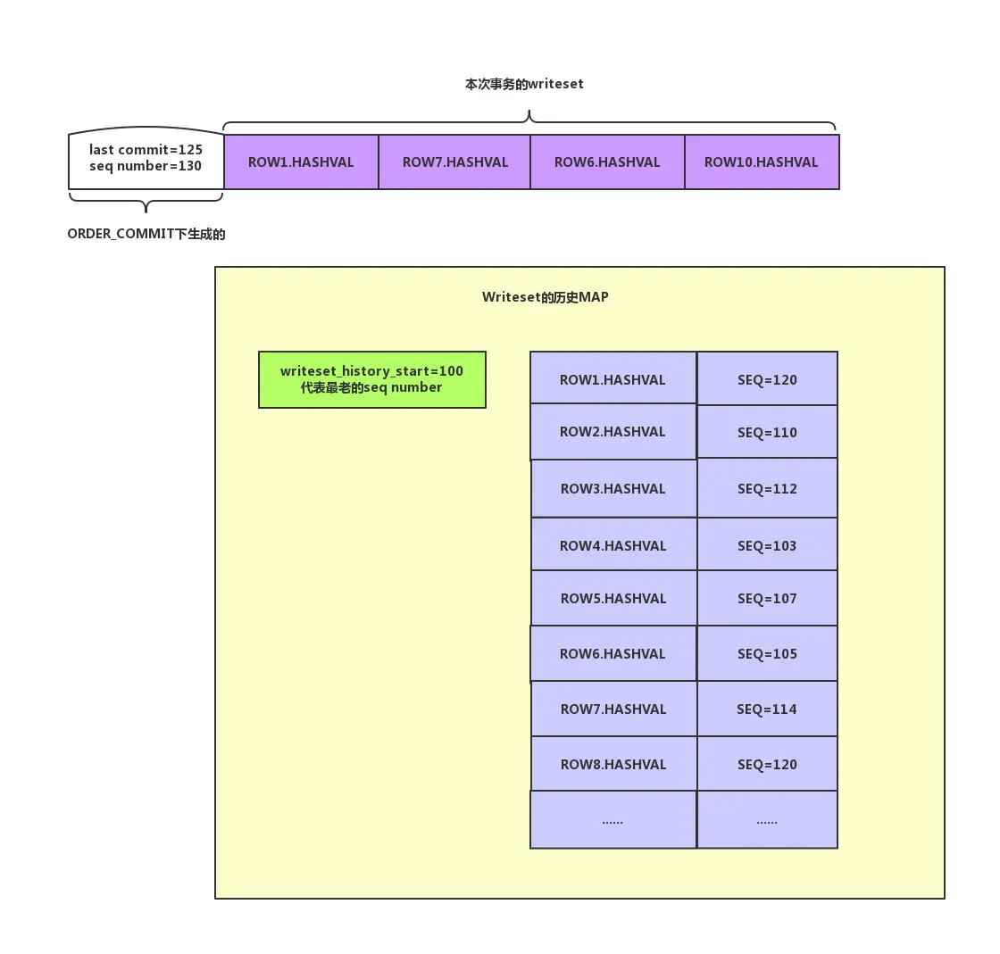
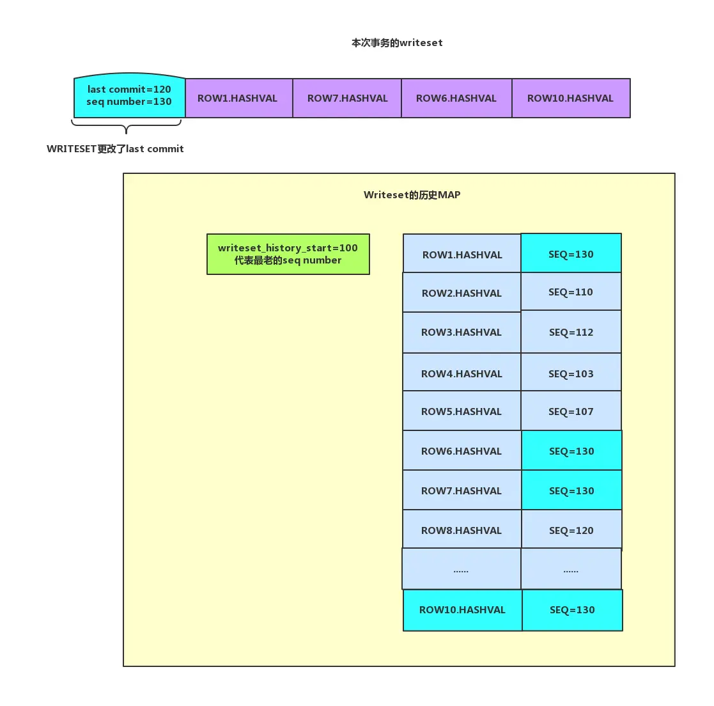

# 基于WRITESET的并行复制方式

基于COMMIT_ORDER的并行复制只有在有压力的情况下才可能会形成一组，压力不大的情况下在从库的并行度并不会高。但是基于WRITESET的并行复制目标就是在ORDER_COMMIT的基础上再尽可能的降低last commit，这样在从库获得更好的并行度（即便在主库串行执行的事务在从库也能并行应用）。它使用的方式就是通过扫描Writeset中的每一个元素（行数据的hash值）在一个叫做Writeset的历史MAP（行数据的hash值和seq number的一个MAP）中进行比对，寻找是否有冲突的行，然后做相应的处理，后面我们会详细描述这种行为。如果要使用这种方式我们需要在主库设置如下两个参数：

- transaction_write_set_extraction=XXHASH64
- binlog_transaction_dependency_tracking=WRITESET

它们是在5.7.22才引入的。

## 一、奇怪的last commit

我们先来看一个截图，仔细观察其中的last commit：



image.png

我们可以看到其中的last commit看起来是乱序的，这种情况在基于COMMIT_ORDER 的并行复制方式下是不可能出现的。实际上它就是我们前面说的基于WRITESET的并行复制再尽可能降低的last commit的结果。这种情况会在MTS从库获得更好的并行回放效果，第19节将会详细解释并行判定的标准。

## 二、Writeset是什么

实际上Writeset是一个集合，使用的是C++ STL中的set容器，在类Rpl_transaction_write_set_ctx中包含了如下定义：


```cpp
std::set<uint64> write_set_unique;
```

集合中的每一个元素都是hash值，这个hash值和我们的transaction_write_set_extraction参数指定的算法有关，其来源就是行数据的主键和唯一键。每行数据包含了两种格式：

- 字段值为二进制格式
- 字段值为字符串格式

每行数据的具体格式为：

| 主键/唯一键名称 | 分隔符 | 库名 | 分隔符 | 库名长度 | 表名 | 分隔符 | 表名长度 | 键字段1 | 分隔符 | 长度 | 键字段2 | 分隔符 | 长度 | 其他字段... |
| --------------- | ------ | ---- | ------ | -------- | ---- | ------ | -------- | ------- | ------ | ---- | ------- | ------ | ---- | ----------- |
|                 |        |      |        |          |      |        |          |         |        |      |         |        |      |             |

在Innodb层修改一行数据之后会将这上面的格式的数据进行hash后写入到Writeset中。可以参考函数add_pke，后面我也会以伪代码的方式给出部分流程。

但是需要注意一个事务的所有的行数据的hash值都要写入到一个Writeset。如果修改的行比较多那么可能需要更多内存来存储这些hash值。虽然8字节比较小，但是如果一个事务修改的行很多，那么还是需要消耗较多的内存资源的。

为了更直观的观察到这种数据格式，可以使用debug的方式获取。下面我们来看一下。

## 三、Writeset的生成

我们使用如下表：


```go
mysql> use test
Database changed
mysql> show create table jj10 \G
*************************** 1. row ***************************
       Table: jj10
Create Table: CREATE TABLE `jj10` (
  `id1` int(11) DEFAULT NULL,
  `id2` int(11) DEFAULT NULL,
  `id3` int(11) NOT NULL,
  PRIMARY KEY (`id3`),
  UNIQUE KEY `id1` (`id1`),
  KEY `id2` (`id2`)
) ENGINE=InnoDB DEFAULT CHARSET=latin1
1 row in set (0.00 sec)
```

我们写入一行数据：


```csharp
insert into jj10 values(36,36,36);
```

这一行数据一共会生成4个元素分别为：

**注意：这里显示的?是分隔符**

##### 1. 主键二进制格式


```ruby
(gdb) p pke
$1 = "PRIMARY?test?4jj10?4\200\000\000$?4"

**注意：\200\000\000$ ：为3个八进制字节和ASCII字符 $，
其转换为16进制就是“0X80 00 00 24 ”**
```

分解为：

| 主键名称 | 分隔符 | 库名 | 分隔符 | 库名长度 | 表名 | 分隔符 | 表名长度 | 主键字段1     | 分隔符 | 长度 |
| -------- | ------ | ---- | ------ | -------- | ---- | ------ | -------- | ------------- | ------ | ---- |
| PRIMARY  | ?      | test | ?      | 4        | jj10 | ?      | 4        | 0x80 00 00 24 | ?      | 4    |

##### 2. 主键字符串格式：


```bash
(gdb) p pke
$2 = "PRIMARY?test?4jj10?436?2"
```

分解为：

| 主键名称 | 分隔符 | 库名 | 分隔符 | 库名长度 | 表名 | 分隔符 | 表名长度 | 主键字段1 | 分隔符 | 长度 |
| -------- | ------ | ---- | ------ | -------- | ---- | ------ | -------- | --------- | ------ | ---- |
| PRIMARY  | ?      | test | ?      | 4        | jj10 | ?      | 4        | 36        | ?      | 2    |

##### 3. 唯一键二进制格式


```bash
(gdb) p pke
$3 = "id1?test?4jj10?4\200\000\000$?4"
```

解析同上

##### 4. 唯一键字符串格式：


```bash
(gdb) p pke
$4 = "id1?test?4jj10?436?2"
```

解析同上

最终这些数据会通过hash算法后写入到Writeset中。

## 四、函数add_pke的大概流程

下面是一段伪代码，用来描述这种生成过程：


```bash
如果表中存在索引：
   将数据库名，表名信息写入临时变量   
   循环扫描表中每个索引：
        如果不是唯一索引：
             退出本次循环继续循环。
        循环两种生成数据的方式(二进制格式和字符串格式)：
             将索引名字写入到pke中。
             将临时变量信息写入到pke中。
             循环扫描索引中的每一个字段：
                将每一个字段的信息写入到pke中。
                如果字段扫描完成：
                   将pke生成hash值并且写入到写集合中。
    如果没有找到主键或者唯一键记录一个标记，后面通过这个标记来
    判定是否使用Writeset的并行复制方式
```

## 五、Writeset设置对last commit的处理方式

前一节我们讨论了基于ORDER_COMMIT的并行复制是如何生成last_commit和seq number的。实际上基于WRITESET的并行复制方式只是在ORDER_COMMIT的基础上对last_commit做更进一步处理，并不影响原有的ORDER_COMMIT逻辑，因此如果要回退到ORDER_COMMIT逻辑非常方便。可以参考MYSQL_BIN_LOG::write_gtid函数。

根据binlog_transaction_dependency_tracking取值的不同会做进一步的处理，如下：

- ORDER_COMMIT：调用m_commit_order.get_dependency函数。这是前面我们讨论的方式。
- WRITESET：调用m_commit_order.get_dependency函数，然后调用m_writeset.get_dependency。可以看到m_writeset.get_dependency函数会对原有的last commit做处理。
- WRITESET_SESSION：调用m_commit_order.get_dependency函数，然后调用m_writeset.get_dependency再调用m_writeset_session.get_dependency。m_writeset_session.get_dependency会对last commit再次做处理。

这段描述的代码对应：


```bash
    case DEPENDENCY_TRACKING_COMMIT_ORDER:
      m_commit_order.get_dependency(thd, sequence_number, commit_parent);
      break;
    case DEPENDENCY_TRACKING_WRITESET:
      m_commit_order.get_dependency(thd, sequence_number, commit_parent);
      m_writeset.get_dependency(thd, sequence_number, commit_parent);
      break;
    case DEPENDENCY_TRACKING_WRITESET_SESSION:
      m_commit_order.get_dependency(thd, sequence_number, commit_parent);
      m_writeset.get_dependency(thd, sequence_number, commit_parent);
      m_writeset_session.get_dependency(thd, sequence_number, commit_parent);
      break;
```

## 六、Writeset的历史MAP

我们到这里已经讨论了Writeset是什么，也已经说过如果要降低last commit的值我们需要通过对事务的Writeset和Writeset的历史MAP进行比对，看是否冲突才能决定降低为什么值。那么必须在内存中保存一份这样的一个历史MAP才行。在源码中使用如下方式定义：


```cpp
  /*
    Track the last transaction sequence number that changed each row
    in the database, using row hashes from the writeset as the index.
  */
  typedef std::map<uint64,int64> Writeset_history; //map实现
  Writeset_history m_writeset_history;
```

我们可以看到这是C++ STL中的map容器，它包含两个元素：

- Writeset的hash值
- 最新一次本行数据修改事务的seq number

它是按照Writeset的hash值进行排序的。

其次内存中还维护一个叫做m_writeset_history_start的值，用于记录Writeset的历史MAP中最早事务的seq number。如果Writeset的历史MAP满了就会清理这个历史MAP然后将本事务的seq number写入m_writeset_history_start，作为最早的seq number。后面会看到对于事务last commit的值的修改总是从这个值开始然后进行比较判断修改的，如果在Writeset的历史MAP中没有找到冲突那么直接设置last commit为这个m_writeset_history_start值即可。下面是清理Writeset历史MAP的代码：


```cpp
  if (exceeds_capacity || !can_use_writesets)
//Writeset的历史MAP已满
  {
    m_writeset_history_start= sequence_number; 
//如果超过最大设置，清空writeset history。从当前seq number 重新记录， 也就是最小的那个事务seq number
    m_writeset_history.clear();
//清空历史MAP
  }
```

## 七、Writeset的并行复制对last commit的处理流程

这里介绍一下整个处理的过程，假设如下：

- 当前通过基于ORDER_COMMIT的并行复制方式后，构造出来的是（last commit=125，seq number=130）。
- 本事务修改了4条数据，我分别使用ROW1/ROW7/ROW6/ROW10代表。
- 表只包含主键没有唯一键，并且我的图中只保留行数据的二进制格式的hash值，而没有包含数据的字符串格式的hash值。

初始化情况如下图（图16-1）：



1.jpg

1. 第一步 设置last commit为writeset_history_start的值也就是100。
2. 第二步 ROW1.HASHVAL在Writeset历史MAP中查找，找到冲突的行ROW1.HASHVAL将历史MAP中这行数据的seq number更改为130。同时设置last commit为120。
3. 第三步 ROW7.HASHVAL在Writeset历史MAP中查找，找到冲突的行ROW7.HASHVAL将Writeset历史MAP中这行数据的seq number更改为130。由于历史MAP中对应的seq number为114，小于120不做更改。last commit依旧为120。
4. 第四步 ROW6.HASHVAL在Writeset历史MAP中查找，找到冲突的行ROW6.HASHVAL将Writeset历史MAP中这行数据的seq number更改为130。由于历史MAP中对应的seq number为105，小于120不做更改。last commit依旧为120。
5. 第五步 ROW10.HASHVAL在Writeset历史MAP中查找，没有找到冲突的行，因此需要将这一行插入到Writeset历史MAP中查找（需要判断是否导致历史MAP占满，如果占满则不需要插入，后面随即要清理掉）。即要将ROW10.HASHVAL和seq number=130插入到Writeset历史MAP中。

整个过程结束。last commit由以前的125降低为120，目的达到了。实际上我们可以看出Writeset历史MAP就相当于保存了一段时间以来修改行的快照，如果保证本次事务修改的数据在这段时间内没有冲突，那么显然是可以在从库并行执行的。last commit降低后如下图（图16-2）：



整个逻辑就在函数Writeset_trx_dependency_tracker::get_dependency中，下面是一些关键代码，代码稍多：


```php
if (can_use_writesets) //如果能够使用writeset 方式
  {
    /*
     Check if adding this transaction exceeds the capacity of the writeset
     history. If that happens, m_writeset_history will be cleared only after  而 add_pke
     using its information for current transaction.
    */
    exceeds_capacity=
      m_writeset_history.size() + writeset->size() > m_opt_max_history_size; 
//如果大于参数binlog_transaction_dependency_history_size设置清理标记
    /*
     Compute the greatest sequence_number among all conflicts and add the
     transaction's row hashes to the history.
    */
    int64 last_parent= m_writeset_history_start;
//临时变量，首先设置为最小的一个seq number
    for (std::set<uint64>::iterator it= writeset->begin(); it != writeset->end(); ++it)
//循环每一个Writeset中的每一个元素 
    {
      Writeset_history::iterator hst= m_writeset_history.find(*it);
//是否在writeset history中 已经存在了。 map中的元素是 key是writeset 值是sequence number
      if (hst != m_writeset_history.end()) //如果存在
      {    
        if (hst->second > last_parent && hst->second < sequence_number) 
          last_parent= hst->second;
//如果已经大于了不需要设置
        hst->second= sequence_number; 
//更改这行记录的sequence_number
      }
      else
      {
        if (!exceeds_capacity)
          m_writeset_history.insert(std::pair<uint64, int64>(*it, sequence_number));
//没有冲突则插入。
      }
    }

......
    if (!write_set_ctx->get_has_missing_keys())
//如果没有主键和唯一键那么不更改last commit
    {
      /*
       The WRITESET commit_parent then becomes the minimum of largest parent
       found using the hashes of the row touched by the transaction and the
       commit parent calculated with COMMIT_ORDER.
      */；
      commit_parent= std::min(last_parent, commit_parent);
//这里对last commit做更改了。降低他的last commit
    }
  }
    }
  }

  if (exceeds_capacity || !can_use_writesets)
  {
    m_writeset_history_start= sequence_number; 
//如果超过最大设置 清空writeset history。从当前sequence 重新记录 也就是最小的那个事务seqnuce number
    m_writeset_history.clear();//清空真个MAP
  }
```

## 八、WRITESET_SESSION的方式

前面说过这种方式就是在WRITESET的基础上继续处理，实际上它的含义就是同一个session的事务不允许在从库并行回放。代码很简单，如下：


```php
  int64 session_parent= thd->rpl_thd_ctx.dependency_tracker_ctx().
                        get_last_session_sequence_number();
//取本session的上一次事务的seq number
  if (session_parent != 0 && session_parent < sequence_number) 
//如果本session已经做过事务并且本次当前的seq number大于上一次的seq number
    commit_parent= std::max(commit_parent, session_parent);
//说明这个session做过多次事务不允许并发，修改为order_commit生成的last commit
  thd->rpl_thd_ctx.dependency_tracker_ctx().
    set_last_session_sequence_number(sequence_number);
//设置session_parent的值为本次seq number的值
```

经过这个操作后，我们发现这种情况最后last commit恢复成了ORDER_COMMIT的方式。

## 九、关于binlog_transaction_dependency_history_size参数说明

本参数默认值为25000。代表的是我们说的Writeset历史MAP中元素的个数。如前面分析的Writeset生成过程中修改一行数据可能会生成多个HASH值，因此这个值还不能完全等待于修改的行数，可以理解为如下：

- binlog_transaction_dependency_history_size/2=修改的行数 * （1+唯一键个数）

我们通过前面的分析可以发现如果这个值越大那么在Writeset历史MAP中能容下的元素也就越多，生成的last commit就可能更加精确（更加小），从库并发的效率也就可能越高。但是我们需要注意设置越大相应的内存需求也就越高了。

## 十、没有主键的情况

实际上在函数add_pke中就会判断是否有主键或者唯一键，如果存在唯一键也是可以。Writeset中存储了唯一键的行数据hash值。参考函数add_pke，下面是判断：


```kotlin
      if (!((table->key_info[key_number].flags & (HA_NOSAME )) == HA_NOSAME)) 
//跳过非唯一的KEY
        continue;
```

如果没有主键或者唯一键那么下面语句将被触发：


```php
  if (writeset_hashes_added == 0)
    ws_ctx->set_has_missing_keys();
```

然后我们在生成last commit会判断这个设置如下：


```php
    if (!write_set_ctx->get_has_missing_keys())
//如果没有主键和唯一键那么不更改last commit
    {
      /*
       The WRITESET commit_parent then becomes the minimum of largest parent
       found using the hashes of the row touched by the transaction and the
       commit parent calculated with COMMIT_ORDER.
      */；
      commit_parent= std::min(last_parent, commit_parent);//这里对last commit做更改了。降低他的last commit
    }
  }
```

因此没有主键可以使用唯一键，如果都没有的话WRITESET设置就不会生效回退到老的ORDER_COMMIT方式。

## 十一、为什么同一个session执行的事务也能生成同样的last commit

有了前面的基础，我们就很容易解释这种现象了。其主要原因就是Writeset的历史MAP的存在，只要这些事务修改的行没有冲突，也就是主键/唯一键不相同，那么在基于WRITESET的并行复制方式中就可以存在这种现象，但是如果binlog_transaction_dependency_tracking设置为WRITESET_SESSION则不会出现这种现象。

### 写在最后

好了到这里我们明白了基于WRITESET的并行复制方式的优点，但是它也有明显的缺点如下：

- Writeset中每个hash值都需要和Writeset的历史MAP进行比较。
- Writeset需要额外的内存空间。
- Writeset的历史MAP需要额外的内存空间。

如果从库没有延迟，则不需要考虑这种方式，即便有延迟我们也应该先考虑其他方案。第28节我们将会描述有哪些导致延迟的可能。