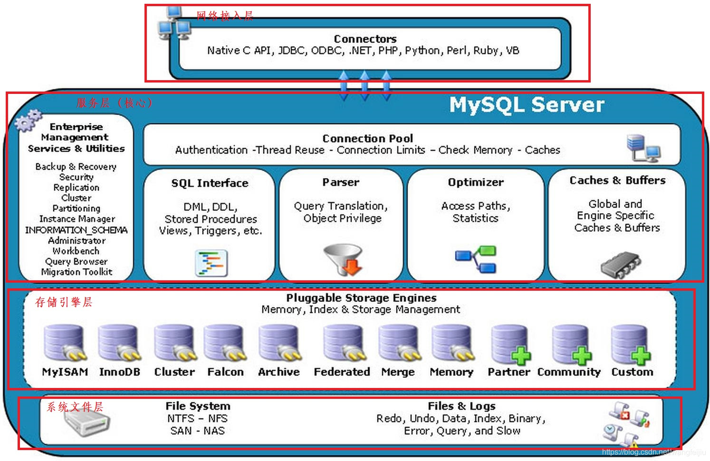
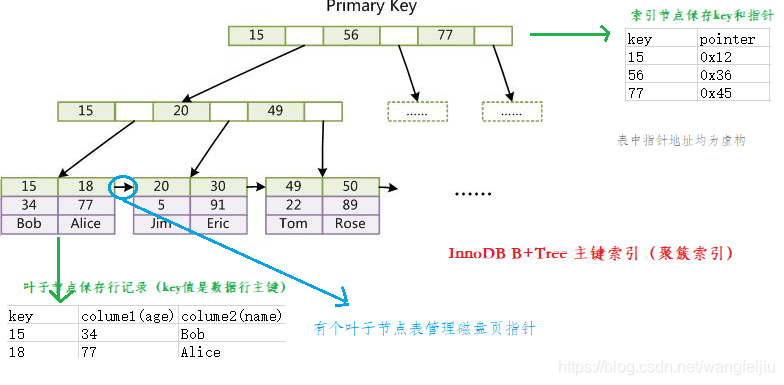
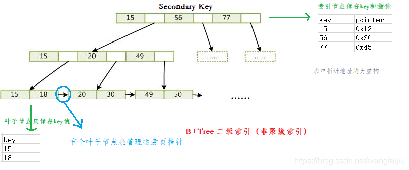
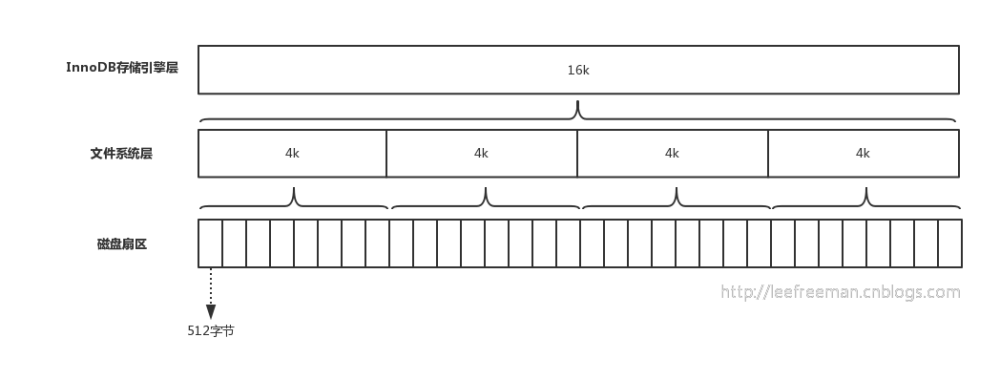
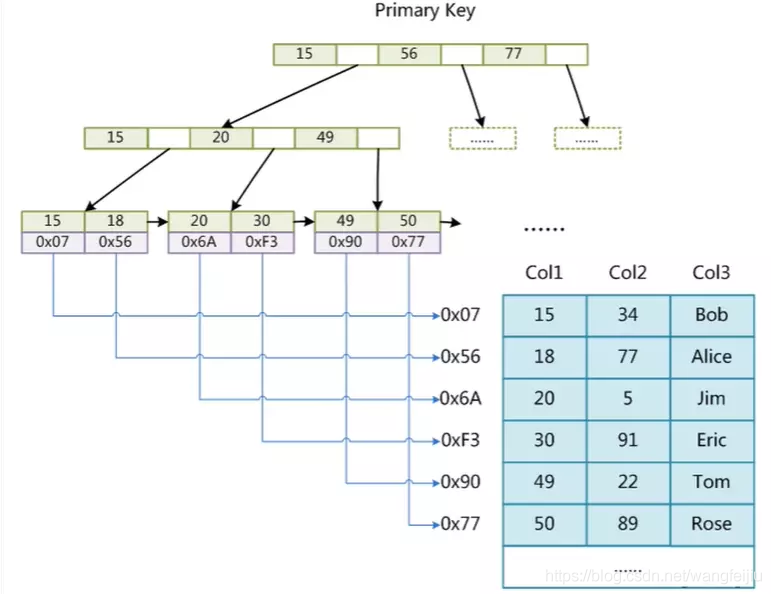
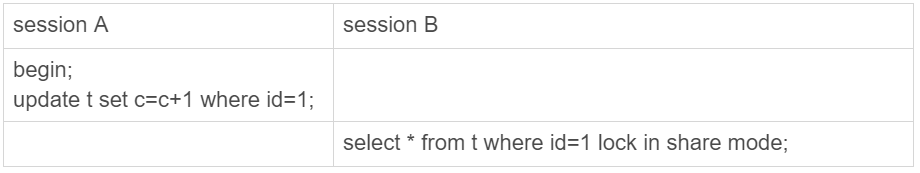

# MySQL

## 体系架构

以下是官网MySQL体系构架图，我们稍微对其进行了层级划分。



英文不好的同学可以看下中文版的：


由上至下，我们可以MySQL的体系构架划分为：1.网络接入层 2.服务层 3.存储引擎层 4.文件系统层

### 网络接入层

提供了应用程序接入MySQL服务的接口。客户端与服务端建立连接，客户端发送SQL到服务端。

### 服务层

**管理工具和服务**

> 系统管理和控制工具，例如备份恢复、Mysql复制、集群等

**连接池**

> 主要负责连接管理、授权认证、安全等等。每个客户端连接都对应着服务器上的一个线程。服务器上维护了一个线程池，避免为每个连接都创建销毁一个线程。当客户端连接到MySQL服务器时，服务器对其进行认证。可以通过用户名与密码认证，也可以通过SSL证书进行认证。登录认证后，服务器还会验证客户端是否有执行某个查询的操作权限。
>
> 由于每次建立连接需要消耗很多时间，连接池的作用就是将这些连接缓存下来，下次可以直接用已经建立好的连接，提升服务器性能。

**SQL接口**

> 接受用户的SQL命令，并且返回用户操作的结果。

**查询解析器**

> SQL命令传递到解析器的时候会被解析器验证和解析。
>
> MySQL是一个DBMS（数据库管理系统），没法直接理解SQL语句。Parser负责对SQL语句进行解析好让DBMS知道该怎么做。

**查询优化器**

> SQL语句在查询之前会使用查询优化器对查询进行优化。它使用的是“选取-投影-联接”策略进行查询以此选择一个最优的查询路径。
>
> ```sql
>  select uid,name from user where gender = 1;
> ```
>
> select 查询先根据 where 语句进行选取，而不是先将表全部查询出来以后再进行条件过滤
> select查询先根据 uid 和 name 进行属性投影，而不是将属性全部取出以后再进行过滤
> 将这两个查询条件联接起来生成最终查询结果

**缓存（8.0版本之前支持查询缓存，8.0之后不支持了）**

> 查询缓存，如果查询缓存有命中的查询结果，查询语句就可以直接去查询缓存中取数据。
> 通过LRU算法将数据的冷端溢出，未来得及时刷新到磁盘的数据页，叫脏页。
> 这个缓存机制是由一系列小缓存组成的。比如表缓存，记录缓存，key缓存，权限缓存等

### 存储引擎层

> 负责数据的存储和读取，与数据库文件打交道。 服务器中的查询执行引擎通过API与存储引擎进行通信，通过接口屏蔽了不同存储引擎之间的差异。
>
>
> MySQL采用插件式的存储引擎。MySQL为我们提供了许多存储引擎，每种存储引擎有不同的特点。我们可以根据不同的业务特点，选择最适合的存储引擎。
>
> MySQL区别于其他数据库的最重要的一个特点就是插件式的表存储引擎，注意：存储引擎是基于表的。

### 系统文件层

该层主要是将数据库的数据存储在文件系统之上，并完成与存储引擎的交互。

存储引擎是基于表的，以下分别使用MyISAM和InnoDB存储引擎建立两张表，看看其在文件系统中对应的文件存储格式。


存储引擎为MyISAM：

- *.frm：与表相关的元数据信息都存放在frm文件，包括表结构的定义信息等
- *.MYD：MyISAM DATA，用于存储MyISAM表的数据
- *.MYI：MyISAM INDEX，用于存储MyISAM表的索引相关信息

存储引擎为InnoDB：

- *.frm：与表相关的元数据信息都存放在frm文件，包括表结构的定义信息等
- *.ibd：InnoDB DATA，表数据和索引的文件。该表的索引(B+树)的每个非叶子节点存储索引，叶子节点存储索引和索引对应的数据

**除了.ibd文件InnoDB还有一种文件的存储格式为.ibdata文件，那么他们之间有什么区别呢？**

> InnoDB的数据存储方式能够通过配置来决定是使用共享表空间存放存储数据，还是用独享表空间存放存储数据。独享表空间存储方式使用.ibd文件，并且每个表为一个ibd文件。共享表空间存储方式采用.ibdata文件，所有的表共同使用一个ibdata文件，即所有的数据文件都存在一个文件中。决定使用哪种表的存储方式可以通过mysql的配置文件中innodb_file_per_table选项来指定。
> InnoDB默认使用的是独享表的存储方式，这种方式的好处是当数据库产生大量文件碎片的时，整理磁盘碎片对线上运行环境的影响较小。

**【拓展】一个SQL语句在MySQL中的整体流程**

用户使用mysql查询的一个整体流程如下（[原图链接](https://www.cnblogs.com/klvchen/articles/12809342.html)）：


简化版：


## 存储引擎

### 了解存储引擎

MySQL中的数据用各种不同的技术存储在文件（或者内存）中。每一种技术都使用不同的存储机制、索引技巧、锁定水平并且最终提供广泛的不同的功能和能力。通过选择不同的技术，能够获得额外的速度或者功能，从而改善应用的整体功能。 这些不同的技术以及配套的相关功能在MySQL中被称作存储引擎(也称作表类型)。

MySQL区别于其他数据库的最重要的一个特点就是插件式的表存储引擎，也就是说存储引擎是基于表的。

存储引擎的概念是MySQL里面才有的，不是所有的关系型数据库都有存储引擎这个概念 。其它数据库系统 (包括大多数商业选择)仅支持一种类型的数据存储， 也就是说采用“ 一个尺码满足一切需求 ”的存储方式，也意味着“功能强大，性能平庸”。而MySQL默认配置了许多不同的存储引擎，你可以根据业务需求选取一种最适配最高效的存储引擎。这也是为什么MySQL为何如此受欢迎的主要原因之一。

### 存储引擎分类

查看当前安装的MySQL版本支持的存储引擎

```sql
-- 查看MySQL版本
select version();

-- 查看版本支持的存储引擎
show engines;
```


我本地安装的社区版MySQL，版本号为5.7.23，支持9种存储引擎或者说是8种（FEDERATED NO SUPPORT 不支持FEDERATED），而官网提供了10种存储引擎，大家有兴趣点此👉MySQL 5.7 Supported Storage Engines进行了解。本地与官网支持的存储引擎略微不同，个人估计是社区版和商用版的差别的缘故，或者是安装时候配置项设置导致的差异，有清楚的小伙伴还望告知一下。
官网5.7版本支持的10种存储引擎：

- MyISAM： 拥有较高的插入，查询速度，但不支持事务
- InnoDB ：5.5.8版本后Mysql的默认数据库引擎，支持ACID事务，支持行级锁定
- BDB： 源自Berkeley DB，事务型数据库的另一种选择，支持COMMIT和ROLLBACK等其他事务特性
- Memory ：所有数据置于内存的存储引擎，拥有极高的插入，更新和查询效率。但是会占用和数据量成正比的内存空间。并且其内容会在Mysql重新启动时丢失
- Merge ：将一定数量的MyISAM表联合而成一个整体，在超大规模数据存储时很有用
- Archive ：非常适合存储大量的独立的，作为历史记录的数据。因为它们不经常被读取。Archive拥有高效的插入速度，但其对查询的支持相对较差
- Federated： 将不同的Mysql服务器联合起来，逻辑上组成一个完整的数据库。非常适合分布式应用
- Cluster/NDB ：高冗余的存储引擎，用多台数据机器联合提供服务以提高整体性能和安全性。适合数据量大，安全和性能要求高的应用
- CSV： 逻辑上由逗号分割数据的存储引擎。它会在数据库子目录里为每个数据表创建一个.CSV文件。这是一种普通文本文件，每个数据行占用一个文本行。CSV存储引擎不支持索引。
- BlackHole ：黑洞引擎，写入的任何数据都会消失，一般用于记录binlog做复制的中继

### 常用存储引擎特性

**存储特性要求**

存储引擎常见的目标特性要求

1. 并发性：某些应用程序比其他应用程序具有更高的颗粒级锁定要求（如行级锁定）。

2. 事务支持：并非所有的应用程序都需要事务，但对的确需要事务的应用程序来说，有着定义良好的需求，如ACID兼容等。

3. 引用完整性：通过DDL定义的外键，服务器需要强制保持关联数据库的引用完整性。

4. 物理存储：它包括各种各样的事项，从表和索引的总的页大小，到存储数据所需的格式，到物理磁盘。

5. 索引支持：不同的应用程序倾向于采用不同的索引策略，每种存储引擎通常有自己的编制索引方法，但某些索引方法（如B-tree索引）对几乎所有的存储引擎来说是共同的。

6. 内存高速缓冲：与其他应用程序相比，不同的应用程序对某些内存高速缓冲策略的响应更好，因此，尽管某些内存高速缓冲对所有存储引擎来说是共同的（如用于用户连接的高速缓冲，MySQL的高速查询高速缓冲等），其他高速缓冲策略仅当使用特殊的存储引擎时才唯一定义。

7. 性能帮助：包括针对并行操作的多I/O线程，线程并发性，数据库检查点，成批插入处理等。

8. 其他目标特性：可能包括对地理空间操作的支持，对特定数据处理操作的安全限制等。

以上特性很多是互斥的，一个存储引擎只能具备其中某些要求。

具体查考官网[Storage Engines Feature Summary](https://dev.mysql.com/doc/refman/5.7/en/storage-engines.html)


Notes:

1. 在服务器中实现，而不是在存储引擎中。

2. 只有使用压缩行格式时，才支持压缩的MyISAM表。使用MyISAM压缩行格式的表是只读的。

3. 在服务器端通过加密功能实现。

4. 在服务器端通过加密功能实现;在MySQL 5.7和更高版本中，支持数据静止表空间加密。

5. 在MySQL Cluster NDB 7.3和更高版本中支持外键。

6. InnoDB在MySQL 5.6和更高版本中提供对 全文索引（FULLTEXT ） 的支持。

7. InnoDB在MySQL 5.7和更高版本中提供对地理空间索引的支持。

8. InnoDB内部利用哈希索引来实现自适应哈希索引特性。

下文主要介绍InnoDB MyISAM Memory三种存储引擎，以下是三者简要特性对比


### InnoDB引擎

InnoDB 是一个事务安全的存储引擎，它具备提交、回滚以及崩溃恢复的功能以保护用户数据。InnoDB 的行级别锁定保证数据一致性提升了它的多用户并发数以及性能。InnoDB 将用户数据存储在聚集索引中以减少基于主键的普通查询所带来的 I/O 开销。为了保证数据的完整性，InnoDB 还支持外键约束。默认使用B+TREE数据结构存储索引。
**特点**

- 支持事务，支持4个事务隔离（ACID）级别
- 行级锁定（更新时锁定当前行）
- 读写阻塞与事务隔离级别相关
- 既能缓存索引又能缓存数据
- 支持外键
- InnoDB更消耗资源，读取速度没有MyISAM快
- 在InnoDB中存在着缓冲管理，通过缓冲池，将索引和数据全部缓存起来，加快查询的速度；
- 对于InnoDB类型的表，其数据的物理组织形式是聚簇表。所有的数据按照主键来组织。数据和索引放在一块，都位于B+数的叶子节点上；

**业务场景**

- 需要支持事务的场景（银行转账之类）
- 适合高并发，行级锁定对高并发有很好的适应能力，但需要确保查询是通过索引完成的
- 数据修改较频繁的业务

**InnoDB引擎调优**

- 主键尽可能小，否则会给Secondary index带来负担
- 避免全表扫描，这会造成锁表
- 尽可能缓存所有的索引和数据，减少IO操作
- 避免主键更新，这会造成大量的数据移动

### MyISAM引擎

MyISAM既不支持事务、也不支持外键、其优势是访问速度快，但是表级别的锁定限制了它在读写负载方面的性能，因此它经常应用于只读或者以读为主的数据场景。默认使用B+TREE数据结构存储索引。

**特点**

- 不支持事务
- 表级锁定（更新时锁定整个表）
- 读写互相阻塞（写入时阻塞读入、读时阻塞写入；但是读不会互相阻塞）
- 只会缓存索引（通过key_buffer_size缓存索引，但是不会缓存数据）
- 不支持外键
- 读取速度快

 **业务场景**

- 不需要支持事务的场景（像银行转账之类的不可行）
- 一般读数据的较多的业务
- 数据修改相对较少的业务
- 数据一致性要求不是很高的业务

**MyISAM引擎调优**

- 设置合适索引
- 启用延迟写入，尽量一次大批量写入，而非频繁写入
- 尽量顺序insert数据，让数据写入到尾部，减少阻塞
- 降低并发数，高并发使用排队机制
- MyISAM的count只有全表扫描比较高效，带有其它条件都需要进行实际数据访问

### Memory引擎

在内存中创建表。每个MEMORY表只实际对应一个磁盘文件(frm 表结构文件)。MEMORY类型的表访问非常得快，因为它的数据是放在内存中的，并且默认使用HASH索引。要记住，在用完表格之后就删除表格，不然一直占据内存空间。

**特点**

支持的数据类型有限制，比如：不支持TEXT和BLOB类型（长度不固定），对于字符串类型的数据，只支持固定长度的行，VARCHAR会被自动存储为CHAR类型；
支持的锁粒度为表级锁。所以，在访问量比较大时，表级锁会成为MEMORY存储引擎的瓶颈；
由于数据是存放在内存中，一旦服务器出现故障，数据都会丢失；
查询的时候，如果有用到临时表，而且临时表中有BLOB，TEXT类型的字段，那么这个临时表就会转化为MyISAM类型的表，性能会急剧降低；
默认使用hash索引。
如果一个内部表很大，会转化为磁盘表。

**业务场景**

那些内容变化不频繁的代码表，或者作为统计操作的中间结果表，便于高效地堆中间结果进行分析并得到最终的统计结果。
目标数据比较小，而且非常频繁的进行访问，在内存中存放数据，如果太大的数据会造成内存溢出。可以通过参数max_heap_table_size控制Memory表的大小，限制Memory表的最大的大小。
数据是临时的，而且必须立即可用得到，那么就可以放在内存中。
存储在Memory表中的数据如果突然间丢失的话也没有太大的关系。

### 存储引擎构架

为了进一步深入理解MySQL存储引擎，我们有必要了解一下存储引擎的数据存储结构，在此之前，我们得先了解下数据在文件系统中的存储。

**磁盘基本知识**

数据库的数据存储在文件系统中。文件系统是操作系统用来 明确 存储设备（常见的是磁盘，也有基于NAND Flash的固态硬盘）或分区上的文件 的方法和数据结构。磁盘上数据必须用一个三维地址唯一标示：柱面号、盘面号、块号(磁道上的盘块)。

硬盘只是磁盘的一种，或说是经典代表，以下通过硬盘模型图讲解磁盘中的各个概念。

硬盘整体模型图


硬盘模型图


**磁盘重点概念**

- 盘片（platter）：硬盘中承载数据存储的介质
  硬盘一般由多个盘片组成，每个盘片包含两个面，每个盘面都对应地有一个读/写磁头。受到硬盘整体体积和生产成本的限制，盘片数量都受到限制，一般都在5片以内。盘片的编号自下向上从0开始，如最下边的盘片有0面和1面，再上一个盘片就编号为2面和3面。
- 磁头（head）：通过磁性原理读取磁性介质上数据的部件
- 磁道（track）：当磁盘旋转时，磁头若保持在一个位置上，则每个磁头都会在磁盘表面划出一个圆形轨迹，这些圆形轨迹就叫做磁道
- 扇区（sector）：磁盘上的每个磁道被等分为若干个弧段，这些弧段便是硬盘的扇区，同一块硬盘上的扇区大小是一致的
  "每个磁道的扇区数一样的"说的是老的硬盘，外圈的密度小，内圈的密度大（简单理解就是，磁盘存储媒介为
  磁性记忆材料，在内圈涂的密度高），故每圈可存储的数据量是一样的。新的硬盘数据的密度都一致，这样磁道的周长越长，扇区就越多，存储的数据量就越大。
- 柱面（cylinder）：在有多个盘片构成的盘组中，由不同盘片的面，但处于同一半径圆的多个磁道组成的一个圆柱面

**物理扇区（physical sector）与逻辑扇区（logical sector）**

近年来，为了最求更高的硬盘容量，便出现了扇区存储容量为2048、4096等字节的硬盘，我们称这样的扇区为"物理扇区"。这样的大扇区会导致许多兼容性问题，有的系统或软件无法适应。为了解决这个问题，硬盘内部将物理扇区在逻辑上划分为多个扇区片段并将其作为普通的扇区（一般为512字节大小）报告给操作系统及应用软件。这样的扇区片段我们称之为“逻辑扇区”。实际读写时由硬盘内的程序（固件）负责在逻辑扇区与物理扇区之间进行转换，上层程序“感觉”不到物理扇区的存在。

逻辑扇区是硬盘可以接受读写指令的最小操作单元，是操作系统及应用程序可以访问的扇区，多数情况下其大小为512字节。我们通常所说的扇区一般就是指的逻辑扇区。物理扇区是硬盘底层硬件意义上的扇区，是实际执行读写操作的最小单元。是只能由硬盘直接访问的扇区，操作系统及应用程序一般无法直接访问物理扇区。当要读写某个逻辑扇区时，硬盘底层在实际操作时都会读写逻辑扇区所在的整个物理扇区。
**磁盘容量计算**

- 旧式——非ZBR区位记录（不同磁道扇区数相同）
  存储容量 ＝ 磁头数 × 磁道(柱面)数 × 每道扇区数 × 每扇区字节数
  比如上图最右边硬盘容量：6 * 7 * 12 * 512 = 258048 byte
- 新式——ZBR区位记录（不同磁道扇区数不同）

**块（Block）/簇（Cluster）**

- 块/簇两者指的是同一个逻辑上的概念，只是在Linux与Windows中的称呼不同。

- 块/簇 是操作系统中最小的逻辑存储单位。操作系统与磁盘打交道的最小单位是块/簇。
- 在Windows下如NTFS等文件系统中叫做簇；在Unix和Linux下如Ext4等文件系统中叫做块（block）。
  每个簇或者块可以包括2、4、8、16、32、64…2的n次方个扇区。

**块/簇 用来干什么的**

磁盘的最小单位是扇区，操作系统使用的是 块/簇 作为IO的基本单位。

- 读取方便：扇区容量小，数据多会加大寻址难度。操作系统将相邻的扇区组合一起形成块，再对块整体操作
- 分离对底层的依赖：操作系统忽略对底层物理存储结构的设计。通过虚拟出来磁盘块的概念，在系统中认为块是最小的单位

扇区是对硬盘而言，块是对文件系统而言，出于不同的需要。

**查看块/簇的大小**

不同文件系统中block的大小不一样。

```shell
Windows:（使用管理员命令提示行）
fsutil fsinfo ntfsinfo E:

Linux：
stat /home | grep "IO Block"
```

如下所示，Windows下E盘的Cluster的大小为4Kb大小，如下所示：


**页（Page）**

操作系统经常与内存和硬盘这两种存储设备进行通信，类似于“块”的概念，都需要一种虚拟的基本单位。与内存操作，是虚拟一个页的概念来作为最小单位。与硬盘打交道，就是以块为最小单位。

**扇区、块/簇、页的关系**

- 扇区： 硬盘的最小读写单元
- 块/簇： 是操作系统针对硬盘读写的最小单元
- 页： 是内存与操作系统之间操作的最小单元。
- 扇区 <= 块/簇 <= 页

### MySQL的InnoDB数据存储结构

MySQL的InnoDB数据存储结构可以划分为逻辑存储结构和物理存储结构。

**前置：数据库磁盘读取与系统磁盘读取**

- 系统从磁盘中读取数据到内存时是以磁盘块（block）为基本单位，位于同一个磁盘块中的数据会被一次性读取出来。
- InnoDB存储引擎中有页（Page）的概念，页是数据库管理磁盘的最小单位，InnoDB存储引擎中默认每个页的大小为16kb，每次读取磁盘时都将页载入内存中。
- 系统一个磁盘块的大小空间往往没有16kb这么大，因此InnoDB每次io操作时都会将若干个地址连续的磁盘块的数据读入内存，从而实现整页读入内存。

**物理存储结构**

从物理意义上来看，InnoDB表由共享表空间、日志文件组（更准确地说，应该是Redo文件组）、表结构定义文件组成。若将innodb_file_per_table设置为on，则每个表将独立地产生一个表空间文件，以ibd结尾，数据、索引、表的内部数据字典信息都将保存在这个单独的表空间文件中。表结构定义文件以frm结尾，这个是与存储引擎无关的，任何存储引擎的表结构定义文件都一样，为.frm文件。
**逻辑存储结构**

nnoDB存储引擎的逻辑存储结构和Oracle大致相同，所有数据都被逻辑地存放在一个空间中，我们称之为表空间。表空间又由段、区、页组成。`1 extent = 64 pages`，InnoDB存储引擎的逻辑存储结构大致如图所示。


**表空间（tablespace）**

表空间可以看做是InnoDB存储引擎逻辑结构的最高层，所有的数据都是存放在表空间中。默认情况下InnoDB存储引擎有一个共享表空间ibdata1，即所有数据都放在这个表空间内。如果我们启用了参数`innodb_file_per_table`，则每张表内的数据可以单独放到一个表空间内。

对于启用了`innodb_file_per_table`的参数选项，需要注意的是，每张表的表空间内存放的只是数据、索引和插入缓冲，其他类的数据，如撤销（Undo）信息、系统事务信息、二次写缓冲（double write buffer）等还是存放在原来的共享表空间内。这也就说明了另一个问题：即使在启用了参数innodb_file_per_table之后，共享表空间还是会不断地增加其大小。


**段（segment）**

表空间是由各个段组成的，常见的段有数据段、索引段、回滚段等。

InnoDB存储引擎表是由索引组织的（index organized），因此数据即索引，索引即数据。InnoDB采取B+树作为存储数据的结构，数据段即为B+树的叶节点（上图的leaf node segment），索引段即为B+树的非叶子节点（上图的non-leaf node segment）。

InnoDB存储引擎对于段的管理是由引擎本身完成。

**区（extent）**

一个区是由64个连续的页组成的，每个页大小为16KB，即每个区的大小为1MB。对于大的数据段，InnoDB存储引擎最多每次可以申请4个区，以此来保证数据的顺序性能。

在我们启用了参数`innodb_file_per_talbe`后，创建的表默认大小是96KB，新建的InnoDB表就是一个区。区是64个连续的页，那创建的表的大小至少是1MB才对啊？其实这是因为在每个段开始时，先有32个页大小的碎片页（fragment page）来存放数据，当这些页使用完之后才是64个连续页的申请。

```sql
create table innodb_table(
	id int primary key
)engine=innodb default charset=utf8;
```


**页（page）**

每个页大小为16KB，页是InnoDB磁盘管理的最小单位，整页整页的读取。

InnoDB中主要的页类型：

- 数据页（BTreeNode）
- Undo页（undo Log page）
- 系统页（System page）
- 事务数据页（Transaction SystemPage）


1. 0-38：页头占据38位字节，页面id（32位的整数），页面类型，以及两个分别指向前一个page和后一个page的指针（page是一个双向列表）等信息
2. 38-16376：不同的类型页所含的数据不同，这部分空间包含系统记录（SystemRecord）和用户记录（UserRecord），我们表中的一条条记录就放在UserRecord部分
3. 16376-16384：页面结束标识

由页组成的链表，页之间是双向列表，页里面的数据是单向链表，这种结构组成了主键索引B+树，组成了叶子节点数据。


**拓展：定位一条表记录的过程**

```sql
select * from user where id = 29
```

这里id是主键,我们通过这棵B+树来查找，首先找到根页，你怎么知道user表的根页在哪呢？

其实每张表的根页位置在表空间文件中是固定的。系统经过解析sql语句，首先从找到user表的跟页面（一个表通常需要多个页面组成，跟页面就是起始页），层级遍历非叶子节点页（索引）读取到key值为29的指针（遍历非叶子节点的过程随着节点的遍历会将一个或多个页加载到内存），最后到指针指向的叶子节点所在的页中，然后遍历找出该条记录。

如果使用了二级索引则先读取二级索引page遍历这个二级索引，找到装有主键信息叶子节点page页，遍历找到该主键。然后再根据主键索引寻找到该条记录

## 索引

### 基础知识

**索引的优缺点**

**优点**

- 索引可以大大提高MySQL的检索速度，为什么不对表中的每一个列创建一个索引呢？
- 索引大大减小了服务器需要扫描的数据量，从而大大加快数据的检索速度，这也是创建索引的最主要的原因。
- 索引可以帮助服务器避免排序和创建临时表
- 索引可以将随机IO变成顺序IO
- 索引对于InnoDB（对索引支持行级锁）非常重要，因为它可以让查询锁更少的元组，提高了表访问并发性
- 关于InnoDB、索引和锁：InnoDB在二级索引上使用共享锁（读锁），但访问主键索引需要排他锁（写锁）
- 通过创建唯一性索引，可以保证数据库表中每一行数据的唯一性。
- 可以加速表和表之间的连接，特别是在实现数据的参考完整性方面特别有意义。
- 在使用分组和排序子句进行数据检索时，同样可以显著减少查询中分组和排序的时间。
- 通过使用索引，可以在查询的过程中，使用优化隐藏器，提高系统的性能。

**缺点**

- 创建索引和维护索引要耗费时间，这种时间随着数据量的增加而增加
- 索引需要占物理空间，除了数据表占用数据空间之外，每一个索引还要占用一定的物理空间，如果需要建立聚簇索引，那么需要占用的空间会更大
- 对表中的数据进行增、删、改的时候，索引也要动态的维护，这就降低了整数的维护速度
- 如果某个数据列包含许多重复的内容，为它建立索引就没有太大的实际效果。
- 对于非常小的表，大部分情况下简单的全表扫描更高效；

**创建索引准则**

索引是建立在数据库表中的某些列的上面。因此，在创建索引的时候，应该仔细考虑在哪些列上可以创建索引，在哪些列上不能创建索引。

> **应该创建索引的列**
>
> - 在经常需要搜索的列上，可以加快搜索的速度
> - 在作为主键的列上，强制该列的唯一性和组织表中数据的排列结构
> - 在经常用在连接（JOIN）的列上，这些列主要是一外键，可以加快连接的速度
> - 在经常需要根据范围（<，<=，=，>，>=，BETWEEN，IN）进行搜索的列上创建索引，因为索引已经排序，其指定的范围是连续的
> - 在经常需要排序（order by）的列上创建索引，因为索引已经排序，这样查询可以利用索引的排序，加快排序查询时间；
> - 在经常使用在WHERE子句中的列上面创建索引，加快条件的判断速度。
>
> **不该创建索引的列**
>
> - 对于那些在查询中很少使用或者参考的列不应该创建索引。
> - 若列很少使用到，因此有索引或者无索引，并不能提高查询速度。相反，由于增加了索引，反而降低了系统的维护速度和增大了空间需求。
> - 对于那些只有很少数据值或者重复值多的列也不应该增加索引。
> - 这些列的取值很少，例如人事表的性别列，在查询的结果中，结果集的数据行占了表中数据行的很大比例，即需要在表中搜索的数据行的比例很大。增加索引，并不能明显加快检索速度。
> - 对于那些定义为text, image和bit数据类型的列不应该增加索引。
> - 这些列的数据量要么相当大，要么取值很少。
> - 当该列修改性能要求远远高于检索性能时，不应该创建索引。（修改性能和检索性能是互相矛盾的）

### 索引分类

MySQL 的索引有两种分类方式：逻辑分类和物理分类。

#### 一 逻辑分类

有多种逻辑划分的方式，比如按功能划分，按组成索引的列数划分等

**1.按功能划分**

**主键索引**

一张表只能有一个主键索引，不允许重复、不允许为 NULL；

```sql
 ALTER TABLE TableName ADD PRIMARY KEY(column_list); 
```

**唯一索引**

数据列不允许重复，允许为 NULL 值，一张表可有多个唯一索引，索引列的值必须唯一，但允许有空值。如果是组合索引，则列值的组合必须唯一。

```sql
CREATE UNIQUE INDEX IndexName ON `TableName`(`字段名`(length));

ALTER TABLE TableName ADD UNIQUE (column_list); 
```

**普通索引**

一张表可以创建多个普通索引，一个普通索引可以包含多个字段，允许数据重复，允许 NULL 值插入；

```sql
CREATE INDEX IndexName ON `TableName`(`字段名`(length));

ALTER TABLE TableName ADD INDEX IndexName(`字段名`(length));
```

**全文索引**

它查找的是文本中的关键词，主要用于全文检索。（篇幅较长，下文有独立主题说明）

**2.按列数划分**

- 单例索引：一个索引只包含一个列，一个表可以有多个单例索引。
- 组合索引：一个组合索引包含两个或两个以上的列。查询的时候遵循 mysql 组合索引的 “最左前缀”原则，即使用 where 时条件要按照建立索引的时候字段的排列方式放置索引才会生效。

#### 二 物理分类

分为聚簇索引和非聚簇索引（有时也称辅助索引或二级索引）

聚簇索引和非聚簇索引

> 聚簇是为了提高某个属性(或属性组)的查询速度，把这个或这些属性(称为聚簇码)上具有相同值的元组集中存放在连续的物理块。

聚簇索引（clustered index）不是单独的一种索引类型，而是一种数据存储方式。这种存储方式是依靠B+树来实现的，根据表的主键构造一棵B+树且B+树叶子节点存放的都是表的行记录数据时，方可称该主键索引为聚簇索引。聚簇索引也可理解为将数据存储与索引放到了一块，找到索引也就找到了数据。

非聚簇索引：数据和索引是分开的，B+树叶子节点存放的不是数据表的行记录。
虽然InnoDB和MyISAM存储引擎都默认使用B+树结构存储索引，但是只有InnoDB的主键索引才是聚簇索引，InnoDB中的辅助索引以及MyISAM使用的都是非聚簇索引。每张表最多只能拥有一个聚簇索引。

**拓展：聚簇索引优缺点**

优点：

- 数据访问更快，因为聚簇索引将索引和数据保存在同一个B+树中，因此从聚簇索引中获取数据比非聚簇索引更快
- 聚簇索引对于主键的排序查找和范围查找速度非常快

缺点：

- 插入速度严重依赖于插入顺序，按照主键的顺序插入是最快的方式，否则将会出现页分裂，严重影响性能。因此，对于InnoDB表，我们一般都会定义一个自增的ID列为主键（主键列不要选没有意义的自增列，选经常查询的条件列才好，不然无法体现其主键索引性能）
- 更新主键的代价很高，因为将会导致被更新的行移动。因此，对于InnoDB表，我们一般定义主键为不可更新。
- 二级索引访问需要两次索引查找，第一次找到主键值，第二次根据主键值找到行数据。

#### 【补充】Mysql中key 、primary key 、unique key 与index区别

**key 与 index 含义**

key具有两层含义：1.约束（约束和规范数据库的结构完整性）2.索引

index：索引

##### key 种类

key：等价普通索引 key 键名 (列)

**primary key**

- 约束作用（constraint），主键约束（unique，not null，一表一主键，唯一标识记录），规范存储主键和强调唯一性
- 为这个key建立主键索引

**unique key**

- 约束作用（constraint），unique约束（保证列或列集合提供了唯一性）
- 为这个key建立一个唯一索引；

**foreign key**

- 约束作用（constraint），外键约束，规范数据的引用完整性
- 为这个key建立一个普通索引；

**实战分析**

建立个user表，看看表的各个字段，下面我们逐一分析

```sql
mysql> create table user(
    -> id int auto_increment,
    -> username varchar(100) not null,
    -> user_id int(8) primary key,
    -> depart_no int not null,
    -> corp varchar(100),
    -> phone char(11),
    -> key auto_id (id),
    -> unique key phone (phone),
    -> index username_depart_corp (username,depart_no,corp),
    -> constraint fk_user_depart foreign key(depart_no) references depart(id);
    -> )engine=innodb charset=utf8;
```

auto_increment修饰的字段需要是一个候选键，需要用key指定，否则报错。我们看下表的结构：


查看表的索引


可见key也会生成索引

##### key 值类型

- PRI 主键约束
- UNI 唯一约束
- MUL 可以重复


如果一个Key有多个约束，将显示约束优先级最高的， PRI>UNI>MUL

### 索引结构

Mysql数据库中的常见索引结构有多种，常用Hash，B-树，B+树等数据结构来进行数据存储。树的深度加深一层，意味着多一次查询，对于数据库磁盘而言，就是多一次IO操作，导致查询效率低下。

**前置：二叉搜索树**

了解下二叉搜索树有助于我们理解B-树、B+树，二叉搜索树的特点是：

- 所有非叶子结点至多拥有两个儿子（Left和Right）；
- .所有结点存储一个关键字；
- 非叶子结点的左指针指向小于其关键字的子树，右指针指向大于其关键字的子树；

以下都是二叉搜索树：


如果要找到65，左边的二叉树需要扫描3层（3次IO），而右边的却需要6层。

#### B-Tree（B树）

> B-tree树即B树，B即Balanced，平衡的意思。因为B树的原英文名称为B-tree，而国内很多人喜欢把B-tree译作B-树，其实，这是个非常不好的直译，很容易让人产生误解。事实上，B-tree就是指的B树。

以下是3阶B树


磁盘读取数据是以盘块(block)为基本单位的。

以下结合磁盘块作图


B树的特征：

- 关键字集合分布在整颗树中；
- 任何一个关键字出现且只出现在一个结点中；
- 搜索有可能在非叶子结点结束；
- 其搜索性能等价于在关键字全集内做一次二分查找；
- 自动层次控制；

B树的搜索，从根结点开始，对结点内的关键字（有序）序列进行二分查找，如果命中则结束，否则进入查询关键字所属范围的儿子结点；重复，直到所对应的儿子指针为空，或已经是叶子结点；

#### B+ Tree

B+树是B-树的变体，也是一种多路搜索树：（❀ 表示两者间的不同点）

- ❀ 非叶子结点的子树指针与关键字个数相同；
- ❀ 非叶子结点的子树指针P[i]，指向关键字值属于[K[i], K[i+1])的子树；（B树是开区间）；
- ❀ 为所有叶子结点增加一个链指针；
- ❀ 所有关键字都在叶子结点出现；


B+树的特征：

- 所有关键字都出现在叶子结点的链表中（稠密索引），且链表中的关键字恰好是有序的；
- 不可能在非叶子结点命中；
- 非叶子结点相当于是叶子结点的索引（稀疏索引），叶子结点相当于是存储（关键字）数据的数据层；
- 每一个叶子节点都包含指向下一个叶子节点的指针，从而方便叶子节点的范围遍历。
- 更适合文件索引系统；

B+树的搜索与B-树也基本相同，区别是B+树只有达到叶子结点才命中（B-树可以在非叶子结点命中），其性能也等价于在关键字全集做一次二分查找；

**为什么B+ 树比B 树更适合作为索引？**

1. B+ 树的磁盘读写代价更低
   B+ 树的数据都集中在叶子节点，分支节点 只负责指针（索引）；B 树的分支节点既有指针也有数据 。这将导致B+ 树的层高会小于B 树的层高，也就是说B+ 树平均的Io次数会小于B 树。
2. B+ 树的查询效率更加稳定
   B+ 树的数据都存放在叶子节点，故任何关键字的查找必须走一条从根节点到叶子节点的路径。所有关键字的查询路径相同，每个数据查询效率相当。
3. B+树更便于遍历
   由于B+树的数据都存储在叶子结点中，分支结点均为索引，遍历只需要扫描一遍叶子节点即可；B树因为其分支结点同样存储着数据，要找到具体的数据，需要进行一次中序遍历按序来搜索。
4. B+树更擅长范围查询
   B+树叶子节点存放数据，数据是按顺序放置的双向链表。B树范围查询只能中序遍历。
5. B+ 树占用内存空间小
   B+ 树索引节点没有数据，比较小。在内存有限的情况下，相比于B树索引可以加载更多B+ 树索引。

#### Hash

哈希索引就是采用一定的哈希算法，把键值换算成新的哈希值，检索时不需要类似B+树那样从根节点到叶子节点逐级查找，只需一次哈希算法即可立刻定位到相应的位置，速度非常快。Memory存储引擎使用Hash。


Hash索引仅仅能满足"=",“IN"和”<=>"查询，不能使用范围查询。也不支持任何范围查询，例如WHERE price > 100。
　　
由于Hash索引比较的是进行Hash运算之后的Hash值，所以它只能用于等值的过滤，不能用于基于范围的过滤，因为经过相应的Hash算法处理之后的Hash值的大小关系，并不能保证和Hash运算前完全一样。
从上面的图来看，B+树索引和哈希索引的明显区别是：

- 如果是等值查询，那么哈希索引明显有绝对优势，因为只需要经过一次算法即可找到相应的键值；这有个前提，键值都是唯一的。如果键值不是唯一的，就需要先找到该键所在位置，然后再根据链表往后扫描，直到找到相应的数据；

- 如果是范围查询检索，这时候哈希索引就毫无用武之地了，因为原先是有序的键值，经过哈希算法后，有可能变成不连续的了，就没办法再利用索引完成范围查询检索；

- 哈希索引也没办法利用索引完成排序，以及like ‘xxx%’ 这样的部分模糊查询（这种部分模糊查询，其实本质上也是范围查询）；

- 哈希索引也不支持多列联合索引的最左匹配规则；

- B+树索引的关键字检索效率比较平均，不像B树那样波动幅度大，在有大量重复键值情况下，哈希索引的效率也是极低的，因为存在所谓的哈希碰撞问题。

#### InnoDB B+Tree结构来存储索引

InnoDB使用B+Tree数据结构存储索引，根据索引物理结构可将索引划分为聚簇索引和非聚簇索引（也可称辅助索引或二级索引）。一个表中只能存在一个聚簇索引（主键索引），但可以存在多个非聚簇索引。

B+树 叶子节点包含数据表中行记录就是聚簇索引（索引和数据是一块的）。



B+树 叶子节点没包含数据表中行记录就是非聚簇索引（索引和数据是分开的）。



**B+ 树可以存储多少行数据**

InnoDB存储引擎也有自己的最小储存单元——页（Page），一个页的大小默认是16K。

```sql
mysql> show variables like 'innodb_page_size';
+------------------+-------+
| Variable_name    | Value |
+------------------+-------+
| innodb_page_size | 16384 |
+------------------+-------+
```

磁盘扇区、文件系统、InnoDB存储引擎都有各自的最小存储单元



数据表中的数据都是存储在页中的，所以一个页中能存储多少行数据呢？假设一行数据的大小是1k，那么一个页可以存放16行这样的数据。

如果数据库只按这样的方式存储，那么如何查找数据就成为一个问题？
因为我们不知道要查找的数据存在哪个页中，也不可能把所有的页遍历一遍，那样太慢了。

于是人们想到了用B+ 树的方式组织这些数据，下图以InnoDB为例。


pointer往往是6个字节，指明对应key值的页面位置信息。key一般为索引主键，如果为单字段 bigint 类型，则为8字节。如此可计算一个页大概可以存放16 * 1024/（6+8）=1170行数据。假设一行数据1k，那么2层B+ 树（第一层索引，第二层叶子节点 存数据）就可以存储1170 * 16 = 18 720行；三层则可以存储1170 * 1170 * 16=21902400行。

#### MyISAM B+Tree结构来存储索引

MyISAM也使用B+Tree数据结构存储索引，但都是非聚簇索引。

以下是MyISAM主键索引存储图



可见，索引和数据是分开的 索引的data部分只是索引的地址值。其实上文也提到过，.MYI就是MyISAM表的索引文件，MYD是MyISAM表的数据文件。


#### InnoDB和MyISAM的索引检索过程

对于InnoDB和MyISAM而言，主键索引是根据主关键字来构建的B+树存储结构，辅助索引则是根据辅助键来构造的B+树存储结构，彼此的索引树都是相互独立的。

InnoDB辅助索引的访问需要两次索引查找，第一次从辅助索引树找到主键值，第二次根据主键值到主键索引树中找到对应的行数据。

MyISM使用的是非聚簇索引，表数据存储在独立的地方，这两棵（主键和辅助键）B+树的叶子节点都使用一个地址指向真正的表数据。由于索引树是独立的，通过辅助键检索无需访问主键的索引树。

假想一个表如下图存储了4行数据。其中Id作为主索引，Name作为辅助索引。图示清晰的显示了聚簇索引和非聚簇索引的差 异。


#### 聚簇索引和非聚簇索引的区别

- 聚簇索引的叶子节点存放的是数据行（主键值也是行内数据），支持覆盖索引；而二级索引（非聚簇索引也叫辅助索引）的叶子节点存放的是主键值或指向数据行的指针。

- 由于叶子节点(数据页)只能按照一棵B+树排序，故一张表只能有一个聚簇索引。辅助索引的存在不影响聚簇索引中数据的组织，所以一张表可以有多个辅助索引。

  

#### 回表操作


##### 回表造成慢SQL问题示例：

查询货源表（大表、热点表），使用userId=1001查询查询，userId有索引，但是查询SQL中使用了select * 和limit 1，导致回表时有大量的I/O

解决办法，发现这个业务场景是需要把id字段查出来，所以不能select *。limit 1因为在mysql处理流程中是最后一步，导致已经回表结束了才limit 1，并没有真正减少I/O，所以如果不止查id字段，可以先根据userId查询id，这一步limit 1，在通过id查想要的数据列


### 操作索引

#### 创建索引

索引名称 index_name 是可以省略的，省略后，索引的名称和索引列名相同。

```sql
-- 创建普通索引 
CREATE INDEX index_name ON table_name(col_name);

-- 创建唯一索引
CREATE UNIQUE INDEX index_name ON table_name(col_name);

-- 创建普通组合索引
CREATE INDEX index_name ON table_name(col_name_1,col_name_2);

-- 创建唯一组合索引
CREATE UNIQUE INDEX index_name ON table_name(col_name_1,col_name_2);
```

修改表结构创建索引

```sql
ALTER TABLE table_name ADD INDEX index_name(col_name);
```

创建表时直接指定索引

```sql
CREATE TABLE table_name (
    ID INT NOT NULL,
    col_name VARCHAR (16) NOT NULL,
    INDEX index_name (col_name)
);
```

#### 删除索引

```sql
-- 直接删除索引
DROP INDEX index_name ON table_name;

-- 修改表结构删除索引
ALTER TABLE table_name DROP INDEX index_name;
```

#### 其它相关命令

```sql
-- 查看表结构
desc table_name;

-- 查看生成表的SQL
show create table table_name;

-- 查看索引信息（包括索引结构等）
show index from  table_name;

-- 查看SQL执行时间（精确到小数点后8位）
set profiling = 1;
SQL...
show profiles;
```


### 索引实战

索引实战学习的基础，首先应该学会分析SQL的执行，使用EXPLAIN关键字可以模拟优化器执行SQL查询语句，下面我们学习下EXPLAIN。

#### explain

使用EXPLAIN关键字可以模拟优化器执行SQL查询语句，从而知道MySQL是如何处理SQL语句。不展开讲解，大家可自行百度这块知识点。

使用格式：`EXPLAIN SQL...;`

Look一下EXPLAIN 查询结果包含的字段（v5.7）

```sql
mysql> explain select * from student;
+----+-------------+---------+------------+------+---------------+------+---------+------+------+----------+-------+
| id | select_type | table   | partitions | type | possible_keys | key  | key_len | ref  | rows | filtered | Extra |
+----+-------------+---------+------------+------+---------------+------+---------+------+------+----------+-------+
|  1 | SIMPLE      | student | NULL       | ALL  | NULL          | NULL | NULL    | NULL |    2 |   100.00 | NULL  |
+----+-------------+---------+------------+------+---------------+------+---------+------+------+----------+-------+
```

- id:选择标识符
- select_type:表示查询的类型。
- table:输出结果集的表
- partitions:匹配的分区
- type:表示表的连接类型
- possible_keys:表示查询时，可能使用的索引
- key:表示实际使用的索引
- key_len:索引字段的长度
- ref:列与索引的比较
- rows:扫描出的行数(估算的行数)
- filtered:按表条件过滤的行百分比
- Extra:执行情况的描述和说明

#### Extra 探究

本打算展开讲一下Extra的常见的几个值：Using index，Using index condition，Using where，其中Using index 表示使用了覆盖索引，其它的都不好总结。翻阅网上众多博文，目前暂未看到完全总结到位的，且只是简单的查询条件下也是如此。我本打算好好总结一番，发现半天过去了，坑貌似越来越大，先打住，因为我目前没太多时间研究…

我这有个简单的表结构，有兴趣的同学可以多尝试总结（注意 玩总结的，不能只考虑简单查询的情况）

```sql
create table student(
 id int auto_increment primary key,
 name varchar(255) not null,
 c_id int,
 phone char(11),
 guardian varchar(50) not null,
 qq varchar(20) not null,
 index stu_class_phone (name,c_id,phone),
 index qq (qq)
)engine=innodb charset=utf8;
```

这里有我的一个比对关键项表，或许对有心探索的同学有点帮助，估计看了也有点懵，建议先尝试后再回头看我这个表。


#### key_len讲解

我也稍微讲解一下网文中鲜有提及key_len字节长度计算规则，


```sql
mysql> explain select * from student where name='Joe';
+----+-------------+---------+------------+------+-----------------+-----------------+---------+-------+------+----------+-------+
| id | select_type | table   | partitions | type | possible_keys   | key             | key_len | ref   | rows | filtered | Extra |
+----+-------------+---------+------------+------+-----------------+-----------------+---------+-------+------+----------+-------+
|  1 | SIMPLE      | student | NULL       | ref  | stu_class_phone | stu_class_phone | 767     | const |    1 |   100.00 | NULL  |
+----+-------------+---------+------------+------+-----------------+-----------------+---------+-------+------+----------+-------+
1 row in set, 1 warning (0.00 sec)

mysql> explain select * from student where name='Joe' and c_id=2;
+----+-------------+---------+------------+------+-----------------+-----------------+---------+-------------+------+----------+-------+
| id | select_type | table   | partitions | type | possible_keys   | key             | key_len | ref         | rows | filtered | Extra |
+----+-------------+---------+------------+------+-----------------+-----------------+---------+-------------+------+----------+-------+
|  1 | SIMPLE      | student | NULL       | ref  | stu_class_phone | stu_class_phone | 772     | const,const |    1 |   100.00 | NULL  |
+----+-------------+---------+------------+------+-----------------+-----------------+---------+-------------+------+----------+-------+
1 row in set, 1 warning (0.00 sec)

mysql> explain select * from student where name='Joe' and c_id=2 and phone='13500000000';
+----+-------------+---------+------------+------+-----------------+-----------------+---------+-------------------+------+----------+-------+
| id | select_type | table   | partitions | type | possible_keys   | key             | key_len | ref               | rows | filtered | Extra |
+----+-------------+---------+------------+------+-----------------+-----------------+---------+-------------------+------+----------+-------+
|  1 | SIMPLE      | student | NULL       | ref  | stu_class_phone | stu_class_phone | 806     | const,const,const |    1 |   100.00 | NULL  |
+----+-------------+---------+------------+------+-----------------+-----------------+---------+-------------------+------+----------+-------+
1 row in set, 1 warning (0.00 sec)
```

- 如果表结构未限制某列为非空，那么MySQL将会使用一个字节来标识该列对应的值是否为NULL；限定非空，不止not null，还有primary key等隐含非空约束。

- 字符串类型括号内的数字并不是字节数，而是字符长度，一个字符占几个字节与建表选用的字符集有关，如果表使用的是utf8字符集，那么一个字符占3个字节；注意，对于可变长字符串类（varchar）型的实际占用字节数，除了需要考虑设置了非空与否的那个字节，还要使用2个字节来记录字符串的长度。定长字符串类型（char）则不用额外字节记录长度

- 整数类型括号内的数字无论是什么，都不影响它实际的字节数，int就是4个字节。int(xx)，xx只是填充占位符，一般配合zerofill使用，只是一种标识，没有多大用处。

观察三次Explain 的查询结果，留意key_len与where搜索键的微妙关系，如果type列的值是ref时，ref列的值标识索引参考列的形参。

首先，我们看到key列为stu_class_phone ，说明该查询使用了stu_class_phone索引，这是一个组合索引（name,c_id,phone）。看下这三个字段的结构声明与实际字节计算：
**name varchar(255) not null, （占767字节）**

①255字长（utf8字符集，一个字长3字节 ）255 * 3 = 765 √
②是否非空 已限定非空（not null） 那就不额外占1字节
③字符串长度 str_len占2字节√

**c_id int,（占5字节）**
①是否非空 未限定非空 那将额外占1字节 √
②int 占4字节√

**phone char(11),（占36字节）**
①11字长（utf8字符集，一个字长3字节 ）11 * 3=33√

int(xx) xx无论是多少 int永远4字节 xx只是填充占位符（一种标识 一般配合zerofill使用的）

组合索引满足最左前缀原则就会生效，我们看到三次Explain 的查询中stu_class_phone索引都生效了，第一次采用name构建索引树，第二次采用name+c_id构建索引树，第三次采用name+c_id+phone构建索引树。第一次：key_len就是name的存储字节数，767；第二次：key_len就是name+c_id的存储字节数，767+5=772；第三次：255 * 3 + 2 + 5 + 11 * 3 + 1 = 806

我们再看一条执行计划：

```sql
mysql> explain select * from student where name='Joe' and phone ='13500000000';
+----+-------------+---------+------------+------+-----------------+-----------------+---------+-------+------+----------+-----------------------+
| id | select_type | table   | partitions | type | possible_keys   | key             | key_len | ref   | rows | filtered | Extra                 |
+----+-------------+---------+------------+------+-----------------+-----------------+---------+-------+------+----------+-----------------------+
|  1 | SIMPLE      | student | NULL       | ref  | stu_class_phone | stu_class_phone | 767     | const |    1 |    50.00 | Using index condition |
+----+-------------+---------+------------+------+-----------------+-----------------+---------+-------+------+----------+-----------------------+
```

为什么不是255 * 3 + 11 * 3 + 1 +2=801；却是767？我们看下ref为const，说明只有一个索引键生效，明显就是name，因为 不符合最左前缀原则，phone列被忽视了；也可能是mysql做了优化，发现通过name和phone构建的索引树对查询列 （* 表示全部列）并没有加快了查询速率，自行优化，减少键长。

#### 拓展：优秀的索引是什么样的？

- 键长 短
- 精度 高

比如，在保证查询精度的情况下，两个索引的key_len分别为10字节和100字节，数据行的量也一样（大数据量效果更佳），100字节索引检索的时间会比10字节的要多；再者，一个磁盘页能存储的10字节的索引记录的量是100字节的10倍。\

#### 最左前缀原则

在MySQL建立联合索引时会遵守最左前缀匹配原则，即最左优先（查询条件精确匹配索引的左边连续一列或几列，则构建对应列的组合索引树），在检索数据时也从联合索引的最左边开始匹配。

为了方便讲解，我写了点个人理解的概念声明，如下图：


```sql
mysql> create table t(
    -> a int not null,
    -> b char(10) not null,
    -> c int not null,
    -> d varchar(20) not null,
    -> index abc(a,b,c)
    -> )engine=innodb charset=utf8;
    
mysql> insert into t values(1,'hello',1,'world');
mysql> insert into t values(2,'hello',2,'mysql');
```

以下均为筛选条件不包含主键索引情况下：（主键索引优先级最高）

- 只要筛选条件中含有组合索引最左边的列但不含有主键搜索键的时候，至少会构建包含组合索引最左列的索引树。（如：index(a)）


- 查询列都是组合索引列且筛选条件全是组合索引列时，会构建满列组合索引树（index(a,b,c) ）【覆盖索引】


- 筛选条件包含普通搜索键但没包含组合索引列最左键，不会构建组合索引树


- 如果筛选条件全是组合索引最左连续列作为搜索键，将构建连续列组合索引树。（比如：index(a,b)却不能index(a,c)）


- MySQL查询优化器会优化and连接，将组合索引列规则排号。（比如：b and a 等同于 a and b）


#### 前缀索引

有时候需要索引很长的字符列，这会让索引变得大且慢。通常可以以某列开始的部分字符作为索引，这样可以大大节约索引空间，从而提高索引效率。但这样也会降低索引的选择性。索引的选择性是指不重复的索引值和数据表的记录总数的比值，索引的选择性越高则查询效率越高。

以下是一个百万级数据表的简化呈现


图一 area 字段没有设置为索引，图二 area 字段设置为前4字符作为索引，图三 area 字段设置前5字符作为索引，当数据是百万当量时候，毫无疑问，图三的索引速度将大大优越于前两个图场景。

```sql
CREATE TABLE `x_test` (
  `id` int(11) unsigned NOT NULL AUTO_INCREMENT,
  `x_name` varchar(255) NOT NULL,
  PRIMARY KEY (`id`),
) ENGINE=InnoDB  DEFAULT CHARSET=utf8
```

通过存储过程插入10万数据（不建议使用此方法，太慢了）

```sql
DROP PROCEDURE IF EXISTS proc_initData;
DELIMITER $
CREATE PROCEDURE proc_initData()
BEGIN
    DECLARE i INT DEFAULT 1;
    WHILE i<=100000 DO
        INSERT INTO x_test VALUES(null,RAND()*100000);
        SET i = i+1;
    END WHILE;
END $
CALL proc_initData();
```


不使用索引查询某条记录


使用索引查询某条记录

```sql
alter table x_test add index(x_name(4));
```


前缀字符并非越多越好，需要在索引的选择性和索引IO读取量中做出衡量。

#### 覆盖索引与回表

上文我们介绍过索引可以划分为聚簇索引和辅助索引。在InnoDB中的主键索引就是聚簇索引，主键索引的查询效率也是非常高的，除此之外，还有非聚簇索引，其查询效率稍逊。覆盖索引其形式就是，搜索的索引键中的字段恰好是查询的字段（或是组合索引键中的其它字段）。覆盖索引的查询效率极高，原因在与其不用做回表查询。

student表中存在组合索引 stu_class_phone(name,c_id,phone)，student表结构如下：

```sql
mysql> desc student;
+----------+--------------+------+-----+---------+----------------+
| Field    | Type         | Null | Key | Default | Extra          |
+----------+--------------+------+-----+---------+----------------+
| id       | int(11)      | NO   | PRI | NULL    | auto_increment |
| name     | varchar(255) | NO   | MUL | NULL    |                |
| c_id     | int(11)      | YES  |     | NULL    |                |
| phone    | char(11)     | YES  |     | NULL    |                |
| guardian | varchar(50)  | NO   |     | NULL    |                |
+----------+--------------+------+-----+---------+----------------+
```

最直观的呈现：（通过explain执行分析SQL可观测到Extra字段值包含Using index）


当然对于组合索引你还可以查询组合索引键中的其他字段：


但是不能包含杂质搜索键（不属于所搜索索引中的列）


典型使用场景： 全表count查询，根据某关键字建立索引，直接count（关键字）即可，如果是count(*) 则需要回表搜索。（此项做保留，近期发现count(*) 也是使用了using index，有可能是新版本mysql内部做了优化处理）

```sql
alter table student add key(name);

mysql> explain select count(name) from student;
+----+-------------+---------+------------+-------+---------------+------+---------+------+------+----------+-------------+
| id | select_type | table   | partitions | type  | possible_keys | key  | key_len | ref  | rows | filtered | Extra       |
+----+-------------+---------+------------+-------+---------------+------+---------+------+------+----------+-------------+
|  1 | SIMPLE      | student | NULL       | index | NULL          | name | 767     | NULL |    1 |   100.00 | Using index |
+----+-------------+---------+------------+-------+---------------+------+---------+------+------+----------+-------------+
```

##### 回表

查询的列数据作为索引树的键值，直接在索引树中得到反馈（存在于索引节点），不用遍历如InnoDB中的叶子节点（存放数据表各行数据）就可得到查询的数据（不用回表）。

下面以InnoDB表中的辅助索引作图示说明：


#### 索引失效

数据库表中添加索引后确实会让查询速度起飞，但前提必须是正确的使用索引来查询，如果以错误的方式使用，则即使建立索引也会不奏效。即使建立索引，索引也不会生效：

```sql
create table tb1(
     nid int auto_increment primary key,
     name varchar(100) not null,
     email varchar(100) not null,
     num int,
     no_index char(10),
     index(name),
     index(email),
     index(num)
)engine=innodb;
```

以下说明都 排除覆盖索引 情况下：

##### \> < 范围查询

mysql 会一直向右匹配直到遇到索引搜索键使用`>、<`就停止匹配。一旦权重最高的索引搜索键使用`>、<`范围查询，那么其它`>、<`搜索键都无法用作索引。即索引最多使用一个`>、<`的范围列，因此如果查询条件中有两个`>、<`范围列则无法全用到索引。

##### like %xx

如搜索键值以通配符`%开头`（如：`like '%abc'`），则索引失效，直接全表扫描；若只是以%结尾，则不影响索引构建。

```sql
mysql> explain select * from tb1 where name like '%oe';
+----+-------------+-------+------------+------+---------------+------+---------+------+------+----------+-------------+
| id | select_type | table | partitions | type | possible_keys | key  | key_len | ref  | rows | filtered | Extra       |
+----+-------------+-------+------------+------+---------------+------+---------+------+------+----------+-------------+
|  1 | SIMPLE      | tb1   | NULL       | ALL  | NULL          | NULL | NULL    | NULL |    3 |    33.33 | Using where |
+----+-------------+-------+------------+------+---------------+------+---------+------+------+----------+-------------+
```

##### 对索引列进行运算

如果查询条件中含有函数或表达式，将导致索引失效而进行全表扫描。 `select * from user where YEAR(birthday) < 1990`

```sql
mysql> explain select * from tb1 where length(name)>2;
+----+-------------+-------+------------+------+---------------+------+---------+------+------+----------+-------------+
| id | select_type | table | partitions | type | possible_keys | key  | key_len | ref  | rows | filtered | Extra       |
+----+-------------+-------+------------+------+---------------+------+---------+------+------+----------+-------------+
|  1 | SIMPLE      | tb1   | NULL       | ALL  | NULL          | NULL | NULL    | NULL |    3 |   100.00 | Using where |
+----+-------------+-------+------------+------+---------------+------+---------+------+------+----------+-------------+
```

##### or 条件索引问题

`or` 的条件列除了同时是主键的时候，索引才会生效。其他情况下的，无论条件列是什么，索引都失效。

```sql
mysql> explain select * from tb1 where nid=1 or nid=2;
+----+-------------+-------+------------+-------+---------------+---------+---------+------+------+----------+-------------+
| id | select_type | table | partitions | type  | possible_keys | key     | key_len | ref  | rows | filtered | Extra       |
+----+-------------+-------+------------+-------+---------------+---------+---------+------+------+----------+-------------+
|  1 | SIMPLE      | tb1   | NULL       | range | PRIMARY       | PRIMARY | 4       | NULL |    2 |   100.00 | Using where |
+----+-------------+-------+------------+-------+---------------+---------+---------+------+------+----------+-------------+
1 row in set, 1 warning (0.00 sec)

mysql> explain select * from tb1 where name='Joe' or name='Tom';
+----+-------------+-------+------------+------+---------------+------+---------+------+------+----------+-------------+
| id | select_type | table | partitions | type | possible_keys | key  | key_len | ref  | rows | filtered | Extra       |
+----+-------------+-------+------------+------+---------------+------+---------+------+------+----------+-------------+
|  1 | SIMPLE      | tb1   | NULL       | ALL  | name          | NULL | NULL    | NULL |    3 |    66.67 | Using where |
+----+-------------+-------+------------+------+---------------+------+---------+------+------+----------+-------------+
```

##### 数据类型不一致（隐式类型转换导致的索引失效）

如果列是字符串类型，传入条件是必须用引号引起来，不然报错或索引失效。

```sql
mysql> explain select * from tb1 where name=12;
+----+-------------+-------+------------+------+---------------+------+---------+------+------+----------+-------------+
| id | select_type | table | partitions | type | possible_keys | key  | key_len | ref  | rows | filtered | Extra       |
+----+-------------+-------+------------+------+---------------+------+---------+------+------+----------+-------------+
|  1 | SIMPLE      | tb1   | NULL       | ALL  | name          | NULL | NULL    | NULL |    3 |    33.33 | Using where |
+----+-------------+-------+------------+------+---------------+------+---------+------+------+----------+-------------+
```

##### != 问题

普通索引使用 `!=`索引失效，主键索引没影响。
where语句中索引列使用了负向查询，可能会导致索引失效。
负向查询包括：NOT、!=、<>、NOT IN、NOT LIKE等。

```sql
mysql> explain select * from tb1 where name!='Joe';
+----+-------------+-------+------------+------+---------------+------+---------+------+------+----------+-------------+
| id | select_type | table | partitions | type | possible_keys | key  | key_len | ref  | rows | filtered | Extra       |
+----+-------------+-------+------------+------+---------------+------+---------+------+------+----------+-------------+
|  1 | SIMPLE      | tb1   | NULL       | ALL  | name          | NULL | NULL    | NULL |    3 |   100.00 | Using where |
+----+-------------+-------+------------+------+---------------+------+---------+------+------+----------+-------------+
```

##### 联合索引违背最左匹配原则

联合索引中，where中索引列违背最左匹配原则，一定会导致索引失效（上文有说）

##### order by问题

order by 对主键索引排序会用到索引，其他的索引失效

```sql
mysql> explain select * from tb1 order by name;
+----+-------------+-------+------------+------+---------------+------+---------+------+------+----------+----------------+
| id | select_type | table | partitions | type | possible_keys | key  | key_len | ref  | rows | filtered | Extra          |
+----+-------------+-------+------------+------+---------------+------+---------+------+------+----------+----------------+
|  1 | SIMPLE      | tb1   | NULL       | ALL  | NULL          | NULL | NULL    | NULL |    3 |   100.00 | Using filesort |
+----+-------------+-------+------------+------+---------------+------+---------+------+------+----------+----------------+
1 row in set, 1 warning (0.00 sec)

mysql> explain select * from tb1 order by nid;
+----+-------------+-------+------------+-------+---------------+---------+---------+------+------+----------+-------+
| id | select_type | table | partitions | type  | possible_keys | key     | key_len | ref  | rows | filtered | Extra |
+----+-------------+-------+------------+-------+---------------+---------+---------+------+------+----------+-------+
|  1 | SIMPLE      | tb1   | NULL       | index | NULL          | PRIMARY | 4       | NULL |    3 |   100.00 | NULL  |
+----+-------------+-------+------------+-------+---------------+---------+---------+------+------+----------+-------+
```

#### 【主键妙用】LIMIT分页

若需求是每页显示10条数据，如何建立分页？

我们可以先使用LIMIT尝试：

```sql
--第一页
SELECT * FROM table_name LIMIT 0,10;
--第二页
SELECT * FROM table_name LIMIT 10,10;
--第三页
SELECT * FROM table_name LIMIT 20,10;
```

但是这样做有如下弊端：
每一条select语句都会从1遍历至当前位置，若跳转到第100页，则会遍历1000条记录

改善：
若已知每页的max_id和min_id，则可以通过主键索引来快速定位:

```sql
--下一页
SELECT * FROM table_name WHERE id in (SELECT id FROM table_name WHERE id > max_id LIMIT 10);
--上一页
SELECT * FROM table_name WHERE id in (SELECT id FROM table_name WHERE id < min_id ORDER BY id DESC LIMIT 10);
--当前页之后的某一页
SELECT * FROM table_name WHERE id in (SELECT id FROM (SELECT id FROM (SELECT id FROM table_name WHERE id < min_id ORDER BY id desc LIMIT (页数差*10)) AS N ORDER BY N.id ASC LIMIT 10) AS P ORDER BY P.id ASC);
--当前页之前的某一页
SELECT * FROM table_name WHERE id in (SELECT id FROM (SELECT id FROM (SELECT id FROM table_name WHERE id > max_id LIMIT (页数差*10)) AS N ORDER BY N.id DESC LIMIT 10) AS P) ORDER BY id ASC;
```

可能版本会不支持：`This version of MySQL doesn't yet support 'LIMIT` 只要加多一个子查询即可

```sql
SELECT * FROM x_test WHERE id in (SELECT id FROM ( SELECT id FROM x_test WHERE id>max_id LIMIT 10) t);
```

### 大表分批遍历

```sql
SELECT id FROM tab WHERE id > max_id LIMIT 10
```

下一批次使用上一批次的最大ID作为max_id

## 锁

根据加锁的范围，MySQL里面的锁大致可以分成全局锁、表级锁和行锁三类

### 全局锁

全局锁就是对整个数据库实例加锁。MySQL提供了一个加全局读锁的方法，命令是Flush tables with read lock。当需要让整个库处于只读状态的时候，可以使用这个命令，之后其他线程的以下语句会被阻塞：数据更新语句（数据的增删改）、数据定义语句（包括建表、修改表结构等）和更新类事务的提交语句

全局锁的典型使用场景是，做全库逻辑备份。也就是把整库每个表都select出来存成文本

但是让整个库都只读，可能出现以下问题：

- 如果在主库上备份，那么在备份期间都不能执行更新，业务基本上就得停摆
- 如果在从库上备份，那么在备份期间从库不能执行主库同步过来的binlog，会导致主从延迟

在可重复读隔离级别下开启一个事务能够拿到一致性视图

官方自带的逻辑备份工具是mysqldump。当mysqldump使用参数–single-transaction的时候，导数据之前就会启动一个事务，来确保拿到一致性视图。而由于MVCC的支持，这个过程中数据是可以正常更新的。single-transaction只适用于所有的表使用事务引擎的库

1.既然要全库只读，为什么不使用`set global readonly=true`的方式？

- 在有些系统中，readonly的值会被用来做其他逻辑，比如用来判断一个库是主库还是备库。因此修改global变量的方式影响面更大
- 在异常处理机制上有差异。如果执行Flush tables with read lock命令之后由于客户端发生异常断开，那么MySQL会自动释放这个全局锁，整个库回到可以正常更新的状态。而将整个库设置为readonly之后，如果客户端发生异常，则数据库会一直保持readonly状态，这样会导致整个库长时间处于不可写状态，风险较高

### 表级锁

**MySQL里面表级别的锁有两种：一种是表锁，一种是元数据锁（meta data lock，MDL）**

表锁的语法是lock tables … read/write。可以用unlock tables主动释放锁，也可以在客户端断开的时候自动释放。lock tables语法除了会限制别的线程的读写外，也限定了本线程接下来的操作对象

如果在某个线程A中执行`lock tables t1 read,t2 wirte;`这个语句，则其他线程写t1、读写t2的语句都会被阻塞。同时，线程A在执行unlock tables之前，也只能执行读t1、读写t2的操作。连写t1都不允许

另一类表级的锁是MDL。MDL不需要显式使用，在访问一个表的时候会被自动加上。MDL的作用是，保证读写的正确性。如果一个查询正在遍历一个表中的数据，而执行期间另一个线程对这个表结构做了变更，删了一列，那么查询线程拿到的结果跟表结构对不上，肯定不行

在MySQL5.5版本引入了MDL，当对一个表做增删改查操作的时候，加MDL读锁；当要对表做结构变更操作的时候，加MDL写锁

- 读锁之间不互斥，因此可以有多个线程同时对一张表增删改查
- 读写锁之间、写锁之间是互斥的，用来保证变更表结构操作的安全性。因此，如果有两个线程要同时给一个表加字段，其中一个要等另一个执行完才能开始执行

给一个表加字段，或者修改字段，或者加索引，需要扫描全表的数据。在对大表操作的时候，需要特别小心，以免对线上服务造成影响


session A先启动，这时候会对表t加一个MDL读锁。由于session B需要的也是MDL读锁，因此可以正常执行。之后sesession C会被blocked，是因为session A的MDL读锁还没有释放，而session C需要MDL写锁，因此只能被阻塞。如果只有session C自己被阻塞还没什么关系，但是之后所有要在表t上新申请MDL读锁的请求也会被session C阻塞。所有对表的增删改查操作都需要先申请MDL读锁，就都被锁住，等于这个表现在完全不可读写了

**事务中的MDL锁，在语句执行开始时申请，但是语句结束后并不会马上释放，而会等到整个事务提交后再释放**

1.如果安全地给小表加字段？

首先要解决长事务，事务不提交，就会一直占着DML锁。在MySQL的information_schema库的innodb_trx表中，可以查到当前执行的事务。如果要做DDL变更的表刚好有长事务在执行，要考虑先暂停DDL，或者kill掉这个长事务

2.如果要变更的表是一个热点表，虽然数据量不大，但是上面的请求很频繁，而又不得不加个字段，该怎么做？

在alter table语句里面设定等待时间，如果在这个指定的等待时间里面能够拿到MDL写锁最好，拿不到也不要阻塞后面的业务语句，先放弃。之后再通过重试命令重复这个过程

### 行锁

MySQL的行锁是在引擎层由各个引擎自己实现的。但不是所有的引擎都支持行锁，比如MyISAM引擎就不支持行锁

行锁就是针对数据表中行记录的锁。比如事务A更新了一行，而这时候事务B也要更新同一行，则必须等事务A的操作完成后才能进行更新


两个线程同时replace into 同一批数据，导致两个线程各拿到了一部分数据的行锁最终导致死锁

### mysql处理update语句的整体流程

在 InnoDB 引擎中，当你执行一个 UPDATE 操作时，MySQL 会采取以下步骤：

1. 解析 SQL 查询: MySQL 首先会解析 SQL 查询，确定要更新的表和行。
2. 获取行级锁: 确定需要更新的行后，MySQL 将会获取这些行上的独占锁（exclusive locks）。获取行级锁的目的是防止并发事务同时修改同一行数据，导致数据冲突。
3. 更新数据: 一旦获取了行级锁，MySQL 就可以开始更新数据了。这些修改都是先在内存中完成，然后再写入到磁盘中。
4. 记录在二阶段锁定中: MySQL 会在二阶段锁定协议中保持这个行锁，直到事务结束（提交或者回滚）。
5. 日志记录: MySQL 会把修改记录写入到 redo log 和 undo log 中，以便在系统崩溃时可以进行恢复。redo log 保存了数据修改后的情况，undo log 保存了数据修改前的情况。
6. 锁的释放: 在事务提交之后，MySQL 会释放在此次事务中获得的所有锁。

所以说，InnoDB 引擎可以支持事务并在处理并发操作时提供一致性和隔离性，这也正是它被广泛应用于 OLTP 系统的原因。

redo log 是围绕 MySQL 的事务功能设计的。当我们在 MySQL 中开始一个事务并进行修改（比如说，执行一个 UPDATE 语句）时，这个修改首先会被写入到 redo log 里，此时 redo log 会被标记为 "未完成"。
然后 MySQL 会执行这个修改，在数据表中实际更新对应的数据。如果这个过程中出现了问题（比如说，MySQL 崩溃了或者服务器断电了），那么这个数据修改就没法完成，对应的 redo log 也就会继续保持 "未完成" 的状态。
当 MySQL 重启后，它会检查所有的 redo log，并找出那些标记为 "未完成" 的 redo log，然后重新执行这些 redo log 中记录的数据修改操作，这就完成了对没有完成的数据修改的重做。
因此，即使在数据修改过程中 MySQL 突然断电，redo log 也能保证数据的一致性和完整性。当然，在实际操作中，还需要考虑到日志并不是无限大的，通常我们会定期进行日志切割和清理，来防止日志过大导致磁盘满的问题。

对于InnoDB引擎，当一条记录改变后，MySQL会先将改变写入到redo log里面，并把该记录标记为"未完成"。在MySQL对该记录操作成功后，会把之前的"未完成"状态标记为"已完成"。这里的关键在于，先写redo log是为了发生突发情况如断电，崩溃等可以恢复数据，以保证数据的一致性。
但是，在实际操作中，为了提高写入性能，MySQL采用了一种称为"Write-Ahead Logging"（WAL，预写式日志）的技术，它首先会把日志（包含了数据的修改）写入到缓存中，并不会立刻写入到磁盘中。当系统有空闲的时候，或者在必要的时候（例如日志缓存被写满，或者用户显式地提交了事务），才会把缓存中的日志持久化到磁盘。

### 两阶段锁协议


事务A持有的两个记录的行锁都是在commit的时候才释放的，事务B的update语句会被阻塞，直到事务A执行commit之后，事务B才能继续执行

**在InnoDB事务中，行锁是在需要的时候才加上的，但并不是不需要了就立刻释放，而是要等到事务结束时才释放。这个就是两阶段锁协议**

**如果事务中需要锁多个行，要把最可能造成锁冲突、最可能影响并发度的锁尽量往后放**

假设要实现一个电影票在线交易业务，顾客A要在影院B购买电影票。业务需要涉及到以下操作：

1.从顾客A账户余额中扣除电影票价

2.给影院B的账户余额增加这张电影票价

3.记录一条交易日志

为了保证交易的原子性，要把这三个操作放在一个事务中。如何安排这三个语句在事务中的顺序呢？

如果同时有另外一个顾客C要在影院B买票，那么这两个事务冲突的部分就是语句2了。因为它们要更新同一个影院账户的余额，需要修改同一行数据。根据两阶段锁协议，所有的操作需要的行锁都是在事务提交的时候才释放的。所以，如果把语句2安排在最后，比如按照3、1、2这样的顺序，那么影院账户余额这一行的锁时间就最少。这就最大程度地减少了事务之间的锁等待，提升了并发度

### 死锁和死锁检测

**在并发系统中不同线程出现循环资源依赖，涉及的线程都在等待别的线程释放资源时，就会导致这几个线程都进入无限等待的状态，称为死锁**


事务A在等待事务B释放id=2的行锁，而事务B在等待事务A释放id=1的行锁。事务A和事务B在互相等待对方的资源释放，就是进入了死锁状态。当出现死锁以后，有两种策略：

一种策略是，直接进入等待，直到超时。这个超时时间可以通过参数innodb_lock_wait_timeout来设置
另一种策略是，发起死锁检测，发现死锁后，主动回滚死锁链条中的某一个事务，让其他事务得以继续执行。将参数innodb_deadlock_detect设置为on，表示开启这个逻辑

在InnoDB中，innodb_lock_wait_timeout的默认值是50s，意味着如果采用第一个策略，当出现死锁以后，第一个被锁住的线程要过50s才会超时退出，然后其他线程才有可能继续执行。对于在线服务来说，这个等待时间往往是无法接受的

正常情况下还是要采用主动死锁检查策略，而且innodb_deadlock_detect的默认值本身就是on。主动死锁监测在发生死锁的时候，是能够快速发现并进行处理的，但是它有额外负担的。每当一个事务被锁的时候，就要看看它所依赖的线程有没有被别人锁住，如此循环，最后判断是否出现了循环等待，也就是死锁

如果所有事务都要更新同一行的场景，每个新来的被堵住的线程都要判断会不会由于自己的加入导致死锁，这是一个时间复杂度是O(n)的操作

怎么解决由这种热点行更新导致的性能问题？

1.如果确保这个业务一定不会出现死锁，可以临时把死锁检测关掉

2.控制并发度

3.将一行改成逻辑上的多行来减少锁冲突。以影院账户为例，可以考虑放在多条记录上，比如10个记录，影院的账户总额等于这10个记录的值的总和。这样每次要给影院账户加金额的时候，随机选其中一条记录来加。这样每次冲突概率变成员原来的1/10，可以减少锁等待个数，也就减少了死锁检测的CPU消耗

### 为什么我只查一行的语句，也执行这么慢？

构造一个表，这个表有两个字段id和c，并且在里面插入了10万行记录

```sql
CREATE TABLE `t` (
  `id` int(11) NOT NULL,
  `c` int(11) DEFAULT NULL,
  PRIMARY KEY (`id`)
) ENGINE=InnoDB;

CREATE DEFINER=`root`@`%` PROCEDURE `idata`()
BEGIN
	declare i int;
  set i=1;
  while(i<=100000) do
    insert into t values(i,i);
    set i=i+1;
  end while;
END
```

#### 第一类：查询长时间不返回

```sql
select * from t3 where id=1;
```

查询结果长时间不返回，使用show processlist命令，查看当前语句处于什么状态

**1）、等MDL锁**

如下图所示，使用`show processlist;`命令查看Waiting for table metadata lock的示意图


**这个状态表示现在有一个线程正在表t上请求或者持有MDL写锁，把select语句堵住了**

**场景复现：**


sessionA通过lock table命令持有表t的MDL写锁，而sessionB的查询需要获取MDL读锁。所以，sessionB进入等待状态

这类问题的处理方式，就是找到谁持有MDL写锁，然后把它kill掉。但是由于show processlist的结果里，sessionA的Command列是Sleep，导致查找起来很不方便，可以通过查询sys.schema_table_lock_waits这张表直接找出造成阻塞的process id，把这个连接kill命令断开即可（MySQL启动时需要设置performance_schema=on，相比于设置为off会有10%左右的性能损失）

```sql
select blocking_pid from sys.schema_table_lock_waits;
```

**2）、等flush**

在表t上执行如下的SQL语句：

```sql
select * from information_schema.processlist where id=1;
```

查出来某个线程状态为Waiting for table flush


这个状态表示的是，现在有一个线程政要对表t做flush操作。MySQL里面对表做flush操作的用法，一般有以下两个：

```sql
flush tables t with read lock;

flush tables with read lock;
```

这两个flush语句，如果指定表t的话，代表的是只关闭表t；如果没有指定具体的表名，则表示关闭MySQL里所有打开的表

但是正常情况下这两个语句执行起来都很快，除非它们被别的线程堵住了

所以，出现Waiting for table flush状态的可能情况是：有一个flush tables命令被别的语句堵住了，然后它有堵住了select语句

**场景复现：**


sessionA中，每行调用一次sleep(1)，这样这个语句默认要执行10万秒，在这期间表t一直是被sessionA打开着。然后，sessionB的flush tables t再去关闭表t，就需要等sessionA的查询结束。这样sessionC要再次查询的话，就会被flush命令堵住了


**3）、等行锁**

```sql
select * from t where id=1 lock in share mode; 
```

由于访问id=1这个记录时要加读锁，如果这时候已经有一个事务在这行记录上持有一个写锁，select语句就会被堵住

**场景复现：**



sessionA启动了事务，占有写锁，还不提交，是导致sessionB被堵住的原因

#### 第二类：查询慢


sessionA先用start transaction with consistent snapshot命令开启一个事务，建立事务的一致性读（又称为快照读。使用的是MVCC机制读取undo log中的已经提交的数据。所以它的读取是非阻塞的），之后sessionB执行update语句

sessionB执行完100万次update语句后，生成100万个回滚日志


带lock in share mode的语句是当前读，因此会直接读到1000001这个结果，速度很快；而select * from t where id=1这个语句是一致性读，因此需要从1000001开始，依次执行undo log，执行了100万次以后，才将1这个结果返回

### 间隙锁

建表和初始化语句如下：

```sql
CREATE TABLE `t` (
  `id` int(11) NOT NULL,
  `c` int(11) DEFAULT NULL,
  `d` int(11) DEFAULT NULL,
  PRIMARY KEY (`id`),
  KEY `c` (`c`)
) ENGINE=InnoDB;

insert into t values(0,0,0),(5,5,5),
(10,10,10),(15,15,15),(20,20,20),(25,25,25);
```

这个表除了主键id外，还有一个索引c

为了解决幻读问题，InnoDB引入了间隙锁，锁的就是两个值之间的空隙


当执行`select * from t where d=5 for update`的时候，就不止是给数据库中已有的6个记录加上了行锁，还同时加了7个间隙锁。这样就确保了无法再插入新的记录

行锁分成读锁和写锁


**跟间隙锁存在冲突关系的是往这个间隙中插入一个记录这个操作。间隙锁之间不存在冲突关系**


这里sessionB并不会被堵住。因为表t里面并没有c=7会这个记录，因此sessionA加的是间隙锁(5,10)。而sessionB也是在这个间隙加的间隙锁。它们用共同的目标，保护这个间隙，不允许插入值。但它们之间是不冲突的

间隙锁和行锁合称next-key lock，每个next-key lock是前开后闭区间。表t初始化以后，如果用select * from t for update要把整个表所有记录锁起来，就形成了7个next-key lock，分别是(-∞,0]、(0,5]、(5,10]、(10,15]、(15,20]、(20, 25]、(25, +supremum]。因为+∞是开区间，在实现上，InnoDB给每个索引加了一个不存在的最大值supremum，这样才符合都是前开后闭区间

间隙锁和next-key lock的引入，解决了幻读的问题，但同时也带来了一些困扰

**间隙锁导致的死锁：**


1.sessionA执行select … for update语句，由于id=9这一行并不存在，因此会加上间隙锁(5,10)

2.sessionB执行select … for update语句，同样会加上间隙锁(5,10)，间隙锁之间不会冲突

3.sessionB试图插入一行(9,9,9)，被sessionA的间隙锁挡住了，只好进入等待

4.sessionA试图插入一行(9,9,9)，被sessionB的间隙锁挡住了

两个session进入互相等待状态，形成了死锁

**间隙锁的引入可能会导致同样的语句锁住更大的范围，这其实是影响并发度的**

**在读提交隔离级别下，不存在间隙锁**

### next-key lock

表t的建表语句和初始化语句如下：

```sql
CREATE TABLE `t` (
  `id` int(11) NOT NULL,
  `c` int(11) DEFAULT NULL,
  `d` int(11) DEFAULT NULL,
  PRIMARY KEY (`id`),
  KEY `c` (`c`)
) ENGINE=InnoDB;

insert into t values(0,0,0),(5,5,5),
(10,10,10),(15,15,15),(20,20,20),(25,25,25);
```

#### next-key lock加锁规则

- 原则1：加锁的基本单位是next-key lock，next-key lock是前开后闭区间
- 原则2：查找过程中访问到的对象才会加锁
- 优化1：索引上的等值查询，给唯一索引加锁的时候，next-key lock退化为行锁
- 优化2：索引上的等值查询，向右遍历时且最后一个值不满足等值条件的时候，next-key lock退化为间隙锁
- 一个bug：唯一索引上的范围查询会访问到不满足条件的第一个值为止

> 这个规则只限于MySQL5.x系列<=5.7.24，8.0系列<=8.0.13

#### 案例一：等值查询间隙锁


1.由于表t中没有id=7的记录，根据原则1，加锁单位是next-key lock，sessionA加锁范围就是(5,10]

2.根据优化2，这是一个等值查询(id=7)，而id=10不满足查询条件，next-key lock退化成间隙锁，因此最终加锁的范围是(5,10)

所以，sessionB要往这个间隙里面插入id=8的记录会被锁住，但是sessionC修改id=10这行是可以的

#### 案例二：非唯一索引等值锁


1.根据原则1，加锁单位是next-key lock，因此会给(0,5]加上next-key lock

2.c是普通索引，因此访问c=5这一条记录是不能马上停下来的，需要向右遍历，查到c=10才放弃。根据原则2，访问到的都要加锁，因此要给(5,10]加next-key lock

3.根据优化2，等值判断，向右遍历，最后一个值不满足c=5这个等值条件，因此退化成间隙锁(5,10)

4.根据原则2，只有访问到的对象才会加锁，这个查询使用覆盖索引，并不需要访问主键索引，所以主键索引上没有任何锁，这就是为什么sessionB的update语句可以执行完成

**锁是加在索引上的，在这个例子中，lock in share mode只锁覆盖索引，但是如果是for update，系统会认为你接下来要更新数据，因此会顺便给主键索引上满足条件的行加上行锁，这样的话sessionB的update语句会被阻塞住。如果你要用 lock in share mode 来给行加读锁避免数据被更新的话，就必须得绕过覆盖索引的优化，在查询字段中加入索引中不存在的字段**

#### 案例三：主键索引范围锁


1.开始执行的时候，要找到第一个id=10的行，因此本该是next-key lock(5,10]。根据优化1，主键id上的等值条件，退化成行锁，只加了id=10这一行的行锁

2.范围查询就往后继续找，找到id=15这一行停下来，因此需要加next-key lock(10,15]

所以，sessionA这时候锁的范围就是主键索引上，行锁id=10和next-key lock(10,15]

#### 案例四：非唯一索引范围锁


这次sessionA用字段c来判断，加锁规则跟案例三唯一的不同是：在第一次用c=10定位记录的时候，索引c上加上(5,10]这个next-key lock后，由于索引c是非唯一索引，没有优化规则，因此最终sessionA加的锁是索引c上的(5,10]和(10,15]这两个next-key lock

#### 案例五：唯一索引范围锁bug


sessionA是一个范围查询，按照原则1的话，应该是索引id上只加(10,15]这个next-key lock，并且因为id是唯一键，所以循环判断到id=15这一行就应该停止了

但是实现上，InnoDB会扫描到第一个不满足条件的行为止，也就是id=20。而且由于这是个范围扫描，因此索引id上的(15,20]这个next-key lock也会被锁上

所以，sessionB要更新id=20这一行是会被锁住的。同样地，sessionC要插入id=16的一行，也会被锁住

#### 案例六：非唯一索引上存在等值的例子

```sql
insert into t values(30,10,30);
```

新插入的这一行c=10，现在表里有两个c=10的行。虽然有两个c=10，但是它们的主键值id是不同的，因此这两个c=10的记录之间也是有间隙的


sessionA在遍历的时候，先访问第一个c=10的记录。根据原则1，这里加的是(c=5,id=5)到(c=10,id=10)这个next-key lock。然后sessionA向右查找，直到碰到(c=15,id=15)这一行，循环才结束。根据优化2，这是一个等值查询，向右查找到了不满足条件的行，所以会退化成(c=10,id=10)到(c=15,id=15)的间隙锁

也就是说，这个delete语句在索引c上的加锁范围，就是下图中蓝色区域覆盖的部分，这个蓝色区域左右两边都是虚线，表示开区间


#### 案例七：limit语句加锁


加了limit 2的限制，因此在遍历到(c=10,id=30)这一行之后，满足条件的语句已经有两条，循环就结束了。因此，索引c上的加锁范围就变成了从(c=5,id=5)到(c=10,id=30)这个前开后闭区间，如下图所示：


再删除数据的时候尽量加limit，这样不仅可以控制删除数据的条数，让操作更安全，还可以减小加锁的范围

#### 案例八：一个死锁的例子


1.sessionA启动事务后执行查询语句加lock in share mode，在索引c上加了next-key lock(5,10]和间隙锁(10,15)

2.sessionB的update语句也要在索引c上加next-key lock(5,10]，进入锁等待

3.然后sessionA要再插入(8,8,8)这一行，被sessionB的间隙锁锁住。由于出现了死锁，InnoDB让sessionB回滚

sessionB的加next-key lock(5,10]操作，实际上分成了两步，先是加(5,10)间隙锁，加锁成功；然后加c=10的行锁，这时候才被锁住的

### 用动态的观点看加锁

表t的建表语句和初始化语句如下：

```sql
CREATE TABLE `t` (
  `id` int(11) NOT NULL,
  `c` int(11) DEFAULT NULL,
  `d` int(11) DEFAULT NULL,
  PRIMARY KEY (`id`),
  KEY `c` (`c`)
) ENGINE=InnoDB;

insert into t values(0,0,0),(5,5,5),
(10,10,10),(15,15,15),(20,20,20),(25,25,25);
```

#### 不等号条件里的等值查询

```sql
begin;
select * from t where id>9 and id<12 order by id desc for update;
```

利用上面的加锁规则，这个语句的加锁范围是主键索引上的(0,5]、(5,10]和(10,15)。加锁单位是next-key lock，这里用到了优化2，即索引上的等值查询，向右遍历的时候id=15不满足条件，所以next-key lock退化为了间隙锁(10,15)


1.首先这个查询语句的语义是order by id desc，要拿到满足条件的所有行，优化器必须先找到第一个id<12的值

2.这个过程是通过索引树的搜索过程得到的，在引擎内部，其实是要找到id=12的这个值，只是最终没找到，但找到了(10,15)这个间隙

3.然后根据order by id desc，再向左遍历，在遍历过程中，就不是等值查询了，会扫描到id=5这一行，所以会加一个next-key lock (0,5]

在执行过程中，通过树搜索的方式定位记录的时候，用的是等值查询的方法

#### 等值查询的过程

```sql
begin;
select id from t where c in(5,20,10) lock in share mode;
```


这条in语句使用了索引c并且rows=3，说明这三个值都是通过B+树搜索定位的

在查找c=5的时候，先锁住了(0,5]。但是因为c不是唯一索引，为了确认还有没有别的记录c=5，就要向右遍历，找到c=10确认没有了，这个过程满足优化2，所以加了间隙锁(5,10)。执行c=10会这个逻辑的时候，加锁的范围是(5,10]和(10,15)，执行c=20这个逻辑的时候，加锁的范围是(15,20]和(20,25)

这条语句在索引c上加的三个记录锁的顺序是：先加c=5的记录锁，再加c=10的记录锁，最后加c=20的记录锁

```sql
select id from t where c in(5,20,10) order by c desc for update;
```

由于语句里面是order by c desc，这三个记录锁的加锁顺序是先锁c=20，然后c=10，最后是c=5。这两条语句要加锁相同的资源，但是加锁顺序相反。当这两条语句并发执行的时候，就可能出现死锁

### insert语句的锁为什么这么多？

#### insert … select语句

表t和t2的表结构、初始化数据语句如下：

```sql
CREATE TABLE `t` (
  `id` int(11) NOT NULL AUTO_INCREMENT,
  `c` int(11) DEFAULT NULL,
  `d` int(11) DEFAULT NULL,
  PRIMARY KEY (`id`),
  UNIQUE KEY `c` (`c`)
) ENGINE=InnoDB;

insert into t values(null, 1,1);
insert into t values(null, 2,2);
insert into t values(null, 3,3);
insert into t values(null, 4,4);

create table t2 like t;
```

**在可重复读隔离级别下，binlog_format=statement时执行下面这个语句时，需要对表t的所有行和间隙加锁**

```sql
insert into t2(c,d) select c,d from t;
```

#### insert循环写入

要往表t2中插入一行数据，这一行的c值是表t中c值的最大值加1，SQL语句如下：

```sql
insert into t2(c,d)  (select c+1, d from t force index(c) order by c desc limit 1);
```

这个语句的加锁范围，就是表t索引c上的(3,4]和(4,supermum]这两个next-key lock，以及主键索引上id=4这一行

执行流程是从表t中按照索引c倒序吗，扫描第一行，拿到结果写入到表t2中，因此整条语句的扫描行数是1

但如果要把这一行的数据插入到表t中的话：

```sql
insert into t(c,d)  (select c+1, d from t force index(c) order by c desc limit 1);
```


explain结果中的Extra字段中Using temporary字段，表示这个语句用到了临时表

执行流程如下：

1.创建临时表，表里有两个字段c和d

2.按照索引c扫描表t，依次取c=4、3、2、1，然后回表，读到c和d的值写入临时表

3.由于语义里面有limit 1，所以只取了临时表的第一行，再插入到表t中

这个语句会导致在表t上做全表扫描，并且会给索引c上的所有间隙都加上共享的next-key lock。所以，这个语句执行期间，其他事务不能在这个表上插入数据

需要临时表是因为这类一边遍历数据，一边更新数据的情况，如果读出来的数据直接写回原表，就可能在遍历过程中，读到刚刚插入的记录，新插入的记录如果参与计算逻辑，就跟语义不符

#### insert唯一键冲突


sessionA执行的insert语句，发生唯一键冲突的时候，并不只是简单地报错返回，还在冲突的索引上加了锁，sessionA持有索引c上的(5,10]共享next-key lock（读锁）


在sessionA执行rollback语句回滚的时候，sessionC几乎同时发现死锁并返回

1.在T1时刻，启动sessionA，并执行insert语句，此时在索引c的c=5上加了记录锁。这个索引是唯一索引，因此退化为记录锁

2.在T2时刻，sessionA回滚。这时候，sessionB和sessionC都试图继续执行插入操作，都要加上写锁。两个session都要等待对方的行锁，所以就出现了死锁


#### insert into … on duplicate key update

上面这个例子是主键冲突后直接报错，如果改写成

```sql
insert into t values(11,10,10) on duplicate key update d=100; 
```

就会给索引c上(5,10]加一个排他的next-key lock（写锁）

insert into … on duplicate key update的语义逻辑是，插入一行数据，如果碰到唯一键约束，就继续执行后面的更新语句。如果有多个列违反了唯一性索引，就会按照索引的顺序，修改跟第一个索引冲突的行

表t里面已经有了(1,1,1)和(2,2,2)这两行，执行这个语句效果如下：


主键id是先判断的，MySQL认为这个语句跟id=2这一行冲突，所以修改的是id=2的行

### 思考题：

1、如果要删除一个表里面的前10000行数据，有以下三种方法可以做到：

- 第一种，直接执行delete from T limit 10000;
- 第二种，在一个连接中循环执行20次delete from T limit 500；
- 第三种，在20个连接中同时执行delete from T limit 500；

选择哪一种方式比较好？

**参考答案：**

第一种方式，单个语句占用时间长，锁的时间也比较长，而且大事务还会导致主从延迟

第三种方式，会人为造成锁冲突

第二种方式相对较好

## MySQL默认隔离级别为什么是可重复读

在SQL标准中，前三种隔离级别分别解决了幻象读、不可重复读和脏读的问题。那么，为什么MySQL使用可重复读作为默认隔离级别呢？
这个是有历史原因的，要从主从复制开始讲起了！
1.主从复制，是基于什么复制的？
是基于binlog复制的
2.binlog有几种格式？
statement:记录的是修改SQL语句
row：记录的是每行实际数据的变更
mixed：statement和row模式的混合
那Mysql在5.0这个版本以前，binlog只支持STATEMENT这种格式！而这种格式在读已提交(Read Commited)这个隔离级别下主从复制是有bug的，因此Mysql将可重复读(Repeatable Read)作为默认的隔离级别！
接下来，就要说说当binlog为STATEMENT格式，且隔离级别为读已提交(Read Commited)时，有什么bug呢？如下图所示，在主(master)上执行如下事务:


这里出现了主从不一致性的问题！原因其实很简单，就是在master上执行的顺序为先删后插！而此时binlog为STATEMENT格式，它记录的顺序为先插后删！从(slave)同步的是binglog，因此从机执行的顺序和主机不一致！就会出现主从不一致！
如何解决？
解决方案有两种！
(1)隔离级别设为可重复读(Repeatable Read),在该隔离级别下引入间隙锁。当Session 1执行delete语句时，会锁住间隙。那么，Ssession 2执行插入语句就会阻塞住！
(2)将binglog的格式修改为row格式，此时是基于行的复制，自然就不会出现sql执行顺序不一样的问题！奈何这个格式在mysql5.1版本开始才引入。
因此由于历史原因，mysql将默认的隔离级别设为可重复读(Repeatable Read)，保证主从复制不出问题！

## SQL解析

首先看一下示例语句

```sql
SELECT DISTINCT
 < select_list >
FROM
 < left_table > < join_type >
JOIN < right_table > ON < join_condition >
WHERE
 < where_condition >
GROUP BY
 < group_by_list >
HAVING
 < having_condition >
ORDER BY
 < order_by_condition >
LIMIT < limit_number >
```

 然而它的执行顺序是这样的

```sql
FROM <left_table>
ON <join_condition>
<join_type> JOIN <right_table>  第二步和第三步会循环执行
WHERE <where_condition>  第四步会循环执行，多个条件的执行顺序是从左往右的。
GROUP BY <group_by_list>
HAVING <having_condition>
SELECT 分组之后才会执行SELECT
DISTINCT <select_list>
ORDER BY <order_by_condition>
LIMIT <limit_number> 前9步都是SQL92标准语法。limit是MySQL的独有语法
```

来看一个例子

假设有表1和表2

table1


table2


**1、from**

2个表联合查询得到他们的笛卡尔积CROSS JOIN，产生 虚表VT1


**2、ON过滤**

对 虚表VT1 进行ON筛选，只有那些符合的行才会被记录在虚表VT2中。
注意：这里因为语法限制，使用了'WHERE'代替，从中读者也可以感受到两者之间微妙的关系；


在处理 LEFT JOIN 和 RIGHT JOIN 时，ON 子句中的条件会被作用在从表上，主表的所有数据都会被展示出来。对于从表中，只有满足 ON 子句的条件的数据才会显示。
在 INNER JOIN 中，ON 子句的条件会被应用在两个表上，只有满足这个条件的数据才会被包含在结果集中。这也就是为什么 ON 和 WHERE 在 INNER JOIN 内部表现的效果上没有差别。

**3.OUTER JOIN添加外部列**

如果指定了 OUTER JOIN（比如left join、 right join） ，那么 保留表中未匹配的行 就会作为外部行 添加 到 虚
拟表VT2 中，产生 虚拟表VT3 。
如果FROM子句中包含两个以上的表的话，那么就会对上一个join连接产生的结果VT3和下一个表重复执行步骤1~3
这三个步骤，一直到处理完所有的表为止


**4.WHERE**

对 虚拟表VT3 进行WHERE条件过滤。只有符合的记录才会被插入到 虚拟表VT4 中。


**5.GROUP BY**

根据group by子句中的列，对VT4中的记录进行分组操作，产生 虚拟表VT5 。
注意：
其后处理过程的语句，如SELECT,HAVING，所用到的列必须包含在GROUP BY中。对于没有出现的，得用聚合函数；
原因：
GROUP BY改变了对表的引用，将其转换为新的引用方式，能够对其进行下一级逻辑操作的列会减少；


**6.HAVING**

对 虚拟表VT5 应用having过滤，只有符合的记录才会被 插入到 虚拟表VT6 中。

 

**7.SELECT**

这个子句对SELECT子句中的元素进行处理，生成VT5表。
(5-J1)计算表达式 计算SELECT 子句中的表达式，生成VT5-J1

**8.DISTINCT**

寻找VT5-1中的重复列，并删掉，生成VT5-J2
如果在查询中指定了DISTINCT子句，则会创建一张内存临时表（如果内存放不下，就需要存放在硬盘了）。这张
临时表的表结构和上一步产生的虚拟表VT5是一样的，不同的是对进行DISTINCT操作的列增加了一个唯一索引，以
此来除重复数据


**9.ORDER BY**

从 VT5-J2 中的表中，根据ORDER BY 子句的条件对结果进行排序，生成VT6表。
注意：
唯一可使用SELECT中别名的地方


**10.LIMIT（MySQL特有）**

LIMIT子句从上一步得到的 VT6虚拟表 中选出从指定位置开始的指定行数据

**注意：**
offset 和 rows 的正负带来的影响；
当偏移量很大时效率是很低的，可以这么做：
采用子查询的方式优化 ，在子查询里先从索引获取到最大id，然后倒序排，再取N行结果集
采用INNER JOIN优化 ，JOIN子句里也优先从索引获取ID列表，然后直接关联查询获得最终结果


**解析顺序总结**


**流程分析**

```sql
1.  FROM（将最近的两张表，进行笛卡尔积）---VT1
2.  ON（将VT1按照它的条件进行过滤）---VT2
3.  LEFT JOIN（保留左表的记录）---VT3
4.  WHERE（过滤VT3中的记录）--VT4…VTn
5.  GROUP BY（对VT4的记录进行分组）---VT5
6.  HAVING（对VT5中的记录进行过滤）---VT6
7.  SELECT（对VT6中的记录，选取指定的列）--VT7
8.  ORDER BY（对VT7的记录进行排序）--VT8
9.  LIMIT（对排序之后的值进行分页）--MySQL特有的语法
```

**流程说明**

> 单表查询：根据 WHERE 条件过滤表中的记录，形成中间表（这个中间表对用户是不可见的）；然后根据
> SELECT 的选择列选择相应的列进行返回最终结果。
>
> 两表连接查询：对两表求积（笛卡尔积）并用 ON 条件和连接连接类型进行过滤形成中间表；然后根据
> WHERE条件过滤中间表的记录，并根据 SELECT 指定的列返回查询结果。
>
> 笛卡尔积：行相乘、列相加
>
> 多表连接查询：先对第一个和第二个表按照两表连接做查询，然后用查询结果和第三个表做连接查询，以此
> 类推，直到所有的表都连接上为止，最终形成一个中间的结果表，然后根据WHERE条件过滤中间表的记录，
> 并根据SELECT指定的列返回查询结果。

**只有使用外连接的时候才能体现出on与where之间的差别**

在多表查询时，ON和where都表示筛选条件，on先执行，where后执行。
区别在于外连接时，on条件是在生成临时表时使用的条件，它不管on中的条件是否为真，都会返回左边表中的记录。而where条件是在临时表生成好后，再对临时表进行过滤的条件。


## MySQL自动优化

1. 查询重写：对于某些 SQL 查询，MySQL 会先进行查询重写，以提高查询的性能。例如，如果查询中存在 OR 条件，MySQL 可能会将其重写为一个 UNION 查询，因为 UNION 查询往往能够更好地利用索引。另一个例子是，如果查询中使用了 NOT IN 子句，MySQL 可能会将其重写为 LEFT JOIN ... IS NULL 的形式，因为这种形式的查询通常性能更好。
2. 索引选择：当处理 SQL 查询时，MySQL 会通过查询优化器来利用可用的索引，从而加速查询。优化器会根据查询中的 WHERE 子句来确定哪些索引可以使用，然后会基于这些索引的代价（即使用这个索引需要多少磁盘 I/O 操作）来决定使用哪个索引。如果有多个索引可用，优化器通常会选择代价最小的那个。
3. 连接顺序优化：对于包含多表连接的查询，查询优化器会尝试找出最优的表连接顺序，以最小化数据的读取量，进一步提高查询性能。在确定连接顺序的过程中，优化器会考虑多种因素，包括各个表的大小、连接类型（是内连接、左连接还是右连接），以及连接条件等。
4. 内存与磁盘 I/O 优化：MySQL 查询时会优先使用内存，因为相比于磁盘，内存的读写速度更快。当数据太大，无法全部装入内存时，MySQL 就需要用到磁盘。为了尽可能减少磁盘 I/O，MySQL 提供了多种缓存机制，并且在物理设计上，采用了如 B+Tree 索引、聚簇索引等技术，以提高磁盘读取效率。
5. 其他优化：除了上述的一些通用性优化技术，MySQL 还针对某些特定的查询类型进行了优化。例如，对于包含子查询的 SQL 查询，MySQL 有可能会将其重写为 JOIN 查询，以提高查询的性能。又如，对于需要进行排序的查询，MySQL 可能会选择使用索引进行排序，从而避免了额外的排序步骤。

## B+数据深度分裂

当 InnoDB 需要在一个已满的 B+ 树节点中插入数据时，它会进行一系列操作来增加树的深度。以下是大致的过程：

1. 节点分裂：首先，InnoDB 会选择一个已满的叶子节点，然后创建一个新的叶子节点。新节点和旧节点分别接收原节点中的一半数据，这个过程就被称为 "节点分裂"。
2. 调整父节点：由于新创建的节点需要被插入到树中，因此其父节点需要增加一个新的指针来指向这个新节点。如果父节点已经满了，它也需要进行分裂，这就可能导致节点分裂的操作向上递归到树的更高层级。
3. 创建新的根节点：在最极端的情况下，如果树的根节点也需要分裂，那么一个新的层级将会被创建，新的根节点将会被新增，旧的根节点和它的兄弟节点将会成为新树层的一部分。这样，整个 B+ 树的深度就增加了 1。

这个过程保证了 B+ Tree 的所有节点（除根节点外）都至少是半满的，即每个节点的数据量都至少达到其容量的一半。这对于树的平衡性和查询效率来说非常重要，因为它可以保证树的深度不会过大，同时查询的性能也可以得到保障。
当删除数据时，如果某个节点的数据量低于一半，其数据可能会被转移到其兄弟节点，或者它可能与兄弟节点合并。这样，就可能减少 B+ 树的深度。
因此，总的来说，InnoDB 的 B+ 树可以动态调整其结构和深度以适应存储数据量的变化，确保高效的数据存储和检索。


当你新建一个 InnoDB 引擎的表时，MySQL 会为主键（implicit or explicit）创建一个 B+ 树。然而，B+ 树的层数不会立即设置为3，而是从一层开始，在插入数据的过程中动态增加。
新建表时，InnoDB 只为表创建一个基本的 B+ 树结构，这个结构仅含有一层（根节点），并且是空的。当你开始插入数据时，根节点会被填充，如果数据量继续增加以至于根节点溢出，那么 B+ 树的层级会增加。
在此过程中，InnoDB 会确保 B+ 树的平衡性，即所有从根到叶的路径长度都相等。因此，在大多数情况下，当某个叶节点溢出的时候，即使增加了新的树层，也并不意味着所有的叶节点都会立即填满这一层。相反，新的数据会被均匀地分布到各个树层。
这种动态调整 B+ 树深度的机制允许 InnoDB 在保持查询性能的同时，处理各种不同大小和变化的数据集。

## Mysql崩溃自修复

