# MySQL8新特性

# 1、索引

## 隐藏索引：

当一个索引隐藏时不被查询优化器所使用，用于判断索引的有效性

```sql
SHOW INDEX FROM ts_item_ratio_calculate_result;
 
ALTER TABLE ts_item_ratio_calculate_result ALTER INDEX idx_item_code INVISIBLE;
 
ALTER TABLE ts_item_ratio_calculate_result ALTER INDEX idx_item_code VISIBLE;
```

## 降序索引：

开始真正支持降序索引，以往的 MySQL 虽然支持降序索引，但是写盘的时候 依然是升序保存。[MySQL8](<https://so.csdn.net/so/search?q=MySQL8&spm=1001.2101.3001.7020>).0 中则是真正的按降序保存（分别在mysql5.7和8.0执行）

```sql
create table test(c1 varchar(1), c2 int);
insert into test values('a',1),('c',3),('b',2),('a',5);
-- 默认升序索引
create index idx_c1_c2 on test(c1, c2);
explain
 select * from test order by c1, c2;
 -- 一个升序、一个降序排序
explain
 select * from test order by c1 asc, c2 DESC;
 
 -- 删除索引
DROP INDEX idx_c1_c2 on test; 
 
-- 升序、降序同时使用 
create index idx_c1_c2 on test(c1, c2 desc);
explain
 select * from test order by c1 , c2 DESC;
```


## 不再对group by操作进行隐式排序

```sql
EXPLAIN
 select spec_section from ts_item_ratio_calculate_result GROUP BY spec_section;
```

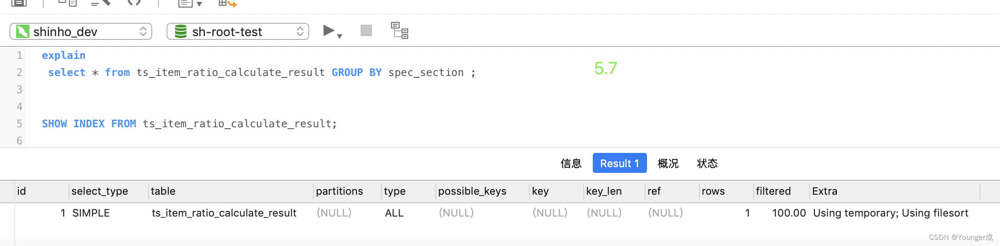

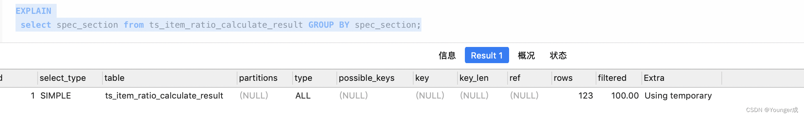


### 去除隐式排序：

加上order by null

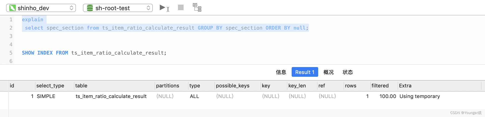

# 2、索引中可以使用函数表达式

## 窗口函数

```sql
窗口函数 OVER ([PARTITION BY 窗口列清单] ORDER BY 排序列清单 ASC|DESC)
 
或
 
窗口函数 OVER 窗口名
WINDOW 窗口名 AS ([PARTITION BY 窗口列清单] ORDER BY 排序列清单 ASC|DESC)
```

**OVER() 关键字指定窗口函数的，范围：**

- 若后面括号中什么都不写,则意味着窗口包含满足WHERE条件的所有行，窗口函数基于所有行进行计算。
- **如果不为空,则支持以下4中语法来设置窗口**`window_name窗口名``partition by 窗口分组``order by 窗口排序``frame 滑动窗口`
- **窗口名：****为窗口设置一个别名，用来标记窗口，如果SQL中针对这个窗口,使用频繁采用别名,==可以更加清新方便复用 调用==**
- **Partition by 分组：****按指定字段进行分组，分组后，可以在每个分组中分别执行。**
- **Order by 排序：****指定窗口函数按照哪些字段进行排序。执行排序操作使窗口函数按照排序后的数据记录的顺序进行编号**
- **Frame 子句：为分区中的某个子集定义规则，可以用来作为滑动窗口使用**


序号函数：

[ROW\_NUMBER](<https://so.csdn.net/so/search?q=ROW_NUMBER&spm=1001.2101.3001.7020>)()函数能够对数据中的序号进行顺序显示

```sql
 select ROW_NUMBER() OVER() as rownum, t.* from ts_item_ratio_calculate_result t;
 
-- 分组内排序（在窗口内计算行号）
 select ROW_NUMBER() OVER(PARTITION by  spec_section) as rownum, t.* from ts_item_ratio_calculate_result t;
 
-- 分组内排序（在窗体内做复杂聚合操作）
 select ROW_NUMBER() OVER(PARTITION by  spec_section ORDER BY conty_code desc) as rownum, t.* from ts_item_ratio_calculate_result t;
```

RANK()函数能够对序号进行并列排序，并且会跳过重复的序号，比如序号为1、1、3

```sql
select RANK() OVER(PARTITION by  spec_section ORDER BY item_code desc) as rownum, t.* from ts_item_ratio_calculate_result t 
```


DENSE\_RANK() 函数和 RANK() 函数类似,相同值的顺序会并列排序，但不同的是，后面的顺序不会跨值，而是继续的顺序下去.

```sql
select DENSE_RANK() OVER(PARTITION by  spec_section ORDER BY item_code desc) as rownum, t.* from ts_item_ratio_calculate_result t 
```


### PERCENT_RANK()

PERCENT_RANK()函数是等级值百分比函数。按照如下方式进行计算&nbsp;<code>(rank - 1) / (rows - 1)</code>&nbsp;这是一种概率统计论中的一种算法, 实际场景使用较少


- rank 相当于RANK()函数产生的序号.

- rows 相当于当前窗口的总记录数.&nbsp;<strong>count() 函数</strong>

- <strong>PERCENT_RANK() 通常用来表示，一种概率统计率的计算</strong>


<!-- -->

### CUME_DIST()


<strong>也是一种&nbsp;<code>概率统计函数,常用于计算，某一之在当前中记录中的随机率</code></strong><strong>公式：</strong><code>rank/count</code>

LAG(expr,n)

**返回当前行的前n行的expr的值:**

**这个函数可以完成很多高级的功能，比如获取到，`返回当前行的前n行的expr的值`**

```sql
SELECT FIRST_VALUE(prdcateg_code) OVER(PARTITION BY brand_code ORDER BY prdcateg_code asc) AS '大品类',t.* from ts_area_structure_ratio t 
where is_deleted = 0 and year = 2023  and geoc_code = 'City000159'
```


### LEAD(expr,n)

**`与LAG(,) 相反` 返回当前行的后n行的expr的值**


### NTH\_VALUE(expr,n)

**NTH\_VALUE(e，n); 函数返会第n行,e列的数据，和上面的LAG(e,n) 很类似\~，`不同的是LAG(e,n) 是当前行往下`** NTH\_VALUE 是基于整个窗口的第n行


### NTILE(n)

<span style="color:#ed7976;"><strong>NTILE(n); 函数，相当于对于分组后的组，在进行一次划分，数将分区中的有序数据分为n个桶，记录桶编号-并不是很理解使用场景</strong></span>


## **窗口聚合函数**

```sql
-- 普通的聚合函数
SELECT sum(shinho_goal_prdcateg_sale_volume_first_year) FROM ts_area_structure_ratio where is_deleted = 0 and year = 2023  and geoc_code = 'City000159' ;
 
-- 窗口聚合函数
SELECT sum(shinho_goal_prdcateg_sale_volume_first_year) OVER() AS sum_value ,t.* FROM ts_area_structure_ratio t where is_deleted = 0 and year = 2023  and geoc_code = 'City000159' limit 10;
```


**窗口函数的执行顺序：** ✨

- **查询语句的处理顺序依次为 FROM、WHERE、GROUP BY、聚合函数、HAVING、窗口函数、SELECT DISTINCT、ORDER BY、LIMIT**
- **窗口函数只能出现在select列表和order by子句中**

<!-- -->

## 普通共用表表达式：

CTE：公用表表达式

CTE是一个命名的临时结果集，作用范围是当前语句。

CTE可以理解成一个可以复用的子查询，当然跟子查询还是有点区别的， CTE可以引用其他CTE，但子查询不能引用其他子查询。所以，可以考虑代替子查询

普通公用表表达式类似于子查询，不过，跟子查询不同的是，它可以被多次引用，而且可以被其他的普通公用表表达式所引用

```sql
WITH CTE名称
AS (子查询)
SELECT|DELETE|UPDATE 语句;
 
-- 关联查询
WITH label
as (SELECT * from ts_area_label WHERE YEAR = 2023 and is_deleted = 0 and province_code = '110' GROUP BY city_code )
select t1.* from ts_area_structure_ratio t1 inner join label t2 on t1.geoc_code = t2.city_code where t1.is_deleted  = 0 and t1.year =2023;
```


## 递归公用表表达式

递归公用表表达式也是一种公用表表达式，只不过，除了普通公用表表达式的特点以外，它还有自己的特点，就是可以调用自己

```sql
WITH RECURSIVE
CTE名称 AS （子查询）
SELECT|DELETE|UPDATE 语句;
```

递归公用表表达式由 2 部分组成，分别是种子查询和递归查询，中间通过关键字 UNION [ALL]进行连接。 这里的种子查询，意思就是获得递归的初始值。这个查询只会运行一次，以创建初始数据集，之后递归 查询会一直执行，直到没有任何新的查询数据产生，递归返回。

```sql
-- 找出所有子节点
WITH RECURSIVE cte
As
 (
 SELECT prdcate_code ,parent_code,prdcate_name , 1 as n from ts_category_info where parent_code =  'null'
UNION ALL
SELECT a.prdcate_code ,a.parent_code, a.prdcate_name,n+1 from ts_category_info  AS a JOIN cte
on (a.parent_code = cte.prdcate_code)
)
SELECT *  from cte where n >= 3;
 
 
-- 给定初始值、终值，遍历
WITH RECURSIVE cte (n) AS
(
  SELECT 1
  UNION ALL
  SELECT n + 1 FROM cte WHERE n < 5
)
SELECT * FROM cte;
```

**8\.0版本不支持在 IN (子查询) 中直接写Limit**

# 3、系统层面

## 原子ddl操作:

InnoDB表的DDL支持事务完整性，要么成功要么回滚，将DDL操作回滚日志写入到data dictionary 数据字典表 mysql.innodb\_ddl\_log 中用于回滚操作

举例：MySQL5.7 执行 drop 命令 drop table t1,t2; 如果 t1 存在，t2 不存在，会提示 t2 表不存在，但是 t1 表仍然会被删除，MySQL8.0 执行同样的 drop 命令，会提 示 t2 表不存在，而且 t1 表不会被删除，保证了原子性。

## 自增持久化：

解决了之前的版本主键重复的问题。MySQL5.7 及其以前的版本，MySQL 服务器重启，会重新扫描表的主键最大值，如果之前已经删除过 id=100 的数据， 但是表中当前记录的最大值如果是99，那么经过扫描，下一条记录的id是100，而不是 101。MySQL8.0 则是每次在变化的时候，都会将自增计数器的最大值写 入 redo log，同时在每次检查点将其写入引擎私有的系统表。则不会出现自增主 键重复的问题。

```sql
INSERT INTO `shroot_dev`.`ts_item_ratio_calculate_result`(`year`, `item_code`, `spu_code`, `conty_code`, `spec_section`, `spec_interval`, `ratio_item_tmp`, `value_gross_tmp`, `ratio_item_final`, `prod_spec_num`, `calculate_flag`, `created_time`, `updated_time`, `is_deleted`) 
VALUES ( 2022, '0100020300070180', '010002030007', 'QU000614', 1, '(0,500ml)', 0.000000000, 0.000000000, 0.000000000, 180.000000000, 1, '2022-09-05 12:31:12', '2022-09-05 12:31:12', 0);
```


## 重构sql分析器：

改进 SQL 分析器。旧的分析器由于其语法复杂性和自顶向下的分析方式从而有严重的限制，导致难以维护和扩展

## 新的系统字典表：

整合了存储有关数据库对象信息的事务数据字典，所有的元数据都用InnoDB引擎进行存储

## 字符集 ：

默认字符集由latin1变为utf8mb4

## 全局参数持久化：

mysql8.0版本支持在线修改全局参数持久化，通过加上PERSIST关键字，可以将调整持久化到新的配置文件中，再次重启db还可以应用到最新的参数。对于加上 PERSIST 关键字修改参数命令，Mysql系统会生成一个包含json格式数据的 mysqld-auto.cnf 文件，比如执行：

set PERSIST expire\_logs\_days=10 ; #内存和json文件都修改，重启还生效

set GLOBAL expire\_logs\_days=10 ; #只修改内存，重启丢失

系统会在数据目录下生成一个包含如下内容的 mysqld-auto.cnf 的文件：

{ "mysql\_server": {"expire\_logs\_days": "10" } }

当 my.cnf 和 mysqld-auto.cnf 同时存在时，后者具有高优先级


## JSON聚合函数

JSON\_ARRAYAGG(),将多行数据组合成 json 数组

JSON\_OBJECTAGG()，用于生成 json 对象

<div><pre data-index="13" prenum="13"></pre></div>

JSON 实用函数（对输出内容进行格式化，美化的一种输出）

JSON\_PRETTY() 输出 json 数据的时候，格式化。

JSON\_STORAGE\_SIZE() json 数据所占用的存储空间(单位:字节)

JSON\_STORAGE\_FREE() json 数据更新后所释放的空间(单位:字节)


## **JSON 合并函数**（将2个json对象合并成一个对象）

MySQL8.0 废弃了 JSON\_MERGE()函数，推荐使用以下两个函数合并 JSON 数据

JSON\_MERGE\_PATCH()

JSON\_MERGE\_PRESERV()


## 增强正则表达式

提供了 REGEXP\_LIKE()，EGEXP\_INSTR(), REGEXP\_REPLACE(), REGEXP\_SUBSTR() 等函数


# 4、InnoDB

新增 INFORMATION\_SCHEMA.INNODB\_CACHED\_INDEXES，查看每个索引缓存在 InnoDB 缓冲池中的索引页数。

InnoDB 临时表都将在共享临时表空间 ibtmp1 中创建。<br>

 对于 SELECT ... FOR SHARE 和 SELECT ... FOR UPDATE 语句，InnoDB 支持 NOWAIT

和 SKIP LOCKED。

innodb\_undo\_tablespaces 的最小值为 2，并且不再允许将 innodb\_undo\_tablespaces 设置为 0。 最小值 2 确保回滚段始终在撤消表空间中 创建，而不是在系统表空间中创建。

支持 ALTER TABLESPACE ... RENAME TO 语法。<br>

 新增 innodb\_dedicated\_server，让 InnoDB 根据服务器上检测到的内存量自动

配置 innodb\_buffer\_pool\_size，innodb\_log\_file\_size，innodb\_flush\_method。

新增 INFORMATION\_SCHEMA.INNODB\_TABLESPACES\_BRIEF 视图。

新增了动态配置项 innodb\_deadlock\_detect，用来禁用死锁检查，因为在高并 发系统中，当大量线程等待同一个锁时，死锁检查会大大拖慢数据库。（死锁检测-默认开启）

```sql
 show variables like 'innodb_deadlock_detect';
 
-- 关闭死锁检测
 set GLOBAL innodb_deadlock_detect = off;
 
-- 死锁语句测试
 -- 启动事务
 start TRANSACTION ;
 
 -- 获取共享锁
 select * from test where c1 = 'c' for SHARE; 
 DELETE from test where c1 = 'c';
```

支持使用 innodb\_directories 选项在服务器脱机时将表空间文件移动或恢复到 新位置。

8\.0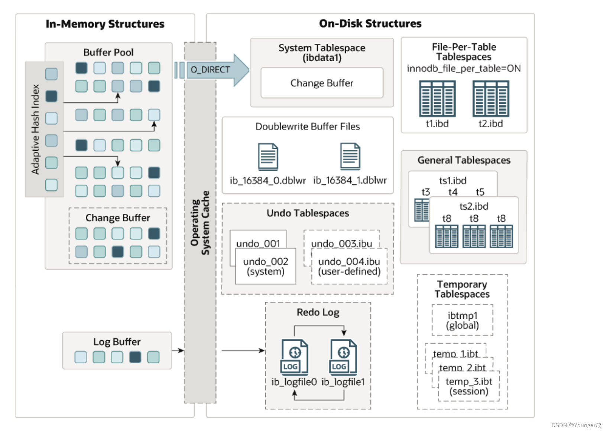

5\.7

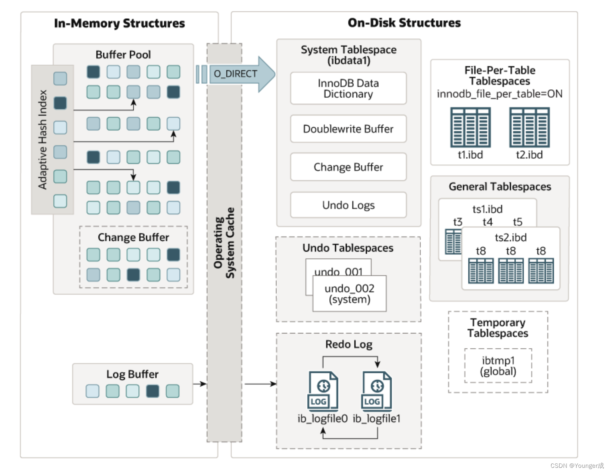

1、对比8.0和5.7，8.0默认创建 2 个 UNDO 表空间，不再使用系统表空间

# 5、问题

1、日期问题

datetime用的默认值问题，尽量使用默认值：CURRENT\_TIMESTAMP

2、用户的创建与授权

用户的创建与授权需要两条单独的 SQL 语句执行

 在 MySQL5.7 的版本:

\ > grant all privileges on \*.\* to '用户名'@'主机' identified by '密码'; 在 MySQL8.0 需要分开执行:

\ >create user '用户名'@'主机' identified by '密码';

\ >grant all privileges on \*.\* to '用户名'@'主机'; 用以前的一条命令在 8.0 里面创建用户，会出现 sql 语法错误

3、密码管理

MySQL8.0 的密码管理策略提供了 3 个变量:

- 1、password\_history 修改密码不允许与最近几次使用或的密码重复，默认是0，即不限制;
- 2、password\_reuse\_interval 修改密码不允许与最近多少天的使用过的密码重复，默认是 0,即不限制;
- 3、password\_require\_current 修改密码是否需要提供当前的登录密码，默认是OFF,即不需要;如果需要，则设置成 ON。 还可针对某一个用户单独设置密码管理策略 alter user '用户名'@'主机' password history 5；


4、mysql8.0删除了一些旧特性

查询缓存（已被移除）：移除项-FLUSH query cache、Reset query cache;

加密相关：encode()、decode()、encrypt()、des\_encrypt()、des\_decrypt()函数均被移除

# 6、项目中可能会出现的问题

## 1、语法问题

不再支持：不再支持 GROUP BY col\_name ASC/DESC。如果要排序，需显式指定排序列

!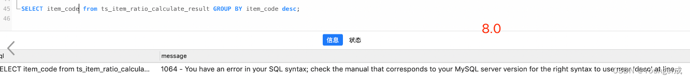

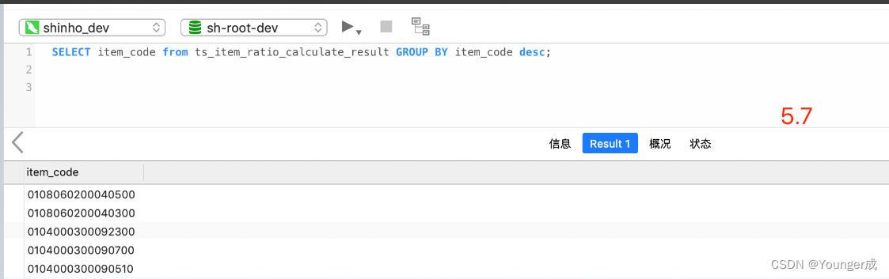

MySQL 8.0 的正则表达式底层库由 Henry Spencer 调整为了 International Components for Unicode (ICU)，Spencer 库的部分语法不再支持：

```sql
-- 8.0的写法
select "a word a" REGEXP "\\bword\\b";
 
 
-- 5.7的写法
select "a word a" REGEXP "[[:<:]]word[[:>:]]";
```

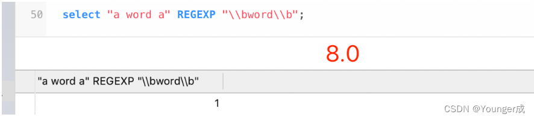

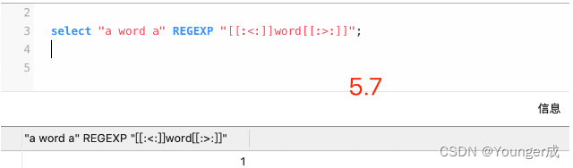

2、字符集编码问题

报错信息：

<span style="color:#fe2c24;">1267 - Illegal mix of collations (utf8mb4_0900_ai_ci,IMPLICIT) and (utf8mb4_general_ci,IMPLICIT) for operation '=', Time: 0.008000s</span>

原因：连表的两个表的排序规则不一样，一个为utf8mb4\_0900\_ai\_ci，另一个为：utf8mb4\_general\_ci

解决方案：修改字符编码

```sql
-- 查看系统字符编码
show variables like 'character_%';  
show variables like 'collation_%';
 
 
 
-- 查看数据库下表的字符编码
show table status from shroot_dev;
 
-- 查看表下所有列的字符编码
SHOW FULL COLUMNS FROM user_info;
 
 
-- 修改表的字符编码
alter table user_info default character set utf8mb4 collate=utf8mb4_general_ci;
 
-- 修改表中字段的字符编码
ALTER TABLE user_info convert to CHARACTER SET utf8mb4 COLLATE utf8mb4_general_ci;
```

5\.7向上升级过程中会出现编码问题（latin1->utf8mb4）、5.7默认是latin1，直接插入中文会乱码，所有会有用户将latin1改为utf8,utf8字符集是utf8mb3（最大编码字节：3byte），而mysql8.0是utf8mb4（最大编码字节：4byte），存在差异性

存在问题，如果utf8mb3的表和utf8mb4的表做连表查询，可能会有索引失效(被关联的表会索引失效)问题

解决方案：保证字节编码一致，同上述问题

3、改密码报错、授权问题

```sql
-- 修改用户密码
ALTER USER 'yang'@'%' IDENTIFIED WITH mysql_native_password BY '123123'; 
```

报错如下：

<span style="color:#fe2c24;">1227 - Access denied; you need (at least one of) the SYSTEM_USER privilege(s) for this operation, Time: 0.007000s</span>

<span style="color:#0d0016;">解决方案：</span>

```sql
-- 将系统用户权限赋值给root
grant system_user on *.* to 'root';
 
 
-- 修改用户密码
ALTER USER 'yang'@'%' IDENTIFIED WITH mysql_native_password BY '123123'; 
```

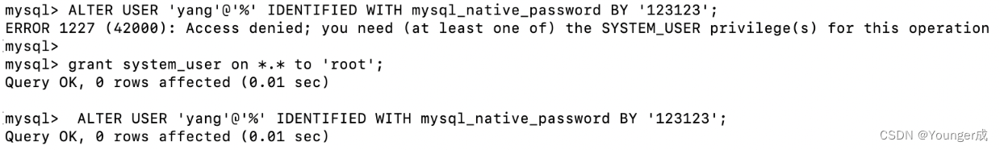

4、用户的创建与授权


解决方案-将原先的一步走变为2步，在5.7和8.0都支持：

1、先创建用户

2、授权

```sql
create user 'yang'@'%' identified by '123456';
grant all privileges on *.* to 'yang'@'%' with grant option;
```

效果如下：

5\.7创建用户及授权-创建成功

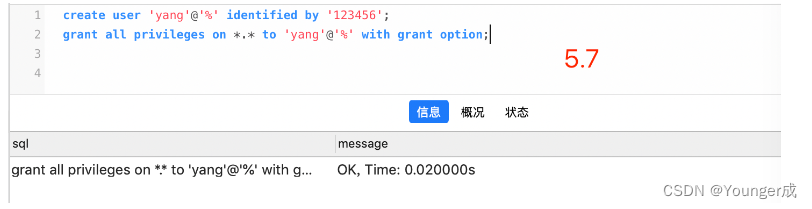

8.0创建用户及授权-创建成功

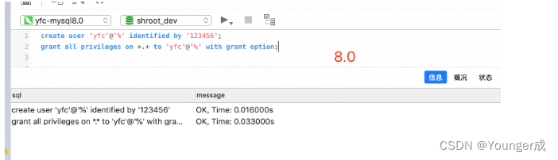