# MySQL内部流程

## Innodb引擎SQL执行到写入磁盘过程

**<u>开门见山，先看这张图，从整体上了解整个流程，之后在细分详解</u>**

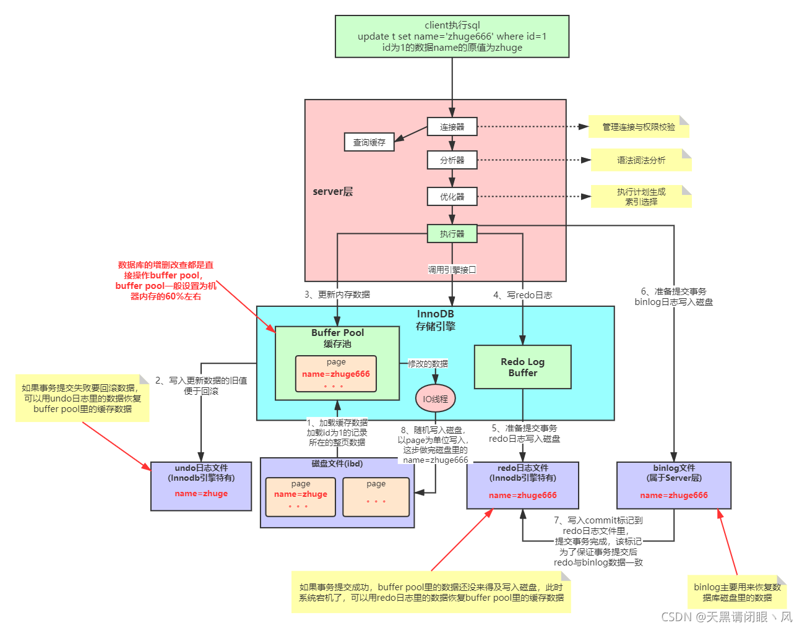

整个执行过程如上图。server层执行过程都是一样。不同存储引擎执行的过程不一样。这里了以最常用的innodb引擎为例。执行一条update语句时，先后经过连接器、分析器、优化器最后有执行器调用innodb引擎。这里主要分析innodb引擎的执行过程。

1. 先从磁盘中加载对应要修改记录的一页数据到BufferPool(缓存池，一块内存)，缓存池每次加载数据都是一页或者多页加载，不会只加载单条记录（<u>**MySQL自动完成，不是由用户响应出发的）**</u>。
2. 加载完记录后，将要修改的记录写一份undo日志。便于事务提价失败后回滚。这个undo日志在mvcc机制中也说过。
3. 通过执行器调用innodb引擎将数据更新到缓存池中。
4. 写一份redo日志。redo日志记录就是更新的数据内容。并且redo日志也是先存放在一快内存中
5. redo日志从缓存准备写入磁盘中，此时就是事务的提交，mysql如果不开启事务就是自动commit，如果开启了事务就是等待客户端执行commit。当客户端执行了commit，就是准备从缓存中写入磁盘。
6. 当写完redo日志并准备从缓存中写入磁盘时，server层开始写入binlog日志到磁盘中
7. binlog日志写入磁盘后，写入commit标记到redo日志里面，redo日志写入磁盘。这样保证了事务提交后redo日志和binlog日志数据内容是一致的
8. 内部会有IO线程以页为单位，将缓存池的数据写入磁盘。这个写入的时间是不确定的。

这个过程中可能会有几个疑问？

1. redo日志、undo日志、binlog日志关系。

   redo日志和undo日志是innodb引擎独有的。binlog日志是server层写的，也就是说如果换成myisam，就没有redo和undo，binlog一样会有。binlog日志和redo日志记录内容大致一样。

2. 这几个日志的作用

   redo日志：如果事务提交成功，binlog日志也写入完成，此时客户端就认为数据已经写入完成了。但是数据其实还在缓存池中，如果此时数据库宕机。那么数据丢失。如果有了这个redo日志，在重启数据库的时候就会根据redo日志将数据写入缓存池。这样就保证了缓存池的数据不丢失。

   binlog日志：如果数据库的数据被删除，开启了binlog功能的话，每次对数据库的增删改都会记录到binlog日志中，就可以通过binlog日志恢复数据。 binlog日志恢复的是磁盘数据。redo恢复的是缓存池日志。

   undo日志：用于mvcc机制和事务回滚

3. 为什么Mysql不能直接更新磁盘上的数据而且设置这么一套复杂的机制来执行SQL了？

   因为来一个请求就直接对磁盘文件进行随机读写，然后更新磁盘文件里的数据的<u>**性能以及实时性**</u>可能相当差。磁盘随机读写的性能是非常差的

   更新磁盘文件是不能让数据库抗住很高并发的。 Mysql这套机制看起来复杂，但它可以保证每个更新请求都是更新内存BufferPool，然后顺序写日志文件，同时还能 保证各种异常情况下的数据一致性。 更新内存的性能是极高的，然后顺序写磁盘上的日志文件的性能也是非常高的，要远高于随机读写磁盘文件。 正是通过这套机制，才能让我们的MySQL数据库在较高配置的机器上每秒可以抗下几干的读写请求。

## 一条SQL语句是如何执行的？

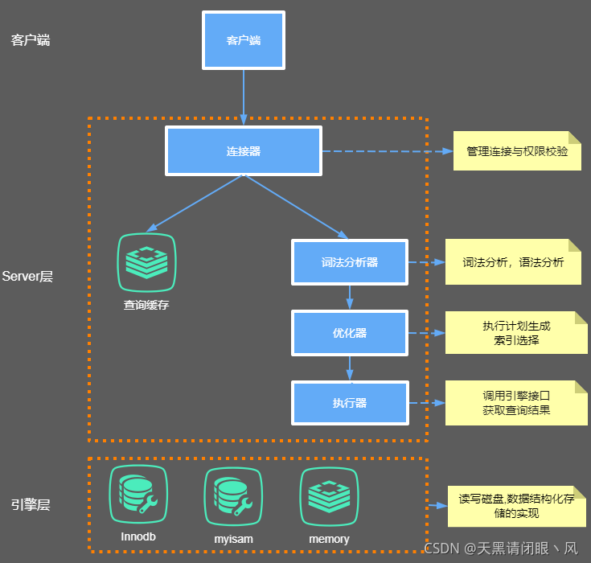

### 1.通信协议

首先，MySQL 必须要运行一个服务，监听默认的 3306 端口。在我们开发系统跟第三方对接的时候，必须要弄清楚的有两件事。 第一个就是通信协议，比如我们是用 HTP 还是 WebService 还是 TCP？ 第二个是消息格式，比如我们用 XML 格式，还是 JSON 格式，还是定长格式？报文头长度多少，包含什么内容，每个字段的详细含义。

MySQL 是支持多种通信协议的，可以使用同步/异步的方式，支持长连接/短连接。 这里我们拆分来看。第一个是通信类型。

```
show global variables like 'wait_timeout'; -- 非交互式超时时间，如 JDBC 程序
show global variables like 'interactive_timeout'; -- 交互式超时时间，如数据库工具
```

默认都是 28800 秒，8 小时。

我们怎么查看 MySQL 当前有多少个连接？ 可以用 show status 命令：

```
show global status like 'Thread%';
```

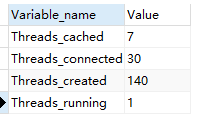

每产生一个连接或者一个会话，在服务端就会创建一个线程来处理。反过来，如果要杀死会话，就是 Kill 线程。

有了连接数，怎么知道当前连接的状态？ 也可以使用 SHOW PROCESSLIST; （root 用户）查看 SQL 的执行状态.

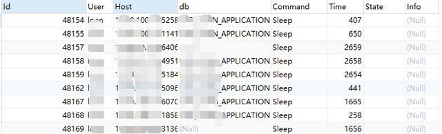

MySQL 服务允许的最大连接数是多少呢？在 5.7 版本中默认是 151 个，最大可以设置成 16384（2^14）。

```
show variables like 'max_connections';
```


show 的参数说明：

1. 级别：会话 session 级别（默认）；全局 global 级别

2. 动态修改：set，重启后失效；永久生效，修改配置文件/etc/my.cnf

   ```
   set global max_connections = 1000;
   ```

- **通信协议**

  MySQL 支持哪些通信协议呢？

  第一种是 Unix Socket。 比如我们在 Linux 服务器上，如果没有指定-h 参数，它就用 socket 方式登录（省略 了-S /var/lib/mysql/mysql.sock）。它不用通过网络协议，也可以连接到 MySQL 的服务器，它需要用到服务器上的一个物理文件（/var/lib/mysql/mysql.sock）。

  ```
  select @@socket;
  ```

  如果指定-h 参数，就会用第二种方式，TCP/IP 协议。

  ```
  mysql -h192.168.8.211 -uroot -p123456
  ```

  我们的编程语言的连接模块都是用 TCP 协议连接到 MySQL 服务器的，比如 mysql-connector-java-x.x.xx.jar。

  另外还有命名管道（Named Pipes）和内存共享（Share Memory）的方式，这两种 通信方式只能在 Windows 上面使用，一般用得比较少。

### 2.通信方式

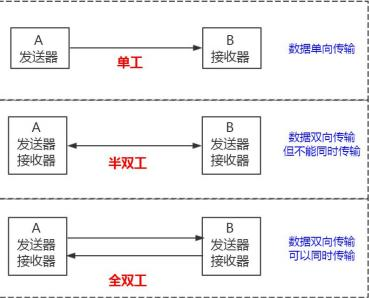


MySQL 使用了半双工的通信方式？

要么是客户端向服务端发送数据，要么是服务端向客户端发送数据，这两个动作不能同时发生。所以客户端发送 SQL 语句给服务端的时候，（在一次连接里面）数据是不能分成小块发送的，不管你的 SQL 语句有多大，都是一次性发送。 比如我们用 MyBatis 动态 SQL 生成了一个批量插入的语句，插入 10 万条数据，values 后面跟了一长串的内容，或者 where 条件 in 里面的值太多，会出现问题。 这个时候我们必须要调整 MySQL 服务器配置 max_allowed_packet 参数的值（默认 是 4M），把它调大，否则就会报错。

```
show variables like 'max_allowed_packet';
```

另一方面，对于服务端来说，也是一次性发送所有的数据，不能因为你已经取到了想要的数据就中断操作，这个时候会对网络和内存产生大量消耗。 所以，我们一定要在程序里面避免不带 limit 的这种操作，比如一次把所有满足条件的数据全部查出来，一定要先 count 一下。如果数据量的话，可以分批查询。

执行一条查询语句，客户端跟服务端建立连接之后呢？下一步要做什么？

### 4.语法解析和预处理(Parser & Preprocessor)

我们没有使用缓存的话，就会跳过缓存的模块，下一步我们要做什么呢？ OK，这里我会有一个疑问，为什么我的一条 SQL 语句能够被识别呢？假如我随便执行一 个字符串 javacoo，服务器报了一个 1064 的错：


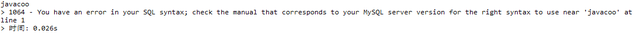

它是怎么知道我输入的内容是错误的？

这个就是 MySQL 的 Parser 解析器和 Preprocessor 预处理模块。 这一步主要做的事情是对语句基于 SQL 语法进行词法和语法分析和语义的解析。

- **词法解析**

  词法分析就是把一个完整的 SQL 语句打碎成一个个的单词。比如一个简单的 SQL 语句：

  ```
  select name from user where id = 1;
  ```

  它会打碎成 8 个符号，每个符号是什么类型，从哪里开始到哪里结束。

- **语法解析**

  第二步就是语法分析，语法分析会对 SQL 做一些语法检查，比如单引号有没有闭合， 然后根据 MySQL 定义的语法规则，根据 SQL 语句生成一个数据结构。这个数据结构我 们把它叫做解析树（select_lex）。

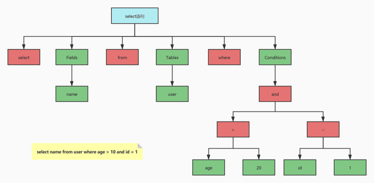

任何数据库的中间件，比如 Mycat，Sharding-JDBC（用到了 Druid Parser），都必须要有词法和语法分析功能，在市面上也有很多的开源的词法解析的工具（比如 LEX,Yacc）。

- **预处理器**

  问题：如果我写了一个词法和语法都正确的 SQL，但是表名或者字段不存在，会在哪里报错？是在数据库的执行层还是解析器？比如：

  ```
  select * from javacoo;
  ```

  解析器可以分析语法，但是它怎么知道数据库里面有什么表，表里面有什么字段呢？ 实际上还是在解析的时候报错，解析 SQL 的环节里面有个预处理器。 它会检查生成的解析树，解决解析器无法解析的语义。比如，它会检查表和列名是否存在，检查名字和别名，保证没有歧义。 预处理之后得到一个新的解析树。

### 5.查询优化（Query Optimizer）与查询执行计划

- **什么是优化器？**

  得到解析树之后，是不是执行 SQL 语句了呢？

  这里我们有一个问题，一条 SQL 语句是不是只有一种执行方式？或者说数据库最终执行的 SQL 是不是就是我们发送的 SQL？

  这个答案是否定的。一条 SQL 语句是可以有很多种执行方式的，最终返回相同的结果，他们是等价的。但是如果有这么多种执行方式，这些执行方式怎么得到的？最终选 择哪一种去执行？根据什么判断标准去选择？

  这个就是 MySQL 的查询优化器的模块（Optimizer）。 查询优化器的目的就是根据解析树生成不同的执行计划（Execution Plan），然后选择一种最优的执行计划，MySQL 里面使用的是基于开销（cost）的优化器，那种执行计划开销最小，就用哪种。 可以使用这个命令查看查询的开销：

  ```
  show status like 'Last_query_cost';
  ```

- **优化器可以做什么？**

  MySQL 的优化器能处理哪些优化类型呢？ 举两个简单的例子： 1、当我们对多张表进行关联查询的时候，以哪个表的数据作为基准表。 2、有多个索引可以使用的时候，选择哪个索引。 实际上，对于每一种数据库来说，优化器的模块都是必不可少的，他们通过复杂的算法实现尽可能优化查询效率的目标。 如果对于优化器的细节感兴趣，可以看看《数据库查询优化器的艺术-原理解析与SQL性能优化》。

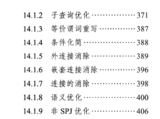

但是优化器也不是万能的，并不是再垃圾的 SQL 语句都能自动优化，也不是每次都能选择到最优的执行计划，大家在编写 SQL 语句的时候还是要注意。

如果我们想知道优化器是怎么工作的，它生成了几种执行计划，每种执行计划的 cost 是多少，应该怎么做？

- **优化器是怎么得到执行计划的？**dev.mysql.com/doc/internals/en/optimizer-tracing.html

  首先我们要启用优化器的追踪（默认是关闭的）：

  ```
  SHOW VARIABLES LIKE 'optimizer_trace';
  set optimizer_trace='enabled=on';
  ```

  注意开启这开关是会消耗性能的，因为它要把优化分析的结果写到表里面，所以不要轻易开启，或者查看完之后关闭它（改成 off）。

  注意：参数分为 session 和 global 级别。

  接着我们执行一个 SQL 语句，优化器会生成执行计划：

  ```
  select t.tcid from teacher t,teacher_contact tc where t.tcid = tc.tcid
  ```

  这个时候优化器分析的过程已经记录到系统表里面了，我们可以查询：

  ```
  select * from information_schema.optimizer_trace\G
  ```

  它是一个 JSON 类型的数据，主要分成三部分，准备阶段、优化阶段和执行阶段。

  expanded_query 是优化后的 SQL 语句。 considered_execution_plans 里面列出了所有的执行计划。 分析完记得关掉它：

  ```
  set="enabled=off";
  SHOW VARIABLES LIKE ;
  ```

- **优化器得到的结果**

  优化完之后，得到一个什么东西呢？

  优化器最终会把解析树变成一个查询执行计划，查询执行计划是一个数据结构。

  当然，这个执行计划是不是一定是最优的执行计划呢？不一定，因为 MySQL 也有可能覆盖不到所有的执行计划。 我们怎么查看 MySQL 的执行计划呢？比如多张表关联查询，先查询哪张表？在执行 查询的时候可能用到哪些索引，实际上用到了什么索引？ MySQL 提供了一个执行计划的工具。我们在 SQL 语句前面加上 EXPLAIN，就可以 看到执行计划的信息。

  ```
  EXPLAIN select name from user where id=1;
  ```

  注意 Explain 的结果也不一定最终执行的方式。

### 6.存储引擎

得到执行计划以后，SQL 语句是不是终于可以执行了？

问题又来了：

1. 从逻辑的角度来说，我们的数据是放在哪里的，或者说放在一个什么结构里面？
2. 执行计划在哪里执行？是谁去执行？

- **存储引擎基本介绍**

  我们先回答第一个问题：在关系型数据库里面，数据是放在什么结构里面的？ （放在表 Table 里面的）

  我们可以把这个表理解成 Excel 电子表格的形式。所以我们的表在存储数据的同时， 还要组织数据的存储结构，这个存储结构就是由我们的存储引擎决定的，所以我们也可以把存储引擎叫做表类型。

  在 MySQL 里面，支持多种存储引擎，他们是可以替换的，所以叫做插件式的存储引擎。为什么要搞这么多存储引擎呢？一种还不够用吗？ 这个问题先留着。

- **查看存储引擎**

  比如我们数据库里面已经存在的表，我们怎么查看它们的存储引擎呢？

  ```
  show table status from `test`;
  ```

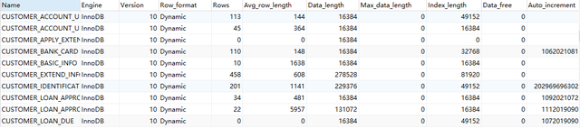

或者通过 DDL 建表语句来查看。

在 MySQL 里面，我们创建的每一张表都可以指定它的存储引擎，而不是一个数据库只能使用一个存储引擎。存储引擎的使用是以表为单位的。而且，创建表之后还可以修 改存储引擎。

我们说一张表使用的存储引擎决定我们存储数据的结构，那在服务器上它们是怎么存储的呢？我们先要找到数据库存放数据的路径：

```
show variables like 'datadir';
```

默认情况下，每个数据库有一个自己文件夹，以test 数据库为例。 任何一个存储引擎都有一个 frm 文件，这个是表结构定义文件。

不同的存储引擎存放数据的方式不一样，产生的文件也不一样，innodb 是 1 个， memory 没有，myisam 是两个。

这些存储引擎的差别在哪呢？

- **存储引擎比较**

  **常见存储引擎**

  MyISAM 和 InnoDB 是我们用得最多的两个存储引擎，在 MySQL 5.5 版本之前， 默认的存储引擎是 MyISAM，它是 MySQL 自带的。我们创建表的时候不指定存储引擎， 它就会使用 MyISAM 作为存储引擎。

  MyISAM 的前身是 ISAM（Indexed Sequential Access Method：利用索引，顺序 存取数据的方法）。

  5.5 版本之后默认的存储引擎改成了 InnoDB，它是第三方公司为 MySQL 开发的。 为什么要改呢？最主要的原因还是 InnoDB 支持事务，支持行级别的锁，对于业务一致性要求高的场景来说更适合。

  这个里面又有 Oracle 和 MySQL 公司的一段恩怨情仇。 InnoDB 本来是 InnobaseOy 公司开发的，它和 MySQL AB 公司合作开源了 InnoDB 的代码。但是没想到 MySQL 的竞争对手 Oracle 把 InnobaseOy 收购了。 后来 08 年 Sun 公司（开发 Java 语言的 Sun）收购了 MySQL AB，09 年 Sun 公司 又被 Oracle 收购了，所以 MySQL，InnoDB 又是一家了。有人觉得 MySQL 越来越像 Oracle，其实也是这个原因。

  那么除了这两个我们最熟悉的存储引擎，数据库还支持其他哪些常用的存储引擎 呢？

  **数据库支持的存储引擎**

  我们可以用这个命令查看数据库对存储引擎的支持情况：

  ```
  show engines;
  ```

  其中有存储引擎的描述和对事务、XA 协议和 Savepoints 的支持。

  XA 协议用来实现分布式事务（分为本地资源管理器，事务管理器）。

  Savepoints 用来实现子事务（嵌套事务）。创建了一个 Savepoints 之后，事务就可以回滚到这个点，不会影响到创建 Savepoints 之前的操作

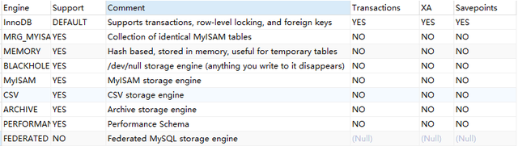

这些数据库支持的存储引擎，分别有什么特性呢？dev.mysql.com/doc/refman/5.7/en/storage-engines.html

#### MyISAM（3 个文件）

These tables have a small footprint. Table-level locking limits the performance in read/write workloads, so it is often used in read-only or read-mostly workloads in Web and data warehousing configurations.

应用范围比较小。表级锁定限制了读/写的性能，因此在 Web 和数据仓库配置中， 它通常用于只读或以读为主的工作。

**特点：**

支持表级别的锁（插入和更新会锁表）。不支持事务。

拥有较高的插入（insert）和查询（select）速度。

存储了表的行数（count 速度更快）。

**<u>（怎么快速向数据库插入 100 万条数据？我们有一种先用 MyISAM 插入数据，然后修改存储引擎为 InnoDB 的操作。）</u>**

适合：只读之类的数据分析的项目。

#### InnoDB（2 个文件）

the default storage engine in MySQL 5.7. InnoDB is a transaction-safe (ACID compliant) storage engine for MySQL that has commit, rollback, and crash-recovery capabilities to protect user data. 

InnoDB row-level locking (without escalation to coarser granularity locks) and Oracle-style consistent nonlocking reads increase multi-user concurrency and performance. InnoDB stores user data in clustered indexes to reduce I/O for common queries based on primary keys. To maintain data integrity, InnoDB also supports FOREIGN KEY referential-integrity constraints.

mysql 5.7 中的默认存储引擎。InnoDB 是一个事务安全（与 ACID 兼容）的 MySQL 存储引擎，它具有提交、回滚和崩溃恢复功能来保护用户数据。InnoDB 行级锁（不升级为更粗粒度的锁）和 Oracle 风格的一致非锁读提高了多用户并发性和性能。InnoDB 将用户数据存储在聚集索引中，以减少基于主键的常见查询的 I/O。为了保持数据完整性，InnoDB 还支持外键引用完整性约束

**特点：**

支持事务，支持外键，因此数据的完整性、一致性更高。

支持行级别的锁和表级别的锁。

支持读写并发，写不阻塞读（MVCC）。

特殊的索引存放方式，可以减少 IO，提升查询效率。

适合：经常更新的表，存在并发读写或者有事务处理的业务系统。


这是 MySQL 里面常见的一些存储引擎，我们看到了，不同的存储引擎提供的特性都 不一样，它们有不同的存储机制、索引方式、锁定水平等功能。 我们在不同的业务场景中对数据操作的要求不同，就可以选择不同的存储引擎来满 足我们的需求，这个就是 MySQL 支持这么多存储引擎的原因。

- **如何选择存储引擎？**

  如果对数据一致性要求比较高，需要事务支持，可以选择 InnoDB。 如果数据查询多更新少，对查询性能要求比较高，可以选择 MyISAM。 如果需要一个用于查询的临时表，可以选择 Memory。 如果所有的存储引擎都不能满足你的需求，并且技术能力足够，可以根据官网内部 手册用 C 语言开发一个存储引擎： dev.mysql.com/doc/internals/en/custom-engine.html

### 7.执行引擎（Query Execution ),返回结果

OK，存储引擎分析完了，它是我们存储数据的形式，继续第二个问题，是谁使用执 行计划去操作存储引擎呢？

这就是我们的执行引擎，它利用存储引擎提供的相应的 API 来完成操作。

为什么我们修改了表的存储引擎，操作方式不需要做任何改变？因为不同功能的存 储引擎实现的 API 是相同的。

最后把数据返回给客户端，即使没有结果也要返回。

## 一条更新 SQL是如何执行的？

在数据库里面，我们说的 update 操作其实包括了更新、插入和删除。如果大家有看 过 MyBatis 的源码，应该知道 Executor 里面也只有 doQuery()和 doUpdate()的方法， 没有 doDelete()和 doInsert()。 更新流程和查询流程有什么不同呢？ 基本流程也是一致的，也就是说，它也要经过解析器、优化器的处理，最后交给执行器。 区别就在于拿到符合条件的数据之后的操作。

**缓冲池 Buffer Pool**

首先，InnnoDB 的数据都是放在磁盘上的，InnoDB 操作数据有一个最小的逻辑单位，叫做页（索引页和数据页）。我们对于数据的操作，不是每次都直接操作磁盘，因为磁盘的速度太慢了。InnoDB 使用了一种缓冲池的技术，也就是把磁盘读到的页放到一 块内存区域里面。这个内存区域就叫 Buffer Pool。

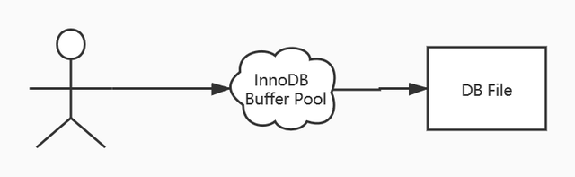

下一次读取相同的页，先判断是不是在缓冲池里面，如果是，就直接读取，不用再次访问磁盘。

修改数据的时候，先修改缓冲池里面的页。内存的数据页和磁盘数据不一致的时候， 我们把它叫做脏页。InnoDB 里面有专门的后台线程把 Buffer Pool 的数据写入到磁盘， 每隔一段时间就一次性地把多个修改写入磁盘，这个动作就叫做刷脏。

Buffer Pool 是 InnoDB 里面非常重要的一个结构，它的内部又分成几块区域。这里我们趁机到官网来认识一下 InnoDB 的内存结构和磁盘结构

**InnoDB 内存结构和磁盘结构**


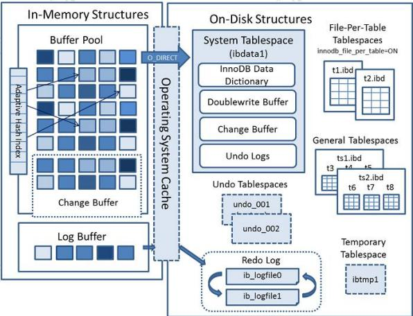


- **内存结构**

  Buffer Pool 主要分为 3 个部分： Buffer Pool、Change Buffer、Adaptive Hash Index，另外还有一个（redo）log buffer。

  ```
  SHOW STATUS LIKE '%innodb_buffer_pool%
  ```

  这些状态都可以在官网查到详细的含义，用搜索功能。 dev.mysql.com/doc/refman/5.7/en/server-status-variables.html

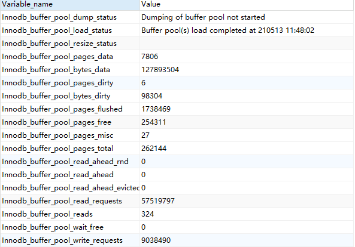

1. **Buffer Pool**

   Buffer Pool 缓存的是页面信息，包括数据页、索引页。 查看服务器状态，里面有很多跟 Buffer Pool 相关的信息：

Buffer Pool 默认大小是 128M（134217728 字节），可以调整。 查看参数（系统变量）：

```
SHOW VARIABLES like '%innodb_buffer_pool%';
```

这些参数都可以在官网查到详细的含义，用搜索功能。 dev.mysql.com/doc/refman/5.7/en/server-system-variables.html

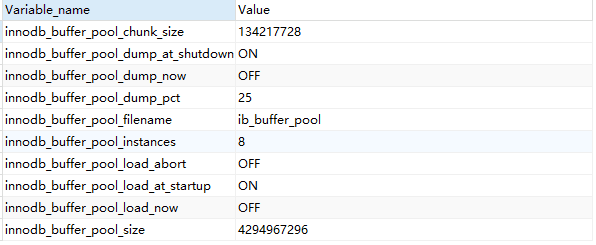

内存的缓冲池写满了怎么办？（Redis 设置的内存满了怎么办？）InnoDB 用 LRU 算法来管理缓冲池（链表实现，不是传统的 LRU，分成了 young 和 old），经过淘汰的数据就是热点数据。

内存缓冲区对于提升读写性能有很大的作用。思考一个问题： 当需要更新一个数据页时，如果数据页在 Buffer Pool 中存在，那么就直接更新好了。 否则的话就需要从磁盘加载到内存，再对内存的数据页进行操作。也就是说，如果没有命中缓冲池，至少要产生一次磁盘 IO，有没有优化的方式呢？

- **Change Buffer 写缓冲**

  如果这个数据页不是唯一索引，不存在数据重复的情况，也就不需要从磁盘加载索引页判断数据是不是重复（唯一性检查）。这种情况下可以先把修改记录在内存的缓冲池中，从而提升更新语句（Insert、Delete、Update）的执行速度。

  这一块区域就是 Change Buffer。5.5 之前叫 Insert Buffer 插入缓冲，现在也能支持 delete 和 update。

最后把 Change Buffer 记录到数据页的操作叫做 merge。什么时候发生 merge？ 有几种情况：在访问这个数据页的时候，或者通过后台线程、或者数据库 shut down、 redo log 写满时触发。 如果数据库大部分索引都是非唯一索引，并且业务是写多读少，不会在写数据后立刻读取，就可以使用 Change Buffer（写缓冲）。写多读少的业务，调大这个值：

```
SHOW VARIABLES LIKE 'innodb_change_buffer_max_size';
```


change_buffer_max_size.png

代表 Change Buffer 占 Buffer Pool 的比例，默认 25%。

- **Adaptive Hash Index**

  索引应该是放在磁盘的，为什么要专门把一种哈希的索引放到内存？下次再说。

- **（redo）Log Buffer**

  思考一个问题：如果 Buffer Pool 里面的脏页还没有刷入磁盘时，数据库宕机或者重 启，这些数据丢失。如果写操作写到一半，甚至可能会破坏数据文件导致数据库不可用。

  为了避免这个问题，InnoDB 把所有对页面的修改操作专门写入一个日志文件，并且在数据库启动时从这个文件进行恢复操作（实现 crash-safe）——用它来实现事务的持久性。

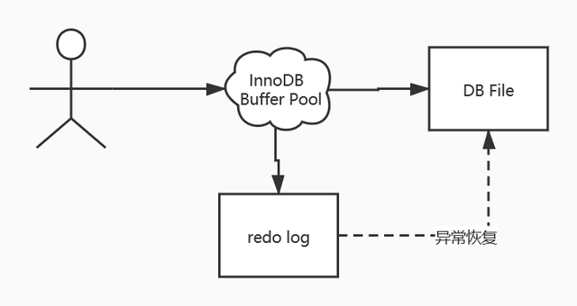

这个文件就是磁盘的 redo log（叫做重做日志），对应于/var/lib/mysql/目录下的 ib_logfile0 和 ib_logfile1，每个 48M。 这 种 日 志 和 磁 盘 配 合 的 整 个 过 程 ， 其 实 就 是 MySQL 里 的 WAL 技 术 （Write-Ahead Logging），它的关键点就是先写日志，再写磁盘。

```
show variables like 'innodb_log%';
```

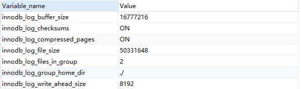


问题： 同样是写磁盘，为什么不直接写到 db file 里面去？为什么先写日志再写磁盘？

我们先来了解一下随机 I/O 和顺序 I/O 的概念。

磁盘的最小组成单元是扇区，通常是 512 个字节。

操作系统和内存打交道，最小的单位是页 Page。

操作系统和磁盘打交道，读写磁盘，最小的单位是块 Block。


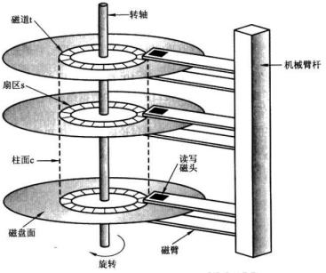

如果我们所需要的数据是随机分散在不同页的不同扇区中，那么找到相应的数据需要等到磁臂旋转到指定的页，然后盘片寻找到对应的扇区，才能找到我们所需要的一块数据，一次进行此过程直到找完所有数据，这个就是随机 IO，读取数据速度较慢。

假设我们已经找到了第一块数据，并且其他所需的数据就在这一块数据后边，那么就不需要重新寻址，可以依次拿到我们所需的数据，这个就叫顺序 IO。

刷盘是随机 I/O，而记录日志是顺序 I/O，顺序 I/O 效率更高。因此先把修改写入日 志，可以延迟刷盘时机，进而提升系统吞吐。 当然 redo log 也不是每一次都直接写入磁盘，在 Buffer Pool 里面有一块内存区域 （Log Buffer）专门用来保存即将要写入日志文件的数据，默认 16M，它一样可以节省 磁盘 IO。

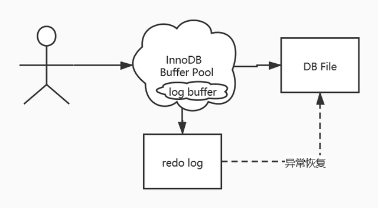

```
SHOW VARIABLES LIKE 'innodb_log_buffer_size';
```

需要注意：redo log 的内容主要是用于崩溃恢复。磁盘的数据文件，数据来自 buffer pool。redo log 写入磁盘，不是写入数据文件。

那么，Log Buffer 什么时候写入 log file？

在我们写入数据到磁盘的时候，操作系统本身是有缓存的。flush 就是把操作系统缓冲区写入到磁盘。

log buffer 写入磁盘的时机，由一个参数控制，默认是 1。

```
SHOW VARIABLES LIKE 'innodb_flush_log_at_trx_commit';
```

dev.mysql.com/doc/refman/5.7/en/innodb-parameters.html#sysvar_innodb_flush_log_at_trx_commit


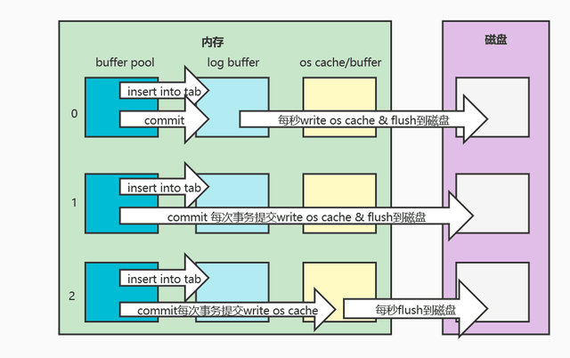

这是内存结构的第 4 块内容，redo log，它又分成内存和磁盘两部分。redo log 有 什么特点？

1、redo log 是 InnoDB 存储引擎实现的，并不是所有存储引擎都有。

2、不是记录数据页更新之后的状态，而是记录这个页做了什么改动，属于物理日志。

3、redo log 的大小是固定的，前面的内容会被覆盖。


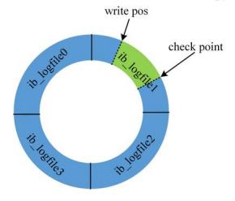

check point 是当前要覆盖的位置。如果 write pos 跟 check point 重叠，说明 redo log 已经写满，这时候需要同步 redo log 到磁盘中。

这是 MySQL 的内存结构，总结一下，分为： Buffer pool、change buffer、Adaptive Hash Index、 log buffer。

磁盘结构里面主要是各种各样的表空间，叫做 Table space。

- **磁盘结构**

  表空间可以看做是 InnoDB 存储引擎逻辑结构的最高层，所有的数据都存放在表空间中。InnoDB 的表空间分为 5 大类。

  **系统表空间 system tablespace**

  在默认情况下 InnoDB 存储引擎有一个共享表空间（对应文件/var/lib/mysql/ ibdata1），也叫系统表空间。 InnoDB 系统表空间包含 InnoDB 数据字典和双写缓冲区，Change Buffer 和 Undo Logs），如果没有指定 file-per-table，也包含用户创建的表和索引数据。

  1、undo 在后面介绍，因为有独立的表空间。

  2、数据字典：由内部系统表组成，存储表和索引的元数据（定义信息）。

  3、双写缓冲（InnoDB 的一大特性）：

  InnoDB 的页和操作系统的页大小不一致，InnoDB 页大小一般为 16K，操作系统页 大小为 4K，InnoDB 的页写入到磁盘时，一个页需要分 4 次写。

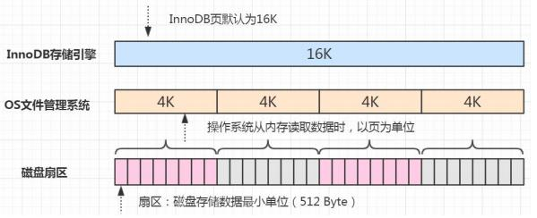

如果存储引擎正在写入页的数据到磁盘时发生了宕机，可能出现页只写了一部分的 情况，比如只写了 4K，就宕机了，这种情况叫做部分写失效（partial page write），可能会导致数据丢失。

```
show variables like 'innodb_doublewrite';
```

我们不是有 redo log 吗？但是有个问题，如果这个页本身已经损坏了，用它来做崩溃恢复是没有意义的。所以在对于应用 redo log 之前，需要一个页的副本。如果出现了 写入失效，就用页的副本来还原这个页，然后再应用 redo log。这个页的副本就是 double write，InnoDB 的双写技术。通过它实现了数据页的可靠性。

跟 redo log 一样，double write 由两部分组成，一部分是内存的 double write，一个部分是磁盘上的 double write。因为 double write 是顺序写入的，不会带来很大的 开销。

在默认情况下，所有的表共享一个系统表空间，这个文件会越来越大，而且它的空间不会收缩。

**独占表空间 file-per-table tablespaces**

我们可以让每张表独占一个表空间。这个开关通过 innodb_file_per_table 设置，默 认开启。

```
SHOW VARIABLES LIKE 'innodb_file_per_table';
```

开启后，则每张表会开辟一个表空间，这个文件就是数据目录下的 ibd 文件（例如 /var/lib/mysql/gupao/user_innodb.ibd），存放表的索引和数据。 但是其他类的数据，如回滚（undo）信息，插入缓冲索引页、系统事务信息，二次 写缓冲（Double write buffer）等还是存放在原来的共享表空间内。

**通用表空间 general tablespaces**

通用表空间也是一种共享的表空间，跟 ibdata1 类似。 可以创建一个通用的表空间，用来存储不同数据库的表，数据路径和文件可以自定 义。语法：

```
create tablespace ts2673 add datafile '/var/lib/mysql/ts2673.ibd' file_block_size=16K engine=innodb;
```

在创建表的时候可以指定表空间，用 ALTER 修改表空间可以转移表空间

```
create table t2673(id integer) tablespace ts2673;
```

不同表空间的数据是可以移动的。

删除表空间需要先删除里面的所有表：

```
drop table t2673;
drop tablespace ts2673;
```

**临时表空间 temporary tablespace**

存储临时表的数据，包括用户创建的临时表，和磁盘的内部临时表。对应数据目录 下的 ibtmp1 文件。当数据服务器正常关闭时，该表空间被删除，下次重新产生。 Redo log 磁盘结构里面的 redo log，在前面已经介绍过了。

**undo log tablespace**

dev.mysql.com/doc/refman/5.7/en/innodb-undo-tablespaces.html

dev.mysql.com/doc/refman/5.7/en/innodb-undo-logs.html

undo log（撤销日志或回滚日志）记录了事务发生之前的数据状态（不包括 select）。 如果修改数据时出现异常，可以用 undo log 来实现回滚操作（保持原子性）。 在执行 undo 的时候，仅仅是将数据从逻辑上恢复至事务之前的状态，而不是从物 理页面上操作实现的，属于逻辑格式的日志。 redo Log 和 undo Log 与事务密切相关，统称为事务日志。 undo Log 的数据默认在系统表空间 ibdata1 文件中，因为共享表空间不会自动收 缩，也可以单独创建一个 undo 表空间。

```
show global variables like '%undo%';
```

有了这些日志之后，我们来总结一下一个更新操作的流程，这是一个简化的过程。 name 原值是 qingshan。

```
update user set name = 'penyuyan' where id
```

1、事务开始，从内存或磁盘取到这条数据，返回给 Server 的执行器；

2、执行器修改这一行数据的值为 penyuyan；

3、记录 name=qingshan 到 undo log；

4、记录 name=penyuyan 到 redo log；

5、调用存储引擎接口，在内存（Buffer Pool）中修改 name=penyuyan；

6、事务提交。

内存和磁盘之间，工作着很多后台线程。

- **后台线程**

  后台线程的主要作用是负责刷新内存池中的数据和把修改的数据页刷新到磁盘。后 台线程分为：master thread，IO thread，purge thread，page cleaner thread。

  master thread 负责刷新缓存数据到磁盘并协调调度其它后台进程。

  IO thread 分为 insert buffer、log、read、write 进程。分别用来处理 insert buffer、 重做日志、读写请求的 IO 回调。

  purge thread 用来回收 undo 页。

  page cleaner thread 用来刷新脏页。

  除了 InnoDB 架构中的日志文件，MySQL 的 Server 层也有一个日志文件，叫做 binlog，它可以被所有的存储引擎使用。

- **Binlog**

dev.mysql.com/doc/refman/5.7/en/binary-log.html

binlog 以事件的形式记录了所有的 DDL 和 DML 语句（因为它记录的是操作而不是数据值，属于逻辑日志），可以用来做主从复制和数据恢复。

跟 redo log 不一样，它的文件内容是可以追加的，没有固定大小限制。

在开启了 binlog 功能的情况下，我们可以把 binlog 导出成 SQL 语句，把所有的操作重放一遍，来实现数据的恢复。

binlog 的另一个功能就是用来实现主从复制，它的原理就是从服务器读取主服务器的 binlog，然后执行一遍。 配置方式和主从复制的实现原理在 Mycat 第二节课中有讲述。 有了这两个日志之后，我们来看一下一条更新语句是怎么执行的：

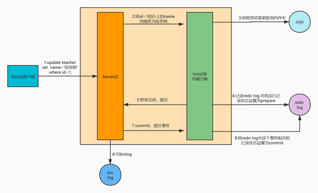

例如一条语句：update teacher set name='段老师' where id=1;

1、先查询到这条数据，如果有缓存，也会用到缓存。

2、把 name 改成'段老师，然后调用引擎的 API 接口，写入这一行数据到内存，同时 记录 redo log。这时 redo log 进入 prepare 状态，然后告诉执行器，执行完成了，可以随时提交。

3、执行器收到通知后记录 binlog，然后调用存储引擎接口，设置 redo log为 commit 状态。

4、更新完成。

这张图片的重点：

- 先记录到内存，再写日志文件。
- 记录 redo log 分为两个阶段。
- 存储引擎和 Server 记录不同的日志。
- 先记录 redo，再记录 binlog。