# MySQL文件系统

### 什么是文件系统

我们知道像 InnoDB、MyIASM 这样的存储引擎都是把表存储在磁盘上的（持久化）。当我们想读取数据的时候，这些存储引擎会从文件系统中把数据读出来返回给我们， 当我们想写入数据的时候，这些存储引擎会把这些数据又写回文件系统。

当然，MySQL除了存储实际的数据，还存储了一系列其他的日志，在这些也属于文件系统。

### 存储引擎的落盘文件地址

使用客户端与服务器建立连接之后查看这个系统变量的值就可以了：

show variables like 'datadir';

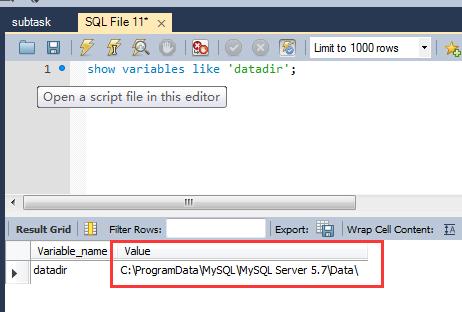

当然这个目录可以通过配置文件进行修改，由我们自己进行指定。

### 磁盘文件中的内容都是些什么

MySOL 在运行过程中都会产生哪些数据呢?当然会包含我们创建的数据库、 表、视图和触发器等用户数据，除了这些用户数据，为了程序更好的运行，MySQL也会创建一些其他的额外数据。

**数据库Date目录下的表信息**

每当我们使用 CREATE DATABASE 语句创建一个数据库的时候，在文件系统上实际发生了什么呢?其实很简单，每个数据库都对应数据目录下的一个子目录， 或者说对应一个文件夹，我们每当我们新建一个数据库时，MySQL 会帮我们做这两件事儿:

- 在数据目录下创建一个和数据库名同名的子目录（或者说是文件夹)。
- 在该与数据库名同名的子目录下创建一个名为 db.opt 的文件，这个文件 中包含了该数据库的各种属性，比方说该数据库的字符集和比较规则是个啥。 比方说我们查看一下在我的计算机上当前有哪些数据库︰

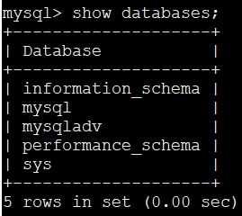

可以看到在当前有 5 个数据库，其中 mysqladv 数据库是我们自定义的，其余 4 个数据库是属于 MySQL 自带的系统数据库。我们再看一下数据目录下的内容:

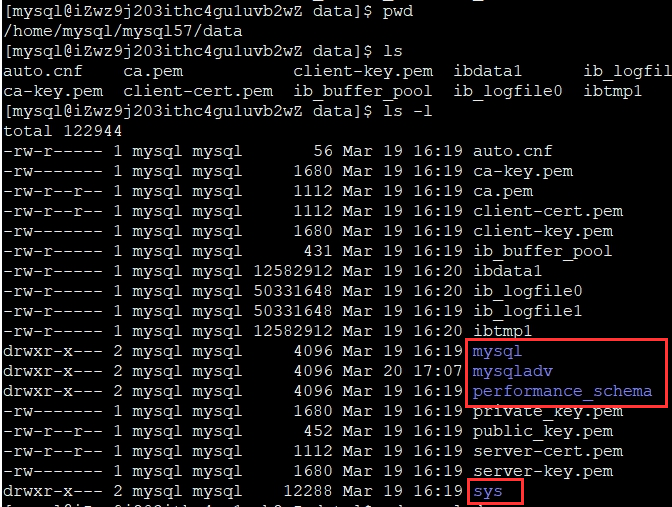

当然这个数据目录下的文件和子目录比较多，但是如果仔细看的话，除了 information_schema 这个系统数据库外，其他的数据库在数居目录下都有对应的 子目录。这个 information_schema 比较特殊，我们后面再讲它的作用。

### InnoDB是如何存储数据的

我们的InnoDB在添加一个数据库，就会在日志根目录中添加一个文件夹。

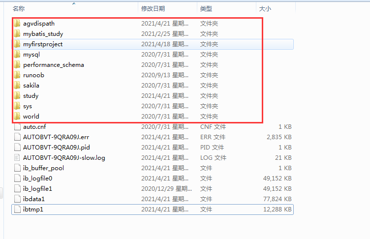

每一个文件夹中又存储对应的所有表数据。每一个表的数据一般根据以下两种规则进行划分：

**表结构的定义**

我们以自己建立的study库中的index_condition_pushdown表为例：

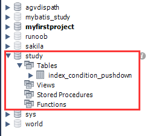

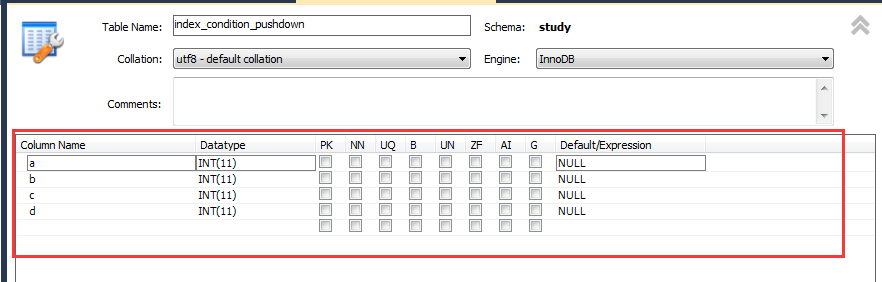

表结构就是这些数据，对应存储的文件名为：

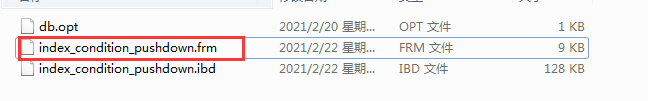

表结构就是该表的名称是啥，表里边有多少列，每个列的数据类型是啥，有啥约束条件和索引，用的是啥字符集和比较规则各种信息，这些信息都体现在了 我们的建表语句中了。为了保存这些信息，InnoDB 和 MyIASM 这两种存储引擎 都在数据目录下对应的数据库子目录下创建了一个专门用于描述表结构的文件， 文件名是这样:表名.frm

**表中的数据**

表所属数据库对应的子目录下创建一个表示该独立表空间的文件，文件名和表名相同，只不过添加了一个.ibd 的扩展名而已，所以完整的文件名称长这样:表名.ibd。

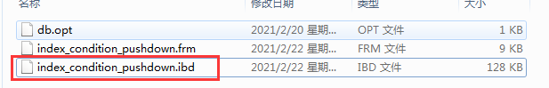

### MyISAM是如何存储表数据的

在 MyISAM 中的数据和索引是分开存放的。所以在文件系统中也是使用不同的文件来存储数据文件和索引文件。（相比于InnoDB中，ibd文件存储了数据+索引，MyISAM再次进行了拆分）。

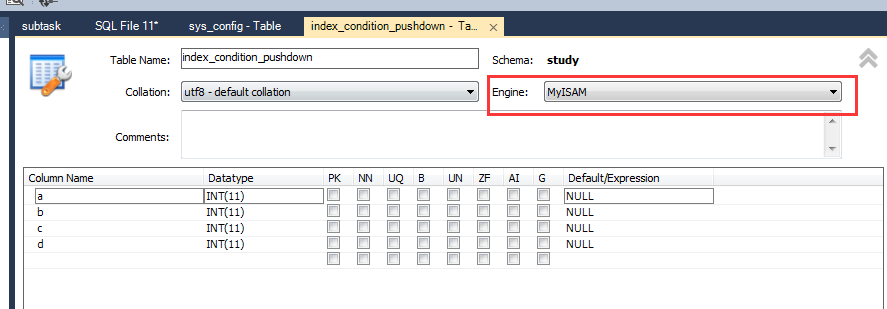

如图，我们更换存储引擎。

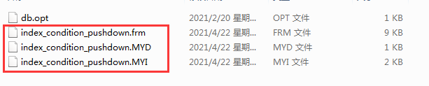

文件目录更换为了上图。可以简单理解为将InnoDB的.ibd文件进行了拆分，变为了以下两个文件》

.MYD 代表表的数据文件。

.MYI 代表表的索引文件。

这里，也就总结除了InnoDB和MyISAM的一个重要区别。就是InnoDB的索引和数据都在一个文件夹中，而MyISAM则是将数据文件和索引文件分开存放在两个文件中的。

### 日志文件

在服务器运行过程中，会产生各种各样的日志，比如常规的查询日志、错误日志、binlog日志、redo 日志、Undo 日志等等，日志文件记录了影响 MySQL 数据库的各种类型活动。 常见的日志文件有：错误日志（error log）、慢查询日志（slow query log）、 查询日志（query log）、二进制文件（bin log）。

**错误日志**

错误日志文件对 MySQL 的启动、运行、关闭过程进行了记录。遇到问题时 应该首先查看该文件以便定位问题。该文件不仅记录了所有的错误信息，也记录一些警告信息或正确的信息用户可以通过下面命令来查看错误日志文件的位置：

**show variables like 'log_error'\G;**

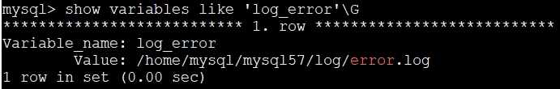

当 MySQL 不能正常启动时，第一个必须查找的文件应该就是错误日志文件， 该文件记录了错误信息。

**慢查询日志**

慢查询日志可以帮助定位可能存在问题的 SQL 语句，从而进行 SQL 语句层面的优化。

**查询日志**

查询日志记录了所有对 MySQL 数据库请求的信息，无论这些请求是否得到了正确的执行。

默认文件名：主机名.log

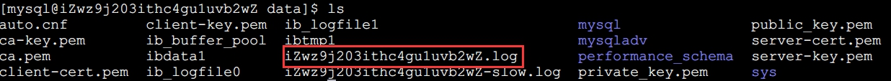

从 MySQL 5.1 开始，可以将查询日志的记录放入 mysql 架构下的 general_log表

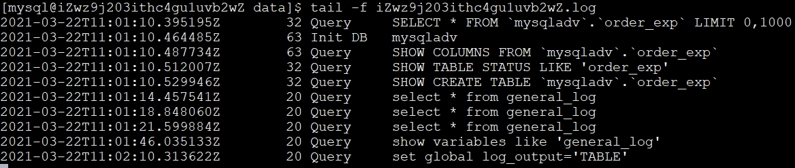

### 二进制日志（binlog）

二进制日志记录了对 MySQL 数据库执行更改的所有操作，若操作本身没有 导致数据库发生变化，该操作可能也会写入二进制文件。但是不包括 select 和 show 这类操作（因为这些操作对数据本身不会进行修改）

**binlog几种作用**

恢复（recovery）

某些数据的恢复需要二进制日志。

复制

其原理与恢复类似，通过复制和执行二进制日志使一 台远程的 MySQL 数据库（一般称为 slave 或 standby）与一台 MySQL 数据库（一 般称为 master 或 primary）进行实时同步。

审计（有点冷门，db负责）

用户可以通过二进制日志中的信息来进行审计，判断是否有对数据库进行注入的攻击。