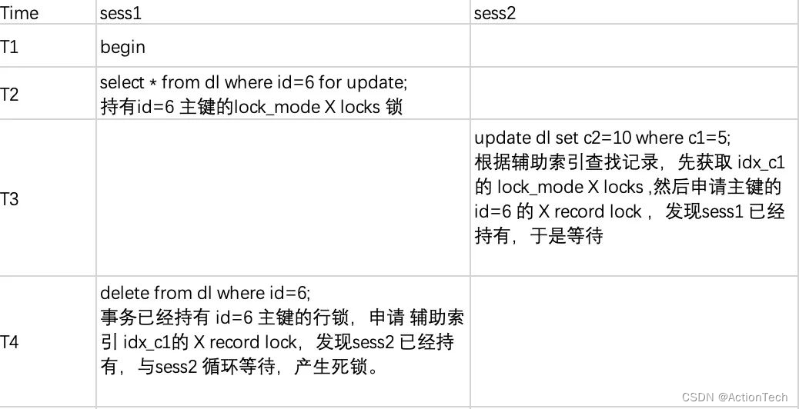

# MySQL死锁案例

## 通过辅助索引的更新同事通过主键删除导致的死锁


**业务逻辑**

select for update 表记录并加上 x 锁，查询数据，做业务逻辑处理，然后删除该记录。还有其他业务逻辑要更新记录，导致死锁。

**环境说明**

数据库 MySQL 8.0.30

事务隔离级别 REPEATABLE-READ


```sql
create table dl(
	id int auto_increment primary key,
	c1 int not null ,
	c2 int not null,
key idx_c1(c1));

insert into dl(c1,c2) values (3,1),(3,2),(3,2),(3,3),(4,4),(5,5);
```

**测试用例**



**死锁日志**

```mysql
------------------------
LATEST DETECTED DEADLOCK
------------------------
2022-12-03 16:43:59 140261132850944
*** (1) TRANSACTION:
TRANSACTION 1416764, ACTIVE 15 sec starting index read
mysql tables in use 1, locked 1
LOCK WAIT 5 lock struct(s), heap size 1128, 3 row lock(s)
MySQL thread id 15, OS thread handle 140261086668544, query id 283 localhost msandbox updating
update dl set c2=10 where c1=5

*** (1) HOLDS THE LOCK(S):
RECORD LOCKS space id 49 page no 5 n bits 80 index idx_c1 of table `test`.`dl` trx id 1416764 lock_mode X
Record lock, heap no 8 PHYSICAL RECORD: n_fields 2; compact format; info bits 0

*** (1) WAITING FOR THIS LOCK TO BE GRANTED:
RECORD LOCKS space id 49 page no 4 n bits 80 index PRIMARY of table `test`.`dl` trx id 1416764 lock_mode X locks rec but not gap waiting
Record lock, heap no 7 PHYSICAL RECORD: n_fields 5; compact format; info bits 32

*** (2) TRANSACTION:
TRANSACTION 1416759, ACTIVE 23 sec updating or deleting
mysql tables in use 1, locked 1
LOCK WAIT 3 lock struct(s), heap size 1128, 2 row lock(s), undo log entries 1
MySQL thread id 16, OS thread handle 140261085611776, query id 286 localhost msandbox updating
delete from dl where id=6

*** (2) HOLDS THE LOCK(S):
RECORD LOCKS space id 49 page no 4 n bits 80 index PRIMARY of table `test`.`dl` trx id 1416759 lock_mode X locks rec but not gap
Record lock, heap no 7 PHYSICAL RECORD: n_fields 5; compact format; info bits 32


*** (2) WAITING FOR THIS LOCK TO BE GRANTED:
RECORD LOCKS space id 49 page no 5 n bits 80 index idx_c1 of table `test`.`dl` trx id 1416759 lock_mode X locks rec but not gap waiting
Record lock, heap no 8 PHYSICAL RECORD: n_fields 2; compact format; info bits 0

*** WE ROLL BACK TRANSACTION (2)
```

 **死锁分析**

sess1 开启一个事务，在T2 时刻执行 select for update，持有id=6的lock_mode X record lock.

sess2 在T3 时刻执行根据c1=5的更新，但是其加锁顺序是先在索引idx_c1上加锁，顺利加锁，然后到申请加主键上加id=6的锁，发现sess1已经持有主键 id=6 的X的锁，因此需要等待。如日志中 (1) TRANSACTION: 中 WAITING FOR的提示

> RECORD LOCKS space id 49 page no 4 n bits 80 index PRIMARY of table test.dl trx id 1416764 lock_mode X locks rec but not gap waiting

sess1 执行 delete id=6 的操作，由于事务本身已经持有了主键上的锁，删除记录同时要对索引idx_c1上的记录加上 lock_mode X record lock，发现该锁已经被sess2持有，形成了死锁条件，sess1 报错，发生回滚。

**如何解决**

本文中死锁的原因是因为 sess2 通过辅助索引进行更新，因此推荐的避免死锁方案是**把sess2 使用辅助索引的更新改成基于主键进行更新**，从而避免申请`idx_c1上`的加锁造成循环等待产生死锁。

**小结**

敲黑板 ，重点: 死锁是因为不同事务对表记录加锁的顺序不一致导致相互等待对方持有的锁导致的。大家在分析死锁的时候能基于该原则去分析理清业务的sql 逻辑，基本上都能解决大部分的问题场景。

另外文章的最后我们再次复习一下 MySQL 的加几个基本原则，方便大家后面遇到死锁案例进行分析:

```
原则 1：加锁的基本单位是 next-key lock。

原则 2：查找过程中访问到的对象才会加锁。

优化 1：索引上的等值查询，给唯一索引加锁的时候，next-key lock 退化为行锁。

优化 2：索引上的等值查询，向右遍历时且最后一个值不满足等值条件的时候，next-key lock 退化为间隙锁。

一个 bug：唯一索引上的范围查询会访问到不满足条件的第一个值为止。
```

**在读提交隔离级别下还有一个优化，即：语句执行过程中加上的行锁，在语句执行完成后，就要把“不满足条件的行”上的行锁直接释放了，不需要等到事务提交**

通过辅助索引更新是会边扫描边对辅助索引行加X锁及间隙加GAP锁，然后再根据辅助索引里的主键信息去扫描聚簇索引对**主键行依次加X锁；**