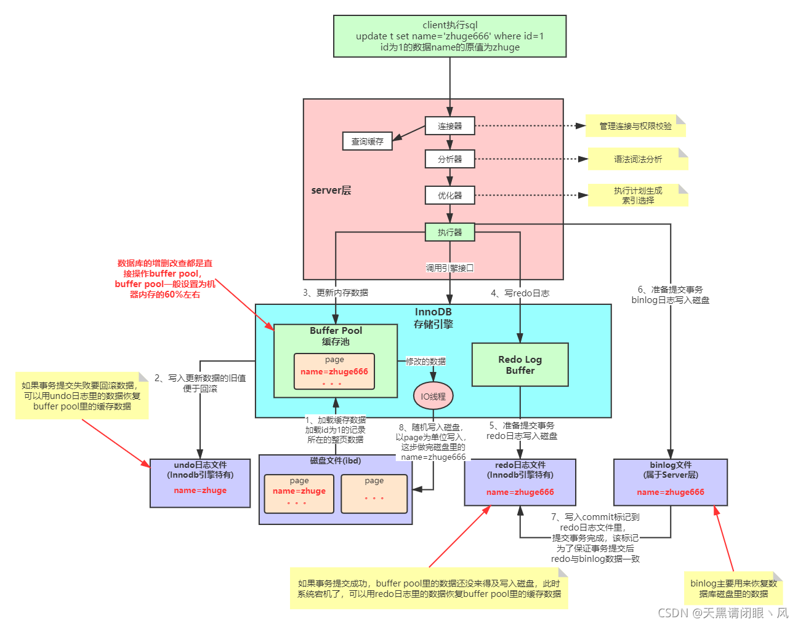
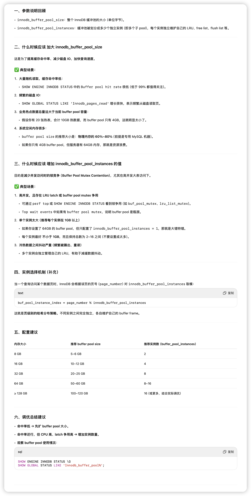

## Bufferpool内部流程



### 1.加载数据到缓冲池

#### 默认情况：按需加载（懒加载）

InnoDB 的设计理念是节省内存资源，在 **没有查询访问时，不会主动加载数据页**。也就是说：

- **只有在发生对某一数据页的访问**（例如 SELECT、UPDATE）时，InnoDB 才会检查该页是否在 Buffer Pool 中：
  - **如果在**：直接使用。
  - **如果不在**：从磁盘读取该页，**加载到 Buffer Pool 中**（整个页单位，默认 16KB）。


#### 启动阶段：预热机制（Buffer Pool Warmup）

虽然默认是按需加载，但 InnoDB 支持**Buffer Pool 预热（preload）机制**，通过**人工设置**可以在重启后恢复之前的热数据页状态。

**关键参数和文件**：

- innodb_buffer_pool_dump_at_shutdown=ON：关闭 MySQL 时，**将当前缓冲池中的热页元信息（page id 等）dump 到本地文件中**；
- innodb_buffer_pool_load_at_startup=ON：启动 MySQL 时，**从 dump 文件中加载这些页**；
- 默认的 dump 文件位置：<datadir>/ib_buffer_pool

**注意：**

- **不是加载完整的数据页内容**，而是加载元信息，根据这些信息再去磁盘预加载页；
- 加载过程是异步的，不影响正常服务启动；
- 可以通过手动命令 SET GLOBAL innodb_buffer_pool_dump_now=ON; 触发 dump。


#### 除此之外：还有一种间接的预热方式

通过在 **系统启动脚本中预跑常用 SQL**，以此“人工触发”那些热页进入 Buffer Pool，也是一种比较常见的手段。


### 2、3、4、5、6、7都在另一篇文档里


### 8.刷盘机制

| **刷新时机**                         | **说明**                   |
| ------------------------------------ | -------------------------- |
| **主线程周期性刷新**                 | 默认每秒刷新一定数量脏页   |
| **刷脏页数量超过阈值**               | 为了避免新页无法加载       |
| **Buffer Pool 被淘汰时**             | 替换出去的脏页会被写回磁盘 |
| **后台线程异步刷新（page cleaner）** | 专门负责刷脏页             |


## LRU-K队列

```
+--------------------------+-----------------------+
|        Young 区域         |     Old 区域          |
|     (热数据/高频数据)       |   (新加载/待淘汰数据)   |
+--------------------------+-----------------------+
^                          ^                       ^
LRU尾                   midpoint               LRU头
```

InnoDB 的 LRU 是**一个改进版的 LRU 算法**，它将整个 LRU 列表划分为两个区域：

- **LRU 头部（新页插入的位置）**：最近使用的数据页插在这里，但不是直接插入最前端（见下一点）。
- **midpoint**：划分 old/young 的临界位置，通常是整个列表的前 5/8 左右。
- **LRU 尾部（淘汰位置）**：最久未使用的页从这里被淘汰。

默认情况下，一个数据页从磁盘加载进 Buffer Pool 时，不是直接插入到 **LRU 的头部**，而是**插入到 midpoint 之后（也就是 old 区域）**，这样做是为了防止**大表扫描污染缓冲池**。


**比如说整个链表长度是 1000 页，那前 3/8（375 页）属于 old 段，后 5/8（625 页）属于 young 段。这个比例是通过参数 innodb_old_blocks_pct 控制的（默认是 37）。**


### **页（page）的生命周期流程：**

1. **首次加载页时**：

   - **不是放在 LRU 尾部**（即 Young 段），
   - 而是放在 **Old 段的尾部**（也就是整个链表的中间位置）。
   - 目的：防止一次性全表扫描把所有热点页挤掉。

2. **一段时间后再次访问该页**（注意，有一个“冷却时间”限制）：

   - 如果满足冷却条件，页会被**提升到 LRU 的尾部**（即 Young 段尾部）。

   - 进入热点区，访问频繁的数据会一直保留在 Young 段。

   - 这个冷却时间由参数控制：

   - ```
     innodb_old_blocks_time = 1000  # 单位毫秒，默认是 1000ms
     ```

   - 也就是说，页进入 old 段之后，如果在 1 秒内再次访问，是**不被移动到尾部的**。

3. **之后没有访问**：

   - 页不会再往 Young 段尾部挪动。

   - 随着新的页不断加入（每个新页会插入到 old 段尾部），

     当前页会**逐渐从 Young 尾部 → Young 中部 → Young 头部 → Old 段尾部 → Old 段中部 → Old 段头部**。

   - 当达到 LRU 长度限制时，**最前面的页（Old 段头部）被淘汰**，也就是你说的“被消灭掉”。


## Bufferpool内存大小、实例数量调优

