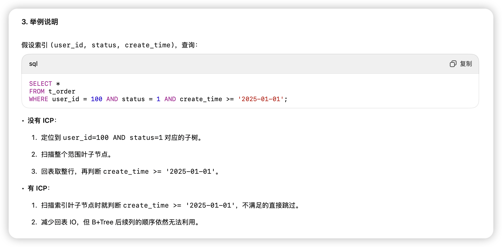
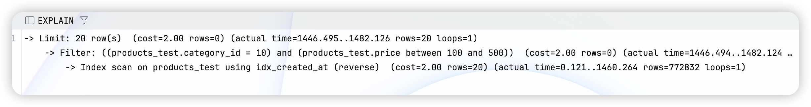
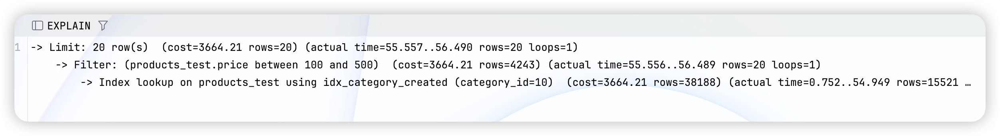
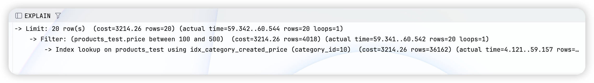
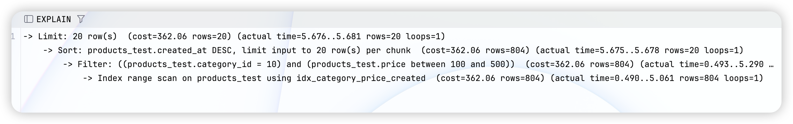

### **高频索引优化场景**：

在一张电商订单表 orders 上有如下索引：

```
CREATE INDEX idx_user_status_created
ON orders(user_id, status, created_at);
```

下面有一个查询：

```
SELECT * FROM orders
WHERE status = 1 AND created_at > '2024-01-01';
```

请问：

1. 这个查询能否用到 idx_user_status_created 索引？
2. 为什么可能会发生索引失效？
3. 如果要优化，你会怎么做？


#### 回答

1. 是否能用上 idx_user_status_created

- 索引定义顺序是 (user_id, status, created_at)
- MySQL 使用索引必须满足 **最左前缀原则**
- 查询条件是 status = 1 AND created_at > '2024-01-01'，**缺失了 user_id**
- 所以这个查询 **无法有效利用组合索引**，只能退化成 **全表扫描** 或者只用 status 的索引选择性很差，基本等于没用


2. 为什么可能会发生索引失效

- **原因 1：最左前缀原则** → 必须从索引的第一个字段开始才能利用
- **原因 2：范围查询截断原则** → 一旦遇到范围条件（>、<、BETWEEN、LIKE 'xx%'），后面的列无法继续利用索引排序和筛选


**3. 优化方式**

**根据查询场景重建索引**

```
CREATE INDEX idx_status_created ON orders(status, created_at);
```

- 这样 status 精确匹配 + created_at 范围查询 → 可以走索引
- 如果 select 的字段能被覆盖（比如只查 id、created_at），还能形成 **覆盖索引**，避免回表

**业务层面优化**

- 如果常常以 status + created_at 维度查询，可以考虑冷热数据分表
- 或者增加冗余索引，提升查询速度，代价是写入性能变差

一句面试官喜欢的总结：

> 当前索引设计只适合 (user_id, status, created_at) 的联合条件查询，不包含 user_id 时就失效。应根据实际查询模式调整索引列顺序，或者额外创建 (status, created_at) 索引。


好 👍，我来直接帮你梳理 **第十二题：为什么 SELECT COUNT(\*) 在 InnoDB 下会很慢，以及优化方法**。


------


### **为什么 SELECT COUNT(\*) 在 InnoDB 下会很慢，以及优化方法**


- **MyISAM 引擎**：表有一个计数器，能直接返回总行数，所以 COUNT(*) 很快。

- **InnoDB 引擎**：没有全表行数计数器，因为它要保证事务一致性（MVCC），

  - InnoDB 必须逐行扫描（遍历索引 B+Tree 或表数据）
  - 然后根据事务隔离级别判断这行是否对当前事务“可见”
  - 所以性能相对较慢，尤其是大表。

  

#### 回答

**方法一：使用更小的索引**

- COUNT(*) 会选择最小的索引树来遍历
- 如果表上有一个 **很小的二级索引**（比如只有一个 tinyint 列），比遍历聚簇索引快很多

```
SELECT COUNT(*) FROM orders FORCE INDEX(idx_small_col);
```


**方法二：近似统计**

- 如果业务允许用近似值（比如展示页面数量），可以用 **information_schema.tables** 里的 TABLE_ROWS 统计值（非实时，估算）

```
SELECT table_rows 
FROM information_schema.tables 
WHERE table_name = 'orders' AND table_schema = 'mydb';
```


**方法三：额外维护计数表**

- 在应用层或触发器里，维护一个单独的 counter 表来保存行数
- 插入/删除时更新计数，SELECT 时直接读这个计数表 → O(1)


**方法四：分区计数 / 缓存**

- 对于大表，可以按业务维度（比如日期、用户）分区计数
- 或者用 Redis 缓存计数结果，周期性异步刷新


总结

> InnoDB 为了保证事务隔离，没有维护行数计数器，所以 COUNT(*) 必须逐行扫描。优化思路包括：利用最小索引加速、使用近似值、应用层冗余计数，或者缓存结果。具体方案要结合业务是否要求实时精准。


### InnoDB 为什么建议自增主键？用 UUID 做主键会有什么问题？


#### 回答

**1为什么推荐自增主键？**

- **聚簇索引特性**：

  InnoDB 的表数据就是存储在 **聚簇索引（Primary Key B+Tree）** 的叶子节点上。

- **自增主键好处**：

  1. 插入数据时新记录总是追加在索引的末尾 → 避免频繁的 **页分裂、碎片化**
  2. 保证索引有序，减少随机 IO，插入性能高
  3. 查询时，ORDER BY id 可以直接利用索引排序

  

**UUID 做主键的问题**

- **随机性强**：每次插入会“打乱”B+Tree 的顺序，导致频繁的 **页分裂、内存碎片**，严重影响性能
- **存储空间大**：UUID 一般是 36 字符串（或者 16 字节二进制），比 BIGINT(8字节) 要大得多
- **索引膨胀**：主键在 InnoDB 中是聚簇索引，二级索引会引用主键值 → 所有二级索引都变大
- **排序没意义**：UUID 无法直接表示插入顺序，业务查询和分页也会更复杂


**雪花算法 ID（Snowflake ID）优点**

- **有序递增性**：高位是时间戳 → 保证整体趋势递增，避免 UUID 的完全随机性
- **分布式唯一性**：中间几位可以放机器 ID、数据中心 ID
- **性能平衡**：既不会暴露全局自增 ID 的规律，又能避免随机 UUID 带来的碎片化问题


**面试总结版回答**

> InnoDB 推荐自增主键，因为它能保证聚簇索引按顺序插入，避免页分裂和随机 IO，同时天然支持按照插入顺序排序。

> 如果用 UUID 作为主键，会导致索引无序、碎片严重、存储和索引开销大，不适合高并发插入场景。

> 实际业务中，如果担心自增 ID 暴露规律，可以用雪花算法 ID，它在保持全局唯一的同时，仍具备趋势递增性，性能和安全性更均衡。


### **MySQL 为什么需要两阶段提交（redo log + binlog）？单独用其中一个不行吗？**


#### 回答


**redo log 和 binlog 的区别**

- **redo log**（InnoDB 特有，物理日志）：

  - 记录 **数据页的物理修改**（偏移量、数据块变更）
  - 用于 **崩溃恢复**（Crash Recovery），保证事务的 **持久性**

  

- **binlog**（Server 层，全局逻辑日志）：

  - 记录 **数据变更的逻辑操作**（比如 INSERT INTO …）
  - 用于 **主从复制**、数据恢复（Point-in-Time Recovery）

  

**为什么需要两阶段提交**

- 如果只有 **redo log**：崩溃后可以恢复本地一致性，但主从复制就没法保证一致
- 如果只有 **binlog**：能保证主从一致，但本地可能崩溃丢失数据，事务不具备持久性
- 因此必须要保证 **两份日志的数据一致性**


**两阶段提交过程**

1. **写入 redo log（prepare 状态）**

   - 表示事务已经执行完，但未提交

   

2. **写入 binlog**

   - 记录逻辑操作，保证能同步给从库

   

3. **提交 redo log（commit 状态）**

   - 标记事务完成，保证本地持久化

   

这样就能保证：

- 如果 binlog 已写入但崩溃 → redo log 还在 prepare 状态，重启时补 commit，保证一致
- 如果 redo log 已写 prepare 但 binlog 没写成功 → 重启时回滚事务，不影响主从一致


**面试官喜欢的总结**

> redo log 保证 **事务持久性**，binlog 保证 **主从一致性**。

> 两者必须保持一致，否则会出现 **主库和从库数据不一致**。

> 因此 MySQL 使用 **两阶段提交**：先写 redo log（prepare），再写 binlog，最后提交 redo log，确保二者原子性。


### 你怎么分析一条 SQL 为什么慢？EXPLAIN 输出里最重要的字段有哪些？


#### 回答

**type —— 访问类型（最重要指标）**

- 反映了 MySQL 查询使用索引的程度

- 常见值（从好到坏）：

  - system > const > eq_ref > ref > range > index > ALL
  - **重点：ALL 表示全表扫描 → 一般是性能问题**

  

**key —— 实际用到的索引**

- 显示优化器选择的索引
- 如果是 NULL，说明没用上索引 → 需要关注


**key_len —— 索引使用的字节数**

- 可以判断联合索引是否被完整利用
- 如果只用了一部分字段，说明可能没有触发最优索引


**Extra —— 额外信息**

- 常见信息：

  - Using index → 覆盖索引（好事）
  - Using where → 需要通过 where 条件过滤
  - Using temporary → 用到了临时表（可能影响性能）
  - Using filesort → 排序无法用索引完成，需要额外排序

  

**其他辅助字段（面试加分点）**

- rows → 预估扫描的行数（越少越好）
- filtered → 过滤后剩下的行数比例，配合 rows 估算实际扫描代价


**面试总结版回答**

> 我会先看 type，它能快速判断是否全表扫描。

> 再看 key 和 key_len，确认优化器是否用上了正确的索引，是否用全了联合索引。

> 最后看 Extra，关注是否出现临时表和文件排序，这往往是 SQL 性能瓶颈的来源。

> 辅助会看 rows 和 filtered 来预估扫描代价。


### 为什么有时候明明建了索引，但 MySQL 执行计划却没有使用？


#### 回答


1. **最左前缀原则没遵守**

   - 复合索引必须从最左边字段开始连续匹配，否则优化器不会使用

   

2. **索引字段被函数/计算包裹**

   - 例如：WHERE DATE(create_time) = '2025-08-20'
   - 优化器无法直接利用索引，需要改写成范围：WHERE create_time >= '2025-08-20 00:00:00' AND create_time < '2025-08-21 00:00:00'

   

3. **范围查询截断**

   - 复合索引 (a, b, c)，如果 a=1 AND b>10，那么 c 就无法利用

   

4. **排序方向不一致**

   - 索引 (create_time ASC, id ASC)，如果 SQL 用 ORDER BY create_time ASC, id DESC → 不能完全利用索引，需要 filesort

   

5. **选择性太差**

   - 比如 status 字段取值只有 0/1，区分度太低
   - 优化器可能判断走索引反而更慢，直接选择全表扫描

   

6. **隐式类型转换**

   - WHERE phone = 12345，而 phone 列是 VARCHAR，会发生类型转换，索引失效
   - 正确写法：WHERE phone = '12345'

   

7. **LIKE 前缀模糊匹配**

   - LIKE '%abc' → 无法走索引
   - LIKE 'abc%' → 可以利用索引

   

**面试总结版回答**

> 索引不生效的常见原因有：

- > 复合索引没遵循最左前缀原则

- > 对索引列做了函数或运算

- > 范围查询导致后续字段无法利用

- > 排序方向和索引不一致

- > 索引字段选择性差，优化器可能放弃索引

- > 隐式类型转换、前缀模糊匹配也会让索引失效

  > 一般要结合 EXPLAIN 看执行计划，确认问题点，然后通过改写 SQL 或调整索引来优化。


### **InnoDB 死锁处理机制**


#### 回答


1. **死锁检测**

   - InnoDB 内部维护了一张 **等待图 (wait-for graph)**。
   - 每当一个事务等待另一个事务持有的锁时，都会在图里加一条边。
   - 如果形成了环路，就意味着出现了死锁。

   

2. **回滚的选择**

   - **不会两个都回滚**，只会选择其中一个事务回滚。
   - InnoDB 会选一个 **“代价最小”的事务** 回滚，主要依据是：
     - 哪个事务持有的行锁数量更少。
     - 哪个事务执行的更新（undo log 长度）更少。
     - 如果代价相似，通常会回滚后进入等待的那个事务（即最近陷入等待的事务）。
   - 这样做的目标是：**让损失最小化，并尽快恢复并发执行。**

   

3. **被回滚的事务**

   - 被选中的事务会立即执行回滚操作。
   - 客户端收到错误信息：

   


```
ERROR 1213 (40001): Deadlock found when trying to get lock; try restarting transaction
```


- 另一个事务则继续执行，就像死锁没发生一样。

- **“代价最小”**并不是只看事务执行时间，而是综合考虑持有的锁数量、undo log 长度等。


结论一句话：

**InnoDB 检测到死锁后，会在等待图里选择一个“代价最小”的事务进行回滚，另一个事务继续执行，不会两个都回滚。**


### 开发中如何避免死锁


#### 回答


**死锁的典型场景**


**并发更新相反顺序的数据**

```
-- 事务 A
BEGIN;
UPDATE user SET balance = balance - 100 WHERE id = 1;
UPDATE user SET balance = balance + 100 WHERE id = 2;

-- 事务 B
BEGIN;
UPDATE user SET balance = balance - 50 WHERE id = 2;
UPDATE user SET balance = balance + 50 WHERE id = 1;
```

- A 先锁 id=1，再锁 id=2
- B 先锁 id=2，再锁 id=1
- 互相等待，死锁


**范围查询 + 插入**（间隙锁）

- 事务 A：SELECT … FOR UPDATE WHERE id > 10
- 事务 B：INSERT INTO … (id=11)
- A 拿了间隙锁，B 插入被阻塞，可能产生死锁


**怎么排查死锁**

查看最近死锁日志：

```
SHOW ENGINE INNODB STATUS\G
```

能看到死锁事务的 SQL、锁等待情况

MySQL 8.0+ 可以通过 Performance Schema 查询死锁信息：

```
SELECT * FROM performance_schema.data_locks;
SELECT * FROM performance_schema.data_lock_waits;
```


**怎么解决死锁**

1. **固定加锁顺序**

   - 所有事务访问资源时，按照相同顺序加锁，避免交叉等待

   

2. **缩小锁范围**

   - 用更精确的 where 条件，减少锁住的数据范围

   

3. **减少长事务**

   - 避免事务里执行过多 SQL 或等待用户输入

   

4. **合理使用索**

   - 避免因为索引缺失导致锁范围扩大（行锁退化为表锁）

   

5. **业务层面优化**

   - 例如转账操作统一设计成“先锁 ID 小的，再锁 ID 大的”

   

**面试总结版**

> 死锁产生的本质是多个事务之间的锁顺序不一致，导致互相等待。

> InnoDB 遇到死锁会自动检测，并选择一个事务回滚。

> 我们排查时可以通过 SHOW ENGINE INNODB STATUS 或 Performance Schema 查看死锁日志。

> 解决思路主要是统一加锁顺序、缩小锁范围、减少长事务、保证索引命中，从业务逻辑和 SQL 设计上避免死锁。


最常见的并发批量 update 造成死锁这个场景的核心点是：**UPDATE 本身不会让你手动“先拿谁的锁、再拿谁的锁”**。InnoDB 会按**执行计划选定的索引扫描顺序**去“边扫描边加锁”（记录锁/next-key 锁），因此**两条并发 UPDATE 如果用不同索引、不同扫描方向或锁定了重叠区间**，很容易形成环路 → 死锁。


**在同一访问路径/顺序下，命中了被占用的记录就“原地等待”**，不会越过去锁后面的记录

- 每当一个事务在等待锁时，InnoDB 会把“**T_wait 等待 T_hold**”这条边加入**等待图**。

- 如果加入新边后出现**环**（A→B→…→A），立即判定**死锁**：

  - 选择“代价较小”的事务为**牺牲者**（通常回滚量更小/持锁更少/行数更少的一方）。
  - 返回 ER_LOCK_DEADLOCK 给客户端，另一个事务得以继续。

  

- 可控开关：innodb_deadlock_detect = ON|OFF

  - **ON（默认）**：实时检测环，锁竞争高时有一定 CPU 开销。
  - **OFF**：不检测环，只靠 innodb_lock_wait_timeout 超时回滚；适合极端热点写入以降低检测成本（但遇死锁要等超时，体验差）。


⚠️⚠️⚠️⚠️⚠️具体怎么实现有以下几种方案⚠️⚠️⚠️⚠️⚠️


**一、最稳妥：先显式锁，再更新（两段式）**

**思路**：在一个事务里，用 SELECT ... FOR UPDATE 按**统一顺序（主键升序）把要改的行先锁住**，然后再执行 UPDATE。这样所有并发事务的加锁顺序完全一致，基本杜绝死锁。

```
-- 统一用主键顺序锁定目标行
START TRANSACTION;

SELECT id
FROM taba FORCE INDEX(PRIMARY)       -- 强制同一个索引
WHERE id BETWEEN ? AND ?
ORDER BY id                           -- 显式顺序
FOR UPDATE;                           -- 拿到行锁/next-key 锁

-- 再执行真正的更新（相同范围或用 IN 列表）
UPDATE taba
   SET col = ...
 WHERE id BETWEEN ? AND ?;

COMMIT;
```

要点：

- **FORCE INDEX(PRIMARY)**：强制所有并发语句都走同一棵索引（同一遍历顺序）。
- **ORDER BY id**：让加锁顺序统一为“从小到大”。（锁是在扫描时加的）
- **同一事务内**完成“锁定→更新”。

> 备注：MySQL 不允许在同一条 UPDATE 的子查询中对同表加 FOR UPDATE 来锁行，所以上面这种“先 SELECT 锁行，再 UPDATE”的“两段式”是最好用且清晰的。


**二、较稳：让 UPDATE 也按同一索引顺序扫描**

如果你不想分两条 SQL，也可以尽量让 **UPDATE 自己的扫描顺序一致**：

```
UPDATE /*+ SET_VAR(optimizer_switch='mrr=off,batched_key_access=off') */
       taba FORCE INDEX(PRIMARY)   -- 统一索引
SET col = ...
WHERE id BETWEEN ? AND ?;          -- 用主键范围，天然按主键升序扫描
```

要点：

- **统一索引**：FORCE INDEX(PRIMARY) 或指定与你的条件相匹配的唯一/主键索引，避免优化器有时走二级索引、有时回表，导致加锁路径不同。
- **主键范围谓词**：BETWEEN / >= / <= 在主键上，InnoDB 会按**升序**遍历叶子页并加锁。
- **避免 filesort/回表的随机访问**：某些优化器开关（如 mrr/BKA）可能改变访问顺序，遇到复杂计划可临时关闭，确保顺序性更强。（不是必须，但在极端场景有用）

> 注意：ORDER BY 在 UPDATE 中主要影响结果输出顺序，并不保证“加锁顺序”；**真正决定顺序的是使用的索引访问路径**，所以关键是“让所有并发 UPDATE 走同一索引、同一方向”。


**三、并行批处理：分片/跳过锁**

如果你的“两个批量 UPDATE”是为了并行加速，**避免重叠范围**是最有效的：

- **不重叠分片**：例如把 id 按区间或按哈希分片：

  - 线程1：id BETWEEN 1 AND 1_000_000
  - 线程2：id BETWEEN 1_000_001 AND 2_000_000

  

- **或使用 SKIP LOCKED**（8.0+）：让并发工作线程**自动避开已被锁的行**，减少互相等待与死锁：

```
START TRANSACTION;
-- 先拿一小批可更新的 id
SELECT id
FROM taba FORCE INDEX(PRIMARY)
WHERE cond ...
ORDER BY id
FOR UPDATE SKIP LOCKED
LIMIT 1000;

-- 再对这批做 UPDATE ... WHERE id IN (...)
COMMIT;
```


**四、减少 next-key/gap 锁，缩小锁冲突面**

- **用“等值命中唯一索引”** → 只加**记录锁**，不加间隙锁：

  WHERE pk = ? 或 WHERE unique_col = ?（且列上有唯一索引）。

  范围条件（BETWEEN、>、<）会触发 **next-key 锁**，更容易互锁。

- **隔离级别**：在**读已提交（READ COMMITTED）**下，间隙锁行为比**可重复读（RR）**少一些（但 UPDATE/SELECT ... FOR UPDATE 仍会加必要的间隙锁，别指望完全没有）。

- **尽量避免“同一范围被两个事务交错覆盖”**：例如一个改 [100,200]，另一个改 [150,250]，这很容易构成锁顺序相反的环。


**五、出现死锁时如何定位**

- SHOW ENGINE INNODB STATUS\G：看 **LATEST DETECTED DEADLOCK**，能看到**两边事务拿到了哪些锁、在等哪些锁、依赖链**。
- MySQL 8.0：performance_schema.data_locks / data_lock_waits，可查询正在持有/等待的锁明细（表、索引、键值/区间）。


**六、一个可复制的“安全批量更新”模板**

把它记到你的“并发更新”工具箱里：

```
-- Worker 统一模板：按主键升序，成批锁定后更新
START TRANSACTION;

-- 1) 先确定一批目标行，并按主键顺序锁住（避免不同顺序）
SELECT id
FROM taba FORCE INDEX(PRIMARY)
WHERE cond ...                 -- 你的业务条件
ORDER BY id
FOR UPDATE SKIP LOCKED         -- 并行时避免互锁
LIMIT 1000;

-- 拿到这批 id 后：
UPDATE taba
   SET col = ...
 WHERE id IN ( ... 这批id ... );

COMMIT;
```


### 什么是索引下推（ICP）


#### 回答




索引下探（Index Condition Pushdown, ICP）是什么？

- ICP 是 MySQL 5.6+ 引入的优化手段。

- 核心思想：**把部分 WHERE 条件下推到存储引擎层**，在遍历 B+Tree 时就先过滤掉不符合条件的行，而不是查到叶子节点再回表过滤。

- 优点：

  - 避免大量不必要的回表 IO。
  - 对范围查询尤其有用，因为可以在扫描索引叶子节点时直接过滤掉不满足条件的数据。

  

### 大表业务优化


公司有一张用户行为日志表 t_user_action，每天写入量上千万，表结构如下：

```
CREATE TABLE t_user_action (
    id BIGINT PRIMARY KEY AUTO_INCREMENT,
    user_id BIGINT NOT NULL,
    action_type TINYINT NOT NULL,
    action_time DATETIME NOT NULL,
    meta JSON,
    INDEX idx_user_action_time (user_id, action_time)
) ENGINE=InnoDB;
```

业务场景：

- 查询某个用户在最近 7 天的行为日志，按时间倒序排序，并分页展示；
- 偶尔统计某个行为类型在一定时间范围内的总数。


问题：

1. 查询最近 7 天行为日志为什么可能会很慢？
2. 在**索引优化**和**表结构优化**上，你有哪些方案？
3. 对大数据量日志表，还有哪些常用的性能优化手段？


#### 回答


**1. 为什么查询最近 7 天行为日志可能很慢？**

- 索引 (user_id, action_time) 确实能利用到，但：

  - user_id = 定值，能快速定位到分支；
  - action_time = 范围查询 + 倒序排序 → 索引只能保证升序扫描，倒序时可能触发 **Using filesort**；

  

- 如果分页很深（LIMIT 100000, 20 这种），还会导致扫描大量不必要的数据 → 性能进一步下降。


**2. 索引/表结构优化方案**

- **联合索引优化**

  - 建立 (user_id, action_time DESC) 或者 (user_id, action_time) 并利用覆盖索引（只查 id, action_time, action_type 等必要字段），可以避免回表和文件排序。

  

- **针对统计需求**

  - 建立 (action_type, action_time) 复合索引，加速区间统计。
  - 如果统计非常频繁，可以考虑 **汇总表/物化视图**，按天预聚合，查询直接走小表。

  


**3. 海量日志表的常见优化手段**

- **冷热数据分离**

  - 热表存近 30 天数据，冷表存历史归档数据（定期导出到 Hive/ClickHouse/ES 之类的分析系统）。

  

- **分区/分表**

  - 按时间分区（比如按月），使查询最近数据只扫少量分区。
  - 或按 user_id 分库分表，提升并发写入性能。

  

- **压缩与存储优化**

  - JSON 字段如果频繁查询，考虑 **拆字段** 或使用 **虚拟列 + 索引**。
  - 使用合适的存储引擎参数，比如 innodb_page_size、innodb_buffer_pool_size 调优。

  

- **写入优化**

  - 批量写入、异步写日志到大表，避免频繁单行 insert。

  


**面试官视角评价**

- 你已经指出了 **倒序 + 范围查询导致索引不完全利用**，这是加分点。
- 如果再补充一句 “分页过深也会拖慢性能，可以用 **延迟关联 / 书签式翻页** 优化” → 就更全面了。


### 深度分页场景


#### 回答


**深度分页优化的经典写法：基于“游标 / 书签翻页”**


1. **书签式翻页（基于索引字段）**

   

查询第一页：

```
SELECT * 
FROM user 
WHERE status = 1
ORDER BY id ASC
LIMIT 100;
```


查询第二页：

```
SELECT * 
FROM user 
WHERE status = 1 
  AND id > 上一页最大id
ORDER BY id ASC
LIMIT 100;
```


1. 

   - 特点：性能稳定，复杂度 **O(size)**，避免了 O(offset+size) 的扫描。

   

2. **延迟关联（适合覆盖索引场景）**

   - 先用覆盖索引快速定位 ID，再回表取完整数据：


```
SELECT u.* 
FROM user u 
JOIN (
    SELECT id 
    FROM user 
    WHERE status = 1 
    ORDER BY id ASC 
    LIMIT 100000, 100
) t ON u.id = t.id;
```


1. 

   - 优点：减少回表次数；适合需要随机跳页的场景。

   

2. **业务层优化**

   - 对于推送任务，根本不需要“第 999 页”这样的随机访问，**游标翻页**是最合适的。
   - 若确实需要大偏移量分页，可以考虑 **缓存结果 / ElasticSearch** 来替代数据库硬查。

   

**面试官听到的加分点**

- 你答到了 **“带上上一页最大 ID”** → 已经是标准答案。
- 如果再补一句 “这其实是 **keyset pagination**（基于主键或唯一索引），比传统 offset 更适合大数据分页”，会显得更专业。


### 在UUID 的情况下，怎么实现高效深度分页


#### 回答


**UUID 的特点**

- **无序 / 随机分布**：不像自增 ID，有天然的顺序性。
- **不可预测大小关系**：分页条件不能直接写 id > xxx 来获取后一页。


**可行方案**

**1.按时间字段排序分页（推荐）**

- 如果表里有 create_time 或 action_time，就用它来作为“游标”：

```
SELECT * 
FROM t_user 
WHERE create_time > '2025-08-01 10:00:00'
ORDER BY create_time ASC 
LIMIT 100;
```

- 下一页就把“上一页最后一条的 create_time”作为条件。
- 特点：时间字段天然有序，适合日志/用户注册表等大多数场景。


**2.基于 UUID 的索引 + 延迟关联**

- 如果必须用 UUID 分页，可以用子查询定位 UUID，再回表：

```
SELECT u.* 
FROM t_user u 
JOIN (
    SELECT id 
    FROM t_user 
    WHERE status = 1 
    ORDER BY id ASC 
    LIMIT 100, 100
) t ON u.id = t.id;
```

- 优点：避免一次性大范围回表。
- 缺点：仍然要扫描 offset 部分，**不适合特别深的分页**。


**3.业务层做“映射表”**

- 在写入时同时生成一个 **自增列 / 雪花 ID**，用于排序和分页，UUID 只做业务主键：

```
CREATE TABLE t_user (
    uuid CHAR(36) PRIMARY KEY,
    auto_id BIGINT AUTO_INCREMENT,
    ...
    INDEX idx_auto_id (auto_id)
);
```


- 查询时：

```
SELECT * 
FROM t_user 
WHERE auto_id > 上一页最后一条的auto_id
ORDER BY auto_id ASC
LIMIT 100;
```


- 这样既能保留 UUID 的唯一性，又能利用自增 ID 的分页优势。


面试官加分点

> “UUID 难以用作游标分页，所以实际落地一般会**增加一个顺序字段（自增ID/时间戳/雪花ID）来配合 UUID**，查询走这个顺序字段，而 UUID 只作为业务主键”，


### 主从复制延迟过大


**问题背景**

MySQL 的主从复制是通过 **binlog → relay log → SQL 线程重放** 来实现的。

常见问题：当主库压力大、binlog 量大、从库执行 SQL 速度跟不上时，就会出现 **主从延迟**，导致读从库的数据不一致。


#### 回答


**主从延迟原因**


1. **大事务**

   - 比如一次删除/更新上百万行，从库必须顺序执行 → 延迟明显。

   

2. **从库性能不足**

   - 从库 CPU/IO/内存差，执行 SQL 跟不上主库。

   

3. **单线程复制机制**（传统版本）

   - 从库 SQL 线程只能单线程顺序执行 binlog（虽然主库是并发写）。

   

4. **长 SQL / 慢 SQL**

   - 主库写入复杂 SQL，从库执行也慢。

   

5. **网络延迟**

   - 跨机房/跨地域传输 binlog，网络带宽或延迟过大。

   

**优化方案**


- 避免大事务：

```sql
DELETE FROM t WHERE create_time < '2025-01-01';
```


- → 改为小批量：

```
DELETE FROM t WHERE create_time < '2025-01-01' LIMIT 1000;
```


- 避免复杂 SQL（例如 UPDATE + JOIN + 子查询），改为简单批量处理。
- 避免主库写入过多无用 binlog（如批量 INSERT ... SELECT）。


**复制机制优化**

- **并行复制（多线程复制）**
  - MySQL 5.6 开始支持 **库级并行**，5.7 开始支持 **基于组提交的事务并行**，8.0 更智能。
  - 通过参数：

```
slave_parallel_workers=8
slave_parallel_type=LOGICAL_CLOCK
```

- 

  - 让从库同时执行多个事务，显著降低延迟。

  

- **半同步复制（Semi-sync）**

  - 主库提交事务时，至少等待一个从库写入 relay log 确认再返回。
  - 保证主从数据一致性，但会增加写延迟。

  

**架构层面优化**

- **读写分离时，避免强一致性要求的读走从库**
  - 例如用户下单后立即查订单 → 必须读主库。
- **热点业务用主库/缓存，冷数据用从库**。
- **跨机房复制 → 建议异步+本地读，避免长链路延迟**。


### JOIN 联查慢 SQL


有两张表：

- **订单表 orders**（千万级，字段：id, user_id, status, created_at...）
- **用户表 users**（百万级，字段：id, name, mobile, level...）


需求：查询 **过去 30 天内，所有下过单的“高级用户”** 的信息。SQL 写法大概是：

```
SELECT u.id, u.name, u.mobile
FROM users u
JOIN orders o ON u.id = o.user_id
WHERE u.level = 'VIP'
  AND o.created_at >= NOW() - INTERVAL 30 DAY;
```


但这条 SQL **执行非常慢**（几十秒甚至分钟级），请你分析一下：

1. 为什么这条 SQL 会这么慢？
2. 你会从哪些角度来优化它？


#### 回答


SQL 很慢：

```
SELECT u.id, u.name, u.mobile
FROM users u
JOIN orders o ON u.id = o.user_id
WHERE u.level = 'VIP'
  AND o.created_at >= NOW() - INTERVAL 30 DAY;
```


**为什么慢？**

1. **大表 Join，数据量级悬殊**

   - orders 是千万级，users 是百万级，如果没有合理索引，Join 会退化为 **嵌套循环（Nested Loop Join）**，扫描量爆炸。

   

2. **过滤条件没用上索引**

   - u.level = 'VIP' 如果没建索引，要全表扫描。
   - o.created_at >= NOW()-30 DAY 如果没索引，也会全表扫描。

   

3. **执行顺序不理想**

   - MySQL 优化器可能会先扫 orders（千万级），再去 users 里 Join。
   - 如果能先把 users 里 VIP 用户筛出来（比如 5w 条），再 Join，性能差距巨大。

   


**如何优化？**


**索引优化**

1. 给 users(level, id) 建联合索引

   - 能快速定位 VIP 用户，再 Join。
   - 如果只建 level 索引，可能 selectivity（选择性）不好，联合 id 能提高效率。

   

2. 给 orders(created_at, user_id) 建联合索引

   - 先按时间过滤，再通过 user_id Join，避免大范围扫描。


**SQL 改写**

**1.子查询改写** —— 先过滤 VIP 用户，再 Join

```
SELECT u.id, u.name, u.mobile
FROM (SELECT id, name, mobile FROM users WHERE level='VIP') u
JOIN orders o ON u.id = o.user_id
WHERE o.created_at >= NOW() - INTERVAL 30 DAY;
```

- 避免全表 Join，把 users 控制在较小结果集。


**2.半连接（EXISTS 替代 JOIN）**

```
SELECT u.id, u.name, u.mobile
FROM users u
WHERE u.level='VIP'
  AND EXISTS (
      SELECT 1 FROM orders o
      WHERE o.user_id = u.id
        AND o.created_at >= NOW() - INTERVAL 30 DAY
  );
```

- MySQL 在 EXISTS 场景下会更倾向于走索引。


**3.执行计划优化**

- 检查 EXPLAIN：

  - users 应该是 **ref/const** 级别访问（走索引 level+id）；
  - orders 应该是 **range**（按 created_at 过滤）。

  

- 如果仍然走错，可以用 **STRAIGHT_JOIN** 强制执行顺序：

```
SELECT STRAIGHT_JOIN u.id, u.name, u.mobile
FROM users u
JOIN orders o ON u.id = o.user_id
WHERE u.level = 'VIP'
  AND o.created_at >= NOW() - INTERVAL 30 DAY;
```


**4.架构层优化**

- 如果是核心高频查询，可以考虑：

  1. **冷热分表**：orders 按月分表（只查最近 30 天表）。
  2. **物化中间表**：每天离线计算 VIP 用户最近 30 天是否下过单，直接查中间表。
  3. **缓存**：Redis 记录 VIP 用户最近下单时间，避免大表 Join。

  


**总结答法（面试官加分）**

> 这条 SQL 慢主要是因为 **大表 Join + 缺乏合适索引 + 执行顺序不合理**。

> 我会从三个层面优化：

- > **索引层**：users(level,id)，orders(created_at,user_id)；

- > **SQL层**：改写为子查询 / EXISTS，避免全表 Join；

- > **架构层**：分表、物化视图、缓存，避免对千万级大表直接做 Join。


### 复杂查询优化


有一张 **商品表 products**（上千万数据量）：

```
products(id, category_id, price, stock, created_at, updated_at, ...)
```

常见的业务查询是：


查询某个分类下，价格在一定范围内的商品，并按价格升序分页

```sql
SELECT id, name, price 
FROM products 
WHERE category_id = ? 
  AND price BETWEEN ? AND ? 
ORDER BY price ASC 
LIMIT 20 OFFSET 100000;
```


查询最新上架的商品（按 created_at 排序）


**面试要求：**

请你分析：

1. 这种场景下，为什么分页会变得非常慢？
2. 你会如何设计索引来优化？
3. 如果业务一定会有 **深度分页**，你会如何改造 SQL 或者表结构，来提升性能？


#### 回答


**1. 为什么分页会非常慢？**

- LIMIT 20 OFFSET 100000 本质上是：**先扫描出 100020 行，再丢掉前 100000 行，只保留 20 行**。
- MySQL 在执行时会按索引（或全表）扫描，取出数据，再做排序，最后丢弃 offset 部分 → 导致大量无效扫描。
- 当 offset 特别大时（比如百万级），就会出现分页性能极差。


**2. 如何设计索引优化？**

**针对查询 1（分类 + 价格范围 + 排序）**

- 建立复合索引：

```
CREATE INDEX idx_category_price ON products(category_id, price);
```


- 好处：

  - category_id 精确匹配 → 索引快速过滤。
  - price 范围查询 + 排序 → 索引有序性直接满足，不需要额外 filesort。

  

**针对查询 2（最新上架的商品）**


- 建立索引：

```
CREATE INDEX idx_created_at ON products(created_at DESC);
```

- 好处：直接利用索引顺序，取最新 N 条，不需要扫描全表。


**3. 深度分页优化方案**

业务场景里如果 **必须要翻到深页数**，可以这样处理：

方案一：基于主键/索引的“延续查询”（推荐）


- 改写 SQL：

```
SELECT id, name, price
FROM products
WHERE category_id = ?
  AND price BETWEEN ? AND ?
  AND (price > ? OR (price = ? AND id > ?))   -- 上一页最后一条的游标
ORDER BY price ASC
LIMIT 20;
```

- 思路：不用 offset，而是用 **上一次的最后一个值作为游标**，类似“seek”分页。
- 优点：性能和页数无关，翻到 10 万页也很快。


**方案二：冷热数据分表**

- 大部分业务只会查最近的商品（如近 3 个月上架的）。
- 可以把商品表做冷热拆分：
  - **热表**：最近商品，频繁分页查询。
  - **冷表**：历史商品，很少被查。
- 查询时优先命中热表，减少扫描数据量。


**方案三：预计算或异步同步**

- 对一些大分页的场景（比如运营后台导出），可以先用定时任务将数据结果写入一张中间表，或异步导出。
- 避免直接用 offset 查询大表。


**总结给面试官的点**

- **分页慢的根因**：大 offset 导致大量无效扫描。
- **优化方向**：索引设计（复合索引避免 filesort）、改造 SQL（游标分页代替 offset）、业务架构（冷热表/预计算）。
- **一句话总结**：**索引只能解决前几页性能，真正的深度分页需要 SQL/业务层改造**。


### 哪个索引更高效


```sql
SELECT id, name, price

FROM products

WHERE category_id = ?

 AND price BETWEEN ? AND ?

ORDER BY created_at DESC;


--下面三种建立索引的方式，那种效率更高

--索引一：
CREATE INDEX idx_category_created 

ON products(category_id, created_at DESC);

--索引二：
CREATE INDEX idx_category_created_price 

ON products(category_id, created_at DESC, price);

--索引三：
CREATE INDEX idx_category_created_price 

ON products(category_id, price, created_at DESC);
```


#### 回答


**1. 索引一**

```
CREATE INDEX idx_category_created 
ON products(category_id, created_at DESC);
```


- **WHERE 条件**

  - category_id = ? 可以用到前导列。
  - price BETWEEN ? AND ? 用不到索引（price 不在索引里）。

  

- **ORDER BY created_at DESC**

  - 在 category_id 匹配后，可以直接利用 created_at 的排序。

  

- **整体效果**

  - 扫描到的行数可能很多，因为不能利用 price 过滤，只能回表再过滤。
  - **排序效率很高**，因为已经有 (category_id, created_at)。

  

👉 优点：排序零开销。

👉 缺点：范围过滤（price）只能靠回表做，扫描量大。


**2. 索引二**

```
CREATE INDEX idx_category_created_price 
ON products(category_id, created_at DESC, price);
```


- **WHERE 条件**

  - category_id = ? 命中。
  - 但是第二列是 created_at，所以 price BETWEEN **用不到索引范围**。

  

- **ORDER BY created_at DESC**

  - 仍然可以很好利用 (category_id, created_at)。

  

- **整体效果**

  - 实际上和索引一差不多：先按 (category_id, created_at) 定位，再回表过滤 price。
  - 第三列 price **几乎没作用**，除非 SQL 里 created_at 也加了范围过滤。

  

👉 本质上 = 索引一，效率差不多。


**3. 索引三**

```
CREATE INDEX idx_category_created_price 
ON products(category_id, price, created_at DESC);
```


- **WHERE 条件**

  - category_id = ? 命中。
  - price BETWEEN ? AND ? 可以直接利用 **第二列 price** 做范围扫描。

  

- **ORDER BY created_at DESC**

  - 在 MySQL 里，ORDER BY 能否利用索引有严格要求：

    必须在 **所有前导列都是等值匹配** 后，才可以继续用后续列的排序。

    这里 price 是范围条件（BETWEEN），所以 **created_at 的排序无法利用索引**。

  

- **整体效果**

  - 过滤效率很好（因为 (category_id, price) 直接缩小扫描范围）。
  - 但是 ORDER BY created_at DESC 需要额外排序（filesort）。

  

👉 优点：过滤效率更高（扫描量小）。

👉 缺点：需要排序（可能代价大）。


**📊 对比结论**

- **数据量大 & price 过滤效果好** → 索引三更优，因为能先大幅缩小范围，再排序。
- **数据量大 & 需要避免排序开销** → 索引一（或二）更优，因为能直接利用 (category_id, created_at) 排序，但过滤效果差。
- **索引二几乎没优势**，和索引一一样。


✅ 一般推荐：

- 如果 **price 选择性高**（过滤后结果集很小），**用索引三**；
- 如果 **price 选择性低**（结果集大，需要保证排序性能），**用索引一**。


#### 亲自尝试

```sql
CREATE TABLE products_test (
    id BIGINT AUTO_INCREMENT PRIMARY KEY,
    name VARCHAR(100) NOT NULL,
    price DECIMAL(10,2) NOT NULL,
    category_id INT NOT NULL,
    created_at TIMESTAMP DEFAULT CURRENT_TIMESTAMP,
    description TEXT,
    status TINYINT DEFAULT 1,
    INDEX idx_created_at (created_at)
);


-- 创建存储过程批量插入数据
DELIMITER $$
CREATE PROCEDURE InsertProducts(IN total_records INT)
BEGIN
    DECLARE i INT DEFAULT 1;
    DECLARE batch_size INT DEFAULT 1000;
    DECLARE current_batch INT DEFAULT 0;

    -- 关闭自动提交，提高插入性能
    SET autocommit = 0;

    WHILE i <= total_records DO
        INSERT INTO products_test (name, price, category_id, created_at) VALUES
        (CONCAT('Product_', i),
         ROUND(RAND() * 9999 + 1, 2),
         FLOOR(RAND() * 50) + 1,
         DATE_SUB(NOW(), INTERVAL FLOOR(RAND() * 365) DAY));

        SET i = i + 1;
        SET current_batch = current_batch + 1;

        -- 每1000条提交一次
        IF current_batch >= batch_size THEN
            COMMIT;
            SET current_batch = 0;
        END IF;
    END WHILE;

    COMMIT;
    SET autocommit = 1;
END$$
DELIMITER ;

-- 插入100万条数据
CALL InsertProducts(1000000);

-- 删除存储过程
DROP PROCEDURE InsertProducts;

```

```sql
-- 创建三种索引进行对比测试
-- 索引一：
CREATE INDEX idx_category_created 
ON products_test(category_id, created_at DESC);

-- 索引二：
CREATE INDEX idx_category_created_price 
ON products_test(category_id, created_at DESC, price);

-- 索引三：
CREATE INDEX idx_category_price_created 
ON products_test(category_id, price, created_at DESC);

select count(*) from products_test;

-- 测试查询
SELECT id, name, price
FROM products_test
WHERE category_id = 10
  AND price BETWEEN 100 AND 500
ORDER BY created_at DESC
LIMIT 20;

-- 查看执行计划
EXPLAIN analyze SELECT id, name, price
FROM products_test
WHERE category_id = 10
  AND price BETWEEN 100 AND 500
ORDER BY created_at DESC
LIMIT 20;
```


查询共计能查询出 804 条数据，这张表共计一百万条数据


##### 无索引




##### 索引一




##### 索引二




##### 索引三



事实证明，如果 WHERE category_id = 10 AND price BETWEEN 100 AND 500 通过这个查询条件筛选出来的数据已经很少量了，本次测试中表中共计一百万条数据，筛选条件仅查询出 804 条，那么索引三的优势极大。但是如果根据筛选条件筛出的数据量很大，那么索引一能有效避免 using filesort 或者即便有using filesort，排序的速度也很快。


下面把你这个典型形态

```
WHERE pid = 10
  AND ctime BETWEEN '2025-01-01' AND '2025-01-02'
ORDER BY price DESC
```

放在 **MySQL 8.0（InnoDB + B-Tree + 支持降序索引）** 的规则里，系统性梳理“范围 + 排序”下复合索引的利用逻辑，并给出各索引顺序的取舍策略。


**一、能否“用索引完成排序”的硬规则（最重要）**


1. **ORDER BY 想走索引，必须满足：**

   - ORDER BY 的列序列是某个索引的**前缀**（方向也要兼容；MySQL 8 支持 DESC 索引及混合方向）；
   - 在这些列**之前**用到的索引列，其查询谓词必须是**等值（= 或等值可枚举如常量 IN）**；
   - **一旦在某个索引列上出现“范围条件”（> < >= <= BETWEEN）**，那么**该列之后的列**就**不能再用于保证输出有序**（会“截断”排序能力），只能靠文件排序（Using filesort）。

   

2. **范围出现在 ORDER BY 之后**并不妨碍按索引输出有序：

   - 但意味着**访问路径无法在存取层就“用范围收窄”**，只能先按“能有序的前缀”扫描，再在服务器层做**后过滤**（Using where），可能多扫很多行。

   

3. **MySQL 8 的降序索引**：

   - 单列 DESC 与 ASC 在单列场景可以互相反向遍历满足排序；
   - **多列混合方向**时（如 ORDER BY a ASC, b DESC），只有当索引定义里方向**逐列匹配**时才可“用索引完成排序”。

   

**二、把你的几种索引顺序放进规则里推演**


1) **索引：(pid, ctime, price DESC)**

- 访问：pid = 10 等值 + ctime BETWEEN ... 范围 ⇒ 存取层能做**紧致范围扫描**。
- 排序：因为 **ctime 是范围**，**截断**，后面的 price **不能**再用于保证有序 ⇒ **Using filesort**。
- 适用：**时间窗口很小**、返回条数较多/无 LIMIT，排序的成本相对可控；同时可以把 SELECT 的列都放进索引做**覆盖**（少回表）。

> 这是你当前结论的来源：**范围导致后续列“用不上”来排序**，于是 filesort。当候选集很小，filesort 成本也小（很多时候就是内存里的快速排序/堆，未必落盘）。


2) **索引：(pid, price DESC, ctime)**

- 访问：pid = 10 等值，**没有范围在 ORDER BY price 之前**。
- 排序：ORDER BY price DESC **正好是索引前缀**，**可用索引直接有序输出**（**不需要 filesort**）。
- 过滤：ctime BETWEEN ... 在 **price 之后**，因此只能**后过滤**（Using where），可能需要**扫描 pid=10 的大量记录**直到筛出足够多满足时间窗口的行。
- 适用：
  - **有小 LIMIT**（如“取前 N 个最高价”），可**边扫边过滤边提前停止**，非常划算；
  - 时间窗口**可能较宽**、但你只要 top-N；
  - 反之若 pid=10 下数据量大、且**无 LIMIT**或窗口很窄，则可能多扫很多“无效行”。

> 这是“**排序优先**”的建模：**避免 filesort**，以**后过滤**换取**早停**（对小 LIMIT 非常友好）。


3) **索引：(pid, ctime) + 另建 (pid, price DESC)**

- 优化器会在两者之间做成本选择：

  

  - 没有 LIMIT / 窗口小 ⇒ 多半选 (pid, ctime) 的**紧致范围** + filesort；
  - 有小 LIMIT、并且价格排序是硬需求 ⇒ 可能选 (pid, price) 的**有序扫描** + ctime 后过滤。

  

- 代价：**写入 & 维护成本上升**、空间增加。


4) **其它顺序（如 ctime, pid, price）**

- 因为 pid 是等值高选择度条件，通常**应领先**；除非你的查询经常**跨 pid 的时间范围**（与这里语义不符），一般不选。


**三、filesort 不是“落盘排序”的代名词，也没有“触发阈值”**

- Using filesort 的意思只是：**结果集需要在服务器层排序**，不等于一定写磁盘；
- MySQL 会尽量在**内存 sort buffer** 内完成，且有 **LIMIT 的 top-N 优化（堆/局部排序）**；
- 可调的主要是**排序资源与策略**（如 sort_buffer_size, max_length_for_sort_data 影响“行指针排序” vs “整行排序”），**不存在**“设置一个阈值就不触发 filesort”的开关；
- 要想“根本不 filesort”，**只能让 ORDER BY 被索引顺序满足**（见上）。


**四、如何在“范围 + 排序”之间做选择（实战心法）**

把问题拆成两类索引思路：

- **R（Range-first）型**：(pid, ctime, price DESC)

  - 优点：**最少扫描**（tight range），大多场景可**覆盖索引**；
  - 缺点：**price 排序走不了索引**，要 filesort；
  - 适合：**时间窗口窄**、返回行数**不小**、或无 LIMIT、或 price 排序对延迟不敏感。

  

- **O（Order-first）型**：(pid, price DESC, ctime)

  - 优点：**不 filesort**，有 LIMIT 时**可早停**；
  - 缺点：可能**扫描 pid 下大量记录**做后过滤（ctime）；
  - 适合：**强排序 + 小 LIMIT 的 top-N** 查询，或窗口较宽但你只要最前面的少量行。


> **两者常并存**：读多写少、或这两类查询都很频繁的系统，会**各建一个**索引，交给优化器基于 LIMIT、行数估计、回表代价做选择；必要时用 hint/optimizer_switch（如 prefer_ordering_index）影响倾向。


**五、细节与常见误区**

- **降序索引**：MySQL 8 才真正支持“物理降序”并可按列混合方向匹配 ORDER BY。只有一个排序列（price）时，是否建 DESC 影响不大（单列可反向扫），但**多列混合方向**时就很关键。
- **覆盖索引**：无论 R 还是 O，只要把 SELECT 所需列都纳入索引（或用 include 风格的“冗余列”——MySQL 没有 include 关键字，直接放末尾即可），都能显著减少回表。
- **IN vs 范围**：IN 多常量在排序规则里不被当作“纯等值全局有序”，涉及多值时**无法保证全局顺序**（除非每个值分别有序再合并，MySQL 不做这种“归并有序”），所以一般仍会 filesort。
- **估算误差**：优化器基于统计信息选计划；时间窗口数据分布偏斜时，可能选错（例如选择 O 型导致扫描巨量行）。遇到稳定查询形态，可考虑 **固定 hint** 或 **两套索引 + 强制索引**。
- **Using temporary**：与 GROUP BY/去重/派生表等相关；单纯 ORDER BY 无需临时表，但**不能用索引满足排序时**才会 filesort。


**六、把你的结论“再精炼一下”**

> **当 WHERE 过滤后候选集很小**（比如一个小时窗口只有几百行），

> 用 (pid, ctime, price) 做**紧致范围扫描**，然后 filesort，**通常够快**；

> 即使写了 price DESC 也“用不上索引排序”，这是**规则所致**（范围截断）。


> **当你要的是“前 N 个最高价”**（LIMIT 很小）且窗口不小：

> **换成 (pid, price DESC, ctime)**，让 ORDER BY 走索引，**再后过滤 ctime**，

> 能**不排序**且**早停**，多数情况下更快。


**七、一个简易决策表**

| **需求形态**                | **更优索引**               | **说明**                                        |
| --------------------------- | -------------------------- | ----------------------------------------------- |
| 窗口窄、返回行较多/无 LIMIT | (pid, ctime, price [DESC]) | 范围过滤紧致，price 排序用 filesort；加覆盖列。 |
| 强排序 + 小 LIMIT（Top-N）  | (pid, price DESC, ctime)   | 走索引有序输出，ctime 后过滤，快速早停。        |
| 两类都常见                  | 两个都建                   | 写放大换查询稳态；必要时 FORCE INDEX/hint。     |


**两种思路的成本对比（速记）**


- **Range-first：(pid, ctime, price)**

  - 扫描行数 ≈ **窗口命中的行数 N**；
  - **要 filesort**，但排序键 price 就地可得；
  - 若覆盖，**回表≈0**；不覆盖则排序后回表补列。

  

- **Order-first：(pid, price, ctime)**

  - **不 filesort**；
  - 无 LIMIT 时可能要扫近 **pid=10 的全部行 M`** 才找完窗口内记录；
  - 有小 LIMIT 时期望只扫 **L/f** 行就早停；
  - 在索引里带上 ctime 可启 **ICP**，显著减少回表。


**总结**

```sql
SELECT id, name, price

FROM products

WHERE category_id = ?

 AND price BETWEEN ? AND ?

ORDER BY created_at DESC;
```

无 limit 的情况下

CREATE INDEX idx_category_created_price 

ON products(category_id, price, created_at DESC); 这个索引更快，因为首先category_id, price 这部分能用来筛选，虽然后面的created_at 不能用来排序了，但是索引里有created_at 可以避免回表。


有 limit 的情况下，当遇到筛选条件筛出来的数据量依旧很大时

CREATE INDEX idx_category_created_price 

ON products(category_id, created_at DESC, price); 这个索引会明显更快，因为先用category_id 进行筛选，之后 mysql 会直接用created_at 进行排序，因为有 limit，如果只需要直接按照排序结果逐个判断price 是否符合条件，直到达到目标数据量


### 大字段索引优化


**1) 结构设计**

- **避免把大字段放在索引前导列**（最左列）；必要时放到索引末位。
- **能不整字段就不整字段**：优先考虑**前缀索引**或**派生列**（见下）。


**2) 前缀索引（首选方案）**

- 写法：INDEX idx_col (big_col(N))，N 取能区分度足够的长度（常见 64/128/255）。
- **评估区分度**：SELECT COUNT(DISTINCT LEFT(big_col,N))/COUNT(*)；目标尽量→接近 1。
- 注意：前缀索引**无法覆盖回表**取完整值；**无法做完整的范围排序**（可能回表比较）。


**3) 哈希辅助索引（等值查询/唯一性校验）**

- 加**虚拟列/生成列**：ALTER TABLE t ADD COLUMN big_col_crc BINARY(8) GENERATED ALWAYS AS (UNHEX(LPAD(HEX(CRC32(big_col)),8,'0'))) STORED;

  - 或用 MD5/SHA1（更低碰撞，空间更大）。

  

- 对该列建索引：INDEX(big_col_crc) 或 UNIQUE(big_col_crc, big_col)（唯一约束防碰撞）。

- 适用：**等值匹配**、**去重/唯一性**场景；不适合范围/前缀匹配。


**4) 业务拆分与外部检索**

- **全文搜索需求**：优先 FULLTEXT INDEX（InnoDB 8.0 支持）或外部搜索引擎（ES）。
- **冷热分离**：把大字段移到**副表**（主表存主键与轻量字段），减少主索引树膨胀与回表成本。


**5) 索引顺序与覆盖**

- 复合索引中，排序为：**选择性高的小字段在前**，大字段/前缀在后。
- 若查询频繁且列较小（非大字段），尽量**覆盖索引**（SELECT 列都在索引内）以避免回表。


**6) 行格式/存储细节**

- **MySQL 8.0 默认 DYNAMIC**：大字段**完全溢出页**，行内只留指针 → 索引若含大字段会放大 IO。
- 若确需保留一小段在行内可考虑 COMPACT（但一般不建议为此切换全局行格式）。


**7) 维护与监控**

- 监控索引选择性与大小：SHOW INDEX FROM t;、information_schema.statistics。
- 定期 ANALYZE TABLE，保证统计信息准确；必要时 FORCE INDEX 保证访问路径稳定。
- 评估执行计划：EXPLAIN ANALYZE 看是否回表和回表行数。


**8) 快速决策指南**

- **等值查**：哈希辅助列 + 索引（可配合唯一性）。
- **前缀匹配**：前缀索引（选合适 N）。
- **全文/模糊**：FULLTEXT 或外部搜索。
- **强一致/排序多**：尽量避免把大字段放进索引；用小字段定位后再取大字段。

**一句话**：把“大字段直接进索引”改为**前缀/哈希/全文/拆表**等策略，确保“高选择性、小键宽、少回表”，性能自然稳。