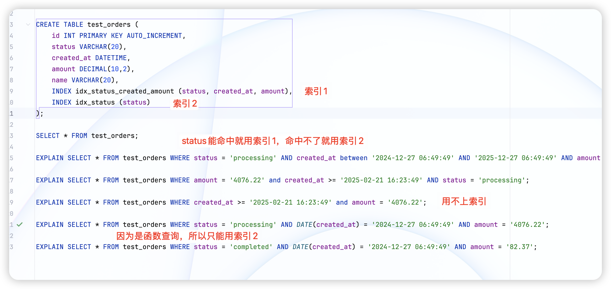

## 慢 SQL 案例及修复方案（进阶实战）


### **案例一：联合索引失效导致全表扫描**


#### **SQL 示例**

```
SELECT * FROM orders WHERE status = 'paid' AND created_at >= '2023-01-01';
```


#### **表结构**

```
CREATE TABLE orders (
  id BIGINT PRIMARY KEY,
  user_id BIGINT,
  status VARCHAR(20),
  created_at DATETIME,
  INDEX idx_status_created (status, created_at)
);
```


#### **问题分析**

虽然创建了联合索引 (status, created_at)，但执行计划显示未使用索引或只用到部分索引，查询性能非常差。


#### **原因**

如果 SQL 写成这样：

```
SELECT * FROM orders WHERE created_at >= '2023-01-01' AND status = 'paid';
```

则会失效，因为 created_at 是第二个索引列，**索引使用是有顺序依赖的**。必须先过滤前缀列。


#### **修复方案**

1. 保持查询中 WHERE 条件的字段顺序与索引一致。
2. 或者使用**覆盖索引**来避免回表（注意字段顺序）。
3. 使用 EXPLAIN 验证是否 type=range，key=idx_status_created


### **案例二：使用函数导致索引失效**


#### **SQL 示例**

```
SELECT * FROM users WHERE DATE(created_at) = '2024-08-05';
```


#### **表结构**

```
CREATE TABLE users (
  id BIGINT PRIMARY KEY,
  name VARCHAR(100),
  created_at DATETIME,
  INDEX idx_created (created_at)
);
```


#### **问题分析**

由于对 created_at 使用了函数 DATE()，索引无法生效，全表扫描。


#### **修复方案**

改写为范围查询：

```
SELECT * FROM users 
WHERE created_at >= '2024-08-05 00:00:00' 
  AND created_at < '2024-08-06 00:00:00';
```

此方式能使用索引进行范围查找（type=range），极大提升效率。


### **案例三：分页 OFFSET 过大导致慢查**


#### **SQL 示例**

```
SELECT * FROM articles ORDER BY id LIMIT 1000000, 10;
```


#### **问题分析**

- MySQL 会扫描前面 1000000 条记录再丢弃，只返回最后 10 条。
- 表越大，分页越靠后，查询越慢。


#### **修复方案**

方式一：记录上一次的 id，使用条件代替 offset

```
SELECT * FROM articles WHERE id > 1000000 ORDER BY id LIMIT 10;
```

方式二：使用 延迟关联优化分页

```
SELECT a.*
FROM (
  SELECT id FROM articles ORDER BY id LIMIT 1000000, 10
) t
JOIN articles a ON a.id = t.id;
```


### **案例四：OR 查询未优化，导致多次全表扫描**


#### **SQL 示例**

```
SELECT * FROM products WHERE category_id = 10 OR brand_id = 5;
```


#### **表结构**

```
CREATE TABLE products (
  id BIGINT PRIMARY KEY,
  name VARCHAR(100),
  category_id INT,
  brand_id INT,
  INDEX idx_category (category_id),
  INDEX idx_brand (brand_id)
);
```


#### **问题分析**

- OR 通常会让 MySQL 放弃索引，进行全表扫描。
- 即使两个字段都有索引，也可能使用不到。


#### **修复方案**

拆成 UNION ALL：

```
SELECT * FROM products WHERE category_id = 10
UNION ALL
SELECT * FROM products WHERE brand_id = 5 AND category_id != 10;
```

- 这样能使用两个索引。
- 注意防止重复（加去重条件）。


### **案例五：JOIN 多表导致临时表与 filesort**


#### **SQL 示例**

```
SELECT u.name, o.total_amount 
FROM users u
JOIN orders o ON u.id = o.user_id
WHERE o.created_at >= '2023-01-01'
ORDER BY u.name;
```


#### **问题分析**

- JOIN + ORDER BY 非连接键，导致 MySQL 创建临时表并 filesort。
- 数据量大时性能崩溃。


#### **修复方案**

1. 改变排序字段，换成 JOIN 字段或用索引排序字段。
2. 如果必须排序，可以通过业务层分批取数，避免一次性排序全表。
3. EXPLAIN 看是否出现 Using temporary; Using filesort


### **案例六：IN 查询数据过多，失去索引优化**


#### **SQL 示例**

```
SELECT * FROM users WHERE id IN (1,2,3,4,...10000);
```


#### **问题分析**

- IN 中值过多，MySQL 可能选择全表扫描而非索引。
- 导致严重性能问题。


#### **修复方案**

- 控制 IN 列表长度（如一次不超过 1000 条）
- 分批执行多次查询（分页合并结果）
- 改成临时表 JOIN 查询更高效：

```
CREATE TEMPORARY TABLE tmp_ids (id BIGINT PRIMARY KEY);
-- 批量插入 id

SELECT u.* FROM users u
JOIN tmp_ids t ON u.id = t.id;
```


### **案例七：隐式类型转换**


#### **SQL 示例**

```
SELECT * FROM users WHERE phone = 13800001111;
```


#### **表结构**

```
phone VARCHAR(20), INDEX(phone)
```


#### **问题分析**

- 查询中使用了 **数字类型字面量**，而列是 VARCHAR，MySQL 会对列进行转换！
- 导致索引失效。


#### **修复方案**

```
SELECT * FROM users WHERE phone = '13800001111';
```

保持类型一致，避免隐式转换。


### **案例八：LIKE ‘%前缀%’ 无法走索引**


#### **SQL 示例**

```
SELECT * FROM customers WHERE name LIKE '%李%';
```


#### **问题分析**

- 前缀通配符 % 开头无法使用索引，触发全表扫描。


#### **修复方案**

- 用 全文索引（FULLTEXT）
- 用 倒排索引/ElasticSearch
- 或业务端采用前缀搜索（LIKE ‘李%’）


### 案例九：count


#### SQL示例

```sql
#表里有索引status
SELECT COUNT(*) FROM orders WHERE status = 'paid';
SELECT COUNT(1) FROM orders WHERE status = 'paid';
SELECT COUNT(status) FROM orders WHERE status = 'paid';
```


#### 问题分析

| **写法**   | **含义**                                    | **回表** | **支持优化**   |
| ---------- | ------------------------------------------- | -------- | -------------- |
| COUNT(*)   | 统计结果集中所有行数（包括 NULL），不解析列 | ❌        | ✅ 最推荐       |
| COUNT(1)   | 统计所有行，但会将 1 当成一个表达式计算     | ❌        | ✅ 次推荐       |
| COUNT(col) | 统计非 NULL 的 col 值                       | 可能     | ❌ 若有回表成本 |

正常情况下推荐COUNT(*)，但是这里的例子很特殊，WHERE status = 'paid'也就意味着查询出来的行的status必定不为null，所以COUNT(status)也能得到正确的结果，并且省略了回表的那步操作，所以更快

但如果是下面这样，就不行了，因为count之后统计不为null的行数

```sql
SELECT COUNT(status) FROM orders WHERE status IS NULL;
```


## **总结：优化建议通用套路**

| **问题类型**       | **优化建议**             |
| ------------------ | ------------------------ |
| 索引未命中         | 避免函数、转换、顺序错误 |
| 大分页             | id > last_id 替代 offset |
| 联合索引未使用完全 | 查询字段顺序保持一致     |
| 多表 JOIN + 排序   | 尽量排序字段使用索引     |
| LIKE %前缀%        | 使用全文索引             |
| OR 组合            | 改写为 UNION ALL         |
| 类型不匹配         | 显式转为一致类型         |
| IN 太多            | 拆分、建临时表           |


## 示例（重点）

十万条数据的表



这是一个很明显的索引下推（ICP）。执行SQL语句时MySQL内部的优化器会重排where查询条件的顺序，所以即便没有遵守最左前缀原则，只要字段都能匹配上也会尝试使用联合索引。

以第一个SQL为例，MySQL底层会判断是使用索引1好还是索引2好，所以出现了两种情况，如果status条件能命中，则MySQL认为有下推的价值，所以使用了索引1，但如果status条件没有命中，MySQL认为不具备继续下推的价值了，所以直接放弃了索引1，使用索引2。

**背后原理：MySQL 如何选索引？**

MySQL 优化器会基于索引的 **统计信息（cardinality）** 和查询条件，计算每种索引的“预估成本”，然后选择代价最小的索引。

优化器考虑的维度包括：

| **维度**                 | **解释**                                                     |
| ------------------------ | ------------------------------------------------------------ |
| 选择性（selectivity）    | 条件过滤的精度。比如 status=‘abc’ 是一个高选择性（过滤性强）条件 |
| 行数估计（rows）         | 基于索引统计信息预估会返回多少行                             |
| 是否覆盖索引（covering） | 如果索引包含所有查询字段，则避免回表，优先选择               |
| 是否排序、聚合优化       | 索引是否能帮助减少排序或聚合开销                             |
| 索引结构复杂度           | 多列联合索引扫描范围是否大、跳跃式                           |

主要原因是：

- status='abc' 不存在，优化器判断结果行数非常少（甚至为0）
- 此时它可能认为只使用 idx_status 索引就够了
- 如果 idx_status_created_amount 在统计信息中不够“精确”或者预估的扫描成本更高，就不会选它

🔸即便从逻辑上我们觉得“用联合索引应该更精确”，但**优化器只是根据“成本估算”来决策的**，它不是按照“所有列都匹配”的数量优先。