# Oracle架构

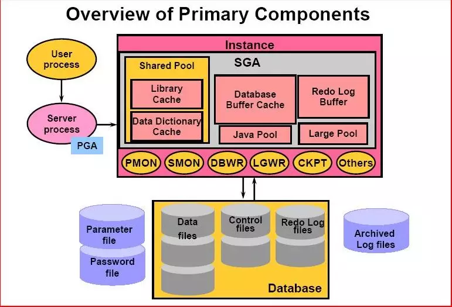


对于一个数据库系统来说，假设这个系统没有运行，我们所能看到的和这个数据库相关的无非就是几个基于操作系统的物理文件，这是从静态的角度来看,如果从动态的角度来看呢,也就是说这个数据库系统运行起来了，能够对外提供服务了，那就意外着数据库系统启动了自己的一个实例，综合以上2个角度，Oracle如何定义上述描述呢？


我们来引入第一个概念，Oracle服务器，所谓Oracle服务器是一个数据库管理系统，它包括一个Oracle实例（动态）和一个Oracle数据库（静态）。Oracle实例是一个运行的概念（如操作系统的进程），提供了一种访问，Oracle数据库的方式，始终打开一个，并且只能打开一个Oracle数据库，Oracle实例有SGA和一些后台服务进程组成，在后台服务进程当中，DBWn PMON CKPT LGWR SMON是必备的后台进程，而ad queue、rac、shared server、ad replication则是可选的，之所以可选，要们是因为离开它Oracle也能正常运行，要么是一些高级的功能才可以用得到。


Oracle数据库是一个被统一处理的的数据的集合，从物理角度来看包括三类文件数据文件，控制文件，重做日志文件。从逻辑角度来看，Oracle数据库至少包含一个表空间，表空间至少包含一个段，段由区做成，区有块组成。需要注意的是表空间可以包含若干个数据文件，段可以跨同一个表空间的多个数据文件，区只能在同一个数据文件内。


Oracle还设计了其他的关键文件用来为整个系统服务，如配置文件、密码文件、归档日志文件，还有还有用户进程和服务进程，现在可以简单理解下执行SQL语句就要用到这2个进程。

| SGA                                                          | SHARE POOL（共享池）用如下命令可以调整ALTER SYSTEM SETSHARED_POOL_SIZE=64M | LIBRARY CACHE（库高速缓存）1存储最近使用的SQL和PL/SQL语句信息2包括SHARED SQL和SHARED PL/SQL3用LRU算法管理4大小由SHARE POOL大小决定 |
| ------------------------------------------------------------ | ------------------------------------------------------------ | ------------------------------------------------------------ |
| DATA DICTIONARY CACHE（数据字典高速缓存）1数据库中最近使用的定义的集合2包含数据库文件，表，索引，列，用户，权限和其他的数据库对象相关信息3在语法分析阶段，服务器进程会在数据字典中查找用于对象解析和验证访问的信息4将数据字典信息高速缓存到内存中，可缩短查询和DML的响应时间5大小由共享池的大小决定 |                                                              |                                                              |
| DATABASE BUFFER CACHE（数据缓冲区高速缓存）                  | 1存储已从数据文件检索到的数据的复本2大幅提高读取和更新数据的性能3使用LRU算法管理4主块的大小由DB_BLOCK_SIZE确定 |                                                              |
| REDO LOG BUFFER（重做日志缓冲区）                            | 1记录对数据库数据块作的全部更改2主要用来恢复3其中记录的更改被称作重做条目4重做条目包含用于重新构建或重做更改的信息5大小由LOG_BUFFER定义 |                                                              |
| LARGE POOL（大型池）                                         | 1 SGA可选的内存区2分担了共享池的一部分工作3用于共享服务器的UGA4用于I/O服务器进程5备份和恢复操作或RMAN6并行执行消息缓冲区（前提PARALLEL_POOL_SIZE=TRUE）7不使用LRU列表8大小由LARGE_POOL_SIZE确定 |                                                              |
| JAVA POOL（JAVA池）                                          | 1存储JAVA命令服务分析要求2安装和使用JAVA时必须的3大小有JAVA_POOL_SIZE确定 |                                                              |
| PGA                                                          | PRIVATE SQL AREA（专用SQL区）专用SQL 区的位置取决于为会话建立的连接类型。在专用服务器环境中，专用SQL 区位于各自服务器进程的PGA中。在共享服务器环境中，专用SQL 区位于SGA 中。管理专用SQL 区是用户进程的职责。用户进程可以分配的专用SQL 区的数目始终由初始化参数OPEN_CURSORS 来限制。该参数的缺省值是50。 | PERSISTEN AREA（永久区）包含绑定信息，并且只在关闭游标时释放 |
| RUNTIME AREA（运行时区）在执行请求时的第一步创建。对于INSERT、UPDATE 和DELETE命令，该区在执行语句后释放，对于查询操作，该区只在提取所有行或取消查询后释放。 |                                                              |                                                              |
| SESSION MEMORY（会话内存）                                   | 包含为保留会话变量以及与该会话相关的其它信息而分配的内存。对于共享服务器环境，该会话是共享的而不是专用的。 |                                                              |
| SQL WORK AREAS（SQL工作区）                                  | 用于大量占用内存的操作，如排序、散列联接、位图合并和位图创建。工作区的大小可进行控制和调整 |                                                              |

下表是后台进程总结

| DBWn | DBWn 延迟写入数据文件,直到发生下列事件之一：• 增量或正常检查点• 灰数据缓冲区的数量达到阈值• 进程扫描指定数量的块而无法找到任何空闲缓冲区时• 出现超时• 实时应用集群(Real Application Clusters, RAC) 环境中出现ping 请求• 使一般表空间或临时表空间处于脱机状态• 使表空间处于只读模式• 删除或截断表• 执行ALTER TABLESPACE 表空间名BEGIN BACKUP 操作 |
| ---- | ------------------------------------------------------------ |
| LGWR | LGWR 在下列情况下执行从重做日志缓冲区到重做日志文件的连续写入：• 当提交事务时• 当重做日志缓冲区的三分之一填满时• 当重做日志缓冲区中记录了超过1 MB 的更改时• 在DBWn 将数据库缓冲区高速缓存中修改的块写入数据文件以前• 每隔三秒 |
| SMON | 例程恢复– 前滚重做日志中的更改– 打开数据库供用户访问– 回退未提交的事务处理• 合并空闲空间• 回收临时段 |
| PMON | 进程失败后，后台进程PMON 通过下面的方法进行清理：• 回退用户的当前事务处理• 释放当前保留的所有表锁或行锁• 释放用户当前保留的其它资源• 重新启动已失效的调度程序 |
| CKPT | • 在检查点发信号给DBWn• 使用检查点信息更新数据文件的标头• 使用检查点信息更新控制启动检查点的原因如下：• 确保定期向磁盘写入内存中发生修改的数据块，以便在系统或数据库失败时不会丢失数据• 缩短例程恢复所需的时间。只需处理最后一个检查点后面的重做日志条目以启动恢复操作• 确保提交的所有数据在关闭期间均已写入数据文件由CKPT 写入的检查点信息包括检查点位置、系统更改号、重做日志中恢复操作的起始位置以及有关日志的信息等等。注：CKPT 并不将数据块写入磁盘，或将重做块写入联机重做日志。 |
| ARCn | • 可选的后台进程• 设置ARCHIVELOG 模式时自动归档联机重做日志• 保留数据库的全部更改记录 |

最后，举一个用户提交SQL语句的的例子来结束本文，如果用户想提交SQL语句，那么首先你必须要连接到Oracle实例，连接到Oracle实例有三种途径：如果用户登陆到运行Oracle实例的操作系统上，则通过进程间通信进行访问2C/S结构访问3三层结构。发起连接的应用程序或工具通常称为用户进程，连接发起后，Oracle服务器就会创建一个进程来接受连接，这个进程就成为服务进程，服务器进程代表用户进程与Oracle实例进行通信，在专用服务器连接模式下，用户进程和服务进程是1对1的关系，在共享服务器模式下，多个用户进程可能共享一个服务进程。当服务器进程开始和Oracle实例进行通信时，一个会话就被创建了。显然处理一个查询要经过语法分析、绑定、执行、提取等阶段。


## **Oracle的基础架构知识**

笔者在学习Oracle之前，特地先去了解了OracleDB的框架。这样对Oracle数据库有一个整体的认知，有由高屋建领地的作用。磨刀不误砍菜功吧。Oracle数据库主要由一下5部分组成：


### **1. 物理结构**


Oracle物理结构由控制文件、数据文件、重做日志文件、参数文件、归档文件、口令文件组成


一个数据库中的数据存储在磁盘上物理文件，被使用时，调入内存。其中控制文件、数据文件、重做日志文件、跟踪文件及警告日志（trace files、alert files）属于数据库文件；参数文件（parameter file）口令文件（password file）是非数据库文件。


- 数据文件：存储数据的文件.数据文件典型地代表了根据他们使用的磁盘空间和数量所决定的一个Oracle数据库的容积。

​    于此我们需要知道的是，一个数据库中的数据是存储在磁盘上的物理文件，被使用时才被调入内存中的。其中控制文件、数据文件、重做日志文件、跟踪文件、警告文件属于数据库文件。参数文件、口令文件属于非数据库文件。


- 控制文件：包含维护和验证数据库完整性的必要信息、例如，控制文件用于识别数据文件和重做日志文件，一个数据库至少需要一个控制文件。控制文件内容有：
  - 数据库名
  - 表空间信息
  - 所有数据文件的名字和位置
  - 所有redo日志文件的名字和位置
  - 当前的日志序列号
  - 检查点信息
  - 关于redo日志和归档的当前状态信息

​    控制文件的使用过程是控制文件把Oracle引导到数据库文件的其它部分。启动一个实例时，Oracle从参数文件中读取控制文件的名字和位置。安装数据库时，Oracle打开控制文件。最终打开数据库时，Oracle从控制文件中读取数据文件的列表并打开其中的每个文件。

- 重做日志文件，含对数据库所做的更改记录，这样万一出现故障可以启用数据恢复。一个数据库至少需要两个重做日志文件。
- 跟踪文件及警告日志(Trace Files and Alert Files)，
  - 跟踪文件是在instance 中运行的每一个后台进程都有一个跟踪文件（trace file）与之相连。Trace file记载后台进程所遇到的重大事件的信息。
  - 警告日志（ Alert Log）是一种特殊的跟踪文件，每个数据库都有一个跟踪文件，同步记载数据库的消息和错误。
- 参数文件：包括大量影响Oracle数据库实例功能的设定，如以下设定：
  - 数据库控制文件的定位
  - Oracle用来缓存从磁盘上读取的数据的内存数量
  - 默认的优化程序的选择

​    和数据库文件相关，执行两个重要的功能，为数据库指出控制文件和为数据库指出归档日志的目标。

- 归档文件：是重做日志文件的脱机副本，这些副本可能对于从介质失败中进行恢复很必要。
- 口令文件：认证哪些用户有权限启动和关闭Oracle例程.

### **2. 逻辑结构（表空间、段、区、块）**

- 表空间：是数据库中的基本逻辑结构，一系列数据文件的集合。
- 段：是对象在数据库中占用的空间.
- 区：是为数据一次性预留的一个较大的存储空间.
- 块：ORACLE最基本的存储单位，在建立数据库的时候指定.

### **3. 内存分配（SGA和PGA）**

- SGA：是用于存储数据库信息的内存区，该信息为数据库进程所共享。它包含Oracle服务器的数据和控制信息,它是在Oracle服务器所驻留的计算机的实际内存中得以分配，如果实际内存不够再往虚拟内存中写。
- PGA：包含单个服务器进程或单个后台进程的数据和控制信息，与几个进程共享的SGA正相反，PGA 是只被一个进程使用的区域，PGA在创建进程时分配,在终止进程时回收.

### **4. 后台进程**

包括数据写进程（Database Writer,DBWR）、日志写进程（Log Writer,LGWR）、系统监控（System Monitor、SMON）、进程监控（Process Monitor、PMON）、检查点进程（Checkpoint Process、CKPT）、归档进程、服务进程、用户进程。

- 数据写进程：负责将更改的数据从数据库缓冲区高速缓存写入数据文件
- 日志写进程：将重做日志缓冲区中的更改写入在线重做日志文件
- 系统监控：检查数据库的一致性如有必要还会在数据库打开时启动数据库的恢复
- 进程监控：负责在一个Oracle 进程失败时清理资源
- 检查点进程：负责在每当缓冲区高速缓存中的更改永久地记录在数据库中时,更新控制文件和数据文件中的数据库状态信息。该进程在检查点出现时，对全部数据文件的标题进行修改，指示该检查点。在通常的情况下，该任务由LGWR执行。然而，如果检查点明显地降低系统性能时，可使CKPT进程运行，将原来由LGWR进程执行的检查点的工作分离出来，由CKPT进程实现。对于许多应用情况，CKPT进程是不必要的。只有当数据库有许多数据文件，LGWR在检查点时明显地降低性能才使CKPT运行。CKPT进程不将块写入磁盘，该工作是由DBWR完成的。 init.ora文件中CHECKPOINT_PROCESS参数控制CKPT进程的使能或使不能。缺省时为FALSE，即为使不能。
- 归档进程：在每次日志切换时把已满的日志组进行备份或归档
- 服务进程：用户进程服务。
- 用户进程：在客户端，负责将用户的SQL语句传递给服务进程，并从服务器段拿回查询数据。

### **5. SCN（System ChangeNumber）：**


- 系统改变号，一个由系统内部维护的序列号。当系统需要更新的时候自动增加，他是系统中维持数据的一致性和顺序恢复的重要标志。


## **Oracle架构实现原理、含五大进程解析**


Oracle[架构](https://so.csdn.net/so/search?q=架构&spm=1001.2101.3001.7020)，讲述了Oracle RDBMS的底层实现原理，是Oracle DBA性能调优和排错的基础理论。深入理解Oracle架构，能够让我们在Oracle的路上走的更远。本章节主要是在对RDBMS的底层组件功能和实现原理有一定的了解的情况下，结合自身的工作经验提出了对Oracle调优和排错的思路。当然，对Oracle体系结构的理解是一个深远的过程，需要不断的更新修改。


Oracle RDBMS架构图


一般我们所说的Oracle指的是Oracle RDBMS（Relational databases Management system），一套Oracle数据库管理系统，也称之为Oracle Server。而Oracle Server主要有两大部分：Oracle Server = 实例 + 数据库（Instance和Database是相互独立的）。

- 数据库 = 数据文件 + 控制文件 +日志文件
- 实例 = 内存池 + 后台进程


所以可以细分为：**Oracle Server = 内存池 + 后台进程 + 数据文件 + 控制文件 + 日志文件**


一台Oracle Server支持创建多个Database，而且每个Datacase是互相隔离而独立的。不同的Database拥有属于自己的全套相关文件，例如：有各自的密码文件，参数文件，数据文件，控制文件和日志文件。


Database由一些物理文件（如：存放在存储设备中的二维表文件）组成。二维表存储在Database中，但Database的内容不能被用户直接读取，用户必须通过Oracle instance才能够访问Database，一个Instance只能连接一个Database，但是一个Database可以被多个Instance连接。


将上面的Oracle RDBMS架构图进行抽象分类，可以将Oracle架构抽象为：Oracle体系 = 内存结构 + 进程结构 + 存储结构


              


### **内存结构**

Oracle Instance是Oracle RDBMS的核心之一，负责RDBMS的管理功能。Oracle Instance主要由内存池SGA和后台进程组成。


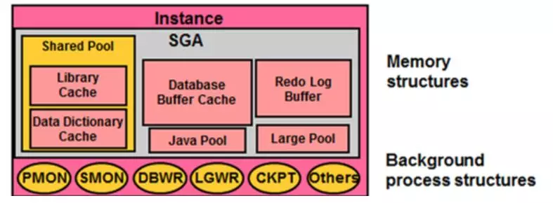


### **系统全局区SGA**


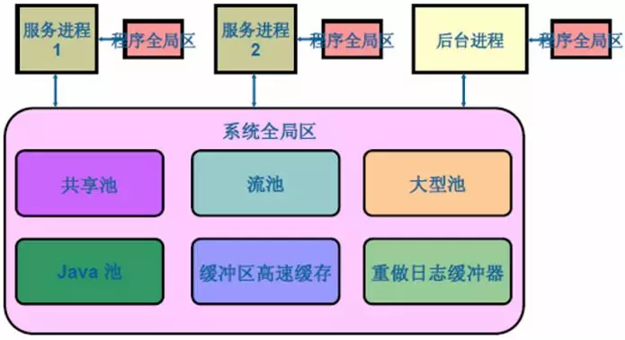


Oracle的架构不是很难也不是很容易，认真学肯定能学会。

内存池SGA的默认Size，会在安装Oracle的时候会根据LinuxOS的sysctl.conf参数文件来决定：

```properties
kernel.shmall = 2097152
kernel.shmmax = 2147483648
kernel.shmmni = 4096
kernel.sem = 250 32000 100 128
net.ipv4.ip_local_port_range = 1024 65000
net.core.rmem_default = 1048576
net.core.rmem_max = 1048576
net.core.wmem_default = 262144
net.core.wmem_max = 262144
```

**查看SGA的Size：**

```sql
SQL> conn /as sysdba
Connected.
SQL> show user;
USER is "SYS"

SQL> select * from v$sga;

NAME              VALUE

-------------------- ----------
Fixed Size      2022144

Variable Size         503317760

Database Buffers     1627389952

Redo Buffers           14753792


SQL> show sga

Total System Global Area 2147483648 bytes     #对应kernel.shmmax = 2147483648


Fixed Size          2022144 bytes

Variable Size         503317760 bytes

Database Buffers     1627389952 bytes

Redo Buffers           14753792 bytes
```


SGA（System Global Area）是与Oracle性能关系最大的核心部分，也是对Oracle进行调优的主要考量。SGA内存池会在Instance启动时被分配，在Instance关闭时被释放。在一定范围内，SGA可以在Instance运行时通过自动方式响应DBA的指令。如果想对SGA进行调优还必须理解SGA所包含如下几种数据结构：

### **高速缓存缓冲区（数据库缓冲区）**

**——**oracle执行SQL语句的区域。

例如在更新数据时，用户执行的SQL语句不会直接对磁盘上的数据文件进行更改操作，而是首先将数据文件复制到数据库缓冲区缓存（就是说数据库缓冲区里会存放着SQL相关数据文件副本），再更改应用于数据库缓冲区缓存中这些数据块的副本。而且数据块副本将在缓存中保留一段时间，直至其占用的缓冲区被另一个数据库覆盖为止（缓冲区Size有限）。

在查询数据时，为了提高执行效率，查询的数据也要经过缓存。建立的Session会计算出那些数据块包含关键的行，并将它们复制到数据库缓冲区中进行缓存。此后，相关关键行会传输到Session的PGA作进一步处理。这些数据块也会在数据库缓存区缓存中保留一段时间。

一般情况下，被频繁访问的数据块会存在于数据库缓冲区缓存中，从而最大程度地减少对磁盘I/O的需要。

那什么时候会将被更新的数据块副本写入到磁盘中的数据文件呢？


答案：如果在缓冲区缓存中存储的数据块与磁盘上的数据块不同时，那么这样的缓冲区常称为”脏缓冲区”，脏缓冲区中的数据块副本就必须写回到磁盘的数据文件中。

**调优：**数据库缓冲区缓存的大小会对性能产生至关重要的影响，具体需要多大的Size才能成为最佳配比还要结合实际的生产环境而言。总体而言可以依据以下两点基本要求来判断：


\1. 缓存应足够大，以便能缓存所有被频繁访问的数据块。如果缓存过小，那么将导致磁盘I/0活动过多，因为频繁访问的数据块持续从磁盘读取，并由其他数据块使用和重写，然后再从磁盘读取。
\2. 但也不能太大，以至于它会将极少被访问的块也一并加入到缓存中，这样会增长在缓存中搜索的时间。

数据库缓冲区缓存在Instance启动时被分配。从数据库9i开始，可以随时将其调大或调小。可以采用手动方式重调，也可以根据工作负荷自动重调大小（事务）。
修改缓冲区DB_CACHE_SIZE地方法：
 

```sql
#Step1. 查看SGA的大小：因为DB_CACHE_SIZE的size受SGA的影响

SQL> show parameter sga_max_size;

NAME                     TYPE    VALUE

------------------------------------ ----------- ------------------------------

sga_max_size                 big integer 2G


#Step2. 查看show parameter shared_pool_size的大小

SQL> show parameter shared_pool_size;                   NAME                     TYPE    VALUE

----------------------------------- ----------- ------------------------------

shared_pool_size             big integer 0

#Step3. 计算DB_CACHE_SIZE的大小：shared_pool_size + db_cache_size = SGA_MAX_SIZE * 70%

#Step4. 修改DB_CACHE_SIZE的大小

SQL> alter system set db_cache_size=1433M scope=spfile sid='demo';

System altered.

SQL> conn sys /as sysdba

Enter password: ********

Connected.


SQL> shutdown immediate

Database closed.

Database dismounted.

ORACLE instance shut down.


SQL> startup

ORACLE instance started.


Total System Global Area 2147483648 bytes

Fixed Size          2022144 bytes

Variable Size         503317760 bytes

Database Buffers     1627389952 bytes

Redo Buffers           14753792 bytes

Database mounted.

Database opened.

SQL> show parameter db_cache_size
```

### **日志缓冲区**

日志缓冲区是小型的、用于短期存储将写入到磁盘上的重做日志的变更向量的临时区域。主要作用是提供更加快的日志处理效率。


### **共享池**

共享池的大小也对性能产生重要影响:


\1. 它应该足够大，以便缓存所有频繁执行的代码和频繁访问的对象定义。如果共享池过小，则性能下降，因为服务器会话将反复抢夺其中的空间来分析语句，此后，这些语句会被其他语句重写，在重新执行时，将不得不再次分析。如果共享池小于最优容量，则性能将下降。但有一个最小容量，如果低于此限度，则语句将失败。
\2. 但也不能过大，以至于连仅执行一次的语句也要缓存。过大的共享池也会对性能产生不良影响，因为搜索需要的时间过长。

确定最优容量是一个性能调整问题，大多数数据库都需要一个数百MB的共享池。有些应用程序需要1GB以上的共享池，但很少有应用程序能够在共享池小于100MB时充分运行。共享池内有下列三种数据结构：


- 库缓冲：存储最近执行的代码
- 数据字典缓存：存储最近使用的对象定义
- PL/SQL缓冲区：存储的PL/SQL对象是过程、函数、打包的过程、打包的函数、对象类型定义和触发器。


手动的调整共享池的大小：
 

```sql
select COMPONENT,CURRENT_SIZE,MIN_SIZE,MAX_SIZE from v$sga_dynamic_components;   //显示可以动态重设大小的SGA组件的当前最大和最小容量
ALTER SYSTEM SET SHARED_POOL_SIZE = 110M;
```


### **其他结构**

大型池——主要用途是供共享的服务器进程使用。
JAVA池——只有当应用程序需要在数据库中运行java存储程序时，才需要java池。

### **进程结构**

进程结构主要有后台进程和用户连接进程两大类。


### **用户连接进程**

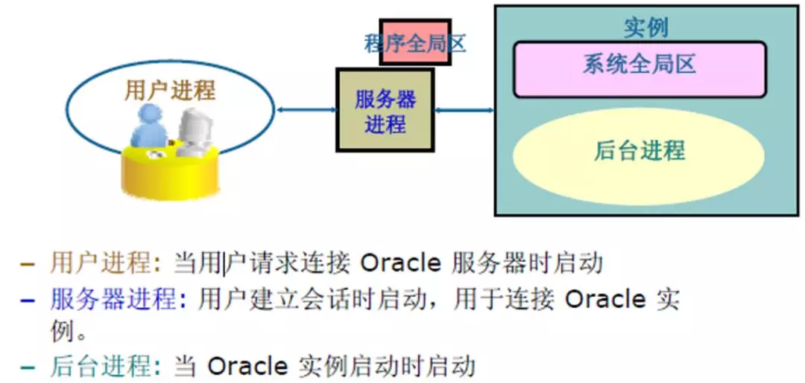


用户连接进程是连接用户和Oracle Instance的桥梁。只有在User与Instance建立了连接以后，User才能够对Oracle Server进行操作。

用户连接进程 = 用户进程 + 服务进程 + PGA


### **用户进程User Process**

当一个Database User请求连接到Oracle Server时，Oracle Server会创建User Process。


User Process的作用：


- 为Database User与Server Process建立连接
- 并不会直接与Oracle Server交互


connect连接：是User和Server Process之间的通信通道。


### **Server Process服务进程**

用于处理Database User和Oracle Server之间的连接。


当一个User与User Process建立了一个connect后，Oracle Server会创建一个Server Process。然后再由User Process与Server Process建立了连接之后，Server Process会通过用户提交的请求信息来确定与oracle instance建立一个会话。


Server Process的作用：


- 与Oracle Server直接交互
- 复制执行和返回结果


Session会话：一个用户通过User Process(本质是通过Server Process)与Oracle Instance建立连接后称之为一个会话，一个用户可以建立多个会话，即同时使用同一个用户可以多次的连接到同一个实例，也就是说多个session可以使用同一个connect。

### **程序全局区PGA**


PGA：Oracle Server Process分配来专门用于当前User Session的内存区。该区域是私有的，不同的用户拥有不同的PGA。

PGA包含了Server Process数据和控制信息的内存区域。，由下列3个部分组成：


1. 栈空间：存储Session的变量、数组等的内存空间。
2. Session Info：如果运行的不是多线程服务器，会话信息将保存在PGA中，如果是多线程服务器，则保存在SGA中。
3. 私有SQL区：用来保存绑定变量(binding variables)和运行时缓冲区(runtime buffers)等信息。

**Oracle的connect连接和session会话与User Process紧密相关**

注意：在RDBMS中由db\_name和instance\_name共同确定一个Database，所以Instance_name被用于Oracle与OS之间的联系同时也被用于Oracle Server与外部连接时使用。

所以在User提交连接请求的时候，User Process首先会与Server Process建立Connect，然后Server Process会通过请求中所包含的db\_name和Instance\_name来确定需要且可以被连接的数据库(RDBMS可以存在多个数据库)，这样就确保了RDBMS在拥有多个数据库的情况下，还能够保证每一个Database的独立性。而且同一个Database可以被多个属于这个Databse的不同用户发起的Instance连接。这一个功能是非常有必要的，因为每一个不同的数据库中都包含有同名的sys、system等系统用户。


### **后台进程**

后台进程主要是完成数据库管理任务 ，后台进程是Oracle Instance和Oracle Database的联系纽带，分为核心进程和非核心进程。


1. 核心进程：核心进程，必须存在，有一个终止，所有数据库进程全部终止，实例崩溃！其中五大进程全都是核心进程。
2. 非核心进程：完成数据库的额外功能，非核心进程死亡数据库不会崩溃！

### **常用的核心进程：**


在用户访问数据库时，首先会提交请求，再分配SGA内存，创建并启动后台进程和实例，最后建立连接和会话。**Oracle Server运行过程中必须启动上面的前五个进程。否则实例无法创建。**

查看后台进程：
 

```sql
SQL> select name,description from v$bgprocess where paddr<>'00';

NAME  DESCRIPTION

----- --------------------------------------------------------------

PMON  process cleanup

PSP0  process spawner 0

MMAN  Memory Manager

DBW0  db writer process 0

LGWR  Redo etc.

CKPT  checkpoint

SMON  System Monitor Process

RECO  distributed recovery

CJQ0  Job Queue Coordinator

QMNC  AQ Coordinator

MMON  Manageability Monitor Process


NAME  DESCRIPTION

----- ----------------------------------------------------------------

MMNL  Manageability Monitor Process 2
```

### **数据库写入进程（DBWn）**

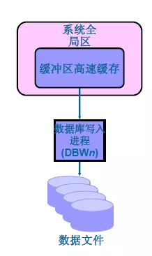


Server process连接Oracle后，通过数据库写进程(DBWn)将数据缓冲区中的“脏缓冲区”的数据块写入到存储结构（数据文件、磁盘文件）

Database writer (DBWn)数据库写进程：


- 只做一件事，将数据写到磁盘。就是将数据库的变化写入到数据文件。
- 该进程最多20 个，即使你有36 个CPU 也只能最多有20 个数据库写进程。
  进程名称DBW0-DBW9 DBWa-DBWj
- 注意：数据库写进程越多，写数据的效率越高。该进程的个数应该和cpu的个数对应，如果设置的数据库写进程数大于CPU 的个数也不会有太明显的效果，因为CPU 是分时的。


### **检查点(CKPT)**

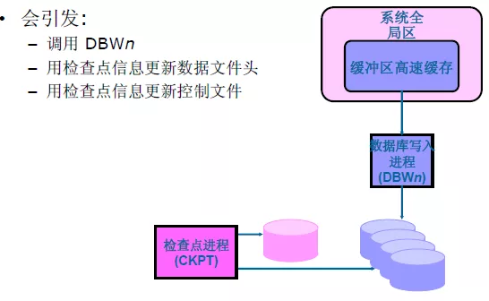


Checkpoint (CKPT)检查点进程：


- 主要用户更新数据文件头，更新控制文件和触发DBWn数据库写进程。
- Ckpt 进程会降低数据库性能，但是提高数据库崩溃时，自我恢复的性能。我们可以理解为阶段性的保存数据，一定的条件满足就触发，执行DBWn存盘操作。


### **进程监视进程（PMON）**


Process monitor（PMON）进程监测进程：


PMON在后台进程执行失败后负责清理数据库缓存和闲置资源，是Oracle的自动维护机制。


- 清除死进程
- 重新启动部分进程（如调度进程）
- 监听的自动注册
- 回滚事务
- 释放锁
- 释放其他资


### **系统监视进程（SMON）**

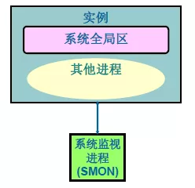


System monitor (SMON)系统监测进程：


- SMON启动后会自动的用于在实例崩溃时进行数据库实例自动恢复。
- 清除作废的排序临时段，回收整理碎片，合并空闲空间，释放临时段，维护闪回的时间点。
- 在老数据库版本中，当我们大量删除表的时候，会观测到SMON进程很忙，直到把所有的碎片空间都整理完毕。


### **重做日志文件和日志写入进程**

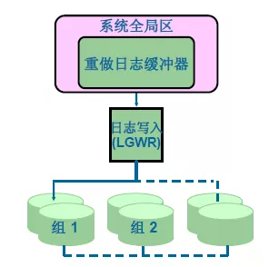


主要用于记录数据库的改变和记录数据库被改变之前的原始状态，所以应当对其作多重备份，用于恢复和排错。

激活LGWR的情况：


- 提交指令
- 日志缓冲区超过1/3
- 每三秒
- 每次DBWn执行之前

### **归档进程（ARCn）**

——是非核心进程。


### **存储结构**

Oracle RDBMS存储结构主要由Database组成。

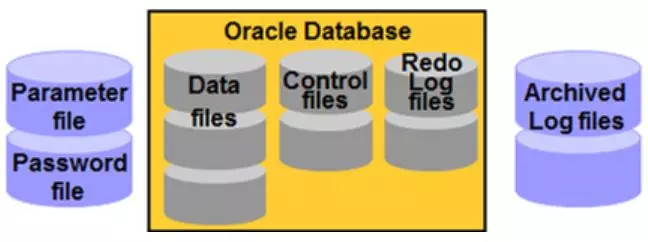
又能够将Database分为物理结构和逻辑结构来理解。

### **物理结构**

Database物理结构：是Database在操作系统中的文件集合，即：磁盘上的物理文件，主要由数据文件、控制文件、重做日志文件、归档日志文件、参数文件、口令文件组成。


### **Data Files**

数据文件是数据的存储仓库：


• 包括所有的数据库数据
• 只能属于一个数据库
• 来自于被称为”表空间”的数据库存储逻辑单元
• 可以直接被读进内存，在执行SQL语句的时候，会将相关的数据文件副本加载如数据缓冲区。
• 通过备份策略可以使数据文件得到保护
 

### **Redo Log Files**

重做日志文件包含对数据库所做的更改操作记录，在Oracle发生故障时能够恢复数据。
能够恢复数据的原理：重做日志文件会按时间的顺序，将应用于数据库的一连串的变更向量(做了什么操作)存储起来(即将变更的地方标记起来)。其中包含了所有已经完成操作的信息和完成操作之前的数据库状态。如果数据文件受损，就可以将这些变更向量应用于数据文件备份来进行重做(重建)工作，将它恢复到发生故障的那一刻前的状态。重做日志文件又分为下面两种类型：


- 联机重做日志文件：记录连续的数据库操作
- 归档日志文件Archived Log Files：用于时间点恢复，当RedoLogFiles存满时，会对这些日志进行归档备份，以便以后还原数据时使用。
  - 查看redo log info：


```bash
SQL> select member from v$logfile;    # v$logfile数据字典，记录了redolog文件的列表

 MEMBER

--------------------------------------------------------------------------------

 /u01/oradata/demo/redo03.log

 /u01/oradata/demo/redo02.log

 /u01/oradata/demo/redo01.log
```

### **Control Files**

控制文件包含维护和验证数据库完整性的必要的信息。
 

它记录了联机重做日志文件、数据文件的位置、更新的归档日志文件的位置。它还存储着维护数据库完整性所需的信息，如数据库名。控制文件是以二进制型式存储的，用户无法修改控制文件的内容。控制文件不过数MB，却起着至关重要的作用。

### **Parameter File**

实例参数文件，当启动oracle实例时，SGA结构会根据此参数文件的设置内存，后台进程会据此启动。


### **Password File**

用户通过提交username/password来建立会话，Oracle根据存储在数据字典的用户定义对用户名和口令进行验证。


### **逻辑结构**

表空间就是典型的Oracle逻辑结构类型 —— 里面存放着若干的数据文件。


表空间：用于存储数据库对象的逻辑空间，表空间是在数据库中开辟的一个空间，用于存放数据库的对象，它是信息存储的最大逻辑单位，是存放数据库文件的地方，其中数据又被存放在表空间中的数据文件中。一个数据库可以由多个表空间组成，Oracle的调优就是通过表空间来实现的。（Oracle数据库独特的高级应用）

**表空间的作用：**分类管理、批量处理； 将琐碎的磁盘文件整合、抽象处理成为逻辑结构。这样更加便于我们去管理数据库。


**逻辑空间到物理空间的映射**

段、区和块：

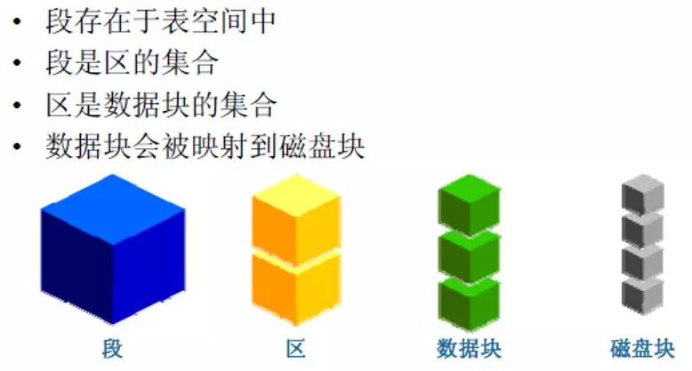


执行一条写入的SQL语句时在RDBMS中都发生了什么


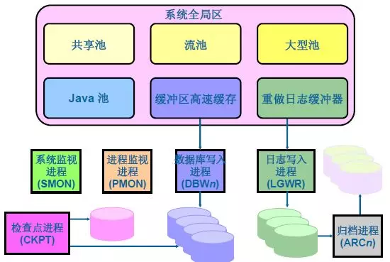


1. 将SQL语句加载入数据库缓冲区
2. 将SQL语句要操作的数据文件副本加载入数据库缓冲区
3. 执行SQL语句，修改数据文件副本，形成“脏缓冲区”
4. CKPT检测到“脏缓冲区”，调用DBWn
5. 在DBWn运行之前，先运行了LGWR，将数据文件的原始状态和数据库的改变记录到Redo Log Files
6. 运行DBWn，将“脏缓冲区的内容写入到数据文件”
7. 同时CKPT修改控制文件和数据文件头
8. SMON回收不必要的空闲资源

 

### **最后**

最后我们举个例子来看看Oracle RDBMS是怎么运作的


- User访问Oracle Server之前提交一个请求(包含了db_name、instance_name、username、password等信息)，Oracle Server接收到请求并通过Password File的验证后，分配SGA内存池，启动后台进程同时创建并启动实例。
- 在启动实例之后User Process与Server Process建立Connect。
- 再通过Server process和Oracle Instance完成建立Sesscion。
- 用户执行SQL语句，由server process接收到并直接与Oracle交互。
- SQL语句通过Server Process到达Oracle Instance，再将SQL载入数据库缓冲区。
- Server Process通知Oracle Database将与SQL语句相关的数据块副本加载到缓冲区中。
- 在数据库缓存区执行SQL语句，并产生”脏缓冲区”。
- 由CKPT检查点进程检查到”脏缓冲区”，并调用DBWn数据库写进程，但在DBWn执行之前，应该由LGWR先将数据文件的原始状态、数据库的改变等信息记录到Redo Log Files。
- 将更新的内容写入到磁盘中的数据文件。
- 返回结果给用户