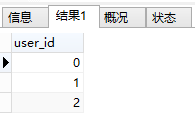
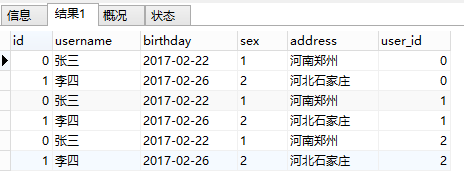
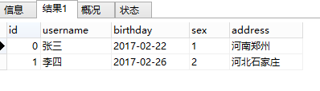
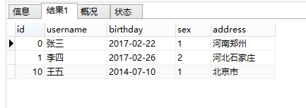

# SQL训练

数据表介绍

--1.学生表
 Student(SId,Sname,Sage,Ssex)
 --SId 学生编号,Sname 学生姓名,Sage 出生年月,Ssex 学生性别

--2.课程表
 Course(CId,Cname,TId)
 --CId 课程编号,Cname 课程名称,TId 教师编号

--3.教师表
 Teacher(TId,Tname)
 --TId 教师编号,Tname 教师姓名

--4.成绩表
 SC(SId,CId,score)
 --SId 学生编号,CId 课程编号,score 分数

## 学生表 Student

```sql
create table Student(SId varchar(10),Sname varchar(10),Sage datetime,Ssex varchar(10));
insert into Student values('01' , '赵雷' , '1990-01-01' , '男');
insert into Student values('02' , '钱电' , '1990-12-21' , '男');
insert into Student values('03' , '孙风' , '1990-12-20' , '男');
insert into Student values('04' , '李云' , '1990-12-06' , '男');
insert into Student values('05' , '周梅' , '1991-12-01' , '女');
insert into Student values('06' , '吴兰' , '1992-01-01' , '女');
insert into Student values('07' , '郑竹' , '1989-01-01' , '女');
insert into Student values('09' , '张三' , '2017-12-20' , '女');
insert into Student values('10' , '李四' , '2017-12-25' , '女');
insert into Student values('11' , '李四' , '2012-06-06' , '女');
insert into Student values('12' , '赵六' , '2013-06-13' , '女');
insert into Student values('13' , '孙七' , '2014-06-01' , '女');
```

## 科目表 Course

```sql
create table Course(CId varchar(10),Cname nvarchar(10),TId varchar(10));
insert into Course values('01' , '语文' , '02');
insert into Course values('02' , '数学' , '01');
insert into Course values('03' , '英语' , '03');
```

## 教师表 Teacher

```sql
create table Teacher(TId varchar(10),Tname varchar(10));
insert into Teacher values('01' , '张三');
insert into Teacher values('02' , '李四');
insert into Teacher values('03' , '王五');
```

## 成绩表 SC

```sql
create table SC(SId varchar(10),CId varchar(10),score decimal(18,1));
insert into SC values('01' , '01' , 80);
insert into SC values('01' , '02' , 90);
insert into SC values('01' , '03' , 99);
insert into SC values('02' , '01' , 70);
insert into SC values('02' , '02' , 60);
insert into SC values('02' , '03' , 80);
insert into SC values('03' , '01' , 80);
insert into SC values('03' , '02' , 80);
insert into SC values('03' , '03' , 80);
insert into SC values('04' , '01' , 50);
insert into SC values('04' , '02' , 30);
insert into SC values('04' , '03' , 20);
insert into SC values('05' , '01' , 76);
insert into SC values('05' , '02' , 87);
insert into SC values('06' , '01' , 31);
insert into SC values('06' , '03' , 34);
insert into SC values('07' , '02' , 89);
insert into SC values('07' , '03' , 98);
```

# 练习题目

1. 查询" 01 "课程比" 02 "课程成绩高的学生的信息及课程分数

   ```sql
   select student.*, r.`01score`, r.`02score` from student right join (
       select * from 
                     (select score as '01score', SId as '01SId' from sc where CId = '01') t1,
                     (select score as '02score', SId as '02SId' from sc where CId = '02') t2 
       where 01SId = 02SId and 01score > 02score) r 
   on student.SId = r.01SId
   ```

   1.1 查询同时存在" 01 "课程和" 02 "课程的情况

   ```sql
   select t1SId, t1CId, t2CId from (
                 select SId as 't1SId', CId as 't1CId' from sc where CId = '01') t1
               , (select SId as 't2SId', CId as 't2CId' from sc where CId = '02') t2
   where t1SId = t2SId
   ```

   1.2 查询存在" 01 "课程但可能不存在" 02 "课程的情况(不存在时显示为 null )

   ``` sql
   select t1SId, t1CId, t2CId from 
       (select SId as 't1SId', CId as 't1CId' from sc where CId = '01') as t2 
       left join
       (select SId as 't2SId', CId as 't2CId' from sc where CId = '02') as t1 
   on t1SId = t2SId
   ```

   1.3 查询不存在" 01 "课程但存在" 02 "课程的情况

   ```sql
   select SId from sc where SId not in (
       select SId from sc where CId = '01'
   )and sc.CId = '02'
   ```

   

2. 查询平均成绩大于等于 60 分的同学的学生编号和学生姓名和平均成绩

   ```sql
   select student.Sname, t1.avgsc from student right join (
       select SId, avg(score) as avgsc from sc group by SId having avg(score) >= 60) t1
   on student.SId = t1.SId
   order by t1.avgsc desc
   ```

   

3. 查询在 SC 表存在成绩的学生信息

   ```sql
   select student.* from student right join (select SId from sc group by SId) t1 on t1.SId = student.SId;
   
   select student.* from student where SId in (select SId from sc group by SId);
   
   select student.* from student where exists(select * from sc where student.SId = sc.SId);
   
   --三种写法
   ```

   

4. 查询所有同学的学生编号、学生姓名、选课总数、所有课程的总成绩(没成绩的显示为 null )

   ```sql
   select student.SId, student.Sname, count(sc.CId) as '选课总数', sum(sc.score) as '课程总成绩' 
   from student 
       left join sc 
           on student.SId = sc.SId 
   group by student.SId
   ```

5. 查询「李」姓老师的数量

   ```sql
   select count(*) as '姓李老师总和' from teacher where Tname like '李%'
   ```

   

6. 查询学过「张三」老师授课的同学的信息

   ```sql
   select * from student where SId in (
       select sc.SId from sc where exists(
           select course.CId from course
               left join teacher on course.TId = teacher.TId where teacher.Tname = '张三'
           and sc.CId = course.CId
       )
   )
   ```

   

7. 查询没有选全所有课程的同学的信

   ```sql
   select * from student where not exists(
       select sc.SId from sc where sc.SId = student.SId
       group by SId having count(sc.CId) = (select count(*) from course)
   );
   ```

   

8. 查询至少有一门课与学号为" 01 "的同学所学相同的同学的信息

   ```sql
   select * from student where exists(
       select SId from sc 
       where sc.SId = student.SId 
         and sc.CId in (select CId from sc where SId = '01') 
         and sc.SId != '01' 
       group by sc.SId
   )
   ```

   

9. 查询和" 01 "号的同学学习的课程   完全相同的其他同学的信息

   ```sql
   #完全没思路
   ```

   

10. 查询没学过"张三"老师讲授的任一门课程的学生姓名

    ```sql
    select * from student where not exists(
        select * from sc
        where CId in 
              (select CId from course where TId = (select TId from teacher where Tname = '张三')) 
          and student.SId = sc.SId
        group by SId
    )
    ```

    

11. 查询两门及其以上不及格课程的同学的学号，姓名及其平均成绩

    ```sql
    select student.*, t1.avg 
    from student
        right join (select s.SId, avg(s.score) as avg from sc s where SId in
        (select SId from sc where score< 60 group by SId having count(score) >= 2) group by s.SId) t1 
            on student.SId = t1.SId
    ```

    

12. 检索" 01 "课程分数小于 60，按分数降序排列的学生信息

    ```sql
    select student.*, s.Cid, s.score from student
        right join sc s on student.SId = s.SId
    where s.CId = '01' and s.score < 60 order by score desc
    ```

    

13. 按平均成绩从高到低显示所有学生的所有课程的成绩以及平均成绩

    ```sql
    select sc.SId, sc.CId, sc.score, t1.avg from sc
        left join
        (select SId, avg(score) as avg from sc group by SId) t1
            on sc.SId = t1.SId
    order by t1.avg desc
           , t1.SId
    ```

    

14. 查询各科成绩最高分、最低分和平均分：

    以如下形式显示：课程 ID，课程 name，最高分，最低分，平均分，及格率，中等率，优良率，优秀率

    及格为>=60，中等为：70-80，优良为：80-90，优秀为：>=90

    要求输出课程号和选修人数，查询结果按人数降序排列，若人数相同，按课程号升序排列

    ```sql
    select CId
        , count(SId) as peopleNum
        , max(score) as max
        , min(score) as min
        , sum(case when sc.score>=60 then 1 else 0 end )/count(*) as 及格率
        , sum(case when sc.score>=70 and sc.score<80 then 1 else 0 end )/count(*)as 中等率
        , sum(case when sc.score>=80 and sc.score<90 then 1 else 0 end )/count(*)as 优良率
        , sum(case when sc.score>=90 then 1 else 0 end )/count(*)as 优秀率
    from sc group by CId
    ```

    

15. 按各科成绩进行排序，并显示排名， Score 重复时保留名次空缺

    ```sql
    
    ```

    15.1 按各科成绩进行排序，并显示排名， Score 重复时合并名次

    ```sql
    
    ```

    

16. 查询学生的总成绩，并进行排名，总分重复时保留名次空缺

    

    16.1 查询学生的总成绩，并进行排名，总分重复时不保留名次空缺

    

17. 统计各科成绩各分数段人数：课程编号，课程名称，[100-85]，[85-70]，[70-60]，[60-0] 及所占百分比

    

18. 查询各科成绩前三名的记录

    

19. 查询每门课程被选修的学生数

    

20. 查询出只选修两门课程的学生学号和姓名

    

21. 查询男生、女生人数

    

22. 查询名字中含有「风」字的学生信息

    

23. 查询同名同性学生名单，并统计同名人数

    

24. 查询 1990 年出生的学生名单

    

25. 查询每门课程的平均成绩，结果按平均成绩降序排列，平均成绩相同时，按课程编号升序排列

    

26. 查询平均成绩大于等于 85 的所有学生的学号、姓名和平均成绩

    

27. 查询课程名称为「数学」，且分数低于 60 的学生姓名和分数

    

28. 查询所有学生的课程及分数情况（存在学生没成绩，没选课的情况）

    

29. 查询任何一门课程成绩在 70 分以上的姓名、课程名称和分数

    

30. 查询不及格的课程

    

31. 查询课程编号为 01 且课程成绩在 80 分以上的学生的学号和姓名

    

32. 求每门课程的学生人数

    

33. 成绩不重复，查询选修「张三」老师所授课程的学生中，成绩最高的学生信息及其成绩

    

34. 成绩有重复的情况下，查询选修「张三」老师所授课程的学生中，成绩最高的学生信息及其成绩

    

35. 查询不同课程成绩相同的学生的学生编号、课程编号、学生成绩

    

36. 查询每门功成绩最好的前两名

    

37. 统计每门课程的学生选修人数（超过 5 人的课程才统计）。

    

38. 检索至少选修两门课程的学生学号

    

39. 查询选修了全部课程的学生信息

    

40. 查询各学生的年龄，只按年份来算

    

41. 按照出生日期来算，当前月日 < 出生年月的月日则，年龄减一

    

42. 查询本周过生日的学生

    

43. 查询下周过生日的学生

    

44. 查询本月过生日的学生

    

45. 查询下月过生日的学生


9,11,13,14,23,29

# in与exists

## in

确定给定的值是否与子查询或列表中的值相匹配。in在查询的时候，首先查询子查询的表，然后将内表和外表做一个笛卡尔积，然后按照条件进行筛选。所以相对内表比较小的时候，in的速度较快。

```sql
SELECT
    *
FROM
    `user`
WHERE
    `user`.id IN (
        SELECT
            `order`.user_id
        FROM
            `order`
    )
```

它的执行流程是什么样子的呢？让我们一起来看一下。

　　　　首先，在数据库内部，查询子查询，执行如下代码：

```sql
 SELECT
	`order`.user_id
FROM
	`order`
```

（用户只有两个id分别是0、1，订单表里有三条数据，购买者id分别是0、1、2）

执行完毕后，得到结果如下：

　

此时，将查询到的结果和原有的user表做一个笛卡尔积，结果如下：



　此时，再根据我们的user.id IN order.user_id的条件，将结果进行筛选（既比较id列和user_id 列的值是否相等，将不相等的删除）。最后，得到两条符合条件的数据。



 二、select * from A where id in(select id from B)

以上查询使用了in语句,in()只执行一次,它查出B表中的所有id字段并缓存起来.之后,检查A表的id是否与B表中的id相等,如果相等则将A表的记录加入结果集中,直到遍历完A表的所有记录. 它的查询过程类似于以下过程

List resultSet=[]; Array A=(select * from A); Array B=(select id from B);
for(int i=0;i<A.length;i++) {   for(int j=0;j<B.length;j++) {    if(A[i].id==B[j].id) {      resultSet.add(A[i]);      break;    }   } } return resultSet;

可以看出,当B表数据较大时不适合使用in(),因为它会B表数据全部遍历一次. 如:A表有10000条记录,B表有1000000条记录,那么最多有可能遍历10000×1000000次,效率很差. 再如:A表有10000条记录,B表有100条记录,那么最多有可能遍历10000×100次,遍历次数大大减少,效率大大提升.

**结论:in()适合B表比A表数据小的情况**

## exists

　　一、指定一个子查询，检测行的存在。遍历循环外表，然后看外表中的记录有没有和内表的数据一样的。匹配上就将结果放入结果集中。

　　　　具体sql语句如下：

```sql
SELECT
    `user`.*
FROM
    `user`
WHERE
    EXISTS (
        SELECT
            `order`.user_id
        FROM
            `order`
        WHERE
            `user`.id = `order`.user_id
    )
```

这条sql语句的执行结果和上面的in的执行结果是一样的。

　但是，不一样的是它们的执行流程完全不一样：

　　　　使用exists关键字进行查询的时候，首先，我们先查询的不是子查询的内容，而是查我们的主查询的表，也就是说，我们先执行的sql语句是：

```sql
 SELECT `user`.* FROM `user` 
```

得到的结果如下：



然后，根据表的每一条记录，执行以下语句，依次去判断where后面的条件是否成立：

```sql
EXISTS (
        SELECT
            `order`.user_id
        FROM
            `order`
        WHERE
            `user`.id = `order`.user_id
    )
```

如果成立则返回true不成立则返回false。如果返回的是true的话，则该行结果保留，如果返回的是false的话，则删除该行，最后将得到的结果返回。

　　二、select a.* from A a where exists(select 1 from B b where a.id=b.id)

以上查询使用了exists语句,exists()会执行A.length次,它并不缓存exists()结果集,因为exists()结果集的内容并不重要,重要的是结果集中是否有记录,如果有则返回true,没有则返回false. 它的查询过程类似于以下过程

List resultSet=[]; Array A=(select * from A)
for(int i=0;i<A.length;i++) {   if(exists(A[i].id) {  //执行select 1 from B b where b.id=a.id是否有记录返回     resultSet.add(A[i]);   } } return resultSet;

当B表比A表数据大时适合使用exists(),因为它没有那么遍历操作,只需要再执行一次查询就行. 如:A表有10000条记录,B表有1000000条记录,那么exists()会执行10000次去判断A表中的id是否与B表中的id相等. 如:A表有10000条记录,B表有100000000条记录,那么exists()还是执行10000次,因为它只执行A.length次,可见B表数据越多,越适合exists()发挥效果. 再如:A表有10000条记录,B表有100条记录,那么exists()还是执行10000次,还不如使用in()遍历10000*100次,因为in()是在内存里遍历比较,而exists()需要查询数据库,我们都知道查询数据库所消耗的性能更高,而内存比较很快.

**结论:exists()适合B表比A表数据大的情况**

**当A表数据与B表数据一样大时,in与exists效率差不多,可任选一个使用.**

## **IN 和 EXISTS 的区别**

### **基本语义**

- **IN**：检查某个值是否在一个给定的列表（或子查询返回的结果集）中。

```
SELECT * FROM emp WHERE deptno IN (SELECT deptno FROM dept WHERE loc = 'NEW YORK');
```

- **EXISTS**：判断子查询是否返回行，返回 true/false。

```
SELECT * FROM emp e WHERE EXISTS (SELECT 1 FROM dept d WHERE d.loc = 'NEW YORK' AND e.deptno = d.deptno);
```

### **处理机制**

- **IN**：先执行子查询，生成结果集，然后把外层值和结果集进行匹配（通常用哈希表/二叉树优化）。
- **EXISTS**：外层表的每一行，都会去执行子查询，子查询只要返回行就算匹配成功。

### 性能差异

- 如果**外层表小，内层表大**，通常 EXISTS 性能好，因为它只需要匹配到一行就退出。
- 如果**内层表小，外层表大**，通常 IN 更合适。
- **当子查询结果很大**时，EXISTS 可能比 IN 快。
- **当子查询结果很小**时，IN 通常更高效。

### 空值影响

- IN 遇到空值（NULL）时，匹配行为可能受到影响（如 IN (1, NULL)），而 EXISTS 不受 NULL 影响。

**总结**

- 外层表小 + 内层表大 → EXISTS。
- 内层表小 → IN。
- 子查询无空值 → IN 简洁，性能好。
- 子查询可能返回空值 → EXISTS 稳妥。

## **DISTINCT 和 GROUP BY 的区别**

### **语义**

- **DISTINCT**：用于去除结果集中的重复行。

```
SELECT DISTINCT deptno FROM emp;
```

- **GROUP BY**：用于把结果集分组（可配合聚合函数，如 COUNT、SUM 等）。

```
SELECT deptno, COUNT(*) FROM emp GROUP BY deptno;
```

### **本质关系**

- 如果 GROUP BY 只对某一列做分组，而不包含聚合函数，效果和 DISTINCT 一样。

```
-- 下面两个查询效果相同
SELECT DISTINCT deptno FROM emp;
SELECT deptno FROM emp GROUP BY deptno;
```

- 但 GROUP BY 本身是为了分组聚合，而不是简单去重。比如：

```
SELECT deptno, AVG(sal) FROM emp GROUP BY deptno;
```

### **性能**

- 对于简单去重，DISTINCT 通常更简洁，数据库优化器会直接使用唯一索引或哈希操作。
- GROUP BY 需要执行分组操作，涉及到排序或哈希分组。

**总结**

- 只是去重 → DISTINCT 简单高效。
- 需要分组统计 → GROUP BY 必须。
