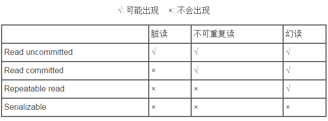

# 数据库基础

## 基础

### 事务的四大特性

#### 原子性（Atomicity）

　　原子性是指事务包含的所有操作要么全部成功，要么全部失败回滚，这和前面两篇博客介绍事务的功能是一样的概念，因此事务的操作如果成功就必须要完全应用到数据库，如果操作失败则不能对数据库有任何影响。

#### 一致性（Consistency）

　　一致性是指事务必须使数据库从一个一致性状态变换到另一个一致性状态，也就是说一个事务执行之前和执行之后都必须处于一致性状态。

　　拿转账来说，假设用户A和用户B两者的钱加起来一共是5000，那么不管A和B之间如何转账，转几次账，事务结束后两个用户的钱相加起来应该还得是5000，这就是事务的一致性。

#### 隔离性（Isolation）

　　隔离性是当多个用户并发访问数据库时，比如操作同一张表时，数据库为每一个用户开启的事务，不能被其他事务的操作所干扰，多个并发事务之间要相互隔离。

　　即要达到这么一种效果：对于任意两个并发的事务T1和T2，在事务T1看来，T2要么在T1开始之前就已经结束，要么在T1结束之后才开始，这样每个事务都感觉不到有其他事务在并发地执行。

　　关于事务的隔离性数据库提供了多种隔离级别，稍后会介绍到。

#### 持久性（Durability）

　　持久性是指一个事务一旦被提交了，那么对数据库中的数据的改变就是永久性的，即便是在数据库系统遇到故障的情况下也不会丢失提交事务的操作。

　　例如我们在使用JDBC操作数据库时，在提交事务方法后，提示用户事务操作完成，当我们程序执行完成直到看到提示后，就可以认定事务以及正确提交，即使这时候数据库出现了问题，也必须要将我们的事务完全执行完成，否则就会造成我们看到提示事务处理完毕，但是数据库因为故障而没有执行事务的重大错误。

**在介绍数据库提供的各种隔离级别之前，我们先看看如果不考虑事务的隔离性，会发生的几种问题：**

**脏读**

> 　　脏读是指在一个事务处理过程里读取了另一个未提交的事务中的数据。
>
> 　　当一个事务正在多次修改某个数据，而在这个事务中这多次的修改都还未提交，这时一个并发的事务来访问该数据，就会造成两个事务得到的数据不一致。例如：用户A向用户B转账100元，对应SQL命令如下
>
> ```
>     update account set money=money+100 where name=’B’;  (此时A通知B)
> 
>     update account set money=money - 100 where name=’A’;
> ```
>
> 当只执行第一条SQL时，A通知B查看账户，B发现确实钱已到账（此时即发生了脏读），而之后无论第二条SQL是否执行，只要该事务不提交，则所有操作都将回滚，那么当B以后再次查看账户时就会发现钱其实并没有转。

**不可重复读**

> 　　不可重复读是指在对于数据库中的某个数据，一个事务范围内多次查询却返回了不同的数据值，这是由于在查询间隔，被另一个事务修改并提交了。
>
> 　　例如事务T1在读取某一数据，而事务T2立马修改了这个数据并且提交事务给数据库，事务T1再次读取该数据就得到了不同的结果，发送了不可重复读。
>
> 　　不可重复读和脏读的区别是，脏读是某一事务读取了另一个事务未提交的脏数据，而不可重复读则是读取了前一事务提交的数据。
>
> 　　在某些情况下，不可重复读并不是问题，比如我们多次查询某个数据当然以最后查询得到的结果为主。但在另一些情况下就有可能发生问题，例如对于同一个数据A和B依次查询就可能不同，A和B就可能打起来了……

**虚读(幻读)**

> 　　幻读是事务非独立执行时发生的一种现象。例如事务T1对一个表中所有的行的某个数据项做了从“1”修改为“2”的操作，这时事务T2又对这个表中插入了一行数据项，而这个数据项的数值还是为“1”并且提交给数据库。而操作事务T1的用户如果再查看刚刚修改的数据，会发现还有一行没有修改，其实这行是从事务T2中添加的，就好像产生幻觉一样，这就是发生了幻读。
>
> 　　幻读和不可重复读都是读取了另一条已经提交的事务（这点就脏读不同），所不同的是不可重复读查询的都是同一个数据项，而幻读针对的是一批数据整体（比如数据的个数）。

### 隔离级别

现在来看看MySQL数据库为我们提供的四种隔离级别：

　　① Serializable (串行化)：可避免脏读、不可重复读、幻读的发生。

　　② Repeatable read (可重复读)：可避免脏读、不可重复读的发生。

　　③ Read committed (读已提交)：可避免脏读的发生。

　　④ Read uncommitted (读未提交)：最低级别，任何情况都无法保证。

 

　　以上四种隔离级别最高的是Serializable级别，最低的是Read uncommitted级别，当然级别越高，执行效率就越低。像Serializable这样的级别，就是以锁表的方式(类似于Java多线程中的锁)使得其他的线程只能在锁外等待，所以平时选用何种隔离级别应该根据实际情况。在MySQL数据库中默认的隔离级别为Repeatable read (可重复读)。

　　在MySQL数据库中，支持上面四种隔离级别，默认的为Repeatable read (可重复读)；而在Oracle数据库中，只支持Serializable (串行化)级别和Read committed (读已提交)这两种级别，其中默认的为Read committed级别。



**第1级别：Read Uncommitted(读取未提交内容)**
(1)所有事务都可以看到其他未提交事务的执行结果
(2)本隔离级别很少用于实际应用，因为它的性能也不比其他级别好多少
(3)该级别引发的问题是——脏读(Dirty Read)：读取到了未提交的数据

```sql
#首先，修改隔离级别
set tx_isolation='READ-UNCOMMITTED';
select @@tx_isolation;
+------------------+
| @@tx_isolation   |
+------------------+
| READ-UNCOMMITTED |
+------------------+

#事务A：启动一个事务
start transaction;
select * from tx;
+------+------+
| id   | num  |
+------+------+
|    1 |    1 |
|    2 |    2 |
|    3 |    3 |
+------+------+

#事务B：也启动一个事务(那么两个事务交叉了)
       在事务B中执行更新语句，且不提交
start transaction;
update tx set num=10 where id=1;
select * from tx;
+------+------+
| id   | num  |
+------+------+
|    1 |   10 |
|    2 |    2 |
|    3 |    3 |
+------+------+

#事务A：那么这时候事务A能看到这个更新了的数据吗?
select * from tx;
+------+------+
| id   | num  |
+------+------+
|    1 |   10 |   --->可以看到！说明我们读到了事务B还没有提交的数据
|    2 |    2 |
|    3 |    3 |
+------+------+

#事务B：事务B回滚,仍然未提交
rollback;
select * from tx;
+------+------+
| id   | num  |
+------+------+
|    1 |    1 |
|    2 |    2 |
|    3 |    3 |
+------+------+

#事务A：在事务A里面看到的也是B没有提交的数据
select * from tx;
+------+------+
| id   | num  |
+------+------+
|    1 |    1 |      --->脏读意味着我在这个事务中(A中)，事务B虽然没有提交，但它任何一条数据变化，我都可以看到！
|    2 |    2 |
|    3 |    3 |
+------+------+
```

**第2级别：Read Committed(读取提交内容)**

(1)这是大多数数据库系统的默认隔离级别（但不是MySQL默认的）
(2)它满足了隔离的简单定义：一个事务只能看见已经提交事务所做的改变
(3)这种隔离级别出现的问题是——不可重复读(Nonrepeatable Read)：不可重复读意味着我们在同一个事务中执行完全相同的select语句时可能看到不一样的结果。
   |——>导致这种情况的原因可能有：(1)有一个交叉的事务有新的commit，导致了数据的改变;(2)一个数据库被多个实例操作时,同一事务的其他实例在该实例处理其间可能会有新的commit

```sql
#首先修改隔离级别
set tx_isolation='read-committed';
select @@tx_isolation;
+----------------+
| @@tx_isolation |
+----------------+
| READ-COMMITTED |
+----------------+

#事务A：启动一个事务
start transaction;
select * from tx;
+------+------+
| id   | num  |
+------+------+
|    1 |    1 |
|    2 |    2 |
|    3 |    3 |
+------+------+

#事务B：也启动一个事务(那么两个事务交叉了)
       在这事务中更新数据，且未提交
start transaction;
update tx set num=10 where id=1;
select * from tx;
+------+------+
| id   | num  |
+------+------+
|    1 |   10 |
|    2 |    2 |
|    3 |    3 |
+------+------+

#事务A：这个时候我们在事务A中能看到数据的变化吗?
select * from tx; --------------->
+------+------+                |
| id   | num  |                |
+------+------+                |
|    1 |    1 |--->并不能看到！  |
|    2 |    2 |                |
|    3 |    3 |                |
+------+------+                |——>相同的select语句，结果却不一样
                                  |
#事务B：如果提交了事务B呢?            |
commit;                           |
                                  |
#事务A:                            |
select * from tx; --------------->
+------+------+
| id   | num  |
+------+------+
|    1 |   10 |--->因为事务B已经提交了，所以在A中我们看到了数据变化
|    2 |    2 |
|    3 |    3 |
+------+------+
```

**第3级别：Repeatable Read(可重读)**
(1)这是MySQL的默认事务隔离级别
(2)它确保同一事务的多个实例在并发读取数据时，会看到同样的数据行
(3)此级别可能出现的问题——幻读(Phantom Read)：当用户读取某一范围的数据行时，另一个事务又在该范围内插入了新行，当用户再读取该范围的数据行时，会发现有新的“幻影” 行
(4)InnoDB和Falcon存储引擎通过多版本并发控制(MVCC，Multiversion Concurrency Control)机制解决了该问题

```sql
#首先，更改隔离级别
set tx_isolation='repeatable-read';
select @@tx_isolation;
+-----------------+
| @@tx_isolation  |
+-----------------+
| REPEATABLE-READ |
+-----------------+

#事务A：启动一个事务
start transaction;
select * from tx;
+------+------+
| id   | num  |
+------+------+
|    1 |    1 |
|    2 |    2 |
|    3 |    3 |
+------+------+

#事务B：开启一个新事务(那么这两个事务交叉了)
       在事务B中更新数据，并提交
start transaction;
update tx set num=10 where id=1;
select * from tx;
+------+------+
| id   | num  |
+------+------+
|    1 |   10 |
|    2 |    2 |
|    3 |    3 |
+------+------+
commit;

#事务A：这时候即使事务B已经提交了,但A能不能看到数据变化？
select * from tx;
+------+------+
| id   | num  |
+------+------+
|    1 |    1 | --->还是看不到的！(这个级别2不一样，也说明级别3解决了不可重复读问题)
|    2 |    2 |
|    3 |    3 |
+------+------+

#事务A：只有当事务A也提交了，它才能够看到数据变化
commit;
select * from tx;
+------+------+
| id   | num  |
+------+------+
|    1 |   10 |
|    2 |    2 |
|    3 |    3 |
+------+------+
```

**第4级别：Serializable(可串行化)**
(1)这是最高的隔离级别
(2)它通过强制事务排序，使之不可能相互冲突，从而解决幻读问题。简言之,它是在每个读的数据行上加上共享锁。
(3)在这个级别，可能导致大量的超时现象和锁竞争

```sql
#首先修改隔离界别
set tx_isolation='serializable';
select @@tx_isolation;
+----------------+
| @@tx_isolation |
+----------------+
| SERIALIZABLE   |
+----------------+

#事务A：开启一个新事务
start transaction;

#事务B：在A没有commit之前，这个交叉事务是不能更改数据的
start transaction;
insert tx values('4','4');
ERROR 1205 (HY000): Lock wait timeout exceeded; try restarting transaction
update tx set num=10 where id=1;
ERROR 1205 (HY000): Lock wait timeout exceeded; try restarting transaction
```

### 传播行为

1、PROPAGATION_REQUIRED：如果当前没有事务，就创建一个新事务，如果当前存在事务，就加入该事务，该设置是最常用的设置。

2、PROPAGATION_SUPPORTS：支持当前事务，如果当前存在事务，就加入该事务，如果当前不存在事务，就以非事务执行。‘

3、PROPAGATION_MANDATORY：支持当前事务，如果当前存在事务，就加入该事务，如果当前不存在事务，就抛出异常。

4、PROPAGATION_REQUIRES_NEW：创建新事务，无论当前存不存在事务，都创建新事务。

5、PROPAGATION_NOT_SUPPORTED：以非事务方式执行操作，如果当前存在事务，就把当前事务挂起。

6、PROPAGATION_NEVER：以非事务方式执行，如果当前存在事务，则抛出异常。

7、PROPAGATION_NESTED：如果当前存在事务，则在嵌套事务内执行。如果当前没有事务，则执行与PROPAGATION_REQUIRED类似的操作。

## JDBC连接数据源

JDBC根据数据源关键字获取数据源信息类的方法

```java
//org.springframework.jdbc.datasource.lookup.AbstractRoutingDataSource 
//该类主要负责存储默认数据源信息、额外的多个数据源信息、
//根据提供的数据源信息关键字去resolvedDataSources（HashMap）中获取DataSource类等功能，通过继承该类并重写其中的主要方法
protected DataSource determineTargetDataSource() {
    Assert.notNull(this.resolvedDataSources, "DataSource router not initialized");
    Object lookupKey = determineCurrentLookupKey();
    DataSource dataSource = this.resolvedDataSources.get(lookupKey);
    if (dataSource == null && (this.lenientFallback || lookupKey == null)) {
        dataSource = this.resolvedDefaultDataSource;
    }
    if (dataSource == null) {
        throw new IllegalStateException("Cannot determine target DataSource for lookup key 
                                        [" + lookupKey + "]");
    }
    return dataSource;
}

/**
* Determine the current lookup key. This will typically be
* implemented to check a thread-bound transaction context.
* <p>Allows for arbitrary keys. The returned key needs
* to match the stored lookup key type, as resolved by the
* {@link #resolveSpecifiedLookupKey} method.
*/
//使用者可以继承AbstractRoutingDataSource类并且重写此方法来自定义获取数据源信息关键字的方法
@Nullable
protected abstract Object determineCurrentLookupKey();
```

具体步骤：

1. 将要连接的数据库连接信息关键字存放在线程的ThreadLocal中
2. 运行determineTargetDataSource()，通过数据库连接信息关键字去AbstractRoutingDataSource类维护的resolvedDataSources（HashMap）中查询是否存有dataSource对象，如果有则返回，如果没有则使用默认的dataSource（这就是为什么项目启动时必须要有数据库连接信息并且能够连接通）
3. 调用获取到的dataSource.getConnection()方法，获取连接，因为dataSource是个接口所以具体的实现要看使用的是什么连接池
