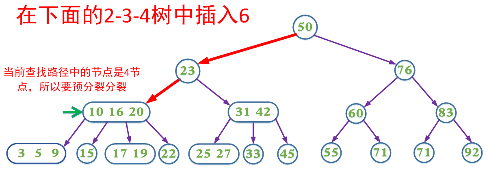

# 234树到红黑树

## 2-3-4 树

### 2-3-4树的定义

2-3-4树是一种阶为4的B树。它是一种自平衡的数据结构，可以保证在O(lgn)的时间内完成查找、插入和删除操作。它主要满足以下性质：

（1）每个节点每个节点有1、2或3个key，分别称为2（孩子）节点，3（孩子）节点，4（孩子）节点。

（2）所有叶子节点到根节点的长度一致（也就是说叶子节点都在同一层）。

（3）每个节点的key从左到右保持了从小到大的顺序，两个key之间的子树中所有的

key一定大于它的父节点的左key，小于父节点的右key。

### 插入操作

（1）如果2-3-4树中已存在当前插入的key，则插入失败，否则最终一定是在叶子节点中进行插入操作

（2）如果待插入的节点不是4节点，那么直接在该节点插入

（3）如果待插入的节点是个4节点，那么应该先分裂该节点然后再插入。一个4节点可以分裂成一个根节点和两个子节点（这三个节点各含一个key）然后在子节点中插入，我们把分裂形成的根节点中的key看成向上层插入的key，然后重复第2步和第3步。

   如果是在4节点中进行插入，每次插入会多出一个分支，如果插入操作导致根节点分裂，则2-3-4树会生长一层。

2-3-4树(b树)都是自下向上生长的

------

------

------

------

### 删除操作

（1）如果2-3-4树中不存在当前需要删除的key，则删除失败。

（2）如果当前需要删除的key不位于叶子节点上，则用后继key覆盖，然后在它后继

key所在的子支中删除该后继key。

（3）如果当前需要删除的key位于叶子节点上:

       （3.1）该节点不是2节点，删除key，结束
    
       （3.2）该节点是2节点，删除该节点：
    
              （3.2.1）如果兄弟节点不是2节点，则父节点中的key下移到该节点，兄弟节点中的一个key上移
    
             （3.2.2）如果兄弟节点是2节点，父节点是个3节点或4节点，父节点中的key与兄弟节点合并
    
             （3.2.3）如果兄弟节点是2节点，父节点是个2节点，父节点中的key与兄弟节点中的key合并，形成一个3节点，把此节点看成当前节点（此节点实际上是下一层的节点），重复步骤3.2.1到3.2.3

   如果是在2节点（叶子节点）中进行删除，每次删除会减少一个分支，如果删除操作导致根节点参与合并，则2-3-4树会降低一层。

------

------

------

### 带有预分裂的插入操作

上面的插入以及删除操作在某些情况需要不断回溯来调整树的结构以达到平衡。为了消除回溯过程，在插入操作过程中我们可以采取预分裂的操作，即我们在插入的搜索路径中，遇到4节点就分裂（分裂后形成的根节点的key要上移，与父节点中的key合并）这样可以保证找到需要插入节点时可以直接插入（即该节点一定不是4节点）

------

 

------

------

------

------

### 带有预合并的删除操作

在删除过程中，我们同样可以采取预合并的操作，即我们在删除的搜索路径中（除根节点，因为根节点没有兄弟节点和父节点），遇到当前节点是2节点，如果兄弟节点也是2节点就合并（该节点的父节点中的key下移，与自身和兄弟节点合并）；如果兄弟节点不是2节点，则父节点的key下移，兄弟节点中的key上移。这样可以保证，找到需要删除的key所在的节点时可以直接删除（即要删除的key所在的节点一定不是2节点）。

------

这里包含key为60的节点也可以选择让父节点中的key 76下移和兄弟节点中的83合并，两种方式都能达到B树的平衡，这也是在2-3-4树对应的[红黑树](https://so.csdn.net/so/search?q=红黑树&spm=1001.2101.3001.7020)中使用的方式。

------

------

------

## 红黑树

### 红黑树的定义

2-3-4树和红黑树是完全等价的，由于绝大多数编程语言直接实现2-3-4树会非常繁琐，所以一般是通过实现红黑树来实现替代2-3-4树，而红黑树本也同样保证在O(lgn)的时间内完成查找、插入和删除操作。

红黑树是每个节点都带有颜色属性的平衡二叉查找树 ，颜色为红色或黑色。除了二叉查找树一般要求以外，对于任何有效的红黑树我们增加了如下的额外要求:

（1） 节点是要么红色或要么是黑色。

（2） 根一定是黑色节点。

（3） 每个叶子结点都带有两个空的黑色结点（称之为NIL节点，它又被称为黑哨兵）。

（4） 每个红色节点的两个子节点都是黑色（或者说从每个叶子到根的所有路径上不能有两个连续的红色节点）。

（5） 从任一节点到它所能到达得叶子节点的所有简单路径都包含相同数目的黑色节点。

这些性质保证了根节点到任意叶子节点的路径长度，最多相差一半（因为路径上的黑色节点相等，差别只是不能相邻的红色节点个数），所以红黑树是一个基本平衡的二叉搜索树，它没有AVL树那么绝对平衡，但是同样的关键字组成的红黑树相比AVL旋转操作要少，而且删除操作也比AVL树效率更高，实际应用效果也比AVL树更出众。当然红黑树的具体实现也复杂的多。

黑哨兵节点的作用:

红黑树的这5个性质中，第3点是比较难理解的，但它却非常有必要。我们看上面这张图，如果不使用黑哨兵，它完全满足红黑树性质，根结点5到两个叶结点1和叶结点9路径上的黑色结点数都为3个，且没有连续红色节点。

但如果加入黑哨兵后，叶结点的个数变为8个黑哨兵，根结点5到这8个叶结点路径上的黑高度就不一样了，所以它并不是一棵红黑树。NIL节点的存在还可以使得红黑树在代码实现方面得到简化，在具体实现过程中我们只需要1个NIL节点即可

为了简化代码和减少不必要的开销，在具体的实现中我们定义一个伪根节点ROOT且只定义一个NIL节点。伪根节点的左子支永远指向NIL节点，NIL节点的左右子支又指向它自身。伪根节点的右子支才表示真正的红黑树。(jdk中treemap的实现,貌似没有用到黑哨兵节点)

 

红黑树的所有性质其实都可以从2-3-4树来理解，这也是理解红黑树最好的方式，因为红黑树本质就是2-3-4树。

### 2-3-4树和红黑树的等价关系

如果一棵树满足红黑树，把红结点收缩到其父结点，就变成了2-3-4树，所有红色节点都与其父节点构成3或4节点，其它节点为2节点。图中NIL节点未画出。

所以红黑树的每一类型操作都与2-3-4树一一对应。黑色节点的个数（或者说位置）对应2-3-4树中的节点个数（或者说位置），这样可以很好的理解性质4（从每个叶子到根的所有路径上不能有两个连续的红色节点）和性质5（从任一节点到它所能到达得叶子节点的所有简单路径都包含相同数目的黑色节点）以及根节点到任意叶子节点的路径长度，最多相差一半。

同时我们还需要明白的是，一颗红黑树对应唯一形态的2-3-4树，但是一颗2-3-4树可以对应多种形态的红黑树（主要是3节点可以对应两种不同的红黑树形态），上图中的2-3-4树还可以对应下图中的红黑树。我们在后面红黑树的删除操作中会利用这种情况。

### 红黑树中旋转的定义

因为每种书中对旋转的定义不一致，所以我们有必要在这里特此说明一下。以某一个节点为轴，它的左子枝顺时针旋转，作为新子树的根，我们称之为顺时针旋转（clockwise）或者右旋转。同理，以某一个节点为轴，它的右子枝逆针旋转，作为新子树的根，我们称之为逆时针旋转（anticlockwise）或者左旋转。

#### 红黑树的插入操作

（1）如果红黑树中已存在待插入的值，那么插入操作失败，否则一定是在叶子节点进行插入操作，执行步骤2。

（2）当我们插入一个新节点后，我们会把该节点涂红（涂红操作，从2-3-4树的的角度看来，就是向上层节点进位一个key），由于插入操作可能破坏了红黑树的平衡性，所以我们需要不断回溯，进行调整。调整过程就是颜色变换和旋转操作，而这些操作都可以从2-3-4树来理解。考虑到回溯的情况，从2-3-4树的角度，我们可以把X节点看成向上层进位的key。

插入新节点时，我们可能会遇到以下几种情况 

4.1 黑父

插入后直接涂红，如果父亲节点是个黑色，插入结束。

绿色箭头表示插入的位置，上图中的虚线表示可以有该节点，也可以没有该节点，如果有，一定是红色。当然还有可能在对称的情况，即在右子支插入，操作方式都是一样的，由于不涉及到旋转操作，所以代码的实现方式也一样，不在赘述。

这个操作可以从2-3-4树来理解，相当于2-3-4树中待插入的叶子节点是个2节点（对应黑父没有孩子节点）或者3节点（黑父有孩子节点，孩子节点的颜色一定是红色）。在回溯调整的过程中也会遇到这个情况，回溯时X表示的是下一层向上进位的key，到这个时候就不需要继续回溯了。

4.2 红父黑叔

这种情况还有对应的镜像情况，即P为G的右子支情况

**这种情况不会在叶子节点出现 (貌似也会出现在叶子节点中????)，但是会出现在回溯调整的过程中。**这种情况相当于2-3-4树中，容纳进位的父节点为3节点，还有空间可以容纳key，所以到此就不用继续回溯了。

4.3 红父红叔

这种情况相当于2-3-4树中，向上进位的父节点为4节点，所以先分裂（对应P和B的颜色变换）然后再插入X，然后继续回溯，把G看成向更上一层进位的节点（即把G看成新的X）。

这种情况还有对应的镜像情况，即P为G的右子支情况，但在具体的代码实现过程中，因为不涉及到旋转操作，所以不用区分。

#### 红黑树的删除操作

删除操作可以概括为以下几个步骤：

（1）查找要删除的值所在的节点，如果不存在，删除失败，否则执行步骤2

（2）如果要删除的节点不是叶子节点，用要删除节点的后继节点替换（只进行数据替换即可，颜色不变，此时也不需要调整结构），然后删除后继节点。

那么真正需要删除的节点有以下几种可能性

5.1要删除节点为红色

5.2要删除的节点为黑色，且有一个孩子节点，这个孩子节点必然为红色

5.3要删除的节点为黑色，孩子节点都NIL

这时，我们删除这个黑色节点后需要进行调整，在图中X总表示下一层的节点，一开始X表示NIL节点（回溯过程中X会不断向上层迭代）。需要调整的情况又可以分为以下几种。

5.3.1黑兄红侄

这种情况还有对应的镜像情况，即P为G的右子支情况

上述两种情况大致对应2-3-4树删除操作中兄弟节点为3节点或4节点，父节点key下移，兄弟节点key上移动，但不完全一致。

5.3.2黑兄黑侄红父

上述两种情况都对应2-3-4树删除操作中兄弟节点为2节点，父节点至少是个3节点，父节点key下移与兄弟节点合并。

5.3.3黑兄黑侄黑父

对应2-3-4树删除操作中兄弟节点为2节点，父亲节点也为2节点，父节点key下移与兄弟节点合并，已父节点看成新的X，继续回溯。

 

5.3.4红兄（黑侄黑父）

按照2-3-4删除操作的原理，我们这里应该检测黑侄R（第二幅图中是L）的两个孩子节点是否存在红色节点（对应2-3-4树，是否是2节点），但这样做使用的局部变量也会增多，代码实现起来也会变得非常复杂。我们这里做了一个技巧性处理，以P为轴进行旋转，它原理就是第2部分2-3-4树和红黑树的等价关系中讲到的：一颗2-3-4对应的红黑树形态并不唯一。

上面的两种红兄情况，旋转后对应的还是同一颗2-3-4树（只是B和P组成的3节点在红黑树的两种不同形态而已），但此时X的兄弟节点和侄子节点发生变化，现在X的兄弟节点就变成了R（第二幅图中是L），我们正需检查要R（第二幅图中是L）的两个孩子节点的颜色。实际上，此时我们又回到上面讨论过的了黑兄的情况。