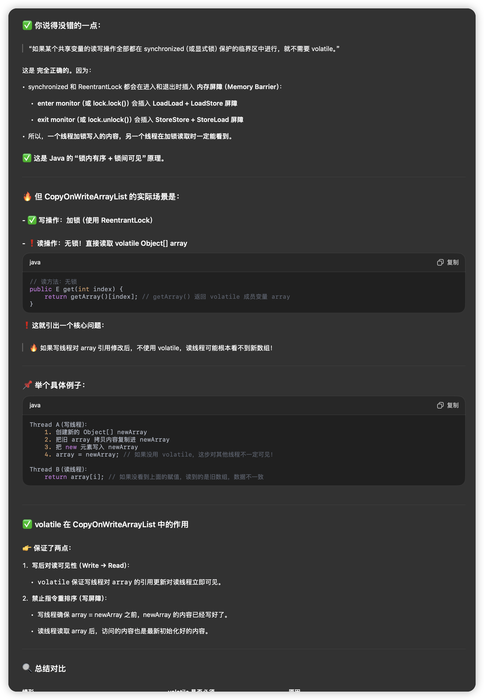

## **一、ArrayList**

### **1. 底层结构**

- 本质上是一个**可变长数组**。
- 核心字段：

```java
transient Object[] elementData; // 存储数据的数组
private int size;               // 实际元素个数
```


### **2. 构造器**

```java
// 初始容量默认为 0，第一次 add 会扩容到默认容量 10
public ArrayList() {
    this.elementData = DEFAULTCAPACITY_EMPTY_ELEMENTDATA;
}
```

```java
public ArrayList(int initialCapacity) {
    if (initialCapacity > 0) {
        this.elementData = new Object[initialCapacity]; // ✅立刻初始化
    } else if (initialCapacity == 0) {
        this.elementData = EMPTY_ELEMENTDATA;
    } else {
        throw new IllegalArgumentException("Illegal Capacity: " + initialCapacity);
    }
}
```


### **3. add(E e)**

```java
public boolean add(E e) {
    ensureCapacityInternal(size + 1); // 扩容判断
    elementData[size++] = e;
    return true;
}
```


#### **ensureCapacityInternal()**

```java
private void ensureCapacityInternal(int minCapacity) {
    if (elementData == DEFAULTCAPACITY_EMPTY_ELEMENTDATA) {
        minCapacity = Math.max(DEFAULT_CAPACITY, minCapacity); // 默认扩容到10
    }
    ensureExplicitCapacity(minCapacity);
}
```


#### **ensureExplicitCapacity()**

```java
private void ensureExplicitCapacity(int minCapacity) {
    modCount++;
    if (minCapacity - elementData.length > 0) {
        grow(minCapacity);
    }
}
```


### **4. grow(int minCapacity) — 核心扩容逻辑**

```java
private void grow(int minCapacity) {
    int oldCapacity = elementData.length;
    int newCapacity = oldCapacity + (oldCapacity >> 1); // 扩容为 1.5 倍
    if (newCapacity - minCapacity < 0)
        newCapacity = minCapacity;
    elementData = Arrays.copyOf(elementData, newCapacity);
}
```

#### **特点**

- **扩容方式**：1.5 倍（Java 6 是 1.5x，Java 8 也是）
- Arrays.copyOf() 是一个原始数组拷贝过程，复杂度 O(n)


### **5. get(int index)**

```java
public E get(int index) {
    rangeCheck(index);
    return elementData(index); // 强转 Object → E
}
```

```java
private void rangeCheck(int index) {
    if (index >= size)
        throw new IndexOutOfBoundsException(outOfBoundsMsg(index));
}
```


## **二、LinkedList**

### **1. 底层结构**

- **双向链表**结构。
- 每个节点是一个 Node<E> 对象：

```java
private static class Node<E> {
    E item;
    Node<E> next;
    Node<E> prev;
}
```

- 维护两个指针：

```java
transient Node<E> first;
transient Node<E> last;
```


### **2. 构造器**

```java
public LinkedList() {
}
```


### **3. add(E e)**

```java
public boolean add(E e) {
    linkLast(e);
    return true;
}
```


#### **linkLast(E e)**

```java
void linkLast(E e) {
    final Node<E> l = last;
    final Node<E> newNode = new Node<>(l, e, null);
    last = newNode;
    if (l == null)
        first = newNode;
    else
        l.next = newNode;
    size++;
    modCount++;
}
```

#### **特点**

- 尾插操作是 O(1)
- 会维护 last 指针，方便快速插入尾部


### **4. get(int index)**

```java
public E get(int index) {
    return node(index).item;
}
```


#### **node(int index)**

```java
Node<E> node(int index) {
    if (index < (size >> 1)) {
        Node<E> x = first;
        for (int i = 0; i < index; i++)
            x = x.next;
        return x;
    } else {
        Node<E> x = last;
        for (int i = size - 1; i > index; i--)
            x = x.prev;
        return x;
    }
}
```

```
索引：     0   1   2   3   4   5
         ┌───┬───┬───┬───┬───┬───┐
first → [A]→[B]→[C]→[D]→[E]→[F] ← last
         ↑   ↑   ↑   ↑   ↑   ↑
         0   1   2   3   4   5
```

为什么要判断 index 在前半段还是后半段？

这是为了**优化链表遍历速度**：

- 链表不能像数组那样通过 elementData[index] 直接访问，只能从某个节点开始**一个一个跳 next 或 prev**。
- 所以：
  - 如果 index 比较小（靠近头部），就从 first 向后遍历。
  - 如果 index 比较大（靠近尾部），就从 last 向前遍历。
- 减少跳指针的次数！


#### **特点**

- 访问速度：查找时会判断靠近头还是尾，从两端遍历优化
- 时间复杂度仍为 O(n)


## **三、CopyOnWriteArrayList**

顾名思义：写时复制，如果有写操作就会弄一个新的elementData，都拷贝完了之后再替换引用，并且需要volatile修饰已确保读取线程能第一时间读取到最新的结果。

### **1. 底层结构**

- 本质是一个**线程安全的数组列表**，适合**读多写少**场景。
- 核心字段：

```java
private transient volatile Object[] array;
```


### **2. 实现思想**

- 所有修改操作（add、remove 等）都 **复制一份新数组**，改完后替换旧数组引用。
- 读操作不加锁，直接读 volatile array。


### **3. add(E e)**

```java
public boolean add(E e) {
    final ReentrantLock lock = this.lock;
    lock.lock();
    try {
        Object[] elements = getArray();
        int len = elements.length;
        Object[] newElements = Arrays.copyOf(elements, len + 1);
        newElements[len] = e;
        setArray(newElements); // 替换引用
        return true;
    } finally {
        lock.unlock();
    }
}
```


### **4. get(int index)**

```java
public E get(int index) {
    return getArray(index);
}
```

